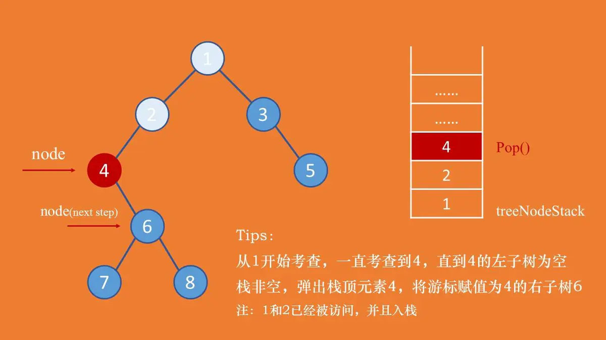
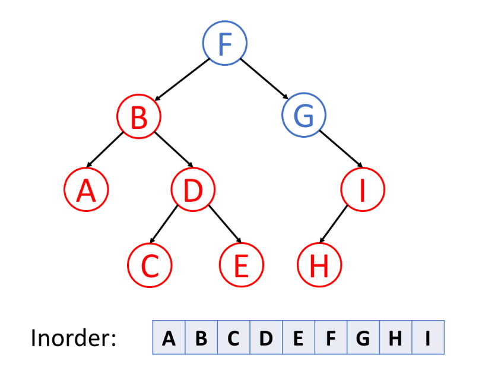
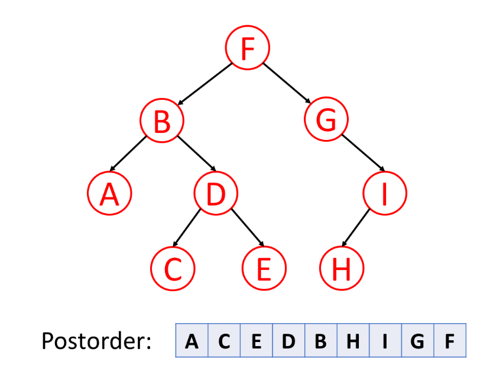
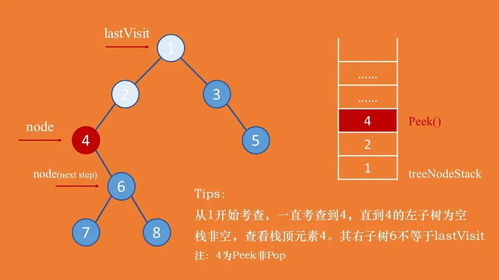
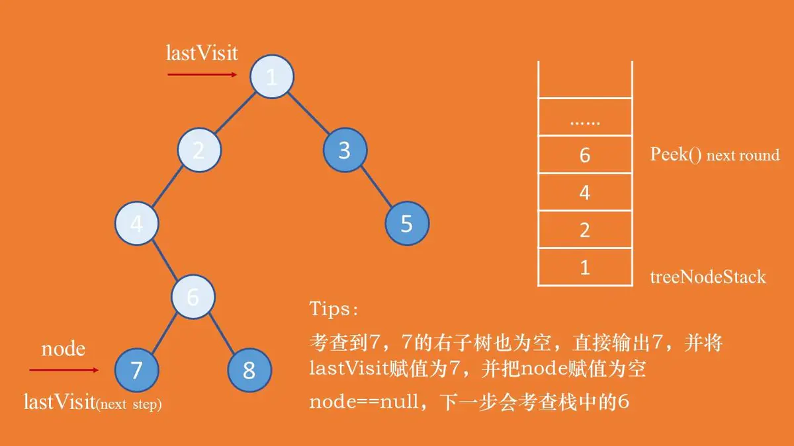
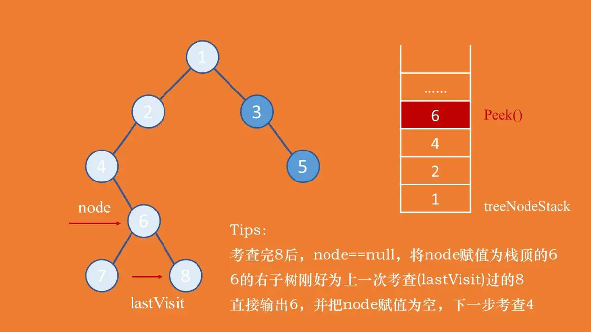
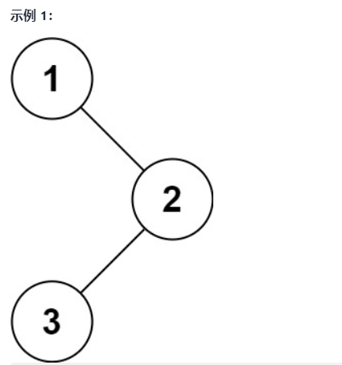
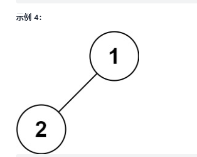
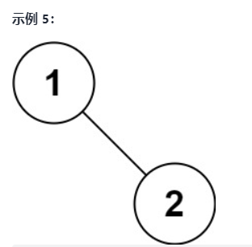
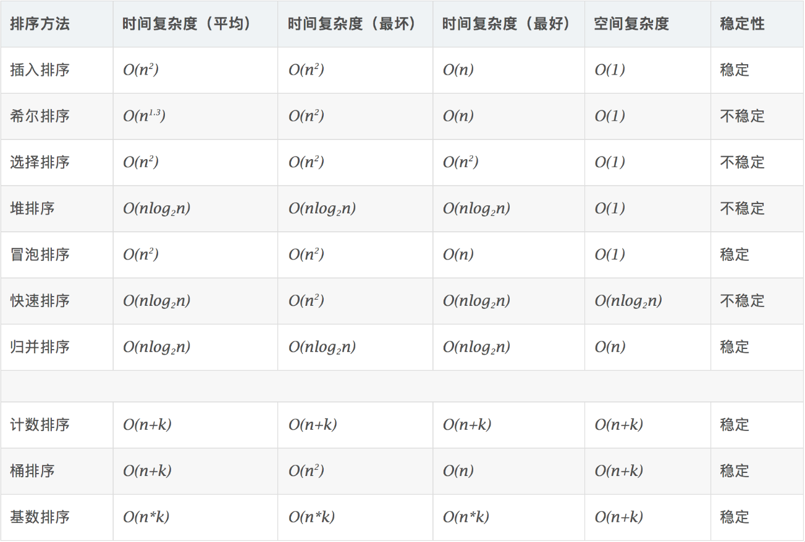

## 算法

### 树的遍历

总结
前序：根左右；中序：左根右；后序：左右根； 

#### 首先给出二叉树节点类

```php
class TreeNode {
    public $val;
    //左子树
    public  $left;
    //右子树
    public 	$right;
    //构造方法
    function __construct($x) {
       $this->val = $x;
    }
}
```


#### 1. 前序遍历

​	首先访问根节点，然后遍历左子树，最后遍历右子树


##### 递归实现前序遍历

先输出节点的值，再递归遍历左右子树

```php
public function recursionTree($tree) {
  	// 判断节点是否为空
  	if ($root != null) {
         	echo $tree->val . ' '; // 输出结果
      		recursionTree($tree->left); //遍历 左节点b
      		recursionTree($tree->right); // 右节点遍历
    }
}
```

##### 非递归前序遍历

因为要在遍历完节点的左子树后接着遍历节点的右子树，为了能找到该节点，需要使用**栈**来进行暂存。中序和后序也都涉及到回溯，所以都需要用到**栈**。

##### 

```php
public function preorderTree($tree) {
  	// 定义一个暂时存放节点的数组，模仿栈
  	$arr = [];
  	// 新建游标节点为跟节点
 		$node = $tree;
  	// 当遍历最后一个节点的时候，无论它的左右子树都为空，并且存放节点的数组也为空
  	// 所以，只要不同时满足这两点，都需要进入循环
  	while ($node != null || !empty($arr)) {
      	// 当前节点非空，输出值
      	// 由于遍历顺序得知，需要一直往左走
      	while ($node != null) {
          	echo $node->val . " ";
          	// 为了之后找到该节点的右子树，暂存该节点
          	array_push($arr, $node);
          	$node = $node->left;
        }
      
      	// 一直到左子树为空，则开始遍历右子树
      	// 如果数组为空，就不需要在考虑
      	// 弹出数组(模仿的栈)头部元素，将游标等于改节点的右子树
      	if (!empty($arr)) {
          	$node = array_pop($arr);
          	$node = $node->right;
        }
    }
}
```


#### 2. 中序遍历

 先遍历左子树，然后访问根节点，然后遍历右子树。 



##### 递归实现中序遍历

```php
public function recursionMiddleTree($tree) {
  	if ($tree != null) {
      		recursionMiddleTree($tree->left)
         	echo $tree->val . ' ';
      		recrusionMiddleTree($tree->right);
    }
}
```

##### 非递归实现中序遍历

```php
public function recursionMiddleTree($tree) {
  	// 定义一个数组，模仿实现栈
  	$arr = [];
  	// 先建一个游标指向跟节点
  	$node = $tree;
  	// 当节点不为空，或者栈数组不为空时，继续遍历
  	while ($node != null || !empty($arr)) {
      	// 先遍历左子树，将其放到栈数组中，直到其为空
      	while ($node != null) {
          	// 将当前节点放入到栈数组中，方便之后遍历右子树
          	array_push($arr, $node);
          	$node = $node->left;
        }
      
      	// 遍历右子树
      	if (!empty($node)) {
          	// 出栈
          	$node = array_pop($arr);
          	echo $node->val . ' ';
          	$node = $node->right;
        }
    }
}
```


#### 3. 后序遍历

 先遍历左子树，然后遍历右子树，最后访问树的根节点。 



##### 递归实现后序遍历

```php
public function recursionTree($tree) {
  	if ($tree != null) {
      	recursionTree($tree->left);
      	recursionTree($tree->right);
      	echo $tree->val . ' ';
    }
}
```

##### 非递归实现后序遍历

后续遍历和先序、中序遍历不太一样。

后序遍历在决定是否可以输出当前节点的值的时候，需要考虑其左右子树是否都已经遍历完成。

所以需要设置一个**lastVisit游标**。

若lastVisit等于当前考查节点的右子树，表示该节点的左右子树都已经遍历完成，则可以输出当前节点。

并把lastVisit节点设置成当前节点，将当前游标节点node设置为空，下一轮就可以访问栈顶元素。

**否者，需要接着考虑右子树，node = node.right。**

以下考虑后序遍历中的三种情况：



​																										

如上图所示，从节点1开始考查直到节点4的左子树为空。

注：此时的游标节点node = 4.left == null。

此时需要从栈中**查看 array**栈顶元素。

发现节点4的右子树非空，需要接着考查右子树，4不能输出，node = node.right。





如上图所示，考查到节点7(7.left == null，7是从栈中弹出)，其左右子树都为空，可以直接输出7。

此时需要把lastVisit设置成节点7，并把游标节点node设置成null，下一轮循环的时候会考查栈中的节点6。




如上图所示，考查完节点8之后(lastVisit == 节点8)，将游标节点node赋值为栈顶元素6，节点6的右子树正好等于节点8。表示节点6的左右子树都已经遍历完成，直接输出6。

此时，可以将节点直接从栈中弹出Pop()，之前用的只是array[0]。

将游标节点node设置成null。

```php
public function postorderTree($tree) {
  	// 创建一个栈数组，用于存放节点信息
  	$arr = [];
  	// 游标节点指向跟节点
  	$node = $tree;
  	// 后序遍历在决定是否可以输出当前节点的值的时候，需要考虑其左右子树是否都已经遍历完成。所以需要设置一个lastVisit游标。
  	$lastVisit = $tree;
  	
  	while ($node != null || !empty($arr)) {
      	// 左子树遍历,并将节点存入栈数组
      	while ($node != null) {
          	array_push($arr, $node);
          	$node = $node->left;
        }
      
      	// 查看当前栈顶元素
      	$node = $arr[0];
      	
      	// 如果其右子树也为空，或者右子树已经访问
      	// 则可以输出当前节点的值
      	if ($node->right == null || $node->right = $lastVisit) {
          	echo $node->val . " ";
          	$node = array_pop($arr);
          	$lastVisit = $node;
          	$node = null;
        } else {
          	// 否则，继续遍历右子树
          	$node = $node->right;
        }
    }
}
```


#### 二叉树的前序遍历



```bash
输入：root = [1,null,2,3]
输出：[1,2,3]
```



```bash
输入：root = [1,2]
输出：[1,2]
```




```bash
输入：root = [1,null,2]
输出：[1,2]
```




### 冒泡算法

算法描述

- 比较相邻的元素。如果第一个比第二个大，就交换它们两个；
- 对每一对相邻元素作同样的工作，从开始第一对到结尾的最后一对，这样在最后的元素应该会是最大的数；
- 针对所有的元素重复以上的步骤，除了最后一个；
- 重复步骤1~3，直到排序完成。

```php
function bubbleSort(array $arr) :array {
    $len = count($arr);
    for ($i = 0; $i < $len - 1; $i++) {
        for ($j = $i + 1; $j < $len - 1; $j++) {
            if ($arr[$i] > $arr[$j]) {
                $tmp = $arr[$i];
                $arr[$i] = $arr[$j];
                $arr[$j] = $tmp;
            }
        }
    }
    return $arr;
}
```

###  选择排序

 原理：首先在未排序序列中找到最小（大）元素，存放到排序序列的起始位置，然后，再从剩余未排序元素中继续寻找最小（大）元素，然后放到已排序序列的末尾。以此类推，直到所有元素均排序完毕。  

 算法描述

n个记录的直接选择排序可经过n-1趟直接选择排序得到有序结果。具体算法描述如下：

- 初始状态：无序区为R[1..n]，有序区为空；
- 第i趟排序(i=1,2,3…n-1)开始时，当前有序区和无序区分别为R[1..i-1]和R(i..n）。该趟排序从当前无序区中-选出关键字最小的记录 R[k]，将它与无序区的第1个记录R交换，使R[1..i]和R[i+1..n)分别变为记录个数增加1个的新有序区和记录个数减少1个的新无序区；
- n-1趟结束，数组有序化了。

```php
function selectSort(array $arr) :array {
    $len = count($arr);
    $minIndex = 0; $tmp = 0;
    for ($i = 0; $i < $len - 1; $i++) {
        $minIndex = $i;
        for ($j = $i + 1; $j < $len; $j++) {
            if ($arr[$j] < $arr[$minIndex]) {
                $minIndex = $j;
            }
        }
        $tmp = $arr[$i];
        $arr[$i] = $arr[$minIndex];
        $arr[$minIndex] = $tmp;
    }
    return $arr;
}
```

### 插入排序

 原理是通过构建有序序列，对于未排序数据，在已排序序列中从后向前扫描，找到相应位置并插入。 

算法描述

一般来说，插入排序都采用in-place在数组上实现。具体算法描述如下：

- 从第一个元素开始，该元素可以认为已经被排序；
- 取出下一个元素，在已经排序的元素序列中从后向前扫描；
- 如果该元素（已排序）大于新元素，将该元素移到下一位置；
- 重复步骤3，直到找到已排序的元素小于或者等于新元素的位置；
- 将新元素插入到该位置后；
- 重复步骤2~5。

```php
function insertSort(array $arr) :array {
    $len = count($arr);
    $preIndex = 0; $current = 0;
    for ($i = 1; $i < $len; $i++) {
        $preIndex = $i - 1;
        current = $arr[$i];
        while ($preIndex >= 0 && $arr[$preIndex] > $current) {
            $arr[$preIndex + 1] = $arr[$preIndex];
            $preIndex--;
        }
        $arr[$preIndex + 1] = $current;
    }
    return $arr;
}
```

### 希尔排序

 是简单插入排序的改进版。它与插入排序的不同之处在于，它会优先比较距离较远的元素。希尔排序又==缩小增量排序==。 

算法描述

先将整个待排序的记录序列分割成为若干子序列分别进行直接插入排序，具体算法描述：

- 选择一个增量序列t1，t2，…，tk，其中ti>tj，tk=1；
- 按增量序列个数k，对序列进行k 趟排序；
- 每趟排序，根据对应的增量ti，将待排序列分割成若干长度为m 的子序列，分别对各子表进行直接插入排序。仅增量因子为1 时，整个序列作为一个表来处理，表长度即为整个序列的长度。

```php
function shellSort(array $arr) :array {
    $len = $num = count($arr);
   do {
       $step = $num = intval($num/2);
       // 对每组进行插入排序，将一个记录插入到已排序好的序列中，从而得到一个新的有序序列
       for ($i = $step; $i < $length; $i++) {
           if ($arr[$i] < $arr[$i - $step]) {
               $min = $arr[$i]; // 保存小的数
               for ($j = $i - $step; $j >= 0 && $min <$arr[$j]; $j-=$step) {
                   // 往后排
                   $arr[$j+ $step] = $arr[$j];
               }
               $arr[$j + $step] = $min;
           }
       }
   } while ($step > 1);
    return $arr;
}
```

### 快速排序

 快速排序的基本思想：通过一趟排序将待排记录分隔成独立的两部分，其中一部分记录的关键字均比另一部分的关键字小，则可分别对这两部分记录继续进行排序，以达到整个序列有序。 

算法描述

快速排序使用分治法来把一个串（list）分为两个子串（sub-lists）。具体算法描述如下：

- 从数列中挑出一个元素，称为 “基准”（pivot）；
- 重新排序数列，所有元素比基准值小的摆放在基准前面，所有元素比基准值大的摆在基准的后面（相同的数可以到任一边）。在这个分区退出之后，该基准就处于数列的中间位置。这个称为分区（partition）操作；
- 递归地（recursive）把小于基准值元素的子数列和大于基准值元素的子数列排序。

```php

```

### 存在重复元素

给定一个整数数组，判断是否存在重复元素。

如果存在一值在数组中出现至少两次，函数返回 `true` 。如果数组中每个元素都不相同，则返回 `false` 。

示例 1:

输入: [1,2,3,1]
输出: true

示例 2:

输入: [1,2,3,4]
输出: false

示例 3:

输入: [1,1,1,3,3,4,3,2,4,2]
输出: true

```php
function containsDuplicate(array $nums) {
   $len = count($nums);
    $tmp = [];
   for ($i = 0; $i < $len - 1; $i++) {
       if (isset($tmp[$arr[$i]])) return true;
       $tmp[$arr[$i]] = $i;
   }
    return false;
}
```

### 最大子序和

 给定一个整数数组 `nums` ，找到一个具有最大和的连续子数组（子数组最少包含一个元素），返回其最大和。 

示例 1：

输入：nums = [-2,1,-3,4,-1,2,1,-5,4]
输出：6
解释：连续子数组 [4,-1,2,1] 的和最大，为 6 。
示例 2：

输入：nums = [1]
输出：1
示例 3：

输入：nums = [0]
输出：0
示例 4：

输入：nums = [-1]
输出：-1
示例 5：

输入：nums = [-100000]
输出：-100000


提示：

1 <= nums.length <= 3 * 104
-105 <= nums[i] <= 105


进阶：如果你已经实现复杂度为 O(n) 的解法，尝试使用更为精妙的 分治法 求解。

```php
// 贪心算法
function maxSubArray($nums) {
    $n = count($nums);
    $curSum = $max = $nums[0];
    for ($i = 1; $i < $n; $i++) {
        if ($curSum < 0) {
            $curSum = $nums[$i];
        } else {
            $curSum += $nums[$i];
        }
        $max = max($max, $curSum);
    }
    return $max;
}
```

### 数字的补数

对整数的二进制表示取反（0 变 1 ，1 变 0）后，再转换为十进制表示，可以得到这个整数的补数。

例如，整数 5 的二进制表示是 "101" ，取反后得到 "010" ，再转回十进制表示得到补数 2 。
给你一个整数 num ，输出它的补数。

**示例 1：**

```
输入：num = 5
输出：2
解释：5 的二进制表示为 101（没有前导零位），其补数为 010。所以你需要输出 2 。
```

**示例 2：**

```
输入：num = 1
输出：0
解释：1 的二进制表示为 1（没有前导零位），其补数为 0。所以你需要输出 0 。
```

算法：

1. 通过右移1位来遍历二进制数位数。
2. 遍历的同时，定义一个二进制数$res，每位赋值1。
3. 按位异或，\$res ^ $num就有取反的效果。

```php
class Solution {

    /**
     * @param Integer $num
     * @return Integer
     */
    function findComplement($num) {
        $tmp = $num;
        $res = 0;
        while ($tmp != 0) {
            $res = ($res << 1) + 1;
            $tmp >>= 1;
        }

        return $num ^ $res;
    }
}
```

### 两数之和

给定一个整数数组 nums 和一个整数目标值 target，请你在该数组中找出 和为目标值 target  的那 两个 整数，并返回它们的数组下标。

你可以假设每种输入只会对应一个答案。但是，数组中同一个元素在答案里不能重复出现。

你可以按任意顺序返回答案。

**示例 1：**

```
输入：nums = [2,7,11,15], target = 9
输出：[0,1]
解释：因为 nums[0] + nums[1] == 9 ，返回 [0, 1] 。
```

**示例 2：**

```
输入：nums = [3,2,4], target = 6
输出：[1,2]

```

**示例 3：**

```
输入：nums = [3,3], target = 6
输出：[0,1]
```

```php
class Solution {

    /**
     * @param Integer[] $nums
     * @param Integer $target
     * @return Integer[]
     */
    function twoSum($nums, $target) {
        $map=[];//哈希查找表
        foreach($nums as $key=>$item){
            $b=$target-$item;
            if(isset($map[$b])){
                return [$map[$b],$key];//找到返回
            }else{
                $map[$item]=$key;//放入哈希表
            }
        }
    }
}

```


### 整数反转

给你一个 32 位的有符号整数 x ，返回将 x 中的数字部分反转后的结果。

如果反转后整数超过 32 位的有符号整数的范围 [−231,  231 − 1] ，就返回 0。

假设环境不允许存储 64 位整数（有符号或无符号）。

**示例 1：**

```
输入：x = 123
输出：321


```

**示例 2：**

```
输入：x = -123
输出：-321

```

**示例 3：**

```
输入：x = 120
输出：21

```

**示例 4：**

```
输入：x = 0
输出：0
```

```php
/**
 * @param Integer $x
 * @return Integer
 */
function reverse($x) {
   if (!is_int($x)) return 0;
    $res = 0;
    $max = pow(2, 31) - 1;
    $min = pow(-2, 31);
    while ($x != 0) {
        $remainder = $x % 10;
        $x = ($x - $remainder) / 10;
        $res = $res * 10 + $remainder;
    }
    if ($res > $max) return 0;
    if ($res < $min) return 0;
    return $res;

}

```


### 回文数

给你一个整数 x ，如果 x 是一个回文整数，返回 true ；否则，返回 false 。

回文数是指正序（从左向右）和倒序（从右向左）读都是一样的整数。例如，121 是回文，而 123 不是。

**示例 1：**

```
输入：x = 121
输出：true
```

**示例 2：**

```
输入：x = -121
输出：false
解释：从左向右读, 为 -121 。 从右向左读, 为 121- 。因此它不是一个回文数。
```

**解题思路**

​	转字符串

```php
/**
     * @param Integer $x
     * @return Boolean
     */
    function isPalindrome($x) {
        if ($x < 0 ) return false;
        
        $str = strval($x);
        $len = strlen($str);
        $k   = 0;

        while ($k < $len / 2) {
            if ($str[$k] !== $str[$len - $k - 1]) return false;
            $k++;
        }

        return true;
    }


```


### 罗马数字转整数

罗马数字包含以下七种字符: I， V， X， L，C，D 和 M。

```
字符          数值
I             1
V             5
X             10
L             50
C             100
D             500
M             1000
```

例如， 罗马数字 2 写做 II ，即为两个并列的 1。12 写做 XII ，即为 X + II 。 27 写做  XXVII, 即为 XX + V + II 。

通常情况下，罗马数字中小的数字在大的数字的右边。但也存在特例，例如 4 不写做 IIII，而是 IV。数字 1 在数字 5 的左边，所表示的数等于大数 5 减小数 1 得到的数值 4 。同样地，数字 9 表示为 IX。这个特殊的规则只适用于以下六种情况：

​	I 可以放在 V (5) 和 X (10) 的左边，来表示 4 和 9。
​	X 可以放在 L (50) 和 C (100) 的左边，来表示 40 和 90。 
​	C 可以放在 D (500) 和 M (1000) 的左边，来表示 400 和 900。
给定一个罗马数字，将其转换成整数。输入确保在 1 到 3999 的范围内。

**示例 1:**

```
输入: "III"
输出: 3
```

**示例 2:**

```
输入: "IV"
输出: 4
```

**示例 3:**

```
输入: "IX"
输出: 9
```

**示例 4:**

```
输入: "LVIII"
输出: 58
解释: L = 50, V= 5, III = 3.
```

**示例 5:**

```
输入: "MCMXCIV"
输出: 1994
解释: M = 1000, CM = 900, XC = 90, IV = 4.
```

```php
/**
     * @param String $s
     * @return Integer
     */
    function romanToInt($s) {
        $arr = ['I' => 1, 'V' => 5, 'X' => 10, 'L' => 50, 'C' => 100, 'D' => 500, 'M' => 1000];
        $a = str_split($s);
        $r = 0;
        $p = 0;
        foreach($a as $k) {
            if ($p && $arr[$k] > $p) {
              // IV = I + V - I * 2 , 为什么是$p * 2 的原因
                $r += $arr[$k] - $p * 2;
            } else {
                $r += $arr[$k];
            }
            $p = $arr[$k];
        }
        return $r;
    }

```


### 最长公共前缀

编写一个函数来查找字符串数组中的最长公共前缀。

如果不存在公共前缀，返回空字符串 `""`。

**示例 1：**

```
输入：strs = ["flower","flow","flight"]
输出："fl"
```

**示例 2：**

```
输入：strs = ["dog","racecar","car"]
输出：""
解释：输入不存在公共前缀。
```

```php
/**
 * @param String[] $strs
 * @return String
 */
function longestCommonPrefix($strs) {
  $commonPre = '';
	if (empty($strs)) return $commonPre;
  
	if (! isset($strs[1])) return $strs[0];
  
  // 对数组降序排序,SORT_STRING - 单元被作为字符串来比较
	rsort($strs, SORT_STRING);
  
  // 取数组两头，排序之后差异最大
	$first_ele = array_shift($strs);
	$last_ele = array_pop($strs);
  
	$len = strlen($first_ele);
	for ($i = 0; $i < $len; ++$i) {
		if ($first_ele[$i] != $last_ele[$i]) break;
		$commonPre .= $first_ele[$i];
	}
	return $commonPre;
}

```


### 有效的括号

给定一个只包括 '('，')'，'{'，'}'，'['，']' 的字符串 s ，判断字符串是否有效。

有效字符串需满足：

左括号必须用相同类型的右括号闭合。
左括号必须以正确的顺序闭合。

**示例 1：**

```
输入：s = "()"
输出：true
```

**示例 2：**

```
输入：s = "()[]{}"
输出：true
```

**示例 3：**

```
输入：s = "(]"
输出：false
```

**示例 4：**

```
输入：s = "([)]"
输出：false
```

**示例 5：**

```
输入：s = "{[]}"
输出：true
```


遍历整个字符串，遇到左括号就入栈，然后遇到和栈顶对应的右括号就出栈，遍历结束后，如果栈为空，就表示全部匹配。

```php
  /**
     * @param String $s
     * @return Boolean
     */
    function isValid($s) {
        $map = [
            ")" => "(",
            "}" => "{",
            "]" => "[",
        ];

        $len = strlen($s);
        $stack = [];

        //s中出现map的key则弹出，没有出现则入栈
        for ($i =0; $i<$len; $i++) {
            if (isset($map[$s[$i]])){
                //s中出现map的key：如果能找到对应的map的值 (,{,[ 则说明有配对，则弹出
                if (isset($stack)  && $stack[0] == $map[$s[$i]]) {
                    array_shift($stack);
                } else { //仅找到后面的一部分，说明是不匹配的
                    return false;
                }
            } else {
                array_unshift($stack, $s[$i]);
            }
        }

        if (count($stack) > 0) {
            return false;
        }

        return true;
    }
```


### 合并两个链表

将两个升序链表合并为一个新的 **升序** 链表并返回。新链表是通过拼接给定的两个链表的所有节点组成的。 

**示例 1：**


```
输入：l1 = [1,2,4], l2 = [1,3,4]
输出：[1,1,2,3,4,4]
```

**示例 2：**

```
输入：l1 = [], l2 = []
输出：[]
```

**示例 3：**

```
输入：l1 = [], l2 = [0]
输出：[0]
```

**非递归解法**

```php
function mergeTwoLists($l1, $l2)
{
    $dummyHead = new ListNode(null);
    $cur = $dummyHead;
    while ($l1 !== null && $l2 !== null) {
        if ($l1->val <= $l2->val) {
            $cur->next = $l1;
            $l1 = $l1->next;
        } else {
            $cur->next = $l2;
            $l2 = $l2->next;
        }
        $cur = $cur->next;
    }

    if ($l1 !== null) {
        $cur->next = $l1;
    } elseif ($l2 !== null) {
        $cur->next = $l2;
    }

    return $dummyHead->next;
}

```

**递归解法**

```php
function mergeTwoLists($l1, $l2)
{
    // 递归解法
    // 递归函数的含义：返回当前两个链表合并之后的头节点(每一层都返回排序好的链表头)
    if ($l1 === null) return $l2;
    if ($l2 === null) return $l1;

    if ($l1->val < $l2->val) {
        $l1->next = $this->mergeTwoLists($l1->next, $l2);
        return $l1;
    } else {
        $l2->next = $this->mergeTwoLists($l1, $l2->next);
        return $l2;
    }
}

```


### 删除有序数组中的重复项

给你一个有序数组 nums ，请你 原地 删除重复出现的元素，使每个元素 只出现一次 ，返回删除后数组的新长度。

不要使用额外的数组空间，你必须在 原地 修改输入数组 并在使用 O(1) 额外空间的条件下完成。

说明:

为什么返回数值是整数，但输出的答案是数组呢?

请注意，输入数组是以「引用」方式传递的，这意味着在函数里修改输入数组对于调用者是可见的。

你可以想象内部操作如下:

```
// nums 是以“引用”方式传递的。也就是说，不对实参做任何拷贝
int len = removeDuplicates(nums);

// 在函数里修改输入数组对于调用者是可见的。
// 根据你的函数返回的长度, 它会打印出数组中 该长度范围内 的所有元素。
for (int i = 0; i < len; i++) {
    print(nums[i]);
}
```


**示例 1**：

```
输入：nums = [1,1,2]
输出：2, nums = [1,2]
解释：函数应该返回新的长度 2 ，并且原数组 nums 的前两个元素被修改为 1, 2 。不需要考虑数组中超出新长度后面的元素。
```

**示例 2：**

```
输入：nums = [0,0,1,1,1,2,2,3,3,4]
输出：5, nums = [0,1,2,3,4]
解释：函数应该返回新的长度 5 ， 并且原数组 nums 的前五个元素被修改为 0, 1, 2, 3, 4 。不需要考虑数组中超出新长度后面的元素。
```

```php
   /**
     * @param Integer[] $nums
     * @return Integer
     */
    function removeDuplicates(&$nums) 
    {
        $n = count($nums);

        for ($i = $n - 1; $i > 0; --$i) {
            if ($nums[$i] == $nums[$i - 1]) {
                // echo 'delete i='. $i, PHP_EOL;
                unset($nums[$i]);
            }
        }
    }

```

```php
// 快慢指针解法
function removeDuplicates(&$nums) {
  $n = count($nums);
  $s = 0; $f = 1; // 两个指针
  while ($f < $n) {
    if ($nums[$s] != $nums[$f]) {
      $nums[++$s] = $nums[$f];
    }
    $f++;
  }
  return $s;
}
```


### 移除元素

给你一个数组 nums 和一个值 val，你需要 原地 移除所有数值等于 val 的元素，并返回移除后数组的新长度。

不要使用额外的数组空间，你必须仅使用 O(1) 额外空间并 原地 修改输入数组。

元素的顺序可以改变。你不需要考虑数组中超出新长度后面的元素。

说明:

为什么返回数值是整数，但输出的答案是数组呢?

请注意，输入数组是以「引用」方式传递的，这意味着在函数里修改输入数组对于调用者是可见的。

你可以想象内部操作如下:

```
// nums 是以“引用”方式传递的。也就是说，不对实参作任何拷贝
int len = removeElement(nums, val);

// 在函数里修改输入数组对于调用者是可见的。
// 根据你的函数返回的长度, 它会打印出数组中 该长度范围内 的所有元素。
for (int i = 0; i < len; i++) {
    print(nums[i]);
}

```

**示例 1：**

```
输入：nums = [3,2,2,3], val = 3
输出：2, nums = [2,2]
解释：函数应该返回新的长度 2, 并且 nums 中的前两个元素均为 2。你不需要考虑数组中超出新长度后面的元素。例如，函数返回的新长度为 2 ，而 nums = [2,2,3,3] 或 nums = [2,2,0,0]，也会被视作正确答案。
```

**示例 2：**

```
输入：nums = [0,1,2,2,3,0,4,2], val = 2
输出：5, nums = [0,1,4,0,3]
解释：函数应该返回新的长度 5, 并且 nums 中的前五个元素为 0, 1, 3, 0, 4。注意这五个元素可为任意顺序。你不需要考虑数组中超出新长度后面的元素。
```

```php
 /**
     * @param Integer[] $nums
     * @param Integer $val
     * @return Integer
     */
    function removeElement(&$nums, $val) {        
        foreach($nums as $k => $v){
            if($v == $val ){
                unset($nums[$k]);
            }            
        }
        
        return count($nums);
    }

```


### 实现 strStr()

实现 strStr() 函数。

给你两个字符串 haystack 和 needle ，请你在 haystack 字符串中找出 needle 字符串出现的第一个位置（下标从 0 开始）。如果不存在，则返回  -1 。

**说明：**

当 needle 是空字符串时，我们应当返回什么值呢？这是一个在面试中很好的问题。

对于本题而言，当 needle 是空字符串时我们应当返回 0 。这与 C 语言的 strstr() 以及 Java 的 indexOf() 定义相符。

**示例 1：**

```
输入：haystack = "hello", needle = "ll"
输出：2
```

**示例 2：**

```
输入：haystack = "aaaaa", needle = "bba"
输出：-1
```

**示例 3：**

```
输入：haystack = "", needle = ""
输出：0
```

```php
 function strStr($haystack, $needle) {
        if($needle == ''){return 0;}    // 空字符串返回0
        $len = strlen($haystack);
        $length = strlen($needle);
       
        $i = 0;$j = 0;
        while($i<$len && $j < $length){
            if($haystack[$i] == $needle[$j]){
                $i++;
                $j++;
            }else{
                $i = $i - $j + 1;
                $j = 0;
            }
            if($j == $length){
                return $i-$j;
            }
        }
        return -1;
    }

```


### 搜索插入位置

给定一个排序数组和一个目标值，在数组中找到目标值，并返回其索引。如果目标值不存在于数组中，返回它将会被按顺序插入的位置。

请必须使用时间复杂度为 `O(log n)` 的算法。

**示例 1:**

```
输入: nums = [1,3,5,6], target = 5
输出: 2
```

**示例 2:**

```
输入: nums = [1,3,5,6], target = 2
输出: 1
```

**示例 3:**

```
输入: nums = [1,3,5,6], target = 7
输出: 4
```

**示例 4:**

```
输入: nums = [1,3,5,6], target = 0
输出: 0
```

**示例 5:**

```
输入: nums = [1], target = 0
输出: 0
```

```php
public function searchInsert($nums, $target) {
        $n = count($nums);
        if ($n === 0) return 0;
        if ($target < $nums[0]) return 0;
        if ($target > end($nums)) return $n;

        $l = 0;
        $r = $n - 1;
        while ($l < $r) {
            $mid = $l + floor(($r - $l) / 2);
            if ($nums[$mid] === $target) return $mid;
            // 当中间元素严格小于目标元素时，肯定不是解
            if ($nums[$mid] < $target) {
                // 下一轮搜索区间是 [mid+1, right]
                $l = $mid + 1;
            } else {
                $r = $mid;
            }
        }

        return $l;
}
```


### 最后一个单词的长度

给你一个字符串 `s`，由若干单词组成，单词前后用一些空格字符隔开。返回字符串中最后一个单词的长度。

**单词** 是指仅由字母组成、不包含任何空格字符的最大子字符串。


**示例 1：**

```
输入：s = "Hello World"
输出：5
```

**示例 2：**

```
输入：s = "   fly me   to   the moon  "
输出：4
```

**示例 3：**

```
输入：s = "luffy is still joyboy"
输出：6
```

```php
function lengthOfLastWord($s) {
        // 下面这一行,有点偷懒了,直接生对内置函数^_^ 请忽略下面这行
        // return strlen(array_pop(explode(' ',rtrim($s))));
        // 万恶的上面一行
        if (empty($s)) return 0;
        $count = strlen($s);
        $len = 0;
        for ($i=$count-1;$i>=0;$i--) {
            if ($s[$i] != ' ') {
                $len++;
            }
            if ($len !=0 && $s[$i] == ' ') {
                break;
            }
        }
        return $len;
}
```


### 加一

给定一个由 整数 组成的 非空 数组所表示的非负整数，在该数的基础上加一。

最高位数字存放在数组的首位， 数组中每个元素只存储单个数字。

你可以假设除了整数 0 之外，这个整数不会以零开头。

**示例 1：**

```
输入：digits = [1,2,3]
输出：[1,2,4]
解释：输入数组表示数字 123
```

**示例 2：**

```
输入：digits = [4,3,2,1]
输出：[4,3,2,2]
解释：输入数组表示数字 4321。
```

**示例 3：**

```
输入：digits = [0]
输出：[1]
```

```php
function plusOne($digits) {
    $len1 = count($digits);
    if ($len1 == 0) return [1];
    $carry = 0;
    $return = [];
    $i = $len - 1;
    // 直接在最后一位加上
    $digits[$i]++;
    if ($digits[$i] <= 9) return $digits;
    while ($i >= 0 || $carry) {
        $sum = $carry;
        if ($i >= 0) {
            $sum += $digits[$i];
            $i--;
        }

        $carry = floor($sum / 10);
        array_unshift($return, $sum % 10);
    }
    return $return;
}

```


### 二进制求和

给你两个二进制字符串，返回它们的和（用二进制表示）。

输入为 **非空** 字符串且只包含数字 `1` 和 `0`。

**示例 1:**

```
输入: a = "11", b = "1"
输出: "100"
```

**示例 2:**

```
输入: a = "1010", b = "1011"
输出: "10101"
```

```php
function addBinary($a, $b) {
    $len1 = strlen($a);
    $len2 = strlen($b);
    if ($len1 == 0) return $b;
    if ($len2 == 0) return $a;

    $return = '';
    $carry = 0;
    $i = $len1 - 1;
    $j = $len2 - 1;
    while ($i >= 0 || $j >= 0 || $carry) {
        $sum = $carry;
        if ($i >= 0) {
            $sum += substr($a, $i, 1);
            $i--;
        }

        if ($j >= 0) {
            $sum += substr($b, $j, 1);
            $j--;
        }
        
        // 进位处理，大于 2 就进一位
        $carry = $sum >= 2 ? 1 : 0;
        // 当前位剩余的只能是 0 或 1
        $return = ($sum & 1) . $return;
    }
    return $return;
}
```


### 回文链表

请判断一个链表是否为回文链表。

**示例 1:**

```php
输入: 1->2
输出: false
```

**示例 2:**

```php
输入: 1->2->2->1
输出: true
```

**解析：回文即正反序都一样，所以只要找出中间节点，然后翻转后面部分的链表，再一一进行比较**

**解法：**

**1.快慢指针找出中间节点，快指针每次走两个，慢指针走一格**

**2.翻转后边部分**

**3.一一比较，得出结果**

```php
// 链表节点类
class Node {
  public $data;
  public $next = null;
  
  public function __construct($data = null, $next = null) {
    	$this->data = $data;
    	$this->next = $next;
  }
}

class Solution {
  	// 判断是否是回文
  	function isPalindrome($head) {
      	// 假头节点
      	$dummyHead = new Node();
      	// 将头节点指向目标链表
      	$dummyHead->next = $head;
      	
      	// 快慢指针取中间位置
      	$centerNode = $doubleNode = $dummyHead;
      	while ($doubleNode->next) {
          	$centerNode = $centerNode->next;
          	$doubleNode = $doubleNode->next->next;
        }
      
      	// 反转后边部分
      	$preNode = null; // 前节点
      	$curNode = $centerNode->next; // 后部分的第一个节点
      	while ($curNode) {
          	$nextNode = $curNode->next; 
          	$curNode->next = $preNode;
          	$preNode = $curNode;
          	$curNode = $nextNode;
        }
          
      	// 一一比较
      $curNode = $dummyHead->next;
      // 遍历结束，￥preNode指向反转后，后面部分的第一个节点
      while ($curNode && $preNode) {
        	if ($curNode->val != $preNode->val) {
            	return false;
          }
        	$curNode = $curNode->next;
        	$preNode = $preNode->next;
      }
    	return true;
    }
}
```


### 重排链表

给定一个单链表 *L*：*L*0→L1→…→Ln-1→Ln ，
将其重新排列后变为： *L*0→Ln→L1→Ln-1→L2→Ln-2→…

你不能只是单纯的改变节点内部的值，而是需要实际的进行节点交换。

**示例 1:**   给定链表 1->2->3->4, 重新排列为 1->4->2->3.

**示例 2:**   给定链表 1->2->3->4->5, 重新排列为 1->5->2->4->3.

**解析：解法与234.回文链表类似，区别：这道题不是要比较，而是进行重新连接**

**解法：**

**1.快慢指针找出中间节点，快指针每次走两个，慢指针走一格**

**2.翻转后边部分，区分出两条单链表**

**3.一一链接，得出结果**

```php
// 链表节点类
class Node {
  public $data;
  public $next = null;
  
  public function __construct($data = null, $next = null) {
    	$this->data = $data;
    	$this->next = $next;
  }
}

class Solution
{
  	function reorderList($head) {
      	$dummyHead = new Node();
      	$dummyHead->next = $head;
      	
      	// 快慢指针取中间位置
      	$centerNode = $doubleNode = $dummyHead;
      	while ($doubleNode->next) {
          	$centerNode = $centerNode->next;
          	$doubleNode = $doubleNode->next->next;
        }
      
      	// 反转链表
      	$preNode = null;
      	$curNode = $centerNode-next;
      	while ($curNode) {
          	$nextNode = $curNode->next;
          	$curNode->next = $pr$eNode;
          	$preNode = $curNode;
          	$curNode = $nextNode;
        }
      
      	/**
      		*	将前部分的链表封尾，就完成构建两条链表
      		* head -> 1 -> 2 -> 3 -> end
      		* head -> 5 -> 4 -> end
      		*/
      	$centerNode->next = null;
      	// 两两合并，初始化两个链表的头部
      	$curNode = $dummyHead->next;
      	$revNode = $preNode;
      	while ($revVode) {
          	// 保存下一节点
          	$curNextNode = $curNode->next;
          	$revNextNode = $revNode->next;
          
          	// 交换节点
          	$curNode->next = $revNode;
          	$revNode->next = $cruNextNode;
          	
          	// 重新定义节点
          	$curNode = $curNextNode;
          	$revNode = $revNextNode;
        }
      return $dummyHead->next;
    }
}
```

