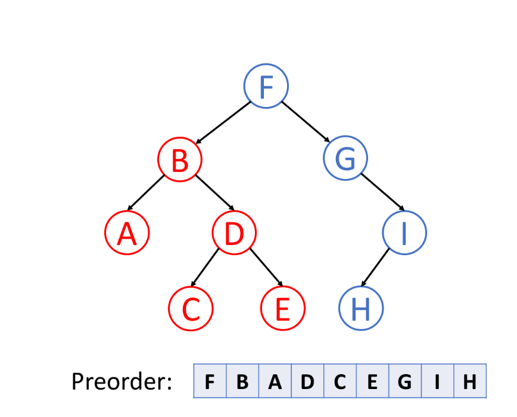

## 算法

### 树的遍历

总结
前序：根左右；中序：左根右；后序：左右根； 

#### 1. 前序遍历

​	首先访问根节点，然后遍历左子树，最后遍历右子树



#### 2. 中序遍历

 先遍历左子树，然后访问根节点，然后遍历右子树。 


#### 3. 后序遍历

 先遍历左子树，然后遍历右子树，最后访问树的根节点。 


#### 二叉树的前序遍历


```bash
输入：root = [1,null,2,3]
输出：[1,2,3]
```


```bash
输入：root = [1,2]
输出：[1,2]
```


```bash
输入：root = [1,null,2]
输出：[1,2]
```


### 冒泡算法

算法描述

- 比较相邻的元素。如果第一个比第二个大，就交换它们两个；
- 对每一对相邻元素作同样的工作，从开始第一对到结尾的最后一对，这样在最后的元素应该会是最大的数；
- 针对所有的元素重复以上的步骤，除了最后一个；
- 重复步骤1~3，直到排序完成。

```php
function bubbleSort(array $arr) :array {
    $len = count($arr);
    for ($i = 0; $i < $len - 1; $i++) {
        for ($j = $i + 1; $j < $len - 1; $j++) {
            if ($arr[$i] > $arr[$j]) {
                $tmp = $arr[$i];
                $arr[$i] = $arr[$j];
                $arr[$j] = $tmp;
            }
        }
    }
    return $arr;
}
```

###  选择排序

 原理：首先在未排序序列中找到最小（大）元素，存放到排序序列的起始位置，然后，再从剩余未排序元素中继续寻找最小（大）元素，然后放到已排序序列的末尾。以此类推，直到所有元素均排序完毕。  

 算法描述

n个记录的直接选择排序可经过n-1趟直接选择排序得到有序结果。具体算法描述如下：

- 初始状态：无序区为R[1..n]，有序区为空；
- 第i趟排序(i=1,2,3…n-1)开始时，当前有序区和无序区分别为R[1..i-1]和R(i..n）。该趟排序从当前无序区中-选出关键字最小的记录 R[k]，将它与无序区的第1个记录R交换，使R[1..i]和R[i+1..n)分别变为记录个数增加1个的新有序区和记录个数减少1个的新无序区；
- n-1趟结束，数组有序化了。

```php
function selectSort(array $arr) :array {
    $len = count($arr);
    $minIndex = 0; $tmp = 0;
    for ($i = 0; $i < $len - 1; $i++) {
        $minIndex = $i;
        for ($j = $i + 1; $j < $len; $j++) {
            if ($arr[$j] < $arr[$minIndex]) {
                $minIndex = $j;
            }
        }
        $tmp = $arr[$i];
        $arr[$i] = $arr[$minIndex];
        $arr[$minIndex] = $tmp;
    }
    return $arr;
}
```

### 插入排序

 原理是通过构建有序序列，对于未排序数据，在已排序序列中从后向前扫描，找到相应位置并插入。 

算法描述

一般来说，插入排序都采用in-place在数组上实现。具体算法描述如下：

- 从第一个元素开始，该元素可以认为已经被排序；
- 取出下一个元素，在已经排序的元素序列中从后向前扫描；
- 如果该元素（已排序）大于新元素，将该元素移到下一位置；
- 重复步骤3，直到找到已排序的元素小于或者等于新元素的位置；
- 将新元素插入到该位置后；
- 重复步骤2~5。

```php
function insertSort(array $arr) :array {
    $len = count($arr);
    $preIndex = 0; $current = 0;
    for ($i = 1; $i < $len; $i++) {
        $preIndex = $i - 1;
        current = $arr[$i];
        while ($preIndex >= 0 && $arr[$preIndex] > $current) {
            $arr[$preIndex + 1] = $arr[$preIndex];
            $preIndex--;
        }
        $arr[$preIndex + 1] = $current;
    }
    return $arr;
}
```

### 希尔排序

 是简单插入排序的改进版。它与插入排序的不同之处在于，它会优先比较距离较远的元素。希尔排序又==缩小增量排序==。 

算法描述

先将整个待排序的记录序列分割成为若干子序列分别进行直接插入排序，具体算法描述：

- 选择一个增量序列t1，t2，…，tk，其中ti>tj，tk=1；
- 按增量序列个数k，对序列进行k 趟排序；
- 每趟排序，根据对应的增量ti，将待排序列分割成若干长度为m 的子序列，分别对各子表进行直接插入排序。仅增量因子为1 时，整个序列作为一个表来处理，表长度即为整个序列的长度。

```php
function shellSort(array $arr) :array {
    $len = $num = count($arr);
   do {
       $step = $num = intval($num/2);
       // 对每组进行插入排序，将一个记录插入到已排序好的序列中，从而得到一个新的有序序列
       for ($i = $step; $i < $length; $i++) {
           if ($arr[$i] < $arr[$i - $step]) {
               $min = $arr[$i]; // 保存小的数
               for ($j = $i - $step; $j >= 0 && $min <$arr[$j]; $j-=$step) {
                   // 往后排
                   $arr[$j+ $step] = $arr[$j];
               }
               $arr[$j + $step] = $min;
           }
       }
   } while ($step > 1);
    return $arr;
}
```

### 快速排序

 快速排序的基本思想：通过一趟排序将待排记录分隔成独立的两部分，其中一部分记录的关键字均比另一部分的关键字小，则可分别对这两部分记录继续进行排序，以达到整个序列有序。 

算法描述

快速排序使用分治法来把一个串（list）分为两个子串（sub-lists）。具体算法描述如下：

- 从数列中挑出一个元素，称为 “基准”（pivot）；
- 重新排序数列，所有元素比基准值小的摆放在基准前面，所有元素比基准值大的摆在基准的后面（相同的数可以到任一边）。在这个分区退出之后，该基准就处于数列的中间位置。这个称为分区（partition）操作；
- 递归地（recursive）把小于基准值元素的子数列和大于基准值元素的子数列排序。

```php

```

### 存在重复元素

给定一个整数数组，判断是否存在重复元素。

如果存在一值在数组中出现至少两次，函数返回 `true` 。如果数组中每个元素都不相同，则返回 `false` 。

示例 1:

输入: [1,2,3,1]
输出: true

示例 2:

输入: [1,2,3,4]
输出: false

示例 3:

输入: [1,1,1,3,3,4,3,2,4,2]
输出: true

```php
function containsDuplicate(array $nums) {
   $len = count($nums);
    $tmp = [];
   for ($i = 0; $i < $len - 1; $i++) {
       if (isset($tmp[$arr[$i]])) return true;
       $tmp[$arr[$i]] = $i;
   }
    return false;
}
```

### 最大子序和

 给定一个整数数组 `nums` ，找到一个具有最大和的连续子数组（子数组最少包含一个元素），返回其最大和。 

示例 1：

输入：nums = [-2,1,-3,4,-1,2,1,-5,4]
输出：6
解释：连续子数组 [4,-1,2,1] 的和最大，为 6 。
示例 2：

输入：nums = [1]
输出：1
示例 3：

输入：nums = [0]
输出：0
示例 4：

输入：nums = [-1]
输出：-1
示例 5：

输入：nums = [-100000]
输出：-100000


提示：

1 <= nums.length <= 3 * 104
-105 <= nums[i] <= 105


进阶：如果你已经实现复杂度为 O(n) 的解法，尝试使用更为精妙的 分治法 求解。

```php
// 贪心算法
function maxSubArray($nums) {
    $n = count($nums);
    $curSum = $max = $nums[0];
    for ($i = 1; $i < $n; $i++) {
        if ($curSum < 0) {
            $curSum = $nums[$i];
        } else {
            $curSum += $nums[$i];
        }
        $max = max($max, $curSum);
    }
    return $max;
}
```

### 数字的补数

对整数的二进制表示取反（0 变 1 ，1 变 0）后，再转换为十进制表示，可以得到这个整数的补数。

例如，整数 5 的二进制表示是 "101" ，取反后得到 "010" ，再转回十进制表示得到补数 2 。
给你一个整数 num ，输出它的补数。

**示例 1：**

```
输入：num = 5
输出：2
解释：5 的二进制表示为 101（没有前导零位），其补数为 010。所以你需要输出 2 。
```

**示例 2：**

```
输入：num = 1
输出：0
解释：1 的二进制表示为 1（没有前导零位），其补数为 0。所以你需要输出 0 。
```

算法：

1. 通过右移1位来遍历二进制数位数。
2. 遍历的同时，定义一个二进制数$res，每位赋值1。
3. 按位异或，\$res ^ $num就有取反的效果。

```php
class Solution {

    /**
     * @param Integer $num
     * @return Integer
     */
    function findComplement($num) {
        $tmp = $num;
        $res = 0;
        while ($tmp != 0) {
            $res = ($res << 1) + 1;
            $tmp >>= 1;
        }

        return $num ^ $res;
    }
}
```

### 两数之和

给定一个整数数组 nums 和一个整数目标值 target，请你在该数组中找出 和为目标值 target  的那 两个 整数，并返回它们的数组下标。

你可以假设每种输入只会对应一个答案。但是，数组中同一个元素在答案里不能重复出现。

你可以按任意顺序返回答案。

**示例 1：**

```
输入：nums = [2,7,11,15], target = 9
输出：[0,1]
解释：因为 nums[0] + nums[1] == 9 ，返回 [0, 1] 。
```

**示例 2：**

```
输入：nums = [3,2,4], target = 6
输出：[1,2]

```

**示例 3：**

```
输入：nums = [3,3], target = 6
输出：[0,1]
```

```php
class Solution {

    /**
     * @param Integer[] $nums
     * @param Integer $target
     * @return Integer[]
     */
    function twoSum($nums, $target) {
        $map=[];//哈希查找表
        foreach($nums as $key=>$item){
            $b=$target-$item;
            if(isset($map[$b])){
                return [$map[$b],$key];//找到返回
            }else{
                $map[$item]=$key;//放入哈希表
            }
        }
    }
}

```


### 整数反转

给你一个 32 位的有符号整数 x ，返回将 x 中的数字部分反转后的结果。

如果反转后整数超过 32 位的有符号整数的范围 [−231,  231 − 1] ，就返回 0。

假设环境不允许存储 64 位整数（有符号或无符号）。

**示例 1：**

```
输入：x = 123
输出：321


```

**示例 2：**

```
输入：x = -123
输出：-321

```

**示例 3：**

```
输入：x = 120
输出：21

```

**示例 4：**

```
输入：x = 0
输出：0
```

```php
/**
 * @param Integer $x
 * @return Integer
 */
function reverse($x) {
   if (!is_int($x)) return 0;
    $res = 0;
    $max = pow(2, 31) - 1;
    $min = pow(-2, 31);
    while ($x != 0) {
        $remainder = $x % 10;
        $x = ($x - $remainder) / 10;
        $res = $res * 10 + $remainder;
    }
    if ($res > $max) return 0;
    if ($res < $min) return 0;
    return $res;

}

```


### 回文数

给你一个整数 x ，如果 x 是一个回文整数，返回 true ；否则，返回 false 。

回文数是指正序（从左向右）和倒序（从右向左）读都是一样的整数。例如，121 是回文，而 123 不是。

**示例 1：**

```
输入：x = 121
输出：true
```

**示例 2：**

```
输入：x = -121
输出：false
解释：从左向右读, 为 -121 。 从右向左读, 为 121- 。因此它不是一个回文数。
```

**解题思路**

​	转字符串

```php
/**
     * @param Integer $x
     * @return Boolean
     */
    function isPalindrome($x) {
        if ($x < 0 ) return false;
        
        $str = strval($x);
        $len = strlen($str);
        $k   = 0;

        while ($k < $len / 2) {
            if ($str[$k] !== $str[$len - $k - 1]) return false;
            $k++;
        }

        return true;
    }


```


