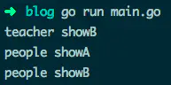

### GO

#### 基础问题

- **go语言slice和map底层实现原理**

  ```go
  // 切片即动态数组，可以动态扩容改变数组的容量. golang 的 slice 底层结构如下所示，它是一个结构体，里面包含了指向数组的地址，并通过 len、cap 保存数组的元素数、容量:
  type slice struct {
      array unsafe.Pointer // 指向数组的指针
      len   int // 切片中元素的数量
      cap   int // array 数组的总容量
  }
  ```

  **切片拷贝：**

  考虑到切片 slice 的结构，对于切片直接用 = 拷贝，实际上是浅拷贝，只是改变了指针的指向，并没有改变数组中元素的值. 对于深度拷贝的需求，可以借助 copy 内置函数完成. 两种拷贝的方式如下:

  - 深度拷贝: copy(sliceA, sliceB)
  - 浅拷贝: sliceA = sliceB

  切片之间的复制会拷贝数组指针、cap、len 值，但数组指针指向的是同一个地址. 如果想做深度拷贝，即将指针指向的数组内容而不是指针值进行拷贝. 可以使用内置的 copy 函数进行切片拷贝. 如下所示，使用 copy 进行复制，会改变 s2 地址的内存内的数组值.

  ```go
  var s1 = []int{1, 2}        // 初始化一个切片
  var s2 = make([]int, 2)     // 初始化一个空的切片，cap为2
  copy(s2, s1)                // 将s1拷贝给s2
  s2[0] = 99                  // 改变s2[0]
  fmt.Println(s1[0])          // 打印 1 而不是 99
  ```

  **切片 slice 函数传递**

  在切片进行复制时，会将切片的值（指针、cap、len)复制了一份. 在函数内部可以改变原切片的值.

  但是，当涉及到 append 触发扩容时，原来的指针指向的地址会发生变化，之后再对数组值进行更改，原切片将不受影响.

  ```go
  //定义一个函数，给切片添加一个元素
  func addOne(s []int) {
      s[0] = 4  // 可以改变原切片值
      s = append(s, 1)  // 扩容后分配了新的地址，原切片将不再受影响
      s[0] = 8 
  }
  var s1 = []int{2}   // 初始化一个切片
  addOne(s1)          // 调用函数添加一个切片
  fmt.Println(s1)     // 输出一个值 [4]
  ```

**切片 slice 的扩容**

当使用 append(slice,data) 时候，Golang 会检查底层的数组的长度是否已经不够，如果长度不够，Golang 则会新建一个数组，把原数组的数据拷贝过去，再将 slice 中的指向数组的指针指向新的数组。

其中新数组的长度一般是老数组的俩倍，当然，如果一直是俩倍增加，那也会极大的浪费内存. 所以在老数组长度大于 1024 时候，将每次按照不小于 25% 的涨幅扩容.

slice 增加长度的源码在 src/runtime/slice.go 的 growslice 函数中


- **map底层实现原理：**

map 字典是 golang 中高级类型之一，它提供键值对形式的存储. 它也是引用类型，参数传递时其内部的指针被复制，指向的还是同一个内存地址. 当对赋值后的左值进行修改时，是会影响到原 map 值的.

map 的底层本质上是实现散列表，它解决碰撞的方式是拉链法. map 在进行扩容时不会立即替换原内存，而是慢慢的通过 GC 方式释放.

**hmap** 结构

以下是 map 的底层结构，其源码位于 src/runtime/map.go 中，结构体主要是 hmap .

```go
复制代码
// A header for a Go map.
type hmap struct {
  // Note: the format of the hmap is also encoded in cmd/compile/internal/gc/reflect.go.
  // Make sure this stays in sync with the compiler's definition.
  count     int // # live cells == size of map.  Must be first (used by len() builtin)
  flags     uint8
  B         uint8  // log_2 of # of buckets (can hold up to loadFactor * 2^B items)
  noverflow uint16 // approximate number of overflow buckets; see incrnoverflow for details
  hash0     uint32 // hash seed

  buckets    unsafe.Pointer // array of 2^B Buckets. may be nil if count==0.
  oldbuckets unsafe.Pointer // previous bucket array of half the size, non-nil only when growing
  nevacuate  uintptr        // progress counter for evacuation (buckets less than this have been evacuated)

  extra *mapextra // optional fields
}
```

上述代码中 buckets、oldbuckets 是指向存储键值的内存地址, 其中 oldbuckets 用于在扩容时候，指向旧的 bucket 地址，再下次访问时不断的将 oldbuckets 值转移到 buckets 中. oldbuckets 并不直接释放内存，而是通过不引用，交由 gc 释放内存.


- slice底层实现原理：

- 结构体不加tag可以转json字符串吗

- go语言tcp udp具体实现原理

- go语言协程调度原理，协程为什么快

- 你在开发过程中遇到了什么困难 以及怎么解决的

- go语言常见的一些算法（查找算法）

- mysql索引分为几种（b+tree hash表）

- redis比mysql好在哪里

- es具体的使用方法好在哪里

- 400 401 402 403 404状态吗

- slice扩容机制

  go的调度


##### go struct 能不能比较

```
因为是强类型语言，所以不同类型的结构不能作比较，但是同一类型的实例值是可以比较的，实例不可以比较，因为是指针类型
```

### 值传递和指针传递有什么区别

值传递：会创建一个新的副本并将其传递给所调用函数或方法 指针传递：将创建相同内存地址的新副本

需要改变传入参数本身的时候用指针传递，否则值传递

另外，如果函数内部返回指针，会发生内存逃逸

#### 使用值为 nil 的 slice、map会发生啥

允许对值为 nil 的 slice 添加元素，但对值为 nil 的 map 添加元素，则会造成运行时 panic。

```go
// map 错误示例
func main() {
    var m map[string]int
    m["one"] = 1  // error: panic: assignment to entry in nil map
    // m := make(map[string]int)// map 的正确声明，分配了实际的内存
}    

// slice 正确示例
func main() {
 var s []int
 s = append(s, 1)
}
```

#### 访问 map 中的 key，需要注意啥

当访问 map 中不存在的 key 时，Go 则会返回元素对应数据类型的零值，比如 nil、’’ 、false 和 0，取值操作总有值返回，故不能通过取出来的值，来判断 key 是不是在 map 中。

检查 key 是否存在可以用 map 直接访问，检查返回的第二个参数即可。

```go
// 错误的 key 检测方式
func main() {
 x := map[string]string{"one": "2", "two": "", "three": "3"}
 if v := x["two"]; v == "" {
  fmt.Println("key two is no entry") // 键 two 存不存在都会返回的空字符串
 }
}

// 正确示例
func main() {
 x := map[string]string{"one": "2", "two": "", "three": "3"}
 if _, ok := x["two"]; !ok {
  fmt.Println("key two is no entry")
 }
}
```

#### string 类型的值可以修改吗

不能，尝试使用索引遍历字符串，来更新字符串中的个别字符，是不允许的。

string 类型的值是只读的二进制 byte slice，如果真要修改字符串中的字符，将 string 转为 []byte 修改后，再转为 string 即可。

```go
// 修改字符串的错误示例
func main() {
 x := "text"
 x[0] = "T"  // error: cannot assign to x[0]
 fmt.Println(x)
}


// 修改示例
func main() {
 x := "text"
 xBytes := []byte(x)
 xBytes[0] = 'T' // 注意此时的 T 是 rune 类型
 x = string(xBytes)
 fmt.Println(x) // Text
}
```

#### switch 中如何强制执行下一个 case 代码块

switch 语句中的 case 代码块会默认带上 break，但可以使用 ==fallthrough== 来强制执行下一个 case 代码块。

```go
func main() {
 isSpace := func(char byte) bool {
  switch char {
  case ' ': // 空格符会直接 break，返回 false // 和其他语言不一样
  // fallthrough // 返回 true
  case '\t':
   return true
  }
  return false
 }
 fmt.Println(isSpace('\t')) // true
 fmt.Println(isSpace(' ')) // false
}
```

#### 你是如何关闭 HTTP 的响应体的

直接在处理 HTTP 响应错误的代码块中，直接关闭非 nil 的响应体；手动调用 defer 来关闭响应体。

```go
// 正确示例
func main() {
 resp, err := http.Get("http://www.baidu.com")

    // 关闭 resp.Body 的正确姿势
    if resp != nil {
  		defer resp.Body.Close()
 		}

   checkError(err)
   defer resp.Body.Close()

   body, err := ioutil.ReadAll(resp.Body)
   checkError(err)

   fmt.Println(string(body))
}
```

#### 你是否主动关闭过http连接，为啥要这样做

有关闭，不关闭会程序可能会消耗完 socket 描述符。有如下2种关闭方式：

- 直接设置请求变量的 Close 字段值为 true，每次请求结束后就会主动关闭连接。设置 Header 请求头部选项 Connection: close，然后服务器返回的响应头部也会有这个选项，此时 HTTP 标准库会主动断开连接

```go
// 主动关闭连接
func main() {
   req, err := http.NewRequest("GET", "http://golang.org", nil)
   checkError(err)

   req.Close = true
   //req.Header.Add("Connection", "close") // 等效的关闭方式

   resp, err := http.DefaultClient.Do(req)
   if resp != nil {
    	defer resp.Body.Close()
   }
   checkError(err)

   body, err := ioutil.ReadAll(resp.Body)
   checkError(err)

   fmt.Println(string(body))
}
```

你可以创建一个自定义配置的 HTTP transport 客户端，用来取消 HTTP 全局的复用连接。

```go
func main() {
   tr := http.Transport{DisableKeepAlives: true}
   client := http.Client{Transport: &tr}

   resp, err := client.Get("https://golang.google.cn/")
   if resp != nil {
    	defer resp.Body.Close()
   }
   checkError(err)

   fmt.Println(resp.StatusCode) // 200

   body, err := ioutil.ReadAll(resp.Body)
   checkError(err)

   fmt.Println(len(string(body)))
}
```

#### 解析 JSON 数据时，默认将数值当做哪种类型

在 encode/decode JSON 数据时，Go 默认会将数值当做 ==float64== 处理。

```go
func main() {
     var data = []byte(`{"status": 200}`)
     var result map[string]interface{}

     if err := json.Unmarshal(data, &result); err != nil {
     log.Fatalln(err)
}
// 解析出来的 200 是 float 类型。
```

#### 如何从 panic 中恢复

在一个 defer 延迟执行的函数中调用 recover ，它便能捕捉/中断 panic。

```go
// 错误的 recover 调用示例
func main() {
   recover() // 什么都不会捕捉
   panic("not good") // 发生 panic，主程序退出
   recover() // 不会被执行
   println("ok")
}

// 正确的 recover 调用示例
func main() {
   defer func() {
    	fmt.Println("recovered: ", recover())
   }()
   panic("not good")
}
```

#### 简短声明的变量需要注意啥

- 简短声明的变量只能在函数内部使用
- struct 的变量字段不能使用 := 来赋值
- 不能用简短声明方式来单独为一个变量重复声明， := 左侧至少有一个新变量，才允许多变量的重复声明


#### range 迭代 map是有序的吗

无序的。Go 的运行时是有意打乱迭代顺序的，所以你得到的迭代结果可能不一致。但也并不总会打乱，得到连续相同的 5 个迭代结果也是可能的。


#### recover的执行时机

无，recover 必须在 defer 函数中运行。recover 捕获的是祖父级调用时的异常，直接调用时无效。

```go
func main() {
    recover()
    panic(1)
}
```

直接 defer 调用也是无效。

```go
func main() {
    defer func() {
        func() { recover() }()
    }()
    panic(1)
}
```

必须在 defer 函数中直接调用才有效。

```go
func main() {
    defer func() {
        recover()
    }()
    panic(1)
}
```

#### 闭包错误引用同一个变量问题怎么处理

在每轮迭代中生成一个局部变量 i 。如果没有 i := i 这行，将会打印同一个变量。

```go
func main() {
    for i := 0; i < 5; i++ {
        i := i
        defer func() {
            println(i)
        }()
    }
}
```

或者是通过函数参数传入 i 。

```go
func main() {
    for i := 0; i < 5; i++ {
        defer func(i int) {
            println(i)
        }(i)
    }
}
```

#### 在循环内部执行defer语句会发生啥

defer 在函数退出时才能执行，在 for 执行 defer 会导致资源延迟释放。

```go
func main() {
    for i := 0; i < 5; i++ {
        func() {
            f, err := os.Open("/path/to/file")
            if err != nil {
                log.Fatal(err)
            }
            defer f.Close()
        }()
    }
}
```

func 是一个局部函数，在局部函数里面执行 defer 将不会有问题。


#### 说出一个避免Goroutine泄露的措施

可以通过 context 包来避免内存泄漏。

```go
func main() {
    ctx, cancel := context.WithCancel(context.Background())

    ch := func(ctx context.Context) <-chan int {
        ch := make(chan int)
        go func() {
            for i := 0; ; i++ {
                select {
                case <- ctx.Done():
                    return
                case ch <- i:
                }
            }
        } ()
        return ch
    }(ctx)

    for v := range ch {
        fmt.Println(v)
        if v == 5 {
            cancel()
            break
        }
    }
}
// 下面的 for 循环停止取数据时，就用 cancel 函数，让另一个协程停止写数据。如果下面 for 已停止读取数据，上面 for 循环还在写入，就会造成内存泄漏。
```


#### 如何跳出for select 循环

通常在for循环中，使用break可以跳出循环，但是注意在go语言中，for select配合时，break 并不能跳出循环。

```go
func testSelectFor2(chExit chan bool){
 EXIT:
    for  {
        select {
        case v, ok := <-chExit:
            if !ok {
                fmt.Println("close channel 2", v)
                break EXIT//goto EXIT2
            }

            fmt.Println("ch2 val =", v)
        }
    }

    //EXIT2:
    fmt.Println("exit testSelectFor2")
}
```


#### 如何在切片中查找

go中使用 sort.searchXXX 方法，在排序好的切片中查找指定的方法，但是其返回是对应的查找元素不存在时，待插入的位置下标(元素插入在返回下标前)。

可以通过封装如下函数，达到目的。

```go
func IsExist(s []string, t string) (int, bool) {
    iIndex := sort.SearchStrings(s, t)
    bExist := iIndex!=len(s) && s[iIndex]==t

    return iIndex, bExist
}
```

#### 如何初始化带嵌套结构的结构体

go 的哲学是组合优于继承，使用 struct 嵌套即可完成组合，内嵌的结构体属性就像外层结构的属性即可，可以直接调用。

注意初始化外层结构体时，必须指定内嵌结构体名称的结构体初始化，如下看到 s1方式报错，s2 方式正确。

```go
type stPeople struct {
    Gender bool
    Name string
}

type stStudent struct {
    stPeople
    Class int
}

//尝试4 嵌套结构的初始化表达式
//var s1 = stStudent{false, "JimWen", 3}
var s2 = stStudent{stPeople{false, "JimWen"}, 3}
fmt.Println(s2.Gender, s2.Name, s2.Class)
```


#### 切片和数组的区别

数组是具有固定长度，且拥有零个或者多个，相同数据类型元素的序列。数组的长度是数组类型的一部分，所以[3]int 和 [4]int 是两种不同的数组类型。数组需要指定大小，不指定也会根据初始化的自动推算出大小，不可改变；数组是值传递。数组是内置类型，是一组同类型数据的集合，它是值类型，通过从0开始的下标索引访问元素值。在初始化后长度是固定的，无法修改其长度。

当作为方法的参数传入时将复制一份数组而不是引用同一指针。数组的长度也是其类型的一部分，通过内置函数len(array)获取其长度。数组定义：

```go
var array [10]int

var array =[5]int{1,2,3,4,5}
```

切片表示一个拥有相同类型元素的可变长度的序列。切片是一种轻量级的数据结构，它有三个属性：指针、长度和容量。切片不需要指定大小；切片是地址传递；切片可以通过数组来初始化，也可以通过内置函数make()初始化 。初始化时len=cap,在追加元素时如果容量cap不足时将按len的2倍扩容。切片定义：

```go
var slice []type = make([]type, len)
```


#### new和make的区别

new 的作用是初始化一个指向类型的指针 (*T) 。new 函数是内建函数，函数定义：func new(Type) *Type。使用 new 函数来分配空间。传递给 new 函数的是一个类型，不是一个值。返回值是指向这个新分配的零值的指针。

make 的作用是为 slice，map 或 chan 初始化并返回引用 (T)。make 函数是内建函数，函数定义：func make(Type, size IntegerType) Type；第一个参数是一个类型，第二个参数是长度；返回值是一个类型。

make(T, args) 函数的目的与 new(T) 不同。它仅仅用于创建 Slice, Map 和 Channel，并且返回类型是 T（不是T*）的一个初始化的（不是零值）的实例。

 区别

new 的参数要求传入一个类型，而不是一个值，它会申请该类型的内存大小空间，并初始化为对应的零值，返回该指向类型空间的一个指针

make 也用于内存分配，但它只用于引用对象 slice、map、channel的内存创建，返回的类型是类型本身

#### Printf()、Sprintf()、Fprintf()函数的区别用法是什么

都是把格式好的字符串输出，只是输出的目标不一样。

Printf()，是把格式字符串输出到标准输出（一般是屏幕，可以重定向）。Printf() 是和标准输出文件 (stdout) 关联的，Fprintf 则没有这个限制。
Sprintf()，是把格式字符串输出到指定字符串中，所以参数比printf多一个char*。那就是目标字符串地址。

Fprintf()，是把格式字符串输出到指定文件设备中，所以参数比 printf 多一个文件指针 FILE*。主要用于文件操作。Fprintf() 是格式化输出到一个stream，通常是到文件。


#### 说说go语言中的for循环

for 循环支持 continue 和 break 来控制循环，但是它提供了一个更高级的break，可以选择中断哪一个循环 for 循环不支持以逗号为间隔的多个赋值语句，必须使用平行赋值的方式来初始化多个变量。


#### Array 类型的值作为函数参数

在 C/C++ 中，数组（名）是指针。将数组作为参数传进函数时，相当于传递了数组内存地址的引用，在函数内部会改变该数组的值。

在 Go 中，数组是值。作为参数传进函数时，传递的是数组的原始==值拷贝==，此时在函数内部是无法更新该数组的。

```go
// 数组使用值拷贝传参
func main() {
 x := [3]int{1,2,3}

 func(arr [3]int) {
  arr[0] = 7
  fmt.Println(arr) // [7 2 3]
 }(x)
 fmt.Println(x)   // [1 2 3] // 并不是你以为的 [7 2 3]
}
```

想改变数组，直接传递指向这个数组的指针类型。

```go
// 传址会修改原数据
func main() {
 x := [3]int{1,2,3}

 func(arr *[3]int) {
  (*arr)[0] = 7 
  fmt.Println(arr) // &[7 2 3]
 }(&x)
 fmt.Println(x) // [7 2 3]
}
```

直接使用 slice：即使函数内部得到的是 slice 的值拷贝，但依旧会更新 slice 的原始数据（底层 array）

```go
// 错误示例
func main() {
 x := []string{"a", "b", "c"}
 for v := range x {
  fmt.Println(v) // 1 2 3
 }
}


// 正确示例
func main() {
 x := []string{"a", "b", "c"}
 for _, v := range x { // 使用 _ 丢弃索引
  fmt.Println(v)
 }
}
```


#### 说说go语言的select机制

- select 机制用来处理异步 IO 问题
- select 机制最大的一条限制就是每个 case 语句里必须是一个 IO 操作
- golang 在语言级别支持 select 关键字


#### Golang可变参数

函数方法的参数，可以是任意多个，这种我们称之为可以变参数，比如我们常用的fmt.Println()这类函数，可以接收一个可变的参数。可以变参数，可以是任意多个。我们自己也可以定义可以变参数，可变参数的定义，在类型前加上省略号…即可。

```go
func main() {
 print("1","2","3")
}


func print (a ...interface{}){
 for _,v:=range a{
  fmt.Print(v)
 }
 fmt.Println()
}
```

例子中我们自己定义了一个接受可变参数的函数，效果和fmt.Println()一样。可变参数本质上是一个数组，所以我们向使用数组一样使用它，比如例子中的 for range 循环。


#### Golang Slice的底层实现

切片是基于数组实现的，它的底层是数组，它自己本身非常小，可以理解为对底层数组的抽象。因为基于数组实现，所以它的底层的内存是连续分配的，效率非常高，还可以通过索引获得数据，可以迭代以及垃圾回收优化。
切片本身并不是动态数组或者数组指针。它内部实现的数据结构通过指针引用底层数组，设定相关属性将数据读写操作限定在指定的区域内。切片本身是一个只读对象，其工作机制类似数组指针的一种封装。
切片对象非常小，是因为它是只有3个字段的数据结构：

- 指向底层数组的指针
- 切片的长度
- 切片的容量

这3个字段，就是Go语言操作底层数组的元数据。


#### Golang Slice的扩容机制，有什么注意点

Go 中切片扩容的策略是这样的：

首先判断，如果新申请容量大于 2 倍的旧容量，最终容量就是新申请的容量。否则判断，如果旧切片的长度小于 1024，则最终容量就是旧容量的两倍。

否则判断，如果旧切片长度大于等于 1024，则最终容量从旧容量开始循环增加原来的 1/4 , 直到最终容量大于等于新申请的容量。如果最终容量计算值溢出，则最终容量就是新申请容量。

情况一：原数组还有容量可以扩容（实际容量没有填充完），这种情况下，扩容以后的数组还是指向原来的数组，对一个切片的操作可能影响多个指针指向相同地址的Slice。

情况二：原来数组的容量已经达到了最大值，再想扩容， Go 默认会先开一片内存区域，把原来的值拷贝过来，然后再执行 append() 操作。这种情况丝毫不影响原数组。

要复制一个Slice，最好使用Copy函数。


#### JSON 标准库对 nil slice 和 空 slice 的处理是一致的吗

首先 JSON 标准库对 nil slice 和 空 slice 的处理是不一致。

通常错误的用法，会报数组越界的错误，因为只是声明了slice，却没有给实例化的对象。

```go
var slice []int
slice[1] = 0
```

此时slice的值是nil，这种情况可以用于需要返回slice的函数，当函数出现异常的时候，保证函数依然会有nil的返回值。

empty slice 是指slice不为nil，但是slice没有值，slice的底层的空间是空的，此时的定义如下：

```go
slice := make([]int,0）
slice := []int{}
```

当我们查询或者处理一个空的列表的时候，这非常有用，它会告诉我们返回的是一个列表，但是列表内没有任何值。总之，nil slice 和 empty slice是不同的东西,需要我们加以区分的。


#### Golang的内存模型，为什么小对象多了会造成gc压力

通常小对象过多会导致 GC 三色法消耗过多的GPU。优化思路是，减少对象分配。


#### Data Race问题怎么解决？能不能不加锁解决这个问题

同步访问共享数据是处理数据竞争的一种有效的方法。

golang在 1.1 之后引入了竞争检测机制，可以使用 go run -race 或者 go build -race来进行静态检测。其在内部的实现是,开启多个协程执行同一个命令， 并且记录下每个变量的状态。

竞争检测器基于C/C++的ThreadSanitizer 运行时库，该库在Google内部代码基地和Chromium找到许多错误。这个技术在2012年九月集成到Go中，从那时开始，它已经在标准库中检测到42个竞争条件。现在，它已经是我们持续构建过程的一部分，当竞争条件出现时，它会继续捕捉到这些错误。

竞争检测器已经完全集成到Go工具链中，仅仅添加-race标志到命令行就使用了检测器。

```bash
$ go test -race mypkg    // 测试包
$ go run -race mysrc.go  // 编译和运行程序 $ go build -race mycmd 
// 构建程序 $ go install -race mypkg // 安装程序
```

要想解决数据竞争的问题可以使用互斥锁sync.Mutex,解决数据竞争(Data race),也可以使用管道解决,使用管道的效率要比互斥锁高。


#### 在 range 迭代 slice 时，你怎么修改值的

在 range 迭代中，得到的值其实是元素的一份值拷贝，更新拷贝并不会更改原来的元素，即是拷贝的地址并不是原有元素的地址。

```go
func main() {
   data := []int{1, 2, 3}
   for _, v := range data {
    v *= 10  // data 中原有元素是不会被修改的
   }
   fmt.Println("data: ", data) // data:  [1 2 3]
}
```

如果要修改原有元素的值，应该使用索引直接访问。

```go
func main() {
   data := []int{1, 2, 3}
   for i, v := range data {
    data[i] = v * 10 
   }
   fmt.Println("data: ", data) // data:  [10 20 30]
}
```

如果你的集合保存的是指向值的指针，需稍作修改。依旧需要使用索引访问元素，不过可以使用 range 出来的元素直接更新原有值。

```go
func main() {
   data := []*struct{ num int }{{1}, {2}, {3},}
   for _, v := range data {
    v.num *= 10 // 直接使用指针更新
   }
   fmt.Println(data[0], data[1], data[2]) // &{10} &{20} &{30}
}
```


#### select可以用于什么

常用语gorotine的完美退出。

golang 的 select 就是监听 IO 操作，当 IO 操作发生时，触发相应的动作每个case语句里必须是一个IO操作，确切的说，应该是一个面向channel的IO操作。

#### 内存管理

Golang运行时的内存分配算法主要源自 Google 为 C 语言开发的`TCMalloc算法`，全称`Thread-Caching Malloc`。核心思想就是把内存分为多级管理，从而降低锁的粒度。它将可用的堆内存采用二级分配的方式进行管理：每个线程都会自行维护一个独立的内存池，进行内存分配时优先从该内存池中分配，当内存池不足时才会向全局内存池申请，以避免不同线程对全局内存池的频繁竞争。

- Go在程序启动时，会向操作系统申请一大块内存，之后自行管理。
- Go内存管理的基本单元是mspan，它由若干个页组成，每种mspan可以分配特定大小的object。
- mcache, mcentral, mheap是Go内存管理的三大组件，层层递进。mcache管理线程在本地缓存的mspan；mcentral管理全局的mspan供所有线程使用；mheap管理Go的所有动态分配内存。
- 极小对象会分配在一个object中，以节省资源，使用tiny分配器分配内存；一般小对象通过mspan分配内存；大对象则直接由mheap分配内存。

#### 线程有几种模型

3种，一对一模型，多对一模型，多对多模型

go线程模型：属于多对多线程模型。其模型如下：


go线程模型包含三个概念：内核线程(M)，goroutine(G),逻辑处理器（P）,在Go中每个逻辑处理器(P)会绑定到某一个内核线程上,每个逻辑处理器（P）内有一个本地队列，用来存放go运行时分配的goroutine。在上面介绍的多对多线程模型中是操作系统调度线程在物理CPU上运行，在Go中则是Go的运行时调度goroutine在逻辑处理器（P）上运行。

调度过程如下

全局队列：存放等待执行的G
P的本地队列：当创建一个新的G之后优先加入本地队列，如果本地队列满了，会将本地队列的一半G移动到全局队列里面，本地队列保存G数量默认不超过256个
P的列表：在初始化的时候根据GOMAXPROCS来设置
M：线程想运行任务就得获取 P，从 P 的本地队列获取 G，P 队列为空时，M 也会尝试从全局队列拿一批 G 放到 P 的本地队列，或从其他 P 的本地队列偷一半放到自己 P 的本地队列。M 运行 G，G 执行之后，M 会从 P 获取下一个 G，不断重复下去。

在go中存在两级调度，一级是操作系统的调度系统，该调度系统调度逻辑处理器占用cpu时间片运行，一级是go的运行时调度系统，该调度系统调度某个goroutine在逻辑处理上运行。

使用go语句创建一个goroutine后，创建的goroutine会被放入go运行时调度器的全局运行队列中，然后go运行时调度器会把全局队列中的goroutine分配给不同的逻辑处理器（P），分配的goroutine会被放到逻辑处理器（P)的本地队列中，当本地队列中某个goroutine就绪后待分配到时间片后就可以在逻辑处理器上运行了，如上图goroutine1当前正在占用逻辑处理器1运行。

需要注意的是为了避免某些goroutine出现饥饿现象，被分配到某一个逻辑处理器（P)上的多个goroutine是分时在该逻辑处理器运行的，而不是独占运行直到结束，比如每个goroutine从开始到运行结束需要10分钟，那么当前逻辑处理器下的goroutine1，goroutine2，goroutine3，并不是顺序执行，而是交叉并发运行的。

goroutine内部实现与在多个操作系统线程(Os 线程)之间复用的协程(coroutines)一样。如果一个goroutine阻塞OS线程，例如等待输入，则该OS线程对应的逻辑处理器P中的其他goroutine将迁移到其他OS线程，以便它们可以继续运行:


如上图左侧假设goroutine1在执行文件文件读取操作，则goroutine1会导致内核线程1阻塞，这时候go运行时调度器会把goroutine1所在的逻辑处理器1迁移到其他的内核线程上（这里是内核线程2上），这时候逻辑处理器1上的goroutine2和goroutine3就不会受goroutine1的影响了。等goroutine1文件读取操作完成后goroutine1又会被go运行时调度系统重新放入到逻辑处理器1的本地队列。
需要注意的是go运行时内核线程(M)的数量默认是10000个，你可以使用runtime/debug包里面的debug.SetMaxThreads(10000)来设置。

默认情况下，Go默认是给每个可用的物理处理器都分配一个逻辑处理器（p）,如果你需要修改逻辑处理器(P)个数可以使用runtime包的runtime.GOMAXPROCS函数设置.

至于goroutine（G）的数量则是由用户程序自己来确定，理论只要内存够大，可以无限制创建。

Goroutine 小结

优点：

1、开销小

POSIX的thread API虽然能够提供丰富的API，例如配置自己的CPU亲和性，申请资源等等，线程在得到了很多与进程相同的控制权的同时，开销也非常的大，在Goroutine中则不需这些额外的开销，所以一个Golang的程序中可以支持10w级别的Goroutine。

每个 goroutine (协程) 默认占用内存远比 Java 、C 的线程少（*goroutine：*2KB ，线程：8MB）

2、调度性能好

在Golang的程序中，操作系统级别的线程调度，通常不会做出合适的调度决策。例如在GC时，内存必须要达到一个一致的状态。在Goroutine机制里，Golang可以控制Goroutine的调度，从而在一个合适的时间进行GC。

在应用层模拟的线程，它避免了上下文切换的额外耗费，兼顾了[多线程](https://so.csdn.net/so/search?q=多线程&spm=1001.2101.3001.7020)的优点。简化了高并发程序的复杂度。

缺点：

协程调度机制无法实现公平调度。

#### 每个线程/协程占用多少内存

*goroutine：*2KB ，线程：2MB

#### gorouitine 什么时候发生阻塞

- channel 在等待网络请求或者数据操作的IO返回的时候会发生阻塞
- 发生一次系统调用等待返回结果的时候
- goroutine进行sleep操作的时候

前置知识点: go程序中,任何对系统 API 的调用，都会被 runtime 层拦截来方便调度。

go一共有4种阻塞的情况，并且这些阻塞都是可以被runtime检测到的，runtime检测到阻塞时就可以进行优化处理。

1. blocking syscall (for example opening a file)   // 系统调用
2. network input   // 网络IO
3. channel operations // 通道
4. primitives in the sync package   // 锁

4种阻塞可以分为两类：
分类1 (对应情况2,3,4): (只G阻塞,M,P可用的，要利用起来)
1.1 用户代码层面的阻塞(channel,锁), 此时M可以换上其他G继续执行。
1.2 网络阻塞 (netpoller实现G网络阻塞不会导致M被阻塞，仅阻塞G)。
分类2 (对应情况1): (G,M都被阻塞,P可用,要利用起来)
2.1 系统调用(open file)

#### go协程阻塞时如何进行调度？

> 在程序中任何对系统 API 的调用，都会被 runtime 层拦截来方便调度。
> Goroutine 在 system call 和 channel call 时都可能发生阻塞，但这两种阻塞发生后，处理方式又不一样的。
> 1.当程序发生 system call，M 会发生阻塞，同时唤起（或创建）一个新的 M 继续执行其他的 G。当MO返回时，它必须尝试取得一个context P来运行goroutine，一般情况下，它会从其他的OS线程那里steal偷一个context过来，如果没有偷到的话，它就把goroutine放在一个global runqueue里，然后自己就去睡大觉了（放入线程缓存里）。Contexts们也会周期性的检查global runqueue，否则global runqueue上的goroutine永远无法执行。
> 2.当程序发起一个 channel call，程序可能会阻塞，但不会阻塞 M，G 的状态会设置为 waiting，M 继续执行其他的 G。当 G 的调用完成，会有一个可用的 M 继续执行它。

#### go为什么要实现自己的协程调度，而不用系统调度？

1.线程较多时，开销较大。
2.OS 的调度，程序不可控。而 Go GC 需要停止所有的线程，使内存达到一致状态。

#### GM为啥不行？P有什么作用？

1.每个 P 都有一个队列，用来存正在执行的 G。避免 Global Sched Lock。
2.每个 M 运行都需要一个 MCache 结构。M Pool 中通常有较多 M，但执行的只有几个，为每个池子中的每个 M 分配一个 MCache 则会形成不必要的浪费，通过把 cache 从 M 移到 P，每个运行的 M 都有关联的 P，这样只有运行的 M 才有自己的 MCache。

#### Goroutine vs OS thread 有什么区别？

其实 goroutine 用到的就是线程池的技术，当 goroutine 需要执行时，会从 thread pool 中选出一个可用的 M 或者新建一个 M。而 thread pool 中如何选取线程，扩建线程，回收线程，Go Scheduler 进行了封装，对程序透明，只管调用就行，从而简化了 thread pool 的使用。


#### PMG模型中，goroutine有哪些状态

**有9种状态**

- **_Gidle**：刚刚被分配并且还没有被初始化
- **_Grunnable**：没有执行代码，没有栈的所有权，存储在运行队列中
- **_Grunning**：可以执行代码，拥有栈的所有权，被赋予了内核线程 M 和处理器 P
- **_Gsyscall**：正在执行系统调用，拥有栈的所有权，没有执行用户代码，被赋予了内核线程 M 但是不在运行队列上
- **_Gwaiting**：由于运行时而被阻塞，没有执行用户代码并且不在运行队列上，但是可能存在于 Channel 的等待队列上
- **_Gdead**：没有被使用，没有执行代码，可能有分配的栈
- **_Gcopystack**：栈正在被拷贝，没有执行代码，不在运行队列上
- **_Gpreempted**：由于抢占而被阻塞，没有执行用户代码并且不在运行队列上，等待唤醒
- **_Gscan**：GC 正在扫描栈空间，没有执行代码，可以与其他状态同时存在

**去抢占 G 的时候，会有一个自旋和非自旋的状态**

自旋锁(Spinlock)是一种广泛运用的底层**同步**机制。自旋锁是一个**互斥**设备，它只有两个值：“锁定”和“解锁”。它通常实现为某个整数值中的某个位。希望获得某个特定锁得代码测试相关的位。如果锁可用，则“锁定”被设置，而代码继续进入**临界区**；相反，如果锁被其他人获得，则代码进入**忙循环**（而不是休眠，这也是自旋锁和一般锁的区别）并重复检查这个锁，直到该锁可用为止，这就是自旋的过程。

#### 如果goroutine一直占用资源怎么办，PMG模型怎么解决这个问题

如果有一个goroutine一直占用资源的话，GMP模型会从正常模式转为饥饿模式，通过信号协作强制处理在最前的 goroutine 去分配使用

#### 如果若干线程中一个线程OOM，会发生什么，如果goroutine呢，项目中出现过OOM吗，怎么解决的？

如果线程发生==OOM==，也就是==内存溢出==，发生OOM的线程会被kill掉，其它线程不受影响。

### Goroutine中内存泄漏的发现与排查

go中的内存泄漏一般都是goroutine泄露，就是goroutine没有被关闭，或者没有添加超时控制，让goroutine一只处于阻塞状态，不能被GC。

### 场景

在Go中内存泄露分为暂时性内存泄露和永久性内存泄露

**暂时性内存泄露**

- 获取长字符串中的一段导致长字符串未释放
- 获取长slice中的一段导致长slice未释放
- 在长slice新建slice导致泄漏

string相比切片少了一个容量的cap字段，可以把string当成一个只读的切片类型。获取长string或者切片中的一段内容，由于新生成的对象和老的string或者切片共用一个内存空间，会导致老的string和切片资源暂时得不到释放，造成短暂的内存泄漏

**永久性内存泄露**

- goroutine永久阻塞而导致泄漏
- time.Ticker未关闭导致泄漏
- 不正确使用Finalizer导致泄漏

####  项目中的错误处理是怎么解决的

在后台开发中，针对错误处理，有三个维度的问题需要解决：

- 函数内部的错误处理: 这指的是一个函数在执行过程中遇到各种错误时的错误处理。这是一个语言级的问题
- 函数/模块的错误信息返回: 一个函数在操作错误之后，要怎么将这个错误信息优雅地返回，方便调用方（也要优雅地）处理。这也是一个语言级的问题
- 服务/系统的错误信息返回: 微服务/系统在处理失败时，如何返回一个友好的错误信息，依然是需要让调用方优雅地理解和处理。这是一个服务级的问题，适用于任何语言

函数内部的错误，遇到错误的时候建议还是老老实实采用这种格式：

```go
if err := DoSomething(); err != nil {
	// ...
}
```


#### 如果若干个goroutine，其中有一个pantic,会发生什么

如果某goroutine在某函数/方法F的调用时出现panic，一个被称为"panicking"的过程将被激活。

该过程先会调用函数F的defer函数(如果有的话)，然后依次向上，调用函数F的调用者的defer函数，直至该goroutine的顶层函数。

即启动该goroutine时(go T())的那个函数T，如果函数T有defer函数，那么defer会被调用。

在整个paniking过程的defer调用链中，如果没有使用recover捕获该panic，

那么panicking过程的最后一个环节将会发生：整个程序异常退出(无论发生panic的goroutine是否为main Goroutine)并输出panic相关信息。

#### defer可以捕获到其Goroutine的子goroutine的panic吗 

不能

每个Goroutine都要有recover机制，因为当一个Goroutine抛panic的时候只有自身能够捕捉到其它Goroutine是没有办法捕捉的。如果没有recover机制，整个进程会crash。

recover只能在defer里面生效，如果不是在defer里调用，会直接返回nil。

Goroutine发生panic时，只会调用自身的defer，所以即便主Goroutine里写了recover逻辑，也无法recover。

#### 开发中使用过gin框架吗？怎么做参数效验，中间件使用过吗，怎么使用的？

gin框架使用[http://github.com/go-playground/validator](https://link.zhihu.com/?target=http%3A//github.com/go-playground/validator)进行参数校验 在 struct 结构体添加 binding tag，然后调用 ShouldBing 方法，下面是一个示例

```go
type SignUpParam struct {
    Age        uint8  `json:"age" binding:"gte=1,lte=130"`
    Name       string `json:"name" binding:"required"`
    Email      string `json:"email" binding:"required,email"`
    Password   string `json:"password" binding:"required"`
    RePassword string `json:"re_password" binding:"required,eqfield=Password"`
}

func main() {
    r := gin.Default()

    r.POST("/signup", func(c *gin.Context) {
        var u SignUpParam
        if err := c.ShouldBind(&u); err != nil {
            c.JSON(http.StatusOK, gin.H{
                "msg": err.Error(),
            })
            return
        }
        // 保存入库等业务逻辑代码...

        c.JSON(http.StatusOK, "success")
    })

    _ = r.Run(":8999")
}
```

##### 中间件使用use方法，Gin的中间件其实就是一个HandlerFunc,那么只要我们自己实现一个HandlerFunc，下面是一个示例

```go
func costTime() gin.HandlerFunc {
    return func(c *gin.Context) {
        //请求前获取当前时间
        nowTime := time.Now()

        //请求处理
        c.Next()

        //处理后获取消耗时间
        costTime := time.Since(nowTime)
        url := c.Request.URL.String()
        fmt.Printf("the request URL %s cost %v\n", url, costTime)
    }
}
```

以上我们就实现了一个Gin中间件，比较简单，而且有注释加以说明，这里要注意的是c.Next方法，这个是执行后续中间件请求处理的意思（含没有执行的中间件和我们定义的GET方法处理），这样我们才能获取执行的耗时。也就是在c.Next方法前后分别记录时间，就可以得出耗时。

#### gin的错误处理使用过吗，gin中自定义效验规则知道怎么做吗，自定义效验的返回值呢？

gin 自定义效验规则使用 validator库,binding验证规则，可以自定义函数，然后将函数注册奥验证规则中,自定义效验的返回值

```go
package common
import (
	"github.com/gin-gonic/gin/bining"
    "github.com/go-paygroun/locales/zh"
    "github.com/go-playgroun/vaidator/v10"
    ut "github.com/go-playground/universal-translator"
)

var trans ut.Translator

// 定义字段名称，此处对应的是你的结构体中binding的字段名称
var fieldName = map[string]string {
    "Username": "用户名",
    "Password": "用户密码",
    "Avatar": "用户头像",
}

// 自定义错误返回值
var myTags = map[string]string {
    "myvalidate": "必须通过自定义验证方法",
}

// 自定义错误信息返回格式
func Translate(err error) string {
    var result string
    
    errors := err.(validator.ValidationErrors)
    
    for _, err := range errors {
        // 判断是否是自定义方法
        var (
            tag = err.Tag() // 绑定的验证方法
            field = err.Field() // 绑定的验证字段
            mag string
        )
        
        // 自定义错误，使用自定义错误信息返回
        if val, exist := myTags[tag]; exist {
            msg = field + val + ";"
        } else {
            msg = err.Translate(trans)
        }
        
        if val, exist := fieldName[field]; exist {
            msg = strings.Replace(msg, field, val, 1)
        }
        retuslt += msg
    }
    return result
}

// 这是一个自定义验证方法
var myvaidate valiator.Func = func(f1 validaor.FieldLevel) bool {
    val, ok := f1.Fields().Interface().(string) // string当前验证的字段
    if ok {
        if val != "gangan" {
            return false
        }
    }
    return true
}

func init() {
    var (
    	validate *validator.Validate
        ok bool
    )
    // 注册自定义验证方法
    if validate, ok = binding.Valiator.Engine().(*validator.Validate); ok {
        validate.RegisterValidation("myvalidate", myvalidate)
    }
}

// 使用
RegisterRequest struct {
    Username string `json:"username" binding:"required,min=3,max=25,myvalidate"`
    Password string `json:"password" binding:"required,min=6,max=25"`
    Avatar string `json:"avatar" binding:"required,url"`
}

// 调用
var (
	err error
    res *RegisterRequest
)

res = new(RegisterRequest)

// 进行参数验证
if err = c.ShouldBindJSON(res); err != nil {
    // 验证未通过，使用自定义的错误输出方法，获取错误信息
    core.ResponseError(c, common.Translate(err))
    return
}
```

gin的use可以统一抛出错误

```go
// 错误处理的结构体
type Error struct {
	StatusCode int    `json:"-"`
	Code       int    `json:"code"`
	Msg        string `json:"msg"`
}

var (
	Success     = NewError(http.StatusOK, 0, "success")
	ServerError = NewError(http.StatusInternalServerError, 200500, "系统异常，请稍后重试!")
	NotFound    = NewError(http.StatusNotFound, 200404, http.StatusText(http.StatusNotFound))
)

func OtherError(message string) *Error {
	return NewError(http.StatusForbidden, 100403, message)
}

func (e *Error) Error() string {
	return e.Msg
}

func NewError(statusCode, Code int, msg string) *Error {
	return &Error{
		StatusCode: statusCode,
		Code:       Code,
		Msg:        msg,
	}
}

// 定义一个中间件捕获错误
func ErrHandler() gin.HandlerFunc {
	return func(c *gin.Context) {
		c.Next()
		if length := len(c.Errors); length > 0 {
			e := c.Errors[length-1]
			err := e.Err
			if err != nil {
				var Err *Error
				if e, ok := err.(*Error); ok {
					Err = e
				} else if e, ok := err.(error); ok {
					Err = OtherError(e.Error())
				} else {
					Err = ServerError
				}
				// 记录一个错误的日志
				c.JSON(Err.StatusCode, Err)
				return
			}
		}

	}
}

func main() {
	r := gin.Default()
	r.NoMethod(HandleNotFound)
	r.NoRoute(HandleNotFound)
	r.Use(ErrHandler()) // 捕获错误

	r.GET("/user", User)
	r.GET("/users", Users)
	r.GET("/", Ping)
	r.Run() // 在 0.0.0.0:8080 上监听并服务
}
```


#### 反射了解过吗，原理了解吗？

#### 实际使用过吗？

#### 实现使用字符串函数名调用函数

```go
package main

import (
    "fmt"
    "reflect"
)

type Animal struct {
}

func (m *Animal) Eat() {
    fmt.Println("Eat")
}
func main() {
    animal := Animal{}
    value := reflect.ValueOf(&animal)
    f := value.MethodByName("Eat") //通过反射获取它对应的函数，然后通过call来调用
    f.Call([]reflect.Value{})
}
```


#### golang的锁机制了解过吗？mutex的锁有哪几种机制，分别介绍一下？mutex锁底层如何实现了解过？

互斥锁的加锁是靠 sync.Mutex.Lock 方法完成的, 当锁的状态是 0 时，将 mutexLocked 位置成 1：

```go
// Lock locks m.
// If the lock is already in use, the calling goroutine
// blocks until the mutex is available.
func (m *Mutex) Lock() {
    // Fast path: grab unlocked mutex.
    if atomic.CompareAndSwapInt32(&m.state, 0, mutexLocked) {
        if race.Enabled {
            race.Acquire(unsafe.Pointer(m))
        }
        return
    }
    // Slow path (outlined so that the fast path can be inlined)
    m.lockSlow()
}
```

Mutex：正常模式和饥饿模式

在正常模式下，锁的等待者会按照先进先出的顺序获取锁。

但是刚被唤起的 Goroutine 与新创建的 Goroutine 竞争时，大概率会获取不到锁，为了减少这种情况的出现，一旦 Goroutine 超过 1ms 没有获取到锁，它就会将当前互斥锁切换饥饿模式，防止部分 Goroutine 被饿死。

饥饿模式是在 Go 语言 1.9 版本引入的优化的，引入的目的是保证互斥锁的公平性（Fairness）。

在饥饿模式中，互斥锁会直接交给等待队列最前面的 Goroutine。新的 Goroutine 在该状态下不能获取锁、也不会进入自旋状态，它们只会在队列的末尾等待。

如果一个 Goroutine 获得了互斥锁并且它在队列的末尾或者它等待的时间少于 1ms，那么当前的互斥锁就会被切换回正常模式。

相比于饥饿模式，正常模式下的互斥锁能够提供更好地性能，饥饿模式的能避免 Goroutine 由于陷入等待无法获取锁而造成的高尾延时。

#### channel

#### 手写实现一个负载均衡算法

```go
package balance

import (
	"strconv"
    "fmt"
    "os"
)

// 定义接口
type Balancer interface {
    DoBalance([]*instance, ...string) (*instance, error)
}

// 实例
type Instance struct {
    host string
    port int
}

func NewInstance(host string, port int) *Instance {
    return &Instance {
        host: host,
        prot: port,
    }
}

// 定义Instance 结构体的方法GetHost
func (p *instance) GetHost() string {
    return p.host
}

// 定义方法GetPort()
func (p *Instance) GetPort() int {
    return p.port
}

func (p *instance) String() string {
    return p.host + ":" + strconv.Itoa(p.port)
}

type BalanceMgr struct {
    allBalancer map[string]Balancer
}

var mgr = BalanceMgr {
    allBalance: make(map[string]Balancer),
}

func (p *BalanceMgr) registerBalancer(name string, b Balancer) {
    p.allBalancer[name] = b
}

func RegisterBalancer(name string, b Balancer) {
    mgr.registerBalancer(name, b)
}

func DoBalance(name string, insts[]*instance) (inst *Instance, err error) {
    balancer, ok := mgr.allBalancer[name]
    if !ok {
        err = fmt.Errorf("Not found %s balancer", name)
        return
    }
    
    fmt.Printf("Use %s balancer\n", name)
    inst, err = balancer.DoBalance(insts)
    return 
}

// 随机轮询
func init() {
    RegisterBalancer("random", &RandomBalance())
}

type RandomBalance struct {
    
}

func (p *RandomBalance) DoBalance(insts []*Instance, key ...string) (inst *Instance, err error) {
    if len(insts) == 0 {
        err = errors.New("No instance")
        return
    }
    
    lens := len(insts)
    index := rand.Intn(lens)
    inst = insts[index]
    return
}

// 顺序轮询
func init() {
    RegisterBalancer("roundrobin", &RoundRobinBalance())
}

type RoundRobinBalance struct {
    curIndex int
}

func (p *RoundRobinBalance) DoBalance(insts []*Instance, key ...string) (inst *Instance, err error) {
    if len(insts) == 0 {
        err = errors.New("No instance")
        return
    }
    
    lens := len(insts)
    if p.curIndex >= lens {
        p.curIndex = 0
    }
    inst = insts[p.curIndex]
    p.curIndex = (P.curIndex + 1) % lens
    return
}

func main() {
    // 将后台服务器放入随机队列
    var insts []*balance.Instance
    for i := 0; i < 16; i++ {
        host := fmt.Sprintf("192,168.%d.%d", rand.Intn(255), rand.Intn(255))
        one := balance.NewInstance(host, 8080)
        insts = append(insts, one)
    }
    
    var balanceName = "random"
    if len(os.Args) > 1 {
        balanceName = os.Args[1]
    }
    
    for {
        inst, err := balance.DoBalance(balanceName, insts)
        if err != nil {
            fmt.Println("do balance err:", err)
            fmt.Fprintf(os.Stdout, "do balance err\n")
            continue
        }
        
        fmt.Println(inst)
        time.Sleep(time.Second)
    }
}
```


#### Go数据竞争怎么解决

Data Race 问题可以使用互斥锁解决，或者也可以通过CAS无锁并发解决

中使用同步访问共享数据或者CAS无锁并发是处理数据竞争的一种有效的方法.

golang在1.1之后引入了竞争检测机制，可以使用 go run -race 或者 go build -race来进行静态检测。

其在内部的实现是,开启多个协程执行同一个命令， 并且记录下每个变量的状态.

竞争检测器基于C/C++的ThreadSanitizer运行时库，该库在Google内部代码基地和Chromium找到许多错误。这个技术在2012年九月集成到Go中，从那时开  ，它已经在标准库中检测到42个竞争条件。现在，它已经是我们持续构建过程的一部分，当竞争条件出现时，它会继续捕捉到这些错误。

竞争检测器已经完全集成到Go工具链中，仅仅添加-race标志到命令行就使用了检测器。

```text
$ go test -race mypkg    // 测试包
$ go run -race mysrc.go  // 编译和运行程序
$ go build -race mycmd  // 构建程序
$ go install -race mypkg // 安装程序
```

要想解决数据竞争的问题可以使用互斥锁sync.Mutex,解决数据竞争(Data race),也可以使用管道解决,使用管道的效率要比互斥锁高.

####  slice，len，cap，共享，扩容 

len：切片的长度，访问时间复杂度为O(1)，go的slice底层是对数组的引用。

cap：切片的容量，扩容是以这个值为标准。默认扩容是2倍，当达到1024的长度后，按1.25倍。

扩容：每次扩容slice底层都将先分配新的容量的内存空间，再将老的数组拷贝到新的内存空间，因为这个操作不是并发安全的。所以并发进行append操作，读到内存中的老数组可能为同一个，最终导致append的数据丢失。

共享：slice的底层是对数组的引用，因此如果两个切片引用了同一个数组片段，就会形成共享底层数组。当sliec发生内存的重新分配（如扩容）时，会对共享进行隔断。详细见下面例子：

```go
    a := []int{1, 2, 3}
    b := a[:2]
    a[0] = 10
    //此时a和b共享底层数组
    fmt.Println(a, "a cap:", cap(a), "a len:", len(a))
    fmt.Println(b, "b cap:", cap(b), "b len:", len(b))
    fmt.Println("-----------")
    b = append(b, 999)
    //虽然b append了1,但是没有超出cap，所以未进行内存重新分配
    //等同于b[2]=999，因此a[2]一并被修改
    fmt.Println(a, "a cap:", cap(a), "a len:", len(a))
    fmt.Println(b, "b cap:", cap(b), "b len:", len(b))
    fmt.Println("-----------")
    a[2] = 555 //同上，未重新分配，所以，a[2] b[2]都被修改
    fmt.Println(a, "a cap:", cap(a), "a len:", len(a))
    fmt.Println(b, "b cap:", cap(b), "b len:", len(b))
    fmt.Println("-----------")
    b = append(b, 777) //超出了cap，这时候b进行重新分配,b[3]=777,cap(b)=6
    a[2] = 666         //这时候a和b不再共享
    fmt.Println(a, "a cap:", cap(a), "a len:", len(a))
    fmt.Println(b, "b cap:", cap(b), "b len:", len(b))
```

####  实现set 

````go
type inter interface{}
type Set struct {
    m map[inter]bool
    sync.RWMutex
}

func New() *Set {
    return &Set{
    m: map[inter]bool{},
    }
}
func (s *Set) Add(item inter) {
    s.Lock()
    defer s.Unlock()
    s.m[item] = true
}
````

####  Go的反射包怎么找到对应的方法 

####  Go的channel（有缓冲和无缓冲） 

####  退出程序时怎么防止channel没有消费完 

####  手写循环队列 

####  生产者消费者模式，手写代码 

####  线段树了解吗？字典树？

####  sync.Pool用过吗 

####  证明二叉树的叶子节点跟度数为2的节点的关系 

####  字符串解析为数字（考虑浮点型） 

####  单点登录，tcp粘包 ,  处理粘包断包实现 

####  golang中没有隐藏的this指针，这句话的含义是 ？

 方法施加的对象显式传递，没有被隐藏起来 

 golang的面向对象表达更直观，对于面向过程只是换了一种语法形式来表达 

 方法施加的对象不需要非得是指针，也不用非得叫this 


####  golang中的指针运算包括 ？

 可以通过“&”取指针的地址 

 可以通过“*”取指针指向的数据


####  关于同步锁 ？

 当一个goroutine获得了Mutex后，其他goroutine就只能乖乖的等待，除非该goroutine释放这个Mutex 

 RWMutex在读锁占用的情况下，会阻止写，但不阻止读 

 RWMutex在写锁占用情况下，会阻止任何其他goroutine（无论读和写）进来，整个锁相当于由该goroutine独占 

####   

#### golang中大多数数据类型都可以转化为有效的JSON文本，下面几种类型除外 ？

  channel    complex    函数 


####  关于go vendor ？

 基本思路是将引用的外部包的源代码放在当前工程的vendor目录下面 

 编译go代码会优先从vendor目录先寻找依赖包 

  有了vendor目录后，打包当前的工程代码到其他机器的$GOPATH/src下都可以通过编译 


####  关于函数返回值的错误设计 ？

  如果失败原因只有一个，则返回bool 

 如果失败原因超过一个，则返回error 

 如果没有失败原因，则不返回bool或error 

  如果重试几次可以避免失败，则不要立即返回bool或error 


####  关于异常设计？

  在程序开发阶段，坚持速错，让程序异常崩溃 

 在程序部署后，应恢复异常避免程序终止 

 对于不应该出现的分支，使用异常处理 


####  channel的特性 ？

  给一个 nil channel 发送数据，造成永远阻塞 

 从一个 nil channel 接收数据，造成永远阻塞 

 .给一个已经关闭的 channel 发送数据，引起 panic 

  从一个已经关闭的 channel 接收数据，如果缓冲区中为空，则返回一个零值 


####  无缓冲和有冲突的channel ？

  无缓冲的channel是同步的，而有缓冲的channel是非同步的 

```go
func main() {
   c := make(chan int)
   go add(c)
   go send(c)
   // 给5秒时间让前两个goroutine有足够时间运行
   time.Sleep(5 * time.Second)
}

// 不断向channel c中发送[0,10)的随机数
func send(c chan int) {
   for {
      c <- rand.Intn(10)
   }
}
func add(c chan int) {
   sum := 0
   // 1秒后，将向t.C通道发送时间点，使其可读
   t := time.NewTimer(2 * time.Second)
   for {
      // 两秒内，将一直选择第一个case
      // 两秒后，t.C可读，将选择第二个case
      // c变成nil channel后，两个case分支都将一直阻塞
      select {
      case input := <-c:
         // 不断读取c中的随机数据进行加总
         sum = sum + input
      case <-t.C:
         c = nil
         fmt.Println(sum)
      }
   }
}
```

```go
func main() {
   c := make(chan int)
   go send(c)
   go receive(c)
   // 给5秒时间让前两个goroutine有足够时间运行
   time.Sleep(5 * time.Second)
}

// 不断向channel c中发送[0,10)的随机数
func send(c chan int) {
   for {
      c <- rand.Intn(10)
   }
}

func receive(c chan int) {
   i := 0
   t := time.NewTimer(1 * time.Second)
   for {
      select {
      case <-t.C:
         c = nil
      case <-c:
         fmt.Println(i)
         i++
      }
   }
}
```


####  关于异常的触发 ？

 空指针解析 

 下标越界 

  除数为0 

 调用panic函数 


#### go的调度

go的调度原理是基于GMP模型，G代表一个goroutine，不限制数量；M=machine，代表一个线程，最大1万，所有G任务还是在M上执行；P=processor代表一个处理器，每一个允许的M都会绑定一个G，默认与逻辑CPU数量相等（通过runtime.GOMAXPROCS(runtime.NumCPU())设置）。

 go调用过程： 

```
创建一个G对象

如果还有空闲的的P，创建一个M

M会启动一个底层线程，循环执行能找到的G

G的执行顺序是先从本地队列找，本地没找到从全局队列找。一次性转移(全局G个数/P个数）个，再去其它P中找（一次性转移一半）

以上的G任务是按照队列顺序执行（也就是go函数的调用顺序）。

另外在启动时会有一个专门的sysmon来监控和管理，记录所有P的G任务计数schedtick。如果某个P的schedtick一直没有递增，说明这个P一直在执行一个G任务，如果超过一定时间就会为G增加标记，并且该G执行非内联函数时中断自己并把自己加到队尾。
```


#### context包的用途?

 goroutine管理、信息传递。context的意思是上下文，在线程、协程中都有这个概念，它指的是程序单元的一个运行状态、现场、快照，包含。context在多个goroutine中是并发安全的。 

 应用场景： 

1. 超时

````go
ctx, cancel := context.WithTimeout(context.Background(), time.Second)
    defer cancel()
    ch := make(chan int)
    t := time.Now().UnixNano()
    t = t / 1000 / 1000
    fmt.Println(t)
    select {
    case <-ch:
    case <-ctx.Done():
        //如果超过1秒钟ch未读取到信息，自动执行超时
        fmt.Println(ctx.Err())
    }
    fmt.Println("耗时：",time.Now().UnixNano()/1000/1000 - t,"ms")
````

2. 通信并达到取消并发goroutine继续执行的目的。

3. 数据传递

4. client如何实现长连接


#### map如何顺序读取

map的底层是hash table(hmap类型)，对key值进行了hash，并将结果的低八位用于确定key/value存在于哪个bucket（bmap类型）。再将高八位与bucket的tophash进行依次比较，确定是否存在。出现hash冲撞时，会通过bucket的overflow指向另一个bucket，形成一个单向链表。每个bucket存储8个键值对。

如果要实现map的顺序读取，需要使用一个slice来存储map的key并按照顺序进行排序。

```go
 m := make(map[int]int, 10)
    keys := make([]int, 0, 10)
    for i := 0; i < 10; i++ {
        m[i] = i
        keys = append(keys, i)
    }
    //降序
    sort.Slice(keys, func(i, j int) bool {
        if keys[i] > keys[j] {
            return true
        }
        return false
    })
    for _, v := range keys {
        fmt.Println(m[v])
    }
```


#### 实现set？

 利用map，如果要求并发安全，就用sync.map 

 要注意下set中的delete函数需要使用 `delete(map)`来实现，但是这个并不会释放内存，除非value也是一个子map。当进行多次delete后，可以使用make来重建map。 


go读文件的两种方式

````go
    filePath := "1G.txt"
    filePath2 := "1G.txt"

    //只读的形式打开文件。
    //ps: os.OpenFile可以以读写方式打开
    file, err := os.Open(filePath)
    if err != nil {
        fmt.Println(err)
        return
    }
    file2, err := os.Open(filePath2)
    if err != nil {
        fmt.Println(err)
        return
    }
    defer file.Close()

    //分片读取

    //1024bit*8=1024byte=1kb
    //1kb*1024=1m
    //读取100M的内容
    buffer := make([]byte, 1024*1024*100)
    i := 0
    for {
        n, err := file.Read(buffer)
        if err != nil && err != io.EOF {
            fmt.Println("错误", err)
            return
        }
        if n == 0 {
            fmt.Println("结束")
            break
        }
        i += n / 1024
        fmt.Println("大小", i/1024, "KB")
    }
    fmt.Println("文件大小：", i/1024, "KB")

    //流处理：
    scanner := bufio.NewScanner(file2)
    for scanner.Scan() {
        fmt.Println(scanner.Bytes())
    }
````


#### 死锁条件，如何避免？

产生死锁的四个必要条件：

（1） 互斥条件：一个资源每次只能被一个进程使用。
 （2） 请求与保持条件：一个进程因请求资源而阻塞时，对已获得的资源保持不放。
 （3） 不剥夺条件：进程已获得的资源，在末使用完之前，不能强行剥夺。
 （4） 循环等待条件：若干进程之间形成一种头尾相接的循环等待资源关系。

 避免方法：

1. 为表添加合理的索引。可以看到如果不走索引将会为表的每一行记录添加上锁，死锁的概率大大增加。
2. 多个程序尽量约定以相同的顺序访问表（这也是解决并发理论中哲学家就餐问题的一种思路），以固定的顺序访问表和行。比如两个更新数据的事务，事务A更新数据的顺序为1，2；事务B更新数据的顺序为 2 ，1，这样更可能会造成死锁。
3. 同一个事务尽可能做到一次锁定所需要的所有资源。

#### defer的理解？

##### defer两大特性

- **延迟调用**: 在当前函数执行完成后调用执行。

- **后进先出**: 多个defer函数时，执行顺序为后进先出。

##### defer与return的执行顺序

```go
func f1() (r int){
    defer func(){
        r++
    }()
    return 0
}

func f2() (r int) {
    t:=5
    defer func() {
        t = t+5
    }()
    return t
}

func f3() (r int) {
    defer func(r int) {
        r = r+5
    }(r)
    return 0
}

func main(){
    fmt.Println(f1())
    fmt.Println(f2())
    fmt.Println(f3())
}

// 输出结果
$ go run main.go
1
5
0
```

 **return语句本身并不是一条原子指令**，它会先给返回值赋值，然后再是返回，如下 

```go
func f4() (r int) {
    return 1
}

//执行过程：
r:=1 //赋值
ret //执行返回
```

 而在含defer表达式时，函数返回的过程是这样的： 

 **先给返回值赋值，然后调用defer表达式，最后再是返回结果** 

 即对于f1()来讲 

```go
func f1() (r int){
    defer func(){
        r++
    }()
    return 0
}

//执行过程：
r:=0 //赋值
r++  //defer
ret  //r=1
```

 对于f2来讲 

````go
func f2() (r int) {
    t:=5
    defer func() {
        t = t+5
    }()
    return t
}

//执行过程
t:=5
r:=t
t=t+5 //defer
ret  //r=5
````

对于f3()来讲，在defer的时候传参r，其实是一个值拷贝。

所以defer中对r的修改并不会影响返回值结果，助于理解把r换成t，结果是等同的，即等效为

```go
func f3() (r int) {
    defer func(t int) {
        t = t+5
    }(r)
    return 0
}

//执行过程
r:=0
t = r， t = t +5 //defer
ret // r=0
```

##### defer的应用场景

##### 场景一：资源释放

我们在代码中使用资源时如：打开一个文件，很容易因为忘记释放或者由于逻辑上的错误导致资源没有关闭。这时候使用defer可以避免这种资源泄漏。不妨先看如下代码：

```go
file,_ := os.Open("test.txt")
//process为业务逻辑处理
if err:=process(file);err!=nil {
  return
}
file.Close()
```

上面的代码即存在一个严重的问题，如 err!=nil 直接return后，会使得file.close() 关闭资源的语句没有执行，导致资源泄漏。

且在经历了一串业务逻辑处理编写后，我们也很容易忘记关闭资源导致资源泄漏。所以应该牢记一个原则：在每个资源申请成功的后面都加上defer自动清理，不管该函数都多少个return，资源都会被正确的释放。

 **正确的编写逻辑如下：** 

```go
file,_ := os.Open("test.txt")
defer file.Close()
//process为业务逻辑处理
if err:=process(file);err!=nil {
  return
}
```

##### 场景二：异常捕获

Golang中对于程序中的异常处理，没有try catch，但是有panic和recover。 当程序中抛出panic时，如果没有及时recover，会导致服务直接挂掉，造成很严重的后果，所以我们一般用recover来捕获异常。

```go
func main(){
    defer func(){
        if ok:=recover();ok!=nil{
            fmt.Println("recover")
        }
  }()
    panic("error")
}
```

 **上面两个场景是我们必需要熟知的**，当然还可以利用defer的特性优雅的实现一些类似于代码追踪、记录函数的参数和返回值等。 

##### 场景三： 代码追踪

 我们通过追踪程序进入或离开某个函数的信息，来测试此函数是否被执行。 

```go
func main(){
    f1()
    f2()
}

func f1(){
    defer trace_leave(trace_enter("f1()"))
    fmt.Println("f1()程序逻辑")
}

func f2(){
    defer trace_leave(trace_enter("f2()"))
    fmt.Println("f2()程序逻辑")
}

func trace_enter(msg string) string{
    fmt.Println("enter: ",msg)
    return msg
}

func trace_leave(msg string) {
    fmt.Println("leave: ",msg)
}

// 输出结果如下：
$go run main.go
enter:  f1()
f1()程序逻辑
leave:  f1()
enter:  f2()
f2()程序逻辑
leave:  f2()
```

##### 场景四： 打印函数的参数和返回值

 某函数的执行结果不符合预期，我们可以使用defer来一步到位的打印函数的参数和返回值，而非多处打印调试语句。 

```go
func main(){
    func1("hello")
}

func func1(str string) ( res string) {
    defer func() {
        fmt.Printf("func1(%s) = %s", str, res)
    }()
    res = fmt.Sprintf("%s, jack!",str)
    return
}

// 输出结果：
$go run main.go
func1(hello) = hello, jack!
```


#### 说说Go语言中，数组和切片的区别？

切片的底层是数组 数组的长度是类型的一部分，不同的长度的数组，类型不是一致的

1、 切片的长度可变，切片是一种类型 

```go
a := [3]int{1, 2, 3}
b := [4]int{1, 2, 3}
fmt.Printf("a 的类型为%s, b的类型为%s\n", reflect.TypeOf(a), reflect.TypeOf(b))
fmt.Println(reflect.TypeOf(a) == reflect.TypeOf(b))
   
// a 的类型为[3]int, b的类型为[4]int
// false

as := a[0:2]
bs := b[0:2]
fmt.Printf("as的类型为%v,bs的类型为%v\n", reflect.TypeOf(as), reflect.TypeOf(bs))
fmt.Println(reflect.TypeOf(as) == reflect.TypeOf(bs))
   
// as的类型为[]int,bs的类型为[]int
// true
```

2、数组是值类型,值传递，拷贝时会复制整个数组 

 而切片是引用类型，是对数组的一个连续片段的引用，引用传递 

```go
func main(){ 
 arrayA := [2]int{100, 200}
 var arrayB [2]int
 arrayB = arrayA

 fmt.Printf("arrayA : %v , %v\n", &arrayA[0], arrayA)
 fmt.Printf("arrayB : %v , %v\n", &arrayB[0], arrayB)
 testArray(arrayA)

 fmt.Println()
 
 sliceA := arrayA[0:1]
 sliceB := sliceA
 fmt.Printf("sliceA : %v , %v\n", &sliceA[0], sliceA)
 fmt.Printf("sliceB : %v , %v\n", &sliceB[0], sliceB)
 testSlice(sliceA)

}
func testArray(x [2]int) {
 fmt.Printf("func Array : %v , %v\n", &x[0], x)
}
func testSlice(x []int) {
 fmt.Printf("func Slice : %v , %v\n", &x[0], x)
}
/*
arrayA : 0xc0000180b0 , [100 200]
arrayB : 0xc0000180c0 , [100 200]
func Array : 0xc000018110 , [100 200]

sliceA : 0xc0000180b0 , [100]
sliceB : 0xc0000180b0 , [100]
func Slice : 0xc0000180b0 , [100]
*/
```

3、 数组需要指定大小，不指定也会根据初始化自动推算出大小，不可改变 

 切片不需要指定大小，也可直接从数组中切片 

```go
c := [...]int{1,2,3,4}
fmt.Printf("c 的类型为%s, 长度为%v\n", reflect.TypeOf(c), len(c))
// c 的类型为[4]int, 长度为4

cs := []int{1, 2, 3, 4}
cs = append(cs, 5)
fmt.Printf("cs 的类型为%s, 长度为%v\n", reflect.TypeOf(cs), len(cs))
// cs 的类型为[]int, 长度为5
```

4、 切片数据结构 

```go
type slice struct {
    array unsafe.Pointer // 指向数组的指针
    len   int             // 当前切片的长度
    cap   int             // 当前切片容量
}
```

 当长度一旦大于容量时，容量会按增长因子扩容，但是会导致空间的重新分配，切片此时指向了一个全新的数组 

```go
func main() {
 arr := [4]int{1, 2, 3, 4}
 sliceA := arr[:]
 fmt.Printf("len(silceA) = %v, cap(sliceA) = %v\n", len(sliceA), cap(sliceA))
 // len(silceA) = 4, cap(sliceA) = 4

 // 修改arr的第一个元素值，sliceA的第一个元素值跟着变化
 arr[0] = 5
 fmt.Printf("sliceA = %v\n", sliceA)
 // sliceA = [5 2 3 4]

 // 给slice添加元素，导致slice扩容，空间重新分配
 sliceA = append(sliceA, 6)
 fmt.Printf("sliceA = %v\n", sliceA)
 fmt.Printf("len(silceA) = %v, cap(sliceA) = %v\n", len(sliceA), cap(sliceA))
 // sliceA = [5 2 3 4 6]
 // len(silceA) = 5, cap(sliceA) = 8

 // 修改arr的第一个元素值，发现sliceA的第一个元素值不在跟着变化
 arr[0] = 7
 fmt.Printf("arr = %v\n", arr)
 fmt.Printf("sliceA = %v\n", sliceA)
 // arr = [7 2 3 4]
 // sliceA = [5 2 3 4 6]
}
```


#### 说说go语⾔的同步锁

```go
// 未加锁
var x = 0
var waitGroup sync.WaitGroup

func main() {
    waitGroup.Add(2)
    go add()
    go add()
    waitGroup.Wait()
    fmt.Println(x)
}

func add() {
    for i := 0; i < 10000; i++ {
        y := x
        y = y + 1
        x = y
    }
    waitGroup.Done()
}
```

```go
// 加锁
var x = 0
var waitGroup sync.WaitGroup
var mutex sync.Mutex

func main() {
    waitGroup.Add(2)
    go add()
    go add()
    waitGroup.Wait()
    fmt.Println(x)
}

func add() {
    for i := 0; i < 10000; i++ {
        mutex.Lock()
        y := x
        y = y + 1
        x = y
        mutex.UnLock()
    }
    waitGroup.Done()
}
```

 于此之外还有读写锁，即 

```go
var rwmutex sync.RWMutex
rwmutex.Lock()// 加写锁，阻止其他读写获取锁
rwmutex.RLock()// 加读锁，如果其他gorountine要获取读锁的话，会获得读锁，如果要获取写锁就会等待
```


####  在 Go 中如何使用多行字符串？

 使用反引号 “ 来包含多行字串，或使用 `+` 来连接多行字符串（注意换行会包含`\n`，缩进会包含 `\t`，空格没有转义符）： 

```go
func main() {
   str1 := `
 line1
    line2
`
    str2 := "\n line1\n\t" +
      "line2\n"
    fmt.Println(str1 == str2) // true
}
```


#### 如何获取命令行的参数？

 有两种方法： 

 使用 `os` 库，如： 

```go
  func main() {
     args := os.Args
     if args == nil  { // 校验参数并输出提示信息
        return
    }
    fmt.Printf("%T\n", args)
    fmt.Printf("%v\n", args)
 }
```

 可以看出 `os.Args` 接收到的参数是 string slice，元素分别是运行的程序名、多个参数值： 

  

 使用 `flag` 库，步骤： 

- 定义各个参数的类型、名字、默认值与提示信息
- 解析
- 获取参数值

```go
func main() {
    name := flag.String("name", "", "Your name")
    var age int
    flag.IntVar(&age, "age", -1, "Your age")

    flag.Parse()

    println("name", *name)
    println("age", age)
}
```

 注意上边获取参数值的两种方式，使用时也有所不同： 

```go
func Int(name string, value string, usage string) *string // 返回地址
func IntVar(p *int, name string, value int, usage string) // 修改第一个参数值
```

  


#### 如何在不输出的情况下格式化字符串？

 使用 `func Sprintf(format string, a ...interface{}) string` 即可，常用在手动组合 SQL 语句上： 

```go
func main() {
    fmt.Println(formatSQL(20))
}

func formatSQL(id int) string {
    return fmt.Sprintf("SELECT * FROM users WHERE id=%d", id)
}
```


#### 考察 goroutine 的传值方式

```go
func main() {
    runtime.GOMAXPROCS(1) // 强制使多个 goroutine 串行执行
    wg := sync.WaitGroup{}
    wg.Add(10)

    for i := 0; i < 5; i++ {
        go func() {
            fmt.Println("i: ", i)
            wg.Done()
        }()
        // time.Sleep(1 * time.Second)  // 此时将顺序输出 1 2 3 4 5 
    }

  for i := 0; i < 5; i++ {
      go func(i int) {
          fmt.Println("i: ", i)
          wg.Done()
      }(i)
  }
  wg.Wait()
}
```

 第一个 for 循环：以极快的速度分配完 5 个 goroutine，此时 `i` 的值为 5，gouroutine 得到的 `i` 都是 5 

 第二个 for 循环：每次都会将 `i` 的值拷贝一份传给 goroutine，得到的 `i` 不同，输出不同 

  


#### 考察 Go 的组合

```go
 type People struct{}
 
 func (p *People) ShowA() {
     fmt.Println("people showA")
     p.ShowB()
 }
 func (p *People) ShowB() {
     fmt.Println("people showB")
 }


 type Teacher struct {
     People
 }

 func (t *Teacher) ShowB() {
    fmt.Println("teacher showB")
 }

 func main() {
    t := Teacher{}
     t.ShowB()
     t.ShowA()
 }
```

第 13 行： `Teacher` 通过嵌入 `People` 来获取了 `ShowA()` 和 `showB()`

第 16 行：`Teacher` 实现并覆盖了 `showB()`

第 24 行：调用未覆盖的 `showA()`，因为它的 receiver 依旧是 People，相当于 People 调用

  

