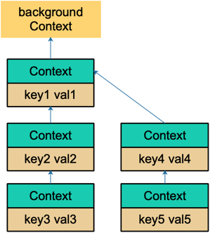
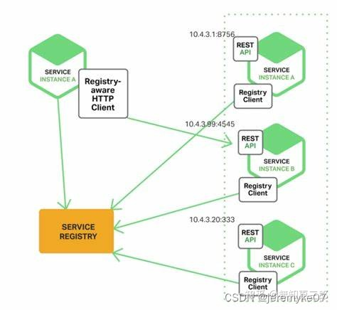

#### Go

#### 各种模型

##### 什么是CSP模型


#### Go基础

##### Go支持默认参数或可选参数吗？

不支持，但是可以利用结构体参数，或者 ... 传入参数切片数组

```go
// 这个函数可以传入任意数量的整型参数
func sum(nums ...int) {
    total := 0
    for _, num := range nums {
        total += num
    }
    fmt.Println(total)
}
```


##### go struct 能不能比较

因为是强类型的语言，所以不同类型的结构体不能比较，但是同一类型的实例值是可以比较的，实例不可以比较，因为是指针类型

##### Go 语言 tag的用途？

1）json: 序列化或反序列化时字段的名称

2）db: sql 模块中对应的数据库字段名

3）form: gin框架中对应的前端的数据字段名

4）binding: 搭配form使用，默认如果没有查找到结构体中的某个字段则不报错值为空，binding为required代表没找到返回错误给前端

##### 结构体打印时，%v 和 %+v 的区别

%v 输出结构体各成员的值

%+v 输出结构体各成员的名称和值

%#v 输出结构体名称和结构体各成员的名称和值

```go
package main

import "fmt"

type T struct{
	a int 
	b float64
}
func test(){
	t:=T{
		a:1,
		b:2.0,
	}
	fmt.Printf("%v\n",t) // {1 2}
	fmt.Printf("%+v\n",t) // {a:1 b:2}
	fmt.Printf("%#v\n",t) // main.T{a:1, b:2}
}
func main(){
	test()
}

```


##### 空 struct{} 的用途

不包含任何字段的结构体叫做空结构体 struct{}

```go
var et struct{}
et := struct{}{}
type ets struct {} / et := ets{} / var et ets
```

特性：所有的空结构体的地址都是同一地址，都是zerobase的地址，且大小为0

使用场景：

- 用于保存不重复的元素的集合，Go的map的key是不允许重复的，用空结构体作为value，不占用额外空间。
- 用于channel中信号传输，当我们不在乎传输的信号的内容的时候，只是说只要用信号过来，通知到了就行的时候，用空结构体作为channel的类型
-  作为方法的接收者，然后该空结构体内嵌到其他结构体，实现继承

##### for-range切片的时候，它的地址会发生变化么？

在for a,b := range slice 的遍历中，a和b内存中的地址只有一份，每次循环的时候，都会对其进行覆盖，其地址始终不会改变，对于切片遍历的话，b是复制的切片中的元素，改变b，并不会影响切片中的元素。 

##### init()函数是什么时候执行的？

简答：在main函数之前执行

详细：init()函数是go初始化的一部分，由runtime初始化每个导入的包，初始化不是按照从上到下的导入顺序，而是按照解析的依赖关系，没有依赖的包最先初始化。

每个包首先初始化包作用域的常量和变量(常量优先于变量)，然后执行包的init()函数，同一个包，甚至是同一个源文件可以有多个init()函数，init()函数没有入参和返回值，不能被其他函数调用，同一个包内多个init()函数的执行顺序不作保证。

执行循序：import -> const -> var -> init() -> main()

##### init()函数的特殊点？

init函数非常特殊：

初始化不能采用初始化表达式初始化的变量；
程序运行前执行注册
实现sync.Once功能
不能被其它函数调用
init函数没有入口参数和返回值：
每个包可以有多个init函数，每个源文件也可以有多个init函数。
同一个包的init执行顺序，golang没有明确定义，编程时要注意程序不要依赖这个执行顺序。
不同包的init函数按照包导入的依赖关系决定执行顺序。

##### var、new和make的区别？

var声明值变量的同时会分配内存，然后赋予该类型零值。

new 的作用是初始化一个指向类型的指针 (*T) 。new 函数是内建函数，函数定义：func new(Type) *Type。使用 new 函数来分配空间。传递给 new 函数的是一个类型，不是一个值。返回值是指向这个新分配的零值的指针。

make 的作用是为 slice，map 或 chan 初始化并返回引用 (T)。make 函数是内建函数，函数定义：func make(Type, size IntegerType) Type；第一个参数是一个类型，第二个参数是长度；返回值是一个类型。

make(T, args) 函数的目的与 new(T) 不同。它仅仅用于创建 Slice, Map 和 Channel，并且返回类型是 T（不是T*）的一个初始化的（不是零值）的实例。

 区别

new 的参数要求传入一个类型，而不是一个值，它会申请该类型的内存大小空间，并初始化为对应的零值，返回该指向类型空间的一个指针

make 也用于内存分配，但它只用于引用对象 slice、map、channel的内存创建，返回的类型是类型本身

##### go 支持什么类型的类型转换？

go支持显式类型转换以满足其严格的类型要求。

##### printf()、Sprintf()、Fprintf()都是什么格式化输出，有什么不同？

- Printf格式化的字符串并输出到标准输出，一般为屏幕。
- Sprintf格式化的字符串并返回给变量。
- Fprintf格式化字符串并输出到文件中。

##### defer、return和返回值的执行逻辑？

return的操作并非原子性的，分为赋值和返回两步

return先将结果写入返回值，defer执行defer后的函数，函数携带返回值退出

##### defer 的常用场景？

defer常用在成对的操作上，如打开、关闭、连接、断开连接、加锁、解锁。

##### go 语言中iota的含义和作用？

iota是go语言的常量计数器，只能在常量的表达式中使用。

记住以下两点：

​	1）iota 在const 关键词出现时将被重置为0

​	2）const中每新增一行常量声明将使iota计数一次(iota可理解为const语句块中的行索引)

作用： 使用iota能简化定义，在定义枚举时很有用。

```go
const (
		n1 = iota //0
		n2        //1
		n3        //2
		n4        //3
	)
const (
		n1 = iota //0
		n2        //1
		_		  //丢弃该值，常用在错误处理中
		n4        //3
	)
const (
		n1 = iota //0
		n2 = 100  //100
		n3 = iota //2
		n4        //3
	)
const n5 = iota //0
const (
		_  = iota
		KB = 1 << (10 * iota) // <<移位操作，速度比乘除法快 
		MB = 1 << (10 * iota) // 1<<3 相当于1*2*2*2     0001 -> 1000
		GB = 1 << (10 * iota)
		TB = 1 << (10 * iota)
		PB = 1 << (10 * iota)
	)
const (
		a, b = iota + 1, iota + 2 //1,2
		c, d                      //2,3
		e, f                      //3,4
	)
```


##### go语言中哪些值可以比较，哪些值不能比较，举例子说明？

在go中，可比的类型有：int  string  bool  pointer  channel  interface  array

不可比较的类型有： slice   map  func

struct比较：

​	1）同一个struct的不同实例赋值相同，相互比较，为true；赋值不同，相互比较；为false

​	2) struct中包含不可比较类型，该struct变量无法比较大小，编译报错

interface比较：

​	1）interface的不同结构体实例可以比较，就是值相同，结果也不相同，返回false

​	2) 两个interface均等于nil(此时V和T都处于unset状态)，返回true

​	3) 类型T相同，且对应的值V相等，返回true

##### 调用函数传入结构体时，应该传值还是指针？为什么？

1.效率对比

 	在不发生内存逃逸的情况下，传递指针不会发生内存拷贝，效率比传递值更高

​	发生内存逃逸，传递指针的效率要比传递值更慢

​	（发生内存逃逸的本质是因为该变量的作用域被扩大）

2. 是否能修改传入参数的值

   指针可以，值不可以

##### 巧妙的方法判断一个结构体是否实现了某个接口？

````go
type GobCodec struct{
	conn io.ReadWriteCloser
	buf *bufio.Writer
	dec *gob.Decoder
	enc *gob.Encoder
}

type Codec interface {
	io.Closer
	ReadHeader(*Header) error
	ReadBody(interface{})  error
	Write(*Header, interface{}) error
}

var _ Codec = (*GobCodec)(nil)
````

将nil转换为*GobCodec类型，然后再转换为Codec接口，如果转换失败，说明*GobCodec没有实现Codec接口的所有方法。

##### 深拷贝和浅拷贝的区别？

操作对象：深拷贝和浅拷贝操作的对象都是Go语言中的引用类型

区别：引用类型的特点是在内存中存储的是其他值的内存地址；而值类型在内存中存储的是真实的值。

浅拷贝：我们在go语言中通过 := 赋值引用类型就是浅拷贝，即拷贝的是内存地址，两个变量对应的是同一个内存地址对应的是同一个值。

深拷贝：如果我们通过copy()函数进行赋值，就是深拷贝，赋值的是真实的值，而非内存地址，会在内存中开启新的内存空间。

````go
a := []string{1,2,3} 
b := make([]string,len(a),cap(a)) 
copy(b,a)
````

##### 

##### Go 面向对象是如何实现的？

封装：对于同一个包，对象对包内的文件可见，对不同的包，需要将对象以大写开头才是可见的

继承：结构体中嵌入匿名结构体实现。Go支持多重继承，就是在类型中嵌入所有必要的父类型

多态：多态是运行时特征，Go多态通过interface来实现。类型和接口是松耦合的，某个类型的实例可以赋给它所实现的任意接口类型的变量。

##### Go中数组与切片比较？

​	1）数组是固定长度的包含相同数据类型的元素的数据结构，而切片是非固定长度，可扩容的包含相同数据类型的元素的数据结构。

​	2）数组是值类型，而切片是引用类型。

##### slice是怎么扩容的？

Go <= 1.17:

①如果所需容量大于当前容量的2倍，则扩容到所需容量；
②如果所需容量小于等于当前容量的2倍，判读当前容量是否小于1024：
如果当前容量小于1024，则直接扩容到原来容量的2倍；
如果当前容量大于等于1024，则for循环每次按照1.25倍速度递增 容量newcap += newcap/4，且把每次扩容后的容量和所需容量比较，直到满足扩容后的容量大于等于所需容量，停止for循环。
③通过roundupsize函数进行内存对齐，新分配 的容量大于等于就旧容量的2倍或者1.25倍。

**Go >= 1.18:**


改动点：定义了常量threshold=256，当扩容前容量 >= 256时，会按照公式newcap += (newcap + 3*threshold) / 4进行扩容。

#### context

##### 1. context是什么？

```
Go 1.7 标准库引入context,中文译作“上下文”,准确说它是goroutine的上下文，包含goroutine的运行状态、环境、现场等信息。
context主要用来在goroutine之间传递上下文信息，包括：取消信号、超时时间、截止时间、k-v等。

```

##### 2. context的作用

```go
// 总结：context 用来解决 goroutine 之间退出通知、元数据传递的功能。
在 Go 的 server 里，通常每来一个请求都会启动若干个 goroutine 同时工作：有些去数据库拿数据，有些调用下游接口获取相关数据。这些 goroutine 需要共享这个请求的基本数据，例如登陆的 token，处理请求的最大超时时间（如果超过此值再返回数据，请求方因为超时接收不到）等等。当请求被取消或是处理时间太长，这有可能是使用者关闭了浏览器或是已经超过了请求方规定的超时时间，请求方直接放弃了这次请求结果。这时，所有正在为这个请求工作的 goroutine 需要快速退出，因为它们的“工作成果”不再被需要了。
// context 包就是为了解决上面所说的这些问题而开发的：在 一组 goroutine 之间传递共享的值、取消信号、deadline
```

##### 3. Context.Value的查找过程是怎样的？

```go
type valueCtx struct {
  Context
  key, val interface{}
}
// 它实现了两个方法
func (c *valueCtx) String() string {
  return fmt.Sprintf("%v.WithValue(%#v, %#v)", c.Context, c.key, c.val)
}

func (c *valueCtx) Value(key interface{}) interface{} {
  if c.key == key {
    return c.val
  }
  
  return c.Context.Value(key)
}

// 由于他直接将Context作为匿名字段，因此仅管它只实现了2个方法，其他方法继承自父context,但它仍然是一个Context，这是Go语言的一个特点。

// 创建 valuCtx的函数：
func WithValue(parent Context, key, val interface{}) Context {
  if key == nil {
    panix("nil key")
  }
  
  if !reflect.TypeOf(key).Comparable() {
    panic("key is not comparable")
  }
  
  return &valueCtx{parent, key, val}
}

// 对key的要求是可比较，因此之后需要通过key取出context中的值，可比较是必须的
// 通过层层传递，最终形成下面这样一棵树
```



```go
// 和链表有点像，只是它的方向相反：Context指向它的父节点，链表则指向下一个节点。通过WithValue函数，可以创建层层的valueCtx,存储在goroutine间可以共享的变量。

// 取值的过程，实际上是一个递归查找的过程：
func (c *valueCtx) Value(key interface{}) interface{} {
  if c.key == key {
    return c.val
  }
  
  return c.Context.Value(key)
}

// 它会顺着链路一直往上找，比较当前节点的key是否是要找的key,如果是，则直接返回value,否则，一直顺着context往前，最终找到根节点(一般是emptyCtx),直接返回一个nil,所以用Value方法的时候判断结果是否为nil.

// 因为查找方向是往上走的，所以，父节点没法获取子节点存储的值，子节点可以获取父节点的值。

// WithValue 创建context节点的过程实际上就是创建链表节点的过程。两个节点的key值是可以相等的，但它们是两个不同的context节点。查找的时候，会向上查找到最后一个挂载的 context 节点，也就是离得比较近的一个父节点 context。所以，整体上而言，用 WithValue 构造的其实是一个低效率的链表。

// 
```


#### channel

channel声明

```go
chan T // 声明一个双向通道
chan<- T // 声明一个只能用于发送的通道
<-chan T // 声明一个只能用于接收的通道

// 无缓冲通道
ch1 := make(chan int)
// 有缓冲通道
ch2 := make(chan int, 10)
```

单向通道的声明，用 `<-` 来表示，它指明通道的方向。你只要明白，代码的书写顺序是从左到右就马上能掌握通道的方向是怎样的。

##### 为什么要使用channel

Go 通过 channel 实现 CSP 通信模型，主要用于 goroutine 之间的消息传递和事件通知。

有了 channel 和 goroutine 之后，Go 的并发编程变得异常容易和安全，得以让程序员把注意力留到业务上去，实现开发效率的提升。

##### channel特性？

​	1）给一个 nil channel 发送数据，造成永久阻塞

​	2）从一个 nil channel 接收数据，造成永久阻塞

​	3）给一个已经关闭的channel发送数据，引起panic

​	4）从一个已经关闭的channel接收数据，如果缓冲区中为空，则返回一个零值

​	5）无缓冲的channel是同步的，而有缓冲的channel是非同步的

##### 线程有几种模型

1对1   多对1   多对多

##### channel 底层实现？是否线程安全？

channel底层实现在src/runtime/chan.go中channel内部是一个循环链表。chan结构体内部包含buf, sendx, recvx, lock ,recvq, sendq几个属性；

buf是有缓冲的channel所特有的结构，用来存储缓存数据。是个循环链表；

sendx和recvx用于记录buf这个循环链表中的发送或者接收的index；

lock是个互斥锁；

recvq和sendq分别是接收(<-channel)或者发送(channel <- xxx)的goroutine抽象出来的结构体(sudog)的队列。是个双向链表。

channel是**线程安全**的。

#### map

##### map底层实现？

源码位于src\runtime\map.go 中。go的map底层实现是哈希表，包括两个部分：**hmap**和**bucket**。里面最重要的是buckets（桶），buckets是一个指针，最终它指向的是一个结构体：

```go
// A bucket for a Go map.
type bmap struct {
    tophash [bucketCnt]uint8
}
```

每个bucket固定包含8个key和value(可以查看源码bucketCnt=8).实现上面是一个固定的大小连续内存块，分成四部分：每个条目的状态，8个key值，8个value值，指向下个bucket的指针。
创建哈希表使用的是makemap函数.map 的一个关键点在于，哈希函数的选择。在程序启动时，会检测 cpu 是否支持 aes，如果支持，则使用 aes hash，否则使用 memhash。这是在函数 alginit() 中完成，位于路径：src/runtime/alg.go 下。
map查找就是将key哈希后得到64位（64位机）用最后8个比特位计算在哪个桶。在 bucket 中，从前往后找到第一个空位。这样，在查找某个 key 时，先找到对应的桶，再去遍历 bucket 中的 key。

##### select的实现原理？

Golang实现select时，定义了一个数据结构表示每个case语句(含defaut，default实际上是一种特殊的case)，select执行过程可以类比成一个函数，函数输入case数组，输出选中的case，然后程序流程转到选中的case块。

###### case数据结构

源码包src/runtime/select.go:scase定义了表示case语句的数据结构：

```go
type scase struct {
    c           *hchan         // chan
    kind        uint16
    elem        unsafe.Pointer // data element
}
```

scase.c为当前case语句所操作的channel指针，这也说明了一个case语句只能操作一个channel。
scase.kind表示该case的类型，分为读channel、写channel和default，三种类型分别由常量定义：

​	caseRecv：case语句中尝试读取scase.c中的数据；
​	caseSend：case语句中尝试向scase.c中写入数据；
​	caseDefault： default语句

scase.elem表示缓冲区地址，跟据scase.kind不同，有不同的用途：

​	scase.kind == caseRecv ： scase.elem表示读出channel的数据存放地址；
​	scase.kind == caseSend ： scase.elem表示将要写入channel的数据存放地址；

###### select实现逻辑

源码包src/runtime/select.go:selectgo()定义了select选择case的函数,如下是代码逻辑：

```go
func selectgo(cas0 *scase, order0 *uint16, ncases int) (int, bool){s
    //1. 锁定scase语句中所有的channel
    //2. 按照随机顺序检测scase中的channel是否ready
    //   2.1 如果case可读，则读取channel中数据，解锁所有的channel，然后返回(case index, true)
    //   2.2 如果case可写，则将数据写入channel，解锁所有的channel，然后返回(case index, false)
    //   2.3 所有case都未ready，则解锁所有的channel，然后返回（default index, false）
    //3. 所有case都未ready，且没有default语句
    //   3.1 将当前协程加入到所有channel的等待队列
    //   3.2 当将协程转入阻塞，等待被唤醒
    //4. 唤醒后返回channel对应的case index
    //   4.1 如果是读操作，解锁所有的channel，然后返回(case index, true)
    //   4.2 如果是写操作，解锁所有的channel，然后返回(case index, false)
}
```

函数参数：

cas0：为scase数组的首地址，selectgo()就是从这些scase中找出一个返回。
order0：为一个两倍cas0数组长度的buffer，保存scase随机序列pollorder和scase中channel地址序列lockorder
	pollorder：每次selectgo执行都会把scase序列打乱，以达到随机检测case的目的。
	lockorder：所有case语句中channel序列，以达到去重防止对channel加锁时重复加锁的目的。
ncases：表示scase数组的长度

函数返回值：

int： 选中case的编号，这个case编号跟代码一致
bool: 是否成功从channle中读取了数据，如果选中的case是从channel中读数据，则该返回值表示是否读取成功。
特别说明：
对于读channel的case来说，如case elem, ok := <-chan1:, 如果channel有可能被其他协程关闭的情况下，一定要检测读取是否成功，因为close的channel也有可能返回，此时ok == false。

##### map中删除一个key, 它的内存会释放吗？

① 如果删除的键值对都是值类型（int，float，bool，string以及数组和struct），map的内存不会自动释放
② 如果删除的键值对中有（指针，slice，map，chan等），且该引用未被程序的其他位置使用，则该引用的内存会被释放，但是map中为存放这个类型而申请的内存不会被释放。
上述两种情况，map为存储键值所申请的空间，均不会被立即释放。等待GC到来，才会被释放。
③ 将map设置为nil后，内存被回收。

##### 程序运行会发生什么？

```go
package main

import "fmt"

type Student struct {
	Name string
}

var list map[string]Student

func main() {

	list = make(map[string]Student)

	student := Student{"Aceld"}

	list["student"] = student
	list["student"].Name = "LDB"

	fmt.Println(list["student"])
}
```

编译失败
map[string]Student 的value是一个Student结构值，所以当list[“student”] = student,是一个值拷贝过程。而list[“student”]则是一个值引用。那么值引用的特点是只读。所以对list[“student”].Name = "LDB"的修改是不允许的。
应该改为list = make(map[string]*Student)

##### go 的interface怎么实现的？

interface包含iface 和 eface两种类型，它们都是 Go 中描述接口的底层结构体，区别在于 iface 描述的接口包含方法，而 eface 则是不包含任何方法的空接口：interface{}。

```go
type iface struct {
	tab  *itab
	data unsafe.Pointer
}

type itab struct {
	inter  *interfacetype//具体类型实现的接口类型
	_type  *_type//具体类型
	link   *itab
	hash   uint32 // copy of _type.hash. Used for type switches.
	bad    bool   // type does not implement interface
	inhash bool   // has this itab been added to hash?
	unused [2]byte
	fun    [1]uintptr // variable sized
}

type interfacetype struct {
	typ     _type
	pkgpath name
	mhdr    []imethod
}

type _type struct {
    // 类型大小
	size       uintptr
    ptrdata    uintptr
    // 类型的 hash 值
    hash       uint32
    // 类型的 flag，和反射相关
    tflag      tflag
    // 内存对齐相关
    align      uint8
    fieldalign uint8
    // 类型的编号，有bool, slice, struct 等等等等
	kind       uint8
	alg        *typeAlg
	// gc 相关
	gcdata    *byte
	str       nameOff
	ptrToThis typeOff
}
```

iface 内部维护两个指针，tab 指向一个 itab 实体， 它表示接口的类型以及赋给这个接口的实体类型。data 则指向接口具体的值，一般而言是一个指向堆内存的指针。
itab 结构体：inter 字段则描述了接口的类型；_type 字段描述了实体的类型，包括内存对齐方式，大小等；fun 字段放置和接口方法对应的具体数据类型的方法地址，实现接口调用方法的动态分派，一般在每次给接口赋值发生转换时会更新此表，或者直接拿缓存的 itab。
_type结构体：_type结构体是Go语言中最基本的数据类型，很多数据类型都包含了_type字段，增加一些额外的字段来进行管理。这里_type表示具体类型【动态类型】，而inter表示具体类型实现的接口类型【静态类型】。
interfacetype结构体：它包装了 _type 类型，_type 实际上是描述 Go 语言中各种数据类型的结构体。我们注意到，这里还包含一个 mhdr 字段，表示接口所定义的函数列表， pkgpath 记录定义了接口的包名。

eface只维护了一个 _type 字段，表示空接口所承载的具体的实体类型。data 描述了具体的值：
```go
type eface struct {
    _type *_type
    data  unsafe.Pointer
}
```


##### go 的 reflect 底层实现？

go reflect源码位于src\reflect\下面，作为一个库独立存在。反射是基于接口实现的。
接口的实现在上面这个问题已经说明白了，下面看下反射,go的反射就是对其三大法则的实现：

​	1）接口对象转为反射对象
​	2）反射对象转为接口对象
​	3）如果数据可更改，可通过反射对象来修改它

反射的实现和interface的组成很相似，都是由“类型”和“数据值”构成，但是值得注意的是：interface的“类型”和“数据值”是在“一起的”，而反射的“类型”和“数据值”是分开的。

反射的意思是在运行时，能够动态知道给定数据对象的类型和结构，并有机会修改它！

现在一个数据对象，如何判断它是什么结构？数据interface中保存有结构数据呀。所以只要想办法拿到该数据对应的内存地址，然后把该数据转成interface，通过查看interface中的类型结构，就可以知道该数据的结构了呀！其实以上就是Go反射通俗的原理。

interface源码(位于”Go SDK/src/runtime/runtime2.go“)中的 eface和 iface 会和 反射源码(位于”GO

SDK/src/reflect/value.go“)中的emptyInterface和nonEmptyInterface保持数据同步！

此外，还有interface源码(位于”Go SDK/src/runtime/type.go“)中的_type会和 反射源码(位于”GO SDK/src/reflect/type.go“)中的rtype也保持数据同步一致！


图中结构中牵扯到的指针，都是unsafe.Pointer指针。

#### interface相关问题

##### 介绍interface

interface是go语言的一种类型

它是一个方法的集合，但是并没有方法的实现，也没有数据字段

拿函数传参来说，如果该函数的形参是一个接口，无论实参是什么类型，只要实现了形参接口中的全部的方法，就能作为实参传入。也就是说，在函数内部，只在乎传入的实参有没有实现形参接口的全部方法，只要实现了，就能传入，没实现，就不能。

go语言是静态语言，在编译阶段就能检测出赋值给接口的值，有没有实现该接口全部的方法；

#### 反射相关的问题

##### 什么是反射？

维基百科定义：反射是指计算机程序在运行时可以访问，检测和修改它本身的状态或行为的一种能力。用比喻来说，反射就是程序在运行的时候能够”观察“并且修改自己的行为。

Go语言提供了一种机制在运行时更新变量和检查它们的值，调用它们的方法。但是在编译时并不知道这些变量的具体类型，这称为反射机制。

##### 为什么要用反射？

需要反射的2个常见场景：

​	1）有时候你需要编写一个函数，但是并不知道传给你的参数类型是什么，可能是没约定好，也可能是传入的类型很多，这些类型并不能统一表示，这时反射就会用的上了。

​	2）有时候需要根据某些条件决定调用哪个函数，比如根据用户的输入来决定。这时就需要对函数和函数的参数进行反射，在运行期间动态地执行函数。

几点不使用反射的理由：

1）与反射相关的代码，经常是难以阅读的，在软件工程中，代码的可读性也是一个非常重要的指标。

2）Go语言作为一门静态语言，编码过程中，编译器能提前发现一些类型的错误，但是对于反射代码是无能为力的，所以包含反射相关的代码时，很可能会运行很久，才会出错，这时候经常是直接panic，可能会造成严重的后果。

3）反射对性能影响还是很大的，比正常代码运行速度慢一到两个量级，所以，对于一个项目中处于运行效率关键的位置的代码，尽量避免使用反射特性。

##### 反射是如何实现的？

interface是Go语言实现抽象的一个非常强大的工具，当向接口变量赋予一个实体类型的时候，接口会存储实体的类型信息，反射就是通过接口的类型信息实现的，反射是建立在类型的基础上。

Go语言在reflect包里定义了各种类型，实现了反射的各种函数，通过它们可以在运行时检测类型的信息。改变类型的值。

##### 反射的基本函数

reflect包定义了一个接口和一个结构体，即 reflect.Type 和 reflect.Value, 他们提供很多函数来获取存储在接口里的类型信息。

#### Goroutine

##### goroutine实现和优势

1. 用户态实现的协议栈，不涉及到内核态和用户态之间的切换，更轻量，上下文切换代价小
2. 内存占用少，线程栈2M，协程栈2K

##### Goroutine什么时候会发生阻塞？阻塞的话调度器会怎么做？

协程阻塞的场景：协程无法释放的场景

	1. 读nil的channel
	1. 协程中出现死循环
	1. 协程中出现死锁
	1. 执行系统调用等待结果返回
	1. 数据操作的IO，等待网络请求的返回

##### 阻塞的话，调度器会怎么做？

协程G与线程M绑定，为了不阻塞线程M绑定的本地队列里面的P，需要给队列P找一个新的M绑定：若空闲队列中存在空闲的M；若不存在，则判断“普通线程+自选线程”是否小于GOMAXPROC，如果小于创建新的M接管P；如果大于；将P放入空闲P队列中

channel阻塞：当goroutine读写channel发生阻塞时，会调用gopark函数，该G脱离当前的M和P，调度器将新的G放入当前M。
系统调用：当某个G由于系统调用陷入内核态，该P就会脱离当前M，此时P会更新自己的状态为Psyscall，M与G相互绑定，进行系统调用。结束以后，若该P状态还是Psyscall，则直接关联该M和G，否则使用闲置的处理器处理该G。
系统监控：当某个G在P上运行的时间超过10ms时候，或者P处于Psyscall状态过长等情况就会调用retake函数，触发新的调度。
主动让出：由于是协作式调度，该G会主动让出当前的P（通过GoSched），更新状态为Grunnable，该P会调度队列中的G运行。

##### 如果Goroutine一直占用资源怎么办，GMP模型怎么处理这个问题？

​	如果有一个Goroutine一直占用资源的话，GMP模型会从正常模式转为饥饿模式，通过信号协作强制处理在前面的Goroutine去分配使用

Goroutine的锁Mutex机制了解过吗？Mutex有哪几种模式？Mutex锁底层如何实现？

​	互斥锁的结构体成员有两个，分别是state 、sema

​		加锁和解锁：通过atomic包提供的原子性操作state字段

​		sema是信号量，主要用于等待队列

##### 	mutex有2种模式

​		正常模式：

​				加锁过程：一个尝试加锁的Goroutine会先自旋几次，尝试通过原子操作获得锁(假设G获取到锁，那么state=1)

​				若几次自旋之后，仍不能获得锁，则通过信号量排队等待；所有的等待会按照FIFO的顺序在等待队列中排队。

​				释放锁+抢锁过程：当锁被G释放(state=0)后，第一个等待者被唤醒后，并不会直接拥有锁，而是需要和后来者

​				进行竞争。这种情况下，后来者更有优势(获取锁的概率更大)，原因是：一方面，后来者Goroutine是处于自旋				状态，正在CPU上运行，自然比刚唤醒的Goroutine更有优势；另一方面，处于自旋状态的Goroutine有很多，而				被唤醒的Goroutine只有一个。没有抢到锁的Goroutine，会重新被插入到信号量等待队列的头部。

​				加锁等待的时间超过1ms：当一个Goroutine为了获取锁等待的时间超过了1ms后，会把当前mutex从正常模式				切换到饥饿模式。

​		饥饿模式：

​				在饥饿模式下，

​					mutex的所有权从执行unlock的Goroutine，直接传递给等待队列头部的Goroutine

​					后来者不会自旋，也不会获得锁(即使mutex处于unlock状态)，他们会直接排队到等待队列的尾部

​		    当发生以下2种情况时，将会从饥饿模式切回正常模式：

​					获得锁的Goroutine的等待时间<1ms

​					获得锁的Goroutine是等待队列中的最后一个等待着，此时等待队列为空

优缺点：

​	正常模式：

​		优点：在正常模式下，自旋和排队时同时存在的，Goroutine在尝试加锁时，会自旋，尝试过几次后如果没有获取到锁，会进入排队状态，这种在排队之前先让大家来抢的模式，能够有更高的吞吐量(因为频繁的挂起，唤醒Goroutine会带来较多的开销)

​		缺点：可能会出现等待队列尾端Goroutne迟迟抢不到锁的情况，即尾端延迟

​	饥饿模式：

​			为了解决尾端延迟问题，不在自旋尝试，所有Goroutine都要排队，严格的FIFO


##### 在GMP模型中Goroutine有几种状态，线程有几种状态

线程状态：2种；即去抢占G的时候，会有一个自旋和非自旋的状态

Goroutine状态：

	1. idle: 空闲状态；刚刚被分配并且还没有被初始化
	1. runnable:  没有执行代码，没有栈的所有权，存储在运行队列中(等待被调度)
	1. running: 正在运行。可以执行代码，拥有栈的所有权，被赋予了内核线程M和处理器
	1. syscall: 正在执行系统调用。拥有栈的所有权，没有执行用户代码，被赋予了内核线程M，但是不在运行队列上
	1. waitting: 运行时被阻塞，没有执行用户代码并且不再运行队列上，但是可能存在于channel的等待队列上
	1. dead: 没有被使用，没有执行代码，可能有分配的栈
	1. copystack: 栈正在被拷贝，没有执行代码，不在运行队列上
	1. preempted: 由于抢占而被阻塞，没有执行用户代码并且不在运行队列，等待被唤醒
	1. scan: GC正在扫描栈空间，没有执行代码，可以与其他状态同时存在

##### 什么是work stealing算法？

work stealing算法指，一个线程如果处于空闲状态，则帮其它正在忙的线程分担压力，从全局队列取一个G任务来执行，可以极大提高执行效率。

##### 简述Go语言协程调度原理，GMP状态流转过程？

Go 程序的执行由两层组成：Go Program，Runtime，即用户程序和运行时。它们之间通过函数调用来实现内存管理、channel 通信、goroutines 创建等功能。用户程序进行的系统调用都会被 Runtime 拦截，以此来帮助它进行调度以及垃圾回收相关的工作。runtine维护着所有goroutine,并通过go scheduler把goroutine调度到内核线程M中执行。
三个基础结构体实现goroutine调度：M、P、G
M：内核线程，包含正在运行的goroutine等字段。
P：逻辑处理器，维护一个处于Runnable状态的goroutine队列，M需要获得P才能运行G。
G：协程goroutine，包含goroutine状态、函数地址以及函数执行的上下文信息（栈寄存器，pc寄存器的值）
**调度流程：**


​	1）我们通过go func()来创建一个goroutine
​	2）有两个存储G的队列，一个是局部调度器P的本地队列，一个是全局G队列。新创建的G会先保存在本地队列中，如果本地队列已经满了，会保存在全局队列中
​	3）G只能运行在M中，一个M必须有一个P，M会从P的本地队列弹出一个可执行状态的G来执行，如果本地队列为空，会从其他队列偷一个来执行
​	4）一个M调度G执行的过程是一个循环机制s
​	5）M执行某一个G时，如果发生了系统调用或其他阻塞操作，M会阻塞，如果当前有一些G在执行，runtime会把这个线程M从P中摘除，然后再创建一个新的线程来服务这个P
​	6）当M系统调用结束时，这个G会尝试获取一个空闲的P执行，并放到P的本地队列，如果获取不到P，M就变成休眠状态，放到空闲线程中，然后G会被放入全局队列中。

系统线程不断的在一个 core 上做上下文切换一样，Goroutine 不断的在 M 上做上下文切换。


##### 为什么 Go Scheduler 需要实现 M:N 的方案？ （为什么在内核的线程调度器之外Go还需要一个自己的调度器？）

1）线程创建开销大。对于 OS 线程而言，其很多特性均是操作系统给予的，但对于 Go 程序而言，其中很多特性可能非必要的。这样一来，如果是 1:1 的方案，那么每次 go func(){…} 都需要创建一个 OS 线程，而在创建线程过程中，OS 线程里某些 Go 用不上的特性会转化为不必要的性能开销，不经济。

2）减少 Go 垃圾回收的复杂度。依据1:1方案，Go 产生所用用户级线程均交由 OS 直接调度。 Go 的垃圾回收器要求在运行时需要停止所有线程，才能使得内存达到稳定一致的状态，而 OS 不可能清楚这些，垃圾回收器也不能控制 OS 去阻塞线程。

##### 若干线程中，有个线程OOM会怎么样？Goroutine发生OOM呢？怎么排查呢？

线程发生OOM，也就是内存溢出，发生OOM的线程会被kill掉，其他线程不会受到影响

go中的内存泄漏一般都是Goroutine泄露，就是Goroutine没有被关闭或者没有添加超时控制，让Goroutine一直处于阻塞状态，不能被GC

go发生内存泄露的场景：在Go内存泄露分为暂时性内存泄露和永久性内存泄露

​	暂时性内存泄露：

​		获取长字符串中一段导致长字符串未释放

​		获取长slice中一段导致长slice未释放

​		在长slice上新建slice导致泄露

​	解释：string相比切片少了一个容量的cap字段，可以把string当成一个只读的切片类型，获取长string或者切片中的一段内容，由于新生成的对象和老的string获取切片共用一个内存空间，会导致老的string和切片资源暂时得不到释放，造成短暂的内存泄露。

​	永久性内存泄露：

​		goroutine永久阻塞而导致泄露

​		time.Ticker未关闭导致泄露

​		不正确使用Finalizer导致泄露

​	怎么排查内存泄露？ pprof 进行性能分析


##### 为什么有协程泄露?

协程泄露是指协程创建之后没有得到释放。主要原因有：

1）发送数据到channel的协程缺少接收器，导致发送阻塞

2）接收channel数据的协程，缺少发送器，导致接收阻塞

3）死锁。多个协程由于竞争资源导致死锁

4）创建的协程没有回收


##### defer 可以捕获到子Goroutine的panic吗？

defer只能捕获本层的panic，不能捕获子Goroutine的panic

##### go协程为什么比线程轻量？

1）go 协程切换比线程效率高

简答：线程切换需要切换内核栈和硬件上下文的，而协程切换只发生在用户态，没有时钟中断，系统调用等机制，效率更高。

详细：线程是内核对外提供的服务，应用程序可以通过系统调用让内核启动线程，由内核来负责线程调度和切换。线程在等待IO操作时线程变为unrunnable状态会触发上下文切换。现代操作系统一般都采用抢占式调度，上下文切换一般发生在时钟中断和系统调用返回前，调度器计算当前线程的时间片，如果需要切换就从运行队列中选出一个目标线程，保存当前线程的环境，并且恢复目标线程的运行环境，最典型的就是切换ESP指向目标线程内核堆栈，将EIP指向目标线程上次被调度出时的指令地址。go协程是不依赖操作系统和其提供的线程，golang自己实现的CSP并发模型实现（MGP），同时go协程也叫用户态线程，协程之间的切换发生在用户态，很轻量。在用户态没有时钟中断，系统调用等机制, 因此效率比较高。
协程是一种用户态的轻量级线程，协程的调度完全由用户控制。协程拥有自己的寄存器上下文和栈。协程调度切换时，将寄存器上下文和栈保存到其他地方，在切回来的时候，恢复先前保存的寄存器上下文和栈，直接操作栈则基本没有内核切换的开销，可以不加锁的访问全局变量，所以上下文的切换非常快。

2）go协程占用内存少。

执行go协程只需要极少的栈内存（大概是4～5KB），默认情况下，而线程栈的大小为1MB。**goroutine就是一段代码，一个函数入口，以及在堆上为其分配的一个堆栈。所以它非常廉价**，我们可以很轻松的创建上万个goroutine，但它们并不是被操作系统所调度执行。

##### 如何知道一个对象是分配在栈上还是堆上？

Go局部变量会进行逃逸分析，如果变量离开作用域后没有被引用，则优先分配到栈上，否则分配到堆上，那么如何判断是否发生了逃逸呢？

```go
go build -gcflags '-m -m -l' xxx.go
```

关于逃逸的可能情况：变量大小不确定，变量类型不确定，变量分配的内存超过用户栈最大值，暴露给了外部指针。


##### Go 可以限制运行时操作系统线程的数量吗？常见的goroutine操作函数有哪些？

可以。使用runtine.GOMAXPROCS(num int) 可以设置线程数目。该值默认为CPU逻辑核数，如果设置的太大，会引起频繁的线程切换，降低性能。

runtime.Gosched(),用于让出CPU时间片，让出当前goroutine的执行权限，调度器安排其他等待的任务运行，并在下次某个时候从该位置恢复执行。

runtine.Goexit(),调用此函数会立即使当前的goroutine的运行终止，而其他的goroutnie并不会受此影响。runtime.Goexit在终止当前goroutine前会先执行此goroutine的还未执行的defer语句。请注意千万别在主函数调用runtime.Goexit，因为会引发panic。


##### 如何控制协程数目？

1）设置GOMAXPROCS

GOMAXPROCS限制的是同时执行用户态Go代码的操作系统线程的数量，但是对于被系统调用阻塞的线程数量是没有限制的。GOMAXPROCS 的默认值等于 CPU 的逻辑核数，同一时间，一个核只能绑定一个线程，然后运行被调度的协程。

因此对于 CPU 密集型的任务，若该值过大，例如设置为 CPU 逻辑核数的 2 倍，会增加线程切换的开销，降低性能。对于 I/O 密集型应用，适当地调大该值，可以提高 I/O 吞吐率。

2）带缓冲区的channel来控制

另外对于协程，可以用带缓冲区的channel来控制，下面的例子是协程数为1024的例子：

```go
var wg sync.WaitGroup
ch := make(chan struct{}, 1024)
for i:=0; i<20000; i++{
	wg.Add(1)
	ch<-struct{}{}
	go func(){
		defer wg.Done()
		<-ch
	}
}
wg.Wait()
```

3）协程池

其原理无外乎是将上述代码中通道和协程函数解耦，并封装成单独的结构体。


##### atomic底层怎么实现的？

atomic源码位于sync/atomic。通过阅读源码可知，atomic采用CAS（CompareAndSwap）的方式实现的。所谓CAS就是使用了CPU中的原子性操作。在操作共享变量的时候，CAS不需要对其进行加锁，而是通过类似于乐观锁的方式进行检测，总是假设被操作的值未曾改变（即与旧值相等），并一旦确认这个假设的真实性就立即进行值替换。本质上是**不断占用CPU资源来避免加锁的开销**。


#### GC

##### Gc(垃圾回收)的流程？

垃圾回收机制是Go一大特(nan)色(dian)。Go1.3采用**标记清除法**， Go1.5采用**三色标记法**，Go1.8采用**三色标记法+混合写屏障**。

第一个阶段gc开始(stw)

​	1）stop the world 暂停程序执行

​	2）启动标记工作协程(mark worker goroutine),用于第二阶段

​	3）启动写屏障

​	4）将root跟对象放入标记队列(放入标记队列里的就是灰色)

​	5）start the world 取消程序暂停，进入第二阶段

第二阶段 marking （这个阶段，用户程序跟标记协程是并行的）

​	1）从标记队列里取出对象，标记为黑色

​	2）然后检测是否指向了另一个对象，如果有，将另一个对象放入标记队列

​	3）在扫描过程中，用户程序如果新创建了对象或者修改了对象，就会触发写屏障，将对象放入单独的marking队列，也		  就是标记为灰色

​	4）扫描完标记队列里的对象，就会进入第三阶段

第三阶段  处理marking过程中修改的指针(stw)

​	1）stop the world 暂停程序

​	2）将marking阶段，修改的对象、触发写屏障产生的队列里的对象取出，标记为黑色

​	3）然后检测是否执行了另一个对象，如果有，将另一个对象放入标记队列

​	4）扫描完marking队列里的对象，start the world取消暂停程序，进入第四阶段

第四阶段  sweep 清除白色的对象

到这一阶段，所有内存要么是黑色的要么是白色的，清除所有白色的即可

##### go gc的触发机制

触发内存的阙值，内存达到上次后的2倍

2分钟

手动触发

##### 什么是混合写屏障？

插入写屏障：

强三色不变式：不存在黑色对象引用白色对象的情况了，因为白色会强制变为灰色

当全部三色标记扫描之后，栈上有可能依然存在白色对象被引用的情况，所以要对栈重新进行三色标记扫描，但这次为了对象不丢失，要对本次标记扫描启动STW暂停，直到栈空间的三色标记结束。

删除写屏障：

弱三色不变式：保护灰色对象到白色对象的路径不会断

这种方式的回收精度低，一个对象即使被删除了最后一个指向它的指针也依旧可以活过这一轮，在下一轮GC中被清理掉

**插入写屏障和删除写屏障的短板：**

插入写屏障：结束时需要STW来重新扫描栈，标记栈上引用的白色对象的存活

删除写屏障：回收精度低，GC开始时STW扫描堆栈来记录初始快照，这个过程会保护开始时刻的所有存活对象

混合写屏障：

GC开始将栈上的对象全部扫描并标记为黑色(之后再进行第二次重复扫描，无需STW)

GC期间，任何在栈上创建的新对象，均为黑色。

被删除的对象标记为灰色。

被添加的对象标记为灰色。

#### go 包

##### 说说context包的作用？你用过哪些，原理知道吗？

context可以用来在goroutine之间传递上下文信息，相同的context可以传递给运行在不同goroutine中的函数，上下文对于多个goroutine同时使用是安全的，context包定义了上下文类型，可以使用background、TODO创建一个上下文，在函数调用链之间传播context,也可以使用WithDeadline、WithTimeout、WithCancel或WithValue创建的修改副本替换它，总结起来：**context的作用就是在不同的goroutine之间同步请求特定的数据、取消信号以及处理请求的截止日期**。

#### gin框架

##### 介绍Gin框架以及它的优点

Gin框架是一种基于go语言的轻量级web框架，具有高效、快速、易用等优点。gin采用了类似Express.js的中间件机制，并提供了简单易用的路由，错误处理，模版引擎等功能。

##### gin支持哪些http请求方式？

Gin框架支持常见的HTTP请求方式，包括GET、POST、PUT、PATCH、DELETE、HEAD和OPTIONS。这些请求方式可以通过使用gin.Context对象的方法来处理请求，例如c.Request.Method获取当前请求的HTTP方法。

##### 如何在gin中处理GET和POST请求参数？

在gin中，可以通过**c.Query()**方法获取GET请求参数，该方法返回一个字符串类型的值，也可以通过**c.DefaultQuery()**方法设置默认值。对于POST请求，可以通过**c.PostForm()**或**c.DefaultPostForm()**方法获取POST请求参数，其中**c.PostForm()**方法只能解析**Content-Type**为**application/x-www-form-urlencoded**的表单数据，而**c.DefaultPostForm()**方法除了可以解析该类型的表单数据外，还可以解析**multipart/form-data**类型的表单数据

##### 开发用过gin框架吗？参数效验怎么做的？中间件middlewares怎么使用的？

参数效验怎么做的：

gin框架使用http://github.com/go-playground/validator进行参数效验，在struct结构体中添加binding tag，然后调用ShouldBing方法，例如：

```go

type SignUpParam struct {
    Age        uint8  `json:"age" binding:"gte=1,lte=130"`
    Name       string `json:"name" binding:"required"`
    Email      string `json:"email" binding:"required,email"`
    Password   string `json:"password" binding:"required"`
    RePassword string `json:"re_password" binding:"required,eqfield=Password"`
}

func main() {
    r := gin.Default()
 
    r.POST("/signup", func(c *gin.Context) {
        var u SignUpParam
        if err := c.ShouldBind(&u); err != nil {
            c.JSON(http.StatusOK, gin.H{
                "msg": err.Error(),
            })
            return
        }
        // 保存入库等业务逻辑代码...
 
        c.JSON(http.StatusOK, "success")
    })
 
    _ = r.Run(":8999")
}

```

中间件middlewares怎么使用的？

中间件middlewares使用use方法，gin的中间件其实就是一个HandlerFunc,只要我们实现一个HandlerFunc,然后作为参数传递进去

```go
func costTime() gin.HandlerFunc {
    return func(c *gin.Context) {
        //请求前获取当前时间
        nowTime := time.Now()
        //请求处理
        c.Next()
        //处理后获取消耗时间
        costTime := time.Since(nowTime)
        url := c.Request.URL.String()
        fmt.Printf("the request URL %s cost %v\n", url, costTime)
    }
}
```

##### gin的route实现原理

1. Gin框架中的路由使用的是[httprouter](https://github.com/julienschmidt/httprouter)这个库。

2. 其基本原理就是构造一个路由地址的前缀树。

   

​	gin的每种方法(POST、GET...)都有自己的一棵树，当然这个是根据你注册路由来的，并不是一上来把每种方式都注册一遍。

​	当gin收到客户端的请求时，第一件事就是去路由树里面去匹配对应的URL，找到相关的路由，拿到相关的处理函数

##### gin框架中如何实现路由？

Gin框架通过路由来确定函数执行的路径，可以使用router :=
gin.Default()创建默认路由组，然后使用router.GET()、router.POST()等方法添加不同请求方式的路由。路由可以包含参数，例如/:name可以匹配任意名称的路径片段，并将该片段存储在name变量中。

##### gin如何在gin中处理文件上传？

gin框架可以通过c..SaveUploadedFile()方法来处理文件上传，该方法需要传递两个参数：表单中的文件字段名和保存的文件名，此外，gin框架还可通过c.FormFile()方法来获取上传的文件对象，该方法返回一个multipart.FileHander类型的值

##### gin框架中间件有哪些常见用途？

Gin框架的中间件可用于添加日志、认证、数据校验、跨域访问等常见功能。可以通过使用gin.Use()方法来添加全局中间件，也可以通过group.Use()方法在指定路由组中添加中间件。中间件可以通过gin.Context对象来访问请求和响应上下文。

##### Gin框架与其他常用Go web框架（例如Beego、Echo等）的区别是什么？

相较于其他常用的Go
web框架，如Beego、Echo等，Gin框架更加轻量级，具有更快的性能和更好的扩展性能力。Gin框架的API设计与其他框架相比更加简洁明了，使用起来更加方便快捷。

##### 如何在Gin中使用模板引擎？

Gin框架内置了多种模板引擎，包括HTML、JSON、XML等格式，可以通过c.HTML()、c.JSON()、c.XML()等方法来渲染页面。Gin框架还支持自定义模板引擎，可以通过gin.SetHTMLTemplate()方法将自定义的模板引擎注册到Gin框架中。

##### Gin框架的错误处理机制是怎样的？

Gin框架的错误处理机制主要是通过中间件来处理异常，同时还可以通过panic/recover机制处理运行时异常。Gin框架提供了很多钩子函数和回调函数，可以帮助开发者实现自定义的错误处理逻辑。

##### Gin框架如何处理并发请求？

Gin框架默认使用多协程处理并发请求，每个请求都会被分配到一个独立的协程中执行，可以充分利用CPU资源提高并发处理能力。此外，Gin框架还提供了异步HTTP请求处理的功能，可以通过使用context.Context对象来控制异步请求的超时时间和取消操作。

**用 gin 的话一般是用 bind 之类的方法区获取参数，那么如何知道前端有木有传具体的参数，比如有一个 index 参数，如何知道前端其实没传？**

##### 优雅退出

注册一个信号函数，监听信号，在信号触发时，执行优雅退出的函数


##### 怎么做的链路复用，怎么支持的并发请求，go的netpoll是怎么实现的？像阻塞read一样去使用底层的非阻塞read

go的netpoll底层就是对IO多路复用的封装，底层实现其实和libco的协程框架一样，就是一个调度器、触发机制（超时触发/事件触发）等等

   调用read等函数时，实际上会发生协程切换

##### 父goroutine退出，如何使得子goroutine也退出

说明：

​	父goroutine退出，子goroutine实际上是不会结束的(子goroutine仍然在执行)

​	goroutine虽然不能强制结束另外一个goroutine，但是它可以通过channel通知另外一个goroutine,让其结束

##### 如何拿到多个goroutine的返回值，如何区别他们

​	将获取的结果写入channel中

​	遍历channel,获取所有的结果

##### 热重启

功能：保证服务可用性的手段

过程：它允许服务重启期间，1）不中断已经建立的连接；2）老服务进程不再接收新连接请求；3）新连接请求将在新服务进程中受理；4）原服务进程中已经建立的连接，也可以将其设置为读关闭，等待平滑处理完连接上的请求及连接空闲后再退出。

优点：通过这种手段，可以保证已经建立连接不中断，连接上的事务可以正常完成、新服务进程也可以正常接收连接，处理连接上的请求。

原理：信号+fork

​	父进程监听重启信号

​	在收到重启信号后，父进程调用fork，同时传递socket描述符给子进程

​	子进程接收并监听父进程的socket描述符(新的连接都请求到子进程)

​	在子进程启动成功后，父进程停止接收新连接，同时等待旧连接处理完成或超时

​	父进程退出，热重启完成(子进程接替父进程，继续工作)

##### 同一个协程里面，对无缓存channel同时发送和接收数据有什么问题？

​	同一个协程里面，不能对无缓冲channel同时发送和接收数据，如果这么做会直接报错死锁

​	对于一个无缓冲的channel而言，只有不同的协程之间一方发送数据&&一方接收数据才不会阻塞，channel无缓冲时，发送阻塞直到数据被接收，接收阻塞直到读到数据。

##### 服务能开多少个m由什么决定？开多少个P有什么界定？

m和g开多少由内存决定，一个m=2M, 一个g=2k

m的个数  > g 的个数

p的个数有GOMAXPROC决定，可以设置

##### 简述go内存管理机制？

golang内存管理基本是参考tcmalloc来进行的。go内存管理本质上是一个内存池，只不过内部做了很多优化：自动伸缩内存池大小，合理的切割内存块。

```
一些基本概念：
页Page：一块8K大小的内存空间。Go向操作系统申请和释放内存都是以页为单位的。
span : 内存块，一个或多个连续的 page 组成一个 span 。如果把 page 比喻成工人， span 可看成是小队，工人被分成若干个队伍，不同的队伍干不同的活。
sizeclass : 空间规格，每个 span 都带有一个 sizeclass ，标记着该 span 中的 page 应该如何使用。使用上面的比喻，就是 sizeclass 标志着 span 是一个什么样的队伍。
object : 对象，用来存储一个变量数据内存空间，一个 span 在初始化时，会被切割成一堆等大的 object 。假设 object 的大小是 16B ， span 大小是 8K ，那么就会把 span 中的 page 就会被初始化 8K / 16B = 512 个 object 。所谓内存分配，就是分配一个 object 出去。
```

1）mheap

一开始go从操作系统索取一大块内存作为内存池，并放在一个叫mheap的内存池进行管理，mheap将一整块内存切割为不同的区域，并将一部分内存切割为合适的大小。


mheap.spans：用来存储 page 和 span 信息，比如一个 span 的起始地址是多少，有几个 page，已使用了多大等等。
mheap.bitmap: 存储着各个 span 中对象的标记信息，比如对象是否可回收等等。
mheap.arena_start: 将要分配给应用程序使用的空间。

2）mcentral

用途相同的span会以链表的形式组织在一起存放在mcentral中。这里用途用**sizeclass**来表示，就是该span存储哪种大小的对象。找到合适的 span 后，会从中取一个 object 返回给上层使用。

3）mcache

为了提高内存并发申请效率，加入缓存层mcache。每一个mcache和处理器P对应。Go申请内存首先从P的mcache中分配，如果没有可用的span再从mcentral中获取。

#### 微服务

##### gRPC是什么？

基于go的**远程过程调用**。RPC 框架的目标就是让远程服务调用更加简单、透明，RPC 框架负责屏蔽底层的传输方式（TCP 或者 UDP）、序列化方式（XML/Json/ 二进制）和通信细节。服务调用者可以像调用本地接口一样调用远程的服务提供者，而不需要关心底层通信细节和调用过程。


##### gRPC为啥好，基本原理是什么？和http比呢？

官方介绍：gRPC 是一个现代开源的**高性能远程过程调用** (RPC) 框架，可以在**任何环境**中运行。它可以通过对负载平衡、跟踪、健康检查和身份验证的可插拔支持有效地连接数据中心内和跨数据中心的服务。它也适用于分布式计算的最后一英里，将设备、移动应用程序和浏览器连接到后端服务。
**区别：**

- rpc是远程过程调用，就是本地去调用一个远程的函数，而http是通过 url和符合restful风格的数据包去发送和获取数据；

- rpc的一般使用的编解码协议更加高效，比如grpc使用protobuf编解码。而http的一般使用json进行编解码，数据相比rpc更加直观，但是数据包也更大，效率低下；

- rpc一般用在服务内部的相互调用，而http则用于和用户交互；

**相似点：**

- 都有类似的机制，例如grpc的metadata机制和http的头机制作用相似，而且web框架，和rpc框架中都有拦截器的概念。grpc使用的是http2.0协议。

##### 服务发现是怎么做的？

主要有两种服务发现机制：**客户端发现和服务端发现**。
**客户端发现模式**：当我们使用客户端发现的时候，客户端负责决定可用服务实例的网络地址并且在集群中对请求负载均衡, 客户端访问服务登记表，也就是一个可用服务的数据库，然后客户端使用一种负载均衡算法选择一个可用的服务实例然后发起请求。该模式如下图所示：


客户端发现模式
**服务端发现模式**：客户端通过**负载均衡器**向某个服务提出请求，负载均衡器查询服务注册表，并将请求转发到可用的服务实例。如同客户端发现，服务实例在服务注册表中注册或注销。


##### ETCD是什么？

**etcd**是一个**高度一致的分布式键值存储**，它提供了一种可靠的方式来存储需要由分布式系统或机器集群访问的数据。它可以优雅地处理网络分区期间的领导者选举，即使在领导者节点中也可以容忍机器故障。
etcd 是用Go语言编写的，它具有出色的跨平台支持，小的二进制文件和强大的社区。etcd机器之间的通信通过Raft共识算法处理。

#### go的调试/分析工具？

- go cover : 测试代码覆盖率；
- godoc: 用于生成go文档；
- pprof：用于性能调优，针对cpu，内存和并发；
- race：用于竞争检测；


#### 内存

##### 内存四区

代码区：存放代码
全局区：常量+全局变量。最终在进程退出时，由操作系统回收。
堆区：空间充裕，数据存放时间较久。一般由开发者分配，启动Golang的GC由GC清除机制自动回收。
栈区：空间较小，要求数据读写性能高，数据存放时间较短暂。由编译器自动分配和释放，存放函数的参数值、局部变量、返回值等、局部变量等(局部变量如果产生逃逸现象，可能会挂在在堆区)

#### GMP

##### 调度器有哪些设计策略？

- 复用线程：避免重复的创建、销毁线程，而是对线程的复用（work stealing机制和hand off机制）
- 抢占机制：一个协程占用cpu的时长是有时间限制的，当该协程运行超时之后，会被其他协程抢占，防止其他协程被饿死，

#### 编程题

##### Goroutine）有三个函数，分别打印"cat", “fish”,"dog"要求每一个函数都用一个goroutine，按照顺序打印100次。

```go
package main

import (
	"fmt"
	"time"
)

var dog = make(chan struct{})
var cat = make(chan struct{})
var fish = make(chan struct{})

func Dog() {
	<-fish
	fmt.Println("dog")
	dog <- struct{}{}
}

func Cat() {
	<-dog
	fmt.Println("cat")
	cat <- struct{}{}
}

func Fish() {
	<-cat
	fmt.Println("fish")
	fish <- struct{}{}
}

func main() {
	for i := 0; i < 100; i++ {
		go Dog()
		go Cat()
		go Fish()
	}
	fish <- struct{}{}

	time.Sleep(10 * time.Second)
}

```

