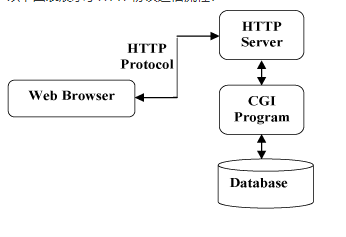
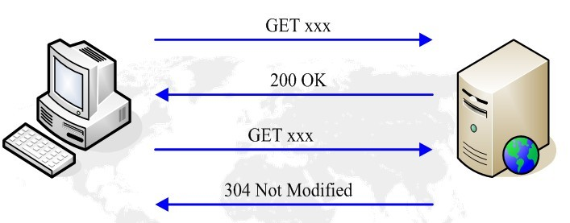
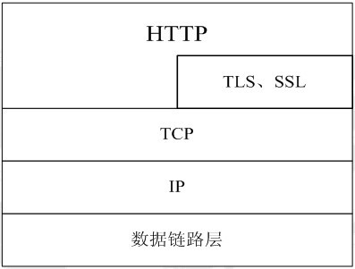
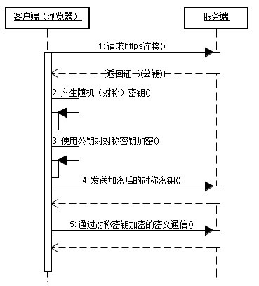
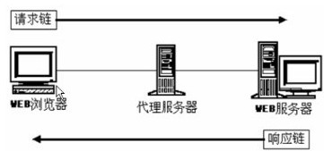
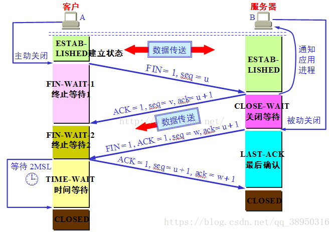

### http

#### HTTP 简介

HTTP协议是Hyper Text Transfer Protocol（超文本传输协议）的缩写,是用于从万维网（WWW:World Wide Web ）服务器传输超文本到本地浏览器的传送协议。。

HTTP是一个基于TCP/IP通信协议来传递数据（HTML 文件, 图片文件, 查询结果等）。

#### HTTP 工作原理

HTTP协议工作于客户端-服务端架构上。浏览器作为HTTP客户端通过URL向HTTP服务端即WEB服务器发送所有请求。

Web服务器有：Apache服务器，IIS服务器（Internet Information Services）等。

Web服务器根据接收到的请求后，向客户端发送响应信息。

HTTP默认端口号为80，但是你也可以改为8080或者其他端口。

**HTTP三点注意事项：**

- HTTP是无连接：无连接的含义是限制每次连接只处理一个请求。服务器处理完客户的请求，并收到客户的应答后，即断开连接。采用这种方式可以节省传输时间。
- HTTP是媒体独立的：这意味着，只要客户端和服务器知道如何处理的数据内容，任何类型的数据都可以通过HTTP发送。客户端以及服务器指定使用适合的MIME-type内容类型。
- HTTP是无状态：HTTP协议是无状态协议。无状态是指协议对于事务处理没有记忆能力。缺少状态意味着如果后续处理需要前面的信息，则它必须重传，这样可能导致每次连接传送的数据量增大。另一方面，在服务器不需要先前信息时它的应答就较快。

以下图表展示了HTTP协议通信流程：



#### HTTP 消息结构

HTTP是基于客户端/服务端（C/S）的架构模型，通过一个可靠的链接来交换信息，是一个无状态的请求/响应协议。

一个HTTP"客户端"是一个应用程序（Web浏览器或其他任何客户端），通过连接到服务器达到向服务器发送一个或多个HTTP的请求的目的。

一个HTTP"服务器"同样也是一个应用程序（通常是一个Web服务，如Apache Web服务器或IIS服务器等），通过接收客户端的请求并向客户端发送HTTP响应数据。

HTTP使用统一资源标识符（Uniform Resource Identifiers, URI）来传输数据和建立连接。

一旦建立连接后，数据消息就通过类似Internet邮件所使用的格式[RFC5322]和多用途Internet邮件扩展（MIME）[RFC2045]来传送。

##### 客户端请求消息

**客户端发送一个HTTP请求到服务器的请求消息包括以下格式：请求行（request line）、请求头部（header）、空行和请求数据四个部分组成，下图给出了请求报文的一般格式。**


==Host头域==指定请求资源的Intenet主机和端口号，必须表示请求ur的原始服务器或网关的位置。HTTP/1.1请求必须包含主机头域，否则系统会以400状态码返回。

==Referer头域==允许客户端指定请求uri的源资源地址，这可以允许服务器生成回退链表，可用来登陆、优化cache等。他也允许废除的或错误的连接由于维护的目的被追踪。如果请求的uri没有自己的uri地址，Referer不能被发送。如果指定的是部分uri地址，则此地址应该是一个相对地址。

==User-Agent头域==的内容包含发出请求的用户信息。

==Cache-Control==指定请求和响应遵循的缓存机制。在请求消息或响应消息中设置Cache-Control并不会修改另一个消息处理过程中的缓存处理过程。请求时的缓存指令包括no-cache、no-store、max-age、max-stale、min-fresh、only-if-cached，响应消息中的指令包括public、private、no-cache、no-store、no-transform、must-revalidate、proxy-revalidate、max-age。

==Date头域==表示消息发送的时间，时间的描述格式由rfc822定义。例如，Date:Mon,31Dec200104:25:57GMT。Date描述的时间表示世界标准时，换算成本地时间，需要知道用户所在的时区。

在http1.1中，client和server都是默认对方支持==长链接==的， 如果client使用http1.1协议，但又不希望使用长链接，则需要在header中指明connection的值为close；如果server方也不想支持长链接，则在response中也需要明确说明connection的值为close。不论request还是response的header中包含了值为close的connection，都表明当前正在使用的tcp链接在当天请求处理完毕后会被断掉。以后client再进行新的请求时就必须创建新的tcp链接了。

###### HTTP最常见的请求头如下：

```http

Accept：浏览器可接受的MIME类型；

Accept-Charset：浏览器可接受的字符集；

Accept-Encoding：浏览器能够进行解码的数据编码方式，比如gzip。Servlet能够向支持gzip的浏览器返回经gzip编码的HTML页面。许多情形下这可以减少5到10倍的下载时间；

Accept-Language：浏览器所希望的语言种类，当服务器能够提供一种以上的语言版本时要用到；

Authorization：授权信息，通常出现在对服务器发送的WWW-Authenticate头的应答中；

Connection：表示是否需要持久连接。如果Servlet看到这里的值为“Keep-Alive”，或者看到请求使用的是HTTP 1.1（HTTP 1.1默认进行持久连接），它就可以利用持久连接的优点，当页面包含多个元素时（例如Applet，图片），显著地减少下载所需要的时间。要实现这一点，Servlet需要在应答中发送一个Content-Length头，最简单的实现方法是：先把内容写入ByteArrayOutputStream，然后在正式写出内容之前计算它的大小；

Content-Length：表示请求消息正文的长度；

Cookie：这是最重要的请求头信息之一；

From：请求发送者的email地址，由一些特殊的Web客户程序使用，浏览器不会用到它；

Host：初始URL中的主机和端口；

If-Modified-Since：只有当所请求的内容在指定的日期之后又经过修改才返回它，否则返回304“Not Modified”应答；

Pragma：指定“no-cache”值表示服务器必须返回一个刷新后的文档，即使它是代理服务器而且已经有了页面的本地拷贝；

Referer：包含一个URL，用户从该URL代表的页面出发访问当前请求的页面。

User-Agent：浏览器类型，如果Servlet返回的内容与浏览器类型有关则该值非常有用；

UA-Pixels，UA-Color，UA-OS，UA-CPU：由某些版本的IE浏览器所发送的非标准的请求头，表示屏幕大小、颜色深度、操作系统和CPU类型。
```

###### HTTP最常见的响应头如下所示：

```http

Allow：服务器支持哪些请求方法（如GET、POST等）；

Content-Encoding：文档的编码（Encode）方法。只有在解码之后才可以得到Content-Type头指定的内容类型。利用gzip压缩文档能够显著地减少HTML文档的下载时间。Java的GZIPOutputStream可以很方便地进行gzip压缩，但只有Unix上的Netscape和Windows上的IE 4、IE 5才支持它。因此，Servlet应该通过查看Accept-Encoding头（即request.getHeader("Accept-Encoding")）检查浏览器是否支持gzip，为支持gzip的浏览器返回经gzip压缩的HTML页面，为其他浏览器返回普通页面；

Content-Length：表示内容长度。只有当浏览器使用持久HTTP连接时才需要这个数据。如果你想要利用持久连接的优势，可以把输出文档写入ByteArrayOutputStram，完成后查看其大小，然后把该值放入Content-Length头，最后通过byteArrayStream.writeTo(response.getOutputStream()发送内容；

Content-Type： 表示后面的文档属于什么MIME类型。Servlet默认为text/plain，但通常需要显式地指定为text/html。由于经常要设置Content-Type，因此HttpServletResponse提供了一个专用的方法setContentTyep。 可在web.xml文件中配置扩展名和MIME类型的对应关系；

Date：当前的GMT时间。你可以用setDateHeader来设置这个头以避免转换时间格式的麻烦；

Expires：指明应该在什么时候认为文档已经过期，从而不再缓存它。

Last-Modified：文档的最后改动时间。客户可以通过If-Modified-Since请求头提供一个日期，该请求将被视为一个条件GET，只有改动时间迟于指定时间的文档才会返回，否则返回一个304（Not Modified）状态。Last-Modified也可用setDateHeader方法来设置；

Location：表示客户应当到哪里去提取文档。Location通常不是直接设置的，而是通过HttpServletResponse的sendRedirect方法，该方法同时设置状态代码为302；

 Refresh：表示浏览器应该在多少时间之后刷新文档，以秒计。除了刷新当前文档之外，你还可以通过setHeader("Refresh", "5; URL=http://host/path")让浏览器读取指定的页面。注意这种功能通常是通过设置HTML页面HEAD区的<META HTTP-EQUIV="Refresh" CONTENT="5;URL=http://host/path">实现，这是因为，自动刷新或重定向对于那些不能使用CGI或Servlet的HTML编写者十分重要。但是，对于Servlet来说，直接设置Refresh头更加方便。注意Refresh的意义是“N秒之后刷新本页面或访问指定页面”，而不是“每隔N秒刷新本页面或访问指定页面”。因此，连续刷新要求每次都发送一个Refresh头，而发送204状态代码则可以阻止浏览器继续刷新，不管是使用Refresh头还是<META HTTP-EQUIV="Refresh" ...>。注意Refresh头不属于HTTP 1.1正式规范的一部分，而是一个扩展，但Netscape和IE都支持它。
```

###### 实体头

```http

实体头用坐实体内容的元信息，描述了实体内容的属性，包括实体信息类型，长度，压缩方法，最后一次修改时间，数据有效性等。

Allow：GET,POST

Content-Encoding：文档的编码（Encode）方法，例如：gzip，见“2.5 响应头”；
Content-Language：内容的语言类型，例如：zh-cn；

Content-Length：表示内容长度，eg：80，可参考“2.5响应头”；

Content-Location：表示客户应当到哪里去提取文档，例如：http://www.dfdf.org/dfdf.html，可参考“2.5响应头”；

Content-MD5：MD5 实体的一种MD5摘要，用作校验和。发送方和接受方都计算MD5摘要，接受方将其计算的值与此头标中传递的值进行比较。Eg1：Content-MD5: <base64 of 128 MD5 digest>。Eg2：dfdfdfdfdfdfdff==；

l         Content-Range：随部分实体一同发送；标明被插入字节的低位与高位字节偏移，也标明此实体的总长度。Eg1：Content-Range: 1001-2000/5000，eg2：bytes 2543-4532/7898

Content-Type：标明发送或者接收的实体的MIME类型。Eg：text/html; charset=GB2312       主类型/子类型；

Expires：为0证明不缓存；

Last-Modified：WEB 服务器认为对象的最后修改时间，比如文件的最后修改时间，动态页面的最后产生时间等等。例如：Last-Modified：Tue, 06 May 2008 02:42:43 GMT.
```

###### 扩展头

```http

在HTTP消息中，也可以使用一些再HTTP1.1正式规范里没有定义的头字段，这些头字段统称为自定义的HTTP头或者扩展头，他们通常被当作是一种实体头处理。

现在流行的浏览器实际上都支持Cookie,Set-Cookie,Refresh和Content-Disposition等几个常用的扩展头字段。

Refresh：1;url=http://www.dfdf.org  //过1秒跳转到指定位置；

Content-Disposition：头字段,可参考“2.5响应头”；

Content-Type：WEB 服务器告诉浏览器自己响应的对象的类型。

eg1：Content-Type：application/xml ；

eg2：applicaiton/octet-stream；
```

###### Cookie相关的HTTP扩展头

```http

1）Cookie：客户端将服务器设置的Cookie返回到服务器；

2）Set-Cookie：服务器向客户端设置Cookie；

3）Cookie2 (RFC2965)）：客户端指示服务器支持Cookie的版本；

4）Set-Cookie2 (RFC2965)：服务器向客户端设置Cookie。
```

###### 与缓存相关的HTTP扩展消息头

```http

Expires：指示响应内容过期的时间，格林威治时间GMT

Cache-Control：更细致的控制缓存的内容

Last-Modified：响应中资源最后一次修改的时间

ETag：响应中资源的校验值，在服务器上某个时段是唯一标识的。

Date：服务器的时间

If-Modified-Since：客户端存取的该资源最后一次修改的时间，同Last-Modified。

If-None-Match：客户端存取的该资源的检验值，同ETag。
```


##### 服务器响应消息

HTTP响应也由四个部分组成，分别是：状态行、消息报头、空行和响应正文。


##### 实例

客户端请求：

```http
GET /hello.txt HTTP/1.1
User-Agent: curl/7.16.3 libcurl/7.16.3 OpenSSL/0.9.7l zlib/1.2.3
Host: www.example.com
Accept-Language: en, mi
```

服务端响应:

```http
HTTP/1.1 200 OK
Date: Mon, 27 Jul 2009 12:28:53 GMT
Server: Apache
Last-Modified: Wed, 22 Jul 2009 19:15:56 GMT
ETag: "34aa387-d-1568eb00"
Accept-Ranges: bytes
Content-Length: 51
Vary: Accept-Encoding
Content-Type: text/plain
```

输出结果：

```http
Hello World! My payload includes a trailing CRLF.
```

##### 一次HTTP操作称为一个事务，其工作过程可分为四步：

1. 首先客户机与服务器需要建立连接。只要单击某个超级链接，HTTP的工作开始。
2. 建立连接后，客户机发送一个请求给服务器，请求方式的格式为：统一资源标识符（URL）、协议版本号，后边是MIME信息包括请求修饰符、客户机信息和可能的内容。
3. 服务器接到请求后，给予相应的响应信息，其格式为一个状态行，包括信息的协议版本号、一个成功或错误的代码，后边是MIME信息包括服务器信息、实体信息和可能的内容。
4. 客户端接收服务器所返回的信息通过浏览器显示在用户的显示屏上，然后客户机与服务器断开连接。

#### http 请求方法

HTTP1.1 新增了六种请求方法：OPTIONS、PUT、PATCH、DELETE、TRACE 和 CONNECT 方法。

| **序号** |  方法   | 描述                                                         |
| :------: | :-----: | :----------------------------------------------------------- |
|    1     |   GET   | 请求指定的页面信息，并返回实体主体。                         |
|    2     |  HEAD   | 类似于 GET 请求，只不过返回的响应中没有具体的内容，用于获取报头 |
|    3     |  POST   | 向指定资源提交数据进行处理请求（例如提交表单或者上传文件）。数据被包含在请求体中。POST 请求可能会导致新的资源的建立和/或已有资源的修改。 |
|    4     |   PUT   | 从客户端向服务器传送的数据取代指定的文档的内容。             |
|    5     | DELETE  | 请求服务器删除指定的页面。                                   |
|    6     | CONNECT | HTTP/1.1 协议中预留给能够将连接改为管道方式的代理服务器。    |
|    7     | OPTIONS | 允许客户端查看服务器的性能。                                 |
|    8     |  TRACE  | 回显服务器收到的请求，主要用于测试或诊断。                   |
|    9     |  PATCH  | 是对 PUT 方法的补充，用来对已知资源进行局部更新 。           |

#### http 响应头信息

|    **应答头**    | **说明**                                                     |
| :--------------: | :----------------------------------------------------------- |
|      Allow       | 服务器支持哪些请求方法（如GET、POST等）。                    |
| Content-Encoding | 文档的编码（Encode）方法。只有在解码之后才可以得到Content-Type头指定的内容类型。利用gzip压缩文档能够显著地减少HTML文档的下载时间。Java的GZIPOutputStream可以很方便地进行gzip压缩，但只有Unix上的Netscape和Windows上的IE 4、IE 5才支持它。因此，Servlet应该通过查看Accept-Encoding头（即request.getHeader("Accept-Encoding")）检查浏览器是否支持gzip，为支持gzip的浏览器返回经gzip压缩的HTML页面，为其他浏览器返回普通页面。 |
|  Content-Length  | 表示内容长度。只有当浏览器使用持久HTTP连接时才需要这个数据。如果你想要利用持久连接的优势，可以把输出文档写入 ByteArrayOutputStream，完成后查看其大小，然后把该值放入Content-Length头，最后通过byteArrayStream.writeTo(response.getOutputStream()发送内容。 |
|   Content-Type   | 表示后面的文档属于什么MIME类型。Servlet默认为text/plain，但通常需要显式地指定为text/html。由于经常要设置Content-Type，因此HttpServletResponse提供了一个专用的方法setContentType。 |
|       Date       | 当前的GMT时间。你可以用setDateHeader来设置这个头以避免转换时间格式的麻烦。 |
|     Expires      | 应该在什么时候认为文档已经过期，从而不再缓存它？             |
|  Last-Modified   | 文档的最后改动时间。客户可以通过If-Modified-Since请求头提供一个日期，该请求将被视为一个条件GET，只有改动时间迟于指定时间的文档才会返回，否则返回一个304（Not Modified）状态。Last-Modified也可用setDateHeader方法来设置。 |
|     Location     | 表示客户应当到哪里去提取文档。Location通常不是直接设置的，而是通过HttpServletResponse的sendRedirect方法，该方法同时设置状态代码为302。 |
|     Refresh      | 表示浏览器应该在多少时间之后刷新文档，以秒计。除了刷新当前文档之外，你还可以通过setHeader("Refresh", "5; URL=http://host/path")让浏览器读取指定的页面。<br /><br />     注意这种功能通常是通过设置HTML页面HEAD区的＜META HTTP-EQUIV="Refresh" CONTENT="5;URL=http://host/path"＞实现，这是因为，自动刷新或重定向对于那些不能使用CGI或Servlet的HTML编写者十分重要。<br /><br />    但是，对于Servlet来说，直接设置Refresh头更加方便。 表示浏览器应该在多少时间之后刷新文档，以秒计。除了刷新当前文档之外，你还可以通过setHeader("Refresh", "5; URL=http://host/path")让浏览器读取指定的页面。<br /><br />     注意这种功能通常是通过设置HTML页面HEAD区的＜META HTTP-EQUIV="Refresh" CONTENT="5;URL=http://host/path"＞实现，这是因为，自动刷新或重定向对于那些不能使用CGI或Servlet的HTML编写者十分重要。但是，对于Servlet来说，直接设置Refresh头更加方便。<br /><br />    注意Refresh的意义是"N秒之后刷新本页面或访问指定页面"，而不是"每隔N秒刷新本页面或访问指定页面"。因此，连续刷新要求每次都发送一个Refresh头，而发送204状态代码则可以阻止浏览器继续刷新，不管是使用Refresh头还是＜META HTTP-EQUIV="Refresh" ...＞。<br /><br />     注意Refresh头不属于HTTP 1.1正式规范的一部分，而是一个扩展，但Netscape和IE都支持它。 |
|      Server      | 服务器名字。Servlet一般不设置这个值，而是由Web服务器自己设置。 |
|    Set-Cookie    | 设置和页面关联的Cookie。Servlet不应使用response.setHeader("Set-Cookie", ...)，而是应使用HttpServletResponse提供的专用方法addCookie。参见下文有关Cookie设置的讨论。 |
| WWW-Authenticate | 客户应该在Authorization头中提供什么类型的授权信息？在包含401（Unauthorized）状态行的应答中这个头是必需的。例如，response.setHeader("WWW-Authenticate", "BASIC realm=＼"executives＼"")。<br/>注意Servlet一般不进行这方面的处理，而是让Web服务器的专门机制来控制受密码保护页面的访问（例如.htaccess）。 |

#### HTTP content-type

Content-Type（内容类型），一般是指网页中存在的 Content-Type，用于定义网络文件的类型和网页的编码，决定浏览器将以什么形式、什么编码读取这个文件，这就是经常看到一些 PHP 网页点击的结果却是下载一个文件或一张图片的原因。

Content-Type 标头告诉客户端实际返回的内容的内容类型。

语法格式：

```http
Content-Type: text/html; charset=utf-8
Content-Type: multipart/form-data; boundary=something
```

实例：


常见的媒体格式类型如下

- text/html ： HTML格式
- text/plain ：纯文本格式
- text/xml ： XML格式
- image/gif ：gif图片格式
- image/jpeg ：jpg图片格式
- image/png：png图片格式

以application开头的媒体格式类型：

- application/xhtml+xml ：XHTML格式
- application/xml： XML数据格式
- application/atom+xml ：Atom XML聚合格式
- application/json： JSON数据格式
- application/pdf：pdf格式
- application/msword ： Word文档格式
- application/octet-stream ： 二进制流数据（如常见的文件下载）
- application/x-www-form-urlencoded ： <form encType="">中默认的encType，form表单数据被编码为key/value格式发送到服务器（表单默认的提交数据的格式）

另外一种常见的媒体格式是上传文件之时使用的：

- multipart/form-data ： 需要在表单中进行文件上传时，就需要使用该格式

#### 问题

##### 什么是Web缓存？

WEB缓存(cache)位于Web服务器和客户端之间。缓存会根据请求保存输出内容的副本，例如html页面，图片，文件，当下一个请求来到的时候：如果是相同的URL，缓存直接使用副本响应访问请求，而不是向源服务器再次发送请求。HTTP协议定义了相关的消息头来使WEB缓存尽可能好的工作。

##### 缓存的优点？

减少相应延迟：因为请求从缓存服务器（离客户端更近）而不是源服务器被相应，这个过程耗时更少，让web服务器看上去相应更快。减少网络带宽消耗：当副本被重用时会减低客户端的带宽消耗；客户可以节省带宽费用，控制带宽的需求的增长并更易于管理。

##### 客户端缓存生效的常见流程?

服务器收到请求时，会在200OK中回送该资源的Last-Modified和ETag头，客户端将该资源保存在cache中，并记录这两个属性。当客户端需要发送相同的请求时，会在请求中携带If-Modified-Since和If-None-Match两个头。两个头的值分别是响应中Last-Modified和ETag头的值。服务器通过这两个头判断本地资源未发生变化，客户端不需要重新下载，返回304响应。常见流程如下图所示：



##### Web缓存机制?

HTTP/1.1中缓存的目的是为了在很多情况下减少发送请求，同时在许多情况下可以不需要发送完整响应。前者减少了网络回路的数量；HTTP利用一个“过期（expiration）”机制来为此目的。后者减少了网络应用的带宽；HTTP用“验证（validation）”机制来为此目的。

HTTP定义了3种缓存机制：

1）Freshness：允许一个回应消息可以在源服务器不被重新检查，并且可以由服务器和客户端来控制。例如，Expires回应头给了一个文档不可用的时间。Cache-Control中的max-age标识指明了缓存的最长时间；

2）Validation：用来检查一个缓存的回应是否仍然可用。例如，如果一个回应有一个Last-Modified回应头，缓存能够使用If-Modified-Since来判断是否已改变，以便判断根据情况发送请求；

3）Invalidation： 在另一个请求通过缓存的时候，常常有一个副作用。例如，如果一个URL关联到一个缓存回应，但是其后跟着POST、PUT和DELETE的请求的话，缓存就会过期。

##### 断点续传和多线程下载的实现原理?

  HTTP协议的GET方法，支持只请求某个资源的某一部分；

206 Partial Content 部分内容响应；

Range 请求的资源范围；

 Content-Range 响应的资源范围；

在连接断开重连时，客户端只请求该资源未下载的部分，而不是重新请求整个资源，来实现断点续传。

分块请求资源实例：

Eg1：Range: bytes=306302- ：请求这个资源从306302个字节到末尾的部分；

Eg2：Content-Range: bytes 306302-604047/604048：响应中指示携带的是该资源的第306302-604047的字节，该资源共604048个字节；

客户端通过并发的请求相同资源的不同片段，来实现对某个资源的并发分块下载。从而达到快速下载的目的。目前流行的FlashGet和迅雷基本都是这个原理。

##### 多线程下载的原理?

下载工具开启多个发出HTTP请求的线程；

每个http请求只请求资源文件的一部分：Content-Range: bytes 20000-40000/47000；

合并每个线程下载的文件。

##### 什么是https?

HTTPS（全称：Hypertext Transfer Protocol over Secure Socket Layer），是以安全为目标的HTTP通道，简单讲是HTTP的安全版。即HTTP下加入SSL层，HTTPS的安全基础是SSL，因此加密的详细内容请看SSL。

见下图：



##### https的实现原理?

有两种基本的加解密算法类型：

1）对称加密：密钥只有一个，加密解密为同一个密码，且加解密速度快，典型的对称加密算法有DES、AES等；

2）非对称加密：密钥成对出现（且根据公钥无法推知私钥，根据私钥也无法推知公钥），加密解密使用不同密钥（公钥加密需要私钥解密，私钥加密需要公钥解密），相对对称加密速度较慢，典型的非对称加密算法有RSA、DSA等。

下面看一下https的通信过程：



##### https通信的优点?

1）客户端产生的密钥只有客户端和服务器端能得到；

2）加密的数据只有客户端和服务器端才能得到明文；

3）客户端到服务端的通信是安全的。

#####  http代理服务器?

代理服务器英文全称是Proxy Server，其功能就是代理网络用户去取得网络信息。形象的说：它是网络信息的中转站。

代理服务器是介于浏览器和Web服务器之间的一台服务器，有了它之后，浏览器不是直接到Web服务器去取回网页而是向代理服务器发出请求，Request信号会先送到代理服务器，由代理服务器来取回浏览器所需要的信息并传送给你的浏览器。

而且，大部分代理服务器都具有缓冲的功能，就好象一个大的Cache，它有很大的存储空间，它不断将新取得数据储存到它本机的存储器上，如果浏览器所请求的数据在它本机的存储器上已经存在而且是最新的，那么它就不重新从Web服务器取数据，而直接将存储器上的数据传送给用户的浏览器，这样就能显著提高浏览速度和效率。

更重要的是：Proxy Server(代理服务器)是Internet链路级网关所提供的一种重要的安全功能，它的工作主要在开放系统互联(OSI)模型的对话层。

##### http代理服务器的主要功能?

主要功能如下：

1）突破自身IP访问限制，访问国外站点。如：教育网、169网等网络用户可以通过代理访问国外网站；

2）访问一些单位或团体内部资源，如某大学FTP(前提是该代理地址在该资源的允许访问范围之内)，使用教育网内地址段免费代理服务器，就可以用于对教育 网开放的各类FTP下载上传，以及各类资料查询共享等服务；

3）突破中国电信的IP封锁：中国电信用户有很多网站是被限制访问的，这种限制是人为的，不同Serve对地址的封锁是不同的。所以不能访问时可以换一个国 外的代理服务器试试；

4）提高访问速度：通常代理服务器都设置一个较大的硬盘缓冲区，当有外界的信息通过时，同时也将其保存到缓冲区中，当其他用户再访问相同的信息时， 则直接由缓冲区中取出信息，传给用户，以提高访问速度；

5）隐藏真实IP：上网者也可以通过这种方法隐藏自己的IP，免受攻击。

##### http代理图示?



对于客户端浏览器而言，http代理服务器相当于服务器。

而对于Web服务器而言，http代理服务器又担当了客户端的角色。

##### 什么是虚拟主机?

所谓虚拟主机，也叫“网站空间”就是把一台运行在互联网上的服务器划分成多个“虚拟”的服务器，每一个虚拟主机都具有独立的域名和完整的Internet服务器（支持WWW、FTP、E-mail等）功能。一台服务器上的不同虚拟主机是各自独立的，并由用户自行管理。但一台服务器主机只能够支持一定数量的虚拟主机，当超过这个数量时，用户将会感到性能急剧下降。

##### 虚拟主机的实现原理?

虚拟主机是用同一个WEB服务器，为不同域名网站提供服务的技术。Apache、Tomcat等均可通过配置实现这个功能。

相关的HTTP消息头：Host。

例如：Host: www.baidu.com

客户端发送HTTP请求的时候，会携带Host头，Host头记录的是客户端输入的域名。这样服务器可以根据Host头确认客户要访问的是哪一个域名。

### TCP/IP

TCP==三次握手==的过程如下:

建立TCP连接，就是指建立一个TCP连接时，需要客户端和服务端总共发送3个包以确认连接的建立。在socket编程中，这一过程由客户端执行connect来触发。

在TCP/IP协议中,TCP协议提供可靠的连接服务,采用三次握手建立一个连接.

第一次握手：Client将标志位SYN置为1，随机产生一个值seq=J，并将该数据包发送给Server，Client进入SYN_SENT状态，等待Server确认。

SYN：同步序列编号(Synchronize Sequence Numbers)

第二次握手：Server收到数据包后由标志位SYN=1知道Client请求建立连接，Server将标志位SYN和ACK都置为1，ack=J+1，随机产生一个值seq=K，并将该数据包发送给Client以确认连接请求，Server进入SYN_RCVD状态。

第三次握手：Client收到确认后，检查ack是否为J+1，ACK是否为1，如果正确则将标志位ACK置为1，ack=K+1，并将该数据包发送给Server，Server检查ack是否为K+1，ACK是否为1，如果正确则连接建立成功，Client和Server进入ESTABLISHED状态，完成三次握手，随后Client与Server之间可以开始传输数据了。




四次挥手（Four-Way Wavehand）即终止TCP连接，就是指断开一个TCP连接时，需要客户端和服务端总共发送4个包以确认连接的断开。在socket编程中，这一过程由客户端或服务端任一方执行close来触发

TCP四次挥手的过程如下:


1.第一次挥手：Client发送一个FIN，用来关闭Client到Server的数据传送，Client进入FIN_WAIT_1状态。

2.第二次挥手：Server收到FIN后，发送一个ACK给Client，确认序号为收到序号+1（与SYN相同，一个FIN占用一个序号），Server进入CLOSE_WAIT状态。

3.第三次挥手：Server发送一个FIN，用来关闭Server到Client的数据传送，Server进入LAST_ACK状态。

4.第四次挥手：Client收到FIN后，Client进入TIME_WAIT状态，接着发送一个ACK给Server，确认序号为收到序号+1， Server进入CLOSED状态，完成四次挥手。

如果有大量的连接，每次在连接、关闭时都要三次握手，四次挥手，会很明显会造成性能低下，因此，

HTTP有一种叫做keep connection的机制，它可以在传输数据后仍然保持连接，当客户端再次获取数据时，直接使用刚刚空闲下的连接而无需再次握手

##### 为什么需要三次握手，是为了解决下列的一个问题？

client发出的第一个连接请求报文段并没有丢失，而是在某个网络结点长时间的滞留了，以致延误到连接释放以后的某个时间才到达server。本来这是一个早已失效的报文段。但server收到此失效的连接请求报文段后，就误认为是client再次发出的一个新的连接请求。于是就向client发出确认报文段，同意建立连接。假设不采用三次握手，那么只要server发出确认，新的连接就建立了。由于现在client并没有发出建立连接的请求，因此不会理睬server的确认，也不会向server发送数据。但server却以为新的运输连接已经建立，并一直等待client发来数据。这样，server的很多资源就白白浪费掉了。采用三次握手的办法可以防止上述现象发生

##### 为什么连接的时候是三次握手，关闭的时候却是四次握手？

因为当Server端收到Client端的SYN连接请求报文后，可以直接发送SYN+ACK报文。其中ACK报文是用来应答的，SYN报文是用来同步的。但是关闭连接时，当Server端收到FIN报文时，很可能并不会立即关闭SOCKET，所以只能先回复一个ACK报文，告诉Client端，"你发的FIN报文我收到了"。只有等到我Server端所有的报文都发送完了，我才能发送FIN报文，因此不能一起发送。故需要四步握手。

##### 什么TIME_WAIT状态需要经过2MSL(最大报文段生存时间)才能返回到CLOSE状态？

虽然按道理，四个报文都发送完毕，我们可以直接进入CLOSE状态了，但是我们必须假象网络是不可靠的，有可以最后一个ACK丢失。所以TIME_WAIT状态就是用来重发可能丢失的ACK报文。在Client发送出最后的ACK回复，但该ACK可能丢失。Server如果没有收到ACK，将不断重复发送FIN片段。所以Client不能立即关闭，它必须确认Server接收到了该ACK。Client会在发送出ACK之后进入到TIME_WAIT状态。Client会设置一个计时器，等待2MSL的时间。如果在该时间内再次收到FIN，那么Client会重发ACK并再次等待2MSL。所谓的2MSL是两倍的MSL(Maximum Segment Lifetime)。MSL指一个片段在网络中最大的存活时间，2MSL就是一个发送和一个回复所需的最大时间。如果直到2MSL，Client都没有再次收到FIN，那么Client推断ACK已经被成功接收，则结束TCP连接。

##### 为什么不能用两次握手进行连接？

3次握手完成两个重要的功能，既要双方做好发送数据的准备工作(双方都知道彼此已准备好)，也要允许双方就初始序列号进行协商，这个序列号在握手过程中被发送和确认。

​    现在把三次握手改成仅需要两次握手，死锁是可能发生的。作为例子，考虑计算机S和C之间的通信，假定C给S发送一个连接请求分组，S收到了这个分组，并发 送了确认应答分组。按照两次握手的协定，S认为连接已经成功地建立了，可以开始发送数据分组。可是，C在S的应答分组在传输中被丢失的情况下，将不知道S 是否已准备好，不知道S建立什么样的序列号，C甚至怀疑S是否收到自己的连接请求分组。在这种情况下，C认为连接还未建立成功，将忽略S发来的任何数据分 组，只等待连接确认应答分组。而S在发出的分组超时后，重复发送同样的分组。这样就形成了死锁。

##### 如果已经建立了连接，但是客户端突然出现故障了怎么办？

CP还设有一个保活计时器，显然，客户端如果出现故障，服务器不能一直等下去，白白浪费资源。服务器每收到一次客户端的请求后都会重新复位这个计时器，时间通常是设置为2小时，若两小时还没有收到客户端的任何数据，服务器就会发送一个探测报文段，以后每隔75秒钟发送一次。若一连发送10个探测报文仍然没反应，服务器就认为客户端出了故障，接着就关闭连接。

### 传输层主要有哪些协议？

主要有 TCP 和 UDP 协议。他们的区别是 TCP 是需要连接的 会经过三次握手，而且可以保证消息的可靠性。UDP 是不需要连接的，不保证消息的可靠性。