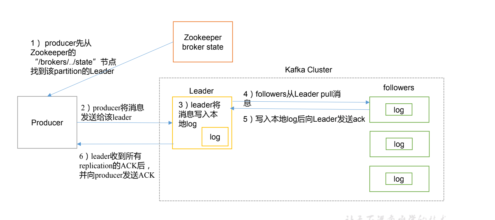

### kafka

#### kafka架构


#### kafka集群部署？

```bash
# 1）解压安装包
[atguigu@hadoop102 software]$ tar -zxvf kafka_2.11-0.11.0.0.tgz -C /opt/module/

# 2）修改解压后的文件名称
[atguigu@hadoop102 module]$ mv kafka_2.11-0.11.0.0/ kafka

# 3）在/opt/module/kafka 目录下创建 logs 文件夹
[atguigu@hadoop102 kafka]$ mkdir logs

# 4）修改配置文件
[atguigu@hadoop102 kafka]$ cd config/
[atguigu@hadoop102 config]$ vi server.properties
#输入以下内容：
  #broker 的全局唯一编号，不能重复
  broker.id=0
  #删除 topic 功能使用
  delete.topic.enable=true
  #处理网络请求的线程数量
  num.network.threads=3
  #用来处理磁盘 IO 的线程数量
  num.io.threads=8
  #发送套接字的缓冲区大小
  socket.send.buffer.bytes=102400
  #接收套接字的缓冲区大小
  socket.receive.buffer.bytes=102400
  #请求套接字的缓冲区大小
  socket.request.max.bytes=104857600 
  #kafka 运行日志存放的路径
  log.dirs=/opt/module/kafka/logs
  #topic 在当前 broker 上的分区个数
  num.partitions=1
  #用来恢复和清理 data 下数据的线程数量
  num.recovery.threads.per.data.dir=1
  #segment 文件保留的最长时间，超时将被删除
  log.retention.hours=168
  #配置连接 Zookeeper 集群地址
  zookeeper.connect=hadoop102:2181,hadoop103:2181,hadoop104:2181
  
# 5）配置环境变量
[atguigu@hadoop102 module]$ sudo vi /etc/profile
#KAFKA_HOME
export KAFKA_HOME=/opt/module/kafka
export PATH=$PATH:$KAFKA_HOME/bin
[atguigu@hadoop102 module]$ source /etc/profile

# 6）分发安装包  注意：分发之后记得配置其他机器的环境变量
[atguigu@hadoop102 module]$ xsync kafka/

# 7）分别在 hadoop103 和 hadoop104 上修改配置文件/opt/module/kafka/config/server.properties 中的 broker.id=1、broker.id=2
# 注：broker.id 不得重复

# 8）启动集群
# 依次在 hadoop102、hadoop103、hadoop104 节点上启动 kafka
[atguigu@hadoop102 kafka]$ bin/kafka-server-start.sh config/server.properties &
[atguigu@hadoop103 kafka]$ bin/kafka-server-start.sh config/server.properties &
[atguigu@hadoop104 kafka]$ bin/kafka-server-start.sh config/server.properties &

# 9）关闭集群
[atguigu@hadoop102 kafka]$ bin/kafka-server-stop.sh stop
[atguigu@hadoop103 kafka]$ bin/kafka-server-stop.sh stop
[atguigu@hadoop104 kafka]$ bin/kafka-server-stop.sh stop
```

####  **Kafka** 命令行操作

```bash
# 1）查看当前服务器中的所有 topic
[atguigu@hadoop102 kafka]$ bin/kafka-topics.sh --zookeeper hadoop102:2181 --list

# 2）创建 topic
[atguigu@hadoop102 kafka]$ bin/kafka-topics.sh --zookeeper hadoop102:2181 \
--create --replication-factor 3 --partitions 1 --topic first
# 选项说明：
	# --topic 定义 topic 名
	# --replication-factor 定义副本数
	# --partitions 定义分区数
	
# 3）删除 topic
[atguigu@hadoop102 kafka]$ bin/kafka-topics.sh --zookeeper hadoop102:2181 \
--delete --topic first
# 需要 server.properties 中设置 delete.topic.enable=true 否则只是标记删除或者直接重启。

# 4）发送消息
[atguigu@hadoop102 kafka]$ bin/kafka-console-producer.sh \
--broker-list hadoop102:9092 --topic first
>hello world
>atguigu atguigu

# 5）消费消息
[atguigu@hadoop103 kafka]$ bin/kafka-console-consumer.sh \
--zookeeper hadoop102:2181 --from-beginning --topic first
# --from-beginning：会把 first 主题中以往所有的数据都读取出来。根据业务场景选择是否增加该配置。

# 6）查看某个 Topic 的详情
[atguigu@hadoop102 kafka]$ bin/kafka-topics.sh --zookeeper hadoop102:2181 \
--describe --topic first

```

#### kafka 生产过程分析

##### 1. 写入方式

​	producer 采用推（push）模式将消息发布到 broker，每条消息都被追加（append）到分区（patition）中，属于顺序写磁盘（顺序写磁盘效率比随机写内存要高，保障 kafka 吞吐率）。

##### 2. 分区

​	消息发送时都被发送到一个 topic，其本质就是一个目录，而 topic 是由一些 Partition Logs(分区日志)组成，其组织结构如下图所示：


我们可以看到，每个 Partition 中的消息都是==有序==的，生产的消息被不断追加到 Partition log 上，其中的每一个消息都被赋予了一个==唯一的 offset 值==。 

1）分区的原因

（1）方便在集群中扩展，每个 Partition 可以通过调整以适应它所在的机器，而一个 topic又可以有多个 Partition 组成，因此整个集群就可以适应任意大小的数据了；

（2）可以提高并发，因为可以以 Partition 为单位读写了。

2）分区的原则

（1）指定了 patition，则直接使用； 

（2）未指定 patition 但指定 key，通过对 key 的 value 进行 hash 出一个 patition； 

（3）patition 和 key 都未指定，使用轮询选出一个 patition。

```java
// DefaultPartitioner 类
public int partition(String topic, Object key, byte[] keyBytes, Object value, byte[] 
valueBytes, Cluster cluster) {
    	List<PartitionInfo> partitions = cluster.partitionsForTopic(topic);
    	int numPartitions = partitions.size();
      if (keyBytes == null) {
        int nextValue = nextValue(topic);
        List<PartitionInfo> availablePartitions = 
        cluster.availablePartitionsForTopic(topic);
        if (availablePartitions.size() > 0) {
        int part = Utils.toPositive(nextValue) % availablePartitions.size();
        return availablePartitions.get(part).partition();
    } else {
   	 	// no partitions are available, give a non-available partition
    	return Utils.toPositive(nextValue) % numPartitions;
    }
    } else {
    	// hash the keyBytes to choose a partition
    	return Utils.toPositive(Utils.murmur2(keyBytes)) % numPartitions;
  	} 
}
```

##### 3. 副本（Replication)

同 一 个 partition 可 能 会 有 多 个 replication （ 对 应 server.properties 配 置 中 的==default.replication.factor=N==）。没有replication 的情况下，一旦 broker 宕机，其上所有 patition 的数据都不可被消费，同时 producer 也不能再将数据存于其上的 patition。引入 replication之后，同一个 partition 可能会有多个 replication，而这时需要在这些 replication 之间选出一个 leader，producer 和 consumer 只与这个 leader 交互，其它 replication 作为 follower 从 leader 中复制数据。

##### 4. 写入流程

​	producer 写入消息流程如下：



1）producer 先从 zookeeper 的 "/brokers/.../state"节点找到该 partition 的 leader

2）producer 将消息发送给该 leader

3）leader 将消息写入本地 log

4）followers 从 leader pull 消息，写入本地 log 后向 leader 发送 ACK

5）leader 收到所有 ISR 中的 replication 的 ACK 后，增加 HW（high watermark，最后 commit 的 offset）并向 producer 发送 ACK

##### 5. broker 保存消息

###### 	1. 存储方式

​		物理上把 topic 分成一个或多个 patition（对应 ==server.properties== 中的 ==num.partitions=3== 配置），每个 patition 物理上对应一个文件夹（该文件夹存储该 patition 的所有消息和索引文件），如下：

```bash
[atguigu@hadoop102 logs]$ ll
drwxrwxr-x. 2 atguigu atguigu 4096 8 月 6 14:37 first-0
drwxrwxr-x. 2 atguigu atguigu 4096 8 月 6 14:35 first-1
drwxrwxr-x. 2 atguigu atguigu 4096 8 月 6 14:37 first-2
[atguigu@hadoop102 logs]$ cd first-0
[atguigu@hadoop102 first-0]$ ll
-rw-rw-r--. 1 atguigu atguigu 10485760 8 月 6 14:33 00000000000000000000.index
-rw-rw-r--. 1 atguigu atguigu 219 8 月 6 15:07 00000000000000000000.log
-rw-rw-r--. 1 atguigu atguigu 10485756 8 月 6 14:33 00000000000000000000.timeindex
-rw-rw-r--. 1 atguigu atguigu 8 8 月 6 14:37 leader-epoch-checkpoint
```

###### 2. 存储策略

无论消息是否被消费，kafka 都会保留所有消息。有两种策略可以删除旧数据：

1）基于时间：==log.retention.hours=168==

2）基于大小：==log.retention.bytes=1073741824==

需要注意的是，因为 Kafka 读取特定消息的时间复杂度为 O(1)，即与文件大小无关，

所以这里删除过期文件与提高 Kafka 性能无关。

###### 3. zookeeper 存储结构


注意：producer 不在 zk 中注册，消费者在 zk 中注册。

###### 4. kafka消费过程分析

kafka 提供了两套 consumer API：高级 Consumer API 和低级 Consumer API。

**高级** **API**

1）高级 API 优点

​	1. 高级 API 写起来简单

​	2. 不需要自行去管理 offset，系统通过 zookeeper 自行管理。

​	3. 不需要管理分区，副本等情况，.系统自动管理。

 	4. 消费者断线会自动根据上一次记录在 zookeeper 中的 offset 去接着获取数据（默认设置1 分钟更新一下 zookeeper 中存的 offset）可以使用 group 来区分对同一个 topic 的不同程序访问分离开来（不同的 group 记录不同的 offset，这样不同程序读取同一个 topic 才不会因为 offset 互相影响）

2）高级 API 缺点

​	1. 不能自行控制 offset（对于某些特殊需求来说）

	2. 不能细化控制如分区、副本、zk 等

**低级** **API**

1）低级 API 优点

​	1. 能够让开发者自己控制 offset，想从哪里读取就从哪里读取。

​	2. 自行控制连接分区，对分区自定义进行负载均衡

	3. 对 zookeeper 的依赖性降低（如：offset 不一定非要靠 zk 存储，自行存储 offset 即可，比如存在文件或者内存中）

2）低级 API 缺点

太过复杂，需要自行控制 offset，连接哪个分区，找到分区 leader 等。

###### 5. 消费者组


消费者是以 consumer group 消费者组的方式工作，由一个或者多个消费者组成一个组，共同消费一个 topic。每个分区在同一时间只能由 group 中的一个消费者读取，但是多个 group可以同时消费这个 partition。在图中，有一个由三个消费者组成的 group，有一个消费者读取主题中的两个分区，另外两个分别读取一个分区。某个消费者读取某个分区，也可以叫做某个消费者是某个分区的拥有者。

在这种情况下，消费者可以通过水平扩展的方式同时读取大量的消息。另外，如果一个消费者失败了，那么其他的 group 成员会自动负载均衡读取之前失败的消费者读取的分区。

###### 6. 消费方式

​	==consumer 采用 pull（拉）模式从 broker 中读取数据。==

​	push（推）模式很难适应消费速率不同的消费者，因为消息发送速率是由 broker 决定的。它的目标是尽可能以最快速度传递消息，但是这样很容易造成 consumer 来不及处理消息，典型的表现就是拒绝服务以及网络拥塞。而 pull 模式则可以根据consumer 的消费能力以适当的速率消费消息。对于 Kafka 而言，pull 模式更合适，它可简化 broker 的设计，consumer 可自主控制消费消息的速率，同时 consumer 可以自己控制消费方式——即可批量消费也可逐条消费，同时还能选择不同的提交方式从而实现不同的传输语义。pull 模式不足之处是，如果 kafka 没有数据，消费者可能会陷入循环中，一直等待数据到达。为了避免这种情况，我们在我们的拉请求中有参数，允许消费者请求在等待数据到达的“长轮询”中进行阻塞（并且可选地等待到给定的字节数，以确保大的传输大小）。

#### 1. kafka 消费者

##### 1. 订阅主体的方式？

subscribe 和 assign

subscribe方式中，消费组内的分区分配是系统自动的，assign是手动定死的(TopicPartition)

subscribe方式中，消费组自动在均衡可以生效：而assign方式不会生效

##### 2. 如何实现动态订阅？

subscribe(Patten.compile("topc_.*"));

##### 3. 消费位移(偏移量)提交

自动提交：enable.auto.offset.commit = true; 位移会被每隔auto.offset.commit.interval.ms=5000提交到一个特殊topic : __consummer

手动提交：enable.auto.offset.commit = false; 然后在程序中得添加提交offset的代码；

调api: consumer.commitSync()阻塞同步提交，consumer。commitAsync()异步阻塞提交

自己存： long offset - record.offset(); saveOffsets(offset + 1) // 这些代码完全可以有自己控制，可以写入MySQL、Redis、zookerper、 hbase

##### 4. 消费者什么情况下会发生重复消费或者数据丢失？

自动提交偏移量：拉取一批消息，处理完，还没来得及提交偏移量时宕机，重启时会重复消费

手动提交偏移量：如果手动提交偏移量的顺序安排同上，则也会发生数据重复消费

针对消息重复消费：==将消息的唯一标识(offset)保存到外部介质中，每次消费时判断是否处理过即可==

#### 2. kafka生产者

##### 1. 写入数据时发生重复或者丢失的问题？

什么时候会发生重复写入：

parducer的重试机制中，检测到一条数据的发生失败，而实际上已经发送成功，只是因为服务端响应超时

什么时候会发生数据写入丢失：ack参数的配置

​	ack = 0  // 数据丢失概率最大

​	ack = 1 // 概率变小

​	ack = -1 or all // 概率最小(也有可能会丢失，比如main.inSync.replicas = 1, 那么意味着若集群那边，一个partition的同步副本只有一个，也是被允许的，此时生产者发送的消息，只要被这一个同步副本写入，就会响应成功)

##### 2. 幂等性

​	生产者将一条数据多次重复写入的情况下，borker端依然只有一条

​	所谓重复，不是如下情形！！！

```bash
producer.send("hello test")
producer.send("hello test")
```

##### 3. 生产者发送数据的流程？

​	有两个线程：

​	线程1： 负责数据的生产和拦截、序列化、分区、写入"消息累加器"进行批次整合

​	sender线程：将消息批转成request对象，然后异步发出(不等待响应，而是将已发出的request缓存起来，一旦有响应则清除，顺带清除消息累加器中国对应的消息fetch)

#### 3. kafka 日志分段切分条件

1. 当前日志分段文件的大小超过了borker端参数 log_segme.bytes 配置的值。 log.segme.bytes 参数的默认值为： 1073741824，即1GB
2. 当前日志分段中消息的最大时间戳与当前系统的时间戳的差值大于log.roll.ms 或者log.roll.hours 参数配置的值， 如果同时配置了log.roll.ms 和log.roll.hours 参数， 那么 log.roll.ms的优先级高，默认情况下，只配置了log.roll.hours参数，其值为168 即7天。
3. 偏移量索引索引文件或时间戳索引文件的大小达到borker端参数 log.index.size.max.bytes 配置的值。log.index.size.max.bytes的默认值为10485760，即10M。追加的消息偏移量与当前日志分段的偏移量之间的差值大于integer.MAX_VALUE,即要追加的消息的偏移量不能转变为相对偏移量(offset - baseOffset > Interget.MAX_VALUE)

#### 4. kafka速度快的原因？

 1. 消息顺序追加(磁盘顺序读写比内存的随机读写快)

 2. 页缓存等技术(数据交给操作系统的页缓存，并不是真正写入磁盘，而是定期刷入磁盘)

 3. 使用zero-copy (零拷贝)技术来进一步提升性能

    所谓的零拷贝是指将数据直接从磁盘文件复制到网卡设备中，而不需要经由应用程序之手。

    零拷贝大大提高了应用程序的性能，减少了内核和用户模式之间的上下文切换，对于linux而言，零拷贝技术依赖于底层的sendfile()方法实现。

#### 5. kafka 都有哪些特点？

	1. 高吞吐量、低延时：kafka每秒可以处理几十万条消息，它的延迟最低只有几毫秒，每个topic可以分多个partition，comsumer_group 对partition进行consumer操作
	2. 可扩展性：kafka集群支持热扩展
	3. 持久性、可靠性：消息被持久到本地磁盘，并且支持数据副本防止数据丢失
	4. 容错性：允许集群中节点失败(若副本数量为n，则允许n-1个节点失败)
	5. 高并发：支持数千个客户端同时写入

#### 6. kafka分区的目的？

	1. 分区对于kafka集群的好处是：实现负载均衡
	2. 分区对于消费者来说，可以提高并行度，提高效率

#### 7. kafka 是如何做到消息的有序性的？

​	kafka中的每个partition中的消息在写入时都是有序的(不断追加)，而且单独一个partition只能由一个消费者去消费，可以在里面保证消息的顺序性，但是分区之间的消息是不保证有序的。

​	整个topic不保证有序。如果为了保证topic整个有序，那么僵partition调整为1

#### 8.kafka的高可用是怎么实现的？

	1. 多副本存储
	2. producer发送数据时可配置ack = all or -1

#### 9. kafka数据一致性原理？

一致性是指不论在什么情况下，consumer都能读到一致的数据

HW 高水位线

LEO（log end offest）等

#### 10. ISR、OSR、AR是什么？

ISR： in-sync replicas 副本同步队列

OSR：out-of-sync replicas 

AR：assigned replicas 所有副本

ISR是有lender维护，follower从leader同步数据有一些延迟，超过相应的阙值会把follower剔除出ISR，存入OSR列表，新加入的follower也会先存入OSR中，AR = ISR + OSR

#### 11. LEO、HW、LSO、LW分别代表什么？

LEO：是LogEndOffset的简称，代表当前日志文件中末尾下一条待写入消息的offset

HW：high watermark 俗称高水位线，它标识了一个特定的消息偏移量(offset),消费者只能拉取到这个offset之前的消息，取partition对应的ISR中最小的LEO作为HW，consumer最多只能消费到HW所在的位置上一条消息

LSO：是lastStableOffset的简称，对未完成的事务而言，LSO的值等于事务中第一条消息的位置(firstUnstableOffset),对已完成的事务而言，它的值同HW相同

LW：low watermark 低水位线，代表AR集合中最小的logStartOffset的值

#### 12. kafka在什么情况下回出现消息丢失？

 	1. topic的副本只有一个，那么一旦这个副本所在的broker服务宕机，则有可能丢失
 	2. producer忘kafka写入数据时，如果确认机制参数ack != all, 也有可能造成数据丢下
 	3. 不清洁选举机制如果开启，也可能造成数据丢失(不清洁选举就是说在所有ISR副本全部宕机的情况下，可以让OSR副本成为leader，而OSR中的数据线软不全，那么，就算之前额leader重新上线了，也会被进行日志截断)

#### 13.为什么使用kafka，为什么要使用消息队列？

 1. 异步通信：消息队列提供了异步处理机制，允许用户把一个消息放入队列，但并不立即处理它。

 2. 缓冲和削峰：上游数据时有突发流量，下游可能扛不住，或者下游没有足够多的机器来保证冗余，kafka在中间可以起到一个缓冲作用，把消息暂时存在kafka中，下游服务就可以按照自己的节奏进行慢慢处理

 3. 解耦和扩展性：项目开始的时候，并不能确定具体需求，消息队列可以作为一个接口层，解耦重要的业务流程，值需要遵守约定，针对数据编程即可获取扩展能力。

 4. 冗余：可以采用一对多的方式，一个生产者发布消息，可以被多个订阅topic的服务消费到。供多个毫无关联的业务使用。

 5. 健壮性：消息队列可以堆积请求，所以消费端业务即短时间死掉，也不会影响主要业务的正常进行。

    ​	

#### 14. kafka lollower如何与leader同步数据?(待解决)

#### 15. kafka producer如何优化打入速度？

#### 16. kafka中有哪些地方需要选举？这些地方的选举策略有哪些？

#### 17. kafka 如何实现延迟队列？

#### 18. kafka中的事务是怎么实现的？

#### 19. kafka的message格式是什么样的？

​	一个kafka的message由一个固定长度的header和一个变长的消息body组成

​	header部分由一个字节的magic(文件格式)和四个字节的CRC32(用于判断body消息提是否正常)构成。

```bash
# crc magic attribute timetmp key keylength val vallength
# CRC32(用于判断body消息体是否正常)
# magic(文件格式)
# 当magic的值为1的时候，会在magic和crc32之间多一个字节的数据：attributes(保存一些相关属性，
# 比如是否压缩、压缩格式等等);如果magic的值为0，那么不存在attributes属性
# body是由N个字节构成的一个消息体，包含了具体的key/value消息
```

#### 20. kafka中consumer group是什么概念？

​	是kafka实现单播和广播两种消息模型的手段。同一个topic的数据。会广播给不同的group;同一个group中的worker.只有一个worker能拿到这个数据。

#### 21. 为什么kafka不支持读写分离？

​	读写分离有2个明星的缺点：

		1. 数据一致性的问题。数据从主节点转到从节点必然会有一个延时的时间窗口，这个时间窗口会导致主从节点之间的数据不一致。某一时刻，在主节点和从节点中A数据的值都为X，之后将主节点中 A 的值修改为 Y，那么在这个变更通知到从节点之前，应用读取从节点中的 A 数据的值并不为最新的 Y，由此便产生了数据不一致的问题。
		2. 延时问题。延时问题。类似 Redis 这种组件，数据从写入主节点到同步至从节点中的过程需要经 历网络→主节点内存→网络→从节点内存这几个阶段，整个过程会耗费一定的时间。而在 Kafka 中，主从同步会比 Redis 更加耗时，它需要经历网络→主节点内存→主节点磁盘→网络→从节点内存→从节点磁盘这几个阶段。对延时敏感的应用而言，主写从读的功能并不太适用

#### 22. 消费者提交消费位移时提交的是当前消费到的最新消息的offset还是offset+1?

​	offset + 1

