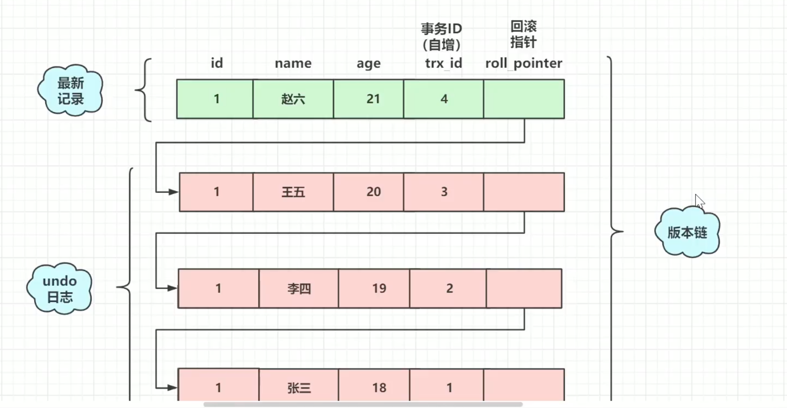

## Mysql

#### 什么是关系型数据库？

​	关系型数据库，是指采用了关系模型来组织数据的数据库，其以行和列的形式存储数据，以便于用户理解，关系型数据库这一系列的行和列被称为表，一组表组成了数据库。用户通过查询来检索数据库中的数据，而查询是一个用于限定数据库中某些区域的执行代码。

#### 关系型数据库有什么优势？

1. 易于理解，关系型二维表的结构非常贴近现实世界，二维表格，容易理解。
2. 支持复杂查询 可以用 SQL 语句方便的在一个表以及多个表之间做非常复杂的数据查询。
3. 支持事务 可靠的处理事务并且保持事务的完整性，使得对于安全性能很高的数据访问要求得以实现。

```sql
# 查看全部全局变量
show global variables;

# 查看部分全局变量
show gloabl variables like '%char%';

# 查看哪些表被加锁了
show open tables; # 有 1 的被加锁了， 0 的没有

# 可以通过检查 table_locks_waited 和 table_locks_immediate 状态变量来分析系统上的表锁定：
show status like 'table%';
# Table_locks_immediate: 产生表级锁定的次数，表示可以立即获取锁的查询次数，每立即获取锁值加1；
# Table_locks_waited: 出现表级锁定争用而发生等待的次数(不能立即获取锁的次数，每等待一次锁值加1)，比值高则说明存在着较严重的表级锁争用的情况；
 
自定义变量
    1. 用户变量
      作用域：当前会话(连接)有效，同于会话变量的作用域
    2. 声明并初始化
	方式1： set @用户变量名=值； 或 set @用户变量名 := 值；或 select @用户变量名 := 值
	方式2： select 字段 into 变量名 from table;
    3. 赋值
	select count(*) into @count from table;
    4. 查看值
	select @count;
	
	
```

#### explain

```sql
 # explain sql
 
# 字段  id  select_type table type possible_keys key key_len ref rows extra

#   id: select查询的序列号，包含一组数字，表示查询中执行select子句或操作表的顺序
	三种情况：
	 1. id相同，顺序自上而下
	 2. id不同：顺序数字越大越先执行
	 3. id相同又不同(前两种情况同时存在)：数字大的先执行，数字相同的顺序执行

#   select_type: 查询的类型，主要是用于区别普通查询，联合查询，子查询等的复杂查询

#   table: 使用的表

#   type: 访问类型；排序：system > const > eq_ref > ref > range > index > ALL
# system : const的特例，仅返回一条数据的时候。
# const : 查找主键索引，返回的数据至多一条（0或者1条）。 属于精确查找
# eq_ref : 查找唯一性索引，返回的数据至多一条。属于精确查找
# ref : 查找非唯一性索引，返回匹配某一条件的多条数据。属于精确查找、数据返回可能是多条
# range : 查找某个索引的部分索引，一般在where子句中使用 < 、>、in、between等关键词。只检索给定范围的行，属于范围查找
# index : 查找所有的索引树，比ALL要快的多，因为索引文件要比数据文件小的多。
# All : 不使用任何索引，进行全表扫描，性能最差。

#   possible_keys: 理论上可能使用的key

 #  key: 实际使用的key

 #  key_len: 使用的key的长度

 #  ref: 显示索引的哪一列被使用了，如果可能的话，是一个常数，哪些列或常量被用于查找索引列上的值

 #  rows: 根据表统计信息及索引选用情况，大致估算出找到所需的记录所需要读取的行数
   
 #  extra: 包含不适合在其他列中显示但十分重要的额外信息,group by, order by的信息  
 
```

#### mysql 底层原理

```sql
# buffer pool 内存结构 (默认28M)
# 当查询SQL时，将查询的一页数据copy到内存中，这样当其他的SQL来时，先判断数据是否在缓存中，如果在可以直接使用buffer pool 中的数据，不再查询数据库，在将数据页copy的buffer pool中


# redo log ： buffer pool 更新操作所对应的日志
#  当mysql 执行update时，会先把数据查询出来，放到buffer pool, 然后在修改，然后生成一个redo log(日志对象)

# innodb_flush_log_at_trx_commit 当事务提交时
 0 : 交给后台线程定时执行
 1 : redo log 立即持久化
 2 : 写入操作系统缓存中，即log buffer
 
# 当页数据写入一部分，服务器挂点了，怎么解决？
 1. double write buffer :先写入双写缓存区，再写入数据库，redo log 中的数据还是存在的
 2. 在写入double write buffer 服务器挂掉了，从double write buffer中导入。


# undo log: 反向日志
 update 语句id = 8； --- buffer pool的数据已经修改了
 现在需要回滚 rollback;
 undo log 记录之前的数据记录下来，好用来回滚
```


#### 数据定义语言DDL（Data Definition Language）

​	对象： 数据库和表

​	关键词： create 	alter	drop	truncate(删除当前表再新建一个一模一样的表结构)

```sql
# 创建数据库
create database school;

# 删除数据库
drop database school;

# 切换数据库
use school;

# 创建表
create table student(
  id int(4) primary key auto_increment,
  name varchar(20),
  score int(3)
);

# 查看数据库里存在的表
show tables;

# 修改表
alter table student rename (to) teacher;
alter table student add password varchar(20);
alter table student change password pwd varchar(20);
alter table student modify pwd int;
alter table student drop pwd;

# 删除表
drop table student;

# 查看生成表的sql语句
show create table student;

# 查看表结构
desc student;
```


#### 数据库操纵语言DML(Data Manipulation Language)

​	对象：纪录(行)

​	关键词：insert	 update	 delete	

```sql
# 插入
insert into student values(01,'tonbby',99);  # 插入所有的字段
insert into student(id,name) values(01,'tonbby'); # 插入指定的字段

# 更新
update student set name = 'tonbby',score = '99' where id = 01;

# 删除
delete from tonbby where id = 01;
# 注意：开发中很少使用delete,删除有物理删除和逻辑删除，其中逻辑删除可以通过给表添加一个字段(isDel)，若值为1，代表删除；若值为0，代表没有删除。此时，对数据的删除操作就变成了update操作了。


```

#### 数据查询语言DQL(Data Query Language)

```sql
# select ... from student where 条件 group by 分组字段 having 条件 order by 排序字段
# 执行顺序：from->where->group by->having->order by->select

# 注意：group by 通常和聚合函数(avg(),count()...)一起使用 ,经常先使用group by关键字进行分组，然后再进行集合运算。

# group by与having 一起使用，可以限制输出的结果，只有满足条件表达式的结果才会显示。

# having和where的区别：两者起作用的地方不一样，where作用于表或视图，是表和视图的查询条件。having作用于分组后的记录，用于选择满足条件的组。
```

#### 数据控制语言DCL(Data Control Language)  

​	用户，权限，事务。

#### MVCC

全称：Multi-Version Concurrency Control,即多版本并发控制，主要是为了提高数据库的并发性能。

**MVCC解决的问题时什么？**

​	MVCC时一种用来解决读写冲突的无锁并发控制，也就是为事务分配单项增长的时间戳，为每个修改保存一个版本，版本与事务时间戳关联，读操作值读该事务开始前的数据库的快照，所以MVCC可以为数据库解决以下问题：

​		1、在并发读写数据库时，可以做到在读操作时不用阻塞写操作，写操作也不用阻塞读操作，提高了数据库并发读写的性能。

​		2、解决脏读、幻读、不可重复读等事务隔离问题，但是不能解决更新丢失问题

###### 实现原理：

主要依赖于记录中的三个隐藏字段，undolog , read view 来实现的

隐藏字段：

​	DB_TRX_ID: 6字节，最近修改事务ID，记录创建这条记录或者最后一次修改该记录的事务ID

​	DB_ROLL_PTR: 7字节，回滚指针，指向这条记录的上一个版本，用于配合undolog,指向上一个旧版本

​	DB_ROW_ID: 6字节，隐藏的主键，如果数据表没有主键，那么innodb会自定生成一个6字节的row_id

快照读：不加锁的非阻塞读。 （select 查询），前提是隔离级别不是串行级别，串行级别下的快照读会退化成当前读。之所以出现快照读的情况，是基于提高并发性能的考虑，快照读的实现是基于多版本并发控制，但它在很多情况下，避免了加锁操作，降低了开销；既然是基于多版本，即快照读可能读到的并不一定是数据的最新版本，而有可能是之前的历史版本。

###### RC(提交读)、RR(可重复读)级别下的innoDB快照读有什么不同

​	因为read view 生成时机的不同，从而造成RC、RR级别下快照读的结果的不同

​	1、 在RR级别下的某个事务的对某条记录的第一次快照读会创建一个快照即read view将当前系统活跃的其他事务记录起来，此后在调用快照读的时候，还是使用的是同一个read view，所以只要当前事务在其他事务提交更新之前使用过快照读，那么之后的快照读使用的都是同一个read view,所以对之后的修改不可见

​	2、在RR级别下，快照读生成read view时，read view会记录此时所有其他活动和事务的快照，这些事务的修改对于当前事务都是不可见的，而早于read view 创建的事务所做的修改均是可见

​	3、在RC级别下，事务中，每次快照读都会新生成一个快照和read view ，这就是我们在RC级别下的事务中可以看到别的事务提交的更新的原因。

**总结：在RC隔离级别下，是每个快照读都会生成并获取最新的read view，而在RR隔离级别下，则是同一个事务中的第一个快照读才会创建read view，之后的快照读获取的都是同一个read view。**

当前读：insert 、 update、 delete时需要先把数据读取出来，再进行其他操作，需要加锁。

为什么叫当前读？

​	它读取的是记录的最新版本，读取时还要保证其他并发事务不能修改当前记录，会对读取的记录进行加锁。

undo log:

**版本链：**



**readview :**

​	read view 是事务进行快照读操作的时候生产的读试图，在该事务指向快照读的那一刻，会生成一个数据系统当前的快照，记录并维护系统当前活跃事务的ID，事务的ID值是递增的。

​	其实read view 的最大作用是用来做可见性判断的，也就是说当某个事务在执行快照读的时候，对该记录创建一个read view 的视图，把它当做条件去判断当前事务能够看到哪个版本的数据，有可能读取到的是最新的数据，也有可能读取的是当前行记录的undolog 中某个版本的数据


##### readview如何判断版本链中的哪个版本可用？

==trx_id == creator_trx_id: 可以访问这个版本==

==trx_id < min_trx_id（low_limit_id）: 可以访问这个版本==

==trx_id > max_trx_id (up_limit_id): 不可以访问这个版本==

==min_trx_id <= trx_id <= max_trx_id: 如果trx_id 在 m_ids 中是不可以访问这个版本的，反之可以==

#### mysql 线程池

###### thread pool 原理分析

大连接问题

​	现有mysql 处理客户端连接的方式会触发mysql 新建一个线程来处理新的连接，新建的线程会处理该连接所发送的所有 SQL 请求，即 one-thread-per-connection 的方式。

优点及存在的问题

​	在连接数较小的情况下可以很快的响应客户端的请求，但当连接数非常大时会创建很多线程，这样会引起以下问题：

​		1.过多线程之间的切换会加重系统的负载，造成系统资源紧张且响应不及时；

  	 2.频繁的进行线程的创建及销毁以及线程间同时无序的竟争系统资源加重了系统的负载。

thread_pool正是为了解决以上问题而产生的；

什么是thread_pool？

​	thread_pool(线程池)，是指mysql 创建若干工作线程来共同处理所有连接的用户请求，用户的请求的方式不再是 ‘one thread per connection’，而是多个线程共同接收并处理多个连接的请求，在数据库的底层处理方面(mysql_execute_command)，单线程的处理方式和线程池的处理方式是一致的。

thread_pool 的工作原理

​	启动 thread_pool 的mysql 会创建thread_pool_size 个thread group , 一个timer thread, 每个thread group 最多拥有thread_pool_oversubscribe个活动线程，一个listener线程，listener线程负责监听分配到thread group中的连接，并将监听到的事件放入到一个queue中，worker线程从queue中取出连接的事件并执行具体的操作，执行的过程和one thread per connection 相同。timer threaad 则是为了监听各个threadgroup的运行情况，并根据是否阴塞来创建新的worker线程。

thread_pool 建立连接的堆栈如下：

```bash
mysqld_main
handle_connections_sockets
create_new_thread
tp_add_connection
queue_put
thread group中的 worker 处理请求的堆栈如下：

0 mysql_execute_command
1 0x0000000000936f40 in mysql_parse
2 0x0000000000920664 in dispatch_command
3 0x000000000091e951 in do_command
4 0x0000000000a78533 in threadpool_process_request
5 0x000000000066a10b in handle_event
6 0x000000000066a436 in worker_main
7 0x0000003562e07851 in start_thread ()
8 0x0000003562ae767d in clone ()
```

其中worker_main函数是woker线程的主函数，调用mysql本身的do_command 进行消息解析及处理，和one_thread_per_connection 是一样的逻辑； thread_pool 自行控制工作的线程个数，进而实现线程的管理。

thread_pool中线程的创建：

1. listener线程将监听事件放入mysql放入queue中时，如果发现当前thread group中的活跃线程数active_thread_count为零，则创建新的worker 线程；
2. 正在执行的线程阻塞时，如果发现当前thread group中的活跃线程数active_thread_count为零，则创建新的worker 线程；
3. timer线程在检测时发现没有listener线程且自上次检测以来没有新的请求时会创建新的worker线程，其中检测的时间受参数threadpool_stall_limit控制；
4. timer线程在检测时发现没有执行过新的请求且执行队列queue 不为空时会创建新的worker线程；

worker线程的伪码如下：

```shell
worker_main
{
while(connection)
{
connection= get_event();
/* get_event函数用于从该线程所属thread_Group中取得事件，然后交给Handle_event函数处理，在同一Group内部，只有thread_pool_oversubscribe个线程能同时工作，多余的线程会进入sleep状态  */
if(connection)
handle_event(connection);
/* 如果是没有登录过的请求，则进行授权检查，并将其Socket绑定到thread_group中的pollfd中，并设置Connection到event中的指针上；对于登录过的，直接处理请求 */
}
// 线程销毁
}
```

thread_pool中线程的销毁：

​	当从队列queue中取出的connection为空时，则此线程销毁，取connection所等待的时间受参数thread_pool_idle_timeout的控制； 综上，thread_pool通过线程的创建及销毁来自动处理worker的线程个数，在负载较高时，创建的线程数目较高，负载较低时，会销毁多余的worker线程，从而降低连接个数带来的影响的同时，提升稳定性及性能。同时，threadpool中引入了Timer 线程，主要做两个事情。

1. 定期检查每个thread_group是否阻塞，如果阻塞，则进行唤醒或创建线程的工作；
2. 检查每个thread_group中的连接是否超时，如果超时则关掉连接并释放相应的资源；

threadpool在使用中存在的问题：

1. 由于threadpool严格控制活跃线程数的限制，如果同时有多个大查询同时分配到了同一个thread group，则会造成此group中的请求过慢，rt 升高，最典型的就是多个binlog dump 线程同时分配到了同一个group内；
2. 开启了事务模式时，非事务模式的请求会放入低优先级队列，因此可能在较长时间内得不到有效处理，极端情况下，会导致实例hang 住，例如某个连接执行了 flush tables with read lock ,并且此连接的后续请求都会放入低优先级，那么有可能会造成实列hang住；
3. 较小并发下，threadpool 性能退化的问题；


#### 问题

##### 1. length()和char_length()的区别和用法？

char_length
	1.计算单位：字符
	2. 不管汉字还是数字或者字母都算一个字符
	length()
	1.计算单位：字节
	2.utf8编码：一个汉字三个字节，一个数字或字母一个字节
	3.gbk编码：一个汉字两个字节，一个数字或字母一个字节

```sql
# 用法
SELECT appName FROM app_info ORDER BY LENGTH(appName) LIMIT 10;
SELECT appName FROM app_info ORDER BY CHAR_LENGTH(appName) LIMIT 10;

# 特殊用法：通过length()<>char_length()可以用来检验是否含有中文字符

# 检验是否含有中文字符
SELECT
	NAME,
	LENGTH(NAME) AS NAME_length,
	CHAR_LENGTH(NAME) AS NAME_char_length
FROM
	student
WHERE
	LENGTH(NAME) <> CHAR_LENGTH(NAME);

# mysql5.3之后varchar类型大小的计算方式有所变化，从最早的按字节算大小varchar(length)改成了varchar(char_length) 解释：varchar(20)表示字符数，不管什么编码，不管是英文还是中文都可以存放20个。
```

##### 2. 切分函数

```sql
# left()函数
# 从字符串string左边第一位开始，截取长度为length个字符。length应大于0，如<=0，返回空字符串。
SELECT LEFT('www.csdn.net',5) from web_info w; # www.c

# right()函数
# 从字符串string右边第一位开始，截取长度为length个字符，仍然是正向顺序截取。length应大于0，如<=0，返回空字符串。
SELECT RIGHT('www.csdn.net',5) from web_info w; # n.net

# substring()函数是专门用来对字符串进行切分的函数，主要有两种形式：
1. SUBSTRING(string,position);
# string:要操作的字符串
# positon:是一个整数，用于指定子串的起始字符，position可以是正整数或负整数。若position大于操作字符串的长度，则返回空字符串。
SELECT substring('www.csdn.net',5) from web_info w; # csdn.net
    
2. SUBSTRING(string,position,length);
# length:length是一个正整数，用于指定子字符串的字符数。如果length<=0，那么会返回空字符串。
SELECT substring('www.csdn.net',5,4) from web_info w; // csdn
 
# substring_index(str,delim,count)函数
# delim：通过该标识符来进行截取的，delim可以为任意字符，不要为空；
# count：代表第几次出现；count为正数，代表取标识符出现第count次之前的子串；负数则相反，取标识符出现第count次之后的子串。
SELECT SUBSTRING_INDEX('www.csdn.net','.',1) from web_info w; # www
SELECT SUBSTRING_INDEX('www.csdn.net','.',-2) from web_info w; # csdn.net

# 想获取两个’.'中间的呢？
SELECT SUBSTRING_INDEX(substring_index('www.csdn.net','.',2),'.',-1) from web_info w; # csdn
```

##### 3. mysql replace函数的几种使用场景？

```sql
# 将String中所有出现的from_str替换为to_str，这里的from_str不支持正则匹配。
replace(String,from_str,to_str) 

# 场景1：需求：把"hero_title"字段中所有的"之"换成" - "来展示，SQL如下：
SELECT REPLACE(hero_title,'之',' - ')as repl_title,hero_name,price from LOL;

# 场景2：需求：把"hero_title"字段中所有的"A"去掉，SQL如下：
UPDATE LOL SET hero_title=REPLACE(hero_title,‘A’,’’);

# 场景3：如果我们想插入一条新记录（INSERT），但如果记录已经存在，就先删除原记录，再插入新记录。
# 需求场景：
#      这张表存的每个客户最近一次交易订单信息，要求保证单个用户数据不重复录入，且执行效率最高，
#      与数据库交互最少，支撑数据库的高可用。
#      此时，可以使用"REPLACE INTO"语句，这样就不必先查询，再决定是否先删除再插入。
#      注意："REPLACE INTO"语句是基于唯一索引或主键来判断唯一（是否存在）的。
REPLACE INTO last_transaction (transId,username,amount,trans_time,remark) 
   VALUES (null, 'chenhaha', 30, '2020-06-11 20:00:20', '会员充值')；
```

##### 4. mysql date_format(date, format)函数？

date:时间，也可以为now()查询当前时间

format:DATE_FROMAT将传来的Date类型数据转为自己需要的格式，如：%Y-%m-%d %H:%i:%s会将传来的Time数据转为"yyyy-MM-dd HH:mm:ss"格式

```sql
#例如：
	SELECT DATE_FORMAT(NOW(),'%Y-%m-%d %H:%i:%s');   -- 结果：2020-12-07 22:18:58
	SELECT DATE_FORMAT(NOW(),'%Y-%m-%d %H:%i');      -- 结果：2020-12-07 22:18
	SELECT DATE_FORMAT(NOW(),'%Y-%m-%d %H');         -- 结果：2020-12-07 22
	SELECT DATE_FORMAT(NOW(),'%Y-%m-%d');            -- 结果：2020-12-07
	SELECT DATE_FORMAT(NOW(),'%H:%i:%s');            -- 结果：22:18:58
	SELECT DATE_FORMAT(NOW(),'%H');                  -- 结果：22
	
	# 让你通过MySQL订单表，统计一下双11那天，这两位每小时的购买订单成交数；你会怎么写这条SQL呢？
	SELECT 
       name as '用户名',
       DATE_FORMAT(createTime,'%Y-%m-%d %H') as '时间/小时',
       count(*) as '订单量' 
   from t_order 
   where DATE_FORMAT(createTime,'%Y-%m-%d') = '2020-11-11' 
   GROUP BY DATE_FORMAT(createTime,'%Y-%m-%d %H');

```

##### 5. mysql拼接函数concat()？

```sql
# 拼接函数
SELECT CONCAT(hero_title,' - ',hero_name) as full_name, price from `LOL`;

# 如果拼接的参数中有NULL，则返回NULL
SELECT CONCAT(hero_title,NULL,hero_name) as full_name, price from `LOL`;

# concat_ws(separator, str1, str2, …)
# 函数全称： CONCAT With Separator ，是CONCAT()的特殊形式。
# 第一个参数（separator）是其它参数的分隔符。分隔符的位置在要连接的两个字符串之间。分隔符可以是一个字符串，也可以是其它字段参数。
# 注意：如果分隔符为 NULL，则结果为 NULL；但如果分隔符后面的参数为NULL，只会被直接忽略掉，而不会导致结果为NULL。
select concat_ws(',',hero_title,hero_name,price) as full_name, price from `LOL`;

# group_concat(expr)
  group_concat([distinct]字段名[order by 排序字段 asc/desc][Separator ‘分隔符’])
	1.[DISTINCT]：对拼接的参数支持去重功能；
	2.[Order by]：拼接的参数支持排序功能；
	3.[Separator]：这个你很熟悉了，支持自定义’分隔符’，如不设置默认为无分隔符；
#	group_concat函数通常group by的查询语句，group_concat一般包含在查询返回结果字段中。
	举个场景：举个场景，我们要区分出各个价格段的英雄来，如果不用group_concat的话，或许只能用order by区分了。
	原sql:select * from `LOL` order by price desc;
	+----+---------------+--------------+-------+
	  | id | hero_title    | hero_name    | price |
	  +----+---------------+--------------+-------+
	  |  1 | D刀锋之影     | 泰隆         |  6300 |
	  |  2 | X迅捷斥候     | 提莫         |  6300 |
	  |  4 | F发条魔灵     | 奥莉安娜     |  6300 |
	  |  5 | Z至高之拳     | 李青         |  6300 |
	  |  3 | G光辉女郎     | 拉克丝       |  1350 |
	  |  6 | W无极剑圣     | 易           |   450 |
	  |  7 | J疾风剑豪     | 亚索         |   450 |
	  +----+---------------+--------------+-------+
新sql:SELECT GROUP_CONCAT(hero_title,' - ',hero_name Separator ',' ) as full_name, price from `LOL` GROUP BY price ORDER BY price desc;
+------------------------------------------------------------------------+-------+
| full_name                                                              | price |
+------------------------------------------------------------------------+-------+
| D刀锋之影 - 泰隆,X迅捷斥候 - 提莫,F发条魔灵 - 奥莉安娜,Z至高之拳 - 李青         |  6300 |
| G光辉女郎 - 拉克丝                                                       |  1350 |
| W无极剑圣 - 易,J疾风剑豪 - 亚索                                            |   450 |
+------------------------------------------------------------------------+-------+

如果按价格（price）从小到大排序，只需控制外层ORDER BY即可，如下：
SELECT GROUP_CONCAT(hero_title,' - ',hero_name Separator ',' ) as full_name, price from `LOL` GROUP BY price ORDER BY price asc;
+-------------------------------------------------------------------------+-------+
| full_name                                                               | price |
+-------------------------------------------------------------------------+-------+
| W无极剑圣 - 易,J疾风剑豪 - 亚索                                            |   450 |
| G光辉女郎 - 拉克丝                                                        |  1350 |
| D刀锋之影 - 泰隆,X迅捷斥候 - 提莫,F发条魔灵 - 奥莉安娜,Z至高之拳 - 李青         |  6300 |
+-------------------------------------------------------------------------+-------+		
```

##### 6. char和varchar有哪些区别？

1. char定长，varchar可变长度

2.  存储方式：

   varchar: VARCHAR需要使用1或2个额外字节记录字符串的长度：如果列的最大长度小于或等于255字节，则只使用1个字节表示，否则使用2个字节。

   char: CHAR适合存储很短或长度近似的字符串

3. 存储容量：

   char: 对于char类型来说，最多只能存放的字符个数为255，和编码无关，任何编码最大容量都是255。

   varchar:MySQL行默认最大65535字节，是所有列共享（相加）的，所以VARCHAR的最大值受此限制。

==注意：CHAR会默认切掉字符串末尾的空格，如果需要保留末尾的空格，记得用varchar类！==

##### 7. mysql常用判断函数总结

```sql
# 1. 函数 case when … then … else … end
CASE expression
	WHEN if_true_expr THEN return_value1
	WHEN if_true_expr THEN return_value2
	WHEN if_true_expr THEN return_value3
	……
	ELSE default_return_value
END
# 注意：需要注意的点，Case函数只返回第一个符合条件的值，剩下的Case when部分将会被自动忽略
1. 用在更新语句的更新条件中
	给个情景1：妇女节大回馈，2020年注册的新用户，所有成年女性账号送10元红包，其他用户送5元红包，自动充值。
	UPDATE users_info u 
       SET u.balance = CASE WHEN u.sex ='女' and u.age > 18 THEN u.balance + 10 
                         ELSE u.balance + 5 end 
                         WHERE u.create_time >= '2020-01-01'
2. 用在查询语句的返回值中
	给个情景2：有个学生高考分数表，需要将等级列出来，650分以上是重点大学，600-650是一本，500-600分是二本，400-500是三本，400以下大专；
	SELECT *,case when total_score >= 650  THEN '重点大学' 
              when total_score >= 600 and total_score <650 THEN '一本'
              when total_score >= 500 and total_score <600 THEN '二本'
              when total_score >= 400 and total_score <500 THEN '三本'        
              else '大专' end as status_student 
              from student_score;
3. 用在分组查询语句中
	给个情景3：用户包括中国各个省市，需要以省为单位进行统计，山东省、广州省和其他省市的用户数量；（这里用于测试使用，实际情况下讲道理表中应该会有归属省一列或者有另一张归属地表。）
	SELECT
    	SUM(c.users_count) AS '用户数量',
    	CASE c.city
        	WHEN '济南'   THEN '山东省'
        	WHEN '青岛'   THEN '山东省'
        	WHEN '枣庄'   THEN '山东省'
        	WHEN '广州'   THEN '广东省'
        	WHEN '深圳'   THEN '广东省'
 	ELSE '其他' END AS '归属省'
	FROM users_area c
	GROUP BY CASE c.city
       		WHEN '济南'   THEN '山东省'
        	WHEN '青岛'   THEN '山东省'
        	WHEN '枣庄'   THEN '山东省'
        	WHEN '广州'   THEN '广东省'
        	WHEN '深圳'   THEN '广东省'
 	ELSE '其他' END;
	+--------------+-----------+
	| 用户数量     | 归属省    |
	+--------------+-----------+
	|         1230 | 其他      |
	|          520 | 山东省    |
	|          750 | 广东省    |
	+--------------+-----------+
	
#  2. 函数：if(expr,if_true_expr,if_false_expr)
	IF(expr,if_true_expr,if_false_expr)，如果expr的值为true，则返回if_true_expr的值，如果expr的值为false，则返回if_false_expr的值。
	使用场景1：IF函数通常用于真实数据被替代的列；如性别，我们在库中一般用tinyint存储，男 = 1，女 = 2；如查询时需转成字符，该场景就适用于IF函数。
	SELECT `NAME`,IF(sex = 1,'男','女') FROM student;
	+-----------+-------------------------+
	| NAME      | IF(sex = 1,'男','女')   |
	+-----------+-------------------------+
	| 陈哈哈    | 男                      |
	| 扈亚鹏    | 男                      |
	| 刘晓莉    | 女                      |
	| 徐立楠    | 女                      |
	| 顾昊      | 男                      |
	| 陈子凝    | 女                      |
	| 朱志鹏    | 男                      |
	| 贾旭      | 男                      |
	| 李昂      | 男                      |
	+-----------+-------------------------+
	使用场景2：沿用上面的班级表，查询男生和女生的总人数；SQL如下：（sex='男'的返回1，然后用SUM相加得出男生人数，女生同理。）
	SELECT SUM(IF(sex = '男',1,0)) as boyNum, SUM(IF(sex = '女',1,0)) as girlNum from student;
	+--------+---------+
	| boyNum | girlNum |
	+--------+---------+
	|      6 |       3 |
	+--------+---------+
 3. 函数：ifnull(expr1,expr2)
	 IFNULL函数是MySQL控制流函数之一，它有两个参数，两个参数可以是真实值或表达式，如果expr1不是NULL，则返回第一个参数（expr1）。 否则，IFNULL函数返回第二个参数。
	SELECT `NAME`,IFNULL(sex,'未知') from student;
	+-----------+----------------------+
	| NAME      | IFNULL(sex,'未知')   |
	+-----------+----------------------+
	| 陈哈哈    | 男                   |
	| 扈亚鹏    | 男                   |
	| 刘晓莉    | 女                   |
	| 徐立楠    | 女                   |
	| 顾昊      | 男                   |
	| 陈子凝    | 女                   |
	| 朱志鹏    | 未知                 |
	| 李昂      | 未知                 |
	+-----------+----------------------+

```

##### 8. mysql - 常用存储引擎区别总结

###### InnoDB

1. 支持事务。默认的事务隔离级别为可重复读。
2. 使用的锁粒度默认为行级锁，可以支持更高的并发。当然，也支持表锁。
3. 支持外键约束；外键约束其实降低了表的查询速度，但是增加了表之间的耦合度。
4. 可以通过自动增长列，方法是auto_increment.
5. 配合一些热备工具可以支持在线热备份。
6. 在InnoDB中存在着缓冲管理，通过缓冲池，将索引和数据全部缓存起来，加快查询的速度。
7. 对于InnoDB类型的表，其数据的物理组织形式是聚簇表。所有的数据按照主键来组织。数据和索引放在一块，都为与B+树的叶子节点上。
8. InnoDB表的select count(\*)比MyISAM慢很多；当执行select count(\*) from t时，会先把数据读出来，一行一行的累加，最后返回总数量。但是当count(*)语句包含where条件时，两种表的操作是一样的。
9. .delete from table时，InnoDB不会重新建立表，而是一行一行的删除。
   InnoDB的存储表和索引有下面两种形式：
10. 共享表空间：所有的表和索引存放在同一个表空间中。
11. 多表空间存储：表结构放在。frm文件中，数据和索引放在。ibd文件中。分区表的话，每个分区对应单独的.ibd文件。

###### MyISAM

1. 不支持事务。在读写(insert、select)效率上，要高于InnoDB不少，场景：日志记录、调查统计表。
2. 体积小，质量大。MyISAM的索引和数据是分开的，并且索引是有压缩的，内存使用率就相对应提高了不少
    每张MyiSAM表在磁盘上会对应三个文件。
	1) .frm文件：存储表的定义数据
	2) .MYD文件：存放表具体记录的数据
	3) .MYI文件：存储索引
3. 数据迁移：MyISAM直接给数据文件就可以。
4. MyISAM写操作更快。
5. delete from table时，MyISAM会先将表结构备份到一张虚拟表中，然后执行drop，最后根据备份重建该表。

###### Memory (可以将它理解为：临时表)

Memory是将数据直接存在内存中，特别适合数据量小的表。同时为了提高数据的访问速度，每一个表实际上和一个磁盘文件管理，文件是frm

1. 支持的数据类型有限制，比如：不支持TEXT和BLOB类型。对于字符串类型的数据，只支持固定长度的行，varchar(64)会被自动存储为char(64)类型；
2. 只支持表级锁。
3. 由于数据是存放在内存中，一旦服务器宕机，数据就会丢失；数据库主从切换要设置好。
4. 查询的时候，如果有用到临时表，而且临时表中有BLOB，TEXT类型的字段，那么这个临时表就会转化为MyISAM类型的表，性能会急剧下降。
5. 默认使用hash索引。

###### MyISAM 和InnoDB 的区别

MyISAM

 1. 不支持事务，但是每次查询都是原子的
 2. 支持表级锁
 3. 存储表的总行数
 4. 一个MyISAM有三个文件，索引文件，表结构文件，数据文件
 5. 采用非聚簇索引。

InnoDB
 1. 支持ACID的事务，支持事务的四种隔离级别
 2. 支持行级锁及外键约束
 3. 支持MVCC
 4. 不存储总行数
 5. 采用聚簇索引

##### 9. MySQL中特别实用的几种SQL语句

```sql
	1.插入或替换
	 如果我们想插入一条新记录，但如果记录已经存在，就先删除原记录，再插入新记录。
	 情景示例：这张表存的每个客户最近一次交易订单信息，要求保证单个用户数据不重复录入，且执行效率最高，与数据库交互最少，值数据库的高可用。
	 此时，可以使用“replace into”语句，这样就不必先查询，再决定是否先删除再插入。
	 注意：replace into语句是基于唯一索引或主键来判断唯一的。

	2. 插入或更新
	 如果我们希望插入一条新记录(insert),但如果记录已经存在，就更新该记录，此时，可以使用“insert into … on duplicate key update …”语句：
	 情景示例：这张表存了用户历史充值金额，如果第一次充值就新增一条记录，如果该用户充值过就累加历史充值金额，需要保证单个用户数据不重复录入。
	 这时可以使用“insert into … on duplicate key update …”语句。
	 注意：“insert into … on duplicate key update …”语句是基于唯一索引或主键来判断唯一的。
	
	3. 插入或忽略
	 如果我们希望插入一条新记录(insert),但如果记录已经存在，就啥事也不干直接忽略，此时，可以使用“inset ignore into …”语句
	 例如：INSERT IGNORE INTO users_info 
		(id, username, sex, age ,balance, create_time) 
   		VALUES (null, 'chenhaha', '男', 12, 0, '2020-06-11 20:00:20');
	 注意：“inset ignore into … ”语句是基于唯一索引或主键来判断唯一的。

	4. sql中的if - else 判断语句
	 众所周知，if-else判断在任地方都很有用，在SQL语句中，“case when … then …  else … end”语句可以用在增删改查各类语句中。
	 情景：妇女节大回馈，2020年注册的新用户，所有成年女性账号送10元红包，其他用户送5元红包，自动充值
	 sql: 
		UPDATE users_info u 
    			SET u.balance = CASE WHEN u.sex ='女' and u.age > 18 
			THEN u.balance + 10 
                       ELSE u.balance + 5 end 
                       WHERE u.create_time >= '2020-01-01'

	5. 指定数据快照或备份
	 如果想要对一个表进行快照，即复制一份当前的数据到一个新表，可以结合create table和select:
	 CREATE TABLE students_of_class1 SELECT * FROM student WHERE class_id=1;

	6. 写入查询结果集
	 如果查询结果集需要写入到表中，可以结合insert和select，将select语句的结果集直接插入到指定表中。
	 例如：创建一个统计成绩的表statistics，记录各班的平均成绩：
	 CREATE TABLE statistics (
    		id BIGINT NOT NULL AUTO_INCREMENT,
    		class_id BIGINT NOT NULL,
    		average DOUBLE NOT NULL,
    		PRIMARY KEY (id)
	 );
	 INSERT INTO statistics (class_id, average) 
	 SELECT class_id, AVG(score) FROM students GROUP BY class_id;

	7. 强制使用指定索引
	 在查询的时候，数据库系统会自动分析查询语句，并选择一个最适合的索引，但是很多时候，数据库系统的查询优化器并不一定总是能使用最优索引，如果我们知道如何选择索引，可以使用force index强制查询使用指定的索引。
	 例如：SELECT * FROM students FORCE INDEX (idx_class_id) WHERE class_id = 1 ORDER BY id DESC;
	 指定索引的前提是索引idx_class_id必须存在。
```

##### 10. sql优化

###### mysql层优化一般遵从原则：

	1. 减少数据访问： 设置 合理的字段类型，启用压缩，通过索引访问等减少磁盘IO
	2. 返回更少的数据： 只返回需要的字段和数据分页处理减少磁盘IO及网络IO
	3. 减少交互次数： 批量DML操作，函数存储等减少数据连接次数
	4. 减少服务器CPU开销： 尽量减少数据库排序操作以及全表查询，减少CPU内存占用
	5. 利用更多资源： 使用表分区，可以增加并行操作，更大限度利用CPU资源
	总结到SQL优化中，就三点：
	 最大化利用索引
	 尽可能避免全表扫描
	 减少无效数据的查询

###### 如何优化SQL？

 四步

   1. 开启慢查询日志
   2. explain 慢查询分析
   3. show profile 查询SQL在MySQL服务器里面的执行细节和生命周期情况
	例： show profile cpu,block io from query 10; // 10 查询id
	converting HEAP to MyISAM查询结果太大，内存都不够用了往磁盘上搬了。
	Creating tmp table 创建临时表 - 拷贝数据到临时表，用完再删除
	comping to tmp table on disk 把内存中临时表复制到磁盘
	locked
   4. SQL数据库服务器的参数调优

```sql
SQL优化策略
# 优化原则：
   # 最佳左前缀法则
   # 不在索引列上做任何操作(计算、函数、(自动or手动)类型转换)，会导致索引失效而转向全表扫描
   # 存储引擎不能使用索引中范围条件右边的列
   # 尽可能使用覆盖索引(只访问索引的查询(索引列和查询列一致))， 减少select *
   # mysql 在使用不等于(!= 或者 <>)的时候无法使用索引会导致全表扫描
   # is null, is not null 也无法使用索引
   # like以通配符开头('%abc...')mysql索引失效会变成全表扫描的操作
   # 字符串不加单引号索引失效
   # 少用or,用它连接时会索引失效
   
#  1. 避免不走索引的场景
    1)尽量避免在字段开头模糊查询，会导致数据库引擎放弃索引进行全表扫描：如：
     SELECT * FROM t WHERE username LIKE '%陈%'
     优化方式：尽量在字段后面使用模糊查询，如：
     SELECT * FROM t WHERE username LIKE '陈%'
    如果需求是要在前面使用模糊查询：
     . 使用MySQL内置函数instr(str, substr)来匹配，作用类似于Java中的indexOf(),查询字符串出现的角标位置。
     . 使用FullText全文索引，用match against检索
     . 数据量较大的情况，建议引用ElasticSearch、solr,亿级数据量检索速度秒级
     。 当数据量较少(几千条那种)，别整花里胡哨的，直接用like ‘%XX%’
     
#  2. 尽量避免使用in和not in,会导致引擎走全表扫描。如：
	select * from t where id in (2,3)
	优化方式：如果是连续数值，可以用between代替。如：
	select * from t where id between 2 and 3
	如果是子查询，可以用exists代替。如：
	select * from A where A.id in (select id from B) # 不走索引
	select * from A where exists (select * from B where B.id = A.id); # 走索引
	
#  3. 尽量避免使用or,会导致数据引擎放弃索引进行全表扫描。如：
	select * from t where id = 1 or id = 3
	优化方式：可以使用union代替or。如：
	select * from t where id = 1 union select * from t where id = 3
	
#  4. 尽量避免进行null值判断，会导致数据库引擎放弃索引进行全表扫描。如：
	select * from t where score is null	
	优化方式：可以给字段添加默认值0，对0值进行判断。如：
	select * from t where score = 0
	
#  5. 尽量避免在where条件中等号的左侧进行表达式、函数操作，会导致数据库引擎放弃索引进行全表扫描
	可以将表达式、函数操作移动到等号右侧。如：
	select * from t where score/10 = 9 // 全表扫描
	select * from t where score = 10 * 9 // 走索引
	
#  6. 当数据量大时，避免使用where 1=1的条件。通常为了方便拼装查询条件，我们会默认使用该条件，数据库引擎会放弃索引进行全表扫描。如：
	select username, age, sex from t where 1=1
	优化方式：用代码拼装sql时进行判断，没where条件就去掉where,有where条件就加and.
	
#  7. 查询条件不能用<>或者!=
	使用索引列作为条件进行查询时，需要避免使用<>或者!=等判断条件。如确实业务需要，使用到不等于符号，需要在重新评估索引建立，避免在此字段上建立索引，改由查询条件中其他索引字段代替。
	
#  8. where条件仅包含复合索引非前置列。如：
	复合索引包含k1, k2, k3三列，但SQL语句没有包含索引前置列k1,按照最左匹配原则，不会走索引。
	
#  9. 隐式类型转换造成不使用索引
	如：SQL语句由于索引对列类型为varchar，但给定的值为数值，涉及隐式类型转换，造成不能正确走索引。
	
#  10. order by 条件要与where中条件一致，否则order by不会利用索引进行排序
	select * from t order by age; // 不走age索引
	select * from t where age > 0 order by age; // 走age索引
 	对于上面的语句，数据库的处理顺序是：
	 1. 根据where条件和统计信息生成执行计划，得到数据。
	 2. 将得到的数据排序。当执行处理数据(order by)时，数据库会先查看第一步的执行计划，看order by的字段是否在执行计划中利用了索引。如果是，则可以利用索引顺序而直接取得已经排好序的数据。如果不是，则重新进行排序操作。
	 3. 返回排序后的数据。
	当order by 中的字段出现在where条件中时，才会利用索引而不再二次排序，更准确的说，order by中的字段在执行计划中利用了索引时，不用排序操作。
	这个结论不仅对order by 有效，对其他需要排序的操作也有效。如：group by  union  distinct
	
#  11. 正确使用hint优化语句
	MySQL中可使用hint指定优化器在执行时选择或忽略特定的索引。一般而言，处于版本变更带来的表结构索引变化，更建议避免使用hint，而是通过Analyze table多收集统计信息。但在特定场合下，指定hint可以排除其他索引干扰而指定更优的执行计划。
	1. use index 在你查下语句中表名的后面，添加use index 来提供希望MySQL去参考的索引列表。
	  如:select * from table use index(mod_time, name) …
	2. ignore index 如果只是单纯的想让MySQL忽略一个或者多个索引，可以使用ignore index
	  如：select * from table ignore index (priority) …
	3. force index 为强制MySQL使用一个特定的索引，可在查询中使用force index 作为hint.
	  如： select * from table force index(mod_time) …
	  
#	12. 多表关联查询时，小表在前，大表在后。在MySQL中，执行 from 后的表关联查询是从左往右执行的、

#	13. 大批量插入数据
# 如果同时执行大量的插入，建议使用多个值的INSERT语句(方法二)。这比使用分开INSERT语句快（方法一），一般情况下批量插入效率有几倍的差别。
	方法一：
	insert into T values(1,2);  
	insert into T values(1,3); 
	insert into T values(1,4);
	方法二：
	Insert into T values(1,2),(1,3),(1,4); 
	# 选择后一种方法的原因有三。 
		1. 减少SQL语句解析的操作，MySQL没有类似Oracle的share pool，采用方法二，只需要解析一次就能进行数据的插入操作；
		2. 在特定场景可以减少对DB连接次数
		3. SQL语句较短，可以减少网络传输的IO。
		
#	14. 适当使用commit
# 适当使用commit可以释放事务占用的资源而减少消耗，commit后能释放的资源如下：
	 1. 事务占用的undo数据块；
	 2. 事务在redo log中记录的数据块； 
	 3. 释放事务施加的，减少锁争用影响性能。特别是在需要使用delete删除大量数据的时候，必须分解删除量并定期commit。
	 
#		15. 避免重复查询更新的数据
#	针对业务中经常出现的更新行同时又希望获得改行信息的需求，MySQL并不支持PostgreSQL那样的UPDATE RETURNING语法，在MySQL中可以通过变量实现。
	例如，更新一行记录的时间戳，同时希望查询当前记录中存放的时间戳是什么，简单方法实现：
	Update t1 set time=now() where col1=1; 
	Select time from t1 where id =1;
	使用变量，可以重写为以下方式： 	
	Update t1 set time=now () where col1=1 and @now: = now (); 
	Select @now;
	前后二者都需要两次网络来回，但使用变量避免了再次访问数据表，特别是当t1表数据量较大时，后者比前者快很多。
	

```

##### 11. MySQL删除数据的方式有哪些？

```sql
 三种删除方式：通过 delete、truncate、drop 关键字进行删除；这三种都可以用来删除数据，但场景不同。
 1. 从执行速度上来说： drop > truncate > DELETE
 2. 从原理上讲
	1. delete
	 DELETE from TABLE_NAME where xxx
	 1、DELETE属于数据库DML操作语言，只删除数据不删除表的结构，会走事务，执行时会触发trigger；
	 2、在 InnoDB 中，DELETE其实并不会真的把数据删除，mysql 实际上只是给删除的数据打了个标记为已删除，因此 delete 删除表中的数据时，表文件在磁盘上所占空间不会变小，存储空间不会被释放，只是把删除的数据行设置为不可见。虽然未释放磁盘空间，但是下次插入数据的时候，仍然可以重用这部分空间（重用 → 覆盖）。
	 3、DELETE执行时，会先将所删除数据缓存到rollback segement中，事务commit之后生效;
	 4、delete from table_name删除表的全部数据,对于MyISAM 会立刻释放磁盘空间，InnoDB 不会释放磁盘空间;
	 5、对于delete from table_name where xxx 带条件的删除, 不管是InnoDB还是MyISAM都不会释放磁盘空间;
	 6、delete操作以后使用 optimize table table_name 会立刻释放磁盘空间。不管是InnoDB还是MyISAM 。所以要想达到释放磁盘空间的目的，delete以后执行optimize table 操作。
	 示例：查看表占用硬盘空间大小的SQL语句如下：（用M做展示单位，数据库名：csjdemo，表名：demo2）
	 select concat(round(sum(DATA_LENGTH/1024/1024),2),'M') as table_size 
   	 from information_schema.tables 
       	 where table_schema='csjdemo' AND table_name='demo2';
	 然后执行空间优化语句，以及执行后的表Size变化：
	 optimize table demo2
	 再看看这张表的大小，就只剩下表结构size了。
	 7、delete 操作是一行一行执行删除的，并且同时将该行的的删除操作日志记录在redo和undo表空间中以便进行回滚（rollback）和重做操作，生成的大量日志也会占用磁盘空间。
	2. truncate (执行后立即生效，无法找回)
	 Truncate table TABLE_NAME
	 1、truncate：属于数据库DDL定义语言，不走事务，原数据不放到 rollback segment 中，操作不触发 trigger。
	 2、truncate table table_name 立刻释放磁盘空间 ，不管是 InnoDB和MyISAM 。truncate table其实有点类似于drop table 然后create,只不过这个create table 的过程做了优化，比如表结构文件之前已经有了等等。所以速度上应该是接近drop table的速度;
	 3、truncate能够快速清空一个表。并且重置auto_increment的值。
	  但对于不同的类型存储引擎需要注意的地方是：
	  对于MyISAM，truncate会重置auto_increment（自增序列）的值为1。而delete后表仍然保持auto_increment。
	  对于InnoDB，truncate会重置auto_increment的值为1。delete后表仍然保持auto_increment。	  但是在做delete整个表之后重启MySQL的话，则重启后的auto_increment会被置为1。
	  也就是说，InnoDB的表本身是无法持久保存auto_increment。delete表之后auto_increment仍然保存在内存，但是重启后就丢失了，只能从1开始。实质上重启后的auto_increment会从 SELECT 1+MAX(ai_col) FROM t 开始。
	3. drop (执行后立即生效，无法找回)
	 Drop table Tablename
	 1、drop：属于数据库DDL定义语言，同Truncate；
	 2、drop table table_name 立刻释放磁盘空间 ，不管是 InnoDB 和 MyISAM; drop 语句将删除表的结构被依赖的约束(constrain)、触发器(trigger)、索引(index);  依赖于该表的存储过程/函数将保留,但是变为 invalid 状态。

```

##### 12. 并发场景下事务存在的问题？

1. 脏读(针对的是未提交读数据)
    事务A修改了数据，但未提交，而事务B查询了事务A修改过却未提交的数据，这就是脏读，因为事务A可以回滚
2. 不可重复读(针对其他提交前后，读取数据本身的对比)
    事务A先查询了工资金额，是3000元，未提交。事务B在事务A查询完之后，修改了工资金额，变成了13000元，在事务A之前提交了；如果此时事务A再查询一次数据，就会发现钱跟上一次查询不一致，是13000元，而不是3000元，这就是不可重复读。强调事务A对要操作的数据被别人修改了，但在不知情的情况下拿去做之前的用途。
3. 幻读(针对其他提交前后，读取数据条数的对比)
    幻读是指在同一个事务中，存在前后两次查询同一个范围的数据，但是第二次查询却看到了第一次查询没看到的行，一般情况下指新增。
    事务A先修改了某个表的所有记录的状态字段为已处理，未提交；事务B也在此时新增了一条未处理的记录，并提交了了；事务A随后查询记录，却发现有一条记录是未处理的，很少诧异，刚刚不是全部修改为已处理了嘛，以为出现了幻觉，这就是幻读。

 注意：
   脏读说的是事务知道了自己本不应该知道的东西，强调的动作是查询，我看到了自己不该看的东西；
   不可重复读强调的是一个人查的时候，其他人却可以增删改，但我去不知道数据被修改了，还拿去做之前的用途；
   幻读强调的是我修改了数据，等我要查的时候，却发现有我没有修改的记录，为什么，因为有其他人插了一条新的。

##### 13. 事务隔离级别？

 隔离级别：
   1. 读未提交(RU)
	一个事务还没提交时，它做的变更就能被别的事务看到(别的事务指同一时间进行的增删改查操作)
   2. 读提交(RC)
	一个事务提交之后，它做的变更才会被其他事务看到。
   3. 可重复读(RR)
	一个事务执行过程中看到的数据，总是跟这个事务在启动时看到的数据是一致的，当然在可重复读隔离级别下，未提交变更对其他事务是不可见的。
   4. 串行化(S)
	同一时刻只允许单个事务执行，“写”会加“写锁”，“读”会加“读锁”，当出现读写锁冲突的时候，后访问的事务必须等前一个事务执行完成，才能继续执行。

##### 14. MySQL是如何解决幻读的问题的？

幻读是指在同一个事务中，存在前后两次查询同一个范围的数据，但是第二次查询却看到了第一次查询没看到的行，一般这种情况下特指事务执行中新增的其他行。
 幻读出现的场景？

	1. 幻读出现在可重复读(RR)隔离级别下，普通的select查询就是快照读，是不会看到别的事务插入的数据的。因此，幻读在“当前读”下才会出现。（当前读会生成行锁，但行锁只能锁定存在的行，针对新插入的操作没有限定）
	2. 上面 session B 的修改结果，被 session A 之后的 select 语句用“当前读”看到，不能称为幻读。幻读仅专指“新插入的行”。
	解决幻读的必要性？
	    在高并发数据库系统中，需要保证事务与事务之间的隔离性，还有事务本身的一致性。
	    如何解决幻读？
	1. 原理理解
	幻读能仅通过行锁解决吗？
	 不能。因为在我给数据加锁的时刻，压根就还没有新增的那行，自然也不会给新增行加锁。
	所以要解决幻读，就必须得解决新增行的问题？
	 产生幻读的原因是，行锁只能锁住行，但是新插入记录这个动作，要更新的是记录之间的“间隙”。因此，为了解决幻读问题，InnoDB只好引入新的锁，也就是间隙锁。顾名思义，间隙锁，锁的就是两个值之间的空隙。比如：插入7个记录，这就产生了8个间隙。
	2. next-key lock
	这样，当你执行select * from table where … 的时候，就不止是给数据库中已有的7个记录加上了行锁，还同时加了8个间隙锁。这样就确保了无法再插入新的记录。
	在一行行扫描过程中，不仅将给行加上了行锁，还给行两边的空隙，也加上了间隙锁。Mysql将行锁+间隙锁组合统称为next-key lock,通过next-key lock解决了幻读问题。
	注意：next-key lock的确是解决了幻读问题，但是next-key lock在并发情况下也经常会造成死锁，死锁检测和处理也会花‘’费时间，一定程度上影响到并发量。

##### 15. MySQL 索引？

###### 什么是索引？

关系数据库中，索引是一种单独的、物理的对数据表中一列或多列的值进行排序的一种存储结构。

索引的原理：就是把无序的数据变成有序的查询
   1. 把创建了索引的列内容进行排序
   2. 对排序结果生成排表
   3. 在倒排表内容上拼上数据地址链
   4. 在查询的时候，先拿到倒排表的内容，再取出数据地址链，从而拿到具体数据

###### 索引的优缺点？

1）优点

1. 索引大大减小了服务器需要扫描的数据量
2. 索引可以帮助服务器避免排序和临时表
3. 索引可以将随机I/O变成顺序I/O
2) 缺点
1. 虽然索引大大提高了查询速度，同时却会降低更新表的速度，如对表进行insert、update和delete。因为更新表时，不仅要保存数据，还要保存索引文件。
2. 建立索引会占用磁盘空间的索引文件，一般情况这个问题不算严重，但如果你在一个大表上创建了多种索引，且伴随大量数据插入，索引文件大小也会快速膨胀。
3. 如果某个数据列包含许多重复的内容，为它建立索引就没有太大的实际效果。
4. 对于非常小的表，大部分情况下简单的全表扫描更高效。
MySQL里同一个数据表里的索引总数限制为16个

######  mysql索引结构有哪些？各自的优劣是什么？

​	mysql中使用较多的索引有==hash索引==和==B+数索引==，innoDB的索引实现为B+数，memory存储引擎为hash索引

​	hash索引就是采用一定的哈希算法，把键值换算成新的哈希值。检索时只需一次哈希算法即可立刻定位到相应的位置。

​	优劣：

​	如果是等值查询，哈希索引有明显的优势，只需一次哈希计算就可找到相应的键值，前提是键值都是唯一的，如果键值不是唯一的，就需要先找到该键所在的位置，然后再根据链表往后扫描，直到找到对应的数据。

​	如果是范围查询，哈希索引就毫无用武之地了，因为原先是有序的键值，经过哈希算法后，有可能变得不连续了。

​	哈希索引也没办法利用索引完成排序，以及like这样的模糊查询

​	哈希索引也不支持多列联合索引的最左匹配规则

​	B+树索引的关键字检索效率比较平均，不像B树那么波动大，在有大量重复键值的情况下，哈希索引的效率也是极低的，因为存在哈希碰撞问题。

###### mysql索引为什么选择了B+树而不是B树？

B+树更适合外部存储(一般指磁盘存储)，由于内节点(非叶子节点)不存储data,所以一个节点可以存储更多的内节点，每个节点能索引的范围更大更精确。也就是说使用B+树单次磁盘I/O的信息量相比B树更大，I/O效率更高。

mysql是关系型数据库，经常会按照区间来访问某个索引列，B+树的叶子节点间按照顺序建立了链指针，加强了区间访问性，所以B+树对索引列上的区间范围查询很友好。而B树每个节点的key和data在一起，无法进行区间查找。

##### 15.1 索引类型有哪些，以及对数据库的性能的影响？

​	普通索引：允许被索引的数据列包含重复的值

​	唯一索引：可以保证数据记录的唯一性

​	主键索引：特殊的唯一索引，一张表中只能定义一个，用于唯一标识一条记录，使用关键字 primary key 来创建

​	全文索引： 通过建立倒排索引，可以极大的提升检索效率，解决判断字段是否包含的问题，是目前搜索引擎使用的一种关键技术

​	

##### 16. MySQL视图？

视图概述
	视图是一个虚拟表，其内容由查询定义。视图并不在数据库中以存储的数据值集形式存在。行和列数据来自由定义视图的查询所引用的表，并且在引用视图时动态生成。
	对其中所引用的基础表来说，视图的作用类似于筛选。定义视图的筛选可以来自当前或其它数据库的一个或多个表，或者其它视图。通过视图进行查询没有任何限制。通过它们进行数据修改时的限制也很少。
视图是存储在数据库中的查询的SQL语句，视图有两个特点：

 1. 安全。视图可以隐藏一些数据。如：个税表，可以用视图只显示姓名，地址，而不显示个税号和工资数。
 2. 可使复杂的查询易于理解和使用。这个视图就像一个窗口，从中只能看到你想看的数据列。这意味着你可以在这个视图上使用select *，而你看到的将是你在视图定义里给出的那些数据列。
3. 视图对重构数据库提供了一定程度的逻辑独立性。
    数据库的物理独立性是指用户的应用程序不依赖数据库的物理结构。数据的逻辑独立性是指当数据库重构造时，如增加新的关系或对原有的关系增加新的字段，用户的应用程序不会受影响。
4. 安全性
    有了视图机制，就可以在设计数据库应用系统时，对不同的用户定义不同的视图，使机密数据不出现在不应该看到这些数据的用户视图上。这样视图机制就自动提供了对机密数据的安全保护功能。
5. 灵活性
    复杂的查询需求，可以进行问题分解，然后将创建多个视图获取数据。将视图联合起来就能得到需要的结果了

 视图的工作机制：当调用视图的时候，才会执行视图的SQL，进行取数据操作。视图的内容没有存储，而是在视图被引用的时候才派生出数据。这样不会占用空间，由于是及时引用，视图的内容总是与真实表的内容一致的。
 视图这样设计有什么好处？
    节省空间，内容是总是一致的话，那么我们不需要维护视图的内容，维护好真实表的内容，就可以保证视图的完整性了。

```sql
# 创建视图语法：
CREATE
 [OR REPLACE] # OR REPLACE：如果视图存在，则替换已有视图。
 [ALGORITHM = {UNDEFINED | MERGE | TEMPTABLE}] # ALGORITHM：视图选择算法，默认算法是 UNDEFINED(未定义的)由 MySQL自动选择要使用的算法
[DEFINER = user] # DEFINER：指定视图创建者或定义者，如果不指定该选项，则创建视图的用户就是定义者。
[SQL SECURITY { DEFINER | INVOKER }] # SQL SECURITY：SQL安全性，默认为DEFINER。
VIEW view_name [(column_list)]
AS select_statement # select_statement：创建视图的 SELECT语句，可以从基表或其他视图中选择数据。
[WITH [CASCADED | LOCAL] CHECK OPTION] # WITH CHECK OPTION：表示视图在更新时保证约束，默认是 CASCADED。
```

用 MySQL 视图有何优点？

1. 操作简单方便。视图用户完全不需要关心视图对应的表的结构、关联条件和筛选条件，对用户来说已经是过滤好的复合条件的结果集。
2. 数据更加安全。视图用户只能访问视图中的结果集，通过视图可以把对表的访问权限限制在某些行和列上面。
3. 数据隔离。屏蔽了源表结构变化对用户带来的影响，源表结构变化视图结构不变。

##### 17. int(10) 和 bigint(10)能存储的数据大小一样吗？

不一样，具体原因如下：
	 int 能存储四字节有符号整数。
	 bigint 能存储八字节有符号整数。

##### 18. InnoDB存储引擎特性有哪些？

1. 采用多版本并发控制（MVCC，MultiVersion Concurrency Control）来支持高并发。并且实现了四个标准的隔离级别，通过间隙锁next-key locking策略防止幻读的出现。
2. 引擎的表基于聚簇索引建立，聚簇索引对主键查询有很高的性能。不过它的二级索引secondary index非主键索引中必须包含主键列，所以如果主键列很大的话，其他的所有索引都会很大。因此，若表上的索引较多的话，主键应当尽可能的小。另外InnoDB的存储格式是平台独立。
3. InnoDB做了很多优化，比如：磁盘读取数据方式采用的可预测性预读、自动在内存中创建hash索引以加速读操作的自适应哈希索引（adaptive hash index)，以及能够加速插入操作的插入缓冲区（insert buffer)等。
4. InnoDB通过一些机制和工具支持真正的热备份，MySQL 的其他存储引擎不支持热备份，要获取一致性视图需要停止对所有表的写入，而在读写混合场景中，停止写入可能也意味着停止读取。

##### 19. InnoDB  引擎的四大特性是什么？

1. 插入缓冲（Insert buffer)
      	Insert Buffer 用于非聚集索引的插入和更新操作。先判断插入的非聚集索引是否在缓存池中，如果在则直接插入，否则插入到 Insert Buffer 对象里。再以一定的频率进行 Insert Buffer 和辅助索引叶子节点的 merge 操作，将多次插入合并到一个操作中，提高对非聚集索引的插入性能。
2. 二次写 (Double write)
          Double Write由两部分组成，一部分是内存中的double write buffer，大小为2MB，另一部分是物理磁盘上共享表空间连续的128个页，大小也为 2MB。在对缓冲池的脏页进行刷新时，并不直接写磁盘，而是通过 memcpy 函数将脏页先复制到内存中的该区域，之后通过doublewrite buffer再分两次，每次1MB顺序地写入共享表空间的物理磁盘上，然后马上调用fsync函数，同步磁盘，避免操作系统缓冲写带来的问题。
3. 自适应哈希索引 (Adaptive Hash Index)
          InnoDB会根据访问的频率和模式，为热点页建立哈希索引，来提高查询效率。索引通过缓存池的 B+ 树页构造而来，因此建立速度很快，InnoDB存储引擎会监控对表上各个索引页的查询，如果观察到建立哈希索引可以带来速度上的提升，则建立哈希索引，所以叫做自适应哈希索引。
4. 缓存池
          为了提高数据库的性能，引入缓存池的概念，通过参数 innodb_buffer_pool_size 可以设置缓存池的大小，参数 innodb_buffer_pool_instances 可以设置缓存池的实例个数。缓存池主要用于存储以下内容：
      缓冲池中缓存的数据页类型有：索引页、数据页、undo页、插入缓冲 (insert buffer)、自适应哈希索引(adaptive hash index)、InnoDB存储的锁信息 (lock info)和数据字典信息 (data dictionary)。

##### 20. MyISAM存储引擎特性有哪些？

MyISAM「不支持行级锁而是对整张表加锁」。读取时会对需要读到的所有表加共享锁，写入时则对表加排它锁。但在表有读取操作的同时，也可以往表中插入新的记录，这被称为并发插入。
	MyISAM 表可以手工或者自动执行检查和修复操作。但是和事务恢复以及崩溃恢复不同，可能导致一些「数据丢失」，而且修复操作是非常慢的。
	对于 MyISAM 表，即使是BLOB和TEXT等长字段，也可以基于其前 500 个字符创建索引，MyISAM 也支持「全文索引」，这是一种基于分词创建的索引，可以支持复杂的查询。
	如果指定了DELAY_KEY_WRITE选项，在每次修改执行完成时，不会立即将修改的索引数据写入磁盘，而是会写到内存中的键缓冲区，只有在清理键缓冲区或者关闭表的时候才会将对应的索引块写入磁盘。这种方式可以极大的提升写入性能，但是在数据库或者主机崩溃时会造成「索引损坏」，需要执行修复操作。

##### 21. MyISAM  与  InnoDB  存储引擎 5 大区别?

1. InnoDB支持事物，而MyISAM不支持事物
2. InnoDB支持行级锁，而MyISAM支持表级锁
3. InnoDB支持MVCC, 而MyISAM不支持
4. InnoDB支持外键，而MyISAM不支持
5. InnoDB不支持全文索引，而MyISAM支持

##### 22. 数据库设计三范式是什么？

1范式：1NF是对属性的==原子性约束==，要求属性具有原子性，不可再分解；(只要是关系型数据库都满足1NF)
2范式：2NF是对记录的==惟一性约束==，要求记录有惟一标识，即实体的惟一性；
3范式：3NF是对字段==冗余性的约束==，即任何字段不能由其他字段派生出来，它要求字段没有冗余。没有冗余的数据库设计可以做到

##### 23. 什么是存储过程？

一条或多条sql语句集合，有以下一些特点：
     	 1. 存储过程能实现较快的执行速度。
                    	 2. 存储过程可以用流程控制语句编写，有很强的灵活性，可以完成复杂的判断和较复杂的运算。
                  	 3. 存储过程可被作为一种安全机制来充分利用。
                                    	 4. 存储过程能够减少网络流量

```sql
delimiter # 分隔符
		create procedure|proc proc_name()
		begin
    		    sql # 语句
		end # 分隔符
delimiter ；    # 还原分隔符，为了不影响后面的语句的使用
# 默认的分隔符是；但是为了能在整个存储过程中重用，因此一般需要自定义分隔符（除\外）

# 查询存储过程，可以不适用like进行过滤
show procedure status like "";

# 删除存储过程
drop procedure if exists；

# 调用
call myp1();

# 存储过程适用场景：批量插入、批量更新
```

##### 24. 存储过程和函数好像差不多，你说说他们有什么区别?

存储过程和函数是事先经过编译并存储在数据库中的一段 SQL 语句的集合，调用存储过程和函数可以简化应用开发人员的很多工作，减少数据在数据库和应用服务器之间的传输，对于提高数据处理的效率是有好处的。
	相同点:
	 1. 存储过程和函数都是为了可重复的执行操作数据库的 SQL 语句的集合。
	 2. 存储过程和函数都是一次编译后缓存起来，下次使用就直接命中已经编译好的 sql 语句，减少网络交互提高了效率。
	不同点:
	 1. 标识符不同，函数的标识符是 function，存储过程是 procedure。
	 2. 函数返回单个值或者表对象，而存储过程没有返回值，但是可以通过OUT参数返回多个值。
	 3. 函数限制比较多，比如不能用临时表，只能用表变量，一些函数都不可用等，而存储过程的限制相对就比较少。
	 4. 一般来说，存储过程实现的功能要复杂一点，而函数的实现的功能针对性比较强
	 5. 函数的参数只能是 IN 类型，存储过程的参数可以是IN OUT INOUT三种类型。
	 6. 存储函数使用 select 调用，存储过程需要使用 call 调用。


##### 25.  什么是事务？

事务就是「一组原子性的SQL查询」，或者说一个独立的工作单元。

ACID 是衡量事务的四个特性：

==原子性==(Atomicity，或称不可分割性)==一致性==(Consistency)==隔离性==(Isolation)==持久性==(Durability)

原子性：一个事务要么完整执行，要么不执行。

一致性：底层数据存储的完整性。

隔离性：事务在不干扰其他进程或事务的前提下独立执行。

持久性：事务在执行过程中，对数据所作的所有改动都必须在事务成功结束前保存至某种物理存储设备。

**ACID是靠什么保证的？**

​	原子性由 undolog 日志来保证的，它记录了需要回滚的日志信息，事务回滚时撤销已经指向成功的sql。

​	一致性是由其他三大特性保证，程序代码要保证业务上的一致性

​	隔离性是由MVCC来保证

​	持久性由 redolog 来保证，mysql修改数据的时候回在redolog中记录一份日志数据，就算数据没有保存成功，只要日志保存成功了，数据仍然不会丢失。

```sql
# 事务控制语法
	1. BEGIN 或 START TRANSACTION 显式地开启一个事务；
	2. COMMIT / COMMIT WORK二者是等价的。提交事务，并使已对数据库进行的所有修改成为永久性的；
	3. ROLLBACK / ROLLBACK WORK。回滚会结束用户的事务，并撤销正在进行的所有未提交的修改；
	4. SAVEPOINT identifier 在事务中创建一个保存点，一个事务中可以有多个 SAVEPOINT；
	5. RELEASE SAVEPOINT identifier 删除一个事务的保存点；
	6. ROLLBACK TO identifier 把事务回滚到标记点；
	7. SET TRANSACTION 用来设置事务的隔离级别。InnoDB 存储引擎提供事务的隔离级别有READ UNCOMMITTED、READ COMMITTED、REPEATABLE READ 和 SERIALIZABLE
```

##### 26. 什么是自动提交？

​	MySQL默认采用自动提交AUTOCOMMIT模式。也就是说，如果不是显式地开始一个事务，则每个查询都被当作一个事务执行提交操作。
​	对于MyISAM或者内存表这些事务型的表，修改AUTOCOMMIT不会有任何影响。对这类表来说，没有COMMIT或者ROLLBACK的概念，也可以说是相当于一直处于AUTOCOMMIT启用的模式。

##### 26.5. 锁类型？

基于锁的属性分类： 共享锁 (读锁)、排他锁 (写锁)

基于锁的粒度分类：行级锁(innodb)、表级锁(innodb、myisam)、页级锁(innodb)、记录锁、间隙锁、临键锁。

基于锁的状态分类：意向共享锁、意向排他锁

共享锁：又称读锁，简称 S 锁，当一个事务未数据加上读锁之后，其他事务只能对该数据加读锁，不能加写锁，直到所有的读锁释放之后其他事务才能对其进行加写锁，共享锁的特性主要是为了支持并发的读取数据，读取数据的时候不支持修改，避免出现重复读的问题。

排他锁：又称写锁， 简称 X 锁， 当一个事务为数据加上写锁时，其他请求将不能再为数据加任何锁，直到该锁释放之后，其他事务才能对数据加锁。排他锁的目的是在数据修改的时候，不允许其他人同时修改，也不允许其他人读取，避免了出现脏数据和脏读的问题。

表锁：上锁的时候锁住的是整个表，当下一个事务访问该表的时候，必须等前一个事务释放了锁才能进行对表的访问；特点：粒度大，加锁简单，容易冲突。

行锁：上锁的时候锁住的是表额某一行或多行数据，其他事务访问同一张表时，只有被锁住的行不能访问，其他的记录可正常访问；特点：粒度小，加锁比较麻烦，不容易冲突，并发高。

记录锁：行锁的一种，记录锁的范围只是表中的某一条记录，记录锁是说事务在加锁后锁住的只是标的某一条记录，加了记录锁之后可以避免数据在查询的时候被修改的重复读问题，也避免了在修改的事务未提交之前被其他事务读取的脏读问题

页锁：锁定粒度介于行级锁和表级锁中间的一种锁，表级锁速度快，但冲突多，行级锁冲突少，但速度慢。所以取了折中的页级，一次锁定相邻的一组数据。特点：开销和加锁时间介于表锁和行锁之间，会出现死锁；并发一般。

间隙锁：行锁的一种，是在事务加锁后其锁住的是表记录的某一个区间，当表的相邻ID之间出现空隙则会形成一个区间，遵循左开右闭原则。间隙锁只会出现在REPEATABLE_READ（重复读）的事务级别中。

临键锁：行锁的一种，是==innodb的行锁默认算法==，总结来说它就是记录锁和间隙锁的组合，会把查询出来的记录锁住，同时也会把该范围内的所有间隙同时锁住，再之它会把相邻的下一个区间也会锁住。

##### 27. MySQL的锁机制？

 1. MyISAM表锁中的读锁和写锁
	1. 读锁（共享锁S）： 对同一个数据，多个读操作可以同时进行，互不干扰。加锁的会话只能对此表进行读操作,其他会话也只能进行读操作。MyISAM的读默认是加读锁。
	
	  ```sql
	  # 语法
	  select ... lock in share mode
	  ```
	
	2. 写锁（互斥锁X）： 如果当前写操作没有完毕，则无法进行其他的读操作、写操作。当前会话只能对此表进行读,写操作,其他会话无法进行任何操作。MyISAM的DML默认加写锁
	
	  ```sql
	  # 语法
	  select ... for update
	  ```
	
	  

##### 28. mysql 的 乐观锁和悲观锁？

 悲观锁(排它锁)：
	它指的是对数据被外界（包括当前系统的其它事务，以及来自外部系统的事务处理）修改持保守态度，因此，在整个数据处理过程中，将数据处于锁定状态。悲观锁的实现，往往依靠数据库提供的锁机制（也只有数据库层提供的锁机制才能真正保证数据访问的排它性，否则，即使在本系统中实现了加锁机制，也无法保证外部系统不会修改数据)

```sql
# 语法
select * from table where … for update; 
```

 乐观锁(共享锁)：
	乐观锁认为一般情况下数据不会造成冲突，所以在数据进行提交更新时才会对数据的冲突与否进行检测。如果没有冲突那就OK；如果出现冲突了，则返回错误信息并让用户决定如何去做。
  如何实现乐观锁呢？
	首先说明一点的是：乐观锁在数据库上的实现完全是逻辑的，数据库本身不提供支持，而是需要开发者自己来实现。
	常见的做法有两种：版本号控制及时间戳控制。
	  版本号控制的原理：
		==为表中加一个 version 字段==；
		当读取数据时，连同这个 version 字段一起读出；
		数据每更新一次就将此值加一；
		当提交更新时，判断数据库表中对应记录的当前版本号是否与之前取出来的版本号一致，如果一致则可以直接更新，如果不一致则表示是过期数据需要重试或者做其它操作（PS：这完完全全就是 CAS 的实现逻辑呀~）
	  至于时间戳控制，其原理和版本号控制差不多，也是在表中添加一个 timestamp 的时间戳字段，然后提交更新时判断数据库中对应记录的当前时间戳是否与之前取出来的时间戳一致，一致就更新，不一致就重试。

##### 29.  mysql 死锁？

事务 A 在等待事务 B 释放 id=2 的行锁，而事务 B 在等待事务 A 释放 id=1 的行锁。 事务 A 和事务 B 在互相等待对方的资源释放，就是进入了死锁状态。当出现死锁以后，有两种策略：
	一种策略是，直接进入等待，直到超时。这个超时时间可以通过参数 innodb_lock_wait_timeout 来设置。
	另一种策略是，发起死锁检测，发现死锁后，主动回滚死锁链条中的某一个事务，让其他事务得以继续执行。将参数 innodb_deadlock_detect 设置为 on，表示开启这个逻辑。

###### 查看行锁的情况

```sql
 查看行锁的情况？
  show status like 'innodb_row_lock%';

#   Innodb_row_lock_time_avg // 等待平均时长
#   Innodb_row_lock_waits // 等待总次数
#   Innodb_row_lock_time 等待总时长
```

###### 并发Replace into导致的死锁分析

**测试表：**

```mysql
create table t1 (a int auto_increment primary key, b int, c int, unique key (b));并发执行SQL：
replace into t1(b,c) values (2,3)  //使用脚本，超过3个会话
```

**背景**

Replace into操作可以算是比较常用的操作类型之一，当我们不确定即将插入的记录是否存在唯一性冲突时，可以通过Replace into的方式让MySQL自动处理：当存在冲突时，会把旧记录替换成新的记录。

我们先来理一下一条简单的replace into操作（如上例所示）的主要流程包括哪些。

**Step 1. 正常的插入逻辑**

首先插入聚集索引记录，在上例中a列为自增列，由于未显式指定自增值，每次Insert前都会生成一个不冲突的新值。

随后插入二级索引b，由于其是唯一索引，在检查duplicate key时，为其加上类型为LOCK_X的记录锁。

Tips：对于普通的INSERT操作，当需要检查duplicate key时，加LOCK_S锁，而对于Replace into 或者 INSERT..ON DUPLICATE操作，则加LOCK_X记录锁。

当UK记录已经存在时，返回错误DB_DUPLICATE_KEY。

**Step 2. 处理错误**

由于检测到duplicate key，因此第一步插入的聚集索引记录需要被回滚掉（row_undo_ins）。

**Step 3. 转换操作**

从InnoDB层失败返回到Server层后，收到duplicate key错误，首先检索唯一键冲突的索引，并对冲突的索引记录（及聚集索引记录）加锁。

随后确认转换模式以解决冲突：

- 如果发生uk冲突的索引是最后一个唯一索引、没有外键引用、且不存在delete trigger时，使用UPDATE ROW的方式来解决冲突；
- 否则，使用DELETE ROW + INSERT ROW的方式解决冲突。

**Step 4. 更新记录**

对于聚集索引，由于PK列发生变化，采用delete + insert 聚集索引记录的方式更新。

对于二级uk索引，同样采用标记删除 + 插入的方式。

我们知道，在尝试插入一条记录时，如果插入位置的下一条记录上存在记录锁，那么在插入时，当前session需要对其加插入意向锁，具体类型为LOCK_X | LOCK_GAP | LOCK_INSERT_INTENTION。这也是导致死锁的关键点之一。

**是否能保证自增列的有序性?**

默认情况下，参数innodb_autoinc_lock_mode的值为1，因此只在分配自增列时互斥（如果我们将其设为0的话，就会产生AUTO_INC类型的表级锁）。当分配完自增列值后，我们并不知道并发的replace into的顺序。

**死锁分析**

回到死锁线程分析，从死锁日志我们大致可以推断出如下序列（本例中死锁的heap no为5）：

- Session 1 执行到Step4, 准备更新二级Uk索引，因此持有uk上heap no 为5的X 行锁和PK上的X行锁；
- Session 2 检查到uk冲突，需要加X行锁；
- Session 1 在标记删除记录后，尝试插入新的uk记录，发现预插入点的下一条记录(heap no =5) 上有锁请求，因此尝试加插入意向X锁，产生锁升级， 死锁路径：Session1 => Session 2 => Session1。

到这里其实问题已经很明显了，我们考虑如下场景：假设当前表内数据为：

```mysql
root@sb1 08:57:41&gt;select * from t1;
	+---------+------+------+
	| a | b | c |
	+---------+------+------+
	| 2100612 | 2 | 3 |
	+---------+------+------+
	1 row in set (0.00 sec)
```

由于不能保证自增列被更新的有序性，我们假定有三个并发的会话，并假定表上只有一条记录。

session 1获得自增列值为2100619， session 2 获得的自增列值为2100614， session 3获得的自增列值为2100616。

Session 1: replace into t1 values (2100619, 2, 3); // uk索引上记录(2, 2100612)被标记删除，同时插入新记录(2, 2100619)

- Purge线程启动，(2, 2100612)被物理删除，Page上只剩下唯一的物理记录(2, 2100619)。

Session 2: replace into t1 values (2100614, 2, 3);

这里我们使用gdb的non-stop模式，使其断在row_update_for_mysql函数(insert尝试失败后，会转换成update)，此时session2持有(2, 2100619) 的X锁。

```mysql
Tips：我们可以通过如下命令使用gdb的non-stop模式：
	1\. 以gdb启动mysqld
	2\. 设置： 
	    set target-async 1 
			    set pagination off 
					    set non-stop on
							3\. 设置函数断点，然后run
```

Session 3: replace into t1 values (2100616, 2, 3); // 检测到uk有冲突键，需要获取记录(2, 2100619) 的X锁，等待session 2。

Session 2:

- a)标记删除记录(2, 2100619)，同时插入新记录(2, 2100614)；
- b) (2, 2100614) 比(2, 2100619) 要小，因此定位到该记录之前，也就是系统记录infimum；
- c)infimum记录的下一条记录(2, 2100619)上有锁等待，需要升级成插入意向X锁，导致死锁发生。

**如果Purge线程一直停止，会发生什么呢 ？**

我们随便建一个表，然后执行FLUSH TABLE tbname FOR EXPORT来让purge线程停止。

假设当前表上数据为：

```mysql
root@sb1 10:26:05&gt;select * from t1;
	+---------+------+------+
	| a | b | c |
	+---------+------+------+
	| 2100710 | 2 | 3 |
	+---------+------+------+
	1 row in set (0.00 sec)

```

Session 1：replace into t1 values (2100720, 2, 3);

此时Page上存在记录(infimum), (2, 2100710), (2, 2100720), (supremum)。

Session 2：replace into t1 values (2100715, 2, 3);

同上例，使用gdb断到函数row_update_for_mysql。由于没有启动purge线程，因此老的被标记删除的记录还存在于page内，在扫描二级索引重复键时，也会依次给这些老记录加锁，因此session 2会持有 (2, 2100710)和 (2, 2100720)的X锁。

Session 3：replace into t1 values (2100718, 2, 3); // 被session2阻塞，等待(2,2100710)的X锁

Session 2：在标记删除二级索引记录，并进行插入时，选择的插入位置为 (2, 2100710), (2,2100720)之间，插入点的下一条记录(2,2100720)上没有其他线程锁等待，当前session锁升级成功；

完成插入后，page上的记录分布为(infimum), (2, 2100710), (2, 2100715), (2, 2100720), (supremum)。

Session 3：完成插入，最终page内的记录为(infimum), (2, 2100710), (2, 2100715), (2, 2100718), (2, 2100720), (supremum)。其中只有用户记录(2, 2100718)未被标记删除。

**如何解决**？

   鉴于该业务表只有一个主键字段和一个唯一索引字段，在该情况下，我们可以使用==insert into ... on duplicate key update==的方法去代替replace的方法。

##### 30. mysql 常用的水平分片策略有？

 取余/取模: 优点 均匀存放数据， 缺点： 扩容非常麻烦
 按照范围分片： 比较好扩容， 数据分布不够均匀
 按照时间分片： 比较容易将热点数据区分出来
 按照枚举值分片： 例如：按照地区分片
 按照目标字段前缀指定进行分区： 自定义业务规则分片

##### 31. 数据库分库分表后SQL的执行流程？

SQL解析 -> SQL查询优化 -> SQL路由 -> SQL改写 -> SQL执行 -> 结果归并

##### 32. 分库分表的缺点和问题？

 1. 事务一致性问题
    原本单机数据库有很好的事务机制能够帮我们保证数据一致性，但是分库分表后，由于数据库分布在不同库甚至不同服务器，不可避免会带来分布式事务问题。

 2. 跨节点关联查询问题
    在没有分库时，我们可以很容易的进行跨表的关联查询，但是在分库后，表被分散到了不同的数据库，就无法进行关联查询了。
    这时候就需要将关联查询拆分成多次查询，然后将获得的结果进行拼装。

 3. 跨节点分页、排序函数
    跨节点多库进行查询时，limit分页、order by 排序等问题，就变得比较复杂了。需要先在不同的分片节点中将数据进行排序并返回，然后将不同分片返回的结果集进行汇总和再次排序。
    这时非常容易出现内存崩溃的问题。

 4. 主键避重问题
    在分库分表环境中，由于表中数据同时存在不同数据库中，主键值平时使用的自增长将无用武之地，某个分区数据库生成的ID无法保证全局唯一，因此需要单独设计全局主键，以避免主键重复。

 5. 公共表处理
    实际的应用场景中，参数表、数据字典表等都是数据量较小，变动小，而且数据高频联合查询的依赖表，这一类表一般就需要在每个数据库中都保存一份，并且所有对公共表的操作都要分发到所有的分库去执行。

 6. 运维工作量
    面对散乱的分库分表之后的数据，应用开发工程师和数据库管理员对数据库的操作都变得非常繁重。对于每一次数据读写操作，他们都需要知道往哪个具体的数据库的分表去操作，这也是其中重要的挑战之一。


##### 33. 什么是倒排索引？有什么好处？

索引：常用的索引是从ID到文章，倒排索引是从内容到索引。比较适合做关键字检索。可以控制数据库的总量，提高查询效率。

##### 34. MySQL 聚簇索引和非聚簇索引的区别？

 聚簇索引：索引和数据放到一块，并按照一定的顺序组织，找到索引也就找到了数据。
   优点：
     1. 查询通过聚簇索引可以直接获取数据，相比非聚簇索引需要第二次查询，效率更高。
     2. 聚簇索引对于范围查询的效率很高，因为其数据是按照大小排序的
     3. 聚簇索引适合用在排序的场合，非聚簇索引不适合
        劣势：
     1. 维护索引很昂贵，特别是插入新航或者主键更新导致要分页的时候，
     2. 如果主键很大的话，那么辅助索引将会变的更大，因为辅助索引的叶子存储的是主键值，过长的主键值，会导致非叶子节点占用更多的物理空间。(辅助索引存储的是聚簇索引的主键)

 非聚簇索引：叶子节点不存储数据，存储的是数据行的地址，也就是说根据索引查找到数据行的位置再去磁盘查找数据。


##### 35. 索引设计的原则？  查询更快，占用空间更小

  1. 适合索引的列是出现在where子句中的列，或者连接子句中指定的列
  2. 基数较小的类，索引效果较差，没有必要在此列建立索引
  3. 使用短索引，如果对长字符串列进行索引，应该指定一个前缀长度，如果搜索词超过索引前缀长度，则使用索引排除不匹配的行，然后检查其余行是否可能匹配。
  4. 不要过度索引，索引需要额外的磁盘空间，并降低写操作的性能。在修改表内容的时候，索引会进行更新甚至重构，索引列越多，这个时间就会越长。
  5. 定义有外键的数据列一定要建立索引
  6. 更新频繁字段不适合创建索引
  7. 若是不能有效区分数据的列不适合做索引。如性别。
  8. 尽量的扩展索引，不要新建索引。
  9. 对于那些查询中很少涉及的列，重复值较多的列不要建立索引。
  10. 对于定义为text、image和bit的数据类型的列不要建立索引。

36. MySQL锁的类型有哪些？
       基于锁的属性分类：共享锁，排它锁
       基于锁的粒度分类：行级锁、表级锁、页级锁、记录锁、间隙锁、临时锁
       基于锁的状态分类：意向共享锁，意向排它锁

共享锁：又称读锁，当一个事务为数据加上读锁之后，其他事务只能对该数据加读锁，而不能对数据加写锁，直到所有的读锁释放之后其他事务才能对其进行加写锁。共享锁的特性主要是为了支持并发的读取数据，读取数据的时候不支持修改，避免出现重复读的问题。
排它锁：又称写锁，当一个事务为数据加上写锁时，其他请求将不能再为数据加任何锁。避免了出现脏数据和脏读的问题。
表锁：锁住整个表
行锁：锁住某一行或多行记录，其他事务访问同一张表，只有被锁住的行不能访问。其他的记录可以正常访问。
记录锁：也是行锁的一种，只不过记录锁的范围是表中的某一条记录，命中条件时唯一索引。加了记录锁之后数据可以避免数据在查询的时候被修改的重复读问题，也避免了在修改的事务未提交前被其他事务读取的问题。

页锁：一次锁定相邻的一组数据。会出现死锁。
间隙锁：属于行锁的一种，间隙锁是在事务加锁后其锁住的是表记录的一个区间，当表的相邻ID之间出现空隙则会形成一个区间，遵循左开右闭原则。

##### 36. 关心过业务系统里面的SQL耗时吗？统计过慢查询吗？对慢查询都怎么优化过？

慢查询的优化首先要搞明白慢的原因是什么？是查询条件没有命中索引？是load了不需要的数据列？还是数据量太大？
  所以优化也是针对这三个方向：
    首先分析语句，看看是否load了额外的数据，可能是查询了多余的行并且抛弃掉了，可能是加载了许多结果中并不需要的列，对语句进行分析以及重写。
    分析语句的执行计划，然后获得其使用索引的情况。之后修改语句或者修改索引，使得语句可以尽可能的命中索引。
    如果对语句的优化已经无法进行，可以考虑表中的数据量是否太大，如果是的话可以水平的分表。

##### 37. MySQL 主从同步原理？

**mysql为什么需要主从同步？**

​	1、在业务复杂的系统中，有这么一个场景，有一句sql语句需要锁表，导致暂时不能使用读的服务，那么就很影响运行中的业务，使用主从复制，让主库负责写，从库负责读，这样，即使主库出现了锁表的情景，通过读从库也可以保证业务的正常运行。

​	2、做数据的热备

​	3、架构的扩展。业务量越来越大，I/O访问频率过高，单机无法满足，此时做多库的存储，降低磁盘I/O访问的频率，提高单机的I/O性能。


MySQL的主从复制中主要有三个线程：master(binlog dump thread), slave(I/O thread, sql thread), master 一条线程和salve中的两条线程。
  异步复制

  1. 主节点binlog, 主从复制的基础是主库记录数据库的所有变更记录到binlog, binlog是数据库服务器启动的那一刻起，保存所有修改数据库结构或内容的一个文件。
  2. 主节点 log dump 线程，当binlog 有变动时，log dump线程读取其内容并发送给从节点。
  3. 从节点I/O线程接收binlog内容，并将其写入到relay log 文件中
  4. 从节点的SQL线程读取relay log 文件内容对数据更新进行重放，最终保证主从数据库的一致性。

    注：主从节点使用binlog文件 + position偏移量来定位主从同步的位置，从节点会保存其已接收到的偏移量，如果从节点发生宕机重启，则会自动从position的位置发起同步。

 全同步复制
 主库写入binlog 后强制同步日志到从库，所有的从库都执行完成后才返回给客户端，但是很显然这个方式的话，性能会受到严重影响。

 半同步复制
 从库写入日志成功后返回ack确认给主库，主库收到至少一个从库的确认就认为写操作完成。

##### 38.MySQL · 系统限制 · text字段数

**背景**

当用户从oracle迁移到MySQL时，可能由于原表字段太多建表不成功，这里讨论一个问题：一个InnoDB表最多能建多少个text字段。

我们后续的讨论基于创建表的语句形如：create table t(f1 text, f2 text, …, fN text)engine=innodb;

**默认配置**

​	在默认配置下，上面的建表语句，N取值范围为[1, 1017]。 为什么是1017这个“奇怪”的数字。实际上单表的最大列数目是1024-1，但是由于InnoDB会增加三个系统内部字段（主键ID、事务ID、回滚指针），因此需要减3。而用于记录系统字典表也受1023的限制，又需要再增加三个该表的系统字段，因此每个表的最大字段数是1023-3*2。

**插入异常**

​	上述描述说明的是表能够创建成功的最大字段数。但是这样的表是“插入不安全”的。我们知道text的长度上限是64k。而往上表中插入一行，每个字段长度为7，就会报错：Row size too large (> 8126).

　　一个page是16k，空page扣掉页信息占用空间是16252，需要除以2，原因是每个page至少要包含两个记录。

　　也就是说，虽然可以创建一个包含1017个text字段的表，但是很容易碰到插入失败。

**如何保证插入安全**

上面的表结构，在保证插入安全的情况下，N的最大值是多少？text在存储的时候，当超过768字节的时候，剩余部分会保存在另外的页面（off-page），因此每个字段占用的最大空间为768+20+2=788. 20字节存储最短剩余部分的位置（SPACEID+PAGEID+OFFSET）。2字节存储本地实际长度。

　　因此N最大值为lower(8126/790)=10。

　　如果我们想在创建的表的时候，保证创建的表中的text字段都能安全的达到64k上限（而不是等插入的时候才发现），那么需要将默认为OFF的innodb_strict_mode设置为ON，这样在建表时会先做判断。

　　但是，在设置为严格模式后，上述建表语句的最大N却并非10.

ROW_FORMAT

　　在off-page存储时，本地占用790个字节，是基于默认的ROW_FORMAT，即为COMPACT，此时插入安全的N上限为10。

　　而在InnoDB新格式Barracuda支持下，Dynamic格式的off-page存储时，在local保存的上限不再是768，而是20个字节。这样每个字段在数据页里面占用的最大值是40byte，再需要一个额外的字节存储实际的本地长度，因此每个text最大占用41字节。

　　实际上很容易测试在严格模式下，建表的最大N为196. 以下为N=197时计算过程：

　　每行记录预留header 5个字节。

　　每个bit保存是否允许null，需要 upper(197/8)=25个字节。

　　三个系统保留字段 6+6+7=19.

　　因此总占用空间 5+25+19+41*197=8126！

　　也就是说，当N=197时，刚好长度为8126，而代码中实现是 if(rec_max_size >= page_rec_max) reutrn(error).

　　就这么不巧！

**作为补充**

　　有经验的读者可以联想到，如果我们的表中自己定义一个int型主键呢？此时系统不需要额外增加主键，因此整个表结构比之前少2字节。

　　也就是说，建表语句修改为: create table t(id int primary key, f1 text, f2 text, …, fN text)engine=innodb;

　　则此时的N上限能达到197。

### mysql  conf 参数

##### 1. innodb_flush_log_at_trx_commit

这个参数可以说是InnoDB里面最重要的参数之一，它控制了重做日志（redo log）的写盘和落盘策略。

###### **innodb_use_global_flush_log_at_trx_commit**

​	直到2010年的某一天，Percona的CTO Vadim同学觉得这种一刀切的风格不够灵活，最好把这个变量设置成session级别，每个session自己控制。

​	但同时为了保持Super权限对提交行为的控制，同时增加了innodb_use_global_flush_log_at_trx_commit参数。 这两个参数的配合逻辑为：

​		1、若 ==innodb_use_global_flush_log_at_trx_commit== 为 ==OFF==，则使用 ==session.innodb_flush_log_at_trx_commi==;

​		2、若 ==innodb_use_global_flush_log_at_trx_commit== 为 ==ON==,则使用 ==global .innodb_flush_log_at_trx_commit==（此时session中仍能设置，但无效）

​		3、每个session新建时，以当前的 ==global.innodb_flush_log_at_trx_commit== 为默认值。

###### 业务应用

这个特性可以用在一些对表的重要性做等级定义的场景。比如同一个实例下，某些表数据有外部数据备份，或允许丢失部分事务的情况，对这些表的更新，可以设置 Session.innodb_flush_log_at_trx_commit为非1值。

##### 2. auto_increment

Innodb引擎使用B_tree结构保存表数据，这样就需要一个唯一键表示每一行记录(比如二级索引记录引用)。

Innodb表定义中处理主键的逻辑是：

​	1.如果表定义了主键，就使用主键唯一定位一条记录

​	2.如果没有定义主键，Innodb就生成一个全局唯一的==rowid==来定位一条记录

auto_increment的由来:

​	1.Innodb强烈推荐在设计表中自定义一个主键，因为rowid是全局唯一的，所以如果有很多表没有定义主键，就会在生成rowid上产生争用。

​	2.当用户自定义了主键后，由于大部分实际应用部署的分布式，所以主键值的生成上，采用集中式的方式，更容易实现唯一性，所以auto_increment非常合适。

auto_increment也带来两个好处：

	1. auto_increment的值是表级别的，不会在db级别上产生争用

2. 由于auto_increment的顺序性，减少了随机读的可能，保证了写入的page的缓冲命中。（不可否认，写入的并发足够大时，会产生热点块的争用）

### mysql 错误

### mysql 新能优化

#### Bulk Load for CREATE INDEX

MySQL5.6以后的版本提供了多种优化手段用于create index，比如online方式，Bulk Load方式。

Online提供了非阻塞写入的方式创建索引，为运维提供了很大的便利。 Bulk Load提升了索引创建的效率,减少了阻塞的时间。

**传统方式**

MySQL 5.7.5版本之前，create index使用的是和insert一条记录相同的api接口，即自上而下的插入方式。

​	步骤1: 扫描clustered index，得到行记录。 

​	步骤2: 根据record，按照B-Tree的结构，从root->branch->leaf page查找到属于record的位置。

​	步骤3: 调用write index record接口，维护索引。


1. 查找: 对每一条记录在插入前从B-Tree上查找到自己的位置。
2. 排序: 因为是按照B-Tree的结构，所以每一条记录插入都是有序的。
3. redo: 每条记录的插入都会记录innodb的redo做保护。
4. undo: 记录每个插入记录位置的undo
5. page split: 插入采用optimistic的方式，如果失败而发现page full，那么就split page，并向上更新branch page。

从上面的步骤和几个维度的说明上，传统的create index比较简单，但一方面会阻塞写入，另一方面效率会比较低，延长了不可用时间。


**Bulk Load方式**

Bulk Load方式创建索引，使用==多路归并排序和批量写入==的方法，是一种自下而上的方式。

步骤1: 扫描clustered index，写入sort buffer，等sort buffer写满了后，写入到临时文件中。

步骤2: 对临时文件中的有序记录进行归并排序。 

步骤3: 批量写入到索引结构中。

批量写入: 因为记录都是有序的，所以写入的过程就是，不断的分配leaf page，然后批量写入记录，并保留innodb_fill_factor设置的空闲空间大小，所以，就是不断在最右边leaf page写入，并不断进行平衡B-Tree结构的过程。 

1. 查找: Bulk Load方式并没有单条record查找的过程。
2. 排序: 使用多路归并排序，对待写入的records进行排序。
3. redo: Innodb并没有记录redo log，而是做checkpoint直接持久化数据。
4. undo: 记录了新分配的page。
5. page split: 因为每次都是初始化一个最右端的page，create index的时候不存在split。

从上面的步骤和几个维度的说明上，Bulk Load方式能显著的利用机器的吞吐量，加快创建index的过程。

#### InnoDB buffer pool flush策略

**背景**

InnoDB使用buffer pool来缓存从磁盘读取到内存的数据页。buffer pool通常由数个内存块加上一组控制结构体对象组成。内存块的个数取决于buffer pool instance的个数，不过在5.7版本中开始默认以128M（可配置）的chunk单位分配内存块，这样做的目的是为了支持buffer pool的在线动态调整大小。

Buffer pool的每个内存块通过mmap的方式分配内存，因此你会发现，在实例启动时虚存很高，而物理内存很低。这些大片的内存块又按照16KB划分为多个frame，用于存储数据页。

虽然大多数情况下buffer pool是以16KB来存储数据页，但有一种例外：使用压缩表时，需要在内存中同时存储压缩页和解压页，对于压缩页，使用Binary buddy allocator算法来分配内存空间。例如我们读入一个8KB的压缩页，就从buffer pool中取一个16KB的block，取其中8KB，剩下的8KB放到空闲链表上；如果紧跟着另外一个4KB的压缩页读入内存，就可以从这8KB中分裂4KB，同时将剩下的4KB放到空闲链表上。

为了管理buffer pool，每个buffer pool instance 使用如下几个链表来管理：

- LRU链表包含所有读入内存的数据页；
- Flush_list包含被修改过的脏页；
- unzip_LRU包含所有解压页；
- Free list上存放当前空闲的block。

另外为了避免查询数据页时扫描LRU，还为每个buffer pool instance维护了一个page hash，通过space id 和page no可以直接找到对应的page。

一般情况下，当我们需要读入一个Page时，首先根据space id 和page no找到对应的buffer pool instance。然后查询page hash，如果page hash中没有，则表示需要从磁盘读取。在读盘前首先我们需要为即将读入内存的数据页分配一个空闲的block。当free list上存在空闲的block时，可以直接从free list上摘取；如果没有，就需要从unzip_lru 或者 lru上驱逐page。

这里需要遵循一定的原则（参考函数buf_LRU_scan_and_free_block , 5.7.5）：

1. 首先尝试从unzip_lru上驱逐解压页；
2. 如果没有，再尝试从Lru链表上驱逐Page；
3. 如果还是无法从Lru上获取到空闲block，用户线程就会参与刷脏，尝试做一次SINGLE PAGE FLUSH，单独从Lru上刷掉一个脏页，然后再重试。

Buffer pool中的page被修改后，不是立刻写入磁盘，而是由后台线程定时写入，和大多数数据库系统一样，脏页的写盘遵循日志先行WAL原则，因此在每个block上都记录了一个最近被修改时的Lsn，写数据页时需要确保当前写入日志文件的redo不低于这个Lsn。

然而基于WAL原则的刷脏策略可能带来一个问题：当数据库的写入负载过高时，产生redo log的速度极快，redo log可能很快到达同步checkpoint点。这时候需要进行刷脏来推进Lsn。由于这种行为是由用户线程在检查到redo log空间不够时触发，大量用户线程将可能陷入到这段低效的逻辑中，产生一个明显的性能拐点。

**Page Cleaner线程**

在MySQL5.6中，开启了一个独立的page cleaner线程来进行刷lru list 和flush list。默认每隔一秒运行一次，5.6版本里提供了一大堆的参数来控制page cleaner的flush行为，包括：

```conf
innodb_adaptive_flushing_lwm， 
innodb_max_dirty_pages_pct_lwm
innodb_flushing_avg_loops
innodb_io_capacity_max
innodb_lru_scan_depth
```

总的来说，如果你发现redo log推进的非常快，为了避免用户线程陷入刷脏，可以通过调大innodb_io_capacity_max来解决，该参数限制了每秒刷新的脏页上限，调大该值可以增加Page cleaner线程每秒的工作量。如果你发现你的系统中free list不足，总是需要驱逐脏页来获取空闲的block时，可以适当调大innodb_lru_scan_depth 。该参数表示从每个buffer pool instance的lru上扫描的深度，调大该值有助于多释放些空闲页，避免用户线程去做single page flush。

为了提升扩展性和刷脏效率，在5.7.4版本里引入了多个page cleaner线程，从而达到并行刷脏的效果。目前Page cleaner并未和buffer pool绑定，其模型为一个协调线程 + 多个工作线程，协调线程本身也是工作线程。因此如果innodb_page_cleaners设置为4，那么就是一个协调线程，加3个工作线程，工作方式为生产者-消费者。工作队列长度为buffer pool instance的个数，使用一个全局slot数组表示。

协调线程在决定了需要flush的page数和lsn_limit后，会设置slot数组，将其中每个slot的状态设置为PAGE_CLEANER_STATE_REQUESTED, 并设置目标page数及lsn_limit，然后唤醒工作线程 (pc_request)

工作线程被唤醒后，从slot数组中取一个未被占用的slot，修改其状态，表示已被调度，然后对该slot所对应的buffer pool instance进行操作。直到所有的slot都被消费完后，才进入下一轮。通过这种方式，多个page cleaner线程实现了并发flush buffer pool，从而提升flush dirty page/lru的效率。

**MySQL5.7的InnoDB flush策略优化**

在之前版本中，因为可能同时有多个线程操作buffer pool刷page （在刷脏时会释放buffer pool mutex），每次刷完一个page后需要回溯到链表尾部，使得扫描bp链表的时间复杂度最差为O（N*N）。

在5.6版本中针对Flush list的扫描做了一定的修复，使用一个指针来记录当前正在flush的page，待flush操作完成后，再看一下这个指针有没有被别的线程修改掉，如果被修改了，就回溯到链表尾部，否则无需回溯。但这个修复并不完整，在最差的情况下，时间复杂度依旧不理想。

因此在5.7版本中对这个问题进行了彻底的修复，使用多个名为hazard pointer的指针，在需要扫描LIST时，存储下一个即将扫描的目标page，根据不同的目的分为几类：

- flush_hp: 用作批量刷FLUSH LIST
- lru_hp: 用作批量刷LRU LIST
- lru_scan_itr: 用于从LRU链表上驱逐一个可替换的page，总是从上一次扫描结束的位置开始，而不是LRU尾部
- single_scan_itr: 当buffer pool中没有空闲block时，用户线程会从FLUSH LIST上单独驱逐一个可替换的page 或者 flush一个脏页，总是从上一次扫描结束的位置开始，而不是LRU尾部。

后两类的hp都是由用户线程在尝试获取空闲block时调用，只有在推进到某个buf_page_t::old被设置成true的page (大约从Lru链表尾部起至总长度的八分之三位置的page)时， 再将指针重置到Lru尾部。

这些指针在初始化buffer pool时分配，每个buffer pool instance都拥有自己的hp指针。当某个线程对buffer pool中的page进行操作时，例如需要从LRU中移除Page时，如果当前的page被设置为hp，就要将hp更新为当前Page的前一个page。当完成当前page的flush操作后，直接使用hp中存储的page指针进行下一轮flush。

**社区优化**

一如既往的，Percona Server在5.6版本中针对buffer pool flush做了不少的优化，主要的修改包括如下几点：

- 优化刷LRU流程buf_flush_LRU_tail 该函数由page cleaner线程调用。
- 原生的逻辑：依次flush 每个buffer pool instance，每次扫描的深度通过参数innodb_lru_scan_depth来配置。而在每个instance内，又分成多个chunk来调用；
- 修改后的逻辑为：每次flush一个buffer pool的LRU时，只刷一个chunk，然后再下一个instance，刷完所有instnace后，再回到前面再刷一个chunk。简而言之，把集中的flush操作进行了分散，其目的是分散压力，避免对某个instance的集中操作，给予其他线程更多访问buffer pool的机会。
- 允许设定刷LRU/FLUSH LIST的超时时间，防止flush操作时间过长导致别的线程（例如尝试做single page flush的用户线程）stall住；当到达超时时间时,page cleaner线程退出flush。
- 避免用户线程参与刷buffer pool 当用户线程参与刷buffer pool时，由于线程数的不可控，将产生严重的竞争开销，例如free list不足时做single page flush，以及在redo空间不足时，做dirty page flush，都会严重影响性能。Percona Server允许选择让page cleaner线程来做这些工作，用户线程只需要等待即可。出于效率考虑，用户还可以设置page cleaner线程的cpu调度优先级。 另外在Page cleaner线程经过优化后，可以知道系统当前处于同步刷新状态，可以去做更激烈的刷脏(furious flush)，用户线程参与到其中，可能只会起到反作用。
- 允许设置page cleaner线程，purge线程，io线程，master线程的CPU调度优先级，并优先获得InnoDB的mutex。
- 使用新的独立后台线程来刷buffer pool的LRU链表，将这部分工作负担从page cleaner线程剥离。 实际上就是直接转移刷LRU的代码到独立线程了。从之前Percona的版本来看，都是在不断的强化后台线程，让用户线程少参与到刷脏/checkpoint这类耗时操作中。


 
