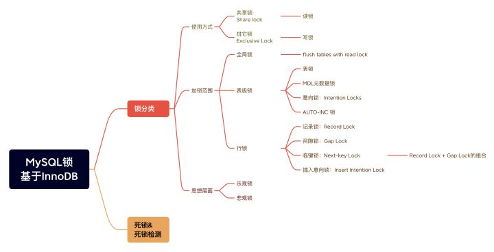
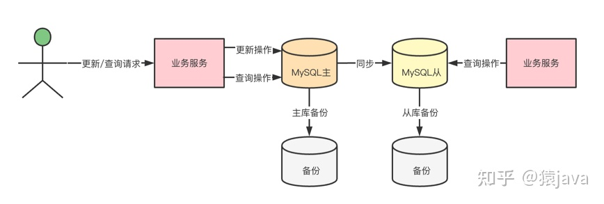
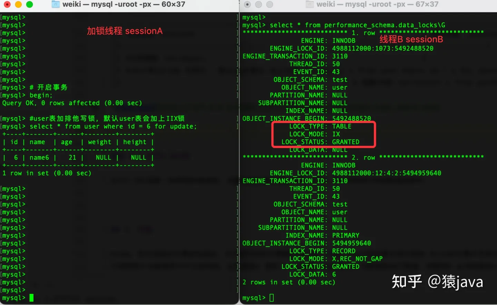
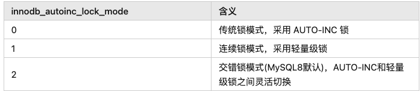
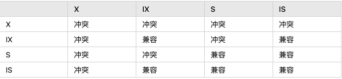
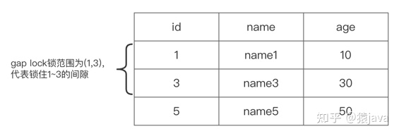
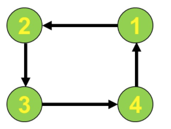

MySQL 数据库锁设计的初衷是处理并发问题，保证数据安全。MySQL数据库锁可以从下面三个维度进行划分：

1. 按照所的使用方式，MySQL锁可以分为共享锁，排它锁两种；
2. 根据加锁的范围，MySQL锁大致可以分成全局锁、表级锁和行锁；
3. 从思想层面上看，MySQL锁可以分为悲观锁、乐观锁两种；

#### 共享锁

共享锁，share lock，也叫读锁，它是指当对象被锁定时，允许其他事物读取该对象，也允许其他事物从该对象撒花姑娘再次获取共享锁，但不能对该对象进行写入，加锁方式是：

```mysql
# 方式1
select ... lock in share mode;

# 方式2
select ... for share;
```

如果事物 T1 在某对象持有共享(S)锁，则事物 T2 需要再次获取该对象的锁时，会出现下面两种情况：

1. 如果T2获取该对象的共享(S)锁,则可以立即获取锁；
2. 如果T2获取该对象的排他(X)锁,则无法获取锁；

例如： 给user表加共享锁 

| 加锁线程 sessionA                                            | 线程B sessionB                                               |
| ------------------------------------------------------------ | ------------------------------------------------------------ |
| #开启事务 begin;                                             |                                                              |
| #对user整张表加共享锁 select * from user lock in share mode; |                                                              |
|                                                              | #获取user表上的共享锁ok，select操作成功执行 select * from user; |
|                                                              | #获取user表上的排他锁失败，操作被堵塞 delete from user where id = 1; |
| #提交事务 #user表上的共享锁被释放 commit;                    |                                                              |
|                                                              | #获取user表上的排他锁成功，delete操作执行ok delete from user where id = 1; |


#### 排他锁

排他锁，exclusive lock; 也叫写锁或者独占锁，主要是防止其他事物和当前加锁事务锁定同一对象，同一对象主要有两层含义：

1. 当排他锁加在表上，则其他事务无法对该表进行insert、update、delete、alter、drop等更新操作
2. 当排他锁加在表的行上，则其他事务无法对该行进行行insert、update、delete、alter、drop等更新操作

排它锁加锁方式：

```mysql
select ... for update;
```


#### 全局锁

全局锁：就是对整个数据库实例加锁，它是粒度最大的锁

加锁

```mysql
flush tables with read lock;
```

指令执行完，整个数据库就处于只读状态了，其他线程执行以下操作，都会被阻塞： 

- 数据更新语句被阻塞，包括 insert, update, delete语句； 
- 数据定义语句被阻塞，包括建表 create table,alter table、drop table 语句；
- 更新操作事务commit语句被阻塞；

释放锁

```mysql
# 方式一
unlock tables;

# 方式二
# 加锁的会话断开，全局锁会被自动释放
```

使用场景

全局锁的典型使用场景是做全库逻辑备份，在备份过程中整个库完全处于只读状态。如下图：



- 假如在主库上备份，备份期间，业务服务器不能对数据库执行更新操作，因此涉及到更新操作的业务就瘫痪了；
- 假如在从库上备份，备份期间，从库不能执行主库同步过来的 binlog，会导致主从延迟越来越大，如果做了读写分离，那么从库上获取数据就会出现延时，影响业务；

既然不加锁会产生错误，加全局锁又会影响业务，那么有没有两全其美的方式呢？

有，MySQL官方自带的逻辑备份工具 mysqldump，具体指令如下：

```mysql
mysqldump –single-transaction
```

执行该指令，在备份数据之前会先启动一个事务，来确保拿到一致性视图， 加上 MVCC 的支持，保证备份过程中数据是可以正常更新。但是，single-transaction方法只适用于库中所有表都使用了事务引擎，如果有表使用了不支持事务的引擎，备份就只能用 FTWRL 方法。

#### 表级锁

表锁就是对整张表加锁，包含读锁和写锁，由MySQL server实现，表锁需要显示加锁或释放锁

```mysql
# 给表加写锁
lock tables tablename write;

# 给表加读锁
Lock tables tablename read;

# 释放锁
unlock tables;
```

**读锁**：代表当前表为只读状态，读锁是一种共享锁。需要注意的是，读锁除了会限制其它线程的操作外，也会限制加锁线程的行为，具体限制如下：

1. 加锁线程只能对当前表进行读操作，不能对当前表进行更新操作，不能对其它表进行所有操作； 
2. 其它线程只能对当前表进行读操作，不能对当前表进行更新操作，可以对其它表进行所有操作；

**写锁**：写锁是一种独占锁，需要注意的是，写锁除了会限制其它线程的操作外，也会限制加锁线程的行为，具体限制如下： 

1.  加锁线程对当前表能进行所有操作，不能对其它表进行任何操作； 
2. 其它线程不能对当前表进行任何操作，可以对其它表进行任何操作；

#### MDL元数据锁

元数据锁：metadata lock, 简称MDL，它是MySQL5.5版本引进的。元数据锁不用像表锁那样显示的加锁和释放锁，而是在访问表时被自动加上，以保证读写的正确性，加锁和释放锁规则：

- MDL读锁之间不互斥，也就是说，允许多个线程同时对加了MDL读锁的表进行CURD操作
- MDL写锁，它和读锁，写锁都是互斥的，目的是用来保证变更表结构操作的安全性，也就是说，当对表结构进行变更时，会被默认加MDL写锁，因此，如果有两个线程要同时给一个表加字段，其中一个要等另一个执行完才能开始执行
- MDL读写锁时在事物commit之后才会被释放

#### 意向锁

由于InnoDB引擎支持多粒度锁定，允许行锁和表锁共存，为了快速的判断表中是否存在行锁，innoDB推出了意向锁。

意向锁，intention lock, 它是一种表锁，用来标识事物打算在表中的行上获取什么类型的锁，不同的事务可以在同一张表上获取不同类型的意向锁，但是第一个获取表上意向排他(X)锁的事务会阻止其它事务获取该表上的任何S锁或X锁，反之，第一个获得表上意向共享锁(S)的事务可防止其它事务获取该表上的任何X锁。

意向锁时innoDB自动加上的，加锁时遵从下面两个协议：

- 事务在获取表中行的共享锁之前，必须先获取表上的IS锁或更强的锁
- 事务在获取表中行的排他锁之前，必须先获取表上的IX锁

```mysql
# user 表 ID=6 加共享行锁，默认user表会加上IS锁
select * from user where id = 6 for share;

# 观察IS锁
select * from performance_schema.data_locks\G

# user 表 ID = 6 加排他锁，默认user表会加上IX锁
select * from user where id = 6 for update;
```




#### AUTO-INC锁

AUTO-INC锁是一种特殊的表级锁，当表中有AUTO_INCREMENT的列时，如果向这张表插入数据时，InnoDB会先获取这张表的AUTO-INC锁，等插入语句执行完成后，AUTO-INC锁会被释放。

AUTO-INC锁可以使用innodb_autoinc_lock_mode变量来配置自增锁的算法，innodb_autoinc_lock_mode变量可以选择三种值如下表：




#### 锁的兼容性

下面的图表总结了表级锁类型的兼容性




#### 行锁

行锁是针对数据表中行记录的锁。MySQL 的行锁是在引擎层实现的，并不是所有的引擎都支持行锁，比如，InnoDB引擎支持行锁而 MyISAM引擎不支持。

InnoDB 引擎的行锁主要有四类：

1. Record Lock： 记录锁，是在索引记录上加锁；
2. Gap Lock：间隙锁，锁定一个范围，但不包含记录；
3. Next-key Lock：Gap Lock + Record Lock，锁定一个范围(Gap Lock实现)，并且锁定记录本身(Record Lock实现)；
4. 插入意向锁：针对 insert 操作产生的意向锁；

#####  Record Lock

Record Lock：记录锁，是针对索引记录的锁，锁定的总是索引记录。

例如，select id from user where id = 1 for update; for update 就显式在索引id上加行锁(排他锁)，防止其它任何事务 update或delete id=1 的行，但是对user表的insert、alter、drop操作还是可以正常执行。

##### Gap Lock

Gap Lock：间隙锁，锁住两个索引记录之间的间隙上，由InnoDB隐式添加。比如(1,3) 表示锁住记录1和记录3之间的间隙，这样记录2就无法插入，间隙可能跨越单个索引值、多个索引值，甚至是空。



Gap Lock锁，只存在于可重复读隔离级别，目的是为了解决可重复读隔离级别下幻读的现象。

##### Next-Key Lock

Next-Key锁，称为临键锁，它是Record Lock + Gap Lock的组合，用来锁定一个范围，并且锁定记录本身锁，它是一种左开右闭的范围，可以用符号表示为：(a,b]。


##### Insert Intention Lock

插入意向锁，它是一种特殊的间隙锁，特指插入操作产生的间隙锁。


#### 乐观锁&悲观锁

在MySQL中，无论是悲观锁还是乐观锁，都是人们对概念的一种思想抽象，它们本身还是利用 MySQL提供的锁机制来实现的。其实，除了在MySQL数据，像 Java语言里面也有乐观锁和悲观锁的概念。

- 悲观锁，可以理解成：在对任意记录进行修改前，先尝试为该记录加上排他锁(exclusive locking)，采用的是先获取锁再操作数据的策略，可能会产生死锁；
- 乐观锁，是相对悲观锁而言，一般不会利用数据库的锁机制，而是采用类似版本号比较之类的操作，因此乐观锁不会产生死锁的问题；


#### 死锁和死锁检测

当并发系统中不同线程出现循环资源依赖，涉及的线程都在等待别的线程释放资源时，就会导致这几个线程都进入无限等待的状态，称为死锁。可以通过下面的指令查看死锁

```mysql
show engine innodb status\G
```

当出现死锁以后，有两种策略：

- 一种策略是，直接进入等待，直到超时。这个超时时间可以通过参数 innodb_lock_wait_timeout 来设置，InnoDB 中 innodb_lock_wait_timeout 的默认值是 50s。
- 另一种策略是，发起死锁检测，发现死锁后，主动回滚死锁链条中的某一个事务，让其它事务得以继续执行。将参数 innodb_deadlock_detect 设置为 on，表示开启死锁检测。


## 问题

#### 什么是锁？

**锁**是计算机在进行**多 进程、线程**执行调度时强行限制资源访问的同步机制，用于在**并发访问**时保证数据的一致性、有效性；

> 锁是在执行多线程时，用于强行限制资源访问的同步机制，即用在并发控制中保证对互斥的要求。
>
> 一般的锁是建议锁（advisory lock），每个线程在访问对应资源前都需获取锁的信息，再根据信息决定是否可以访问。若访问对应信息，锁的状态会改变为锁定，因此其它线程此时不会来访问该资源，当资源结束后，会恢复锁的状态，允许其他线程的访问。


> 有些系统有强制锁（mandatory lock），若有未授权的线程想要访问锁定的数据，在访问时就会产生异常。

#### 那一般数据库有哪些锁？ 一般怎么使用？

数据库的锁根据不同划分方式有很多种说法，在业务访问上有以下两种：

- 排他锁
  在访问共享资源之前对其进行加锁，在访问完成后进行解锁操作。 加锁成功后，任何其它线程请求来获取锁都会被阻塞，直到当前线自行释放锁。

> 线程3状态:就绪、阻塞、执行

如解锁时，有一个以上的线程阻塞（资源已释放），那么所有尝试获取该锁的线程都被CPU认为**就绪状态**， 如果第一个就绪状态的线程又执行加锁操作，那么其他的线程又会进入就绪状态。 在这种方式下，只能有一个线程访问被互斥锁保护的资源

故此，MySQL的SQL语句加了互斥锁后，只有接受到请求并获取锁的线程才能够访问和修改数据。 因为互斥锁是针对线程访问控制而不是请求本身。

- 共享锁
  被加锁资源是可被共享的，但仅限于读请求。它的写请求只能被获取到锁的请求独占。 也就是加了共享锁的数据，只能够当前线程修改，其它线程只能读数据，并不能修改。

在 SQL 请求上可分为读、写锁。但本质还是对应对共享锁和排它锁。


#### 那 SQL 请求上不加锁怎么访问？ 为啥说它们属于共享锁和排他锁? 这之间有何联系？

除加锁读外，还有一种不加锁读的情况。这种方式称为**快照读，读请求加锁称为共享读。**

针对请求加共享、排它锁的原因在于，读请求天生是**幂等性**的，不论你读多少次数据不会发生变化，所以给读请求加上锁就应该为共享锁。 不然怎么保证它的特点呢？
而写请求，本身就需对数据进行修改，所以就需要排它锁来保证数据修改的一致性。

如果按照锁的颗粒度划分看，就有**表锁和行锁**

- 表锁：
  是MySQL中最基本的锁策略，并且是开销最小的策略。并发处理较少。表锁由MySQL服务或存储引擎管理。多数情况由服务层管理，具体看SQL操作。

例如：服务器会为诸如 **ALTER TABLE 之类的语句使用表锁**，而忽略存储引擎的锁。

加锁机制:

它会锁定整张表。一个用户在对表进行写操作（插人、删除、更新等)前，需要先获得写锁，这会阻塞其他用户对该表的所有读写操作。只有没有写锁时，其他用户才能获取到读锁。

- 行锁:
  锁定当前访问行的数据，并发处理能力很强。但锁开销最大。具体视行数据多少决定。由innoDB存储引擎支持。

- 页级锁：
  页级锁是 MySQL 中锁定粒度介于行级锁和表级锁中间的一种锁。表级锁速度快，但冲突多，行级冲突少，但速度慢。因此，采取了折衷的页级锁，一次锁定相邻的一组记录。由BDB 存储引擎管理页级锁。

####  

#### 为啥是表锁开销小，而不是行锁呢？ 毕竟表锁锁定是整张表？

 表锁锁定的是表没错，但它不是把表里面所有的数据行都上锁，相当于是封锁了表的入口，这样它只是需要判断每个请求是否可以获取到表的锁，没有就不锁定。
而行锁是针对表的每一行数据，数据量一多，锁定内容就多，故开销大。 但因它颗粒度小，锁定行不会影响到别的行。所以并发就高。而如果表锁在一个入口就卡死了，那整体请求处理肯定就会下降。

#### 记得行锁里面有几种不同的实现方式，你知道吗？

 innodb虽支持行锁，但锁实现的算法却和SQL的查询形式有关系：

- `Record Lock（记录锁）：`单个行记录上的锁。也就是我们日常认为的行锁。由
  `where =`
  的形式触发

- `Gap Lock（间隙锁`）：间隙锁，锁定一个范围，但不包括记录本身（它锁住了某个范围内的多个行，包括根本不存在的数据）。

GAP锁的目的，是为了防止事务插入而导致幻读的情况。该锁只会在隔离级别是RR或者以上的级别内存在。间隙锁的目的是为了让其他事务无法在间隙中新增数据。 `SQL里面用 where >、>=等范围条件触发，`但会根据锁定的范围内，是否包含了表中真实存在的记录进行变化，如果存在真实记录就会进化为 `临建锁`。反之就为间隙所。

- `Next-Key Lock（临键锁）`：它是记录锁和间隙锁的结合，锁定一个范围，并且锁定记录本身。对于行的查询，都是采用该方法，主要目的是解决幻读的问题。next-key 锁是InnoDB默认的。是一个左开右闭的规则

- `IS锁：意向共享锁`、Intention Shared Lock。当事务准备在某条记录上加S（读）锁时，需要先在表级别加一个IS锁。

- `IX锁：意向排它锁`、Intention Exclusive Lock。当事务准备在某条记录上加X（写）锁时，需要先在表级别加一个IX锁。


####  那这个东西是怎么实现的？

t(id PK, name KEY, sex, flag);

表中有四条记录：

```text
1, zhazhahui, m, A
3, nezha, m, A
5, lisi, m, A
9, wangwu, f, B
```

```mysql
# 记录锁: 锁定 id =1的记录
select * from t where id=1 for update;

# 间隙锁
# 锁定(3,5]，（5，9）范围的值，因为当前访问3到9的范围记录，就需要锁定表里面已经存在的数据来解决幻读和不可重复读的问题
select * from t where id > 3 and id < 9 ;

# 临建锁
# 会锁定 [9,+∞) 。查询会先选中 9 号记录，所以锁定范围就以9开始到正无穷数据。
select * from t where id >=9 ;
```


####  那意向排它、共享锁呢？是怎么个内容

向排它锁和意向共享锁，是针对当前SQL请求访问数据行时，会提前进行申请访问，如果最终行锁未命中就会退化为该`类型`的表锁。

#### 那有这个意向排它锁有什么好处呢？

 可提前做预判，每次尝试获取行锁之前会检查是否有表锁，如果存在就不会继续申请行锁，从而减少锁的开销。从而整个表就退化为表锁。


#### 那什么场景下行锁不会生效呢？锁 锁定的又是什么？

innodb的行锁是根据索引触发，如果没有相关的索引，那行锁将会退化成表锁（即锁定整个表里的行）。
而 **锁** 锁定的是**索引**即索引树里面的数据库字段的值。

有索引，用索引字段查询可得数据，其余字段查询将失败。因为获取不到行锁，只能等待。而锁定的是索引，故此其它用其它索引值查询能拿查询数据


#### 你前面说到的锁可以解决事务并发，然而MVCC也是用于解决并发，那干嘛还用锁来呢？

 通过MVCC可以解决脏读、不可重复读、幻读这些读一致性问题，但实际上这只是解决了普通select语句的数据读取问题。
事务利用MVCC进行的读取操作称之为快照读，所有普通的SELECT语句在READ COMMITTED、REPEATABLE READ隔离级别下都算是快照读。

除了快照读之外，还有一种是**锁定读**，即在读取的时候给记录加锁，在**锁定读**的情况下依然要解决脏读、不可重复读、幻读的问题。

比如：如果 1 4 7 9 的数据。如果条件为 where > 4 的，那如果不锁定到 （4，7] (7,9],(9，+∞）。那势必就会早幻读，不可重复读的问题。

#### 那你说下数据库的死锁是个什么情况？

死锁是指两个或多个事务在同一资源上相互占用，并请求锁定对方占用的资源，从而导致恶性循环。

当事务试图以不同的顺序锁定资源时，就可能产生死锁。多个事务同时锁定同一个资源时也可能会产生死锁。

一般可通过死锁检测和死锁超时机制来解决该问题。
`死锁检查：`
像InnoDB存储引擎，就能检测到死锁的循环依赖，并立即返回一个错误。否则死锁会导致出现非常慢的查询。通过参数 innodb_deadlock_detect 设置为on，来开启。

`超时机制：`
就是当查询的时间达到锁等待超时的设定后放弃锁请求。InnoDB目前处理死锁的方法是，将持有最少行级排他锁的事务进行回滚（这是相对比较简单的死锁回滚算法)。

可通过配置参数 innodb_lock_wait_timeout 用来设置超时时间。如果有些用户使用哪种大事务，就设置**锁超时时间大于事务执行时间**。
但这种情况下死锁超时检查的发现时间是无法接受的。


#### 那你说说InnoDB和MyisAM是如何发现死锁的？

- innodb

数据库会把事务单元锁维持的锁和它所等待的锁都记录下来，Innodb提供了wait-for graph算法来主动进行死锁检测，每当加锁请求无法立即满足需要进入等待时，wait-for graph算法都会被触发。当数据库检测到两个事务不同方向地给同一个资源加锁（产生循序），它就认为发生了死锁，触发wait-for graph算法。

比如：事务1给A加锁，事务2给B加锁，同时事务1给B加锁（等待），事务2给A加锁就发生了死锁。那么死锁解决办法就是终止一边事务的执行即可，这种效率一般来说是最高的，也是主流数据库采用的办法。

Innodb目前处理死锁的方法就是`将持有最少行级排他锁的事务进行回滚`。这是相对比较简单的死锁回滚方式。死锁发生以后，只有部分或者完全回滚其中一个事务，才能打破死锁。

对于事务型的系统，这是无法避免的，所以应用程序在设计必须考虑如何处理死锁。大多数情况下只需要重新执行因死锁回滚的事务即可。

- MyisAM

MyisAM自身只支持表级锁，故加锁后一次性获取的。所以资源上不会出现多个事务之间互相需要对方释放锁之后再来进行处理。故不会有死锁

####  wait-for graph 算法怎么理解？

如下所示，就是死锁

它们相互等待对方的资源，而且形成环路！每个数可看为一个节点，当节点1需要等待节点2的资源时，就生成一条有向边指向节点2，最后形成一个有向图。我们只要检测这个有向图是否出现环路即可，出现环路就是死锁！这就是wait-for graph算法。




####  既然死锁无法避免，那如何减少发生呢？

- 对应用程序进行调整/修改。某些情况下，你可以通过把大事务分解成多个小事务，使得锁能够更快被释放，从而极大程度地降低死锁发生的频率。在其他情况下，死锁的发生是因为两个事务采用不同的顺序操作了一个或多个表的相同的数据集。需要改成以相同顺序读写这些数据集，换言之，就是对这些数据集的访问采用串行化方式。这样在并发事务时，就让死锁变成了锁等待。

- 修改表的schema，例如：删除外键约束来分离两张表，或者添加索引来减少扫描和锁定的行。

- 如果发生了间隙锁，你可以把会话或者事务的事务隔离级别更改为RC(read committed)级别来避免，可以避免掉很多因为gap锁造成的死锁，但此时需要把binlog_format设置成row或者mixed格式。

- 为表添加合理的索引，不走索引将会为表的每一行记录添加上锁（等同表锁），死锁的概率大大增大。

- 为了在单个InnoDB 表上执行多个并发写入操作时避免死锁，可以在事务开始时通过为预期要修改的每个元祖（行）使用SELECT ... FOR UPDATE语句来获取必要的锁，即使这些行的更改语句是在之后才执行的。

- 通过SELECT ... LOCK IN SHARE MODE获取行的读锁后，如果当前事务再需要对该记录进行更新操作，则很有可能造成死锁。因进行获锁读取在修改