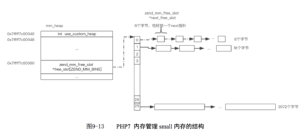
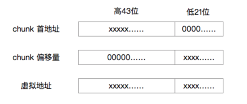
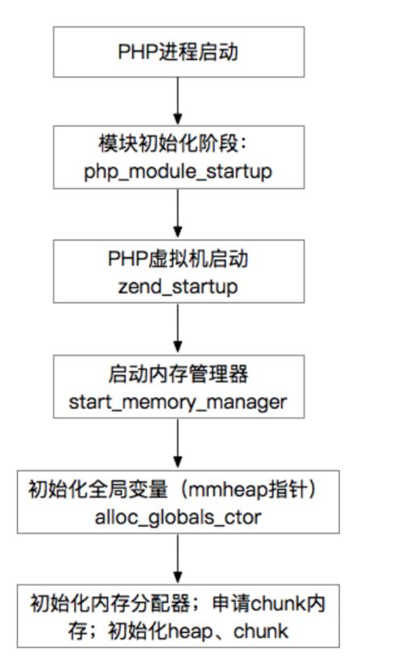
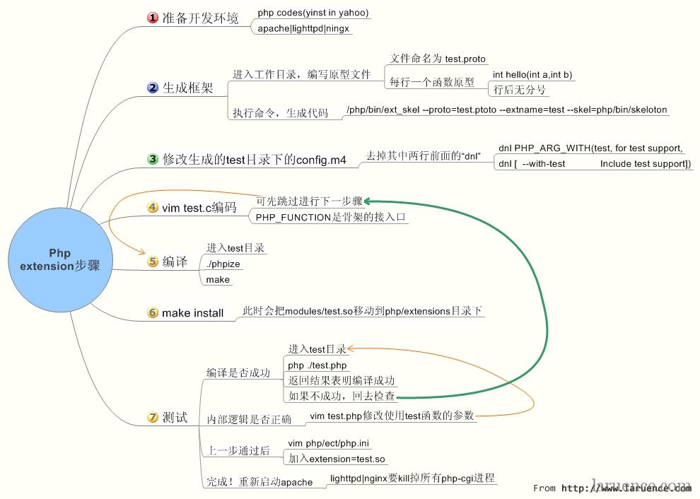
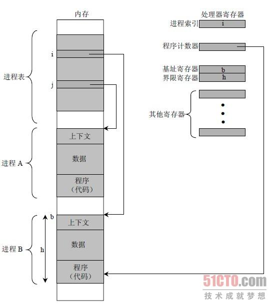
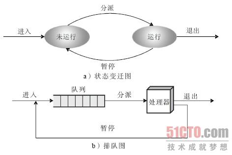
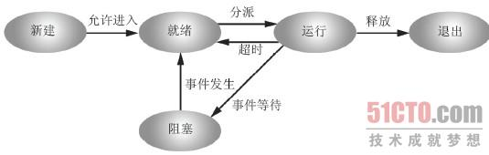
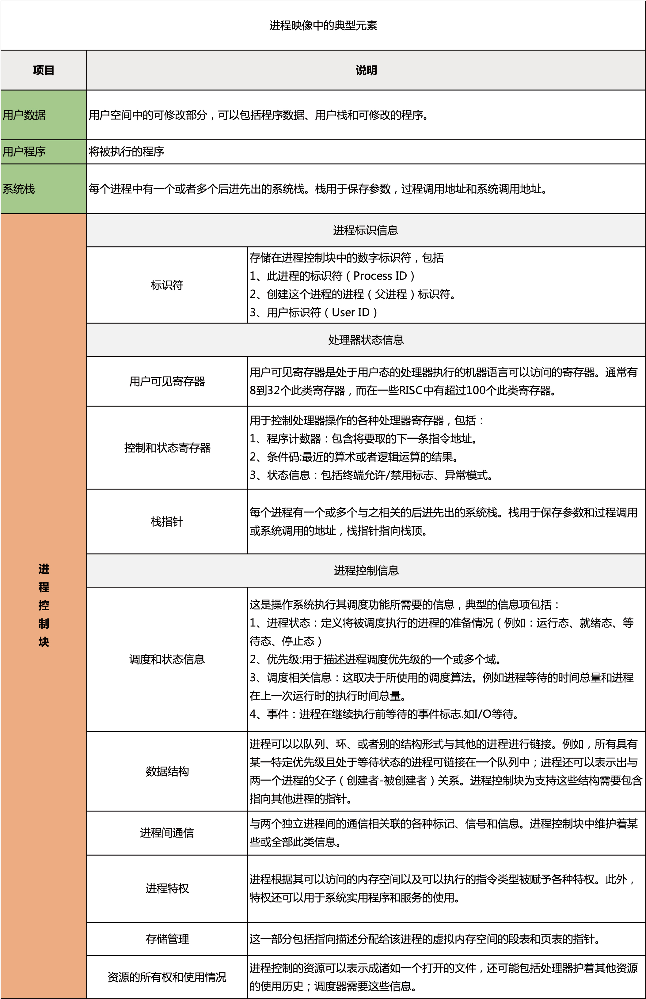
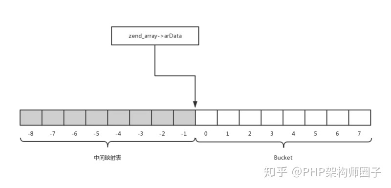

### php

#### **PHP的基本变量类型**

四种标量类型：boolean （布尔型）、integer （整型）、float （浮点型, 也称作 double)、string （字符串）

两种复合类型：array （数组）、object （对象）

最后是两种特殊类型：resource（资源）、NULL（NULL）

#### php 内存管理

##### 查看PHP脚本内存使用情况

```php
# 使用memory_get_usage() 获取当前分配给你的PHP脚本的内存量，单位是字节。

# 使用memory_get_peak_usage() 获取分配给你的PHP脚本的内存峰值字节数。

# PHP中的选项memory_limit，指定了脚本允许申请的最大内存量，单位是字节。如果没有限制，将这个值设置为-1。

# 例子：

echo "初始: ".memory_get_usage()."B\n";

$str = str_repeat('hello', 1000);

echo "使用: ".memory_get_usage()."B\n";

unset($str);

echo "释放: ".memory_get_usage()."B\n";

echo "峰值: ".memory_get_peak_usage()."B\n";

# 输出

# 初始: 230688B

# 使用: 235880B

# 释放: 230720B

# 峰值: 236928B
```

##### PHP内存管理

PHP采取“预分配方案”，提前向操作系统申请一个chunk（2M，利用到hugepage特性），并且将这2M内存切割为不同规格（大小）的若干内存块，当程序申请内存时，直接查找现有的空闲内存块即可；

PHP将内存分配请求分为3种情况：

huge内存：针对大于2M-4K（2M减去4K）的分配请求，直接调用mmap分配；

large内存：针对小于2M-4K，大于3K的分配请求，在chunk上查找满足条件的若干个连续page；

small内存：针对小于3K的分配请求；PHP拿出若干个页切割为8字节大小的内存块，拿出若干个页切割为16字节大小的内存块，24字节，32字节等等，将其组织成若干个空闲链表；每当有分配请求时，只在对应的空闲链表获取一个内存块即可；

##### PHP内存管理器数据模型

###### 1. 结构体

PHP需要记录申请的所有chunk，需要记录chunk中page的使用情况，要记录每种规格内存的空闲链表，要记录使用mmap分配的huge内存，等等…

于是有了以下两个结构体：
_zend_mm_heap记录着内存管理器所需的所有数据：

```c
//省略了结构体中很多字段
struct _zend_mm_heap {    //统计
    size_t             size;                    /* current memory usage */
    size_t             peak;                    /* peak memory usage */
    //由于“预分配”方案，实际使用内存和向操作系统申请的内存大小是不一样的；
    size_t             real_size;               /* current size of allocated pages */
    size_t             real_peak;               /* peak size of allocated pages */
 
    //small内存分为30种；free_slot数组长度为30；数组索引上挂着内存空闲链表
    zend_mm_free_slot *free_slot[ZEND_MM_BINS]; /* free lists for small sizes */
 
    //内存限制
    size_t             limit;                   /* memory limit */
    int                overflow;                /* memory overflow flag */
 
    //记录已分配的huge内存
    zend_mm_huge_list *huge_list;               /* list of huge allocated blocks */
 
    //PHP会分配若干chunk，记录当前主chunk首地址
    zend_mm_chunk     *main_chunk;     
    //统计chunk数目
    int                chunks_count;            /* number of alocated chunks */
    int                peak_chunks_count;       /* peak number of allocated chunks for current request */ 
}
```

_zend_mm_chunk记录着当前chunk的所有数据

```c
struct _zend_mm_chunk {    //指向heap
    zend_mm_heap      *heap;    //chunk组织为双向链表
    zend_mm_chunk     *next;
    zend_mm_chunk     *prev;    //当前chunk空闲page数目
    uint32_t           free_pages;              /* number of free pages */
    //当前chunk最后一个空闲的page位置
    uint32_t           free_tail;               /* number of free pages at the end of chunk */
    //每当申请一个新的chunk时，这个chunk的num会递增
    uint32_t           num;    //预留
    char               reserve[64 - (sizeof(void*) * 3 + sizeof(uint32_t) * 3)];    //指向heap，只有main_chunk使用
    zend_mm_heap       heap_slot;               /* used only in main chunk */
    //记录512个page的分配情况；0代表空闲，1代表已分配
    zend_mm_page_map   free_map;                /* 512 bits or 64 bytes */
    //记录每个page的详细信息，
    zend_mm_page_info  map[ZEND_MM_PAGES];      /* 2 KB = 512 * 4 */
};
```

###### 2. small内存

small内存分为30种规格，每种规格的空闲内存都挂在_zend_mm_heap结构体的free_slot数组上；

30种规格内存如下：

```c
//宏定义：第一列表示序号（称之为bin_num），第二列表示每个small内存的大小（字节数）；//第四列表示每次获取多少个page；第三列表示将page分割为多少个大小为第一列的small内存；#define ZEND_MM_BINS_INFO(_, x, y) \
    _( 0,    8,  512, 1, x, y) \
    _( 1,   16,  256, 1, x, y) \
    _( 2,   24,  170, 1, x, y) \
    _( 3,   32,  128, 1, x, y) \
    _( 4,   40,  102, 1, x, y) \
    _( 5,   48,   85, 1, x, y) \
    _( 6,   56,   73, 1, x, y) \
    _( 7,   64,   64, 1, x, y) \
    _( 8,   80,   51, 1, x, y) \
    _( 9,   96,   42, 1, x, y) \
    _(10,  112,   36, 1, x, y) \
    _(11,  128,   32, 1, x, y) \
    _(12,  160,   25, 1, x, y) \
    _(13,  192,   21, 1, x, y) \
    _(14,  224,   18, 1, x, y) \
    _(15,  256,   16, 1, x, y) \
    _(16,  320,   64, 5, x, y) \
    _(17,  384,   32, 3, x, y) \
    _(18,  448,    9, 1, x, y) \
    _(19,  512,    8, 1, x, y) \
    _(20,  640,   32, 5, x, y) \
    _(21,  768,   16, 3, x, y) \
    _(22,  896,    9, 2, x, y) \
    _(23, 1024,    8, 2, x, y) \
    _(24, 1280,   16, 5, x, y) \
    _(25, 1536,    8, 3, x, y) \
    _(26, 1792,   16, 7, x, y) \
    _(27, 2048,    8, 4, x, y) \
    _(28, 2560,    8, 5, x, y) \
    _(29, 3072,    4, 3, x, y)
 
#endif /* ZEND_ALLOC_SIZES_H */
```

只有这个宏定义有些功能不好用程序实现，比如bin_num=15时，获得此种small内存的字节数？分配此种small内存时需要多少page呢？
于是有了以下3个数组的定义：

```c
//bin_pages是一维数组，数组大小为30，数组索引为bin_num，//数组元素为ZEND_MM_BINS_INFO宏中的第四列#define _BIN_DATA_PAGES(num, size, elements, pages, x, y) pages,static const uint32_t bin_pages[] = {
  ZEND_MM_BINS_INFO(_BIN_DATA_PAGES, x, y)
};
//bin_elements是一维数组，数组大小为30，数组索引为bin_num，//数组元素为ZEND_MM_BINS_INFO宏中的第三列#define _BIN_DATA_ELEMENTS(num, size, elements, pages, x, y) elements,static const uint32_t bin_elements[] = {
  ZEND_MM_BINS_INFO(_BIN_DATA_ELEMENTS, x, y)
};
//bin_data_size是一维数组，数组大小为30，数组索引为bin_num，//数组元素为ZEND_MM_BINS_INFO宏中的第二列#define _BIN_DATA_SIZE(num, size, elements, pages, x, y) size,static const uint32_t bin_data_size[] = {
  ZEND_MM_BINS_INFO(_BIN_DATA_SIZE, x, y)
};
```

###### small内存分配方案

PHP将small内存分为30种不同大小的规格；

每种大小规格的空闲内存会组织为链表，挂在数组_zend_mm_heap结构体的free_slot[bin_num]索引上；



free_slot字段的定义：

```c
zend_mm_free_slot *free_slot[ZEND_MM_BINS];
 struct zend_mm_free_slot {
    zend_mm_free_slot *next_free_slot;};
```

可以看出空闲内存链表的每个节点都是一个zend_mm_free_slot结构体，其只有一个next指针字段；

**思考：对于8字节大小的内存块，其next指针就需要占8字节的空间，那用户的数据存储在哪里呢？**
答案：free_slot是small内存的空闲链表，空闲指的是未分配内存，此时是不需要存储其他数据的；当分配给用户时，此节点会从空闲链表删除，也就不需要维护next指针了；用户可以在8字节里存储任何数据；

**假设调用 void*ptr=emalloc(8)分配了一块内存；调用efree(ptr)释放内存时，PHP如何知道这块内存的字节数呢？**

任何内存分配器都需要额外的数据结构来标志其管理的每一块内存：空闲/已分配，内存大小等；PHP也不例外；可是我们发现使用emalloc(8)分配内存时，其分配的就只是8字节的内存，并没有额外的空间来存储这块内存的任何属性；

观察small内存宏定义ZEND_MM_BINS_INFO；我们发现对于每一个page，其只可能被分配为同一种规格；不可能存在一部分分割为8字节大小，一部分分割为16字节大小；也就是说每一个page的所有small内存块属性是相同的；那么只需要记录每一个page的属性即可；

**如何知道这块内存应该插入哪个空闲链表呢？**

large内存是同样的思路；申请large内存时，可能需要占若干个page的空间；但是同一个page只会属于一个large内存，不可能将一个page的一部分分给某个large内存；
答案：不管page用于small内存还是large内存分配，只需要记录每一个page的属性即可，PHP将其记录在zend_mm_chunk结构体的zend_mm_page_info map[ZEND_MM_PAGES]字段；长度为512的int数组；对任一块内存，只要能计算出属于哪一个页，就能得到其属性（内存大小）；

**Small分配**

前面说过small空闲内存会形成链表，挂在zen_mm_heap字段free_slot[bin_num]上；

最初请求分配时，free_slot[bin_num]可能还没有初始化，指向null；此时需要向chunk分配若干页，将页分割为大小相同的内存块，形成链表，挂在free_slot[bin_num]

**对任意地址p，如何计算页号？**

地址p减去chunk首地址获得偏移量；偏移量除4K即可；问题是如何获得chunk首地址？我们看看源码：

```c
chunk = (zend_mm_chunk*)ZEND_MM_ALIGNED_BASE(bin, ZEND_MM_CHUNK_SIZE);
page_num = ZEND_MM_ALIGNED_OFFSET(bin, ZEND_MM_CHUNK_SIZE) / ZEND_MM_PAGE_SIZE; 
#define ZEND_MM_ALIGNED_OFFSET(size, alignment) \
    (((size_t)(size)) & ((alignment) - 1))#define ZEND_MM_ALIGNED_BASE(size, alignment) \
    (((size_t)(size)) & ~((alignment) - 1))#define ZEND_MM_SIZE_TO_NUM(size, alignment) \
    (((size_t)(size) + ((alignment) - 1)) / (alignment))
```

我们发现计算偏移量或chunk首地址时，需要两个参数：size，地址p；alignment，调用时传的是ZEND_MM_CHUNK_SIZE（2M）；

其实PHP在申请chunk时，额外添加了一个条件：chunk首地址2M字节对齐；



如图，2M字节对齐时，给定任意地址p，p的低21位即地址p相对于chunk首地址的偏移量；

###### large内存分配

需要从chunk中查找连续pages_count个空闲的页；zend_mm_chunk结构体的free_map为512个比特，记录着每个页空闲还是已分配；

以64位机器为例，free_map又被分为8组；每组64比特，看作uint32_t类型；

看看PHP是如何高效查找0比特位置的：依然是二分查找

```c
static zend_always_inline int zend_mm_bitset_nts(zend_mm_bitset bitset){    int n=0;//64位机器才会执行#if SIZEOF_ZEND_LONG == 8
    if (sizeof(zend_mm_bitset) == 8) {        if ((bitset & 0xffffffff) == 0xffffffff) {n += 32; bitset = bitset >> Z_UL(32);}
    }#endif
    if ((bitset & 0x0000ffff) == 0x0000ffff) {n += 16; bitset = bitset >> 16;}    if ((bitset & 0x000000ff) == 0x000000ff) {n +=  8; bitset = bitset >>  8;}    if ((bitset & 0x0000000f) == 0x0000000f) {n +=  4; bitset = bitset >>  4;}    if ((bitset & 0x00000003) == 0x00000003) {n +=  2; bitset = bitset >>  2;}    return n + (bitset & 1);
}
```


###### huge内存分配：

```text
//#define ZEND_MM_ALIGNED_SIZE_EX(size, alignment) \
    (((size) + ((alignment) - Z_L(1))) & ~((alignment) - Z_L(1)))
 //会将size扩展为2M字节的整数倍；直接调用分配chunk的函数申请内存//huge内存以n*2M字节对齐的static void *zend_mm_alloc_huge(zend_mm_heap *heap, size_t size){    size_t new_size = ZEND_MM_ALIGNED_SIZE_EX(size, MAX(REAL_PAGE_SIZE, ZEND_MM_CHUNK_SIZE));     
    void *ptr = zend_mm_chunk_alloc(heap, new_size, ZEND_MM_CHUNK_SIZE);    return ptr;
}
```


###### 内存释放

```c
ZEND_API void ZEND_FASTCALL _efree(void *ptr)
{
    zend_mm_free_heap(AG(mm_heap), ptr);
} 
static zend_always_inline void zend_mm_free_heap(zend_mm_heap *heap, void *ptr){    //计算当前地址ptr相对于chunk的偏移
    size_t page_offset = ZEND_MM_ALIGNED_OFFSET(ptr, ZEND_MM_CHUNK_SIZE); 
    //偏移为0，说明是huge内存，直接释放
    if (UNEXPECTED(page_offset == 0)) {        if (ptr != NULL) {
            zend_mm_free_huge(heap, ptr);
        }
    } else {        //计算chunk首地址
        zend_mm_chunk *chunk = (zend_mm_chunk*)ZEND_MM_ALIGNED_BASE(ptr, ZEND_MM_CHUNK_SIZE);        //计算页号
        int page_num = (int)(page_offset / ZEND_MM_PAGE_SIZE);        //获得页属性信息
        zend_mm_page_info info = chunk->map[page_num]; 
        //small内存
        if (EXPECTED(info & ZEND_MM_IS_SRUN)) {
            zend_mm_free_small(heap, ptr, ZEND_MM_SRUN_BIN_NUM(info));
        }        //large内存
        else /* if (info & ZEND_MM_IS_LRUN) */ {            int pages_count = ZEND_MM_LRUN_PAGES(info);             //将页标记为空闲
            zend_mm_free_large(heap, chunk, page_num, pages_count);
        }
    }
}static zend_always_inline void zend_mm_free_small(zend_mm_heap *heap, void *ptr, int bin_num){
    zend_mm_free_slot *p;    //插入空闲链表头部即可
    p = (zend_mm_free_slot*)ptr;
    p->next_free_slot = heap->free_slot[bin_num];
    heap->free_slot[bin_num] = p;
}
```

######  PHP内存管理器初始化流程



###### PHP内存管理总结

1）需要明白一点：任何内存分配器都需要额外的数据结构来记录内存的分配情况；

2）内存池是代替直接调用malloc/free、new/delete进行内存管理的常用方法；内存池中空闲内存块组织为链表结果，申请内存只需要查找空闲链表即可，释放内存需要将内存块重新插入空闲链表；

3）PHP采用预分配内存策略，提前向操作系统分配2M字节大小内存，称为chunk；同时将内存分配请求根据字节大小分为small、huge、large三种；

4）small内存，采用“分离存储”思想；将空闲内存块按照字节大小组织为多个空闲链表；

5）large内存每次回分配连续若干个页，采用最佳适配算法；

6）huge内存直接使用mmap函数向操作系统申请内存（申请大小是2M字节整数倍）；

7）chunk中的每个页只会被切割为相同规格的内存块；所以不需要再每个内存块添加头部，只需要记录每个页的属性即可；

8）如何方便根据地址计算当前内存块属于chunk中的哪一个页？PHP分配的chunk都是2M字节对齐的，任意地址的低21位即是相对chunk首地址，除以页大小则可获得页号；

### PHP opcode

Opcode是一种PHP脚本编译后的中间语言，就像Java的ByteCode,或者.NET的MSL，举个例子，比如你写下了如下的PHP代码

```php
echo "Hello World";
$a = 1 + 1;
echo $a;
```

PHP执行这段代码会经过如下4个步骤(确切的来说，应该是PHP的语言引擎Zend)

> 1.Scanning(Lexing) ,将PHP代码转换为语言片段(Tokens)
>  2.Parsing, 将Tokens转换成简单而有意义的表达式
>  3.Compilation, 将表达式编译成Opocdes
>  4.Execution, 顺次执行Opcodes，每次一条，从而实现PHP脚本的功能。

现在有的Cache比如APC,可以使得PHP缓存住Opcodes，这样，每次有请求来临的时候，就不需要重复执行前面3步，从而能大幅的提高PHP的执行速度。

#### php 开启 opcode 测试

测试代码

```php
for($i=0;$i<100;$i++){
    echo "Hello Opcache";
}
```

执行命令

```
 ab -n 1000 -c 100 http://192.168.1.110:8080/t1.php
```

开启时测试结果结果

```shell
Concurrency Level:      100
Time taken for tests:   0.976 seconds
Complete requests:      1000
Failed requests:        0
Write errors:           0
Total transferred:      1430000 bytes
HTML transferred:       1300000 bytes
Requests per second:    1024.27 [#/sec] (mean)
Time per request:       97.630 [ms] (mean)
Time per request:       0.976 [ms] (mean, across all concurrent requests)
Transfer rate:          1430.38 [Kbytes/sec] received
```

关闭后测试结果

```shell
Concurrency Level:      100
Time taken for tests:   1.695 seconds
Complete requests:      1000
Failed requests:        0
Write errors:           0
Total transferred:      1430000 bytes
HTML transferred:       1300000 bytes
Requests per second:    589.89 [#/sec] (mean)
Time per request:       169.522 [ms] (mean)
Time per request:       1.695 [ms] (mean, across all concurrent requests)
Transfer rate:          823.78 [Kbytes/sec] received
```

结论

```
在开启 `opcache` 后 每秒钟请求从 `589.89` 增长到了 `1024.27`
合理利用 `opcache` 会给程序带来不错的优化效果
```


#### opcode 注意事项

opcode 生成规则是，通过时间戳进行生成新 opcode，**在生产环境中如果发布版本回退，老的opcode 生成时间会大于回退版本文件的当前时间戳的。** 也就是说不会再更新啦。

### php 内置缓存

#### 1. ob缓存

```php
ob_start();            // 打开一个输出缓冲区，所有的输出信息不再直接发送到浏览器，而是保存在输出缓冲区里面。
 
ob_clean();            // 删除内部缓冲区的内容，不关闭缓冲区(不输出)。
ob_end_clean();        // 删除内部缓冲区的内容，关闭缓冲区(不输出)。
ob_get_clean();        // 返回内部缓冲区的内容，关闭缓冲区。相当于执行 ob_get_contents() and ob_end_clean()
ob_flush();            // 发送内部缓冲区的内容到浏览器，删除缓冲区的内容，不关闭缓冲区。
ob_end_flush();        // 发送内部缓冲区的内容到浏览器，删除缓冲区的内容，关闭缓冲区。
ob_get_flush();        // 返回内部缓冲区的内容，并关闭缓冲区，再释放缓冲区的内容。相当于ob_end_flush()并返回缓冲区内容。
flush();               // 将ob_flush释放出来的内容，以及不在PHP缓冲区中的内容，全部输出至浏览器；刷新内部缓冲区的内容，并输出。
 
ob_get_contents();     // 返回缓冲区的内容，不输出。
ob_get_length();       // 返回内部缓冲区的长度，如果缓冲区未被激活，该函数返回FALSE。
ob_get_level();        // 返回输出缓冲机制的嵌套级别
ob_get_status();       // 得到所有输出缓冲区的状态
 
ob_implicit_flush();   // 打开或关闭绝对刷新，默认为关闭，打开后ob_implicit_flush(true)，所谓绝对刷新，即当有输出语句(e.g: echo)被执行时，便把输出直接发送到浏览器，而不再需要调用flush()或等到脚本结束时才输出。
 
ob_gzhandler               // ob_start回调函数，用gzip压缩缓冲区的内容。
ob_list_handlers           // List all output handlers in use
output_add_rewrite_var     // 添加URL重写器的值
output_reset_rewrite_vars  // 重设URL重写器的值
 
// 这些函数的行为受php_ini设置的影响：
output_buffering       // 该值为ON时，将在所有脚本中使用输出控制；若该值为一个数字，则代表缓冲区的最大字节限制，当缓存内容达到该上限时将会自动向浏览器输出当前的缓冲区里的内容。
output_handler         // 该选项可将脚本所有的输出，重定向到一个函数。例如，将 output_handler 设置为 mb_output_handler() 时，字符的编码将被修改为指定的编码。设置的任何处理函数，将自动的处理输出缓冲。
implicit_flush         // 作用同ob_implicit_flush，默认为Off。
```

#### php.ini 中 ob参数影响

```php.ini
output_buffering = 4096 # 缓冲区大小, 默认是 4096 表示 4096 字节也就是 4kB。
```

实例: PHP实现自动化缓存的功能，只需要直接把这个php文件引入到需要缓存的页面即可**实现get请求的页面缓存**

```php
/* 
【PHP实现页面缓存处理】 
auto_cache.php 实现智能的自动缓存。
在需要实现缓存功能的页面 require('auto_cache.php');即可;
存放缓存的根目录,最好是放到/tmp目录,尤其是虚拟主机用户,因为/tmp目录不占自己的主页空间啊

ob_start() 开始输出缓冲, 这时PHP停止输出, 在这以后的输出都被转到一个内部的缓冲里. 
ob_get_contents() 这个函数返回内部缓冲的内容. 这就等于把这些输出都变成了字符串. 
ob_get_ length() 返回内部缓冲的长度. 
ob_end_flush() 结束输出缓冲, 并输出缓冲里的内容. 在这以后的输出都是正常输出. 
ob_end_clean() 结束输出缓冲, 并扔掉缓冲里的内容. 
*/ 

define('CACHE_ROOT', dirname(__FILE__).'/cache'); 
define('CACHE_LIFE', 86400); //缓存文件的生命期，单位秒，86400秒是一天 
define('CACHE_SUFFIX','.html'); //缓存文件的扩展名，千万别用 .php .asp .jsp .pl 等等

$file_name = md5($_SERVER['REQUEST_URI']).CACHE_SUFFIX; //缓存文件名

//$file_name = $_SERVER['REQUEST_URI'].CACHE_SUFFIX; //缓存文件名

echo("<script>console.log('".$file_name."');</script>");

//缓存目录，根据md5的前两位把缓存文件分散开。避免文件过多。如果有必要，可以用第三四位为名，再加一层目录。
//256个目录每个目录1000个文件的话，就是25万个页面。两层目录的话就是65536*1000=六千五百万。
//不要让单个目录多于1000，以免影响性能。

$cache_dir = CACHE_ROOT.'/'.substr($file_name,0,2); 
$cache_file = $cache_dir.'/'.$file_name; //缓存文件存放路径

  if	($_SERVER['REQUEST_METHOD']=='GET'){ //GET方式请求才缓存，POST之后一般都希望看到最新的结果 
      if (file_exists($cache_file) && time() - filemtime($cache_file) < CACHE_LIFE) { //如果缓存文件存在，并且没有过期，就把它读出来。
          $fp = fopen($cache_file,'rb'); 
          fpassthru($fp); 
          fclose($fp); 
          exit(); 
  		} elseif ( !file_exists($cache_dir) ){ 
          if ( !file_exists(CACHE_ROOT) ) { 
              mkdir(CACHE_ROOT,0777); 
              chmod(CACHE_ROOT,0777); 
					} 
  				mkdir($cache_dir,0777); 
  				chmod($cache_dir,0777); 
  		}

      function auto_cache($contents) { //回调函数，当程序结束时自动调用此函数 
          global $cache_file; 
          $fp = fopen($cache_file,'wb'); 
          fwrite($fp,$contents); 
          fclose($fp); 
          chmod($cache_file,0777); 
          clean_old_cache(); //生成新缓存的同时，自动删除所有的老缓存。以节约空间。
          return $contents; 
      }

      function clean_old_cache(){ 
        chdir(CACHE_ROOT); 
        foreach (glob("*/*".CACHE_SUFFIX) as $file){ 
            if ( time()-filemtime($file) > CACHE_LIFE) { 
              unlink($file); 
            } 
        } 
      }

			ob_start('auto_cache'); //回调函数 auto_cache 
	} else{ 
    if(file_exists($cache_file)){ //file_exists() 函数检查文件或目录是否存在。
    		unlink($cache_file); //不是GET的请求就删除缓存文件。
		} 
	} 
```


### 用C开发PHP扩展

https://www.laruence.com/2009/04/28/719.html

假设你正在开发一个网站，需要一个把字符串重复n次的函数。下面是用PHP写的例子：

```php
function self_concat($string, $n){
    $result = "";
    for($i = 0; $i < $n; $i++){
        $result .= $string;
    }
    return $result;
}
self_concat("One", 3) // OneOneOne
self_concat("One", 1) // One
```

为扩展建立函数的第一步是写一个函数定义文件，该函数定义文件定义了扩展对外提供的函数原形。该例中，定义函数只有一行函数原形self_concat() :

```c
string self_concat(string str, int n)
```

函数定义文件的一般格式是一个函数一行。你可以定义可选参数和使用大量的PHP类型，包括: bool, float, int, array等。

保存为myfunctions.def文件至PHP原代码目录树下。

该是通过扩展骨架(skeleton)构造器运行函数定义文件的时机了。该构造器脚本叫ext_skel，放在PHP原代码目录树的ext/目录下（PHP原码主目录下的README.EXT_SKEL提供了更多的信息）。假设你把函数定义保存在一个叫做myfunctions.def的文件里，而且你希望把扩展取名为myfunctions，运行下面的命令来建立扩展骨架

```
./ext_skel --extname=myfunctions --proto=myfunctions.def
```

这个命令在ext/目录下建立了一个myfunctions/目录。你要做的第一件事情也许就是编译该骨架，以便编写和测试实际的C代码。编译扩展有两种方法：

- 作为一个可装载模块或者DSO（动态共享对象）

- 静态编译到PHP

  


因为第二种方法比较容易上手，所以本章采用静态编译。如果你对编译可装载扩展模块感兴趣，可以阅读PHP原代码根目录下的README.SELF-CONTAINED_EXTENSIONS文件。为了使扩展能够被编译，需要修改扩展目录ext/myfunctions/下的config.m4文件。扩展没有包裹任何外部的C库，你需要添加支持--enable-myfunctions配置开关到PHP编译系统里（–with-extension 开关用于那些需要用户指定相关C库路径的扩展）。可以去掉自动生成的下面两行的注释来开启这个配置。

```
./ext_skel --extname=myfunctions --proto=myfunctions.def
PHP_ARG_ENABLE(myfunctions, whether to enable myfunctions support,
[ --enable-myfunctions                Include myfunctions support])
```

现在剩下的事情就是在PHP原代码树根目录下运行./buildconf，该命令会生成一个新的配置脚本。通过查看./configure --help输出信息，可以检查新的配置选项是否被包含到配置文件中。现在，打开你喜好的配置选项开关和--enable-myfunctions重新配置一下PHP。最后的但不是最次要的是，用make来重新编译PHP。
ext_skel应该把两个PHP函数添加到你的扩展骨架了：打算实现的self_concat()函数和用于检测myfunctions 是否编译到PHP的confirm_myfunctions_compiled()函数。完成PHP的扩展开发后，可以把后者去掉。

```php
<?php
print confirm_myfunctions_compiled("myextension");
?>
```

运行这个脚本会出现类似下面的输出：

```
"Congratulations! You have successfully modified ext/myfunctions
config.m4. Module myfunctions is now compiled into PHP."
```

另外，ext_skel脚本生成一个叫myfunctions.php的脚本，你也可以利用它来验证扩展是否被成功地编译到PHP。它会列出该扩展所支持的所有函数。

现在你学会如何编译扩展了，该是真正地研究self_concat()函数的时候了。
下面就是ext_skel脚本生成的骨架结构：

```C
/* {{{ proto string self_concat(string str, int n)
*/
PHP_FUNCTION(self_concat)
{
char *str = NULL;
int argc = ZEND_NUM_ARGS();
int str_len;
long n;
if (zend_parse_parameters(argc TSRMLS_CC, "sl", &str, &str_len, &n) == FAILURE)
return;
php_error(E_WARNING, "self_concat: not yet implemented");
}
/* }}} */
```

自动生成的PHP函数周围包含了一些注释，这些注释用于自动生成代码文档和vi、Emacs等编辑器的代码折叠。函数自身的定义使用了宏PHP_FUNCTION()，该宏可以生成一个适合于Zend引擎的函数原型。逻辑本身分成语义各部分，取得调用函数的参数和逻辑本身。
为了获得函数传递的参数，可以使用zend_parse_parameters()API函数。下面是该函数的原型：

```c
zend_parse_parameters(int num_args TSRMLS_DC, char *type_spec, …);
```

第一个参数是传递给函数的参数个数。通常的做法是传给它ZEND_NUM_ARGS()。这是一个表示传递给函数参数总个数的宏。第二个参数是为了线程安全，总是传递TSRMLS_CC宏，后面会讲到。第三个参数是一个字符串，指定了函数期望的参数类型，后面紧跟着需要随参数值更新的变量列表。因为PHP采用松散的变量定义和动态的类型判断，这样做就使得把不同类型的参数转化为期望的类型成为可能。例如，如果用户传递一个整数变量，可函数需要一个浮点数，那么zend_parse_parameters()就会自动地把整数转换为相应的浮点数。如果实际值无法转换成期望类型（比如整形到数组形），会触发一个警告。
下表列出了可能指定的类型。我们从完整性考虑也列出了一些没有讨论到的类型。

| 类型指定符 | 对应的C类型 | 描述                                     |
| ---------- | ----------- | ---------------------------------------- |
| l          | long        | 符号整数                                 |
| d          | double      | 浮点数                                   |
| s          | char *, int | 二进制字符串，长度                       |
| b          | zend_bool   | 逻辑型（1或0）                           |
| r          | zval *      | 资源（文件指针，数据库连接等）           |
| a          | zval *      | 联合数组                                 |
| o          | zval *      | 任何类型的对象                           |
| O          | zval *      | 指定类型的对象。需要提供目标对象的类类型 |
| z          | zval *      | 无任何操作的zval                         |

为了容易地理解最后几个选项的含义，你需要知道zval是Zend引擎的值容器[1]。无论这个变量是布尔型，字符串型或者其他任何类型，其信息总会包含在一个zval联合体中。本章中我们不直接存取zval，而是通过一些附加的宏来操作。下面的是或多或少在C中的zval, 以便我们能更好地理解接下来的代码。

```c
typedef union _zval{
     long lval;
     double dval;
     struct {
          char *val;
          int len;
     }str;
     HashTable *ht;
     zend_object_value obj;
}zval;
```

在我们的例子中，我们用基本类型调用zend_parse_parameters()，以本地C类型的方式取得函数参数的值，而不是用zval容器。
为了让zend_parse_parameters()能够改变传递给它的参数的值，并返回这个改变值，需要传递一个引用。仔细查看一下self_concat()：

```c
if (zend_parse_parameters(argc TSRMLS_CC, "sl", &str, &str_len, &n) == FAILURE)
return;
```

注意到自动生成的代码会检测函数的返回值FAILUER(成功即SUCCESS)来判断是否成功。如果没有成功则立即返回，并且由zend_parse_parameters()负责触发警告信息。因为函数打算接收一个字符串l和一个整数n，所以指定 ”sl” 作为其类型指示符。s需要两个参数，所以我们传递参考char * 和 int (str 和 str_len)给zend_parse_parameters()函数。无论什么时候，记得总是在代码中使用字符串长度str_len来确保函数工作在二进制安全的环境中。不要使用strlen()和strcpy()，除非你不介意函数在二进制字符串下不能工作。二进制字符串是包含有nulls的字符串。二进制格式包括图象文件，压缩文件，可执行文件和更多的其他文件。”l” 只需要一个参数，所以我们传递给它n的引用。尽管为了清晰起见，骨架脚本生成的C变量名与在函数原型定义文件中的参数名一样；这样做不是必须的，尽管在实践中鼓励这样做。
回到转换规则中来。下面三个对self_concat()函数的调用使str, str_len和n得到同样的值：

```php
self_concat("321", 5);
self_concat(321, "5");
self_concat("321", "5");
// str points to the string "321", str_len equals 3, and n equals 5.
// str 指向字符串"321"，str_len等于3，n等于5。
```

在我们编写代码来实现连接字符串返回给PHP的函数前，还得谈谈两个重要的话题：内存管理、从PHP内部返回函数值所使用的API。

##### 内存管理

用于从堆中分配内存的PHP API几乎和标准C API一样。在编写扩展的时候，使用下面与C对应（因此不必再解释）的API函数：

```c
emalloc(size_t size);
efree(void *ptr);
ecalloc(size_t nmemb, size_t size);
erealloc(void *ptr, size_t size);
estrdup(const char *s);
estrndup(const char *s, unsigned int length);
```

##### 从PHP函数中返回值

扩展API包含丰富的用于从函数中返回值的宏。这些宏有两种主要风格：第一种是RETVAL_type()形式，它设置了返回值但C代码继续执行。这通常使用在把控制交给脚本引擎前还希望做的一些清理工作的时候使用，然后再使用C的返回声明 ”return” 返回到PHP；后一个宏更加普遍，其形式是RETURN_type()，他设置了返回类型，同时返回控制到PHP。下表解释了大多数存在的宏。

| 设置返回值并且结束函数    | 设置返回值                | 宏返回类型和参数                                             |
| ------------------------- | ------------------------- | ------------------------------------------------------------ |
| RETURN_LONG(l)            | RETVAL_LONG(l)            | 整数                                                         |
| RETURN_BOOL(b)            | RETVAL_BOOL(b)            | 布尔数(1或0)                                                 |
| RETURN_NULL()             | RETVAL_NULL()             | NULL                                                         |
| RETURN_DOUBLE(d)          | RETVAL_DOUBLE(d)          | 浮点数                                                       |
| RETURN_STRING(s, dup)     | RETVAL_STRING(s, dup)     | 字符串。如果dup为1，引擎会调用estrdup()重复s，使用拷贝。如果dup为0，就使用s |
| RETURN_STRINGL(s, l, dup) | RETVAL_STRINGL(s, l, dup) | 长度为l的字符串值。与上一个宏一样，但因为s的长度被指定，所以速度更快。 |
| RETURN_TRUE               | RETVAL_TRUE               | 返回布尔值true。注意到这个宏没有括号。                       |
| RETURN_FALSE              | RETVAL_FALSE              | 返回布尔值false。注意到这个宏没有括号。                      |
| RETURN_RESOURCE(r)        | RETVAL_RESOURCE(r)        | 资源句柄。                                                   |

##### 完成self_concat()

现在你已经学会了如何分配内存和从PHP扩展函数里返回函数值，那么我们就能够完成self_concat()的编码：

```c
/* {{{ proto string self_concat(string str, int n)
*/
PHP_FUNCTION(self_concat)
}
char *str = NULL;
int argc = ZEND_NUM_ARGS();
int str_len;
long n;
char *result; /* Points to resulting string */
char *ptr; /* Points at the next location we want to copy to */
int result_length; /* Length of resulting string */
if (zend_parse_parameters(argc TSRMLS_CC, "sl", &str, &str_len, &n) == FAILURE)
return;
/* Calculate length of result */
result_length = (str_len * n);
/* Allocate memory for result */
result = (char *) emalloc(result_length + 1);
/* Point at the beginning of the result */
ptr = result;
while (n--) {
/* Copy str to the result */
memcpy(ptr, str, str_len);
/* Increment ptr to point at the next position we want to write to */
ptr += str_len;
}
/* Null terminate the result. Always null-terminate your strings
even if they are binary strings */
*ptr = '\0';
/* Return result to the scripting engine without duplicating it*/
RETURN_STRINGL(result, result_length, 0);
}
/* }}} */
```

现在要做的就是重新编译一下PHP，这样就完成了第一个PHP函数。
让我门检查函数是否真的工作。在最新编译过的PHP树下执行[2]下面的脚本：

```php
for ($i = 1; $i <= 3; $i++){
     print self_concat("ThisIsUseless", $i);
     print "\n";
}
  
# 你应该得到下面的结果：
# ThisIsUseless
# ThisIsUselessThisIsUseless
# ThisIsUselessThisIsUselessThisIsUseless
```


### 多进程

##### 理论讲解

进程的概念是操作系统的结构的基础。Multics的设计者在20世纪60年代首次使用了这个技术词语,它比作业更通用一些。关于进程的定义，如下所示：

1. 一个正在执行的程序。 
2. 计算机中正在运行的程序的一个实例。 
3. 可以分配给处理器并由处理器执行的一个实体。 
4. 由单一的顺序的执行线程、一个当前状态和一组相关的系统资源所描述的活动单元

也可以把进程当成由一组元素组成的实体，进程的两个基本的元素是`程序代码`（可能被执行相同程序的其他进程共享）和代码相关联的`数据集`。假设处理器开始执行这个程序代码，且我们把这个执行实体叫做叫做`进程`。在进程执行时，任意给定一个时间，进程都可以唯一的被表征为以下元素。

```php
1.标识符：跟这个进程相关的唯一标识符，用来区别其他进程。
2、状态：如果进程正在执行，那么进程处于运行态。
3、优先级：相对于其他进程的优先级
4、内存指针：包括程序代码和进程相关数据的指针，还有和其他进程共享内存块的指针。
5、上下文数据：进程执行时处理器的寄存器中的数据。
6、I/O 状态信息：包括显示的I/O操作。分配给进程的I/O设备（例如磁带驱动器）和被进程使用的文件列表等。
7、记账信息：可能包括处理器时间综合、使用的是时钟数总和、时间限制、记账号等。
```

如下图：


###### 为什么设计了进程？

设计出一个能够协调各种不同活动的系统软件是非常困难的。在任何时刻都有许多作业在运行中,每个作业都包括要求按照顺序执行的很多步骤，因此分析时间的序列组合是不可的。由于缺乏能够在所有活动中进行协调和合作的系统级的方法，程序员只能基于他们对操作系统所控制的环境的理解，采用自己的特殊方法。然而这种方法是很脆弱的，尤其对于一些程序设计中的小错误，因为这些错误只有在很少见的时间序列发生时才会出现。由于需要从应用程序软件错误和硬件错误中区分出这些错误，因而诊断工作是很困难的。及时检测出错误，也很难确定原因，因为很难在线错误产生的精确场景。一般而言，产生这类错误的4个主要原因如下： 

1. 不正确同步 
2. 失败互斥。 
3. 不确定的程序操作 
4. 死锁

解决这些问题需要一种系统级别的方法监控处理器中不同程序的执行。进程的概念为此提供了基础。 

因此进程可以看做是由三部分组成的：

1. 一段可以执行的程序 
2. 程序所需要的相关数据 
3. 程序的执行上下文

###### 了解进程执行上下文

执行上下文是进程的重重之中。`执行上下文(execution context)` 又称作`进程状态（process state）`，是操作系统用来管理和控制进程所需的内部数据。这种内部信息和进程是分开的，因为操作系统信息不允许被进程直接访问。上下文包括操作系统管理进程以及处理器正确执行进程所需要的所有信息。包括了各种处理器寄存器的内容，如程序计数器和数据寄存器。它还包括操作系统使用的信息，如进程优先级以及进程是否在等待特定 *I/O*事件的完成。



图1 两个进程A 和B ,存在于内存中某部分。也就是说给每个进程（包含程序、数据和上下文信息）分配一块存储器区域，并且在由操作系统建立和维护的进程表中进行记录。进程表中包含记录每个进程的表现，表项内容包括指向包含进程的存储块地址的指针，还包括该进程的部分或全部执行上下文。指向上下文的其余部分存放在别处，可能和进程自己保存在一起，通常也可能保存在内存里一块独立的区域中。`进程索引寄存器（process index register）` 包含当前正在控制处理器的进程在进程表中的索引。`程序计数器`指向该进程中下一条待执行的指令。`基址寄存器(base register)` 和`界限寄存器（limit register）` 定义了该进程所占据的存储器区域：`基址寄存器`中保存了该存储器区域的开始地址，`界限寄存器`中保存了该区域的大小（以字节或字为单位）。程序计数器和所有的数据引用相对于`基址寄存器`被解释，并且不能超过`界限寄存器`中的值，这就可以保护内部进程间不会相互干涉。（解决了互斥的问题）

图1`进程索引寄存器`表明进程B正在执行。以前执行的进程被临时中断，在A中断的同时，所有的寄存器的内容被记录在它执行上下文环境中，以后操作系统就可以执行进程切换，恢复进程A的执行。进程切换过程包括保存B的上下文和恢复A的上下文。当在`程序计数器`中载入指向A的程序区域的值时，进程A自动恢复执行。

因此进程被当做数据结构来实现。一个进程可以是正在执行，也可是等待执行。任何时候整个进程状态都包含在它的执行上下文环境中。这个结构使得可以开发功能强大的技术，以确保在进程中进行协调和合作。在操作系统中可能会设计和并入一些新的功能（优先级，linux中nice值。）这可以通过扩展上下文环境以包括支持这些特征的新信息。

###### 两状态进程模型

操作系统的基本职责是控制进程的执行。这包括确定交替执行的方式和给进程分配资源在设计控制进程的程序时，第一步就是描述进程所表现出的行为。

由前面的基础知识介绍可知，在任何时刻，一个进程要么正在执行，要么没有执行，因而可以构造最简单的模型。一个进程可以处于以下两种状态之一：运行态或未运行态。当操作系统创建一个新的进程时，它将该进程运行态加入到系统中，操作系统知道这个进程是存在的，并且正在等待执行机会。当前正在运行的进程时不时的被中断，操作系统中的`分派器`部分将选择一个新进程运行。前一个进程从运行态转换到未运行状态，另外一个集成转换到运行态。`如下图.`

从这个简单的模型可以意识到操作系统的一些设计元素。必须用某种方式来表示每个进程，使得操作系统能够跟踪它，也就是说，必须有一些与进程相关的信息，包括进程在内存中的当前状态和位置，即`进程控制块`。未运行的进程必须保持在某种类型的队列中，并等待它们的执行时机。结构中有一个队列，队列中的每一项都指向某个特定进程的指针，或队列可以由数据块构成的链表组成，每个数据块表示一个进程。`如下图`

因此可以用该队列图描述`分派器`的行为。被中断的进程转移到等待进程队列中，或者，如果进程已经结束或取消，则被销毁（离开系统）。在任何一种情况下，`分派器`均从队列中选择一个进程来执行。




###### 进程的五状态模型

如果所有的进程都做好了执行准备。队列是`先进先出（first-in-first-out）`的表，对于可运行的进程处理器以一种`轮转(round-robin)`方式操作（依次给队列中的每个进程一定的执行时间，然后进程返回队列，阻塞情况除外）。但是存在着一些非运行状态但已经就绪等待执行的进程，而同时存在另外的一些处于阻塞状态等待*I/O*操作结束的进程。因此，如果使用单个队列，分派器不能只考虑队列中最老的进程，相反，他应该扫描这个列表，查找那些被阻塞且在队列中时间最长的进程。

解决这种情况的一种比较自然的方法是将非运行状态分成两个状态：`就绪(ready)`和`阻塞(blocked)`，此外应该增加两个已经证明很有用的状态。



```php
运行态：该进程正在执行。假设计算机只有一个处理器，因此一次最多只有一个进程处于这个状态。
就绪态：进程做好了准备，只要有机会就开始执行。
阻塞/等待态：进程在某些事件发生前不能执行，如I/O操作完成。
新建态：刚刚创建的进程，操作系统还没有把它加入到可执行进程组中。通常是进程控制块已经创建但还没有加载到内存中的新进程。
退出态：操作系统从可执行进程组中释放出的进程，或者是因为它自身停止了，或者是因为某种原因被取消。
```

`新建态`和`退出态`对进程管理是非常有用的。新建状态对应于刚刚定义的进程。例如，如果一位新用户试图登录到分时系统中，或者一个新的批作业被提交执行，那么操作系统可以分两步定义新进程。首先，操作系统执行一些必需的辅助工作，将标识符关联到进程，分配和创建管理进程所需要的所有表。此时，进程处于新建状态，这意味着操作系统已经执行了创建进程的必需动作，但还没有执行进程。

例如，操作系统可能基于性能或内存局限性的原因，限制系统中的进程数量。当进程处于新建态时，操作系统所需要的关于该进程的信息保存在内存中的进程表中，但进程自身还未进入内存，就是即将执行的程序代码不在内存中，也没有为与这个程序相关的数据分配空间。当进程处于新建态时，程序保留在外存中，通常是磁盘中。

类似地，`进程退出`系统也分为两步。首先，当进程到达一个自然结束点时，由于出现不可恢复的错误而取消时，或当具有相应权限的另一个进程取消该进程时，进程被终止；终止使进程转换到退出态，此时，进程不再被执行了，与作业相关的表和其他信息临时被操作系统保留起来，这给辅助程序或支持程序提供了提取所需信息的时间。一个实用程序为了分析性能和利用率，可能需要提取进程的历史信息，一旦这些程序都提取了所需要的信息，操作系统就不再需要保留任何与该进程相关的数据，该进程将从系统中删除。

###### UNINX的独特进程

UNINX 中有两个独特的进程。进程0是一个特殊的进程，实在系统启动时创建的。实际上，这是预定义的一个数据结构，在启动时被加载，是交换进程。此外，进程0产生进程1，称作初始进程，进程1是系统中的所有其他进程的祖先。当新的交互用户登录到系统是，由进程1为该用户创建一个用户进程。随后，用户进程可以创建子进程，从而构成一棵分支书，因此任何应用程序都是由一组相关进程组成的。

###### 进程控制结构：

一个进程至少包括足够的内存空间，以保存该进程的程序和数据；此外，程序的执行通常涉及用于跟踪过程调用和过程间参数传递的栈。最后，与每个进程相关联的还有操作系统用于控制进程的许多属性，通常： 

==属性的集合称作`进程控制块`。==
==程序、数据、栈、属性的集合称作`进程映像`==
下图经过了我的重新绘制，希望能够比书本上更加易懂。



##### 进程锁实现

###### 为什么需要进程锁？

主要作用就是防止你重复执行同一程序，主要用在crontab中，当你设置了一个定时任务，然后每分钟执行一次，如果不加进程锁的话，之前的进程没有执行完的情况下。每分钟都会有新的进程生成了。加上进程锁之后，每次定时任务执行的时候，就会去判断之 前的进程锁是否存在，如果存在就不执行。 

1.单进程的情况的进程锁实现

```php
$lock_file = dirname(__FILE__) . '/process.lock';
$lock_file_handle = fopen($lock_file, 'w');

if ($lock_file_handle === false) {
    die("can not create lock file {$lock_file}\n");
}

if (!flock($lock_file_handle, LOCK_EX + LOCK_NB)) {
    die(date("Y-m-d H:i:s") . " Process already exists. \n");
}
while(1) {}
```

然后在linux环境下，执行这个代码，第一次会正常运行，然后第二次运行的时候就会提示：Process already exists. 之后无论执行多少次都会出现这个提示表示进程失败了。

上面的代码同样可以利用在你定时计划的脚本里，在开头加上就好了。相当于对单个脚本加上进程锁。 

2.进程锁实现多进程

上面说的是一个锁对应一个php脚本，那要用进程锁实现多进程的话，其实就是让一个进程可以有多个进程锁就好了。 

对上面的代码的进程锁的名字部分稍加改动即可实现，根据传进来的参数来决定进程锁的名字，如果传进来的参数一致则对应同一个锁。

```php
if (!($argc > 1)) {
    $lock_file = dirname（__FILE__） . '/process.lock';
} else {
    unset($argv[0]);
    $lock_file = dirname(__FILE__) . "/process" . implode('.', $argv) . '.lock';
}

$lock_file = dirname(__FILE__) . '/process.lock';
$lock_file_handle = fopen($lock_file, 'w');

if ($lock_file_handle === false) {
    die("can not create lock file {$lock_file}\n");
}

if (!flock($lock_file_handle, LOCK_EX + LOCK_NB)) {
    die(date("Y-m-d H:i:s") . " Process already exists. \n");
}
while(1) {}
```

在linux环境下。进入文件所在目录，执行php process.php 1, 然后新开个窗口，在执行php process.php 1，就会提示Process already exists这个错误，但是如果你执行的是php process.php 2，就会正常运行，同样，你可以传两个参数，如php process.php 1 2，这样的话，对应的又是新的进程锁。这个实现主要用到的是argc和argc和argv 这两个php自带的参数，argc表示参数总数，argv 表示具体调用的时候用的是哪个参数。

3.进程锁在yii2中的实现

在yii2中要实现多进程的进程锁的话，要继承yii的console里的控制器，这样能实现参数的传递，use yii\console\Controller; 
然后在crontab中，命令如下，用yii自带的命令来执行定时脚本。然后进程锁的代码和上面的一样就可以了。

```bash
* * * * * root /user/local/bin/php /data/www/html/new/yii 控制器名/方法 参数 > /dev/null 2>&1
```

##### 孤儿与僵尸进程

###### 孤儿进程

是指父进程在fork出子进程后，自己先完了。这个问题很尴尬，因为子进程从此变得无依无靠、无家可归，变成了孤儿。用术语来表达就是，==父进程在子进程结束之前提前退出==，这些子进程将由init（进程ID为1）进程收养并完成对其各种数据状态的收集。init进程是Linux系统下的奇怪进程，这个进程是以普通用户权限运行但却具备超级权限的进程，简单地说，这个进程在Linux系统启动的时候做初始化工作，比如运行getty、比如会根据/etc/inittab中设置的运行等级初始化系统等等，当然了，还有一个作用就是如上所说的：收养孤儿进程。

在PHP中，父进程对子进程的状态收集等是通过==pcntl_wait()==和==pcntl_waitpid()==等完成的。依然还是要通过代码还演示说明： 演示并说明孤儿进程的出现，并演示孤儿进程被init进程收养：

```php
$pid = pcntl_fork();
if( $pid > 0 ){
    // 显示父进程的进程ID，这个函数可以是getmypid()，也可以用posix_getpid()
    echo "Father PID:".getmypid().PHP_EOL;
    // 让父进程停止两秒钟，在这两秒内，子进程的父进程ID还是这个父进程
    sleep( 2 );
} else if( 0 == $pid ) {
    // 让子进程循环10次，每次睡眠1s，然后每秒钟获取一次子进程的父进程进程ID
    for( $i = 1; $i <= 10; $i++ ){
        sleep( 1 );
        // posix_getppid()函数的作用就是获取当前进程的父进程进程ID
        echo posix_getppid().PHP_EOL;
    }
} else {
    echo "fork error.".PHP_EOL;
}
```


###### 僵尸进程

是指父进程在fork出子进程，而后子进程在结束后，父进程并没有调用wait或者waitpid等完成对其清理善后工作，导致改子进程进程ID、文件描述符等依然保留在系统中，极大浪费了系统资源。所以，僵尸进程是对系统有危害的，而孤儿进程则相对来说没那么严重。在Linux系统中，我们可以通过ps -aux来查看进程，如果有==[Z+]==标记就是僵尸进程。

说明僵尸进程的出现，并演示僵尸进程的危害：

```php
$pid = pcntl_fork();
 if( $pid > 0 ){
     // 下面这个函数可以更改php进程的名称
     cli_set_process_title('php father process');
     // 让主进程休息60秒钟
     sleep(60);
 } else if( 0 == $pid ) {
     cli_set_process_title('php child process');
     // 让子进程休息10秒钟，但是进程结束后，父进程不对子进程做任何处理工作，这样这个子进程就会变成僵尸进程
     sleep(10);
 } else {
     exit('fork error.'.PHP_EOL);
 }
```

==如何避免僵尸进程呢？PHP通过pcntl_wait()和pcntl_waitpid()两个函数来帮我们解决这个问题。==

pcntl_wait()的相关内容：这个函数的作用就是 “ 等待或者返回子进程的状态 ”，当父进程执行了该函数后，就会阻塞挂起等待子进程的状态一直等到子进程已经由于某种原因退出或者终止。换句话说就是如果子进程还没结束，那么父进程就会一直等等等，如果子进程已经结束，那么父进程就会立刻得到子进程状态。这个函数返回退出的子进程的进程ID或者失败返回-1。

案例中代码修改一下：

```php
$pid = pcntl_fork();
if( $pid > 0 ){
    // 下面这个函数可以更改php进程的名称
    cli_set_process_title('php father process');
    // 返回$wait_result，就是子进程的进程号，如果子进程已经是僵尸进程则为0
    // 子进程状态则保存在了$status参数中，可以通过pcntl_wexitstatus()等一系列函数来查看$status的状态信息是什么
    $wait_result = pcntl_wait( $status );
    print_r( $wait_result );
    print_r( $status );
    // 让主进程休息60秒钟
    sleep(60);
} else if( 0 == $pid ) {
    cli_set_process_title('php child process');
    // 让子进程休息10秒钟，但是进程结束后，父进程不对子进程做任何处理工作，这样这个子进程就会变成僵尸进程
    sleep(10);
} else {
    exit('fork error.'.PHP_EOL);
}
```


##### PHP进程实现

php多进程一般应用在php_cli命令行中执行php脚本，做进程任务时要检查php是否开启了pcntl扩展，（pcntl是process control进程管理的缩写）

pcntl_fork — 在当前进程当前位置产生分支（子进程）。

一个fork子进程的基础示例：

```php
$pid = pcntl_fork();
// 父进程和子进程都会执行下面的代码
if ($pid == -1) {
  // 错误处理：创建子进程失败时返回-1
  die('could not fork');
} else if ($pid) {
  // 父进程会得到子进程号，所以这里是父进程执行的逻辑
  pcntl_wait($status); // 等待子进程中断，防止子进程成为僵尸进程
} else {
  // 子进程得到的$pid为0，所以这里是子进程执行的逻辑
}
```

如果一个任务被分解成多个进程执行，就会减少整体的耗时。

比如有一个比较大的数据文件要处理，这个文件由很多行组成。如果单进程执行要处理的任务，量很大时要耗时比较久。这时可以考虑多进程。

例如：

有一个1000万个元素的int数组，需要求和，平均分到4个进程处理，每个进程处理一部分，再将结果统计出来，代码如下

```php
$arrInt = [0,1,2,3,4,5,6,7,8,9,10,11,12,13,14,15]; // 假设很多
$arrInt = array_chunk($arrInt, 4, true); // 把数组分为每4个一组
for ($i = 0; $i < 4; $i++) {
  $pid = pcntl_fork();
  if ($pid == -1) {
    die('could not fork');
  } else if ($pid) {
    echo $pid;
    echo "I'm the parent$i\n";
  } else {
    // 子进程处理
    $content = file_get_contents('prefix_name' . $i);
    $pSum = array_sum($arrInt[$i]);
    echo $pSum . "\n"; // 分别输出子进程的部分求和数字，但是无法进行相加，因为进程互相独立
    exit; // 一定要注意退出子进程，否则pcntl_fork()会被子进程再fork,带来处理上的影响
  }
}

// 等待子进程执行结束
while (pcntl_waitpid(0, $status) != -1) {
  $status = pcntl_wexitstatus($Status);
  echo "child $status completed\n";
}
```

上诉答案中，是把数组分为4个子数组分别用4个子进程去处理了，但是没有办法把所计算的结果相加，因为进程都是独立完成任务的，没有办法共享同一个（内存）变量，下面将引进消息队列来解决进程通信的问题

```php
global $msgQueue;
const MSG_TYPE = 1;
$arrInt = [0,1,2,3,4,5,6,7,8,9,10,11,12,13,14,15];
$arrInt = array_chunk($arrInt, 4, true); // 把数组分为4个

// 创建消息队列，以及定义消息类型(类似于数据库中的库)
$id = ftok(__FILE__, 'm'); // 生成文件key,唯一
$msgQueue = msg_get_queue($id);

// 给消息队列一个默认值0，必须是字符串类型
msg_send($msgQueue, MSG_TYPE, '0');

// fork出四个子进程
for ($i = 0; $i < 4; $i++) {
  $pid = pcntl_fork();
  if ($pid == -1) {
    die('could not fork');
  } else if ($pid) {
    echo $pid;
    echo "I'm the parent$i\n";
  } else {
    // 子进程处理逻辑，相互独立，解决办法，放到内存消息队列中
    $part = array_sum($arrint[$i]);
    implode_sum($part); // 合成计算出的sum
    exit; // 一定要注意退出子进程，否则pcntl_fork()会被子进程再fork,带来处理上的影响
  }
}

function implode_sum($part) {
  msg_receive($msgQueue,MSG_TYPE, 1024, $sum); // 获取消息队列中的值，最后一个参数为队列中中的值
  $sum = intval($sum) + $part;
  msg_send($msgQueue, MSG_TYPE, $sum); // 发送每次计算的结果给消息队列
}

// 等待子进程执行结束
while (pcntl_waitpid(0, $status) != -1) {
  $status = pcntl_wexitstatus($status);
  $pid = posix_getpid();
  echo "child $status completed\n";
}

// 所有子进程结束后，再取出最后在队列中的值，就是int数组的和
msg_receive($msgQueue, MSG_TYPE, $msgType, 1024, $sum);
echo $sum; // 输出120
```

### 多线程

线程(thread) 是操作系统能够进行运算调度的最小单位。它被包含在进程之中，是进程中的实际运作单位。一条线程指的是进程中一个单一顺序的控制流，一个进程中可以并发多个线程，每条线程并行执行不同的任务.

使用多线程主要是因为它在执行效率上有很大优势。由于==线程是操作系统能够进行调度的最小单位==：

- 一个多线程程序比单线程程序被操作系统调度的概率更大，所以多线程程序一般会比单线程程序更高效；
- 多线程程序的多个线程可以在多核 CPU 的多个核心同时运行，可以将完全发挥机器多核的优势；

同时对比多进程程序，多线程有以下特点：

- 线程的创建和切换的系统开销都比进程要小，所以一定程度上会比多进程更高效；
- 0线程天生的共享内存空间，线程间的通信更简单，避免了进程IPC引入新的复杂度。

适用场景

是否使用多线程还需要根据具体需求而定，一般考虑以下两种情况：

- I/O 阻塞会使操作系统发生任务调度，阻塞当前任务，所以代码中 I/O 多的情况下，使用多线程时可以将代码并行。例如多次读整块的文件，或请求多个网络资源。
- 多线程能充分利用 CPU，所以有多处大计算量代码时，也可以使用多线程使他们并行执行，

##### PHP中的多线程

PHP 默认并不支持多线程，要使用多线程需要安装 pthread 扩展，而要安装 pthread 扩展，必须使用 ==--enable-maintainer-zts== 参数重新编译 PHP，这个参数是指定编译 PHP 时使用线程安全方式。

线程安全

多线程是让程序变得不安分的一个因素，在使用多线程之前，首先要考虑线程安全问题：

线程安全：==线程安全是编程中的术语，指某个函数、函数库在多线程环境中被调用时，能够正确地处理多个线程之间的共享变量，使程序功能正确完成。==

在传统多线程中，由于多个线程共享变量，所以可能会导致出现如下问题：

1. 存在一个全局数组`$arr = array('a');
2. A 线程获取数组长度为1;
3. B 线程获取数组长度为1;
4. A 线程 pop 出数组元素 `$a = array_pop($arr); $a = 'a';`;
5. B 线程也 pop 数组元素 `$b = array_pop($arr); $b = null;`;
6. 此时 B 线程内就出现了灵异事件，明明数组长度大于0，或没有 pop 出东西;

PHP 实现

PHP 实现的线程安全主要是使用 `TSRM` 机制对 ==全局变量和静态变量进行了隔离==，将全局变量和静态变量 给每个线程都复制了一份，各线程使用的都是主线程的一个备份，从而避免了变量冲突，也就不会出现线程安全问题。

PHP 对多线程的封装保证了线程安全，程序员不用考虑对全局变量加各种锁来避免读写冲突了，同时也减少了出错的机会，写出的代码更加安全。

但由此导致的是，子线程一旦开始运行，主线程便无法再对子线程运行细节进行调整了，线程一定程度上失去了线程之间通过全局变量进行消息传递的能力。

同时 PHP 开启线程安全选项后，使用 `TSRM` 机制分配和使用变量时也会有额外的损耗，所以在不需要多线程的 PHP 环境中，使用 PHP 的 ZTS （非线程安全） 版本就好。

类和方法

PHP 将线程 封装成了 ==Thread== 类，线程的创建通过实例化一个线程对象来实现，由于类的封装性，变量的使用只能通过构造函数传入，而线程运算结果也需要通过类变量传出。

下面介绍几个常用的 Thread 类方法：

- ==run()==：此方法是一个抽象方法，每个线程都要实现此方法，线程开始运行后，此方法中的代码会自动执行；
- ==start()==：在主线程内调用此方法以开始运行一个线程；
- ==join()==：各个线程相对于主线程都是异步执行，调用此方法会等待线程执行结束；
- ==kill()==：强制线程结束；
- ==isRunning()==：返回线程的运行状态，线程正在执行`run()`方法的代码时会返回 true；

因为线程安全的实现，PHP 的多线程开始运行后，无法再通过共享内存空间通信，线程也无法通过线程间通信复用，所以我认为 PHP 的“线程池”并没有什么意义。扩展内自带的`Pool` 类是一个对多线程分配管理的类。

##### 实例代码

下面是一个线程类，用来请求某一接口。接下来根据它写两个多线程的应用实例：

```php
class Request extends Thread {
    public $url;
    public $response;
    public function __construct($url) {
        $this->url = $url;
    }
    
    public function run() {
        $this->response = file_get_contents($this->url);
    }
}
```

##### 异步请求

下面是一个线程类，用来请求某一接口。接下来根据它写两个多线程的应用实例：

```php
$chG = new Request("www.google.com");
$chB = new Request("www.baidu.com");
$chG ->start();
$chB ->start();
$chG->join();
$chB->join();

$gl = $chG->response;
$bd = $chB->response;
```

##### 超时控制

我们在使用 curl 请求某个地址时，可以通过 `CURLOPT_CONNECTTIMEOUT / CURLOPT_TIMEOUT` 参数分别设置 curl 的连接超时时间和读取数据超时时间，但总的超时时间不好控制。而且在进行数据库查询时的超时时间无法设置.

这时我们便可以借用多线程来实现此功能：在执行线程类的 `start()` 方法后，==不调用 `join()` 方法，使线程一直处于异步状态，不阻塞主线程的执行。==

```php
$chG = new Request("www.google.com");
$chB = new Request("www.baidu.com");
$chG->start();
$chB->start();
$chB->join();
// 此处不对chG执行join方法

sleep(1); // sleep一个能接受的超时时间
$gl = $chG->response;
$bd = $chB->response;
$bd->kill();
if (!$gl) {
    $gl = ""; // 处理异常，或在线程类内给$gl一个默认值
}
```

#####         线程测试代码：

```php
class computer extends Thread {
 
    public $id;
    public $runing = false;
    public $params = null;
 
    public function __construct($id) {
        $this->id     = $id;
        $this->runing = true;
    }
 
    public function run() {
        while ($this->runing) {
            if (is_null($this->params)) {
                echo "线程({$this->id})等待任务...\n";
            } else {
                echo "线程({$this->id}) 收到任务参数::{$this->params}.\n";
                $this->params = null;
            }
            sleep(1);
        }
    }
 
}
```

 代码很简单，用running标记线程是否在运行，params标记外界传递的参数，如果外界传递参数过来则可以运行。                                                                                                                                                                                                                                                                                                                                                                                                   

```php
//这里创建线程池.
$pool = array(new computer('a'), new computer('b'), new computer('c'));
 
//启动所有线程,使其处于工作状态
foreach ($pool as $w) {
    $w->start();
}
 
//派发任务给线程
for ($i = 0; $i < 10; $i++) {
    $params = rand(10, 99);
    while (true) {
        foreach ($pool as $worker) {
            //参数为空则说明线程空闲
            if (is_null($worker->params)) {
                $worker->params = $params;
                echo "({$worker->id})线程空闲,放入参数{$params}.\n";
                break 2;
            }
        }
        sleep(1);
    }
}
 
//关闭线程
while (count($pool)) {
    //遍历检查线程组运行结束
    foreach ($pool as $key => $worker) {
        if ($worker->params == '') {
            echo "({$worker->id})线程运行完成,退出.\n";
            //设置结束标志
            $worker->runing = false;
            unset($pool[$key]);
        }
    }
    echo "等待退出中...\n";
    sleep(1);
}
 
echo "退出成功\n";
```

运行结果：

```bash
$ php thread.php
线程(a)等待任务...
线程(b)等待任务...
线程(c)等待任务...
(a)线程空闲,放入参数21.
(b)线程空闲,放入参数97.
(c)线程空闲,放入参数54.
线程(a) 收到任务参数::21.
线程(b) 收到任务参数::97.
线程(c) 收到任务参数::54.
(a)线程空闲,放入参数68.
(b)线程空闲,放入参数71.
(c)线程空闲,放入参数58.
线程(a) 收到任务参数::68.
线程(b) 收到任务参数::71.
线程(c) 收到任务参数::58.
(a)线程空闲,放入参数79.
(b)线程空闲,放入参数20.
(c)线程空闲,放入参数18.
线程(a) 收到任务参数::79.
线程(b) 收到任务参数::20.
线程(c) 收到任务参数::18.
(a)线程空闲,放入参数76.
(b)线程运行完成,退出.
(c)线程运行完成,退出.
线程(a) 收到任务参数::76.
等待退出中...
线程(a)等待任务...
(a)线程运行完成,退出.
等待退出中...
退出成功
```


### php7异常与错误处理和自定义异常

#### 什么叫做异常？

异常是指程序运行中不符合预期情况以及与正常流程不同的状况。

比如你链接数据库，在参数都写上去的条件下，发现链接不上去，这就属于不符合预期

可以被 try-catch 捕捉得到

##### 异常处理

在以前的 php5.X 中 并且不能被 try-catch 捕捉得到，到了 php 7.x 中，定义了一个 Throwable 接口 并使得大部分的 Error 和
Exception 实现了该接口，我们得以在 try-catch 中抛出该错误

所以说以后想要捕获异常，而你又不知道此异常是 Error 还是 Exception 的话，可以向这样抛出

```php
try{
    ……
}catch(Throwable $e){
    ……
}

```


#### 什么叫做错误？

是属于php程序自身的问题，一般是由非法的语法，环境问题导致的，使得编译器无法通过检查，甚至无法运行的情况。
平时遇到的 warming、notice都是错误，只是级别不同而已。

例如：

- TypeError（类型错误） 我规定的函数参数类型和传入的参数不一致
- ArithmeticError （算数错误）
- ParseError （解析错误）在调入的文件中，include "demo.php"，或者 eval();中有语法错误造成解析失败
- AssertionError（断言错误）当assert生效时产生该错误
- DivisionByZeroError （分母为零） 运算过程中例如除法，分母为0

除了这几种情况，其余全部为异常

##### 错误的级别

在 php 中的错误也是有级别的

```
Parse error` >`Fatal Error` > `Waning` > `Notice` > `Deprecated

Deprecated 最低级别的错误(不推荐，不建议)
使用一些过期函数的时候会出现，程序继续执行

Notice 通知级别的错误
使用一些未定义变量、常量或者数组key没有加引号的时候会出现，程序继续执行
        E_NOTICE      // 运行时通知。表示脚本遇到可能会表现为错误的情况.
        E_USER_NOTICE // 用户产生的通知信息。
        
Waning 警告级别的错误
程序出问题了，需要修改代码！！！程序继续执行
        E_WARNING         // 运行时警告 (非致命错误)。
        E_CORE_WARNING    // PHP初始化启动过程中发生的警告 (非致命错误) 。
        E_COMPILE_WARNING // 编译警告
        E_USER_WARNING    // 用户产生的警告信息
        
Fatal Error 错误级别的错误
程序直接报错，需要修改代码！！！中断程序执行，可使用register_shutdown_function()函数在程序终止前触发一个函数
        E_ERROR         // 致命的运行错误，错误无法恢复，暂停执行脚本
        E_CORE_ERROR    // PHP启动时初始化过程中的致命错误
        E_COMPILE_ERROR // 编译时致命性错，就像由Zend脚本引擎生成了一个E_ERROR
        E_USER_ERROR    // 自定义错误消息。像用PHP函数trigger_error（错误类型设置为：E_USER_ERROR）
        
Parse error 语法解析错误
语法检查阶段报错，需要修改代码！！！中断程序执行，除了修改ini文件，将错误信息写到日志中，什么也做不了
        E_PARSE  //编译时的语法解析错误
```


#### 自定义错误处理程序

php 给我们提供了三个函数来帮助我们来处理，分别是

==set_error_handler()==

- 函数来托管错误处理程序，可自行定制错误的处理流程。
- 如果此函数之前的代码发生错误，那么不会调用我们自定义的处理函数，因为还未注册
- 设置此函数后 error_reporting() 将会失效
- 以下级别的错误不能由用户定义的函数来处理： E_ERROR、 E_PARSE、 E_CORE_ERROR、 E_CORE_WARNING、 E_COMPILE_ERROR、 E_COMPILE_WARNING 该函数只能捕捉我们的 部分 Warning 和 Note 级别的错误


==set_exception_handler()==

- 用于没有被捕获的异常处理


==register_shutdown_function()==

- 作用：注册一个会在php中止时执行的函数
- 捕获PHP的错误：Fatal Error、Parse Error等，这个方法是PHP脚本执行结束前最后一个调用的函数，比如脚本错误、die()、exit、异常、正常结束都会调用，
- 如果拿来用错误处理的时候，需要配合`error_get_last()` 它能获取最后发生的错误。

```php
// 举例:
register_shutdown_function('shutdown');

function shutdown()
{
    if ($error = error_get_last()) {
        var_dump($error);
    }
}
$name   //没写 ; 号

// Parse error: syntax error, unexpected ';' in /app/swoole/errorDemo.php on line 34
```


#### 框架的错误处理

在框架中，其代码是通过一个入口文件来加载的。而我们php检测语法错误的时候，只检查我们的 index.php 有没有错误， require 文件中的代码是不会受到检测的。在`Index.php` 文件中通常会定义一些错误异常的处理。当我们代码出错时，那是在 run-time 中检测的错误，我们的框架可以根据我们编写的错误异常自行做出处理。

下面我们举个例子 在 ThinkPHP5中的异常处理

```php
// [ 应用入口文件 ]  index.php
namespace think;

// 加载基础文件
require __DIR__ . '/../thinkphp/base.php';

// 支持事先使用静态方法设置Request对象和Config对象

// 执行应用并响应
Container::get('app')->run()->send();
```

在我们的入口文件中，加载了 `base.php` 在这个文件中，TP 定义了自己的异常处理

```php
// 载入Loader类
require __DIR__ . '/library/think/Loader.php';

// 注册自动加载
Loader::register();

// 注册错误和异常处理机制
Error::register();

// 实现日志接口
if (interface_exists('Psr\Log\LoggerInterface')) {
   //doSomething
}

// 注册类库别名
Loader::addClassAlias([
   //doSomething
]);
/**
     * 注册异常处理
     * @access public
     * @return void
     */
    public static function register()
    {
        error_reporting(E_ALL);
        set_error_handler([__CLASS__, 'appError']); // __CLASS__ : 获取当前的类名
        set_exception_handler([__CLASS__, 'appException']);
        register_shutdown_function([__CLASS__, 'appShutdown']);
    }
```


### PHP类自动加载

==spl_autoload_register()==

spl_autoload_register()相对于__autoload()的好处是它可以去注册一个__autoload()，并且实现并维护了一个__autoload()队列。原来在一个文件中只能有一个__autoload()方法，但现在，你拥有的是一个队列。

这样，你就不需要将所有加载代码都写在一个__autoload()方法中，而是可以使用多个spl_autoload_register()去单独进行每个类的加载处理。

```php
spl_autoload_register(function($name){
    include __DIR__ . '/autoload/' . $name . '.class.php';
});

$autoA = new AutoA();
var_dump($autoA);
```


### php7新特性

#### 1. 标量类型声明

```php
<?php

function arraysSum(array ...$arrays): array
{
    return array_map(function(array $array): int {
        return array_sum($array);
    }, $arrays);
}

print_r(arraysSum([1,2,3], [4,5,6], [7,8,9]));

/**
Array
(
    [0] => 6
    [1] => 15
    [2] => 24
)
*/
```

#### 2. null合并运算符

```php
# null合并运算符 (??) 这个语法糖。如果变量存在且值不为null， 它就会返回自身的值，否则返回它的第二个操作数。
$username = $_GET['user'] ?? 'nobody';
```

#### 3. 太空舱操作符

```php
# 当$a小于、等于或大于$b时它分别返回-1、0或1。
// 整数
echo 1 <=> 1; // 0
echo 1 <=> 2; // -1
echo 2 <=> 1; // 1
```

#### 4. 通过 define() 定义常量数组

```php
<?php
define('ANIMALS', [
    'dog',
    'cat',
    'bird'
]);

echo ANIMALS[1]; // 输出 "cat"
?>
```

#### 5. 匿名类

通过`new class` 来实例化一个匿名类，这可以用来替代一些“用后即焚”的完整类定义。

```php
$app = new Application;
$app->setLogger(new class implements Logger {
    public function log(string $msg) {
        echo $msg;
    }
});
```

#### 6.  namespace 导入的类、函数和常量现在可以通过单个 use语句 一次性导入了。

```php
use some\namespace\{ClassA, ClassB, ClassC as C};
```

#### 7. 生成器可以返回表达式

```php
$gen = (function() {
    yield 1;
    yield 2;

    return 3;
})();

foreach ($gen as $val) {
    echo $val, PHP_EOL;
}

echo $gen->getReturn(), PHP_EOL;
// 结果
1
2
3
```

#### 8. 整数除法函数intdiv()

```php
var_dump(intdiv(10, 3)); // int(3)
```

#### 9. 可为空(Nullable)类型

参数以及返回值的类型现在可以通过在类型前加上一个==问号==使之允许为空。 当启用这个特性时，传入的参数或者函数返回的结果要么是给定的类型，要么是 null 。

```php
function testReturn(): ?string
{
    return 'elePHPant';
}

function testReturn(): ?string
{
    return null;
}
```

#### 10. void 函数

回值声明为 void 类型的方法要么干脆省去 return 语句，要么使用一个空的 return 语句。 对于 void 函数来说，**`null`** 不是一个合法的返回值。

```php
function swap(&$left, &$right) : void
{
    if ($left === $right) {
        return;
    }

    $tmp = $left;
    $left = $right;
    $right = $tmp;
}

$a = 1;
$b = 2;
var_dump(swap($a, $b), $a, $b);
// 结果
null
int(2)
int(1)
```

试图去获取一个 void 方法的返回值会得到 **`null`** ，并且不会产生任何警告。这么做的原因是不想影响更高层次的方法。

#### 11. 类常量可见性

```php
class ConstDemo
{
    const PUBLIC_CONST_A = 1;
    public const PUBLIC_CONST_B = 2;
    protected const PROTECTED_CONST = 3;
    private const PRIVATE_CONST = 4;
}
```

#### 12. 多异常捕获处理

一个catch语句块现在可以通过管道字符(`|`)来实现多个异常的捕获。 这对于需要同时处理来自不同类的不同异常时很有用。

```php
try {
    // some code
} catch (FirstException | SecondException $e) {
    // handle first and second exceptions
}
```

#### 13. list()现在支持键名

```php
$data = [
    ["id" => 1, "name" => 'Tom'],
    ["id" => 2, "name" => 'Fred'],
];

// list() style
list("id" => $id1, "name" => $name1) = $data[0];
```

#### 14. 异步信号处理

一个新的名为==pcntl_async_signals()==的方法现在被引入， 用于启用无需 ticks （这会带来很多额外的开销）的异步信号处理。

```php
pcntl_async_signals(true); // turn on async signals

pcntl_signal(SIGHUP,  function($sig) {
    echo "SIGHUP\n";
});

posix_kill(posix_getpid(), SIGHUP); 
// 结果： SIGHUP

```

#### 15. 属性添加限定类型

```php
# 下面的例子中，会强制要求 $user->id 只能为 int 类型，同时 $user->name 只能为 string 类型。
class User {
    public int $id;
    public string $name;
}
```

#### 16. 箭头函数

```php
$factor = 10;
$nums = array_map(fn($n) => $n * $factor, [1, 2, 3, 4]);
// $nums = array(10, 20, 30, 40);
```

#### 17. 空合并运算符赋值

```php
$array['key'] ??= computeDefault();
// 等同于以下旧写法
if (!isset($array['key'])) {
    $array['key'] = computeDefault();
}
```

#### 18. 数组展开操作

```php
$parts = ['apple', 'pear'];
$fruits = ['banana', 'orange', ...$parts, 'watermelon'];
// ['banana', 'orange', 'apple', 'pear', 'watermelon'];
```

#### 19. 数值文字分隔符

```php
6.674_083e-11; // float
299_792_458;   // decimal
0xCAFE_F00D;   // hexadecimal
0b0101_1111;   // binary
```

#### 20. 允许从 __toString() 抛出异常

现在允许从 ==__toString()==抛出异常。之前的版本，将会导致一个致命错误。新版本中，之前发生致命错误的代码，已经被转换为 Error 异常。

### php8 新特性

#### 1. 命名参数

==命名参数允许根据参数名而不是参数位置向函数传参==。这使得参数的含义自成体系，参数与顺序无关，并允许任意跳过默认值。

命名参数通过在参数名前加上冒号来传递。允许使用保留关键字作为参数名。参数名必须是一个标识符，不允许动态指定。

```php
myFunction(paramName: $value);
array_foobar(array: $value);

// NOT supported.
function_name($variableStoringParamName: $value);

// 使用顺序传递参数：
array_fill(0, 100, 50);

// 使用命名参数：
array_fill(start_index: 0, count: 100, value: 50);

array_fill(value: 50, count: 100, start_index: 0);
```

#### 2. 构造器属性提升

构造器的参数也可以相应提升为类的属性。

```php
class Point {
    protected int $x;
    protected int $y;

    public function __construct(int $x, int $y = 0) {
        $this->x = $x;
        $this->y = $y;
    }
}

// 等同于上面的例子
class Point {
    public function __construct(protected int $x, protected int $y = 0) {
    }
}
```

#### 3. 联合类型

联合类型接受多个不同的类型做为参数。声明联合类型的语法为 `T1|T2|...`。

#### 4. match表达式

```php
# match, 这个关键字的作用跟switch有点类似。
# switch
switch ($input) {
    case "true":
        $result = 1;
    break;
    case "false":
        $result = 0;
    break;
    case "null":
        $result = NULL;
    break;
}

# match 等同于上面
$result = match($input) {
        "true" => 1,
        "false" => 0,
        "null" => NULL,
};

# 并且，类似switch的多个case一个block一样，match的多个条件也可以写在一起，比如:
$result = match($input) {
    "true", "on" => 1,
    "false", "off" => 0,
    "null", "empty", "NaN" => NULL,
};

# 需要注意的和switch不太一样的是，以前我们用switch可能会经常遇到这种诡异的问题:
$input = "2 person";
switch ($input) {
    case 2:
        echo "bad";
    break;
}
# 你会发现，bad竟然被输出了，这是因为switch使用了宽松比较(==)。match就不会有这个问题了, 它使用的是严格比较(===)，就是值和类型都要完全相等。

# 还有就是，当input并不能被match中的所有条件满足的时候，match会抛出一个UnhandledMatchError exception:
$input = "false";
$result = match($input) {
        "true" => 1,
};
// 结果
Fatal error: Uncaught UnhandledMatchError: Unhandled match value of type string
```

#### 5. Nullsafe方法和属性

属性和方法可以通过 "nullsafe" 操作符访问：==?->==

此操作的结果，类似于在每次访问前使用 is_null() 函数判断方法和属性是否存在，但更加简洁。

```php
// 自 PHP 8.0.0 起可用
$result = $repository?->getUser(5)?->name;

// 上边那行代码等价于以下代码
if (is_null($repository)) {
    $result = null;
} else {
    $user = $repository->getUser(5);
    if (is_null($user)) {
        $result = null;
    } else {
        $result = $user->name;
    }
}
```


### 问题

#### 1. php array 底层原理？

array底层基于散列表(hash table)实现, 散列表是根据键（Key）直接访问内存存储位置的数据结构，  它的key - value 之间存在一个映射函数，可以根据 key 通过映射函数得到的散列值直接索引到对应的 value 值。 不考虑散列冲突，散列表的查找效率是非常高的，时间复杂度是 O(1) 。

解决hash冲突：
在冲突位置构造一个单向链表，将散列值相同的元素放到相同槽位对应的链表中。这个方法叫链地址法，PHP 数组就是采用这个方法解决散列冲突的问题。
其具体实现是：将冲突的 Bucket 串成链表，这样中间映射表映射出的就不是某一个元素，而是一个 Bucket 链表，通过散列函数定位到对应的 Bucket 链表时，需要遍历链表，逐个对比 Key 值，继而找到目标元素。而每个 Bucket 之间的链接则是将原 value 的下标保存到新 value 的 zval.u2.next 里，新 value 放在当前位置上，从而形成一个单向链表。

#### 2. 获取HTTP头文件？

```php
// 获取全部（客户端）HTTP请求头信息
   #1 array apache_request_headers(void)
   #2：通过$_SERVER获取，每个http请求头信息都以"HTTP_"开头，
//	在$_SERVER键中获取if_modified_since的请求信息
	$_SERVER['HTTP_IF_MODIFIED_SINCE']
   # url 请求的服务器的URL地址 
   # format 0:返回的头部信息以索引数字形式，1:返回头部信息以关联数组形式
   $head_arr = get_headers("https://www.baidu.com");　　
   $head_arr_index = get_headers("https://www.baidu.com",1);
```

#### 3. cookie会话攻击防护?

什么样的Cookie信息可以被攻击者利用
    1. Cookie中包含了不应该让除开发者之外的其他人看到的其他信息，如USERID=1000
       USERSTATUS=ONLINE，ACCOUNT_ID=xxx等等这些信息。
       2. Cookie信息进行了加密，但是很容易被攻击者进行解密
       3. 在对Cookie信息的时候没有进行输入验证
       如何防范利用Cookie进行的攻击
       1. 不要在Cookie中保存敏感信息
       2. 不要在Cookie中保存没有经过加密的或者容易被解密的敏感信息
       3. 对从客户端取得的Cookie信息进行严格校验
       4. 记录非法的Cookie信息进行分析，并根据这些信息对系统进行改进。
       5. 使用SSL/TLS来传递Cookie信息
       cookie和session的区别：
       1）cookie数据存放在客户的浏览器上，session数据放在服务器上。
       2）cookie不是很安全，别人可以分析存放在本地的COOKIE并进行COOKIE欺骗考虑到安全应当使用session
       3）session会在一定时间内保存在服务器上。当访问增多，会比较占用你服务器的性能考虑到减轻服务器性能方面，应当使用COOKIE。
       4）单个cookie保存的数据不能超过4K，很多浏览器都限制一个站点最多保存20个cookie

#### 4. PHP扩展文件安装过程？

```bash
# phpize安装
#下载libevent扩展文件压缩包（在当前系统哪个目录下载随意）
	~# wget http://pecl.php.net/get/libevent-0.1.0.tgz
	# 解压文件
	~# tar -zxvf libevent-0.1.0.tgz
	# 进入源码目录
	~# cd libevent-0.1.0/
	# 如 /usr/local/php7/bin/phpize //运行phpize命令，写全phpize的路径
	~# ./configure --with-php-config=/usr/local/php/bin/php-config
	# 运行configure命令，配置时 要将php-config的路径附上
	~# make
	~# make test
	~# sudo make install
	# 修改php.ini，结尾加入：extension=libevent.so
	# 重启对应的php-fpm
```

#### 5. 一个客户端http请求从服务器server到nginx到php响应返回整个流程？

HTTP 事务执行过程 
	客户端（浏览器）做出请求操作（输入网址、点击链接、提交表单）。
	客户端对域名进行解析，向设定的 DNS 服务器请求 IP 地址。
	客户端根据 DNS 服务器返回 IP 地址采用三次握手与服务端建立 TCP/IP 连接。
	TCP/IP 连接成功后，客户端向服务端发送 HTTP 请求。
	服务端的 Web Server 会判断 HTTP 请求的资源类型，进行内容分发处理；如果请求的资源为 PHP 文件，服务端软件会启动对应的 CGI 程序进行处理，并返回处理结果。
	服务端将 Web Server 的处理结果响应给客户端
	客户端接收服务端的响应，并渲染处理结果，如果响应内容需要请求其他静态资源，通过 CDN 加速访问所需资源。
	客户端将渲染好的视图呈现出来并断开 TCP/IP 连接

#### 6. CGI、FastCGI、PHP-CGI和PHP-FPM原理区别？

CGI：是公共网关接口 Web Server 与 Web Application 之间数据交换的一种协议。
FastCGI：FastCGI就像是一个常驻（long-live）型的CGI程序，它可以一直运行着。同 CGI，是一种通信协议，但比 CGI 在效率上做了一些优化。同样，SCGI 协议与 FastCGI 类似。
PHP-CGI：是 PHP （Web Application）对 Web Server 提供的 CGI 协议的接口程序。
PHP-FPM：是 PHP（Web Application）对 Web Server 提供的 FastCGI 协议的接口程序，额外还提供了相对智能一些任务管理。

#### 7. 爬虫模拟登陆，如何跳过验证码？

1. 爬取网站时经常会遇到需要登录的问题，这是就需要用到模拟登录的相关方法。python提供了强大的url库，想做到这个并不难。

2. 首先得明白cookie的作用，cookie是某些网站为了辨别用户身份、进行session跟踪而储存在用户本地终端上的数据。因此我们需要用Cookielib模块来保持网站的cookie。
3. 这个是要登陆的地址 1 和验证码地址 2
4. 可以发现这个验证码是动态更新的每次打开都不一样，一般这种验证码和cookie是同步的。其次想识别验证码肯定是吃力不讨好的事，因此我们的思路是首先访问验证码页面，保存验证码、获取cookie用于登录，然后再直接向登录地址post数据
5. 首先通过抓包工具或者火狐或者谷歌浏览器分析登录页面需要post的request和header信息。模拟登录
        验证码地址和post地址
       将cookies绑定自动管理
       使用用户名和密码
       用代码访问验证码地址,获取cookie
       保存验证码到本地
       打开保存的验证码图片输入
       根据抓包信息 构造表单
       根据抓包信息 构造headers
       生成post数据 ?key1=value1&key2=value2的形式
       构造request请求
       打印登录后的页面
       登录成功后便可以利用该cookie访问其他需要登录才能访问的页面。

#### 8. \$a=[0,1,2,3]; \$b=[1,2,3,4,5];\$a+=\$b; echo json_encode($a) ？

答：[0,1,2,3,5] // array＋array合并数组则会把最先出现的值作为最终结果返回

#### 9. 以下代码执行结果是？

```php
$count = 5;
   	function get_count(){
		static $count = 0;
		return $count++;
	}
	++$count;get_count();echo get_count();
//  答：1  static静态类型.这种的值永远都是静态的,第一次调用声明等于0，并且自增等于1。第二次调用，1再自增就等于2


$a=[1,2,3]; 
	foreach($a as &$v){} 
	foreach($a as $v){} 
	echo json_encode($a);
# 答：[1,2,2] // 在 PHP 中，foreach 结束后，循环中的索引值（index）及內容（value）並不会被重置。
	    // 所以最后的 $v还指向最后一个元素，再次循环，就会把最后个元素的值修改掉了。
	    // 解决的办法是，循环完毕之后，用unset($v);
```

#### 10. php执行过程的顺序正确的是？

 扫描->解析->编译->执行->输出
 PHP简化执行过程： 
	1.扫描(scanning) ,将index.php内容变成一个个语言片段(token) 
	2.解析(parsing) , 将一个个语言片段变成有意义的表达式 
	3.编译(complication),将表达式编译成中间码(opcode) 
	4.执行(execution),将中间码一条一条的执行 
	5.输出(output buffer),将要输出的内容输出到缓冲区

#### 11. HTTP中GET与POST的区别有哪些？

GET在浏览器回退时是无害的，而POST会再次提交请求。

 GET产生的URL地址可以被Bookmark(书签)，而POST不可以。

GET请求会被浏览器主动cache，而POST不会，除非手动设置。

 GET请求只能进行url编码，而POST支持多种编码方式。

 GET请求参数会被完整保留在浏览器历史记录里，而POST中的参数不会被保留。

  GET请求在URL中传送的参数是有长度限制的，而POST没有。

 对参数的数据类型，GET只接受ASCII字符，而POST没有限制。

 GET比POST更不安全，因为参数直接暴露在URL上，所以不能用来传递敏感信息。

 GET参数通过URL传递，POST放在Request body中。

#### 12. 为什么大型网站要使用消息队列？

消息队列常见的使用场景有很多，但是比较核心的有 3 个：解耦、异步、削峰 

#### 13. Memcache和redis区别？

Memcache
  该产品本身特别是数据在内存里边的存储，如果服务器突然断电，则全部数据就会丢失
  单个key（变量）存放的数据有1M的限制
  存储数据的类型都是String字符串类型
  本身没有持久化功能
  可以使用多核（多线程）
 Redis
  数据类型比较丰富:String、List、Set、Sortedset、Hash
  有持久化功能，可以把数据随时存储在磁盘上
  本身有一定的计算功能
  单个key（变量）存放的数据有1GB的限制

#### 14. 如何设计一个高并发系统？

   1.系统拆分 将一个系统拆分为多个子系统，用 dubbo 来搞。然后每个系统连一个数据库，这样本来就一个库，现在多个数据库，不也可以扛高并发么。
   2.缓存 缓存，必须得用缓存。大部分的高并发场景，都是读多写少，那你完全可以在数据库和缓存里都写一份，然后读的时候大量走缓存不就得了。毕竟人家 redis 轻轻松松单机几万的并发。所以你可以考虑考虑你的项目里，那些承载主要请求的读场景，怎么用缓存来抗高并发。
   3.MQ MQ，必须得用 MQ。可能你还是会出现高并发写的场景，比如说一个业务操作里要频繁搞数据库几十次，增删改增删改，疯了。那高并发绝对搞挂你的系统，你要是用 redis 来承载写那肯定不行，人家是缓存，数据随时就被 LRU 了，数据格式还无比简单，没有事务支持。所以该用
   4.mysql 还得用 mysql 啊。那你咋办？用 MQ 吧，大量的写请求灌入 MQ 里，排队慢慢玩儿，后边系统消费后慢慢写，控制在 mysql 承载范围之内。所以你得考虑考虑你的项目里，那些承载复杂写业务逻辑的场景里，如何用 MQ 来异步写，提升并发性。MQ 单机抗几万并发也是 ok 的，这个之前还特意说过。
   5.分库分表 分库分表，可能到了最后数据库层面还是免不了抗高并发的要求，好吧，那么就将一个数据库拆分为多个库，多个库来扛更高的并发；然后将一个表拆分为多个表，每个表的数据量保持少一点，提高 sql 跑的性能。
   6.读写分离 读写分离，这个就是说大部分时候数据库可能也是读多写少，没必要所有请求都集中在一个库上吧，可以搞个主从架构，主库写入，从库读取，搞一个读写分离。读流量太多的时候，还可以加更多的从库。
   7.ElasticSearch Elasticsearch，简称 es。es 是分布式的，可以随便扩容，分布式天然就可以支撑高并发，因为动不动就可以扩容加机器来扛更高的并发。那么一些比较简单的查询、统计类的操作，可以考虑用 es 来承载，还有一些全文搜索类的操作，也可以考虑用 es 来承载。

#### 15. PHP-FPM 的运行方式？

static(静态) ：表示在 php-fpm 运行时直接 fork 出 pm.max_children 个子进程，
   dynamic(动态)：表示，运行时 fork 出 start_servers 个进程，随着负载的情况，动态的调整，最多不超过 max_children 个进程。
   一般推荐用 static ，优点是不用动态的判断负载情况，提升性能；缺点是多占用些系统内存资源。

#### 16. PHP-FPM 子进程数量，是不是越多越好？

当然不是，pm.max_chindren，进程多了，增加进程管理的开销以及上下文切换的开销。更核心的是，能并发执行的 php-fpm 进程不会超过 cpu 个数。如何设置，取决于你的代码。如果代码是 CPU 计算密集型的，pm.max_chindren 不能超过 CPU 的内核数。如果不是，那么将 pm.max_children 的值大于 CPU 的内核数，是非常明智的。国外技术大拿给出适用于 dynamic 方式的公式： 在 N + 20% 和 M / m 之间。
   .N 是 CPU 内核数量。
   .M 是 PHP 能利用的内存数量。
   .m 是每个 PHP 进程平均使用的内存数量。
   *static方式的公式：M / (m 1.2)**
   当然，还有一种保险的方式，来配置 max_children。 先把 max_children 设置成一个比较大的值。稳定运行一段时间后，观察 php-fpm 的 status 里的 max active processes 是多少，然后把 max_children 配置比它大一些就可以了。
   pm.max_requests：指的是每个子进程在处理了多少个请求数量之后就重启。这个参数，理论上可以随便设置，但是为了预防内存泄漏的风险，还是设置一个合理的数比较好。

#### 17. JSON Web Token令牌(JWT)的原理?

   1.jwt原理：服务器认证以后，生成一个JSON对象，发回给用户，用户与服务器通信的时候，都要发回这个JSON对象。服务器完全只靠这个对象认定用户身份。为了防止用户篡改数据，服务器在生成这个对象的时候，会加上签名。
   2.jwt与session的区别？
	1)   session存储在服务端占用服务器资源，而JWT存储在客户端
	2）session存储在Cookie中，存在伪造跨站请求伪造攻击的风险
	3）session只存在一台服务器上，那么下次请求就必须请求这台服务器，不利于分布式应用
	4）存储在客户端的JWT比存储在服务器的session更具有扩展性
   3.JWT流程说明？
	1，浏览器发起请求登陆，携带用户名和密码；
	2，服务端验证身份，根据算法，将用户标识符打包生成 token,
	3，服务器返回JWT信息给浏览器，JWT不包含敏感信息；
	4，浏览器发起请求获取用户资料，把刚刚拿到的 token一起发送给服务器；
	5，服务器发现数据中有 token，验明正身；
	6，服务器返回该用户的用户资料；
   4.JWT的优缺点？
	1、JWT默认不加密，但可以加密。生成原始令牌后，可以使用改令牌再次对其进行加密。
	2、当JWT未加密方法时，一些私密数据无法通过JWT传输。
	3、JWT不仅可用于认证，还可用于信息交换。善用JWT有助于减少服务器请求数据库的次数。
	4、JWT的最大缺点是服务器不保存会话状态，所以在使用期间不可能取消令牌或更改令牌的权限。也就是说，一旦JWT签发，在有效期内将会一直有效。
	5、JWT本身包含认证信息，因此一旦信息泄露，任何人都可以获得令牌的所有权限。为了减少盗用，JWT的有效期不宜设置太长。对于某些重要操作，用户在使用时应该每次都进行进行身份验证。
	6、为了减少盗用和窃取，JWT不建议使用HTTP协议来传输代码，而是使用加密的HTTPS协议进行传输。
   5.JWT的数据结构？
	1.JWT的消息构成？
	   一个token分3部分，按顺序：头部(header)、载荷(payload)、签证(signature)
	   对象为一个很长的字符串，字符之间用“.”分隔符分为三个子串
	   1.JWT的头部承载两部分信息：1.声明类型，这里是jwt,2.声明加密算法，通常为SHA256
	   2.JWT载荷部分也是一个JSON对象，可增加自定义信息，官方定义了7个字段：
		iss (issuer)：签发人
		exp (expiration time)：过期时间
		sub (subject)：主题
		aud (audience)：受众
		nbf (Not Before)：生效时间
		iat (Issued At)：签发时间
		jti (JWT ID)：编号
	   3.签名部分是对前两部分的签名，防止数据篡改
		首先，需要指定一个密匙（secret），这个密匙只有服务器才知道，不能泄露给用户，然后使用
		header里面签名算法，按照下面的公式产生签名：
	HMACSHA256( base64UrlEncode(header) + "." + base64UrlEncode(payload), secret)
   	// Base64 有三个字符+、/和=，在 URL 里面有特殊含义，所以要被替换掉：=被省略、+替换成-，/替换成_ 。这就是 Base64URL 算法。
    6.JWT的用法？
	客户端接收服务器返回的JWT，将其存储在Cookie或localStorage中，此后，客户端将在于服务器交互中都会带JWT。如果将它存储在Cookie中，就可以自动发送，但是不会跨域，因此一般是将它放入HTTP请求的header Authorization字段中。
	Authorization: Bearer <token>
	当跨域时，也可以将JWT被放置于POST请求的数据主体中。

#### 18. php判断是爬虫在访问还是用户浏览器在访问?

主要就是判断$_SERVER['HTTP_USER_AGENT'];里面的内容有没有爬虫的标志

#### 19. $_SERVER参数说明？

```php
	$_SERVER["SCRIPT_NAME"] => "/index.php"，// 当前脚本路径
	$_SERVER["REQUEST_URI"] => "/index.php?id=1"，// 访问的页面URI，包含查询字符串
	$_SERVER["QUERY_STRING"] => "id=1"，// 查询字符串，不存在为" "
	$_SERVER["REQUEST_METHOD"] => "GET"，// 请求方法，如"POST"、"PUT"等
	$_SERVER["SERVER_PROTOCOL"] => "HTTP/1.1"，// 通信协议的名称和版本
	$_SERVER["GATEWAY_INTERFACE"] => "CGI/1.1"，// 服务器使用的CGI 规范的版本
	$_SERVER["REMOTE_PORT"] => "60599"，// 用户连接服务器使用的端口
	$_SERVER["SCRIPT_FILENAME"] => "E:/WWW/example/index.php"，// 当前脚本的绝对路径
	$_SERVER["DOCUMENT_ROOT"] => "E:/WWW/example/"，// 当前脚本文档根目录的绝对路径
	$_SERVER["REMOTE_ADDR"] => "127.0.0.1"，// 用户的IP地址
	$_SERVER["SERVER_PORT"] => "80"，// 服务器使用的端口
	$_SERVER["SERVER_ADDR"] => "127.0.0.1"，// 服务器的IP地址
	$_SERVER["SERVER_NAME"] => "www.example.com"，// 服务器的主机名
	$_SERVER["SERVER_SOFTWARE"] => "Apache/2.4.23 (Win32) OpenSSL/1.0.2j mod_fcgid/2.3.9"，// 响应头中Server的内容
	$_SERVER["SERVER_SIGNATURE"] => ""，// 包含了服务器版本和虚拟主机名的字符串
	$_SERVER["HTTP_HOST"] => "www.example.com"，// 请求头中Host项的内容
	$_SERVER["HTTP_CONNECTION"] => "keep-alive"，// 请求头中Connection项的内容
	$_SERVER["HTTP_PRAGMA"] => "no-cache"，// 请求头中Pragma项的内容
	$_SERVER["HTTP_CACHE_CONTROL"] => "no-cache"，// 请求头中Cache-Control项的内容
	$_SERVER["HTTP_UPGRADE_INSECURE_REQUESTS"] => "1"，// 请求头中Upgrade-Insecure-Requests项的内容
	$_SERVER["HTTP_USER_AGENT"] => "Mozilla/5.0 (Windows NT 10.0; Win64; x64) 	AppleWebKit/537.36 (KHTML, like Gecko) Chrome/61.0.3163.100 Safari/537.36"，// 请求头中User-Agent项的内容
	$_SERVER["HTTP_ACCEPT"] => "text/html,application/xhtml+xml,application/xml;q=0.9,image/webp,image/apng,/;q=0.8"，// 请求头中Accept项的内容
	$_SERVER["HTTP_ACCEPT_ENCODING"] => "gzip, deflate"，// 请求头中Accept-Encoding项的内容
$	_SERVER["HTTP_ACCEPT_LANGUAGE"] => "zh-CN,zh;q=0.8"，// 请求头中Accept-Language项的内容
	$_SERVER["PHP_SELF"] => "/index.php"，// 当前执行脚本的文件名
	$_SERVER["REQUEST_TIME_FLOAT"] => 1510112348.8084，// 请求开始的时间戳，微秒级别精准度
	$_SERVER["REQUEST_TIME"] => 1510112348，// 请求开始的时间戳
```

#### 20. PHP上传文件时 $_FILES 为空，可能的原因及解决方法?

出现这个问题的原因主要有两个：表单原因或者php设置原因：
	1) 上传文件的表单编码类型必须设置成 enctype="multipart/form-data"
	2) php配置问题
	   (1) 在 php.ini 里查找 max_execution_time 默认脚本最大执行30秒，这里可以改为 max_execution_time = 0 ; 表示没有时间限制，或在php文件头部添加：ini_set('max_execution_time',0);
	   (2) 修改 post_max_size 设定 POST 数据所允许的最大大小。此设定也影响到文件上传， 在php.ini查找 post_max_size 改为 post_max_size = 50M
	   (3) 很多人都会改了第二步.但上传文件时最大仍然为 8M. 这是为什么呢.我们还要改一个参数
	   upload_max_filesize 表示所上传的文件的最大大小。 在php.ini查找 upload_max_filesize ,默认为8M改为upload_max_filesize = 20M ，另外要说明的是，post_max_size 大于 upload_max_filesize 为佳。

#### 21. 单链表数据反转？

例如：1—>2—>3—>4 反转成：4—>3—>2—>1
    方式一：遍历节点，反转每个节点，也叫头插法，因为节点依次插入了新链表的头部
	因为单链表只有指向下一个节点的指针，没有指向上个节点的指针。所以我们可以定义个指针指向上个节点，这样我们遍历链表，把每个指向下个节点的指针，指向上个节点，这样每个节点都指向了上个节点，实现了反转
    方式二：借助栈的特性，先进后出，实现单链表的反转

#### 22. $GLOBAL是什么意思？

$GLOBAL是关联数组，包含对脚本全局范围内当前定义的所有变量的引用。

#### 23.ini_set()有什么用处?

PHP 允许用户使用 ini_set () 修改 php.ini 中提到的一些设置。此函数需要两个字符串参数。第一个是要修改的设置的名称，第二个是要分配给它的新值。

```php
ini_set('display_errors', '1');
```

我们需要将上面的语句放在脚本的顶部，以便该设置一直保持启用状态，直到最后。此外，通过 ini_set () 设置的值仅适用于当前脚本。此后，PHP 将开始使用 php.ini 中的原始值。

#### 24.include和require?

equire() 函数与 include() 函数相同，只是它处理错误的方式不同。如果出现错误，include() 函数会生成警告，但脚本会继续执行。require() 函数会产生致命错误，脚本会停止。

我的建议是 99.9% 的时间里只使用 require_once。

使用 require 或 include 代替意味着您的代码在其他地方不可重用，即您引入的脚本实际上是在执行代码，而不是提供类或某些类功能库。

#### 25.PHP中的stdClass是什么？

在PHP内核进行模块初始化操作时会自动加载这个函数， 这样，stdClass类的注册操作也就会被执行了。stdClass类是一个没有成员变量也没有成员方法的类。 它的所有的魔术方法，父类、接口等在初始化时都被设置成NULL。由于在PHP中对于一个类我们无法动态的添加方法， 所以这个类只能用来处理动态属性，这也是我们一种常见的用法。故以下方法不会触发set拦截器

stdclass可以作为基类使用，其最大特点是，（其派生类）可以自动添加成员变量，而无须在定义时说明。

使用方法：

1、使用stdclass：

```php
$andy = array();
$andy = (object)$andy;
$andy->a = 1;
$andy->b = 2;
$andy->c = 3;
```

这样数量a、b、c就填进了stdclass里面。这样要省事，因为新建空对像却要$andy = new Andy; 而且还得先有个class Andy{}。又如：

```php
$a = new stdClass();
$a->id = '11 ';
$a->username = 'me';
print_r($a); // stdClass Object ( [id] => 11 [username] => me ) 。
```

2、读取：

```php
stdClass Object
(
  [getWeatherbyCityNameResult] => stdClass Object
    (
      [string] => Array
       (
          [0] => 四川
          [1] => 成都
          [2] => 56294
          [3] => 56294.jpg
          [4] => 2009-5-17 13:52:08
          [5] => 26℃/19℃
          [6] => 5月17日 阴转阵雨
        )
    )
)
```

其实和array差不多，只是访问方式改变一点就行，我们一般习惯使用array['key']这种方式来访问数组。
对于这种stdClass来说，如上例，$weather->getWeatherbyCityNameResult->string[0]可以这样来访问属性，这个将得到结果“四川”。

3、实例化，new。

```php
// 对比这两个代码：
// 1
$a = array(1=>2,2=>3);
$a = (object)$a;
$a->id = '11 ';
$a->username = 'me';
print_r($a); // stdClass Object ( [1] => 2 [2] => 3 [id] => 11 [username] => me ) 。

// 2
$a = array(1=>2,2=>3);
$a = (object)$a;
$a = new stdClass();
$a->id = '11 ';
$a->username = 'me';
print_r($a); // stdClass Object ( [id] => 11 [username] => me ) 。
```

**原来用new实例化后，前面的数组清空，只留下后面添加进来的，如果不实例化，stdClass将保留所有元素。**


stdClass 只是将其他类型强制转换为对象时使用的通用 " 空 '' 类。stdClass 不是 PHP 中对象的基类。这可以很容易地证明:

```php
class Foo{}
$foo = new Foo();
echo ($foo instanceof stdClass)?'Y':'N'; // 输出'N'
```

对于匿名对象，动态属性等很有用。

考虑 StdClass 的一种简单使用场景是替代关联数组。请参见下面的示例，该示例显示 json_decode() 如何允许获取 StdClass 实例或关联数组。

同样但未在本示例中显示的 SoapClient::__soapCall 返回一个 StdClass 实例。

```php
//带有StdClass的示例
$json = '{ "foo": "bar", "number": 42 }';
$stdInstance = json_decode($json);

echo $stdInstance - > foo.PHP_EOL; //"bar"
echo $stdInstance - > number.PHP_EOL; //42

//Example with associative array
$array = json_decode($json, true);

echo $array['foo'].PHP_EOL; //"bar"
echo $array['number'].PHP_EOL; //42
```

**用途：**

1、stdClass通过调用它们直接访问成员。

2、它在动态对象中很有用。

3、它用于设置动态属性等。


#### 26.const和define的根本区别？

const在编译时定义常量

define在运行时定义常量

```php
const FOO = 'BAR';
define('FOO', 'BAR');

// but
if (...) {
    const FOO = 'BAR';    // 无效
}
if (...) {
    define('FOO', 'BAR'); // 有效
}
```

#### 27.  isset () 和 array_key_exists () 之间有什么区别？

- array_key_exists 它会告诉你数组中是否存在键，并在 $a 不存在时报错。
- 如果 key 或变量存在且不是 null，isset 才会返回 true。当 $a 不存在时，isset 不会报错。

```php
$a = array('key1' => 'Foo Bar', 'key2' => null);

isset($a['key1']);             // true
array_key_exists('key1', $a);  // true

isset($a['key2']);             // false
array_key_exists('key2', $a);  // true
```

#### 28. var_dump () 和 print_r () 有什么不同？

- var_dump 函数用于显示变量 / 表达式的结构化信息，包括变量类型和变量值。数组递归浏览，缩进值以显示结构。它还显示哪些数组值和对象属性是引用。
- print_r() 函数以我们可读的方式显示有关变量的信息。数组值将以键和元素的格式显示。类似的符号用于对象。

**PHP 中几个输出函数 echo，print()，print_r()，sprintf()，var_dump()的区别**

1、echo：是语句不是函数，没有返回值，可输出多个变量值，不需要圆括号。不能输出数组和对象，只能打印简单类型(如 int,string)。

2、：print：是语句不是函数，有返回值 1 ，只能输出一个变量，不需要圆括号。不能输出数组和对象，只能打印简单类型(如 int,string)。

3、print_r：是函数，可以打印复合类型，例如：stirng、int、float、array、object 等，输出 array 时会用结构表示，而且可以通过 print_r($str,true)来使 print_r 不输出而返回print_r 处理后的值

4、printf：是函数，把文字格式化以后输出（参看 C 语言）

5、sprintf：是函数，跟 printf 相似，但不打印，而是返回格式化后的文字（该函数把格式化的字符串写入一个变量中，而不是输出来），其他的与 printf 一样。

#### 29.  如何在 PHP 中启用错误报告？

检查 php.ini 中的 “display_errors” 是否等于 “on”，或者在脚本中声明 “ini_set('display_error',1)”。

然后，在你的代码中包含 “ERROR_REPORTING(E_ALL)”，以便在脚本执行期间显示所有类型的错误消息

#### 30. 在 PHP 中，什么是 PDO？

PDO 代表 PHP 数据对象。

它是一组 PHP 扩展，提供核心 PDO 类和数据库、特定驱动程序。它提供了供应商中立、轻量级的数据访问抽象层。因此，无论我们使用哪种数据库，发出查询和获取数据的功能都是相同的。它侧重于数据访问抽象，而不是数据库抽象。

#### 31. array_map，array_walk和array_filter之间到底有什么区别？

- array_walk 接受一个数组和一个函数F，并通过用F（x）替换每个元素x对其进行修改。
- array_map 进行完全相同的操作，除了不进行就地修改，而是返回包含转换后元素的新数组。
- array_filter 使用函数F，而不是变换元素，将删除F（x）不为真的所有元素

#### 32. 解释exec（）与system（）与passthru（）之间的区别？

- exec() 用于调用系统命令，并且可能自己处理输出。
- system() 用于执行系统命令并立即显示输出-大概是文本。
- passthru() 用于执行您希望从中返回原始数据的系统命令-大概是二进制文件。

#### 33. PHP中的错误类型有哪些？

(1)提示notice：这基本都是一些比较正常的信息而非错误，有些甚至不会展示给用户。比如访问不存在的变量。

(2)警告warning：这类一般是一些常规错误，会将警告信息展示给用户，但是不会影响代码的输出，比如包含一些不存在的文件。

(3)错误error：这是比较严重的错误，会影响整个代码的运行，比如访问不存在的PHP类。

#### 34. 你用的是什么服务器 Apache OR Nginx，说说二者的区别。

二者 的区别主要是两者的运行机制不同，对于中小型的项目来说不涉及到高并发量的数据请求 Apache 处理起 来会很轻松并且很稳定。最核心的区别在于 apache 是同步多进程模型，一个连接对应一个 进程；nginx 是异步的，多个连接（万级别）可以对应一个进程 ；Apache 在处理动态有优 势，Nginx 并 发性比较好，CPU 内存占用低，如果 rewrite 频繁，那还是 Apache

#### 35. 用PHP写出一个安全的用户登录系统需要注意哪些方面。

1、密码要使用MD5(密码+字符串)进行加 密。

2、登录表单的名称不要跟数据库字段一样，以免暴漏表字段。

3、用户表的表名、字段名、密码尽量用不容易被猜到的。

4、要使用验证码验证登陆，以防止 暴力破解。

5、验证提交的数据是不是来自本网站。

6、登录后台处理代码数据库部分使用预处理，做好过滤，防止sql注入。

#### 36. 如何设计或配置Mysql，才能达到高效使用的目的。

1、数据库设计方面，设计结构良好的数据库，允许部分数据冗余。 选取最适用的字段属性，尽可能把字段设置为NOTNULL，这样在查询的时候，数据库不用去比较NULL值。

2、系统架构设计方面，表散列，把海量数据散列到几个不同的表里面，集群，数据库查询和写入分开。 写高效sql语句，以提高效率。使用连接(join)来代替子查询使用联合(union)来代替手动创建的临时表所得皆必须，只从数据库取必须的数据。必 要的时候用不同的存储引擎，比如Innodb可以减少死锁，HEAP可以提高一个数量级的查询速度。

#### 37. php 魔术方法与魔术常量

1、__construct();

用法说明：具有构造函数的类会在每次创建新对象时先调用此方法，适合在使用对象之前做一些初始化工作。如果子类中定义了构造函数则不会隐式调用其父类的构造函数。要执行父类的构造函数，需要在子类的构造函数中调用 parent::__construct()。如果子类没有定义构造函数则会如同一个普通的类方法一样从父类继承。

2、__destruct();

用法说明：析构函数会在到某个对象的所有引用都被删除或者当对象被显式销毁时执行。

3、__call();

用法说明：在对象中调用一个不可访问方法时，__call(); 方法会被调用。

4、__callStatic();

用法说明：用静态方式中调用一个不可访问方法时，__callStatic(); 方法会被调用。

5、__get();

用法说明：读取不可访问属性的值时，__get() 会被调用。

6、__set();

用法说明：在给不可访问属性赋值时，__set() 会被调用。

7、__isset();

用法说明：当对不可访问属性调用 isset() 戒 empty() 时，__isset() 会被调用。

8、__unset();

用法说明：当对不可访问属性调用 unset() 时，__unset() 会被调用。

9、__sleep();

用法说明：序列化时调用，serialize() 函数会检查类中是否存在该魔术方法。如果存在，该方法会先被调用，然后才执行序列化操作。

10、__wakeup();

用法说明：unserialize() 会检查是否存在一个 __wakeup() 方法。如果存在，则会先调用该方法，用在反序列化操作中，例如重新建立数据库连接，或执行其它初始化操作

11、__toString();

用法说明：方法用于一个类被当成字符串时调用，例如把一个类当做字符串进行输出

12、__invoke()；

用法说明：当尝试以调用函数的方式调用一个对象时，__invoke() 方法会被自动调用。

12、__set_state()；

用法说明：当调用 var_export() 导出类时，此静态 方法会被调用。 本方法的唯一参数是一个数组

13、__clone();

用法说明：当复制完成时，如果定义了 __clone() 方法，则新创建的对象（复制于生成的对象）中的 __clone() 方法会被调用，可用二修改属性的值。

14、__autoload();

用法说明：该方法可以自动实例化需要的类。当程序要用一个类但没有被实例化时，该方法在指定路径下查找和该类名称相同的文件。否则报错。

> 说明：PHP 将所有以 __（两个下划线）开头的类方法保留为魔术方法。所以在定义类方法时，除了上述魔术方法，建议不要以 __ 为前缀。在命名自己的类方法时不能使用这些方法名，除非是想使用其魔术功能。

#### 38. 如何处理负载、高并发？

1、HTML 静态化

其实大家都知道，效率最高、消耗最小的就是纯静态化的 html 页面，所以我们尽可能使我们的 网站上的页面采用静态页面来实现，这个最简单的方法其实也是最有效的方法。

2、图片服务器分离

把图片单独存储，尽量减少图片等大流量的开销，可以放在一些相关的平台上，如骑牛等

3、数据库集群和库表散列及缓存

数据库的并发连接为 100，一台数据库远远不够，可以从读写分离、主从复制，数据库集群方面来着手。另外尽量减少数据库的访问，可以使用缓存数据库如 memcache、redis。

4、镜像：

尽量减少下载，可以把不同的请求分发到多个镜像端。

5、数据库优化

6、负载均衡：

Apache 的最大并发连接为 1500，只能增加服务器，可以从硬件上着手，如 F5 服务器。当然硬件的成本比较高，我们往往从软件方面着手。

负载均衡 （Load Balancing） 建立在现有网络结构之上，它提供了一种廉价有效透明的方法扩展网络设备和服务器的带宽、增加吞吐量、加强网络数据处理能力，同时能够提高网络的灵活性和可用性。目前使用最为广泛的负载均衡软件是 Nginx、LVS、HAProxy。我分别来说下三种的优缺点:

Nginx 的优点是：

1. 工作在网络的 7 层之上，可以针对 http 应用做一些分流的策略，比如针对域名、目录结构，它的正则规则比 HAProxy 更为强大和灵活，这也是它目前广泛流行的主要原因之一，Nginx 单凭这点可利用的场合就远多于 LVS 了。
2. Nginx 对网络稳定性的依赖非常小，理论上能 ping 通就就能进行负载功能，这个也是它的优势之一；相反 LVS 对网络稳定性依赖比较大，这点本人深有体会；
3. Nginx 安装和配置比较简单，测试起来比较方便，它基本能把错误用日志打印出来。LVS 的配置、测试就要花比较长的时间了，LVS 对网络依赖比较大。
4. 可以承担高负载压力且稳定，在硬件不差的情况下一般能支撑几万次的并发量，负载度比 LVS 相对小些。
5. Nginx 可以通过端口检测到服务器内部的故障，比如根据服务器处理网页返回的状态码、超时等等，并且会把返回错误的请求重新提交到另一个节点，不过其中缺点就是不支持 url 来检测。比如用户正在上传一个文件，而处理该上传的节点刚好在上传过程中出现故障，Nginx 会把上传切到另一台服务器重新处理，而 LVS 就直接断掉了，如果是上传一个很大的文件或者很重要的文件的话，用户可能会因此而不满。
6. Nginx 不仅仅是一款优秀的负载均衡器/反向代理软件，它同时也是功能强大的 Web 应用服务器。LNMP 也是近几年非常流行的 web 架构，在高流量的环境中稳定性也很好。
7. Nginx 现在作为 Web 反向加速缓存越来越成熟了，速度比传统的 Squid 服务器更快，可以考虑用其作为反向代理加速器。
8. Nginx 可作为中层反向代理使用，这一层面 Nginx 基本上无对手，唯一可以对比 Nginx 的就只有 lighttpd 了，不过 lighttpd 目前还没有做到 Nginx 完全的功能，配置也不那么清晰易读，社区资料也远远没 Nginx 活跃。
9. Nginx 也可作为静态网页和图片服务器，这方面的性能也无对手。还有 Nginx 社区非常活跃，第三方模块也很多。

Nginx 的缺点是：

1. Nginx 仅能支持 http、https 和 Email 协议，这样就在适用范围上面小些，这个是它的缺点。
2. 对后端服务器的健康检查，只支持通过端口来检测，不支持通过 url 来检测。不支持 Session 的直接保持，但能通过 ip_hash 来解决。

LVS：使用 Linux 内核集群实现一个高性能、高可用的负载均衡服务器，它具有很好的可伸缩性（Scalability)、可靠性（Reliability)和可管理性（Manageability)。

LVS 的优点是：

1. 抗负载能力强、是工作在网络 4 层之上仅作分发之用，没有流量的产生，这个特点也决定了它在负载均衡软件里的性能最强的，对内存和 cpu 资源消耗比较低。
2. 配置性比较低，这是一个缺点也是一个优点，因为没有可太多配置的东西，所以并不需要太多接触，大大减少了人为出错的几率。
3. 工作稳定，因为其本身抗负载能力很强，自身有完整的双机热备方案，如 LVS+Keepalived，不过我们在项目实施中用得最多的还是 LVS/DR+Keepalived。
4. 无流量，LVS 只分发请求，而流量并不从它本身出去，这点保证了均衡器 IO 的性能不会受到大流量的影响。
5. 应用范围比较广，因为 LVS 工作在 4 层，所以它几乎可以对所有应用做负载均衡，包括 http、数据库、在线聊天室等等。

LVS 的缺点是：

1. 软件本身不支持正则表达式处理，不能做动静分离；而现在许多网站在这方面都有较强的需求，这个是 Nginx/HAProxy+Keepalived 的优势所在。
2. 如果是网站应用比较庞大的话，LVS/DR+Keepalived 实施起来就比较复杂了，特别后面有 Windows Server 的机器的话，如果实施及配置还有维护过程就比较复杂了，相对而言，Nginx/HAProxy+Keepalived 就简单多了。

HAProxy 的特点是：

1. HAProxy 也是支持虚拟主机的。
2. HAProxy 的优点能够补充 Nginx 的一些缺点，比如支持 Session 的保持，Cookie 的引导；同时支持通过获取指定的 url 来检测后端服务器的状态。
3. HAProxy 跟 LVS 类似，本身就只是一款负载均衡软件；单纯从效率上来讲 HAProxy 会比 Nginx 有更出色的负载均衡速度，在并发处理上也是优于 Nginx 的。
4. HAProxy 支持 TCP 协议的负载均衡转发，可以对 MySQL 读进行负载均衡，对后端的 MySQL 节点进行检测和负载均衡，大家可以用 LVS+Keepalived 对 MySQL 主从做负载均衡。
5. HAProxy 负载均衡策略非常多，HAProxy 的负载均衡算法现在具体有如下 8 种：

① roundrobin，表示简单的轮询，这个不多说，这个是负载均衡基本都具备的；

② static-rr，表示根据权重，建议关注；

③ leastconn，表示最少连接者先处理，建议关注；

④ source，表示根据请求源 IP，这个跟 Nginx 的 IP_hash 机制类似，我们用其作为解决 session 问题的一种方法，建议关注；

⑤ ri，表示根据请求的 URI；

⑥ rl_param，表示根据请求的 URl 参数’balance url_param’ requires an URL parameter name；

⑦ hdr(name)，表示根据 HTTP 请求头来锁定每一次 HTTP 请求；

⑧ rdp-cookie(name)，表示根据据 cookie(name)来锁定并哈希每一次 TCP 请求。

Nginx 和 LVS 对比的总结：

1. Nginx 工作在网络的 7 层，所以它可以针对 http 应用本身来做分流策略，比如针对域名、目录结构等，相比之下 LVS 并不具备这样的功能，所以 Nginx 单凭这点可利用的场合就远多于 LVS 了；但 Nginx 有用的这些功能使其可调整度要高于 LVS，所以经常要去触碰触碰，触碰多了，人为出问题的几率也就会大。
2. Nginx 对网络稳定性的依赖较小，理论上只要 ping 得通，网页访问正常，Nginx 就能连得通，这是 Nginx 的一大优势！Nginx 同时还能区分内外网，如果是同时拥有内外网的节点，就相当于单机拥有了备份线路；LVS 就比较依赖于网络环境，目前来看服务器在同一网段内并且 LVS 使用 direct 方式分流，效果较能得到保证。另外注意，LVS 需要向托管商至少申请多一个 ip 来做 Visual IP，貌似是不能用本身的 IP 来做 VIP 的。要做好 LVS 管理员，确实得跟进学习很多有关网络通信方面的知识，就不再是一个 HTTP 那么简单了。
3. Nginx 安装和配置比较简单，测试起来也很方便，因为它基本能把错误用日志打印出来。LVS 的安装和配置、测试就要花比较长的时间了；LVS 对网络依赖比较大，很多时候不能配置成功都是因为网络问题而不是配置问题，出了问题要解决也相应的会麻烦得多。
4. Nginx 也同样能承受很高负载且稳定，但负载度和稳定度差 LVS 还有几个等级：Nginx 处理所有流量所以受限于机器 IO 和配置；本身的 bug 也还是难以避免的。
5. Nginx 可以检测到服务器内部的故障，比如根据服务器处理网页返回的状态码、超时等等，并且会把返回错误的请求重新提交到另一个节点。目前 LVS 中 ldirectd 也能支持针对服务器内部的情况来监控，但 LVS 的原理使其不能重发请求。比如用户正在上传一个文件，而处理该上传的节点刚好在上传过程中出现故障，Nginx 会把上传切到另一台服务器重新处理，而 LVS 就直接断掉了，如果是上传一个很大的文件或者很重要的文件的话，用户可能会因此而恼火。
6. Nginx 对请求的异步处理可以帮助节点服务器减轻负载，假如使用 apache 直接对外服务，那么出现很多的窄带链接时 apache 服务器将会占用大 量内存而不能释放，使用多一个 Nginx 做 apache 代理的话，这些窄带链接会被 Nginx 挡住，apache 上就不会堆积过多的请求，这样就减少了相当多的资源占用。这点使用 squid 也有相同的作用，即使 squid 本身配置为不缓存，对 apache 还是有很大帮助的。
7. Nginx 能支持 http、https 和 email（email 的功能比较少用），LVS 所支持的应用在这点上会比 Nginx 更多。在使用上，一般最前端所采取的策略应是 LVS，也就是 DNS 的指向应为 LVS 均衡器，LVS 的优点令它非常适合做这个任务。重要的 ip 地址，最好交由 LVS 托管，比如数据库的 ip、webservice 服务器的 ip 等等，这些 ip 地址随着时间推移，使用面会越来越大，如果更换 ip 则故障会接踵而至。所以将这些重要 ip 交给 LVS 托管是最为稳妥的，这样做的唯一缺点是需要的 VIP 数量会比较多。Nginx 可作为 LVS 节点机器使用，一是可以利用 Nginx 的功能，二是可以利用 Nginx 的性能。当然这一层面也可以直接使用 squid，squid 的功能方面就比 Nginx 弱不少了，性能上也有所逊色于 Nginx。Nginx 也可作为中层代理使用，这一层面 Nginx 基本上无对手，唯一可以撼动 Nginx 的就只有 lighttpd 了，不过 lighttpd 目前还没有能做到 Nginx 完全的功能，配置也不那么清晰易读。另外，中层代理的 IP 也是重要的，所以中层代理也拥有一个 VIP 和 LVS 是最完美的方案了。具体的应用还得具体分析，如果是比较小的网站（日 PV 小于 1000 万），用 Nginx 就完全可以了，如果机器也不少，可以用 DNS 轮询，LVS 所耗费的机器还是比较多的；大型网站或者重要的服务，机器不发愁的时候，要多多考虑利用 LVS。

#### 39. 架构类的东西接触过吗？

有接触过，曾经自己在自己的服务器上配置过。我以前做过以下几个架构方面的配置和测试;

1. 数据库的读写分离、主从复制及集群。
2. Nginx 负载均衡
3. redis 集群及主从

#### 40. 封装过一个简单的框架

封装过一个简单的 MVC 框架,主要分为 3 层，控制器层和模型层视图层，以及路由的分配和入口文件，模板引擎，单例模式、工厂模式，第三方类库的引入等。

#### 41. **谈谈对 MVC 的认识**

答:核心思想是：视图和用户交互通过事件导致控制器改变 控制器改变导致模型改变 或者控制器同时改变两者 模型改变 导致视图改变 或者视图改变 潜在的从模型里面获得参数 来改变自己。他的好处是可以将界面和业务逻辑分离。

Model（模型），是程序的主体部分，主要包含业务数据和业务逻辑。在模型层，还会涉及到用户发布的服务，在服务中会根据不同的业务需求，更新业务模型中的数据。

View(视图），是程序呈现给用户的部分，是用户和程序交互的接口，用户会根据具体的业务需求，在 View 视图层输入自己特定的业务数据，并通过界面的事件交互，将对应的输入参数提交给后台控制器进行处理。

Contorller（控制器），Contorller 是用来处理用户 输入数据，已经更新业务模型的部分。控制器中接收了用户与界面交互时传递过来的数据，并根据数据业务逻辑来执行服务的调用和更新业务模型的数据和状态。

#### 42. **session 与 cookie 的区别**

1、cookie 数据存放在第三方应用的浏览器上，session 数据放在服务器上。
2、cookie 不是很安全，别人可以分析存放在本地的 COOKIE，进行 COOKIE 欺骗

考虑到安全应当使用 session。
3、session 会在一定时间内保存在服务器上。当访问增多，会比较占用你服务器的性能

考虑到减轻服务器性能方面，应当使用 COOKIE。
4、单个 cookie 保存的数据不能超过 4K，很多浏览器都限制一个站点最多保存 20 个 cookie。
5、所以个人建议：
将登陆信息等重要信息存放为 SESSION
其他信息如果需要保留，可以放在 COOKIE

###### 修改session生存时间

在 php.ini 中三个参数影响

session.gc_probability,   session.gc_divisor,   session.gc_maxlifetime

设置 session.gc_maxlifetime = 1440 //默认时间

```php
// 代码实现
$lifeTime = 24 * 3600; // 保存一天
session_set_cookie_params($lifeTime);
session_start();
```

###### 禁用cookie后session还能用吗

可以，默认不能用，因为默认情况下sessionid保存在cookie中，但是可以get传递，也可以直接开启透明的sid（需要关闭基于cookie的配置项）

#### 43. **get 和 post 的区别**

1. get 是从服务器上获取数据，post 是向服务器传送数据。
2. get 是把参数数据队列加到提交表单的 ACTION 属性所指的 URL 中，值和表单内各个字段一一对应，在 URL 中可以看到。post 是通过 HTTP post 机制，将表单内各个字段与其内容放置在 HTML HEADER 内一起传送到 ACTION 属性所指的 URL 地址。用户看不到这个过程。
3. get 传送的数据量较小，不能大于 2KB。post 传送的数据量较大，一般被默认为不受限制。
4. get 安全性非常低，post 安全性较高。但是执行效率却比 Post 方法好。

#### 44. **memcache 缓存什么数据**

一、经常被读取并且实时性要求不强可以等到自动过期的数据。例如网站首页最新文章列表、某某排行等数据。

二、经常被读取并且实时性要求强的数据。比如用户的好友列表，用户文章列表，用户阅读记录等。

三、统计类缓存，比如文章浏览数、网站 PV 等。

四、活跃用户的基本信息或者某篇热门文章。

五、session 数据

#### 45. **接口和抽象类的区别是什么？**

抽象类是一种不能被实例化的类，只能作为其他类的父类来使用。抽象类是通过关键字 abstract 来声明的。

抽象类与普通类相似，都包含成员变量和成员方法，两者的区别在于，抽象类中至少要包含一个抽象方法，抽象方法没有方法体，该方法天生就是要被子类重写的。
抽象方法的格式为：abstract function abstractMethod();

接口是通过 interface 关键字来声明的，接口中的成员常量和方法都是 public 的，方法可以不写关键字 public，接口中的方法也是没有方法体。接口中的方法也天生就是要被子类实现的。

抽象类和接口实现的功能十分相似，最大的不同是接口能实现多继承。在应用中选择抽象类还是接口要看具体实现。

子类继承抽象类使用 extends，子类实现接口使用 implements。

#### 46. **php 进程模型，php 怎么支持多个并发**

守护进程模型（需要知道 php-fpm 的各种配置了）

FPM大致的多进程模型就是：一个master进程,多个worker进程.

master进程负责管理调度，worker进程负责处理客户端(nginx)的请求.
 master负责创建并监听(listen)网络连接，worker负责接受(accept)网络连接.
 对于一个工作池，只有一个监听socket, 多个worker共用一个监听socket.

master进程与worker进程之间，通过信号(signals)和管道(pipe)通信．

FPM支持多个工作池(worker pool), FPM的工作池可以简单的理解为监听多个网络的多个FPM实例，只不过多个池都由一个master进程管理．
 这里只考虑一个工作池的情况，理解了一个工作池，多个工作池也容易.

#### 47. **json 和 xml 区别，各有什么优缺点**

（1）可读性方面：基本相同，XML 的可读性比较好；

（2）可扩展性方面：都具有良好的扩展性；

（3）编码难度方面：相对而言，JSON 的编码比较容易；

（4）解码难度：JSON 的解码难度基本为零，XML 需要考虑子节点和父节点；

（5）数据体积方面：JSON 相对于 XML 来讲，数据体积小，传递的速度比较快；

（6）数据交互方面：JSON 与 javascript 的交互更加方便，更容易解析处理，更好的数据交互；

（7）数据描述方面：XML 对数据描述性比较好；

（8）传输速度方面：JSON 的速度远远快于 XML。

#### 48. **Trait 优先级**,特性及作用

###### Trait类的优先级控制

在 trait 继承中，优先顺序依次是：来自当前类的成员覆盖了 trait 的方法，而 trait 则覆盖了被继承的方法

###### **多个Trait类的冲突控制**

在PHP中，如果当前类use了两个Trait类，同时两个trait类都存在一个同名的方法，此时如果没有明确解决冲突将会产生一个致命错误。

对于这种情况，PHP官方给出了两个解决方案：

1、insteadof关键字：通过该关键字指定方法名冲突时该使用哪个Trait类的方法，即：
 如果C类use了A、B两个Trait类，且A、B两个类都存在a、b方法，则在C类use A、B类时使用insteadof声明冲突的解决方法即可：

```php
use A, B {
  B::a insteadof A; //a方法冲突时使用B类的a方法而不使用A类的a方法
  A::b insteadof B; //b方法冲突时使用A类的b方法而不使用B类的b方法
}
```

2、as关键字：通过as关键字将同名方法指定为一个别名，且仅作用于当前类中。示例如下：

```php
use A, B {
  B::a as c; //声明B类的a方法为c，作用于该类
  A::b as d; //声明A类的b方法为d，作用于该类
}
```

###### 与继承、直接实例化的区别

对于当前一个类需要用到另一个或多个类的方法的情况，我们一般会想到的方式有继承、直接实例化另外一个或多个类等等的方法，下面来对比一下这些方法和Trait类的区别：
 1、继承方式：对于继承，可以完美地复用另一个类的一些方法，但是对于需要复用多个类的方法时，PHP是不支持多继承的，而且只能访问public和protected方法；
 2、与直接实例化的区别：我们也可以在当前类中直接实例化要用到的A类与B类，但是这种方法在控制访问范围反面，只允许访问A、B类中public的方法；
 3、使用Trait类则完全将A、B两个类的方法导入到当前类中，可以视为当前类的一部分，唯一区别是可能存在于当前类同名的方法，此时由优先级顺序来控制。

###### 总结

1.Trait 会覆盖调用类继承的父类方法，但也会被当前类所覆盖
 2.Trait 无法如 Class 一样使用 new 实例化
 3.单个 Trait 可由多个 Trait 组成
 4.在单个 Class 中，可以使用多个 Trait
 5.Trait 支持修饰词（modifiers），例如 final、static、abstract
 6.我们能使用 insteadof 以及 as 操作符解决 Trait 之间的冲突
 7.Trait中不区分修饰符，即可以操作Trait中的public protected private级别的属性和方法，这个extends继承有所不同

#### 49. **self 和 static 的区别**

static：如果在子类中重写了父类中的 static 方法、属性，父类就会去访问了子类的 static 方法

self: 是类内指针，不管子类有没有重写过父类中的方法、属性都指向本类的静态方法、属性

#### 50. **Jsonp 的实现原理，你还知道哪些跨域方式？**

1. JSONP
2. 添加响应头，允许跨域
3. 代理的方式

#### 51. **如果某个博客通过判断 referer 方式来进行图片防盗链，如何破解？**

curl 设置来源地址来欺骗对方服务器验证

#### 52. **设计一个秒杀系统，如何保证商品不超卖？**

#### 53. select、poll、epoll

常用的IO复用模型有三种：select，poll，[epoll](https://so.csdn.net/so/search?q=epoll&spm=1001.2101.3001.7020)。

详细：https://blog.csdn.net/wteruiycbqqvwt/article/details/90299610

##### (1)select==>时间复杂度O(n)

它仅仅知道了，有I/O事件发生了，却并不知道是哪几个流（可能有一个，多个，甚至全部），我们只能无差别轮询所有流，找出能读出数据，或者写入数据的流，对他们进行操作。所以**select具有O(n)的无差别轮询复杂度**，同时处理的流越多，无差别轮询时间就越长。

**select的调用过程如下所示：**

（1）使用copy_from_user从用户空间拷贝fd_set到内核空间

（2）注册回调函数__pollwait

3）遍历所有fd，调用其对应的poll方法（对于socket，这个poll方法是sock_poll，sock_poll根据情况会调用到tcp_poll,udp_poll或者datagram_poll）

（4）以tcp_poll为例，其核心实现就是__pollwait，也就是上面注册的回调函数。

（5）__pollwait的主要工作就是把current（当前进程）挂到设备的等待队列中，不同的设备有不同的等待队列，对于tcp_poll来说，其等待队列是sk->sk_sleep（注意把进程挂到等待队列中并不代表进程已经睡眠了）。在设备收到一条消息（网络设备）或填写完文件数据（磁盘设备）后，会唤醒设备等待队列上睡眠的进程，这时current便被唤醒了。

（6）poll方法返回时会返回一个描述读写操作是否就绪的mask掩码，根据这个mask掩码给fd_set赋值。
（7）如果遍历完所有的fd，还没有返回一个可读写的mask掩码，则会调用schedule_timeout是调用select的进程（也就是current）进入睡眠。当设备驱动发生自身资源可读写后，会唤醒其等待队列上睡眠的进程。如果超过一定的超时时间（schedule_timeout指定），还是没人唤醒，则调用select的进程会重新被唤醒获得CPU，进而重新遍历fd，判断有没有就绪的fd。

（8）把fd_set从内核空间拷贝到用户空间。
**select本质上是通过设置或者检查存放fd标志位的数据结构来进行下一步处理。这样所带来的缺点是：**

1、 单个进程可监视的fd数量被限制，即能监听端口的大小有限。

      一般来说这个数目和系统内存关系很大，具体数目可以cat /proc/sys/fs/file-max察看。32位机默认是1024个。64位机默认是2048.

2、 对socket进行扫描时是线性扫描，即采用轮询的方法，效率较低：

       当套接字比较多的时候，每次select()都要通过遍历FD_SETSIZE个Socket来完成调度,不管哪个Socket是活跃的,都遍历一遍。这会浪费很多CPU时间。如果能给套接字注册某个回调函数，当他们活跃时，自动完成相关操作，那就避免了轮询，这正是epoll与kqueue做的。
**（1）每次调用select，都需要把fd集合从用户态拷贝到内核态，这个开销在fd很多时会很大**

**（2）同时每次调用select都需要在内核遍历传递进来的所有fd，这个开销在fd很多时也很大**

3、需要维护一个用来存放大量fd的数据结构，这样会使得用户空间和内核空间在传递该结构时复制开销大


##### (2)poll==>时间复杂度O(n)

poll本质上和select没有区别，它将用户传入的数组拷贝到内核空间，然后查询每个fd对应的设备状态， **但是它没有最大连接数的限制**，原因是它是基于链表来存储的.

poll的实现和select非常相似，只是描述fd集合的方式不同，poll使用pollfd结构而不是select的fd_set结构，其他的都差不多,管理多个描述符也是进行轮询，根据描述符的状态进行处理，但是poll没有最大文件描述符数量的限制。poll和select同样存在一个缺点就是，包含大量文件描述符的数组被整体复制于用户态和内核的地址空间之间，而不论这些文件描述符是否就绪，它的开销随着文件描述符数量的增加而线性增大。

poll本质上和select没有区别，它将用户传入的数组拷贝到内核空间，然后查询每个fd对应的设备状态，如果设备就绪则在设备等待队列中加入一项并继续遍历，如果遍历完所有fd后没有发现就绪设备，则挂起当前进程，直到设备就绪或者主动超时，被唤醒后它又要再次遍历fd。这个过程经历了多次无谓的遍历。
**它没有最大连接数的限制，原因是它是基于链表来存储的，但是同样有一个缺点：**

1、大量的fd的数组被整体复制于用户态和内核地址空间之间，而不管这样的复制是不是有意义。          

2、poll还有一个特点是“水平触发”，如果报告了fd后，没有被处理，那么下次poll时会再次报告该fd。

##### (3)epoll==>时间复杂度O(1)

**epoll可以理解为event poll**，不同于忙轮询和无差别轮询，epoll会把哪个流发生了怎样的I/O事件通知我们。所以我们说epoll实际上是**事件驱动（每个事件关联上fd）**的，此时我们对这些流的操作都是有意义的。**（复杂度降低到了O(1)）**

###### epoll IO多路复用模型实现机制详解

由于epoll的实现机制与select/poll机制完全不同，上面所说的 select的缺点在epoll上不复存在。

设想一下如下场景：有100万个客户端同时与一个服务器进程保持着TCP连接。而每一时刻，通常只有几百上千个TCP连接是活跃的(事实上大部分场景都是这种情况)。如何实现这样的高并发？

在select/poll时代，服务器进程每次都把这100万个连接告诉操作系统(从用户态复制句柄数据结构到内核态)，让操作系统内核去查询这些套接字上是否有事件发生，轮询完后，再将句柄数据复制到用户态，让服务器应用程序轮询处理已发生的网络事件，这一过程资源消耗较大，因此，select/poll一般只能处理几千的并发连接。

epoll的设计和实现与select完全不同。epoll通过在Linux内核中申请一个简易的文件系统(文件系统一般用什么数据结构实现？B+树)。把原先的select/poll调用分成了3个部分：

**1）调用epoll_create()建立一个epoll对象(在epoll文件系统中为这个句柄对象分配资源)**

**2）调用epoll_ctl向epoll对象中添加这100万个连接的套接字**

**3）调用epoll_wait收集发生的事件的连接**

epoll有**EPOLL LT**和**EPOLL ET**两种触发模式，LT是默认的模式，ET是“高速”模式。LT模式下，只要这个fd还有数据可读，每次 epoll_wait都会返回它的事件，提醒用户程序去操作，而在ET（边缘触发）模式中，它只会提示一次，直到下次再有数据流入之前都不会再提示了，无 论fd中是否还有数据可读。所以在ET模式下，read一个fd的时候一定要把它的buffer读光，也就是说一直读到read的返回值小于请求值，或者 遇到EAGAIN错误。还有一个特点是，epoll使用“事件”的就绪通知方式，通过epoll_ctl注册fd，一旦该fd就绪，内核就会采用类似callback的回调机制来激活该fd，epoll_wait便可以收到通知。
epoll为什么要有EPOLL ET触发模式？

如果采用EPOLL LT模式的话，系统中一旦有大量你不需要读写的就绪文件描述符，它们每次调用epoll_wait都会返回，这样会大大降低处理程序检索自己关心的就绪文件描述符的效率.。而采用EPOLL ET这种边沿触发模式的话，当被监控的文件描述符上有可读写事件发生时，epoll_wait()会通知处理程序去读写。如果这次没有把数据全部读写完(如读写缓冲区太小)，那么下次调用epoll_wait()时，它不会通知你，也就是它只会通知你一次，直到该文件描述符上出现第二次可读写事件才会通知你！！！这种模式比水平触发效率高，系统不会充斥大量你不关心的就绪文件描述符。

**epoll的优点：**

1、没有最大并发连接的限制，能打开的FD的上限远大于1024（1G的内存上能监听约10万个端口）；
2、效率提升，不是轮询的方式，不会随着FD数目的增加效率下降。只有活跃可用的FD才会调用callback函数；
即Epoll最大的优点就在于它只管你“活跃”的连接，而跟连接总数无关，因此在实际的网络环境中，Epoll的效率就会远远高于select和poll。

3、 内存拷贝，利用mmap()文件映射内存加速与内核空间的消息传递；即epoll使用mmap减少复制开销。epoll既然是对select和poll的改进，就应该能避免上述缺点。那epoll都是怎么解决的呢？在此之前，我们先看一下epoll和select和poll的调用接口上的不同，select和poll都只提供了一个函数——select或者poll函数。而epoll提供了三个函数，epoll_create,epoll_ctl和epoll_wait，epoll_create是创建一个epoll句柄；epoll_ctl是注册要监听的事件类型；epoll_wait则是等待事件的产生。

　　对于第一个缺点，epoll的解决方案在epoll_ctl函数中。每次注册新的事件到epoll句柄中时（在epoll_ctl中指定EPOLL_CTL_ADD），会把所有的fd拷贝进内核，而不是在epoll_wait的时候重复拷贝。epoll保证了每个fd在整个过程中只会拷贝一次。

　　对于第二个缺点，epoll的解决方案不像select或poll一样每次都把current轮流加入fd对应的设备等待队列中，而只在epoll_ctl时把current挂一遍（这一遍必不可少）并为每个fd指定一个回调函数，当设备就绪，唤醒等待队列上的等待者时，就会调用这个回调函数，而这个回调函数会把就绪的fd加入一个就绪链表）。epoll_wait的工作实际上就是在这个就绪链表中查看有没有就绪的fd（利用schedule_timeout()实现睡一会，判断一会的效果，和select实现中的第7步是类似的）。
epoll没有FD个数这个限制，它所支持的FD上限是最大可以打开文件的数目，这个数字一般远大于2048,举个例子,在1GB内存的机器上大约是10万左右，具体数目可以cat /proc/sys/fs/file-max察看,一般来说这个数目和系统内存关系很大。

##### select、poll、epoll 区别总结：

1、支持一个进程所能打开的最大连接数

select：单个进程所能打开的最大连接数有FD_SETSIZE宏定义，其大小是32个整数的大小（在32位的机器上，大小就是3232，同理64位机器上FD_SETSIZE为3264），当然我们可以对进行修改，然后重新编译内核，但是性能可能会受到影响，这需要进一步的测试。

poll：poll本质上和select没有区别，但是它没有最大连接数的限制，原因是它是基于链表来存储的。

epoll：虽然连接数有上限，但是很大，1G内存的机器上可以打开10万左右的连接，2G内存的机器可以打开20万左右的连接。

2、FD剧增后带来的IO效率问题

select：因为每次调用时都会对连接进行线性遍历，所以随着FD的增加会造成遍历速度慢的“线性下降性能问题”。

poll：同上

epoll：因为epoll内核中实现是根据每个fd上的callback函数来实现的，只有活跃的socket才会主动调用callback，所以在活跃socket较少的情况下，使用epoll没有前面两者的线性下降的性能问题，但是所有socket都很活跃的情况下，可能会有性能问题。

3、 消息传递方式

select：内核需要将消息传递到用户空间，都需要内核拷贝动作

poll：同上

epoll：epoll通过内核和用户空间共享一块内存来实现的。
总结：

综上，在选择select，poll，epoll时要根据具体的使用场合以及这三种方式的自身特点。

1、表面上看epoll的性能最好，但是在连接数少并且连接都十分活跃的情况下，select和poll的性能可能比epoll好，毕竟epoll的通知机制需要很多函数回调。

select，poll实现需要自己不断轮询所有fd集合，直到设备就绪，期间可能要睡眠和唤醒多次交替。而epoll其实也需要调用epoll_wait不断轮询就绪链表，期间也可能多次睡眠和唤醒交替，但是它是设备就绪时，调用回调函数，把就绪fd放入就绪链表中，并唤醒在epoll_wait中进入睡眠的进程。虽然都要睡眠和交替，但是select和poll在“醒着”的时候要遍历整个fd集合，而epoll在“醒着”的时候只要判断一下就绪链表是否为空就行了，这节省了大量的CPU时间。这就是回调机制带来的性能提升。

2、select低效是因为每次它都需要轮询。但低效也是相对的，视情况而定，也可通过良好的设计改善 

select，poll每次调用都要把fd集合从用户态往内核态拷贝一次，并且要把current往设备等待队列中挂一次，而epoll只要一次拷贝，而且把current往等待队列上挂也只挂一次（在epoll_wait的开始，注意这里的等待队列并不是设备等待队列，只是一个epoll内部定义的等待队列）。这也能节省不少的开销。

##### epoll有哪几种触发方式，nginx使用哪一种？

#### 54. 线程之间的通信、同步有哪几种

#### 55. TCP如何保证可靠传输

#### 56. 五种I/O模型，过程讲一下

#### 57. 网络传输中，数据包从一块网卡打到另一块网卡经过的过程，如何交给应用层？

#### 58. 一个请求到服务端的过程？

#### 59. redis和memcache的区别，数据结构？

#### 60.进程间通信?

#### 61. **对于大流量的网站，采用什么样的方法来解决访问量问题？**

首先，确认服务器硬件是否足够支持当前的流量

其次，优化数据库访问。

第三，禁止外部的盗链。

第四，控制大文件的下载。

第五，使用不同主机分流主要流量

第六，使用流量分析统计软件

第七，尽量使用静态页，缓存

#### 62. **什么是面向对象？主要特征是什么？**

面向对象是程序的一种设计方式，它利于提高程序的重用性，使程序结构更加清晰。主要特征：封装、继承、多态。

#### 63. **静态化如何实现的？伪静态如何实现？**

（1） 静态化指的是页面静态化，也即生成实实在在的静态文件，也即不需要查询数据库就可以直接从文件中获取数据，指的是真静态。

实现方式主要有两种：

一种是我们在添加信息入库的时候就生成的静态文件，也称为模板替换技术。

一种是用户在访问我们的页面时先判断是否有对应的缓存文件存在，如果存在就读缓存，不存在就读数据库，同时生成缓存文件。

（2）伪静态不是真正意义上的静态化，之所以使用伪静态，主要是为了SEO推广，搜索引擎对动态的文件获取难度大，不利于网站的推广。实习原理是基于Apache或Nginx的rewrite机制

主要有两种方式：

1. 一种是直接在配置虚拟机的位置配置伪静态，这个每次修改完成后需要重启web服务器。
2. 另一种采用分布式的，可以在网站的根目录上创建.htaccess的文件，在里面配置相应的重写规则来实现伪静态，这种每次重写时不需要重启web服务器，且结构上比较清晰。

#### 64. **如何处理负载，高并发？**

（1）HTML静态化

效率最高、消耗最小的就是纯静态化的html页面，所以我们尽可能使我们的 网站上的页面采用静态页面来实现，这个最简单的方法其实也是最有效的方法。

（2）图片服务器分离

把图片单独存储，尽量减少图片等大流量的开销，可以放在一些相关的平台上，如七牛等

（3）数据库集群和库表散列及缓存

数据库的并发连接为100，一台数据库远远不够，可以从读写分离、主从复制，数据库集群方面来着手。另外尽量减少数据库的访问，可以使用缓存数据库如memcache、redis。

（4）镜像：

尽量减少下载，可以把不同的请求分发到多个镜像端。

  (5) 数据库优化

（6）负载均衡：

Apache的最大并发连接为1500，只能增加服务器，可以从硬件上着手，如F5服务器。当然硬件的成本比较高，我们往往从软件方面着手。

负载均衡 （Load Balancing） 建立在现有网络结构之上，它提供了一种廉价有效透明的方法扩展网络设备和服务器的带宽、增加吞吐量、加强网络数据处理能力，同时能够提高网络的灵活性和可用性。目前使用最为广泛的负载均衡软件是 Nginx、LVS、HAProxy。我分别来说下三种的优缺点:

Nginx 的优点是：

1. 工作在网络的 7 层之上，可以针对 http 应用做一些分流的策略，比如针对域名、目录结构，它的正则规则比 HAProxy 更为强大和灵活，这也是它目前广泛流行的主要原因之一，Nginx 单凭这点可利用的场合就远多于 LVS 了。
2. Nginx 对网络稳定性的依赖非常小，理论上能 ping 通就就能进行负载功能，这个也是它的优势之一；相反 LVS 对网络稳定性依赖比较大，这点本人深有体会；
3. Nginx 安装和配置比较简单，测试起来比较方便，它基本能把错误用日志打印出来。LVS 的配置、测试就要花比较长的时间了，LVS 对网络依赖比较大。
4. 可以承担高负载压力且稳定，在硬件不差的情况下一般能支撑几万次的并发量，负载度比 LVS 相对小些。
5. Nginx 可以通过端口检测到服务器内部的故障，比如根据服务器处理网页返回的状态码、超时等等，并且会把返回错误的请求重新提交到另一个节点，不过其中缺点就是不支持 url 来检测。比如用户正在上传一个文件，而处理该上传的节点刚好在上传过程中出现故障，Nginx 会把上传切到另一台服务器重新处理，而 LVS 就直接断掉了，如果是上传一个很大的文件或者很重要的文件的话，用户可能会因此而不满。
6. Nginx 不仅仅是一款优秀的负载均衡器/反向代理软件，它同时也是功能强大的 Web 应用服务器。LNMP 也是近几年非常流行的 web 架构，在高流量的环境中稳定性也很好。
7. Nginx 现在作为 Web 反向加速缓存越来越成熟了，速度比传统的 Squid 服务器更快，可以考虑用其作为反向代理加速器。
8. Nginx 可作为中层反向代理使用，这一层面 Nginx 基本上无对手，唯一可以对比 Nginx 的就只有 lighttpd 了，不过 lighttpd 目前还没有做到 Nginx 完全的功能，配置也不那么清晰易读，社区资料也远远没 Nginx 活跃。
9. Nginx 也可作为静态网页和图片服务器，这方面的性能也无对手。还有 Nginx 社区非常活跃，第三方模块也很多。

Nginx 的缺点是：

1. Nginx 仅能支持 http、https 和 Email 协议，这样就在适用范围上面小些，这个是它的缺点。
2. 对后端服务器的健康检查，只支持通过端口来检测，不支持通过 url 来检测。不支持 Session 的直接保持，但能通过 ip_hash 来解决。

LVS：使用 Linux 内核集群实现一个高性能、高可用的负载均衡服务器，它具有很好的可伸缩性（Scalability)、可靠性（Reliability)和可管理性（Manageability)。

LVS 的优点是：

1. 抗负载能力强、是工作在网络 4 层之上仅作分发之用，没有流量的产生，这个特点也决定了它在负载均衡软件里的性能最强的，对内存和 cpu 资源消耗比较低。
2. 配置性比较低，这是一个缺点也是一个优点，因为没有可太多配置的东西，所以并不需要太多接触，大大减少了人为出错的几率。
3. 工作稳定，因为其本身抗负载能力很强，自身有完整的双机热备方案，如 LVS+Keepalived，不过我们在项目实施中用得最多的还是 LVS/DR+Keepalived。
4. 无流量，LVS 只分发请求，而流量并不从它本身出去，这点保证了均衡器 IO 的性能不会受到大流量的影响。
5. 应用范围比较广，因为 LVS 工作在 4 层，所以它几乎可以对所有应用做负载均衡，包括 http、数据库、在线聊天室等等。

LVS 的缺点是：

1. 软件本身不支持正则表达式处理，不能做动静分离；而现在许多网站在这方面都有较强的需求，这个是 Nginx/HAProxy+Keepalived 的优势所在。
2. 如果是网站应用比较庞大的话，LVS/DR+Keepalived 实施起来就比较复杂了，特别后面有 Windows Server 的机器的话，如果实施及配置还有维护过程就比较复杂了，相对而言，Nginx/HAProxy+Keepalived 就简单多了。

HAProxy 的特点是：

1. HAProxy 也是支持虚拟主机的。
2. HAProxy 的优点能够补充 Nginx 的一些缺点，比如支持 Session 的保持，Cookie 的引导；同时支持通过获取指定的 url 来检测后端服务器的状态。
3. HAProxy 跟 LVS 类似，本身就只是一款负载均衡软件；单纯从效率上来讲 HAProxy 会比 Nginx 有更出色的负载均衡速度，在并发处理上也是优于 Nginx 的。
4. HAProxy 支持 TCP 协议的负载均衡转发，可以对 MySQL 读进行负载均衡，对后端的 MySQL 节点进行检测和负载均衡，大家可以用 LVS+Keepalived 对 MySQL 主从做负载均衡。
5. HAProxy 负载均衡策略非常多，HAProxy 的负载均衡算法现在具体有如下 8 种：

① roundrobin，表示简单的轮询，这个不多说，这个是负载均衡基本都具备的；

② static-rr，表示根据权重，建议关注；

③ leastconn，表示最少连接者先处理，建议关注；

④ source，表示根据请求源 IP，这个跟 Nginx 的 IP_hash 机制类似，我们用其作为解决 session 问题的一种方法，建议关注；

⑤ ri，表示根据请求的 URI；

⑥ rl_param，表示根据请求的 URl 参数’balance url_param’ requires an URL parameter name；

⑦ hdr(name)，表示根据 HTTP 请求头来锁定每一次 HTTP 请求；

⑧ rdp-cookie(name)，表示根据据 cookie(name)来锁定并哈希每一次 TCP 请求。

Nginx 和 LVS 对比的总结：

1. Nginx 工作在网络的 7 层，所以它可以针对 http 应用本身来做分流策略，比如针对域名、目录结构等，相比之下 LVS 并不具备这样的功能，所以 Nginx 单凭这点可利用的场合就远多于 LVS 了；但 Nginx 有用的这些功能使其可调整度要高于 LVS，所以经常要去触碰触碰，触碰多了，人为出问题的几率也就会大。
2. Nginx 对网络稳定性的依赖较小，理论上只要 ping 得通，网页访问正常，Nginx 就能连得通，这是 Nginx 的一大优势！Nginx 同时还能区分内外网，如果是同时拥有内外网的节点，就相当于单机拥有了备份线路；LVS 就比较依赖于网络环境，目前来看服务器在同一网段内并且 LVS 使用 direct 方式分流，效果较能得到保证。另外注意，LVS 需要向托管商至少申请多一个 ip 来做 Visual IP，貌似是不能用本身的 IP 来做 VIP 的。要做好 LVS 管理员，确实得跟进学习很多有关网络通信方面的知识，就不再是一个 HTTP 那么简单了。
3. Nginx 安装和配置比较简单，测试起来也很方便，因为它基本能把错误用日志打印出来。LVS 的安装和配置、测试就要花比较长的时间了；LVS 对网络依赖比较大，很多时候不能配置成功都是因为网络问题而不是配置问题，出了问题要解决也相应的会麻烦得多。
4. Nginx 也同样能承受很高负载且稳定，但负载度和稳定度差 LVS 还有几个等级：Nginx 处理所有流量所以受限于机器 IO 和配置；本身的 bug 也还是难以避免的。
5. Nginx 可以检测到服务器内部的故障，比如根据服务器处理网页返回的状态码、超时等等，并且会把返回错误的请求重新提交到另一个节点。目前 LVS 中 ldirectd 也能支持针对服务器内部的情况来监控，但 LVS 的原理使其不能重发请求。比如用户正在上传一个文件，而处理该上传的节点刚好在上传过程中出现故障，Nginx 会把上传切到另一台服务器重新处理，而 LVS 就直接断掉了，如果是上传一个很大的文件或者很重要的文件的话，用户可能会因此而恼火。
6. Nginx 对请求的异步处理可以帮助节点服务器减轻负载，假如使用 apache 直接对外服务，那么出现很多的窄带链接时 apache 服务器将会占用大 量内存而不能释放，使用多一个 Nginx 做 apache 代理的话，这些窄带链接会被 Nginx 挡住，apache 上就不会堆积过多的请求，这样就减少了相当多的资源占用。这点使用 squid 也有相同的作用，即使 squid 本身配置为不缓存，对 apache 还是有很大帮助的。
7. Nginx 能支持 http、https 和 email（email 的功能比较少用），LVS 所支持的应用在这点上会比 Nginx 更多。在使用上，一般最前端所采取的策略应是 LVS，也就是 DNS 的指向应为 LVS 均衡器，LVS 的优点令它非常适合做这个任务。重要的 ip 地址，最好交由 LVS 托管，比如数据库的 ip、webservice 服务器的 ip 等等，这些 ip 地址随着时间推移，使用面会越来越大，如果更换 ip 则故障会接踵而至。所以将这些重要 ip 交给 LVS 托管是最为稳妥的，这样做的唯一缺点是需要的 VIP 数量会比较多。Nginx 可作为 LVS 节点机器使用，一是可以利用 Nginx 的功能，二是可以利用 Nginx 的性能。当然这一层面也可以直接使用 squid，squid 的功能方面就比 Nginx 弱不少了，性能上也有所逊色于 Nginx。Nginx 也可作为中层代理使用，这一层面 Nginx 基本上无对手，唯一可以撼动 Nginx 的就只有 lighttpd 了，不过 lighttpd 目前还没有能做到 Nginx 完全的功能，配置也不那么清晰易读。另外，中层代理的 IP 也是重要的，所以中层代理也拥有一个 VIP 和 LVS 是最完美的方案了。具体的应用还得具体分析，如果是比较小的网站（日 PV 小于 1000 万），用 Nginx 就完全可以了，如果机器也不少，可以用 DNS 轮询，LVS 所耗费的机器还是比较多的；大型网站或者重要的服务，机器不发愁的时候，要多多考虑利用 LVS。


#### 65.**说一下单引号双引号？**

 单引号内部的变量不会执行， 双引号会执行

单引号解析速度比双引号快。

单引号只能解析部分特殊字符，双引号可以解析所有特殊字符。

#### 66. **error_reporting() 的作用？**

设置 PHP 的报错级别并返回当前级别。

#### 67. **常见的 PHP 安全性攻击?**

###### SQL注入：

用户利用在表单字段输入SQL语句的方式来影响正常的SQL执行。

防止：

使用mysql_real_escape_string()过滤数据

手动检查每一数据是否为正确的数据类型

使用预处理语句并绑定变量

参数化SQL：是指在设计与数据库链接并访问数据时，在需要填入数值或数据的地方，使用参数 (Parameter) 来给值，用@或？来表示参数。

例如：

```php
$username = $_GET['username'];
$query = "SELECT * FROM users WHERE username = '$username'";
```

攻击者控制通过 GET 和 POST 发送的查询（或者例如 UA 的一些其他查询）。一般情况下，你希望查询户名为「 peter 」的用户产生的 SQL 语句如下：

```mysql
SELECT * FROM users WHERE username = 'peter'
```

但是，攻击者发送了特定的用户名参数，例如：' OR '1'='1

这就会导致 SQL 语句变成这样：

```mysql
SELECT * FROM users WHERE username = 'peter' OR '1' = '1'
```

这样，他就能在不需要密码的情况下导出你的整个用户表的数据了。

那么，我们如何防止这类事故的发生呢？主流的解决方法有两种。转义用户输入的数据或者使用封装好的语句。转义的方法是封装好一个函数，用来对用户提交的数据进行过滤，去掉有害的标签。但是，我不太推荐使用这个方法，因为比较容易忘记在每个地方都做此处理。

下面，我来介绍如何使用 PDO 执行封装好的语句（ mysqi 也一样）：

```php
$username = $_GET['username'];
$query = $pdo->prepare('SELECT * FROM users WHERE username = :username');
$query->execute(['username' => $username]);
$data = $query->fetch();
```

动态数据的每个部分都以：做前缀。然后将所有参数作为数组传递给执行函数，看起来就像 PDO 为你转义了有害数据一样。


###### XSS攻击 ：

跨站点脚本攻击，由用户输入一些数据到你的网站，其中包括客户端脚本(通常JavaScript)。如果你没有过滤就输出数据到另一个web页面，这个脚本将被执行。

防止：为了防止XSS攻击，使用PHP的htmlentities()函数过滤再输出到浏览器。

例如：

```html
<body>
<?php
$searchQuery = $_GET['q'];
/* some search magic here */
?>
<h1>You searched for: <?php echo $searchQuery; ?></h1>
<p>We found: Absolutely nothing because this is a demo</p>
</body>
```

因为我们把用户的内容直接打印出来，不经过任何过滤，非法用户可以拼接 URL：

```
search.php?q=%3Cscript%3Ealert(1)%3B%3C%2Fscript%3E
```

PHP 渲染出来的内容如下，可以看到 Javascript 代码会被直接执行：

```html
<body>
<h1>You searched for: <script>alert(1);</script></h1>
<p>We found: Absolutely nothing because this is a demo</p>
</body>
```

问：JS 代码被执行有什么大不了的？

Javascript 可以:

- 偷走你用户浏览器里的 Cookie；
- 通过浏览器的记住密码功能获取到你的站点登录账号和密码；
- 盗取用户的机密信息；
- 你的用户在站点上能做到的事情，有了 JS 权限执行权限就都能做，也就是说 A 用户可以模拟成为任何用户；
- 在你的网页中嵌入恶意代码；

问：如何防范此问题呢？

好消息是比较先进的浏览器现在已经具备了一些基础的 XSS 防范功能，不过请不要依赖与此。

正确的做法是坚决不要相信用户的任何输入，并过滤掉输入中的所有特殊字符。这样就能消灭绝大部分的 XSS 攻击：

```php
$searchQuery = htmlentities($searchQuery, ENT_QUOTES);
```

或者你可以使用模板引擎 Twig ，一般的模板引擎都会默认为输出加上 htmlentities 防范。

如果你保持了用户的输入内容，在输出时也要特别注意，在以下的例子中，我们允许用户填写自己的博客链接：

```html
<body>
  <a href="<?php echo $homepageUrl; ?>">Visit Users homepage</a>
</body>
```

以上代码可能第一眼看不出来有问题，但是假设用户填入以下内容：

```html
#" onclick="alert(1)
```

会被渲染为：

```html
<body>
  <a href="#" onclick="alert(1)">Visit Users homepage</a>
</body>
```

**另外设置 Cookie 时，如果无需 JS 读取的话，请必须设置为 "HTTP ONLY"。这个设置可以令 JavaScript 无法读取 PHP 端种的 Cookie。**


###### CSRF：

跨站点请求伪造，是指一个页面发出的请求，看起来就像是网站的信任用户，但是是伪造的

防止：一般来说，确保用户来自你的表单，并且匹配每一个你发送出去的表单。有两点一定要记住：

对用户会话采用适当的安全措施，例如:给每一个会话更新id和用户使用SSL。

生成另一个一次性的令牌并将其嵌入表单，保存在会话中(一个会话变量)，在提交时检查它。 如laravel中的 _token

例如：

```php
$confirm = $_GET['confirm'];

if($confirm === 'yes') {
  //goodbye
}
```

攻击者可以在他的站点上构建一个触发这个 URL 的表单（同样适用于 POST 的表单），或者将 URL 加载为图片诱惑用户点击：

```html

```

用户一旦触发，就会执行删除账户的指令，眨眼你的账户就消失了。

防御这样的攻击比防御 XSS 与 SQL 注入更复杂一些。

最常用的防御方法是生成一个 CSRF 令牌加密安全字符串，一般称其为 Token，并将 Token 存储于 Cookie 或者 Session 中。

每次你在网页构造表单时，将 Token 令牌放在表单中的隐藏字段，表单请求服务器以后会根据用户的 Cookie 或者 Session 里的 Token 令牌比对，校验成功才给予通过。

由于攻击者无法知道 Token 令牌的内容（每个表单的 Token 令牌都是随机的），因此无法冒充用户。

```html
<form action="/delete-account.php" method="post">
  <input type="hidden" name="csrf" value="<?php echo $_SESSION['csrf']; ?>">
  <input type="hidden" name="confirm" value="yes" />
  <input type="submit" value="Delete my account" />
</form>
```

```php
$confirm = $_POST['confirm'];
$csrf = $_POST['csrf'];
$knownGoodToken = $_SESSION['csrf'];

if($csrf !== $knownGoodToken) {
  die('Invalid request');
}

if($confirm === 'yes') {
  //goodbye
}
```

###### LFI

LFI （本地文件包含） 是一个用户未经验证从磁盘读取文件的漏洞。

我经常遇到编程不规范的路由代码示例，它们不验证过滤用户的输入。我们用以下文件为例，将它要渲染的模板文件用 GET 请求加载。

```html
<body>
<?php
  $page = $_GET['page'];
  if(!$page) {
    $page = 'main.php';
  }
  include($page);
?>
</body>
```

由于 Include 可以加载任何文件，不仅仅是 PHP，攻击者可以将系统上的任何文件作为包含目标传递。

```
index.php?page=../../etc/passwd
```

这将导致 /etc/passwd 文件被读取并展示在浏览器上。

要防御此类攻击，你必须仔细考虑允许用户输入的类型，并删除可能有害的字符，如输入字符中的 “.” “/” “\”。

如果你真的想使用像这样的路由系统（我不建议以任何方式），你可以自动附加 PHP 扩展，删除任何非 [a-zA-Z0-9-_] 的字符，并指定从专用的模板文件夹中加载，以免被包含任何非模板文件。


###### 不充分的密码哈希

大部分的 Web 应用需要保存用户的认证信息。如果密码哈希做的足够好，在你的网站被攻破时，即可保护用户的密码不被非法读取。

首先，最不应该做的事情，就是把用户密码明文储存起来。大部分的用户会在多个网站上使用同一个密码，这是不可改变的事实。当你的网站被攻破，意味着用户的其他网站的账号也被攻破了。

其次，你不应该使用简单的哈希算法，事实上所有没有专门为密码哈希优化的算法都不应使用。哈希算法如 MD5 或者 SHA 设计初衷就是执行起来非常快。这不是你需要的，密码哈希的终极目标就是让黑客花费无穷尽的时间和精力都无法破解出来密码。

另外一个比较重要的点是你应该为密码哈希加盐（Salt），加盐处理避免了两个同样的密码会产生同样哈希的问题。

以下使用 MD5 来做例子，所以请千万不要使用 MD5 来哈希你的密码， MD5 是不安全的。

假如我们的用户 user1 和 user315 都有相同的密码 ilovecats123，这个密码虽然看起来是强密码，

有字母有数字，但是在数据库里，两个用户的密码哈希数据将会是相同的：5e2b4d823db9d044ecd5e084b6d33ea5 。

如果一个如果黑客拿下了你的网站，获取到了这些哈希数据，他将不需要去暴力破解用户 user315 的密码。我们要尽量让他花大精力来破解你的密码，所以我们对数据进行加盐处理：

```php
//warning: !!这是一个很不安全的密码哈希例子，请不要使用!!

$password = 'cat123';
$salt = random_bytes(20);

$hash = md5($password . $salt);
```

最后在保存你的唯一密码哈希数据时，请不要忘记连 $salt 也已经保存，否则你将无法验证用户。

在当下，最好的密码哈希选项是 bcrypt，这是专门为哈希密码而设计的哈希算法，同时这套哈希算法里还允许你配置一些参数来加大破解的难度。

新版的 PHP 中也自带了安全的密码哈希函数 password_hash ，此函数已经包含了加盐处理。对应的密码验证函数为 password_verify 用来检测密码是否正确。password_verify 还可有效防止 时序攻击.

以下是使用的例子：

```php
//user signup
$password = $_POST['password'];
$hashedPassword = password_hash($password, PASSWORD_DEFAULT);

//login
$password = $_POST['password'];
$hash = '1234'; //load this value from your db

if(password_verify($password, $hash)) {
  echo 'Password is valid!';
} else {
  echo 'Invalid password.';
```

需要澄清的一点是：密码哈希并不是密码加密。哈希（Hash）是将目标文本转换成具有相同长度的、不可逆的杂凑字符串（或叫做消息摘要），而加密（Encrypt）是将目标文本转换成具有不同长度的、可逆的密文。显然他们之间最大的区别是可逆性，在储存密码时，我们要的就是哈希这种不可逆的属性。


###### 中间人攻击

MITM （中间人） 攻击不是针对服务器直接攻击，而是针对用户进行，攻击者作为中间人欺骗服务器他是用户，欺骗用户他是服务器，从而来拦截用户与网站的流量，并从中注入恶意内容或者读取私密信息，通常发生在公共 WiFi 网络中，也有可能发生在其他流量通过的地方，例如 ISP 运营商。

对此的唯一防御是使用 HTTPS，使用 HTTPS 可以将你的连接加密，并且无法读取或者篡改流量。你可以从 Let's Encrypt 获取免费的 SSL 证书，或从其他供应商处购买，这里不详细介绍如何正确配置 WEB 服务器，因为这与应用程序安全性无关，且在很大程度上取决于你的设置。

你还可以采取一些措施使 HTTPS 更安全，在 WEB 服务器配置加上 Strict-Transport-Security 标示头，此头部信息告诉浏览器，你的网站始终通过 HTTPS 访问，如果未通过 HTTPS 将返回错误报告提示浏览器不应显示该页面。

然而，这里有个明显的问题，如果浏览器之前从未访问过你的网站，则无法知道你使用此标示头，这时候就需要用到 Hstspreload。

你在此处提交的所有网站都将被标记为仅 HTTPS，并硬编码到 Google Chrome、FireFox、Opera、Safari、IE11 和 Edge 的源代码中。

你还可以在 DNS 配置中添加 Certification Authority Authorization (CAA) record ，可以仅允许一个证书颁发机构（例如： Let's encrypt）发布你的域名证书，这进一步提高了用户的安全性。


###### 命令注入

这可能是服务器遇到的最严重的攻击，命令注入的目标是欺骗服务器执行任意 Shell 命令

你如果使用 shell_exec 或是 exec 函数。让我们做一个小例子，允许用户简单的从服务器 Ping 不同的主机。

```php
$targetIp = $_GET['ip'];
$output = shell_exec("ping -c 5 $targetIp");
```

输出将包括对目标主机 Ping 5 次。除非采用 sh 命令执行 Shell 脚本，否则攻击者可以执行想要的任何操作。

```
ping.php?ip=8.8.8.8;ls -l /etc
```

Shell 将执行 Ping 和由攻击者拼接的第二个命令，这显然是非常危险的。

感谢 PHP 提供了一个函数来转义 Shell 参数。

escapeshellarg 转义用户的输入并将其封装成单引号。

```php
$targetIp = escapeshellarg($_GET['ip']);
$output = shell_exec("ping -c 5 $targetIp");
```

现在你的命令应该是相当安全的，就个人而言，我仍然避免使用 PHP 调用外部命令，但这完全取决于你自己的喜好。


######  XXE

XXE （XML 外部实体） 是一种应用程序使用配置不正确的 XML 解析器解析外部 XML 时，导致的本地文件包含攻击，甚至可以远程代码执行。

XML 有一个鲜为人知的特性，它允许文档作者将远程和本地文件作为实体包含在其 XML 文件中。

```
<?xml version="1.0" encoding="ISO-8859-1"?>
 <!DOCTYPE foo [
   <!ELEMENT foo ANY >
   <!ENTITY passwd SYSTEM "file:///etc/passwd" >]>
   <foo>&passwd;</foo>
```

就像这样， /etc/passwd 文件内容被转储到 XML 文件中。

如果你使用 libxml 可以调用 libxml_disable_entity_loader 来保护自己免受此类攻击。使用前请仔细检查 XML 库的默认配置，以确保配置成功。


###### 在生产环境中不正确的错误报告暴露敏感数据

如果你不小心，可能会在生产环境中因为不正确的错误报告泄露了敏感信息，例如：文件夹结构、数据库结构、连接信息与用户信息。


你是不希望用户看到这个的吧？

一般根据你使用的框架或者 CMS ，配置方法会有不同的变化。通常框架具有允许你将站点更改为某种生产环境的设置。这样会将所有用户可见的错误消息重定向到日志文件中，并向用户显示非描述性的 500 错误，同时允许你根据错误代码检查。

但是你应该根据你的 PHP 环境设置： error_reporting 与 display_errors.


###### 登录限制

像登录这样的敏感表单应该有一个严格的速率限制，以防止暴力攻击。保存每个用户在过去几分钟内失败的登录尝试次数，如果该速率超过你定义的阈值，则拒绝进一步登录尝试，直到冷却期结束。还可通过电子邮件通知用户登录失败，以便他们知道自己的账户被成为目标。


###### 代码注入：

代码注入是利用计算机漏洞通过处理无效数据造成的。问题出在，当你不小心执行任意代码，通常通过文件包含。写得很糟糕的代码可以允许一个远程文件包含并执行。如许多PHP函数，如require可以包含URL或文件名。

防止代码注入

过滤用户输入

在php.ini中设置禁用allow_url_fopen和allow_url_include。这将禁用require/include/fopen的远程文件


###### 一些其他补充

- 不要信任从用户传递给你的对象 ID ，始终验证用户对请求对象的访问权限
- 服务器与使用的库时刻保持最新
- 订阅关注安全相关的博客，了解最新的解决方案
- 从不在日志中保存用户的密码
- 不要将整个代码库存储在 WEB 根目录中
- 永远不要在 WEB 根目录创建 Git 存储库，除非你希望泄露整个代码库
- 始终假设用户的输入是不安全的
- 设置系统禁止可疑行为的 IP 显示，例如：工具对 URL 随机扫描、爬虫
- 不要过分信任第三方代码是安全的
- 不要用 Composer 直接从 Github 获取代码
- 如果不希望站点被第三方跨域 iframe，请设置反 iframe 标示头
- 含糊是不安全的
- 如果你是缺乏实践经验的运营商或合作开发人员，请确保尽可能时常检查代码
- 当你不了解安全功能应该如何工作，或者为什么会安装，请询问知道的人，不要忽视它
- 永远不要自己写加密方式，这可能是个坏的方法
- 如果你没有足够的熵，请正确播种你的伪随机数生成并舍弃
- 如果在互联网上不安全，并有可能被窃取信息，请为这种情况做好准备并制定事件响应计划
- 禁用 WEB 根目录列表显示，很多 WEB 服务器配置默认都会列出目录内容，这可能导致数据泄露
- 客户端验证是不够的，需要再次验证 PHP 中的所有内容
- 不惜一切代价避免反序列化用户内容，这可能导致远程代码执行，有关此问题的详细信息，

#### 68. **谈谈对 MVC 的认识**

核心思想是：视图和用户交互通过事件导致控制器改变 控制器改变导致模型改变 或者控制器同时改变两者 模型改变 导致视图改变 或者视图改变 潜在的从模型里面获得参数 来改变自己。他的好处是可以将界面和业务逻辑分离。

Model（模型），是程序的主体部分，主要包含业务数据和业务逻辑。在模型层，还会涉及到用户发布的服务，在服务中会根据不同的业务需求，更新业务模型中的数据。

View(视图），是程序呈现给用户的部分，是用户和程序交互的接口，用户会根据具体的业务需求，在 View 视图层输入自己特定的业务数据，并通过界面的事件交互，将对应的输入参数提交给后台控制器进行处理。

Contorller（控制器），Contorller 是用来处理用户 输入数据，已经更新业务模型的部分。控制器中接收了用户与界面交互时传递过来的数据，并根据数据业务逻辑来执行服务的调用和更新业务模型的数据和状态。

#### 69。 PHP的垃圾回收机制是怎样的？

重点是引用计数(reference counting)

#### 70.PHP进制问题

给一个变量赋值为0123，但是输出该变量的值总是其他数值，请问这是什么问题？

PHP解析器会把0开始的数字当做八进制，但输出的时候会把八进制转成10进制输出。

#### 71. 接口幂等性问题

幂等性：一个接口多次调用没有副作用

场景：用户重复操作，代码重试，消息重复消费，网络波动等

解决方法：唯一索引去重，token+redis, 状态机， 乐观锁，分布式锁，全局唯一号等。

#### 72. PHP定义一个变量在内存中占用多少内存？

16Byte

#### 73. 堆和栈的区别？

A、堆是程序运行期间动态分配的内存空间，你可以根据程序的运行情况确定要分配的堆内存的大小；
B、栈是编译期间就分配好的内存空间，因此你的代码中必须就栈的大小有明确的定义。

#### 74. $this和self、parent这三个关键词分别代表什么？在哪些场合下使用？

$this 当前对象
self 当前类
parent 当前类的父类

$this在当前类中使用,使用->调用属性和方法
self也在当前类中使用，不过需要使用::调用
parent在类中使用

75、假设现在有多个入口可以同时使用一个账户操作，这个账户只有十块钱，有哪些方法可以使得不超扣消费？开放性题目，只要能解决问题的就是好方案，没有唯一答案。

mysql：可以直接 where amount>=current_amount and amount>0 …… , 或者悲观锁 for update。redis:lua 脚本。php 层面可以利用文件锁，还可以使用队列的特性，只有一个消费的出口。


#### 75、如果我们公司有很多项目都有登录的功能，咋么设计？

需要把这个登录单独抽出来作为一个模块开发，类似于登录中心，所有的其他子系统登录都需要从这个系统中认证。

## PHP底层原理

### zval、数组的底层实现

#### 1. PHP数组有哪些特性

可以使用数字或字符串作为数组键值

```php
$arr = [1 => "ok", "one" => "hello"];
```

可按顺序读取数组

```php
foreach ($arr as $key => $value) {
    echo $arr[$key];
}
```

可随机读取数组中的元素

```php
$arr = [1 => "ok", "one" => "hello", "a" => "world"];
echo $srr["one"];
echo current($arr);
```

数组的长度是可变的

```php
$arr[1, 2, 3];
$arr[] = 4;
array_push($arr, 5);
```

正是基于这些特性，我们可以使用PHP中的数组轻易的实现集合、栈、列表、字典等多种数据结构。

#### 2. 数据结构

```
PHP 中的数组实际上是一个有序映射。映射是一种把 values 关联到 keys 的类型。
```

PHP数组的底层实现是散列表(也叫hashTable),散列表是根据键(key)直接访问内存存储位置的数据结构，它的key - value之间存在一个映射函数，可以根据 key 通过映射函数得到的散列值直接索引到对应的value值，无需通过关键字比较，在理想情况下，不考虑散列冲突，散列表的查找效率是非常高的，时间复杂度是O(1).

```c
typedef struct _zend_array zend_array;
typedef struct _zend_array hashTable;

struct _zend_array {
    zend_refcounted_h gc;
    union {
        struct {
            ZEND_ENDIAN_LOHI_4(
                    zend_uchar    flags,
                    zend_uchar    nApplyCount,
                    zend_uchar    nIteratorsCount,
                    zend_uchar    reserve)
        } v;
        uint32_t flags;
    } u;
    uint32_t          nTableMask; // 哈希值计算掩码，等于nTableSize的负值(nTableMask = -nTableSize)
    Bucket           *arData;     // 存储元素数组，指向第一个Bucket
    uint32_t          nNumUsed;   // 已用Bucket数（含失效的 Bucket）
    uint32_t          nNumOfElements; // 哈希表有效元素数
    uint32_t          nTableSize;     // 哈希表总大小，为2的n次方（包括无效的元素）
    uint32_t          nInternalPointer; // 内部指针，用于遍历
    zend_long         nNextFreeElement; // 下一个可用的数值索引,如:arr[] = 1;arr["a"] = 2;arr[] = 3;  则nNextFreeElement = 2;
    dtor_func_t       pDestructor;
};
```

该结构中的Bucket即储存元素的数组，arData指向数组的起始位置，使用映射函数对key值进行映射后可以得到偏移量，通过内存起始位置 + 偏移值即可在散列表中进行寻址操作。

Bucket 的数据结构如下：

```php
typedef struct _Bucket {
    zval              val; // 存储的具体 value，这里是一个 zval，而不是一个指针
    zend_ulong        h;   // 数字 key 或字符串 key 的哈希值。用于查找时 key 的比较    
    zend_string      *key; // 当 key 值为字符串时，指向该字符串对应的 zend_string（使用数字索引时该值为 NULL），用于查找时 key 的比较
} Bucket;
```

到这里有个问题出现了：存储在散列表里的元素时无序的，PHP数组如何做到按顺序读取的呢？

答案是中间映射表，为了实现散列表的有序性，PHP为其增加了一张中间映射表，该表时一个大小与Bucket相同的数组，数组中存储整形数据，用于保存元素实际存储的Value在Bucket中的下标。Bucket 中的数据是有序的，而中间映射表的数据是无序的。

  

而通过映射函数映射后的散列值要在中间映射表的区间内，这就对映射函数提出了要求。

#### 3. 映射函数

PHP7数组采用的映射方式：

```php
nIndex = h | ht->nTableMask;
```

将key经过time33算法生成的哈希值 h 和 nTableMask 进行或运算即可得出映射表的下标，其中nTableMask数值为nTableSize的负数。并且由于nTableSize的值为 2 的幂次方，所以 nTableMask二进制位右侧全部为0，保证了 h | ht->nTableMask的取值范围会在[-nTableSize, -1]之间，正好在映射表的下标范围内，另外，用按位或运算的方法和其他方法如取余的方法相比运算速度较高，这个映射函数可以说设计的非常巧妙。

#### 4. 散列 (哈希) 冲突

不同键名的通过映射函数计算得到的散列值有可能相同，此时便发生了散列冲突。

对于散列冲突有以下 4 种常用方法：

1.将散列值放到相邻的最近地址里

2.换个散列函数重新计算散列值

3.将冲突的散列值统一放到另一个地方

4.在冲突位置构造一个单向链表，将散列值相同的元素放到相同槽位对应的链表中。这个方法叫链地址法，PHP 数组就是采用这个方法解决散列冲突的问题。

其具体实现是： 将冲突的Bucket串成链表，这样中间映射表映射出的就不是某一个元素，而是一个Bucket链表，通过散列函数定位到对应的Bucket链表是，需要遍历链表，逐个对比Key值，继而找到目标元素。而每个Bucket之间的链接则是将原value的下标保存到新Value的zval.u2.next里，新value放在当前位置上，从而形成一个单向链表。

举个例子：

当我们访问 $arr['key'] 的过程中，假设首先通过散列运算得出映射表的下标为 -2 ，然后访问映射表发现其内容指向 arData 数组下标为 1 的元素。此时我们将该元素的key和要访问的键名相比较，发现两者并不相等，则该元素并非我们所想访问的元素，而元素的zval.u2.next保存的值正是另一个具有相同散列值的元素对应arData数组的下标，所以我们可以不断通过zval.u2.next的值遍历直到找到键名相同的元素。

#### 5. 扩容

PHP 的数组在底层实现了一个自动扩容机制，当插入一个元素且没有空闲空间时，就会触发自动扩容机制，扩容后再执行插入。

扩容的过程为：

如果已删除元素所占比例达到阈值，则会移除已被删除的Bucket，然后将后面的Bucket向前补上空缺的Bucket，因为Bucket的下标发生了变动，索引还需要更改每个元素在中间映射表中存储的实际下标值。

如果未达到阈值，PHP则会申请一个大小是原数组两倍的新数组，并将旧数组中的数据复制到新数组中，因为数组长度发生了改变，所以 key - value 的映射关系需要重新计算，这个步骤为重建索引。

#### 6. 重建散列表

 在删除某一个数组元素时，会先使用标志位对该元素进行逻辑删除，即在删除 value 时只是将 value 的 type 设置为 IS_UNDEF，而不会立即删除该元素所在的 Bucket，因为如果每次删除元素立刻删除 Bucket 的话，每次都需要进行排列操作，会造成不必要的性能开销。 

 所以，当删除元素达到一定数量或扩容后都需要重建散列表，即移除被标记为删除的 value。因为 value 在 Bucket 位置移动了或哈希数组 nTableSize 变化了导致 key 与 value 的映射关系改变，重建过程就是遍历 Bucket 数组中的 value，然后重新计算映射值更新到散列表。 

 **补充一下：**packed array数组的nIndex索引数组始终为2，而不是和bucket的数量一样，当packed array数组转成hash array时候nIndex索引数组数量才和bucket数量一样。 


## 问题

#### 长连接和短连接的使用

#### socket的使用

#### Redis有哪些使用场景？Redis 是如何处理请求的？Redis 内存是如何分配的？

#### 如何定位线上正在运行的程序出现的问题？

#### 项目上线前的压力测试，单台服务器支持的并发数，pv数

#### 服务器资源合理分配问题

#### PHP扩展会写吗

#### 说说 php-fpm 与 NGINX 工作原理是怎么样的？

#### sset、empty 和 is_null 区别是怎么样的？如果传递一个 null，该三个函数分别返回什么？

#### require_once 与 include_once，require 与 include 的区别？为什么一个是警告一个是致命错误？

#### 协程 反射 依赖注入

#### PHP生命周期

#### merge与merge+区别

#### opcode

#### php性能调优工具

#### 微服务之间如何通信

#### Php-fpm如何管理进程及进程配置方法

#### 秒杀设计

#### 中间件设计

#### php实现LRU

#### Autoload、Composer 原理 PSR-4 、原理

#### Session 共享、存活时间

#### 异常处理

#### 如何数组化操作对象 $obj [key];

#### 如何函数化对象 $obj (123);

#### yield 是什么，说个使用场景 yield

#### PSR 是什么，PSR-1, 2, 4, 7

#### 如何获取客户端 IP 和服务端 IP 地址

#### 如何返回一个 301 重定向

#### 如何异步执行命令

#### 如何实现链式操作 $obj->w ()->m ()->d ();

#### 索引数组 [1, 2] 与关联数组 [‘k1’=>1, ‘k2’=>2] 有什么区别

#### traits 与 interfaces 区别 及 traits 解决了什么痛点？

#### JSON 和 JSONP 的区别

#### RSA 是什么

#### API 版本兼容怎么处理

#### 限流（木桶、令牌桶）

为了防止客户端对于接口的滥用，保护服务器的资源， 通常来说我们会对于服务器上的各种接口进行调用次数的限制。比如对于某个 用户，他在一个时间段（interval）内，比如 1 分钟，调用服务器接口的次数不能够 大于一个上限（limit），比如说 100 次。如果用户调用接口的次数超过上限的话，就直接拒绝用户的请求，返回错误信息。

服务接口的流量控制策略：分流、降级、限流等。

令牌桶算法(Token Bucket)和 Leaky Bucket 效果一样但方向相反的算法,更加容易理解.随着时间流逝,系统会按恒定1/QPS时间间隔(如果QPS=100,则间隔是10ms)往桶里加入Token(想象和漏洞漏水相反,有个水龙头在不断的加水),如果桶已经满了就不再加了.新请求来临时,会各自拿走一个Token,如果没有Token可拿了就阻塞或者拒绝服务.

令牌桶的另外一个好处是可以方便的改变速度. 一旦需要提高速率,则按需提高放入桶中的令牌的速率. 一般会定时(比如100毫秒)往桶中增加一定数量的令牌, 有些变种算法则实时的计算应该增加的令牌的数量.

**demo.php**

```php
class TrafficSahper{
 private $_config; // redis设定
 private $_redis;  // redis对象
 private $_queue;  // 令牌桶
 private $_max;    // 最大令牌
 public function __construct($config, $queue, $max){
    $this->_config = $config;
    $this->_queue = $queue;
    $this->_max = $max;
    $this->_redis = $this->connect();
 }
  
 // 加入令牌
 public function add($num=0){
    $curnum = intval($this->_redis->llen($this->_queue));
    $maxnum = intval($this->_max);
    $num = $maxnum>=$curnum+$num ? $num : $maxnum-$curnum;
    if($num>0){
            $token = array_fill(0, $num, 1);
            $this->_redis->lPush($this->_queue, ...$token);
            return $num;
        }
        return 0;
 }
  
 // 获取令牌
 public function get(){
   return $this->_redis->rpop($this->_queue) ? true : false;
 }
  
  public function connect(){
        try{
            $redis = new Redis();
            $redis->connect($this->_config['host'], $this->_config['port']);
            //echo $redis->ping();
        }catch(RedisException $e){
            var_dump($e);
        }
        return $redis;
  }
	
}
// new TrafficSahper();
```

使用

```php
require 'demo.php';
// // redis连接设定
$config = array(
    'host' => 'localhost',
    'port' => 6379,
);

// // 令牌桶容器
$queue = 'mycontainer';

// // 最大令牌数
 $max = 5;

// // 创建TrafficShaper对象
$oTrafficShaper = new TrafficSahper($config, $queue, $max);

//  // 重设令牌桶，填满令牌
 $oTrafficShaper->reset();

// // // 循环获取令牌，令牌桶内只有5个令牌，因此最后3次获取失败
 for($i=0; $i<8; $i++){
        var_dump($oTrafficShaper->get());
 }

//  // 加入10个令牌，最大令牌为5，因此只能加入5个
$add_num = $oTrafficShaper->add(10);
var_dump($add_num);

// // 循环获取令牌，令牌桶内只有5个令牌，因此最后1次获取失败
for($i=0; $i<15; $i++){
  var_dump($oTrafficShaper->get());
 }

```


#### 如何保证API接口数据安全

restful风格，前端，还有app都采用API接口的形式来与后端服务进行数据通信，传输的数据很容易被偷窥，抓包，那么我们在设计系统的时候如何设计出一套安全的API方案呢？

解决方案：

1. Token授权认证，防止未授权的用户获取数据。
2. 时间戳超时机制。
3. URL签名，防止请求参数被篡改。
4. 防重放，防止接口被第二次请求，防采集。
5. 采用HTTPS通信协议，防止数据明文传输。

##### 1. Token授权认证

Token的设计方案是用户在客户端使用用户名和密码登录后，服务器会给客户端返回一个Token，并将Token以键值对的形式存放在缓存（一般是Redis）中，后续客户端对需要授权模块的所有操作都要带上这个Token，服务器端接收到请求后进行Token验证，如果Token存在，说明是授权的请求。

Token生成的设计要求：

1、应用内一定要唯一，否则会出现授权混乱，A用户看到了B用户的数据；

2、每次生成的Token一定要不一样，防止被记录，授权永久有效；

3、一般Token对应的是Redis的key，value存放的是这个用户相关缓存信息，比如：用户的id；

4、要设置Token的过期时间，过期后需要客户端重新登录，获取新的Token，如果Token有效期设置较短，会反复需要用户登录，体验比较差，我们一般采用Token过期后，客户端静默登录的方式，当客户端收到Token过期后，客户端用本地保存的用户名和密码在后台静默登录来获取新的Token，还有一种是单独出一个刷新Token的接口，但是一定要注意刷新机制和安全问题；

根据上面的设计方案要求，我们很容易得到Token=md5(用户ID+登录的时间戳+服务器端秘钥)这种方式来获得Token，因为用户ID是应用内唯一的，登录的时间戳保证每次登录的时候都不一样，服务器端秘钥是配置在服务器端参与加密的字符串（即：盐），目的是提高Token加密的破解难度，注意一定不要泄漏；

##### 2. 时间戳超时机制

客户端每次请求接口都带上当前时间的时间戳timestamp，服务端接收到timestamp后跟当前时间进行比对，如果时间差大于一定时间（比如：1分钟），则认为该请求失效。时间戳超时机制是防御DOS攻击的有效手段。

例：http://url/getInfo?id=1&timetamp=1559396263

##### 3. URL签名

写过支付宝或微信支付对接的同学肯定对URL签名不陌生，我们只需要将原本发送给server端的明文参数做一下签名，然后在server端用相同的算法再做一次签名，对比两次签名就可以确保对应明文的参数有没有被中间人篡改过。

首先我们需要分配给客户端一个私钥用于URL签名加密，一般的签名算法如下：

1、首先对通信的参数按key进行字母排序放入数组中（一般请求的接口地址也要参与排序和签名，那么需要额外添加url=[http://url/getInfo](https://links.jianshu.com/go?to=http%3A%2F%2Furl%2FgetInfo)这个参数）

2、对排序完的数组键值对用&进行连接，形成用于加密的参数字符串；

3、在加密的参数字符串前面或者后面加上私钥，然后用md5进行加密，得到sign，然后随着请求接口一起传给服务器。

例如：

```
http://url/getInfo?id=1&timetamp=1559396263&sign=e10adc3949ba59abbe56e057f20f883e
```

服务器端接收到请求后，用同样的算法获得服务器的sign，对比客户端的sign是否一致，如果一致请求有效；

##### 4. 防重放

客户端第一次访问时，将签名sign存放到服务器的Redis中，超时时间设定为跟时间戳的超时时间一致，二者时间一致可以保证无论在timestamp限定时间内还是外 URL都只能访问一次，如果被非法者截获，使用同一个URL再次访问，如果发现缓存服务器中已经存在了本次签名，则拒绝服务。如果在缓存中的签名失效的情况下，有人使用同一个URL再次访问，则会被时间戳超时机制拦截，这就是为什么要求sign的超时时间要设定为跟时间戳的超时时间一致。拒绝重复调用机制确保URL被别人截获了也无法使用（如抓取数据）。

以上方案流程如下：

1、客户端通过用户名密码登录服务器并获取Token；

2、客户端生成时间戳timestamp，并将timestamp作为其中一个参数；

3、客户端将所有的参数，包括Token和timestamp按照自己的签名算法进行排序加密得到签名sign

4、将token、timestamp和sign作为请求时必须携带的参数加在每个请求的URL后边

例：

```
http://url/request?token=h40adc3949bafjhbbe56e027f20f583a&timetamp=1559396263&sign=e10adc3949ba59abbe56e057f20f883e
```

服务端对token、timestamp和sign进行验证，只有在token有效、timestamp未超时、缓存服务器中不存在sign三种情况同时满足，本次请求才有效；

##### 5. 采用HTTPS通信协议

众所周知HTTP协议是以明文方式发送内容，不提供任何方式的数据加密，如果攻击者截取了客户端和服务器之间的传输报文，就可以直接读懂其中的信息，因此HTTP协议不适合传输一些敏感信息，比如信用卡号、密码等。

针对安全性要求一般的app，可采用通过校验域名，证书有效性、证书关键信息及证书链的方式；

#### 常见 API 的 APP_ID APP_SECRET 主要作用是什么？阐述下流程

app_id : 软件的ID编号

app secret : 签名的密钥

#### 如果一个访问量达到100万，选择缓存，你会选择redis还memchache？

我会选择memchache，因为它只有一种类型，key-value,而redis的类型比memchache多，导致它的并发没有memchache好。

#### mb_strlen和str_len的区别？

```php
<?php
$a = '中国';
echo strlen($a)."\n";//6
echo mb_strlen($a);//2
```

下面代码输出结果？

```php
$str = 'abc';
$res = strpos($str,'a');
    if ($res){
        echo '找到了';
    }
     else {
    echo '未找到';
}
//答案是：未找到未找到，因为strpos是查找首字母出现的位置，并且索引是从0开始的，并且PHPs是弱类型的，所以会输出:未找到
```


