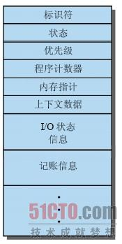

### php

### php 内置缓存

#### 1. ob缓存

```php
ob_start();            // 打开一个输出缓冲区，所有的输出信息不再直接发送到浏览器，而是保存在输出缓冲区里面。
 
ob_clean();            // 删除内部缓冲区的内容，不关闭缓冲区(不输出)。
ob_end_clean();        // 删除内部缓冲区的内容，关闭缓冲区(不输出)。
ob_get_clean();        // 返回内部缓冲区的内容，关闭缓冲区。相当于执行 ob_get_contents() and ob_end_clean()
ob_flush();            // 发送内部缓冲区的内容到浏览器，删除缓冲区的内容，不关闭缓冲区。
ob_end_flush();        // 发送内部缓冲区的内容到浏览器，删除缓冲区的内容，关闭缓冲区。
ob_get_flush();        // 返回内部缓冲区的内容，并关闭缓冲区，再释放缓冲区的内容。相当于ob_end_flush()并返回缓冲区内容。
flush();               // 将ob_flush释放出来的内容，以及不在PHP缓冲区中的内容，全部输出至浏览器；刷新内部缓冲区的内容，并输出。
 
ob_get_contents();     // 返回缓冲区的内容，不输出。
ob_get_length();       // 返回内部缓冲区的长度，如果缓冲区未被激活，该函数返回FALSE。
ob_get_level();        // 返回输出缓冲机制的嵌套级别
ob_get_status();       // 得到所有输出缓冲区的状态
 
ob_implicit_flush();   // 打开或关闭绝对刷新，默认为关闭，打开后ob_implicit_flush(true)，所谓绝对刷新，即当有输出语句(e.g: echo)被执行时，便把输出直接发送到浏览器，而不再需要调用flush()或等到脚本结束时才输出。
 
ob_gzhandler               // ob_start回调函数，用gzip压缩缓冲区的内容。
ob_list_handlers           // List all output handlers in use
output_add_rewrite_var     // 添加URL重写器的值
output_reset_rewrite_vars  // 重设URL重写器的值
 
// 这些函数的行为受php_ini设置的影响：
output_buffering       // 该值为ON时，将在所有脚本中使用输出控制；若该值为一个数字，则代表缓冲区的最大字节限制，当缓存内容达到该上限时将会自动向浏览器输出当前的缓冲区里的内容。
output_handler         // 该选项可将脚本所有的输出，重定向到一个函数。例如，将 output_handler 设置为 mb_output_handler() 时，字符的编码将被修改为指定的编码。设置的任何处理函数，将自动的处理输出缓冲。
implicit_flush         // 作用同ob_implicit_flush，默认为Off。
```

#### php.ini 中 ob参数影响

```php.ini
output_buffering = 4096 # 缓冲区大小, 默认是 4096 表示 4096 字节也就是 4kB。
```

实例: PHP实现自动化缓存的功能，只需要直接把这个php文件引入到需要缓存的页面即可**实现get请求的页面缓存**

```php
/* 
【PHP实现页面缓存处理】 
auto_cache.php 实现智能的自动缓存。
在需要实现缓存功能的页面 require('auto_cache.php');即可;
存放缓存的根目录,最好是放到/tmp目录,尤其是虚拟主机用户,因为/tmp目录不占自己的主页空间啊

ob_start() 开始输出缓冲, 这时PHP停止输出, 在这以后的输出都被转到一个内部的缓冲里. 
ob_get_contents() 这个函数返回内部缓冲的内容. 这就等于把这些输出都变成了字符串. 
ob_get_ length() 返回内部缓冲的长度. 
ob_end_flush() 结束输出缓冲, 并输出缓冲里的内容. 在这以后的输出都是正常输出. 
ob_end_clean() 结束输出缓冲, 并扔掉缓冲里的内容. 
*/ 

define('CACHE_ROOT', dirname(__FILE__).'/cache'); 
define('CACHE_LIFE', 86400); //缓存文件的生命期，单位秒，86400秒是一天 
define('CACHE_SUFFIX','.html'); //缓存文件的扩展名，千万别用 .php .asp .jsp .pl 等等

$file_name = md5($_SERVER['REQUEST_URI']).CACHE_SUFFIX; //缓存文件名

//$file_name = $_SERVER['REQUEST_URI'].CACHE_SUFFIX; //缓存文件名

echo("<script>console.log('".$file_name."');</script>");

//缓存目录，根据md5的前两位把缓存文件分散开。避免文件过多。如果有必要，可以用第三四位为名，再加一层目录。
//256个目录每个目录1000个文件的话，就是25万个页面。两层目录的话就是65536*1000=六千五百万。
//不要让单个目录多于1000，以免影响性能。

$cache_dir = CACHE_ROOT.'/'.substr($file_name,0,2); 
$cache_file = $cache_dir.'/'.$file_name; //缓存文件存放路径

  if	($_SERVER['REQUEST_METHOD']=='GET'){ //GET方式请求才缓存，POST之后一般都希望看到最新的结果 
      if (file_exists($cache_file) && time() - filemtime($cache_file) < CACHE_LIFE) { //如果缓存文件存在，并且没有过期，就把它读出来。
          $fp = fopen($cache_file,'rb'); 
          fpassthru($fp); 
          fclose($fp); 
          exit(); 
  		} elseif ( !file_exists($cache_dir) ){ 
          if ( !file_exists(CACHE_ROOT) ) { 
              mkdir(CACHE_ROOT,0777); 
              chmod(CACHE_ROOT,0777); 
					} 
  				mkdir($cache_dir,0777); 
  				chmod($cache_dir,0777); 
  		}

      function auto_cache($contents) { //回调函数，当程序结束时自动调用此函数 
          global $cache_file; 
          $fp = fopen($cache_file,'wb'); 
          fwrite($fp,$contents); 
          fclose($fp); 
          chmod($cache_file,0777); 
          clean_old_cache(); //生成新缓存的同时，自动删除所有的老缓存。以节约空间。
          return $contents; 
      }

      function clean_old_cache(){ 
        chdir(CACHE_ROOT); 
        foreach (glob("*/*".CACHE_SUFFIX) as $file){ 
            if ( time()-filemtime($file) > CACHE_LIFE) { 
              unlink($file); 
            } 
        } 
      }

			ob_start('auto_cache'); //回调函数 auto_cache 
	} else{ 
    if(file_exists($cache_file)){ //file_exists() 函数检查文件或目录是否存在。
    		unlink($cache_file); //不是GET的请求就删除缓存文件。
		} 
	} 
```


### 多进程

##### 理论讲解

进程的概念是操作系统的结构的基础。Multics的设计者在20世纪60年代首次使用了这个技术词语,它比作业更通用一些。关于进程的定义，如下所示：

1. 一个正在执行的程序。 
2. 计算机中正在运行的程序的一个实例。 
3. 可以分配给处理器并由处理器执行的一个实体。 
4. 由单一的顺序的执行线程、一个当前状态和一组相关的系统资源所描述的活动单元

也可以把进程当成由一组元素组成的实体，进程的两个基本的元素是`程序代码`（可能被执行相同程序的其他进程共享）和代码相关联的`数据集`。假设处理器开始执行这个程序代码，且我们把这个执行实体叫做叫做`进程`。在进程执行时，任意给定一个时间，进程都可以唯一的被表征为以下元素。

```php
1.标识符：跟这个进程相关的唯一标识符，用来区别其他进程。
2、状态：如果进程正在执行，那么进程处于运行态。
3、优先级：相对于其他进程的优先级
4、内存指针：包括程序代码和进程相关数据的指针，还有和其他进程共享内存块的指针。
5、上下文数据：进程执行时处理器的寄存器中的数据。
6、I/O 状态信息：包括显示的I/O操作。分配给进程的I/O设备（例如磁带驱动器）和被进程使用的文件列表等。
7、记账信息：可能包括处理器时间综合、使用的是时钟数总和、时间限制、记账号等。
```

如下图：



###### 为什么设计了进程？

设计出一个能够协调各种不同活动的系统软件是非常困难的。在任何时刻都有许多作业在运行中,每个作业都包括要求按照顺序执行的很多步骤，因此分析时间的序列组合是不可的。由于缺乏能够在所有活动中进行协调和合作的系统级的方法，程序员只能基于他们对操作系统所控制的环境的理解，采用自己的特殊方法。然而这种方法是很脆弱的，尤其对于一些程序设计中的小错误，因为这些错误只有在很少见的时间序列发生时才会出现。由于需要从应用程序软件错误和硬件错误中区分出这些错误，因而诊断工作是很困难的。及时检测出错误，也很难确定原因，因为很难在线错误产生的精确场景。一般而言，产生这类错误的4个主要原因如下： 

1. 不正确同步 
2. 失败互斥。 
3. 不确定的程序操作 
4. 死锁

解决这些问题需要一种系统级别的方法监控处理器中不同程序的执行。进程的概念为此提供了基础。 

因此进程可以看做是由三部分组成的：

1. 一段可以执行的程序 
2. 程序所需要的相关数据 
3. 程序的执行上下文

###### 了解进程执行上下文

执行上下文是进程的重重之中。`执行上下文(execution context)` 又称作`进程状态（process state）`，是操作系统用来管理和控制进程所需的内部数据。这种内部信息和进程是分开的，因为操作系统信息不允许被进程直接访问。上下文包括操作系统管理进程以及处理器正确执行进程所需要的所有信息。包括了各种处理器寄存器的内容，如程序计数器和数据寄存器。它还包括操作系统使用的信息，如进程优先级以及进程是否在等待特定 *I/O*事件的完成。


图1 两个进程A 和B ,存在于内存中某部分。也就是说给每个进程（包含程序、数据和上下文信息）分配一块存储器区域，并且在由操作系统建立和维护的进程表中进行记录。进程表中包含记录每个进程的表现，表项内容包括指向包含进程的存储块地址的指针，还包括该进程的部分或全部执行上下文。指向上下文的其余部分存放在别处，可能和进程自己保存在一起，通常也可能保存在内存里一块独立的区域中。`进程索引寄存器（process index register）` 包含当前正在控制处理器的进程在进程表中的索引。`程序计数器`指向该进程中下一条待执行的指令。`基址寄存器(base register)` 和`界限寄存器（limit register）` 定义了该进程所占据的存储器区域：`基址寄存器`中保存了该存储器区域的开始地址，`界限寄存器`中保存了该区域的大小（以字节或字为单位）。程序计数器和所有的数据引用相对于`基址寄存器`被解释，并且不能超过`界限寄存器`中的值，这就可以保护内部进程间不会相互干涉。（解决了互斥的问题）

图1`进程索引寄存器`表明进程B正在执行。以前执行的进程被临时中断，在A中断的同时，所有的寄存器的内容被记录在它执行上下文环境中，以后操作系统就可以执行进程切换，恢复进程A的执行。进程切换过程包括保存B的上下文和恢复A的上下文。当在`程序计数器`中载入指向A的程序区域的值时，进程A自动恢复执行。

因此进程被当做数据结构来实现。一个进程可以是正在执行，也可是等待执行。任何时候整个进程状态都包含在它的执行上下文环境中。这个结构使得可以开发功能强大的技术，以确保在进程中进行协调和合作。在操作系统中可能会设计和并入一些新的功能（优先级，linux中nice值。）这可以通过扩展上下文环境以包括支持这些特征的新信息。

###### 两状态进程模型

操作系统的基本职责是控制进程的执行。这包括确定交替执行的方式和给进程分配资源在设计控制进程的程序时，第一步就是描述进程所表现出的行为。

由前面的基础知识介绍可知，在任何时刻，一个进程要么正在执行，要么没有执行，因而可以构造最简单的模型。一个进程可以处于以下两种状态之一：运行态或未运行态。当操作系统创建一个新的进程时，它将该进程运行态加入到系统中，操作系统知道这个进程是存在的，并且正在等待执行机会。当前正在运行的进程时不时的被中断，操作系统中的`分派器`部分将选择一个新进程运行。前一个进程从运行态转换到未运行状态，另外一个集成转换到运行态。`如下图.`

从这个简单的模型可以意识到操作系统的一些设计元素。必须用某种方式来表示每个进程，使得操作系统能够跟踪它，也就是说，必须有一些与进程相关的信息，包括进程在内存中的当前状态和位置，即`进程控制块`。未运行的进程必须保持在某种类型的队列中，并等待它们的执行时机。结构中有一个队列，队列中的每一项都指向某个特定进程的指针，或队列可以由数据块构成的链表组成，每个数据块表示一个进程。`如下图`

因此可以用该队列图描述`分派器`的行为。被中断的进程转移到等待进程队列中，或者，如果进程已经结束或取消，则被销毁（离开系统）。在任何一种情况下，`分派器`均从队列中选择一个进程来执行。


###### 进程的五状态模型

如果所有的进程都做好了执行准备。队列是`先进先出（first-in-first-out）`的表，对于可运行的进程处理器以一种`轮转(round-robin)`方式操作（依次给队列中的每个进程一定的执行时间，然后进程返回队列，阻塞情况除外）。但是存在着一些非运行状态但已经就绪等待执行的进程，而同时存在另外的一些处于阻塞状态等待*I/O*操作结束的进程。因此，如果使用单个队列，分派器不能只考虑队列中最老的进程，相反，他应该扫描这个列表，查找那些被阻塞且在队列中时间最长的进程。

解决这种情况的一种比较自然的方法是将非运行状态分成两个状态：`就绪(ready)`和`阻塞(blocked)`，此外应该增加两个已经证明很有用的状态。


```php
运行态：该进程正在执行。假设计算机只有一个处理器，因此一次最多只有一个进程处于这个状态。
就绪态：进程做好了准备，只要有机会就开始执行。
阻塞/等待态：进程在某些事件发生前不能执行，如I/O操作完成。
新建态：刚刚创建的进程，操作系统还没有把它加入到可执行进程组中。通常是进程控制块已经创建但还没有加载到内存中的新进程。
退出态：操作系统从可执行进程组中释放出的进程，或者是因为它自身停止了，或者是因为某种原因被取消。
```

`新建态`和`退出态`对进程管理是非常有用的。新建状态对应于刚刚定义的进程。例如，如果一位新用户试图登录到分时系统中，或者一个新的批作业被提交执行，那么操作系统可以分两步定义新进程。首先，操作系统执行一些必需的辅助工作，将标识符关联到进程，分配和创建管理进程所需要的所有表。此时，进程处于新建状态，这意味着操作系统已经执行了创建进程的必需动作，但还没有执行进程。

例如，操作系统可能基于性能或内存局限性的原因，限制系统中的进程数量。当进程处于新建态时，操作系统所需要的关于该进程的信息保存在内存中的进程表中，但进程自身还未进入内存，就是即将执行的程序代码不在内存中，也没有为与这个程序相关的数据分配空间。当进程处于新建态时，程序保留在外存中，通常是磁盘中。

类似地，`进程退出`系统也分为两步。首先，当进程到达一个自然结束点时，由于出现不可恢复的错误而取消时，或当具有相应权限的另一个进程取消该进程时，进程被终止；终止使进程转换到退出态，此时，进程不再被执行了，与作业相关的表和其他信息临时被操作系统保留起来，这给辅助程序或支持程序提供了提取所需信息的时间。一个实用程序为了分析性能和利用率，可能需要提取进程的历史信息，一旦这些程序都提取了所需要的信息，操作系统就不再需要保留任何与该进程相关的数据，该进程将从系统中删除。

###### UNINX的独特进程

UNINX 中有两个独特的进程。进程0是一个特殊的进程，实在系统启动时创建的。实际上，这是预定义的一个数据结构，在启动时被加载，是交换进程。此外，进程0产生进程1，称作初始进程，进程1是系统中的所有其他进程的祖先。当新的交互用户登录到系统是，由进程1为该用户创建一个用户进程。随后，用户进程可以创建子进程，从而构成一棵分支书，因此任何应用程序都是由一组相关进程组成的。

###### 进程控制结构：

一个进程至少包括足够的内存空间，以保存该进程的程序和数据；此外，程序的执行通常涉及用于跟踪过程调用和过程间参数传递的栈。最后，与每个进程相关联的还有操作系统用于控制进程的许多属性，通常： 

==属性的集合称作`进程控制块`。==
==程序、数据、栈、属性的集合称作`进程映像`==
下图经过了我的重新绘制，希望能够比书本上更加易懂。


##### 进程锁实现

###### 为什么需要进程锁？

主要作用就是防止你重复执行同一程序，主要用在crontab中，当你设置了一个定时任务，然后每分钟执行一次，如果不加进程锁的话，之前的进程没有执行完的情况下。每分钟都会有新的进程生成了。加上进程锁之后，每次定时任务执行的时候，就会去判断之 前的进程锁是否存在，如果存在就不执行。 

1.单进程的情况的进程锁实现

```php
$lock_file = dirname(__FILE__) . '/process.lock';
$lock_file_handle = fopen($lock_file, 'w');

if ($lock_file_handle === false) {
    die("can not create lock file {$lock_file}\n");
}

if (!flock($lock_file_handle, LOCK_EX + LOCK_NB)) {
    die(date("Y-m-d H:i:s") . " Process already exists. \n");
}
while(1) {}
```

然后在linux环境下，执行这个代码，第一次会正常运行，然后第二次运行的时候就会提示：Process already exists. 之后无论执行多少次都会出现这个提示表示进程失败了。

上面的代码同样可以利用在你定时计划的脚本里，在开头加上就好了。相当于对单个脚本加上进程锁。 

2.进程锁实现多进程

上面说的是一个锁对应一个php脚本，那要用进程锁实现多进程的话，其实就是让一个进程可以有多个进程锁就好了。 

对上面的代码的进程锁的名字部分稍加改动即可实现，根据传进来的参数来决定进程锁的名字，如果传进来的参数一致则对应同一个锁。

```php
if (!($argc > 1)) {
    $lock_file = dirname（__FILE__） . '/process.lock';
} else {
    unset($argv[0]);
    $lock_file = dirname(__FILE__) . "/process" . implode('.', $argv) . '.lock';
}

$lock_file = dirname(__FILE__) . '/process.lock';
$lock_file_handle = fopen($lock_file, 'w');

if ($lock_file_handle === false) {
    die("can not create lock file {$lock_file}\n");
}

if (!flock($lock_file_handle, LOCK_EX + LOCK_NB)) {
    die(date("Y-m-d H:i:s") . " Process already exists. \n");
}
while(1) {}
```

在linux环境下。进入文件所在目录，执行php process.php 1, 然后新开个窗口，在执行php process.php 1，就会提示Process already exists这个错误，但是如果你执行的是php process.php 2，就会正常运行，同样，你可以传两个参数，如php process.php 1 2，这样的话，对应的又是新的进程锁。这个实现主要用到的是argc和argc和argv 这两个php自带的参数，argc表示参数总数，argv 表示具体调用的时候用的是哪个参数。

3.进程锁在yii2中的实现

在yii2中要实现多进程的进程锁的话，要继承yii的console里的控制器，这样能实现参数的传递，use yii\console\Controller; 
然后在crontab中，命令如下，用yii自带的命令来执行定时脚本。然后进程锁的代码和上面的一样就可以了。

```bash
* * * * * root /user/local/bin/php /data/www/html/new/yii 控制器名/方法 参数 > /dev/null 2>&1
```

##### 孤儿与僵尸进程

###### 孤儿进程

是指父进程在fork出子进程后，自己先完了。这个问题很尴尬，因为子进程从此变得无依无靠、无家可归，变成了孤儿。用术语来表达就是，==父进程在子进程结束之前提前退出==，这些子进程将由init（进程ID为1）进程收养并完成对其各种数据状态的收集。init进程是Linux系统下的奇怪进程，这个进程是以普通用户权限运行但却具备超级权限的进程，简单地说，这个进程在Linux系统启动的时候做初始化工作，比如运行getty、比如会根据/etc/inittab中设置的运行等级初始化系统等等，当然了，还有一个作用就是如上所说的：收养孤儿进程。

在PHP中，父进程对子进程的状态收集等是通过==pcntl_wait()==和==pcntl_waitpid()==等完成的。依然还是要通过代码还演示说明： 演示并说明孤儿进程的出现，并演示孤儿进程被init进程收养：

```php
$pid = pcntl_fork();
if( $pid > 0 ){
    // 显示父进程的进程ID，这个函数可以是getmypid()，也可以用posix_getpid()
    echo "Father PID:".getmypid().PHP_EOL;
    // 让父进程停止两秒钟，在这两秒内，子进程的父进程ID还是这个父进程
    sleep( 2 );
} else if( 0 == $pid ) {
    // 让子进程循环10次，每次睡眠1s，然后每秒钟获取一次子进程的父进程进程ID
    for( $i = 1; $i <= 10; $i++ ){
        sleep( 1 );
        // posix_getppid()函数的作用就是获取当前进程的父进程进程ID
        echo posix_getppid().PHP_EOL;
    }
} else {
    echo "fork error.".PHP_EOL;
}
```


###### 僵尸进程

是指父进程在fork出子进程，而后子进程在结束后，父进程并没有调用wait或者waitpid等完成对其清理善后工作，导致改子进程进程ID、文件描述符等依然保留在系统中，极大浪费了系统资源。所以，僵尸进程是对系统有危害的，而孤儿进程则相对来说没那么严重。在Linux系统中，我们可以通过ps -aux来查看进程，如果有==[Z+]==标记就是僵尸进程。

说明僵尸进程的出现，并演示僵尸进程的危害：

```php
$pid = pcntl_fork();
 if( $pid > 0 ){
     // 下面这个函数可以更改php进程的名称
     cli_set_process_title('php father process');
     // 让主进程休息60秒钟
     sleep(60);
 } else if( 0 == $pid ) {
     cli_set_process_title('php child process');
     // 让子进程休息10秒钟，但是进程结束后，父进程不对子进程做任何处理工作，这样这个子进程就会变成僵尸进程
     sleep(10);
 } else {
     exit('fork error.'.PHP_EOL);
 }
```

==如何避免僵尸进程呢？PHP通过pcntl_wait()和pcntl_waitpid()两个函数来帮我们解决这个问题。==

pcntl_wait()的相关内容：这个函数的作用就是 “ 等待或者返回子进程的状态 ”，当父进程执行了该函数后，就会阻塞挂起等待子进程的状态一直等到子进程已经由于某种原因退出或者终止。换句话说就是如果子进程还没结束，那么父进程就会一直等等等，如果子进程已经结束，那么父进程就会立刻得到子进程状态。这个函数返回退出的子进程的进程ID或者失败返回-1。

案例中代码修改一下：

```php
$pid = pcntl_fork();
if( $pid > 0 ){
    // 下面这个函数可以更改php进程的名称
    cli_set_process_title('php father process');
    // 返回$wait_result，就是子进程的进程号，如果子进程已经是僵尸进程则为0
    // 子进程状态则保存在了$status参数中，可以通过pcntl_wexitstatus()等一系列函数来查看$status的状态信息是什么
    $wait_result = pcntl_wait( $status );
    print_r( $wait_result );
    print_r( $status );
    // 让主进程休息60秒钟
    sleep(60);
} else if( 0 == $pid ) {
    cli_set_process_title('php child process');
    // 让子进程休息10秒钟，但是进程结束后，父进程不对子进程做任何处理工作，这样这个子进程就会变成僵尸进程
    sleep(10);
} else {
    exit('fork error.'.PHP_EOL);
}
```


##### PHP进程实现

php多进程一般应用在php_cli命令行中执行php脚本，做进程任务时要检查php是否开启了pcntl扩展，（pcntl是process control进程管理的缩写）

pcntl_fork — 在当前进程当前位置产生分支（子进程）。

一个fork子进程的基础示例：

```php
$pid = pcntl_fork();
// 父进程和子进程都会执行下面的代码
if ($pid == -1) {
  // 错误处理：创建子进程失败时返回-1
  die('could not fork');
} else if ($pid) {
  // 父进程会得到子进程号，所以这里是父进程执行的逻辑
  pcntl_wait($status); // 等待子进程中断，防止子进程成为僵尸进程
} else {
  // 子进程得到的$pid为0，所以这里是子进程执行的逻辑
}
```

如果一个任务被分解成多个进程执行，就会减少整体的耗时。

比如有一个比较大的数据文件要处理，这个文件由很多行组成。如果单进程执行要处理的任务，量很大时要耗时比较久。这时可以考虑多进程。

例如：

有一个1000万个元素的int数组，需要求和，平均分到4个进程处理，每个进程处理一部分，再将结果统计出来，代码如下

```php
$arrInt = [0,1,2,3,4,5,6,7,8,9,10,11,12,13,14,15]; // 假设很多
$arrInt = array_chunk($arrInt, 4, true); // 把数组分为每4个一组
for ($i = 0; $i < 4; $i++) {
  $pid = pcntl_fork();
  if ($pid == -1) {
    die('could not fork');
  } else if ($pid) {
    echo $pid;
    echo "I'm the parent$i\n";
  } else {
    // 子进程处理
    $content = file_get_contents('prefix_name' . $i);
    $pSum = array_sum($arrInt[$i]);
    echo $pSum . "\n"; // 分别输出子进程的部分求和数字，但是无法进行相加，因为进程互相独立
    exit; // 一定要注意退出子进程，否则pcntl_fork()会被子进程再fork,带来处理上的影响
  }
}

// 等待子进程执行结束
while (pcntl_waitpid(0, $status) != -1) {
  $status = pcntl_wexitstatus($Status);
  echo "child $status completed\n";
}
```

上诉答案中，是把数组分为4个子数组分别用4个子进程去处理了，但是没有办法把所计算的结果相加，因为进程都是独立完成任务的，没有办法共享同一个（内存）变量，下面将引进消息队列来解决进程通信的问题

```php
global $msgQueue;
const MSG_TYPE = 1;
$arrInt = [0,1,2,3,4,5,6,7,8,9,10,11,12,13,14,15];
$arrInt = array_chunk($arrInt, 4, true); // 把数组分为4个

// 创建消息队列，以及定义消息类型(类似于数据库中的库)
$id = ftok(__FILE__, 'm'); // 生成文件key,唯一
$msgQueue = msg_get_queue($id);

// 给消息队列一个默认值0，必须是字符串类型
msg_send($msgQueue, MSG_TYPE, '0');

// fork出四个子进程
for ($i = 0; $i < 4; $i++) {
  $pid = pcntl_fork();
  if ($pid == -1) {
    die('could not fork');
  } else if ($pid) {
    echo $pid;
    echo "I'm the parent$i\n";
  } else {
    // 子进程处理逻辑，相互独立，解决办法，放到内存消息队列中
    $part = array_sum($arrint[$i]);
    implode_sum($part); // 合成计算出的sum
    exit; // 一定要注意退出子进程，否则pcntl_fork()会被子进程再fork,带来处理上的影响
  }
}

function implode_sum($part) {
  msg_receive($msgQueue,MSG_TYPE, 1024, $sum); // 获取消息队列中的值，最后一个参数为队列中中的值
  $sum = intval($sum) + $part;
  msg_send($msgQueue, MSG_TYPE, $sum); // 发送每次计算的结果给消息队列
}

// 等待子进程执行结束
while (pcntl_waitpid(0, $status) != -1) {
  $status = pcntl_wexitstatus($status);
  $pid = posix_getpid();
  echo "child $status completed\n";
}

// 所有子进程结束后，再取出最后在队列中的值，就是int数组的和
msg_receive($msgQueue, MSG_TYPE, $msgType, 1024, $sum);
echo $sum; // 输出120
```

### 多线程

线程(thread) 是操作系统能够进行运算调度的最小单位。它被包含在进程之中，是进程中的实际运作单位。一条线程指的是进程中一个单一顺序的控制流，一个进程中可以并发多个线程，每条线程并行执行不同的任务.

使用多线程主要是因为它在执行效率上有很大优势。由于==线程是操作系统能够进行调度的最小单位==：

- 一个多线程程序比单线程程序被操作系统调度的概率更大，所以多线程程序一般会比单线程程序更高效；
- 多线程程序的多个线程可以在多核 CPU 的多个核心同时运行，可以将完全发挥机器多核的优势；

同时对比多进程程序，多线程有以下特点：

- 线程的创建和切换的系统开销都比进程要小，所以一定程度上会比多进程更高效；
- 0线程天生的共享内存空间，线程间的通信更简单，避免了进程IPC引入新的复杂度。

适用场景

是否使用多线程还需要根据具体需求而定，一般考虑以下两种情况：

- I/O 阻塞会使操作系统发生任务调度，阻塞当前任务，所以代码中 I/O 多的情况下，使用多线程时可以将代码并行。例如多次读整块的文件，或请求多个网络资源。
- 多线程能充分利用 CPU，所以有多处大计算量代码时，也可以使用多线程使他们并行执行，

##### PHP中的多线程

PHP 默认并不支持多线程，要使用多线程需要安装 pthread 扩展，而要安装 pthread 扩展，必须使用 ==--enable-maintainer-zts== 参数重新编译 PHP，这个参数是指定编译 PHP 时使用线程安全方式。

线程安全

多线程是让程序变得不安分的一个因素，在使用多线程之前，首先要考虑线程安全问题：

线程安全：==线程安全是编程中的术语，指某个函数、函数库在多线程环境中被调用时，能够正确地处理多个线程之间的共享变量，使程序功能正确完成。==

在传统多线程中，由于多个线程共享变量，所以可能会导致出现如下问题：

1. 存在一个全局数组`$arr = array('a');`;
2. A 线程获取数组长度为1;
3. B 线程获取数组长度为1;
4. A 线程 pop 出数组元素 `$a = array_pop($arr); $a = 'a';`;
5. B 线程也 pop 数组元素 `$b = array_pop($arr); $b = null;`;
6. 此时 B 线程内就出现了灵异事件，明明数组长度大于0，或没有 pop 出东西;

PHP 实现

PHP 实现的线程安全主要是使用 `TSRM` 机制对 ==全局变量和静态变量进行了隔离==，将全局变量和静态变量 给每个线程都复制了一份，各线程使用的都是主线程的一个备份，从而避免了变量冲突，也就不会出现线程安全问题。

PHP 对多线程的封装保证了线程安全，程序员不用考虑对全局变量加各种锁来避免读写冲突了，同时也减少了出错的机会，写出的代码更加安全。

但由此导致的是，子线程一旦开始运行，主线程便无法再对子线程运行细节进行调整了，线程一定程度上失去了线程之间通过全局变量进行消息传递的能力。

同时 PHP 开启线程安全选项后，使用 `TSRM` 机制分配和使用变量时也会有额外的损耗，所以在不需要多线程的 PHP 环境中，使用 PHP 的 ZTS （非线程安全） 版本就好。

类和方法

PHP 将线程 封装成了 ==Thread== 类，线程的创建通过实例化一个线程对象来实现，由于类的封装性，变量的使用只能通过构造函数传入，而线程运算结果也需要通过类变量传出。

下面介绍几个常用的 Thread 类方法：

- ==run()==：此方法是一个抽象方法，每个线程都要实现此方法，线程开始运行后，此方法中的代码会自动执行；
- ==start()==：在主线程内调用此方法以开始运行一个线程；
- ==join()==：各个线程相对于主线程都是异步执行，调用此方法会等待线程执行结束；
- ==kill()==：强制线程结束；
- ==isRunning()==：返回线程的运行状态，线程正在执行`run()`方法的代码时会返回 true；

因为线程安全的实现，PHP 的多线程开始运行后，无法再通过共享内存空间通信，线程也无法通过线程间通信复用，所以我认为 PHP 的“线程池”并没有什么意义。扩展内自带的`Pool` 类是一个对多线程分配管理的类。

##### 实例代码

下面是一个线程类，用来请求某一接口。接下来根据它写两个多线程的应用实例：

```php
class Request extends Thread {
    public $url;
    public $response;
    public function __construct($url) {
        $this->url = $url;
    }
    
    public function run() {
        $this->response = file_get_contents($this->url);
    }
}
```

##### 异步请求

下面是一个线程类，用来请求某一接口。接下来根据它写两个多线程的应用实例：

```php
$chG = new Request("www.google.com");
$chB = new Request("www.baidu.com");
$chG ->start();
$chB ->start();
$chG->join();
$chB->join();

$gl = $chG->response;
$bd = $chB->response;
```

##### 超时控制

我们在使用 curl 请求某个地址时，可以通过 `CURLOPT_CONNECTTIMEOUT / CURLOPT_TIMEOUT` 参数分别设置 curl 的连接超时时间和读取数据超时时间，但总的超时时间不好控制。而且在进行数据库查询时的超时时间无法设置.

这时我们便可以借用多线程来实现此功能：在执行线程类的 `start()` 方法后，==不调用 `join()` 方法，使线程一直处于异步状态，不阻塞主线程的执行。==

```php
$chG = new Request("www.google.com");
$chB = new Request("www.baidu.com");
$chG->start();
$chB->start();
$chB->join();
// 此处不对chG执行join方法

sleep(1); // sleep一个能接受的超时时间
$gl = $chG->response;
$bd = $chB->response;
$bd->kill();
if (!$gl) {
    $gl = ""; // 处理异常，或在线程类内给$gl一个默认值
}
```

#####         线程测试代码：

```php
class computer extends Thread {
 
    public $id;
    public $runing = false;
    public $params = null;
 
    public function __construct($id) {
        $this->id     = $id;
        $this->runing = true;
    }
 
    public function run() {
        while ($this->runing) {
            if (is_null($this->params)) {
                echo "线程({$this->id})等待任务...\n";
            } else {
                echo "线程({$this->id}) 收到任务参数::{$this->params}.\n";
                $this->params = null;
            }
            sleep(1);
        }
    }
 
}
```

 代码很简单，用running标记线程是否在运行，params标记外界传递的参数，如果外界传递参数过来则可以运行。                                                                                                                                                                                                                                                                                                                                                                                                   

```php
//这里创建线程池.
$pool = array(new computer('a'), new computer('b'), new computer('c'));
 
//启动所有线程,使其处于工作状态
foreach ($pool as $w) {
    $w->start();
}
 
//派发任务给线程
for ($i = 0; $i < 10; $i++) {
    $params = rand(10, 99);
    while (true) {
        foreach ($pool as $worker) {
            //参数为空则说明线程空闲
            if (is_null($worker->params)) {
                $worker->params = $params;
                echo "({$worker->id})线程空闲,放入参数{$params}.\n";
                break 2;
            }
        }
        sleep(1);
    }
}
 
//关闭线程
while (count($pool)) {
    //遍历检查线程组运行结束
    foreach ($pool as $key => $worker) {
        if ($worker->params == '') {
            echo "({$worker->id})线程运行完成,退出.\n";
            //设置结束标志
            $worker->runing = false;
            unset($pool[$key]);
        }
    }
    echo "等待退出中...\n";
    sleep(1);
}
 
echo "退出成功\n";
```

运行结果：

```bash
$ php thread.php
线程(a)等待任务...
线程(b)等待任务...
线程(c)等待任务...
(a)线程空闲,放入参数21.
(b)线程空闲,放入参数97.
(c)线程空闲,放入参数54.
线程(a) 收到任务参数::21.
线程(b) 收到任务参数::97.
线程(c) 收到任务参数::54.
(a)线程空闲,放入参数68.
(b)线程空闲,放入参数71.
(c)线程空闲,放入参数58.
线程(a) 收到任务参数::68.
线程(b) 收到任务参数::71.
线程(c) 收到任务参数::58.
(a)线程空闲,放入参数79.
(b)线程空闲,放入参数20.
(c)线程空闲,放入参数18.
线程(a) 收到任务参数::79.
线程(b) 收到任务参数::20.
线程(c) 收到任务参数::18.
(a)线程空闲,放入参数76.
(b)线程运行完成,退出.
(c)线程运行完成,退出.
线程(a) 收到任务参数::76.
等待退出中...
线程(a)等待任务...
(a)线程运行完成,退出.
等待退出中...
退出成功
```


### php7异常与错误处理和自定义异常

#### 什么叫做异常？

异常是指程序运行中不符合预期情况以及与正常流程不同的状况。

比如你链接数据库，在参数都写上去的条件下，发现链接不上去，这就属于不符合预期

可以被 try-catch 捕捉得到

##### 异常处理

在以前的 php5.X 中 并且不能被 try-catch 捕捉得到，到了 php 7.x 中，定义了一个 Throwable 接口 并使得大部分的 Error 和
Exception 实现了该接口，我们得以在 try-catch 中抛出该错误

所以说以后想要捕获异常，而你又不知道此异常是 Error 还是 Exception 的话，可以向这样抛出

```php
try{
    ……
}catch(Throwable $e){
    ……
}

```


#### 什么叫做错误？

是属于php程序自身的问题，一般是由非法的语法，环境问题导致的，使得编译器无法通过检查，甚至无法运行的情况。
平时遇到的 warming、notice都是错误，只是级别不同而已。

例如：

- TypeError（类型错误） 我规定的函数参数类型和传入的参数不一致
- ArithmeticError （算数错误）
- ParseError （解析错误）在调入的文件中，include "demo.php"，或者 eval();中有语法错误造成解析失败
- AssertionError（断言错误）当assert生效时产生该错误
- DivisionByZeroError （分母为零） 运算过程中例如除法，分母为0

除了这几种情况，其余全部为异常

##### 错误的级别

在 php 中的错误也是有级别的

```
Parse error` >`Fatal Error` > `Waning` > `Notice` > `Deprecated

Deprecated 最低级别的错误(不推荐，不建议)
使用一些过期函数的时候会出现，程序继续执行

Notice 通知级别的错误
使用一些未定义变量、常量或者数组key没有加引号的时候会出现，程序继续执行
        E_NOTICE      // 运行时通知。表示脚本遇到可能会表现为错误的情况.
        E_USER_NOTICE // 用户产生的通知信息。
        
Waning 警告级别的错误
程序出问题了，需要修改代码！！！程序继续执行
        E_WARNING         // 运行时警告 (非致命错误)。
        E_CORE_WARNING    // PHP初始化启动过程中发生的警告 (非致命错误) 。
        E_COMPILE_WARNING // 编译警告
        E_USER_WARNING    // 用户产生的警告信息
        
Fatal Error 错误级别的错误
程序直接报错，需要修改代码！！！中断程序执行，可使用register_shutdown_function()函数在程序终止前触发一个函数
        E_ERROR         // 致命的运行错误，错误无法恢复，暂停执行脚本
        E_CORE_ERROR    // PHP启动时初始化过程中的致命错误
        E_COMPILE_ERROR // 编译时致命性错，就像由Zend脚本引擎生成了一个E_ERROR
        E_USER_ERROR    // 自定义错误消息。像用PHP函数trigger_error（错误类型设置为：E_USER_ERROR）
        
Parse error 语法解析错误
语法检查阶段报错，需要修改代码！！！中断程序执行，除了修改ini文件，将错误信息写到日志中，什么也做不了
        E_PARSE  //编译时的语法解析错误
```


#### 自定义错误处理程序

php 给我们提供了三个函数来帮助我们来处理，分别是

==set_error_handler()==

- 函数来托管错误处理程序，可自行定制错误的处理流程。
- 如果此函数之前的代码发生错误，那么不会调用我们自定义的处理函数，因为还未注册
- 设置此函数后 error_reporting() 将会失效
- 以下级别的错误不能由用户定义的函数来处理： E_ERROR、 E_PARSE、 E_CORE_ERROR、 E_CORE_WARNING、 E_COMPILE_ERROR、 E_COMPILE_WARNING 该函数只能捕捉我们的 部分 Warning 和 Note 级别的错误


==set_exception_handler()==

- 用于没有被捕获的异常处理


==register_shutdown_function()==

- 作用：注册一个会在php中止时执行的函数
- 捕获PHP的错误：Fatal Error、Parse Error等，这个方法是PHP脚本执行结束前最后一个调用的函数，比如脚本错误、die()、exit、异常、正常结束都会调用，
- 如果拿来用错误处理的时候，需要配合`error_get_last()` 它能获取最后发生的错误。

```php
// 举例:
register_shutdown_function('shutdown');

function shutdown()
{
    if ($error = error_get_last()) {
        var_dump($error);
    }
}
$name   //没写 ; 号

// Parse error: syntax error, unexpected ';' in /app/swoole/errorDemo.php on line 34
```


#### 框架的错误处理

在框架中，其代码是通过一个入口文件来加载的。而我们php检测语法错误的时候，只检查我们的 index.php 有没有错误， require 文件中的代码是不会受到检测的。在`Index.php` 文件中通常会定义一些错误异常的处理。当我们代码出错时，那是在 run-time 中检测的错误，我们的框架可以根据我们编写的错误异常自行做出处理。

下面我们举个例子 在 ThinkPHP5中的异常处理

```php
// [ 应用入口文件 ]  index.php
namespace think;

// 加载基础文件
require __DIR__ . '/../thinkphp/base.php';

// 支持事先使用静态方法设置Request对象和Config对象

// 执行应用并响应
Container::get('app')->run()->send();
```

在我们的入口文件中，加载了 `base.php` 在这个文件中，TP 定义了自己的异常处理

```php
// 载入Loader类
require __DIR__ . '/library/think/Loader.php';

// 注册自动加载
Loader::register();

// 注册错误和异常处理机制
Error::register();

// 实现日志接口
if (interface_exists('Psr\Log\LoggerInterface')) {
   //doSomething
}

// 注册类库别名
Loader::addClassAlias([
   //doSomething
]);
/**
     * 注册异常处理
     * @access public
     * @return void
     */
    public static function register()
    {
        error_reporting(E_ALL);
        set_error_handler([__CLASS__, 'appError']);
        set_exception_handler([__CLASS__, 'appException']);
        register_shutdown_function([__CLASS__, 'appShutdown']);
    }
```


### PHP类自动加载

==spl_autoload_register()==

spl_autoload_register()相对于__autoload()的好处是它可以去注册一个__autoload()，并且实现并维护了一个__autoload()队列。原来在一个文件中只能有一个__autoload()方法，但现在，你拥有的是一个队列。

这样，你就不需要将所有加载代码都写在一个__autoload()方法中，而是可以使用多个spl_autoload_register()去单独进行每个类的加载处理。

```php
spl_autoload_register(function($name){
    include __DIR__ . '/autoload/' . $name . '.class.php';
});

$autoA = new AutoA();
var_dump($autoA);
```


### php7新特性

#### 1. 标量类型声明

```php
<?php

function arraysSum(array ...$arrays): array
{
    return array_map(function(array $array): int {
        return array_sum($array);
    }, $arrays);
}

print_r(arraysSum([1,2,3], [4,5,6], [7,8,9]));

/**
Array
(
    [0] => 6
    [1] => 15
    [2] => 24
)
*/
```

#### 2. null合并运算符

```php
# null合并运算符 (??) 这个语法糖。如果变量存在且值不为null， 它就会返回自身的值，否则返回它的第二个操作数。
$username = $_GET['user'] ?? 'nobody';
```

#### 3. 太空舱操作符

```php
# 当$a小于、等于或大于$b时它分别返回-1、0或1。
// 整数
echo 1 <=> 1; // 0
echo 1 <=> 2; // -1
echo 2 <=> 1; // 1
```

#### 4. 通过 define() 定义常量数组

```php
<?php
define('ANIMALS', [
    'dog',
    'cat',
    'bird'
]);

echo ANIMALS[1]; // 输出 "cat"
?>
```

#### 5. 匿名类

通过`new class` 来实例化一个匿名类，这可以用来替代一些“用后即焚”的完整类定义。

```php
$app = new Application;
$app->setLogger(new class implements Logger {
    public function log(string $msg) {
        echo $msg;
    }
});
```

#### 6.  namespace 导入的类、函数和常量现在可以通过单个 use语句 一次性导入了。

```php
use some\namespace\{ClassA, ClassB, ClassC as C};
```

#### 7. 生成器可以返回表达式

```php
$gen = (function() {
    yield 1;
    yield 2;

    return 3;
})();

foreach ($gen as $val) {
    echo $val, PHP_EOL;
}

echo $gen->getReturn(), PHP_EOL;
// 结果
1
2
3
```

#### 8. 整数除法函数intdiv()

```php
var_dump(intdiv(10, 3)); // int(3)
```

#### 9. 可为空(Nullable)类型

参数以及返回值的类型现在可以通过在类型前加上一个==问号==使之允许为空。 当启用这个特性时，传入的参数或者函数返回的结果要么是给定的类型，要么是 null 。

```php
function testReturn(): ?string
{
    return 'elePHPant';
}

function testReturn(): ?string
{
    return null;
}
```

#### 10. void 函数

回值声明为 void 类型的方法要么干脆省去 return 语句，要么使用一个空的 return 语句。 对于 void 函数来说，**`null`** 不是一个合法的返回值。

```php
function swap(&$left, &$right) : void
{
    if ($left === $right) {
        return;
    }

    $tmp = $left;
    $left = $right;
    $right = $tmp;
}

$a = 1;
$b = 2;
var_dump(swap($a, $b), $a, $b);
// 结果
null
int(2)
int(1)
```

试图去获取一个 void 方法的返回值会得到 **`null`** ，并且不会产生任何警告。这么做的原因是不想影响更高层次的方法。

#### 11. 类常量可见性

```php
class ConstDemo
{
    const PUBLIC_CONST_A = 1;
    public const PUBLIC_CONST_B = 2;
    protected const PROTECTED_CONST = 3;
    private const PRIVATE_CONST = 4;
}
```

#### 12. 多异常捕获处理

一个catch语句块现在可以通过管道字符(`|`)来实现多个异常的捕获。 这对于需要同时处理来自不同类的不同异常时很有用。

```php
try {
    // some code
} catch (FirstException | SecondException $e) {
    // handle first and second exceptions
}
```

#### 13. list()现在支持键名

```php
$data = [
    ["id" => 1, "name" => 'Tom'],
    ["id" => 2, "name" => 'Fred'],
];

// list() style
list("id" => $id1, "name" => $name1) = $data[0];
```

#### 14. 异步信号处理

一个新的名为==pcntl_async_signals()==的方法现在被引入， 用于启用无需 ticks （这会带来很多额外的开销）的异步信号处理。

```php
pcntl_async_signals(true); // turn on async signals

pcntl_signal(SIGHUP,  function($sig) {
    echo "SIGHUP\n";
});

posix_kill(posix_getpid(), SIGHUP); 
// 结果： SIGHUP

```

#### 15. 属性添加限定类型

```php
# 下面的例子中，会强制要求 $user->id 只能为 int 类型，同时 $user->name 只能为 string 类型。
class User {
    public int $id;
    public string $name;
}
```

#### 16. 箭头函数

```php
$factor = 10;
$nums = array_map(fn($n) => $n * $factor, [1, 2, 3, 4]);
// $nums = array(10, 20, 30, 40);
```

#### 17. 空合并运算符赋值

```php
$array['key'] ??= computeDefault();
// 等同于以下旧写法
if (!isset($array['key'])) {
    $array['key'] = computeDefault();
}
```

#### 18. 数组展开操作

```php
$parts = ['apple', 'pear'];
$fruits = ['banana', 'orange', ...$parts, 'watermelon'];
// ['banana', 'orange', 'apple', 'pear', 'watermelon'];
```

#### 19. 数值文字分隔符

```php
6.674_083e-11; // float
299_792_458;   // decimal
0xCAFE_F00D;   // hexadecimal
0b0101_1111;   // binary
```

#### 20. 允许从 __toString() 抛出异常

现在允许从 ==__toString()==抛出异常。之前的版本，将会导致一个致命错误。新版本中，之前发生致命错误的代码，已经被转换为 Error 异常。

### php8 新特性

#### 1. 命名参数

==命名参数允许根据参数名而不是参数位置向函数传参==。这使得参数的含义自成体系，参数与顺序无关，并允许任意跳过默认值。

命名参数通过在参数名前加上冒号来传递。允许使用保留关键字作为参数名。参数名必须是一个标识符，不允许动态指定。

```php
myFunction(paramName: $value);
array_foobar(array: $value);

// NOT supported.
function_name($variableStoringParamName: $value);

// 使用顺序传递参数：
array_fill(0, 100, 50);

// 使用命名参数：
array_fill(start_index: 0, count: 100, value: 50);

array_fill(value: 50, count: 100, start_index: 0);
```

#### 2. 构造器属性提升

构造器的参数也可以相应提升为类的属性。

```php
class Point {
    protected int $x;
    protected int $y;

    public function __construct(int $x, int $y = 0) {
        $this->x = $x;
        $this->y = $y;
    }
}

// 等同于上面的例子
class Point {
    public function __construct(protected int $x, protected int $y = 0) {
    }
}
```

#### 3. 联合类型

联合类型接受多个不同的类型做为参数。声明联合类型的语法为 `T1|T2|...`。

#### 4. match表达式

```php
# match, 这个关键字的作用跟switch有点类似。
# switch
switch ($input) {
    case "true":
        $result = 1;
    break;
    case "false":
        $result = 0;
    break;
    case "null":
        $result = NULL;
    break;
}

# match 等同于上面
$result = match($input) {
        "true" => 1,
        "false" => 0,
        "null" => NULL,
};

# 并且，类似switch的多个case一个block一样，match的多个条件也可以写在一起，比如:
$result = match($input) {
    "true", "on" => 1,
    "false", "off" => 0,
    "null", "empty", "NaN" => NULL,
};

# 需要注意的和switch不太一样的是，以前我们用switch可能会经常遇到这种诡异的问题:
$input = "2 person";
switch ($input) {
    case 2:
        echo "bad";
    break;
}
# 你会发现，bad竟然被输出了，这是因为switch使用了宽松比较(==)。match就不会有这个问题了, 它使用的是严格比较(===)，就是值和类型都要完全相等。

# 还有就是，当input并不能被match中的所有条件满足的时候，match会抛出一个UnhandledMatchError exception:
$input = "false";
$result = match($input) {
        "true" => 1,
};
// 结果
Fatal error: Uncaught UnhandledMatchError: Unhandled match value of type string
```

#### 5. Nullsafe方法和属性

属性和方法可以通过 "nullsafe" 操作符访问：==?->==

此操作的结果，类似于在每次访问前使用 is_null() 函数判断方法和属性是否存在，但更加简洁。

```php
// 自 PHP 8.0.0 起可用
$result = $repository?->getUser(5)?->name;

// 上边那行代码等价于以下代码
if (is_null($repository)) {
    $result = null;
} else {
    $user = $repository->getUser(5);
    if (is_null($user)) {
        $result = null;
    } else {
        $result = $user->name;
    }
}
```


### 问题

#### 1. php array 底层原理？

array底层基于散列表实现

#### 2. 获取HTTP头文件？

```php
// 获取全部（客户端）HTTP请求头信息
   #1 array apache_request_headers(void)
   #2：通过$_SERVER获取，每个http请求头信息都以"HTTP_"开头，
//	在$_SERVER键中获取if_modified_since的请求信息
	$_SERVER['HTTP_IF_MODIFIED_SINCE']
   # url 请求的服务器的URL地址 
   # format 0:返回的头部信息以索引数字形式，1:返回头部信息以关联数组形式
   $head_arr = get_headers("https://www.baidu.com");　　
   $head_arr_index = get_headers("https://www.baidu.com",1);
```

#### 3. cookie会话攻击防护?

什么样的Cookie信息可以被攻击者利用
    1. Cookie中包含了不应该让除开发者之外的其他人看到的其他信息，如USERID=1000
       USERSTATUS=ONLINE，ACCOUNT_ID=xxx等等这些信息。
       2. Cookie信息进行了加密，但是很容易被攻击者进行解密
       3. 在对Cookie信息的时候没有进行输入验证
       如何防范利用Cookie进行的攻击
       1. 不要在Cookie中保存敏感信息
       2. 不要在Cookie中保存没有经过加密的或者容易被解密的敏感信息
       3. 对从客户端取得的Cookie信息进行严格校验
       4. 记录非法的Cookie信息进行分析，并根据这些信息对系统进行改进。
       5. 使用SSL/TLS来传递Cookie信息
       cookie和session的区别：
       1）cookie数据存放在客户的浏览器上，session数据放在服务器上。
       2）cookie不是很安全，别人可以分析存放在本地的COOKIE并进行COOKIE欺骗考虑到安全应当使用session
       3）session会在一定时间内保存在服务器上。当访问增多，会比较占用你服务器的性能考虑到减轻服务器性能方面，应当使用COOKIE。
       4）单个cookie保存的数据不能超过4K，很多浏览器都限制一个站点最多保存20个cookie

#### 4. PHP扩展文件安装过程？

```bash
# phpize安装
#下载libevent扩展文件压缩包（在当前系统哪个目录下载随意）
	~# wget http://pecl.php.net/get/libevent-0.1.0.tgz
	# 解压文件
	~# tar -zxvf libevent-0.1.0.tgz
	# 进入源码目录
	~# cd libevent-0.1.0/
	# 如 /usr/local/php7/bin/phpize //运行phpize命令，写全phpize的路径
	~# ./configure --with-php-config=/usr/local/php/bin/php-config
	# 运行configure命令，配置时 要将php-config的路径附上
	~# make
	~# make test
	~# sudo make install
	# 修改php.ini，结尾加入：extension=libevent.so
	# 重启对应的php-fpm
```

#### 5. 一个客户端http请求从服务器server到nginx到php响应返回整个流程？

HTTP 事务执行过程 
	客户端（浏览器）做出请求操作（输入网址、点击链接、提交表单）。
	客户端对域名进行解析，向设定的 DNS 服务器请求 IP 地址。
	客户端根据 DNS 服务器返回 IP 地址采用三次握手与服务端建立 TCP/IP 连接。
	TCP/IP 连接成功后，客户端向服务端发送 HTTP 请求。
	服务端的 Web Server 会判断 HTTP 请求的资源类型，进行内容分发处理；如果请求的资源为 PHP 文件，服务端软件会启动对应的 CGI 程序进行处理，并返回处理结果。
	服务端将 Web Server 的处理结果响应给客户端
	客户端接收服务端的响应，并渲染处理结果，如果响应内容需要请求其他静态资源，通过 CDN 加速访问所需资源。
	客户端将渲染好的视图呈现出来并断开 TCP/IP 连接

#### 6. CGI、FastCGI、PHP-CGI和PHP-FPM原理区别？

CGI：是公共网关接口 Web Server 与 Web Application 之间数据交换的一种协议。
FastCGI：FastCGI就像是一个常驻（long-live）型的CGI程序，它可以一直运行着。同 CGI，是一种通信协议，但比 CGI 在效率上做了一些优化。同样，SCGI 协议与 FastCGI 类似。
PHP-CGI：是 PHP （Web Application）对 Web Server 提供的 CGI 协议的接口程序。
PHP-FPM：是 PHP（Web Application）对 Web Server 提供的 FastCGI 协议的接口程序，额外还提供了相对智能一些任务管理。

#### 7. 爬虫模拟登陆，如何跳过验证码？

1. 爬取网站时经常会遇到需要登录的问题，这是就需要用到模拟登录的相关方法。python提供了强大的url库，想做到这个并不难。

2. 首先得明白cookie的作用，cookie是某些网站为了辨别用户身份、进行session跟踪而储存在用户本地终端上的数据。因此我们需要用Cookielib模块来保持网站的cookie。
3. 这个是要登陆的地址 1 和验证码地址 2
4. 可以发现这个验证码是动态更新的每次打开都不一样，一般这种验证码和cookie是同步的。其次想识别验证码肯定是吃力不讨好的事，因此我们的思路是首先访问验证码页面，保存验证码、获取cookie用于登录，然后再直接向登录地址post数据
5. 首先通过抓包工具或者火狐或者谷歌浏览器分析登录页面需要post的request和header信息。模拟登录
        验证码地址和post地址
       将cookies绑定自动管理
       使用用户名和密码
       用代码访问验证码地址,获取cookie
       保存验证码到本地
       打开保存的验证码图片输入
       根据抓包信息 构造表单
       根据抓包信息 构造headers
       生成post数据 ?key1=value1&key2=value2的形式
       构造request请求
       打印登录后的页面
       登录成功后便可以利用该cookie访问其他需要登录才能访问的页面。

#### 8. \$a=[0,1,2,3]; \$b=[1,2,3,4,5];\$a+=\$b; echo json_encode($a) ？

答：[0,1,2,3,5] // array＋array合并数组则会把最先出现的值作为最终结果返回

#### 9. 以下代码执行结果是？

```php
$count = 5;
   	function get_count(){
		static $count = 0;
		return $count++;
	}
	++$count;get_count();echo get_count();
//  答：1  static静态类型.这种的值永远都是静态的,第一次调用声明等于0，并且自增等于1。第二次调用，1再自增就等于2


$a=[1,2,3]; 
	foreach($a as &$v){} 
	foreach($a as $v){} 
	echo json_encode($a);
# 答：[1,2,2] // 在 PHP 中，foreach 结束后，循环中的索引值（index）及內容（value）並不会被重置。
	    // 所以最后的 $v还指向最后一个元素，再次循环，就会把最后个元素的值修改掉了。
	    // 解决的办法是，循环完毕之后，用unset($v);
```

#### 10. php执行过程的顺序正确的是？

 扫描->解析->编译->执行->输出
 PHP简化执行过程： 
	1.扫描(scanning) ,将index.php内容变成一个个语言片段(token) 
	2.解析(parsing) , 将一个个语言片段变成有意义的表达式 
	3.编译(complication),将表达式编译成中间码(opcode) 
	4.执行(execution),将中间码一条一条的执行 
	5.输出(output buffer),将要输出的内容输出到缓冲区

#### 11. HTTP中GET与POST的区别有哪些？

GET在浏览器回退时是无害的，而POST会再次提交请求。

 GET产生的URL地址可以被Bookmark(书签)，而POST不可以。

GET请求会被浏览器主动cache，而POST不会，除非手动设置。

 GET请求只能进行url编码，而POST支持多种编码方式。

 GET请求参数会被完整保留在浏览器历史记录里，而POST中的参数不会被保留。

  GET请求在URL中传送的参数是有长度限制的，而POST没有。

 对参数的数据类型，GET只接受ASCII字符，而POST没有限制。

 GET比POST更不安全，因为参数直接暴露在URL上，所以不能用来传递敏感信息。

 GET参数通过URL传递，POST放在Request body中。

#### 12. 为什么大型网站要使用消息队列？

消息队列常见的使用场景有很多，但是比较核心的有 3 个：解耦、异步、削峰 

#### 13. Memcache和redis区别？

Memcache
  该产品本身特别是数据在内存里边的存储，如果服务器突然断电，则全部数据就会丢失
  单个key（变量）存放的数据有1M的限制
  存储数据的类型都是String字符串类型
  本身没有持久化功能
  可以使用多核（多线程）
 Redis
  数据类型比较丰富:String、List、Set、Sortedset、Hash
  有持久化功能，可以把数据随时存储在磁盘上
  本身有一定的计算功能
  单个key（变量）存放的数据有1GB的限制

#### 14. 如何设计一个高并发系统？

   1.系统拆分 将一个系统拆分为多个子系统，用 dubbo 来搞。然后每个系统连一个数据库，这样本来就一个库，现在多个数据库，不也可以扛高并发么。
   2.缓存 缓存，必须得用缓存。大部分的高并发场景，都是读多写少，那你完全可以在数据库和缓存里都写一份，然后读的时候大量走缓存不就得了。毕竟人家 redis 轻轻松松单机几万的并发。所以你可以考虑考虑你的项目里，那些承载主要请求的读场景，怎么用缓存来抗高并发。
   3.MQ MQ，必须得用 MQ。可能你还是会出现高并发写的场景，比如说一个业务操作里要频繁搞数据库几十次，增删改增删改，疯了。那高并发绝对搞挂你的系统，你要是用 redis 来承载写那肯定不行，人家是缓存，数据随时就被 LRU 了，数据格式还无比简单，没有事务支持。所以该用
   4.mysql 还得用 mysql 啊。那你咋办？用 MQ 吧，大量的写请求灌入 MQ 里，排队慢慢玩儿，后边系统消费后慢慢写，控制在 mysql 承载范围之内。所以你得考虑考虑你的项目里，那些承载复杂写业务逻辑的场景里，如何用 MQ 来异步写，提升并发性。MQ 单机抗几万并发也是 ok 的，这个之前还特意说过。
   5.分库分表 分库分表，可能到了最后数据库层面还是免不了抗高并发的要求，好吧，那么就将一个数据库拆分为多个库，多个库来扛更高的并发；然后将一个表拆分为多个表，每个表的数据量保持少一点，提高 sql 跑的性能。
   6.读写分离 读写分离，这个就是说大部分时候数据库可能也是读多写少，没必要所有请求都集中在一个库上吧，可以搞个主从架构，主库写入，从库读取，搞一个读写分离。读流量太多的时候，还可以加更多的从库。
   7.ElasticSearch Elasticsearch，简称 es。es 是分布式的，可以随便扩容，分布式天然就可以支撑高并发，因为动不动就可以扩容加机器来扛更高的并发。那么一些比较简单的查询、统计类的操作，可以考虑用 es 来承载，还有一些全文搜索类的操作，也可以考虑用 es 来承载。

#### 15. PHP-FPM 的运行方式？

static(静态) ：表示在 php-fpm 运行时直接 fork 出 pm.max_children 个子进程，
   dynamic(动态)：表示，运行时 fork 出 start_servers 个进程，随着负载的情况，动态的调整，最多不超过 max_children 个进程。
   一般推荐用 static ，优点是不用动态的判断负载情况，提升性能；缺点是多占用些系统内存资源。

#### 16. PHP-FPM 子进程数量，是不是越多越好？

当然不是，pm.max_chindren，进程多了，增加进程管理的开销以及上下文切换的开销。更核心的是，能并发执行的 php-fpm 进程不会超过 cpu 个数。如何设置，取决于你的代码。如果代码是 CPU 计算密集型的，pm.max_chindren 不能超过 CPU 的内核数。如果不是，那么将 pm.max_chindren 的值大于 CPU 的内核数，是非常明智的。国外技术大拿给出适用于 dynamic 方式的公式： 在 N + 20% 和 M / m 之间。
   .N 是 CPU 内核数量。
   .M 是 PHP 能利用的内存数量。
   .m 是每个 PHP 进程平均使用的内存数量。
   *static方式的公式：M / (m 1.2)**
   当然，还有一种保险的方式，来配置 max_children。 先把 max_children 设置成一个比较大的值。稳定运行一段时间后，观察 php-fpm 的 status 里的 max active processes 是多少，然后把 max_children 配置比它大一些就可以了。
   pm.max_requests：指的是每个子进程在处理了多少个请求数量之后就重启。这个参数，理论上可以随便设置，但是为了预防内存泄漏的风险，还是设置一个合理的数比较好。

#### 17. JSON Web Token令牌(JWT)的原理?

   1.jwt原理：服务器认证以后，生成一个JSON对象，发回给用户，用户与服务器通信的时候，都要发回这个JSON对象。服务器完全只靠这个对象认定用户身份。为了防止用户篡改数据，服务器在生成这个对象的时候，会加上签名。
   2.jwt与session的区别？
	1)   session存储在服务端占用服务器资源，而JWT存储在客户端
	2）session存储在Cookie中，存在伪造跨站请求伪造攻击的风险
	3）session只存在一台服务器上，那么下次请求就必须请求这台服务器，不利于分布式应用
	4）存储在客户端的JWT比存储在服务器的session更具有扩展性
   3.JWT流程说明？
	1，浏览器发起请求登陆，携带用户名和密码；
	2，服务端验证身份，根据算法，将用户标识符打包生成 token,
	3，服务器返回JWT信息给浏览器，JWT不包含敏感信息；
	4，浏览器发起请求获取用户资料，把刚刚拿到的 token一起发送给服务器；
	5，服务器发现数据中有 token，验明正身；
	6，服务器返回该用户的用户资料；
   4.JWT的优缺点？
	1、JWT默认不加密，但可以加密。生成原始令牌后，可以使用改令牌再次对其进行加密。
	2、当JWT未加密方法时，一些私密数据无法通过JWT传输。
	3、JWT不仅可用于认证，还可用于信息交换。善用JWT有助于减少服务器请求数据库的次数。
	4、JWT的最大缺点是服务器不保存会话状态，所以在使用期间不可能取消令牌或更改令牌的权限。也就是说，一旦JWT签发，在有效期内将会一直有效。
	5、JWT本身包含认证信息，因此一旦信息泄露，任何人都可以获得令牌的所有权限。为了减少盗用，JWT的有效期不宜设置太长。对于某些重要操作，用户在使用时应该每次都进行进行身份验证。
	6、为了减少盗用和窃取，JWT不建议使用HTTP协议来传输代码，而是使用加密的HTTPS协议进行传输。
   5.JWT的数据结构？
	1.JWT的消息构成？
	   一个token分3部分，按顺序：头部(header)、载荷(payload)、签证(signature)
	   对象为一个很长的字符串，字符之间用“.”分隔符分为三个子串
	   1.JWT的头部承载两部分信息：1.声明类型，这里是jwt,2.声明加密算法，通常为SHA256
	   2.JWT载荷部分也是一个JSON对象，可增加自定义信息，官方定义了7个字段：
		iss (issuer)：签发人
		exp (expiration time)：过期时间
		sub (subject)：主题
		aud (audience)：受众
		nbf (Not Before)：生效时间
		iat (Issued At)：签发时间
		jti (JWT ID)：编号
	   3.签名部分是对前两部分的签名，防止数据篡改
		首先，需要指定一个密匙（secret），这个密匙只有服务器才知道，不能泄露给用户，然后使用
		header里面签名算法，按照下面的公式产生签名：
	HMACSHA256( base64UrlEncode(header) + "." + base64UrlEncode(payload), secret)
   	// Base64 有三个字符+、/和=，在 URL 里面有特殊含义，所以要被替换掉：=被省略、+替换成-，/替换成_ 。这就是 Base64URL 算法。
    6.JWT的用法？
	客户端接收服务器返回的JWT，将其存储在Cookie或localStorage中，此后，客户端将在于服务器交互中都会带JWT。如果将它存储在Cookie中，就可以自动发送，但是不会跨域，因此一般是将它放入HTTP请求的header Authorization字段中。
	Authorization: Bearer <token>
	当跨域时，也可以将JWT被放置于POST请求的数据主体中。

#### 18. php判断是爬虫在访问还是用户浏览器在访问?

主要就是判断$_SERVER['HTTP_USER_AGENT'];里面的内容有没有爬虫的标志

#### 19. $_SERVER参数说明？

```php
	$_SERVER["SCRIPT_NAME"] => "/index.php"，// 当前脚本路径
	$_SERVER["REQUEST_URI"] => "/index.php?id=1"，// 访问的页面URI，包含查询字符串
	$_SERVER["QUERY_STRING"] => "id=1"，// 查询字符串，不存在为" "
	$_SERVER["REQUEST_METHOD"] => "GET"，// 请求方法，如"POST"、"PUT"等
	$_SERVER["SERVER_PROTOCOL"] => "HTTP/1.1"，// 通信协议的名称和版本
	$_SERVER["GATEWAY_INTERFACE"] => "CGI/1.1"，// 服务器使用的CGI 规范的版本
	$_SERVER["REMOTE_PORT"] => "60599"，// 用户连接服务器使用的端口
	$_SERVER["SCRIPT_FILENAME"] => "E:/WWW/example/index.php"，// 当前脚本的绝对路径
	$_SERVER["DOCUMENT_ROOT"] => "E:/WWW/example/"，// 当前脚本文档根目录的绝对路径
	$_SERVER["REMOTE_ADDR"] => "127.0.0.1"，// 用户的IP地址
	$_SERVER["SERVER_PORT"] => "80"，// 服务器使用的端口
	$_SERVER["SERVER_ADDR"] => "127.0.0.1"，// 服务器的IP地址
	$_SERVER["SERVER_NAME"] => "www.example.com"，// 服务器的主机名
	$_SERVER["SERVER_SOFTWARE"] => "Apache/2.4.23 (Win32) OpenSSL/1.0.2j mod_fcgid/2.3.9"，// 响应头中Server的内容
	$_SERVER["SERVER_SIGNATURE"] => ""，// 包含了服务器版本和虚拟主机名的字符串
	$_SERVER["HTTP_HOST"] => "www.example.com"，// 请求头中Host项的内容
	$_SERVER["HTTP_CONNECTION"] => "keep-alive"，// 请求头中Connection项的内容
	$_SERVER["HTTP_PRAGMA"] => "no-cache"，// 请求头中Pragma项的内容
	$_SERVER["HTTP_CACHE_CONTROL"] => "no-cache"，// 请求头中Cache-Control项的内容
	$_SERVER["HTTP_UPGRADE_INSECURE_REQUESTS"] => "1"，// 请求头中Upgrade-Insecure-Requests项的内容
	$_SERVER["HTTP_USER_AGENT"] => "Mozilla/5.0 (Windows NT 10.0; Win64; x64) 	AppleWebKit/537.36 (KHTML, like Gecko) Chrome/61.0.3163.100 Safari/537.36"，// 请求头中User-Agent项的内容
	$_SERVER["HTTP_ACCEPT"] => "text/html,application/xhtml+xml,application/xml;q=0.9,image/webp,image/apng,/;q=0.8"，// 请求头中Accept项的内容
	$_SERVER["HTTP_ACCEPT_ENCODING"] => "gzip, deflate"，// 请求头中Accept-Encoding项的内容
$	_SERVER["HTTP_ACCEPT_LANGUAGE"] => "zh-CN,zh;q=0.8"，// 请求头中Accept-Language项的内容
	$_SERVER["PHP_SELF"] => "/index.php"，// 当前执行脚本的文件名
	$_SERVER["REQUEST_TIME_FLOAT"] => 1510112348.8084，// 请求开始的时间戳，微秒级别精准度
	$_SERVER["REQUEST_TIME"] => 1510112348，// 请求开始的时间戳
```

#### 20. PHP上传文件时 $_FILES 为空，可能的原因及解决方法?

出现这个问题的原因主要有两个：表单原因或者php设置原因：
	1) 上传文件的表单编码类型必须设置成 enctype="multipart/form-data"
	2) php配置问题
	   (1) 在 php.ini 里查找 max_execution_time 默认脚本最大执行30秒，这里可以改为 max_execution_time = 0 ; 表示没有时间限制，或在php文件头部添加：ini_set('max_execution_time',0);
	   (2) 修改 post_max_size 设定 POST 数据所允许的最大大小。此设定也影响到文件上传， 在php.ini查找 post_max_size 改为 post_max_size = 50M
	   (3) 很多人都会改了第二步.但上传文件时最大仍然为 8M. 这是为什么呢.我们还要改一个参数
	   upload_max_filesize 表示所上传的文件的最大大小。 在php.ini查找 upload_max_filesize ,默认为8M改为upload_max_filesize = 20M ，另外要说明的是，post_max_size 大于 upload_max_filesize 为佳。

#### 21. 单链表数据反转？

例如：1—>2—>3—>4 反转成：4—>3—>2—>1
    方式一：遍历节点，反转每个节点，也叫头插法，因为节点依次插入了新链表的头部
	因为单链表只有指向下一个节点的指针，没有指向上个节点的指针。所以我们可以定义个指针指向上个节点，这样我们遍历链表，把每个指向下个节点的指针，指向上个节点，这样每个节点都指向了上个节点，实现了反转
    方式二：借助栈的特性，先进后出，实现单链表的反转

## PHP底层原理

### 数组

**PHP数组底层数据结构** 

 PHP 数组底层依赖的散列表数据结构定义如下（位于 Zend/zend_types.h）：

```c
typedef struct _zend_array HashTable;

struct _zend_array {
    zend_refcounted_h gc;
    union {
       struct {
           ZEND_ENDIAN_LOHI_4(
               zend_uchar	flags,
               zend_uchar	_unused,
               zend_uchar	nIteratorsCount,
               zend_uchar	_unused2)
       } v;
        uint32_t flags;
    } u;
    // 用于散列函数映射存储元素在arData数组中的下标: nTableMask=~nTableSize+1
    uint32_t		nTableMask;
    // 存在元素数组，每个元素的结构统一为 Bucket, arData 指向第一个Bucket
    Bucket		*arData;
    // 已用Bucket 数 (包含无效元素)
    uint32_t		nNumOfElements;
    // 数组总容量(2的幂次方)
    uint32_t		nTableSize;
    uint32_t		nInternalPointer;
    // 下一个可用的数值索引
    zend_long		nNextFreeElement;
    // 删除或覆盖数组中某个元素时对旧元素进行清理
    dtor_func_t		pDestructor;
}
```

 这个散列表中有很多成员，我们挑几个比较重要的来讲讲：

- arData：散列表中保存存储元素的数组，其内存是连续的，arData指向数组的起始位置；
- nTableSize：数组的总容量，即可以容纳的元素数，arData 的内存大小就是根据这个值确定的，它的大小的是2的幂次方，最小为8，然后按照 8、16、32...依次递增；
- nTableMask：这个值在散列函数根据 key 的哈希值映射元素的时候用到，它的值实际就是 nTableSize 的负数，即 nTableMask = -nTableSize，用位运算来表示就是 nTableMask = ~nTableSize+1；
- nNumUsed、nNumOfElements：nNumUsed 是指数组当前使用的 Bucket 数，但不是数组有效元素个数，因为某个数组元素被删除后并没有立即从数组中删除，而是将其标记为 IS_UNDEF，只有在数组需要扩容时才会真正删除，nNumOfElements 则表示数组中有效的元素数量，即调用 count 函数返回值，如果没有扩容，nNumUsed 一直递增，无论是否删除元素；
- nNextFreeElement：这个是给自动确定数值索引使用的，默认从 0 开始，比如 $arr[] = 200，这个时候 nNextFreeElement 值会自动加 1；
- pDestructor：当删除或覆盖数组中的某个元素时，如果提供了这个函数句柄，则在删除或覆盖时调用此函数，对旧元素进行清理；
- u：这个联合体结构主要用于一些辅助作用

