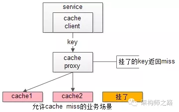
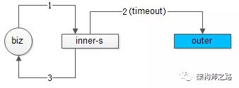

### PHP 实践

#### 1.单KEY业务，数据库水平切分架构实践

以“用户中心”为例，介绍“单KEY”类业务，随着数据量的逐步增大，数据库性能显著降低，数据库水平切分相关的架构实践：

- 如何来实施水平切分
- 水平切分后常见的问题
- 典型问题的优化思路及实践

##### 1、用户中心

用户中心是一个非常常见的业务，主要提供==用户注册、登录、信息查询与修改==的服务，其核心元数据为：

User(uid, login_name, passwd, sex, age, nickname, …)

其中：

- uid为用户ID，主键
- login_name, passwd, sex, age, nickname, …等用户属性

数据库设计上，一般来说在业务**初期**，==单库单表==就能够搞定这个需求，典型的架构设计为：

- user-center：用户中心服务，对调用者提供友好的RPC接口
- user-db：对用户进行数据存储

##### 2、用户中心水平切分方法

当**数据量越来越大时**，需要对数据库进行==水平切分==，常见的水平切分算法有**“范围法”和“哈希法”**。

**范围法**，以用户中心的业务主键uid为划分依据，将数据水平切分到两个数据库实例上去：

- user-db1：存储0到1千万的uid数据
- user-db2：存储1到2千万的uid数据

范围法的**优点**是：

- ==切分策略简单==，根据uid，按照范围，user- center很快能够定位到数据在哪个库上
- ==扩容简单==，如果容量不够，只要增加user-db3即可

范围法的**不足**是：

- uid必须要满足==递增的特性==
- ==数据量不均==，新增的user-db3，在初期的数据会比较少
- ==请求量不均==，一般来说，新注册的用户活跃度会比较高，故user-db2往往会比user-db1负载要高，导致服务器利用率不平衡

**哈希法**，也是以用户中心的业务主键uid为划分依据，将数据水平切分到两个数据库实例上去：

- user-db1：存储uid取模得1的uid数据
- user-db2：存储uid取模得0的uid数据

哈希法的**优点**是：

- ==切分策略简单==，根据uid，按照hash，user-center很快能够定位到数据在哪个库上
- ==数据量均衡==，只要uid是均匀的，数据在各个库上的分布一定是均衡的
- ==请求量均衡==，只要uid是均匀的，负载在各个库上的分布一定是均衡的

哈希法的**不足**是：

- ==扩容麻烦==，如果容量不够，要增加一个库，重新hash可能会导致数据迁移，如何平滑的进行数据迁移，是一个需要解决的问题

##### 3、用户中心水平切分后带来的问题

###### 使用uid来进行水平切分之后，整个用户中心的业务访问会遇到什么问题呢？

==对于uid属性上的查询可以直接路由到库==，假设访问uid=124的数据，取模后能够直接定位db-user1：

==对于非uid属性上的查询，例如login_name属性上的查询，就悲剧了：==

假设访问login_name=shenjian的数据，由于不知道数据落在哪个库上，往往需要遍历所有库，当分库数量多起来，性能会显著降低。

##### 4、用户中心非uid属性查询需求分析

用户中心非uid属性上经常有两类业务需求：

（1）**用户侧，前台访问**，最典型的有两类需求

​		==用户登录==：通过login_name/phone/email查询用户的实体，1%请求属于这种类型

​		==用户信息查询==：登录之后，通过uid来查询用户的实例，99%请求属这种类型

用户侧的查询基本上是单条记录的查询，访问量较大，服务需要高可用，并且对一致性的要求较高。

 

（2）**运营侧，后台访问**，根据产品、运营需求，访问模式各异，按照==年龄、性别、头像、登陆时间、注册时间来进行查询==。

运营侧的查询基本上是批量分页的查询，由于是内部系统，访问量很低，对可用性的要求不高，对一致性的要求也没这么严格。

 

这两类不同的业务需求，应该使用什么样的架构方案来解决呢？

##### 5、用户中心水平切分架构思路

用户中心在数据量较大的情况下，使用uid进行水平切分，对于非uid属性上的查询需求，架构设计的核心思路为：

- 针对**用户侧**，应该采用“==建立非uid属性到uid的映射关系==”的架构方案
- 针对**运营侧**，应该采用“==前台与后台分离==”的架构方案

##### 6、用户中心-用户侧最佳实践

**【索引表法】**

**思路**：uid能直接定位到库，login_name不能直接定位到库，如果通过login_name能查询到uid，问题解决

**解决方案**：

- 建立一个索引表记录login_name->uid的映射关系
- 用login_name来访问时，先通过索引表查询到uid，再定位相应的库
- 索引表属性较少，可以容纳非常多数据，一般不需要分库
- 如果数据量过大，可以通过login_name来分库

潜在**不足**：==多一次数据库查询，性能下降一倍==

**【login_name生成uid】**

**思路**：不进行远程查询，由login_name直接得到uid

**解决方案**：

- 在用户注册时，设计函数login_name生成uid，uid=f(login_name)，按uid分库插入数据
- 用login_name来访问时，先通过函数计算出uid，即uid=f(login_name)再来一遍，由uid路由到对应库

潜在**不足**：==该函数设计需要非常讲究技巧，有uid生成冲突风险==

**【login_name基因融入uid】**

**思路**：不能用login_name生成uid，可以从login_name抽取“基因”，融入uid中

假设分8库，采用uid%8路由，潜台词是，uid的最后3个bit决定这条数据落在哪个库上，这3个bit就是所谓的“基因”。

**解决方案**：

- 在用户注册时，设计函数login_name生成3bit基因，login_name_gene=f(login_name)，如上图粉色部分
- 同时，生成61bit的全局唯一id，作为用户的标识，如上图绿色部分
- 接着把3bit的login_name_gene也作为uid的一部分，如上图屎黄色部分
- 生成64bit的uid，由id和login_name_gene拼装而成，并按照uid分库插入数据
- 用login_name来访问时，先通过函数由login_name再次复原3bit基因，login_name_gene=f(login_name)，通过login_name_gene%8直接定位到库

##### 7、用户中心-运营侧最佳实践

前台**用户侧**，业务需求基本都是==单行记录==的访问，只要建立非uid属性 login_name / phone / email 到uid的映射关系，就能解决问题。

后台**运营侧**，业务需求各异，基本是==批量分页==的访问，这类访问计算量较大，返回数据量较大，比较消耗数据库性能。

 

如果此时前台业务和后台业务公用一批服务和一个数据库，有可能导致，由于后台的“少数几个请求”的“批量查询”的“低效”访问，导致数据库的cpu偶尔瞬时100%，影响前台正常用户的访问（例如，登录超时）。

而且，为了满足后台业务各类“奇形怪状”的需求，往往会在数据库上建立各种索引，这些索引占用大量内存，会使得用户侧前台业务uid/login_name上的查询性能与写入性能大幅度降低，处理时间增长。

对于这一类业务，应该采用“==前台与后台分离==”的架构方案：

用户侧前台业务需求架构依然不变，产品运营侧后台业务需求则**抽取独立的web / service / db 来支持**，==解除系统之间的耦合==，对于“业务复杂”“并发量低”“无需高可用”“能接受一定延时”的后台业务：

- 可以去掉service层，在运营后台web层通过dao直接访问db
- 不需要反向代理，不需要集群冗余
- 不需要访问实时库，可以通过MQ或者线下异步同步数据
- 在数据库非常大的情况下，可以使用更契合大量数据允许接受更高延时的“索引外置”或者“HIVE”的设计方案

##### 8、总结

将以“用户中心”为典型的“单KEY”类业务，水平切分的架构点，本文做了这样一些介绍。

 

**水平切分方式**：

- 范围法

- 哈希法

  

**水平切分后碰到的问题**：

- 通过uid属性查询能直接定位到库，通过非uid属性查询不能定位到库

  

**非uid属性查询的典型业务**：

- 用户侧，前台访问，单条记录的查询，访问量较大，服务需要高可用，并且对一致性的要求较高

- 运营侧，后台访问，根据产品、运营需求，访问模式各异，基本上是批量分页的查询，由于是内部系统，访问量很低，对可用性的要求不高，对一致性的要求也没这么严格

  

**这两类业务的架构设计思路**：

- 针对用户侧，应该采用“建立非uid属性到uid的映射关系”的架构方案
- 针对运营侧，应该采用“前台与后台分离”的架构方案

**用户前台侧，“建立非uid属性到uid的映射关系”最佳实践**：

- 索引表法：数据库中记录login_name->uid的映射关系
- 缓存映射法：缓存中记录login_name->uid的映射关系
- login_name生成uid
- login_name基因融入uid

**运营后台侧，“前台与后台分离”最佳实践**：

- 前台、后台系统web/service/db分离解耦，避免后台低效查询引发前台查询抖动
- 可以采用数据冗余的设计方式
- 可以采用“外置索引”（例如ES搜索系统）或者“大数据处理”（例如HIVE）来满足后台变态的查询需求

#### 2. 架构设计中常见“反向依赖”与解耦方案

##### 1、缘起

很多公司，技术经常遇到这样的场景：

​	1）硬件升级，要换一台高配机器

​	2）网络重新规划，若干服务器要调整机架

​	3）服务器当机，要重新部署恢复服务

更具体的，如上图：==数据库换了一个ip，此时往往连接此数据库的上游需要修改配置重启==，如果数据库有很多上游调用方，改配置重启的调用方会很多，每次换ip的成本往往很高，成为大家共性的痛点。

由A的调整（数据库换ip），配合修改和调整的却是BCDE（改配置重启），BCDE内心非常的郁闷：明明换ip的是你，凭什么配合重启的却是我？

根本上，这是一个“架构耦合”的问题，是一个**架构设计上“反向依赖”的问题**，本文将讨论的是架构设计中常见的“反向依赖”的设计，以及对应的优化方案，希望对大伙有所启示。

##### 2、如何寻找不合理“反向依赖”

**方法论**：

==变动方是A，配合方却是BCDE==

（或者说==需求方是A，改动方确是BCDE==）

想想“换IP的是你，配合重启的却是我”更好理解。

如果系统中经常出现了这类情况，就是“反向依赖”的特征，往往架构上有优化的空间。

##### 3、常见的“反向依赖”与优化方案

**【case1：公共库导致耦合】**

三个服务s1/s2/s3，通过一个公共的库biz.jar来实现一段业务逻辑，s1/s2/s3其实间接通过biz.jar耦合在了一起，==一个业务s1修改一块公共的代码，导致影响其他业务s2/s3==，架构上是不合理的。

**优化方案1：业务垂直拆分**

如果biz.jar中实现的逻辑“业务特性”很强，可以拆分为biz1.jar/biz2.jar/biz3.jar，来对s1/s2/s3进行解耦。这样的话，==任何业务的改动，影响范围只是自己，不会影响其他人==。

**优化方案2：服务化**

0

如果biz.jar中实现的逻辑“业务共性”很强，可以将biz.jar优化为biz.service服务，来对s1/s2/s3进行解耦。服务化之后，兼容性能更好的通过接口自动化回归测试来保证。

基础服务的抽象，本身是一种共性聚焦，是系统解耦常见的方案。

**【case2：服务化不彻底导致耦合】**

服务化是解决“业务共性”组件库导致系统耦合的常见方案之一，但如果服务化不彻底，service本身也容易成为业务耦合点。

 

典型的服务化不彻底导致的业务耦合的特征是，共性服务中，包含大量“根据不同业务，执行不同个性分支”的代码。

switch (biz-type)

case biz-1 : exec1

case biz-2 : exec2

case biz-3 : exec3

...

在这种架构下，==biz-1/biz-2/biz-3有个性的业务需求，可能导致修改代码的是共性的biz-service，使其成为研发瓶颈==，架构上也是不合理的。

**优化方案：业务特性代码上浮，业务共性代码下沉，彻底解耦**

把swithc case中业务==特性代码放到业务层实现==，这样biz-1/biz-2/biz-3有个性的业务需求，升级的是自己的业务系统。

**【case3：notify的不合理实现导致的耦合】**

《[究竟什么时候该使用MQ](http://mp.weixin.qq.com/s?__biz=MjM5ODYxMDA5OQ==&mid=2651960012&idx=1&sn=c6af5c79ecead98daa4d742e5ad20ce5&chksm=bd2d07108a5a8e0624ae6ad95001c4efe09d7ba695f2ddb672064805d771f3f84bee8123b8a6&scene=21#wechat_redirect)》一文中有一类业务场景，==消息发送方不关注消息接收方的执行结果==，如果采用调用的方式来实现通知，会==导消息发送方和消息接收方耦合==。

 ==如何新增消息接收方biz-4，会发现修改代码的是消息发送方==，新增一个对biz-4的调用，极不合理。

**优化方案：通过MQ实现解耦**

消息发送方upper将消息发布给MQ，消息接收方从MQ去订阅，==任何新增对消息的消费，upper都不需要修改代码==。

**【case4：配置中的ip导致上下游耦合】**

即“缘起”中举的例子，==下游服务换ip，可能导致多个服务调用方修改配置重启==。上下游间接的通过ip这个配置耦合在了一起，架构不合理。

**优化方案：通过内网域名而不是ip来进行下游连接**

如果在配置中使用==内网域名来进行下游连接==，当下游服务或者数据库更换ip时，只需要**运维层面将内网域名指向新的ip，然后统一切断原有旧的连接**，连接就能够==自动切换==到新的ip上来。这个过程不需要所有上游配合，非常帅气，强烈推荐！

**【case5：下游扩容导致上下游耦合】**

这次不是换换ip这么简单了，下游服务提供方原来是集群（ip1/ip2/ip3，当然，上游配置的是内网域名），现在==集群要扩容为（ip1/ip2/ip3/ip4/ip5）==，如果没有特殊的架构设计，上游往往需要修改配置，新增扩容后的节点，再重启，导致上下游耦合。

##### 4、总结

**如何发现系统架构中不合理的“反向依赖”设计？**

回答：

（1）变动方是A，配合方却是BCDE

（2）需求方是A，改动方确是BCDE

想想“换IP的是你，配合重启的却是我”，此时往往架构上可以进行解耦优化。

 

**常见反向依赖及优化方案？**

（1）==公共库导致耦合==

**优化一**：如果公共库是==业务特性代码==，进行公共库**垂直拆分**

**优化二**：如果公共库是==业务共性代码==，进行**服务化**下沉抽象

（2）==服务化不彻底导致耦合==

**特征**：服务中包==含大量“根据不同业务，执行不同个性分支”的代码==

**优化方案**：个性代码放到业务层实现，**将服务化更彻底更纯粹**

（3）==notify的不合理实现导致的耦合==

**特征**：调用方不关注执行结果，==以调用的方式去实现通知==，新增订阅者，修改代码的是发布者

**优化方案**：**通过MQ解耦**

（4）==配置中的ip导致上下游耦合==

**特征**：==多个上游需要修改配置重启==

**优化方案**：**使用内网域名替代内网ip**，通过“修改DNS指向，统一切断旧连接”的方式来上游无感切换

（5）==下游扩容导致上下游耦合==

特性：==多个上游需要修改配置重启==

#### 3.互联网架构如何实现“高可用”

##### 1、什么是高可用？

**高可用HA****（**High Availability）是分布式系统架构设计中必须考虑的因素之一，它通常是指，==通过设计减少系统不能提供服务的时间==。

假设系统一直能够提供服务，我们说系统的可用性是100%。

如果系统每运行100个时间单位，会有1个时间单位无法提供服务，我们说系统的可用性是99%。

很多公司的高可用目标是4个9，也就是99.99%，这就意味着，系统的年停机时间为8.76个小时。

##### 2、如何保障系统的高可用?

我们都知道，单点是系统高可用的大敌，单点往往是系统高可用最大的风险和敌人，应该尽量在系统设计的过程中避免单点。==方法论上，高可用保证的原则是“集群化”，或者叫“冗余”==：只有一个单点，挂了服务会受影响；如果有冗余备份，挂了还有其他backup能够顶上。

**保证系统高可用，架构设计的核心准则是：冗余。**

有了冗余之后，还不够，每次出现故障需要人工介入恢复势必会增加系统的不可服务实践。所以，又往往是==通过“自动故障转移”来实现系统的高可用==。

接下来我们看下典型互联网架构中，如何通过**冗余+自动故障转移**来保证系统的高可用特性。

##### 3、常见的互联网分层架构

常见互联网分布式架构如上，分为：

（1）**客户端层**：典型调用方是浏览器browser或者手机应用APP

（2）**反向代理层**：系统入口，反向代理

（3）**站点应用层**：实现核心应用逻辑，返回html或者json

（4）**服务层**：如果实现了服务化，就有这一层

（5）**数据-缓存层**：缓存加速访问存储

（6）**数据-数据库层**：数据库固化数据存储

整个系统的高可用，又是通过每一层的**冗余+自动故障转移**来综合实现的。

##### 4、分层高可用架构实践

**【客户端层->反向代理层】的高可用**

【客户端层】到【反向代理层】的**高可用**，是通过反向代理层的冗余来实现的。以nginx为例：有两台nginx，一台对线上提供服务，另一台冗余以保证高可用，常见的实践是keepalived存活探测，相同virtual IP提供服务。

**自动故障转移**：当nginx挂了的时候，keepalived能够探测到，会自动的进行故障转移，将流量自动迁移到shadow-nginx，由于使用的是相同的virtual IP，这个切换过程对调用方是透明的。

**【反向代理层->站点层】的高可用**

【反向代理层】到【站点层】的**高可用**，是通过站点层的冗余来实现的。假设反向代理层是nginx，nginx.conf里能够配置多个web后端，并且nginx能够探测到多个后端的存活性。

**自动故障转移**：当web-server挂了的时候，nginx能够探测到，会自动的进行故障转移，将流量自动迁移到其他的web-server，整个过程由nginx自动完成，对调用方是透明的。

**【站点层->服务层】的高可用**

【站点层】到【服务层】的**高可用**，是通过服务层的冗余来实现的。“服务连接池”会建立与下游服务多个连接，每次请求会“随机”选取连接来访问下游服务。

**自动故障转移**：当service挂了的时候，service-connection-pool能够探测到，会自动的进行故障转移，将流量自动迁移到其他的service，整个过程由连接池自动完成，对调用方是透明的（所以说RPC-client中的服务连接池是很重要的基础组件）。

**【服务层>缓存层】的高可用**

【服务层】到【缓存层】的高可用，是通过缓存数据的冗余来实现的。

缓存层的数据冗余又有几种方式：第一种是利用客户端的封装，service对cache进行双读或者双写。

缓存层也可以通过支持主从同步的缓存集群来解决缓存层的**高可用**问题。

以redis为例，redis天然支持主从同步，redis官方也有sentinel哨兵机制，来做redis的存活性检测。

**自动故障转移**：当redis主挂了的时候，sentinel能够探测到，会通知调用方访问新的redis，整个过程由sentinel和redis集群配合完成，对调用方是透明的。

 

说完缓存的高可用，这里要多说一句，业务对缓存并不一定有“高可用”要求，==更多的对缓存的使用场景，是用来“加速数据访问”==：把一部分数据放到缓存里，如果缓存挂了或者缓存没有命中，是可以去后端的数据库中再取数据的。

这类允许“cache miss”的业务场景，缓存架构的建议是：

==将kv缓存封装成服务集群==，上游设置一个代理（代理可以用集群冗余的方式保证高可用），代理的后端根据缓存访问的key水平切分成若干个实例，每个实例的访问并不做高可用。

**缓存实例挂了屏蔽**：当有水平切分的实例挂掉时，代理层直接返回cache miss，此时缓存挂掉对调用方也是透明的。key水平切分实例减少，==不建议做re-hash，这样容易引发缓存数据的不一致==。

**【服务层>数据库层】的高可用**

大部分互联网技术，数据库层都用了“主从同步，读写分离”架构，所以数据库层的高可用，又分为==“读库高可用”与“写库高可用”==两类。

**【服务层>数据库层“读”】的高可用**

【服务层】到【数据库读】的**高可用**，是通过读库的冗余来实现的。

既然冗余了读库，一般来说就至少有2个从库，“数据库连接池”会建立与读库多个连接，每次请求会路由到这些读库。

**自动故障转移**：当读库挂了的时候，db-connection-pool能够探测到，会自动的进行故障转移，将流量自动迁移到其他的读库，整个过程由连接池自动完成，对调用方是透明的（所以说DAO中的数据库连接池是很重要的基础组件）。

**【服务层>数据库层“写”】的高可用**

【服务层】到【数据库写】的**高可用**，是通过写库的冗余来实现的。

以mysql为例，可以设置两个mysql双主同步，一台对线上提供服务，另一台冗余以保证高可用，常见的实践是keepalived存活探测，相同virtual IP提供服务。

**自动故障转移**：当写库挂了的时候，keepalived能够探测到，会自动的进行故障转移，将流量自动迁移到shadow-db-master，由于使用的是相同的virtual IP，这个切换过程对调用方是透明的。

##### 5、总结

高可用HA（High Availability）是分布式系统架构设计中必须考虑的因素之一，它通常是指，通过设计减少系统不能提供服务的时间。

方法论上，高可用是通过**冗余****+****自动故障转移**来实现的。

整个互联网分层系统架构的高可用，又是通过每一层的**冗余****+****自动故障转移**来综合实现的，具体的：

（1）【客户端层】到【反向代理层】的高可用，是==通过反向代理层的冗余实现的==，常见实践是keepalived + virtual IP自动故障转移

（2）【反向代理层】到【站点层】的高可用，是==通过站点层的冗余实现的==，常见实践是nginx与web-server之间的存活性探测与自动故障转移

（3）【站点层】到【服务层】的高可用，是==通过服务层的冗余实现的==，常见实践是通过service-connection-pool来保证自动故障转移

（4）【服务层】到【缓存层】的高可用，是==通过缓存数据的冗余实现的==，常见实践是缓存客户端双读双写，或者利用缓存集群的主从数据同步与sentinel保活与自动故障转移；更多的业务场景，对缓存没有高可用要求，可以使用缓存服务化来对调用方屏蔽底层复杂性

（5）【服务层】到【数据库“读”】的高可用，是==通过读库的冗余实现的==，常见实践是通过db-connection-pool来保证自动故障转移

（6）【服务层】到【数据库“写”】的高可用，是==通过写库的冗余实现的==，常见实践是keepalived + virtual IP自动故障转移

#### 4.互联网架构如何实现“高并发”

##### 1、什么是高并发？

**高并发（**High Concurrency）是互联网分布式系统架构设计中必须考虑的因素之一，它通常是指，==通过设计保证系统能够同时并行处理很多请求==。

高并发相关常用的一些指标有响应时间（Response Time），吞吐量（Throughput），每秒查询率QPS（Query Per Second），并发用户数等。

**响应时间**：系统对请求做出响应的时间。例如系统处理一个HTTP请求需要200ms，这个200ms就是系统的响应时间。

**吞吐量**：单位时间内处理的请求数量。

**QPS**：每秒响应请求数。在互联网领域，这个指标和吞吐量区分的没有这么明显。

**并发用户数**：同时承载正常使用系统功能的用户数量。例如一个即时通讯系统，同时在线量一定程度上代表了系统的并发用户数。

##### 2、如何提升系统的并发能力？

互联网分布式架构设计，==提高系统并发能力的方式，方法论上主要有两种：垂直扩展（Scale Up）与水平扩展（Scale Out）==。

**垂直扩展**：提升单机处理能力。垂直扩展的方式又有两种：

（1）增强单机硬件性能，例如：增加CPU核数如32核，升级更好的网卡如万兆，升级更好的硬盘如SSD，扩充硬盘容量如2T，扩充系统内存如128G；

（2）提升单机架构性能，例如：使用Cache来减少IO次数，使用异步来增加单服务吞吐量，使用无锁数据结构来减少响应时间；

在互联网业务发展非常迅猛的早期，如果预算不是问题，强烈建议使用“增强单机硬件性能”的方式提升系统并发能力，因为这个阶段，公司的战略往往是发展业务抢时间，而“增强单机硬件性能”往往是最快的方法。

 

不管是提升单机硬件性能，还是提升单机架构性能，都有一个致命的不足：单机性能总是有极限的。所以==互联网分布式架构设计高并发终极解决方案还是水平扩展==。

**水平扩展**：只要增加服务器数量，就能线性扩充系统性能。水平扩展对系统架构设计是有要求的，如何在架构各层进行可水平扩展的设计，以及互联网公司架构各层常见的水平扩展实践，是本文重点讨论的内容。

##### 3、常见的互联网分层架构

常见互联网分布式架构如上，分为：

（1）**客户端层**：典型调用方是浏览器browser或者手机应用APP

（2）**反向代理层**：系统入口，反向代理

（3）**站点应用层**：实现核心应用逻辑，返回html或者json

（4）**服务层**：如果实现了服务化，就有这一层

（5）**数据-缓存层**：缓存加速访问存储

（6）**数据-数据库层**：数据库固化数据存储

整个系统各层次的水平扩展，又分别是如何实施的呢？

##### 4、分层水平扩展架构实践

**反向代理层的水平扩展**

反向代理层的水平扩展，是通过“DNS轮询”实现的：dns-server对于一个域名配置了多个解析ip，每次DNS解析请求来访问dns-server，会轮询返回这些ip。

当nginx成为瓶颈的时候，只要增加服务器数量，新增nginx服务的部署，增加一个外网ip，就能扩展反向代理层的性能，做到理论上的无限高并发。

**站点层的水平扩展**

站点层的水平扩展，是通过“nginx”实现的。通过修改nginx.conf，可以设置多个web后端。

当web后端成为瓶颈的时候，只要增加服务器数量，新增web服务的部署，在nginx配置中配置上新的web后端，就能扩展站点层的性能，做到理论上的无限高并发。

**服务层的水平扩展**

服务层的水平扩展，是通过“服务连接池”实现的。

站点层通过RPC-client调用下游的服务层RPC-server时，RPC-client中的连接池会建立与下游服务多个连接，当服务成为瓶颈的时候，只要增加服务器数量，新增服务部署，在RPC-client处建立新的下游服务连接，就能扩展服务层性能，做到理论上的无限高并发。如果需要优雅的进行服务层自动扩容，这里可能需要配置中心里服务自动发现功能的支持。

**数据层的水平扩展**

在数据量很大的情况下，数据层（缓存，数据库）涉及数据的水平扩展，将原本存储在一台服务器上的数据（缓存，数据库）水平拆分到不同服务器上去，以达到扩充系统性能的目的。

 

互联网数据层常见的水平拆分方式有这么几种，以数据库为例：

**按照范围水平拆分**

每一个数据服务，存储一定范围的数据，上图为例：

user0库，存储uid范围1-1kw

user1库，存储uid范围1kw-2kw

这个方案的好处是：

（1）规则简单，service只需判断一下uid范围就能路由到对应的存储服务；

（2）数据均衡性较好；

（3）比较容易扩展，可以随时加一个uid[2kw,3kw]的数据服务；

不足是：

（1）   请求的负载不一定均衡，一般来说，新注册的用户会比老用户更活跃，大range的服务请求压力会更大；

**按照哈希水平拆分**

每一个数据库，存储某个key值hash后的部分数据，上图为例：

user0库，存储偶数uid数据

user1库，存储奇数uid数据

这个方案的好处是：

（1）规则简单，service只需对uid进行hash能路由到对应的存储服务；

（2）数据均衡性较好；

（3）请求均匀性较好；

不足是：

（1）不容易扩展，扩展一个数据服务，hash方法改变时候，可能需要进行数据迁移；

 

这里需要注意的是，通过水平拆分来扩充系统性能，与主从同步读写分离来扩充数据库性能的方式有本质的不同。

通过水平拆分扩展数据库性能：

（1）每个服务器上存储的数据量是总量的1/n，所以单机的性能也会有提升；

（2）n个服务器上的数据没有交集，那个服务器上数据的并集是数据的全集；

（3）数据水平拆分到了n个服务器上，理论上读性能扩充了n倍，写性能也扩充了n倍（其实远不止n倍，因为单机的数据量变为了原来的1/n）；

通过主从同步读写分离扩展数据库性能：

（1）每个服务器上存储的数据量是和总量相同；

（2）n个服务器上的数据都一样，都是全集；

（3）理论上读性能扩充了n倍，写仍然是单点，写性能不变；

 

缓存层的水平拆分和数据库层的水平拆分类似，也是以范围拆分和哈希拆分的方式居多，就不再展开。

##### 5、总结

**高并发（**High Concurrency）是互联网分布式系统架构设计中必须考虑的因素之一，它通常是指，==通过设计保证系统能够同时并行处理很多请求==。

==提高系统并发能力的方式，方法论上主要有两种：垂直扩展（Scale Up）与水平扩展（Scale Out）==。前者垂直扩展可以通过提升单机硬件性能，或者提升单机架构性能，来提高并发性，但单机性能总是有极限的，==互联网分布式架构设计高并发终极解决方案还是后者：水平扩展==。

互联网分层架构中，各层次水平扩展的实践又有所不同：

（1）反向代理层可以通过“DNS轮询”的方式来进行水平扩展；

（2）站点层可以通过nginx来进行水平扩展；

（3）服务层可以通过服务连接池来进行水平扩展；

（4）数据库可以按照数据范围，或者数据哈希的方式来进行水平扩展；

各层实施水平扩展后，能够通过增加服务器数量的方式来提升系统的性能，做到理论上的性能无限。

#### 5.典型数据库架构设计与实践

##### 1、用户中心

**用户中心**是一个常见业务，主要提供用户注册、登录、信息查询与修改的服务，其核心元数据为：

User(uid, uname, passwd, sex, age,nickname, …)

其中：

- uid为用户ID，主键
- uname, passwd, sex, age, nickname, …等为用户的属性

数据库设计上，一般来说在业务初期，单库单表就能够搞定这个需求。

##### 2、图示说明

为了方便大家理解，后文图片说明较多，其中：

- “灰色”方框，表示service，服务
- “紫色”圆框，标识master，主库
- “粉色”圆框，表示slave，从库

##### 3、单库架构

最常见的架构设计如上：

- user-service：用户中心服务，对调用者提供友好的RPC接口
- user-db：一个库进行数据存储

##### 4、分组架构

**什么是分组？**

**答**：分组架构是最常见的==一主多从，主从同步，读写分离==数据库架构：

- user-service：依旧是用户中心服务
- user-db-M(master)：主库，提供数据库写服务
- user-db-S(slave)：从库，提供数据库读服务

==主和从构成的数据库集群称为“组”==。

**分组有什么特点？**

**答**：同一个组里的数据库集群：

- 主从之间通过binlog进行数据同步
- 多个实例数据库结构完全相同
- 多个实例存储的数据也完全相同，本质上是将数据进行复制

**分组架构究竟解决什么问题？**

**答**：==大部分互联网业务读多写少==，**数据库的读往往最先成为性能瓶颈**，如果希望：

- 线性提升数据库读性能
- 通过消除读写锁冲突提升数据库写性能
- 通过冗余从库实现数据的“读高可用”

此时可以使用分组架构，需要注意的是，==分组架构中，数据库的主库依然是写单点==。

一句话总结，**分组解决的是“数据库读写高并发量高”问题**，所实施的架构设计。

##### 5、分片架构

**什么是分片？**

**答**：分片架构是大伙常说的==水平切分==(sharding)数据库架构：

- user-service：依旧是用户中心服务
- user-db1：水平切分成2份中的第一份
- user-db2：水平切分成2份中的第二份

分片后，多个数据库实例也会构成一个数据库集群。

**水平切分，到底是分库还是分表？**

**答**：==强烈建议分库==，而不是分表，因为：

- 分表依然公用一个数据库文件，仍然有磁盘IO的竞争
- 分库能够很容易的将数据迁移到不同数据库实例，甚至数据库机器上，扩展性更好

**水平切分，用什么算法？**

**答**：常见的水平切分算法有“==范围法==”和“==哈希法==”：

**范围法**如上图：以用户中心的业务主键uid为划分依据，将数据水平切分到两个数据库实例上去：

- user-db1：存储0到1千万的uid数据
- user-db2：存储0到2千万的uid数据

**哈希法**如上图：也是以用户中心的业务主键uid为划分依据，将数据水平切分到两个数据库实例上去：

- user-db1：存储uid取模得1的uid数据
- user-db2：存储uid取模得0的uid数据

这两种方法在互联网都有使用，其中哈希法使用较为广泛。

**分片有什么特点？**

**答**：同一个分片里的数据库集群：

- 多个实例之间本身不直接产生联系，不像主从间有binlog同步
- 多个实例数据库结构，也完全相同
- 多个实例存储的数据之间没有交集，所有实例间数据并集构成全局数据

 

**分片架构究竟解决什么问题？**

**答**：大部分互联网业务数据量很大，单库容量容易成为瓶颈，此时通过分片可以：

- 线性提升数据库写性能，需要注意的是，分组架构是不能线性提升数据库写性能的
- 降低单库数据容量

 

一句话总结，**分片解决的是“数据库数据量大”问题**，所实施的架构设计。

##### 6、分组+分片架构

如果业务**读写并发量很高，数据量也很大**，通常需要实施==分组+分片==的数据库架构：

- 通过分片来降低单库的数据量，线性提升数据库的写性能
- 通过分组来线性提升数据库的读性能，保证读库的高可用

##### 7、垂直切分

除了水平切分，垂直切分也是一类常见的数据库架构设计，==垂直切分一般和业务结合比较紧密==。

还是以用户中心为例，可以这么进行垂直切分：

User(uid, uname, passwd, sex, age, …)

User_EX(uid, intro, sign, …)

- 垂直切分开的表，主键都是uid
- 登录名，密码，性别，年龄等属性放在一个垂直表（库）里
- 自我介绍，个人签名等属性放在另一个垂直表（库）里

**如何进行垂直切分？**

**答**：根据业务对数据进行垂直切分时，一般要考虑属性的“==长度==”和“==访问频度==”两个因素：

- 长度较短，访问频率较高的放在一起
- 长度较长，访问频度较低的放在一起

这是因为，数据库会以行(row)为单位，将数据load到内存(buffer)里，在内存容量有限的情况下，长度短且访问频度高的属性，内存能够load更多的数据，命中率会更高，磁盘IO会减少，数据库的性能会提升。

 

**垂直切分有什么特点？**

**答**：垂直切分和水平切有相似的地方，又不太相同：

- 多个实例之间也不直接产生联系，即没有binlog同步
- 多个实例数据库结构，都不一样
- 多个实例存储的数据之间至少有一列交集，一般来说是业务主键，所有实例间数据并集构成全局数据

**垂直切分解决什么问题？**

**答**：垂直切分即可以==降低单库的数据量==，还可以==降低磁盘IO从而提升吞吐量==，但它与业务结合比较紧密，并不是所有业务都能够进行垂直切分的。

 

##### 8、总结

文章较长，希望至少记住这么几点：

- 业务初期用==单库==
- 读压力大，读高可用，用==分组==
- 数据量大，写线性扩容，用==分片==
- 属性短，访问频度高的属性，==垂直拆分==到一起

#### 6.session一致性架构设计实践

##### 1、缘起

**什么是session？**

服务器为每个用户创建一个会话，存储用户的相关信息，以便多次请求能够定位到同一个上下文。

Web开发中，web-server可以自动为同一个浏览器的访问用户自动创建session，提供数据存储功能。最常见的，会把用户的登录信息、用户信息存储在session中，以保持登录状态。

**什么是session一致性问题？**

只要用户不重启浏览器，每次http短连接请求，理论上服务端都能定位到session，保持会话。

当只有一台web-server提供服务时，每次http短连接请求，都能够正确路由到存储session的对应web-server（废话，因为只有一台）。

此时的web-server是无法保证高可用的，采用“冗余+故障转移”的==多台web-server来保证高可用时，每次http短连接请求就不一定能路由到正确的session了==。

如上图，假设用户包含登录信息的session都记录在第一台web-server上，反向代理如果将请求路由到另一台web-server上，可能就找不到相关信息，而导致用户需要重新登录。 

在web-server高可用时，如何保证session路由的一致性，是今天将要讨论的问题。

##### 2、session同步法

**思路**：==多个web-server之间相互同步session==，这样每个web-server之间都包含全部的session

 

**优点**：web-server支持的功能，==应用程序不需要修改代码==

 

**不足**：

- session的同步需要数据传输，==占**内网带宽**==，有时延
- 所有web-server都包含所有session数据，数据量==受内存限制，无法水平扩展==
- ==有更多web-server时要歇菜==

##### 3、客户端存储法

**思路**：服务端存储所有用户的session，内存占用较大，可以将==session存储到浏览器cookie中==，每个端只要存储一个用户的数据了

**优点**：==服务端不需要存储==

**缺点**：

- 每次http请求都携带session，==占**外网带宽**==
- 数据存储在端上，并在网络传输，存在泄漏、篡改、窃取等==安全隐患==
- session==存储的数据大小受cookie限制==

“端存储”的方案虽然不常用，但确实是一种思路。

##### 3、反向代理hash一致性

**思路**：web-server为了保证高可用，有多台冗余，反向代理层能不能做一些事情，让==同一个用户的请求保证落在一台web-server上==呢？

**方案一：四层代理hash**

反向代理层使用==用户ip来做hash==，以保证同一个ip的请求落在同一个web-server上

**方案二：七层代理hash**

反向代理使用http协议中的==某些业务属性来做hash==，例如sid，city_id，user_id等，能够更加灵活的实施hash策略，以保证同一个浏览器用户的请求落在同一个web-server上

**优点**：

- 只需要改nginx配置，==不需要修改应用代码==
- ==负载均衡==，只要hash属性是均匀的，多台web-server的负载是均衡的
- 可以==支持web-server水平扩展==（session同步法是不行的，受内存限制）

 

**不足**：

- ==如果web-server重启，一部分session会丢失==，产生业务影响，例如部分用户重新登录
- 如果web-server水平扩展，==rehash后session重新分布，也会有一部分用户路由不到正确的session==

 

session一般是有有效期的，所有不足中的两点，可以认为等同于部分session失效，一般问题不大。

 

==对于四层hash还是七层hash，个人推荐前者==：**让专业的软件做专业的事情**，反向代理就负责转发，尽量不要引入应用层业务属性，除非不得不这么做（例如，有时候多机房多活需要按照业务属性路由到不同机房的web-server）。

##### 4、后端统一存储

**思路**：==将session存储在web-server后端的存储层==，数据库或者缓存

 

**优点**：

- ==没有安全隐患==
- ==可以水平扩展==，数据库/缓存水平切分即可
- web-server重启或者扩容都==不会有session丢失==

 

**不足**：增加了一次网络调用，并且==需要修改应用代码==

 

==对于db存储还是cache，个人推荐后者==：session读取的频率会很高，数据库压力会比较大。如果有session高可用需求，cache可以做高可用，但大部分情况下session可以丢失，一般也不需要考虑高可用。

##### 5、总结

**保证session一致性**的架构设计常见方法：

- ==session同步法==：多台web-server相互同步数据
- ==客户端存储法==：一个用户只存储自己的数据
- ==反向代理hash一致性==：四层hash和七层hash都可以做，保证一个用户的请求落在一台web-server上
- ==后端统一存储==：web-server重启和扩容，session也不会丢失

 

==对于方案3和方案4，个人建议推荐后者==：

- **web层、service层无状态是大规模分布式系统设计原则之一**，session属于状态，不宜放在web层
- **让专业的软件做专业的事情**，web-server存session？还是让cache去做这样的事情吧

#### 7.TCP接入层的负载均衡、高可用、扩展性架构

##### 1、web-server的负载均衡

互联网架构中，==web-server接入一般使用nginx来做反向代理==，实施负载均衡。整个架构分三层：

- **上游调用层**，一般是browser或者APP
- **中间反向代理层**，nginx
- **下游真实接入集群**，web-server，常见web-server的有tomcat，apache

 

整个访问过程为：

- browser向daojia.com发起请求
- DNS服务器将daojia.com解析为==外网IP==(1.2.3.4)
- browser通过外网IP(1.2.3.4)访问nginx
- nginx实施负载均衡策略，常见策略有轮询，随机，IP-hash等
- nginx将请求转发给==内网IP==(192.168.0.1)的web-server

由于==http短连接，以及web应用无状态==的特性，理论上**任何一个http请求落在任意一台web-server都应该得到正常处理**（如果必须落在一台，说明架构不合理，不能水平扩展）。

问题来了，==tcp是有状态的连接==，客户端和服务端一旦建立连接，**一个client发起的请求必须落在同一台tcp-server上**，此时如何做负载均衡，如何保证水平扩展呢？

##### 2、单机法tcp-server

单个tcp-server显然是可以保证请求一致性：

- client向tcp.daojia.com发起tcp请求
- DNS服务器将tcp.daojia.com解析为外网IP(1.2.3.4)
- client通过外网IP(1.2.3.4)向tcp-server发起请求

 

**方案的缺点？**

==无法保证高可用。==

##### 3、集群法tcp-server

==通过搭建tcp-server集群来保证高可用==，**客户端来实现负载均衡**：

- client内配置有tcp1/tcp2/tcp3.daojia.com三个tcp-server的外网IP
- 客户端通过“随机”的方式选择tcp-server，假设选择到的是tcp1.daojia.com
- 通过DNS解析tcp1.daojia.com
- 通过外网IP连接真实的tcp-server

**如何保证高可用呢？**

==如果client发现某个tcp-server连接不上，则选择另一个。==

 

**潜在的缺点？**

每次连接前，需要多实施一次DNS访问：

- ==难以预防DNS劫持==
- 多一次DNS访问意味着==更长的连接时间==，这个不足在手机端更为明显

 

**如何解决DNS的问题？**

直接将IP配置在客户端，可以解决上述两个问题，很多公司也就是这么做的（俗称“**IP直通车**”）。

 

**“IP直通车”有什么新问题？**

将IP写死在客户端，在客户端实施负载均衡，==扩展性很差==：

- ==如果原有IP发生变化==，客户端得不到实时通知
- ==如果新增IP==，即tcp-sever扩容，客户端也得不到实时通知
- ==如果负载均衡策略变化==，需要升级客户端

##### 4、服务端实施负载均衡

==只有将复杂的策略下沉到服务端，才能根本上解决扩展性的问题。==

==增加一个http接口，将客户端的“IP配置”与“均衡策略”放到服务端==是一个不错的方案：

- client每次访问tcp-server前，先调用一个**新增的get-tcp-ip接口**，对于client而言，==这个http接口只返回一个tcp-server的IP==
- 这个http接口，实现的是原client的IP均衡策略
- 拿到tcp-server的IP后，和原来一样向tcp-server发起TCP长连接

 

这样的话，扩展性问题就解决了：

- 如果原有IP发生变化，只需要修改get-tcp-ip接口的配置
- 如果新增IP，也是修改get-tcp-ip接口的配置
- 如果负载均衡策略变化，需要升级客户端

 

然而，**新的问题**又产生了，如果所有IP放在客户端，当有一个IP挂掉的时候，client可以再换一个IP连接，保证可用性，而get-tcp-ip接口只是维护静态的tcp-server集群IP，对于这些==IP对应的tcp-server是否可用==，是完全不知情的，怎么办呢？

##### 5、tcp-server状态上报

get-tcp-ip接口怎么知道tcp-server集群中各台服务器是否可用呢，==tcp-server主动上报是一个潜在方案==，如果某一个tcp-server挂了，则会终止上报，对于停止上报状态的tcp-server，get-tcp-ip接口，将不返回给client相应的tcp-server的外网IP。

 

**该设计的存在的问题？**

诚然，状态上报解决了tcp-server高可用的问题，但这个设计犯了一个==“反向依赖”的耦合小错误==：使得tcp-server要依赖于一个与本身业务无关的web-server。

##### 6、tcp-server状态拉取

**更优的方案**是：==web-server通过“拉”的方式获取各个tcp-server的状态==，而不是tcp-server通过“推”的方式上报自己的状态。

 

这样的话，==每个tcp-server都独立与解耦==，只需专注于资深的tcp业务功能即可。

**高可用、负载均衡、扩展性**等任务==由get-tcp-ip的web-server专注来执行==。

 

多说一句，==将负载均衡实现在服务端==，还有一个**好处**，可以实现==异构tcp-server的负载均衡==，以及==过载保护==：

- **静态实施**：web-server下的多个tcp-server的IP可以配置负载权重，根据tcp-server的机器配置分配负载（nginx也有类似的功能）
- **动态实施**：web-server可以根据“拉”回来的tcp-server的状态，动态分配负载，并在tcp-server性能极具下降时实施过载保护

##### 7、总结

**web-server如何实施负载均衡？**

==利用nginx反向代理来轮询、随机、ip-hash。==

 

**tcp-server怎么快速保证请求一致性？**

==单机。==

 

**如何保证高可用？**

==客户配置多个tcp-server的域名。==

 

**如何防止DNS劫持，以及加速？**

==IP直通车，客户端配置多个tcp-server的IP。==

 

**如何保证扩展性？**

==服务端提供get-tcp-ip接口==，向client屏屏蔽负载均衡策略，并实施便捷扩容。

 

**如何保证高可用？**

==tcp-server“推”==状态给get-tcp-ip接口，

or

==get-tcp-ip接口“拉”==tcp-server状态。

#### 8.配置中心架构设计演进

##### 1、缘起

随着互联网业务的越来越复杂，用户量与流量越来越大，==“服务化分层”是架构演进的必由之路==。

如上图：站点应用会调用服务，上游服务调用底层服务，**依赖关系会变得非常复杂**。

对于同一个服务，它有多个上游调用。为了保证高可用，==一个底层服务往往是若干个节点形成一个集群提供服务。==

如上图：用户中心服务user-service有三个节点，ip1/ip2/ip3对上游提供服务，任何一个节点当机，都不影响服务的可用性。

那么**问题来了**，当==服务集群增减节点的时候==，是否存在“反向依赖”，是否“耦合”，是否**上游调用方需要修改配置重启**，是否能做到上游无感知，即“配置的架构变迁”，是今天需要讨论的问题。

##### 2、配置私藏

“配置私藏”是配置文件架构的最初级阶段，上游调用下游，==每个上游都有一个专属的私有配置文件==，记录被调用下游的每个节点配置信息。

如上图：

1）用户中心user-service有ip1/ip2/ip3三个节点

2）service1调用了用户中心，它有一个专属配置文件s1.conf，里面配置了us的集群是ip1/ip2/ip3

3）service2也调用了用户中心，同理有个配置文件s2.conf，记录了us集群是ip1/ip2/ip3

4）web2也调用了用户中心，同理w2.conf，配置了us集群是ip1/ip2/ip3

是不是很熟悉？

没错，绝大部分公司，初期都是这么玩的。

**配置私藏架构的缺点是什么呢？**

来看一个容量变化的需求：

1）运维检测出ip1节点的硬盘性能下降，通知研发未来要将==ip1节点下线==

2）由于5月8日要做大促运营活动，未来流量会激增，研发准备==增加两个节点ip4和ip5==

**此时要怎么做呢？**

需要==用户中心的负责人通知所有上游调用者==，**修改“私藏”的配置，并重启上游**，连接到新的集群上去。在ip1上没有流量之后，**通知运维将ip1节点下线**，以完成整个缩容扩容过程。

 

大伙是这么做的么？当业务复杂度较高，研发人数较多，服务依赖关系较复杂的时候，就没这么简单了。

 

**问题一**：==调用方很痛==，**容量变化的是你，凭啥修改配置重启的是我**？这是一个典型的“反向依赖”架构设计，上下游通过配置耦合，值得优化（特别是上层服务，ta依赖的服务很多的时候，可能每周都有类似的配合重启需求）。

 

**问题二**：==服务方很痛==，**ta不知道有多少个上游调用了自己**（特别是底层基础服务，像用户中心这种，调用ta的上游很多），往往只能通过以下方式来定位上游：

 	a）**群里吼**

​     b）**发邮件询问**

​     c）**通过连接找到ip，通过ip问运维，找到机器负责人，再通过机器负责人找到对应调用服务**

（似曾相识的请转发=_=）

不管哪种方式，都很有可能遗漏，导致ip1一直有流量难以下线，ip4/ip5的流量难以均匀迁移过来。该如何优化呢？

##### 3、全局配置

架构的升级并不是一步到位的，先来用最低的成本来解决上述“修改配置重启”的问题一。

“全局配置”法：对于通用的服务，==建立全局配置文件，消除配置私藏==：

1）**运维层面制定规范**，==新建全局配置文件==，例如/opt/globalconf/global.conf，如果配置较多，注意做好配置的垂直拆分

2）**对于服务方**，如果是通用的服务，==集群信息配置在global.conf里==

3）**对于调用方**，调用方禁止配置私藏，==必须从global.conf里读取通用下游配置==

这么做的**好处**：

1）如果下游**容量变化**，==只需要修改一处==配置global.conf，而不需要各个上游修改

2）**调用方下一次重启的时候**，==自动迁移==到扩容后的集群上来了

3）**修改成本非常小**，==读取配置文件目录变了==

 

**不足**：

==如果调用方一直不重启，就没有办法将流量迁移到新集群上去了==

**有没有方面实现自动流量迁移呢？**

答案是肯定的，只需要实现**两个并不复杂的组件**，就能实现调用方的流量自动迁移：

1）**文件监控组件FileMonitor**

作用是监控文件的变化，起一个timer，定期监控文件的ModifyTime或者md5就能轻松实现，当文件变化后，实施回调。

2）**动态连接池组件DynamicConnectionPool**

“连接池组件”是RPC-client中的一个子组件，用来维护与多个RPC-server节点之间的连接。所谓**“动态连接池”**，是指==连接池中的连接可以动态增加和减少==（用锁来互斥或者线程安全的数据结构很容易实现）。

这两个组件完成后：

1）一旦全局配置文件变化，文件监控组件实施回调

2）如果动态连接池组件发现配置中减少了一些节点，就动态的将对应连接销毁，如果增加了一些节点，就动态建立连接，==自动完成下游节点的增容与缩容==。

##### 4、配置中心

**全局配置文件**是一个能够快速落地的，==解决“修改配置重启”问题==的方案，但它仍然解决不了，服务提供方“==不知道有多少个上游调用了自己==”这个问题。

 

如果不知道多少上游调用了自己，

==“按照调用方限流”==

==“绘制全局架构依赖图”==

等需求便**难以实现**，怎么办，可以**采用“配置中心”来解决**。

对比“全局配置”与“配置中心”的架构图，会发现==配置由静态的文件 升级为 动态的服务==：

1）整个**配置中心子系统**由zk、conf-center服务，DB配置存储与，conf-web配置后台组成

2）所有**下游服务的配置**，==通过后台设置在配置中心里==

3）所有**上游需要拉取配置**，需要去==配置中心注册==，拉取下游服务配置信息（ip1/ip2/ip3）

**当下游服务需要扩容缩容时**：

4）==conf-web配置后台进行设置==，新增ip4/ip5，减少ip1

5）conf-center服务将==变更的配置推送给已经注册关注相关配置的调用方==

6）结合==动态连接池组件==，完成**自动的扩容与缩容**

配置中心的**好处**：

1）==调用方不需要再重启==

2）服务方从配置中心中很==清楚的知道上游依赖关系==，从而实施按照调用方限流

3）很容易从配置中心==得到全局架构依赖关系==

**痛点一、痛点二同时解决**。

 

**不足**：系统复杂度相对较高，对配置中心的可靠性要求较高，==一处挂全局挂==。

##### 5、总结

**解决什么问题？**

==配置导致系统耦合，架构反向依赖。==

 

**什么痛点？**

**上游痛：**==扩容的是下游，改配置重启的是上游==

**下游痛：**==不知道谁依赖于自己==

 

**配置架构如何演进？**

一、配置私藏

二、全局配置文件

三、配置中心

#### 9.跨公网调用的大坑与架构优化方案

##### 1、缘起与大坑

很多时候，业务需要跨公网调用一个第三方服务提供的接口，为了避免每个调用方都依赖于第三方服务，往往会抽象一个服务：

- 解除调用方与第三方接口的耦合
- 当第三方的接口变动时，只有服务需要修改，而不是所有调用方均修改

此时**接口调用流程是什么样的呢？**

如上图1-4所述：

（1）业务调用方调用内部service

（2）内部service跨公网调用第三方接口

（3）第三方接口返回结果给内部service

（4）内部service返回结果给业务调用方

 

**这个过程存在什么潜在的大坑呢？**

内部服务可能对上游业务提供了很多服务接口，==当有一个接口跨公网第三方调用超时时，可能导致所有接口都不可用==，即使大部分接口不依赖于跨公网第三方调用。

**为什么会出现这种情况呢？**

内部服务对业务方提供的==N个接口，会共用服务容器内的工作线程==（假设有100个工作线程）。

假设这N个接口的某个接口跨公网依赖于第三方的接口，发生了网络抖动，或者接口超时（不妨设超时时间为5秒）。

潜台词是，这个==工作线程会被占用5秒钟==，然后超时返回业务调用方。

假设这个请求的吞吐量为20qps，言下之意，很短的时间内，==所有的100个工作线程都会被卡在这个第三方超时等待上==，而其他N-1个原本没有问题的接口，也得不到工作线程处理。

**潜在优化方案？**

- ==增大工作线程数==（不根本解决问题）
- ==降低超时时间==（不根本解决问题）
- ==垂直拆分==，N个接口拆分成若干个服务，使得在出问题时，被牵连的接口尽可能少（依旧不根本解决问题，难道一个服务只提供一个接口吗？）

 

跨公网调用的稳定性优化，是本文要讨论的问题。

##### 2、异步代理法

**业务场景**：==通过OpenID实时获取微信用户基本信息==

**解决方案**：==增加一个代理，向服务屏蔽究竟是“本地实时”还是“异步远程”去获取返回结果==

**本地实时流程**如上图1-5：

（1）业务调用方调用内部service

（2）内部service调用异步代理service

（3）异步代理service通过OpenID在本地拿取数据

（4）异步代理service将数据返回内部service

（5）内部service返回结果给业务调用方

 

**异步远程流程**如上图6-8粗箭头的部分：

（6）异步代理service定期跨公网调用微信服务

（7）微信服务返回数据

（8）刷新本地数据

 

**优点**：公网抖动，第三方接口超时，不影响内部接口调用

**不足**：本地返回的不是最新数据（很多业务可以接受数据延时）

 

有时候，内部service和异步代理service可以==合成一个service==

##### 3、第三方接口备份与切换法

**业务场景**：调用==第三方短信网关，或者电子合同等==

**解决方案**：==同时使用（或者备份）多个第三方服务==

**流程**如上图1-4：

（1）业务调用方调用内部service

（2）内部service调用第一个三方接口

（3）超时后，调用第二个备份服务，未来都直接调用备份服务，直到超时的服务恢复

（4）内部service返回结果给业务调用方

 

**优点**：公网抖动，第三方接口超时，不影响内部接口调用（初期少数几个请求会超时）

 

**不足**：不是所有公网调用都能够像短息网关，电子合同服务一样有备份接口的，像微信、支付宝等就只此一家

##### 4、**异步调用法**

**业务场景**：==本地结果，同步第三方服务==，例如用户在58到家平台下单，58到家平台需要通知平台商家为用户提供服务

**解决方案**：==本地调用成功就返回成功，异步调用第三方接口同步数据==（和异步代理有微小差别）

**本地流程**如上图1-3：

（1）业务调用方调用内部service

（2）内部service写本地数据

（3）内部service返回结果给业务调用方成功

 

**异步流程**如上图4-5粗箭头的部分：

（4）异步service定期将本地数据取出（或者通知也行，实时性好）

（5）异步调用第三方接口同步数据

 

**优点**：公网抖动，第三方接口超时，不影响内部接口调用

 

**不足**：不是所有业务场景都可以异步同步数据

##### 5、总结

跨公网调用第三方，**可能存在的问题**：

- ==公网抖动，第三方服务不稳定，影响自身服务==
- ==一个接口超时，占住工作线程，影响其他接口==

 

降低影响的**优化方案**：

- ==增大工作线程数==
- ==降低超时时间==
- ==服务垂直拆分==

 

==业务需求决定技术方案==，结合业务的解决方案：

- **业务能接受旧数据**：==读取本地数据，异步代理定期更新数据==
- **有多个第三方服务提供商**：==多个第三方互备==
- **向第三方同步数据**：==本地写成功就算成功，异步向第三方同步数据==

#### 10. DNS在架构设计中的巧用

##### 1、缘起

**一个http请求从客户端到服务端，整个执行流程是怎么样的呢？**

一个典型流程如上：

(1)客户端通过域名daojia.com请求dns-server

(2)dns-server返回域名对应的外网ip(1.2.3.4)

(3)客户端访问外网ip(1.2.3.4)向反向代理nginx

(4)反向代理nginx配置了多个后端web-server服务内网ip(192.168.0.1/192.168.0.2)

(5)请求最终落到某一个web-server进行处理

 

其中，第一个步骤域名daojia.com到外网ip(1.2.3.4)的转换，发生在整个服务端外部，服务端不可控。

架构设计时，能够巧用dns做一些什么事情呢，是本文要讨论的问题。

##### 2、反向代理水平扩展

典型的互联网架构中，可以通过增加web-server来扩充web层的性能，但**反向代理nginx仍是整个系统的唯一入口**，==如果系统吞吐超过nginx的性能极限，难以扩容==，此时就需要dns-server来配合水平扩展。

具体做法是：在dns-server对于同一个域名可以配置多个nginx的外网ip，==每次dns解析请求，轮询返回不同的ip==，这样就能实现nginx的水平扩展，这个方法叫“**dns轮询**”。

##### 3、web-server负载均衡

既然“dns轮询”可以将同一个域名的流量均匀分配到不同的nginx，那么也可以利用它来做web-server的负载均衡：

(1)架构中==去掉nginx层==

(2)将多个web-server的==内网ip直接改为外网ip==

(3)在dns-server将域名对应的外网ip进行==轮询解析==

**和nginx相比，dns来实施负载均衡有什么优缺点呢？**

**优点**：

- 利用第三方dns实施，服务端架构不用动
- 少了一层网络请求

 

**不足**：

- ==dns只具备解析功能，不能保证对应外网ip的可用性==（即使能够做80口的探测，实时性肯定也是比nginx差很多的），而nginx做反向代理时，与web-server之间有保活探测机制，当web-server挂掉时，能够自动迁移流量
- ==当web-server需要扩容时，通过dns扩容生效时间长==，而nginx是服务端完全自己可控的部分，web-server扩容更实时更方便

 

因为上面两个原因，**架构上很少取消反向代理层**，而直接使用dns来实施负载均衡。

##### 4、用户就近访问

如文章“缘起”中所述，http请求的第一个步骤域名到外网ip的转换，发生在整个服务端外部，服务端不可控，那么如果要实施“==根据客户端ip来分配最近的服务器机房访问==”，就只能在dns-server上做了：

(1)电信用户想要访问某一个服务器资源

(2)浏览器向dns-server发起服务器域名解析请求

(3)dns-server识别出访问者是电信用户

(4)dns-server将电信机房的nginx外网ip返回给访问者

(5)访问者就近访问

 

==根据用户ip来返回最近的服务器ip==，称为“**智能dns**”，**cdn**以及**多机房多活**中最常用。

##### 5、总结

架构设计中，dns有它独特的功能和作用：

- **dns轮询**，==水平扩展反向代理层==
- 去掉反向代理层，**利用dns实施负载均衡**
- **智能dns**，==根据用户ip来就近访问服务器==

#### 

#### 11. 互联网智能广告系统简易流程与架构

##### 1、业务简述

从业务上看  整个智能广告系统，主要分为：

1）**业务端**：广告主的广告后台

2）**展现端**：用户实际访问的页面

业务端，**广告主**主要有两类行为：

1）**广告设置行为**：例如设置投放计划，设置地域，类别，关键字，竞价等

2）**效果查看行为**：例如广告展示次数是多少，广告点击次数是多少等

展现端，**用户**主要也有两类行为：

1）**站点浏览行为**：用户浏览实际的信息，此时广告系统决定出广告主的什么广告

2）**广告点击行为**：此时广告系统会对广告主进行扣费

##### 2、业务流程

下面通过一个的例子，让业务流程更直观。

==步骤一：**广告主**在业务端投递广告==

广告主登录业务端后台，进行设置：

- 今日投放**地域**是“北京-上地”
- 投放**类别**是“租房”
- 定向**人群**为“女”，“30岁以下”
- 需要推广的广告**内容**是他发布的一条“房屋出租”的帖子
- **竞价**设置的是0.2元
- 单日**预算**是20元

这些数据，当然通过业务端存储到了数据层，即数据库和缓存里。

==步骤二：**用户**来到了网站，进入了“北京-上地-租房”类别，广告初筛实施==

用户产生了平台浏览行为，网站除了展示自然内容，还要展示广告内容。被展现的广告不能太离谱，太离谱用户也不会点击。

合适的广告，必须符合“**语义相关性**”，即**基础检索**==属性（广告属性）==必须符合（**广告能否满足用户的需求**，满足了点击率才高），这个工作是通过==BS-basic search==检索服务完成的。

BS从数据层检索到“北京-上地-租房”的广告帖子。

==步骤三：用户属性与广告主属性匹配，广告精筛实施==

步骤二中，基础属性初筛了以后，要进行**更深层次的策略筛选**（**用户能否满足广告的需求**），此例中，广告主的精准需求为：

- 用户**性别**为“女”
- 用户**年龄**为“30岁以下”
- 用户**访问IP**是“北京”

系统将初筛出来的M条广告和==用户属性==进行匹配筛选，又过滤掉了一部分，最后剩余N条待定广告，这些广告既满足用户的需求（初筛），这些用户也满足广告主的需求（精筛），后者是在==AS-advanced search==策略服务完成的。

==步骤四：综合排序，并返回Top X的广告==

经过步骤2和步骤3的初筛和精筛之后，待选的N条广告既能满足用户当前的需求，用户亦能满足广告主的筛选需求，但实际情况是，广告位只有3个，怎么办呢？就需要我们对N条广告进行综合打分排序（**满足平台的需求**，广告平台要多赚钱嘛）。

**打分排序的依据是什么呢？**

有人说按照==竞价==排序bid，出价高的打分高（这是大家对百度最大的误解，百度是cpc收费）

有人说按照==CTR点击率==排序，CTR高的点的人多（百度的kpi指标可不是pv）

出价高，但没人点击，广告平台没有收益；点击率高，但出价低，广告平台还是没有收益。**最终应该按照广告的出价与CTR的乘积作为综合打分排序的依据，bid\*CTR**。

既然bid*CTR是所有广告综合打分的依据，且==出价bid又是广告主事先设定好的，那么实际上，广告排序问题的核心又转向了广告CTR的预测==，**CTR预测**是推荐系统、广告系统、搜索系统里非常重要的一部分，是一个工程，算法，业务三方结合的问题，本文就不展开讨论了。

无论如何，N条广告，根据bid*预估CTR进行综合打分排序后，返回了打分最高的3个广告（广告位只有3个）。

有些系统没有第二步骤用户属性过滤，而是将用户属性因素考虑到综合排序中。

==步骤五：展现端展示了广告，用户点击了广告==

展示了广告后，展现端js会上报广告**展示日志**，有部分用户点击了广告，服务端会记录**点击日志**，这些日志可以作为广告算法实施的数据源，同时，他们经过统计分析之后，会被展示给广告主，让他们能够看到自己广告的展示信息，点击信息。

这些日志（一般会实施AB测），也是算法效果好坏评估的重要依据，根据效果逐步优化改进算法。

==步骤六：对广告主进行扣费==

用户既然点击了广告，平台就要对投放广告的广告主进行**扣费**了，扣费前当然要经过反作弊系统的过滤（主要是恶意点击），扣费后信息会实时反映到数据层，费用扣光后，广告就要从数据层下线。

##### 3、系统综述

聊完业务流程，再来看系统架构，任何脱离业务的架构设计都是耍流氓。

从系统分层架构上看，智能广告系统分为三层：

- **站点层**：用户和广告主直接面向的网站站点

- **服务层**：为了实现智能广告的业务逻辑，提供的通用服务，此处又主要分为**四大类服务**：

  策略服务BS：实施广告策略，综合排序

  检索服务AS：语义相关性检索

  计费服务：用户点击广告时进行扣费

  反作弊服务：不是每次点击都扣费，要经过反作弊，去除恶意点击（相对独立，未在架构图中画出）

- **数据层**：用户数据，广告数据，竞价数据，日志数据等等等等

##### 4、总结

智能广告系统的业务流程与系统架构：

1）**广告主投放与设置广告**

2）**用户访问平台，展现合适广告**

  通过==**广告属性**==，进行“==语义相关性==”初筛，通过BS完成

  通过==**用户属性**==，出价信息，点击率预测信息，进行==综合打分排序==筛选，通过AS完成

3）**记录展现日志，点击日志，进行扣费**

广告是展现，是一个：

- 广告满足用户需求（初筛）
- 用户满足广告需求（精筛）
- 平台利益最大化（bid*CTR综合排序）

的过程

**广告的排序**==不是由出价(bid)决定的==，而是==由出价(bid)*点击率(ctr)决定的==。

**点击率(ctr)**是一个==未来将要发生的行为==，智能广告系统的**核心与难点**是==点击率预测==。

