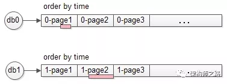
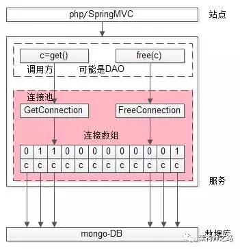
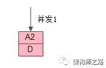
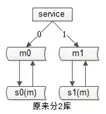

### PHP 实践

#### 1.单KEY业务，数据库水平切分架构实践

以“用户中心”为例，介绍“单KEY”类业务，随着数据量的逐步增大，数据库性能显著降低，数据库水平切分相关的架构实践：

- 如何来实施水平切分
- 水平切分后常见的问题
- 典型问题的优化思路及实践

##### 1、用户中心

用户中心是一个非常常见的业务，主要提供==用户注册、登录、信息查询与修改==的服务，其核心元数据为：

User(uid, login_name, passwd, sex, age, nickname, …)

其中：

- uid为用户ID，主键
- login_name, passwd, sex, age, nickname, …等用户属性

数据库设计上，一般来说在业务**初期**，==单库单表==就能够搞定这个需求，典型的架构设计为：


- user-center：用户中心服务，对调用者提供友好的RPC接口
- user-db：对用户进行数据存储

##### 2、用户中心水平切分方法

当**数据量越来越大时**，需要对数据库进行==水平切分==，常见的水平切分算法有**“范围法”和“哈希法”**。

**范围法**，以用户中心的业务主键uid为划分依据，将数据水平切分到两个数据库实例上去：


- user-db1：存储0到1千万的uid数据
- user-db2：存储1到2千万的uid数据

范围法的**优点**是：

- ==切分策略简单==，根据uid，按照范围，user- center很快能够定位到数据在哪个库上
- ==扩容简单==，如果容量不够，只要增加user-db3即可

范围法的**不足**是：

- uid必须要满足==递增的特性==
- ==数据量不均==，新增的user-db3，在初期的数据会比较少
- ==请求量不均==，一般来说，新注册的用户活跃度会比较高，故user-db2往往会比user-db1负载要高，导致服务器利用率不平衡


**哈希法**，也是以用户中心的业务主键uid为划分依据，将数据水平切分到两个数据库实例上去：


- user-db1：存储uid取模得1的uid数据
- user-db2：存储uid取模得0的uid数据

哈希法的**优点**是：

- ==切分策略简单==，根据uid，按照hash，user-center很快能够定位到数据在哪个库上
- ==数据量均衡==，只要uid是均匀的，数据在各个库上的分布一定是均衡的
- ==请求量均衡==，只要uid是均匀的，负载在各个库上的分布一定是均衡的


哈希法的**不足**是：

- ==扩容麻烦==，如果容量不够，要增加一个库，重新hash可能会导致数据迁移，如何平滑的进行数据迁移，是一个需要解决的问题


##### 3、用户中心水平切分后带来的问题

###### 使用uid来进行水平切分之后，整个用户中心的业务访问会遇到什么问题呢？

==对于uid属性上的查询可以直接路由到库==，假设访问uid=124的数据，取模后能够直接定位db-user1：


==对于非uid属性上的查询，例如login_name属性上的查询，就悲剧了：==


假设访问login_name=shenjian的数据，由于不知道数据落在哪个库上，往往需要遍历所有库，当分库数量多起来，性能会显著降低。


##### 4、用户中心非uid属性查询需求分析

用户中心非uid属性上经常有两类业务需求：

（1）**用户侧，前台访问**，最典型的有两类需求

​		==用户登录==：通过login_name/phone/email查询用户的实体，1%请求属于这种类型

​		==用户信息查询==：登录之后，通过uid来查询用户的实例，99%请求属这种类型


用户侧的查询基本上是单条记录的查询，访问量较大，服务需要高可用，并且对一致性的要求较高。

 

（2）**运营侧，后台访问**，根据产品、运营需求，访问模式各异，按照==年龄、性别、头像、登陆时间、注册时间来进行查询==。

运营侧的查询基本上是批量分页的查询，由于是内部系统，访问量很低，对可用性的要求不高，对一致性的要求也没这么严格。

 

这两类不同的业务需求，应该使用什么样的架构方案来解决呢？


##### 5、用户中心水平切分架构思路

用户中心在数据量较大的情况下，使用uid进行水平切分，对于非uid属性上的查询需求，架构设计的核心思路为：

- 针对**用户侧**，应该采用“==建立非uid属性到uid的映射关系==”的架构方案
- 针对**运营侧**，应该采用“==前台与后台分离==”的架构方案


##### 6、用户中心-用户侧最佳实践

**【索引表法】**

**思路**：uid能直接定位到库，login_name不能直接定位到库，如果通过login_name能查询到uid，问题解决


**解决方案**：

- 建立一个索引表记录login_name->uid的映射关系
- 用login_name来访问时，先通过索引表查询到uid，再定位相应的库
- 索引表属性较少，可以容纳非常多数据，一般不需要分库
- 如果数据量过大，可以通过login_name来分库


潜在**不足**：==多一次数据库查询，性能下降一倍==


**【login_name生成uid】**

**思路**：不进行远程查询，由login_name直接得到uid


**解决方案**：

- 在用户注册时，设计函数login_name生成uid，uid=f(login_name)，按uid分库插入数据
- 用login_name来访问时，先通过函数计算出uid，即uid=f(login_name)再来一遍，由uid路由到对应库


潜在**不足**：==该函数设计需要非常讲究技巧，有uid生成冲突风险==


**【login_name基因融入uid】**

**思路**：不能用login_name生成uid，可以从login_name抽取“基因”，融入uid中


假设分8库，采用uid%8路由，潜台词是，uid的最后3个bit决定这条数据落在哪个库上，这3个bit就是所谓的“基因”。

**解决方案**：

- 在用户注册时，设计函数login_name生成3bit基因，login_name_gene=f(login_name)，如上图粉色部分
- 同时，生成61bit的全局唯一id，作为用户的标识，如上图绿色部分
- 接着把3bit的login_name_gene也作为uid的一部分，如上图屎黄色部分
- 生成64bit的uid，由id和login_name_gene拼装而成，并按照uid分库插入数据
- 用login_name来访问时，先通过函数由login_name再次复原3bit基因，login_name_gene=f(login_name)，通过login_name_gene%8直接定位到库


##### 7、用户中心-运营侧最佳实践

前台**用户侧**，业务需求基本都是==单行记录==的访问，只要建立非uid属性 login_name / phone / email 到uid的映射关系，就能解决问题。


后台**运营侧**，业务需求各异，基本是==批量分页==的访问，这类访问计算量较大，返回数据量较大，比较消耗数据库性能。

 

如果此时前台业务和后台业务公用一批服务和一个数据库，有可能导致，由于后台的“少数几个请求”的“批量查询”的“低效”访问，导致数据库的cpu偶尔瞬时100%，影响前台正常用户的访问（例如，登录超时）。


而且，为了满足后台业务各类“奇形怪状”的需求，往往会在数据库上建立各种索引，这些索引占用大量内存，会使得用户侧前台业务uid/login_name上的查询性能与写入性能大幅度降低，处理时间增长。

对于这一类业务，应该采用“==前台与后台分离==”的架构方案：


用户侧前台业务需求架构依然不变，产品运营侧后台业务需求则**抽取独立的web / service / db 来支持**，==解除系统之间的耦合==，对于“业务复杂”“并发量低”“无需高可用”“能接受一定延时”的后台业务：

- 可以去掉service层，在运营后台web层通过dao直接访问db
- 不需要反向代理，不需要集群冗余
- 不需要访问实时库，可以通过MQ或者线下异步同步数据
- 在数据库非常大的情况下，可以使用更契合大量数据允许接受更高延时的“索引外置”或者“HIVE”的设计方案


##### 8、总结

将以“用户中心”为典型的“单KEY”类业务，水平切分的架构点，本文做了这样一些介绍。

 

**水平切分方式**：

- 范围法

- 哈希法

  

**水平切分后碰到的问题**：

- 通过uid属性查询能直接定位到库，通过非uid属性查询不能定位到库

  

**非uid属性查询的典型业务**：

- 用户侧，前台访问，单条记录的查询，访问量较大，服务需要高可用，并且对一致性的要求较高

- 运营侧，后台访问，根据产品、运营需求，访问模式各异，基本上是批量分页的查询，由于是内部系统，访问量很低，对可用性的要求不高，对一致性的要求也没这么严格

  

**这两类业务的架构设计思路**：

- 针对用户侧，应该采用“建立非uid属性到uid的映射关系”的架构方案
- 针对运营侧，应该采用“前台与后台分离”的架构方案


**用户前台侧，“建立非uid属性到uid的映射关系”最佳实践**：

- 索引表法：数据库中记录login_name->uid的映射关系
- 缓存映射法：缓存中记录login_name->uid的映射关系
- login_name生成uid
- login_name基因融入uid


**运营后台侧，“前台与后台分离”最佳实践**：

- 前台、后台系统web/service/db分离解耦，避免后台低效查询引发前台查询抖动
- 可以采用数据冗余的设计方式
- 可以采用“外置索引”（例如ES搜索系统）或者“大数据处理”（例如HIVE）来满足后台变态的查询需求


#### 2. 架构设计中常见“反向依赖”与解耦方案

##### 1、缘起

很多公司，技术经常遇到这样的场景：

​	1）硬件升级，要换一台高配机器

​	2）网络重新规划，若干服务器要调整机架

​	3）服务器当机，要重新部署恢复服务


更具体的，如上图：==数据库换了一个ip，此时往往连接此数据库的上游需要修改配置重启==，如果数据库有很多上游调用方，改配置重启的调用方会很多，每次换ip的成本往往很高，成为大家共性的痛点。

由A的调整（数据库换ip），配合修改和调整的却是BCDE（改配置重启），BCDE内心非常的郁闷：明明换ip的是你，凭什么配合重启的却是我？

根本上，这是一个“架构耦合”的问题，是一个**架构设计上“反向依赖”的问题**，本文将讨论的是架构设计中常见的“反向依赖”的设计，以及对应的优化方案，希望对大伙有所启示。

##### 2、如何寻找不合理“反向依赖”

**方法论**：

==变动方是A，配合方却是BCDE==

（或者说==需求方是A，改动方确是BCDE==）

想想“换IP的是你，配合重启的却是我”更好理解。

如果系统中经常出现了这类情况，就是“反向依赖”的特征，往往架构上有优化的空间。


##### 3、常见的“反向依赖”与优化方案

**【case1：公共库导致耦合】**


三个服务s1/s2/s3，通过一个公共的库biz.jar来实现一段业务逻辑，s1/s2/s3其实间接通过biz.jar耦合在了一起，==一个业务s1修改一块公共的代码，导致影响其他业务s2/s3==，架构上是不合理的。

**优化方案1：业务垂直拆分**


如果biz.jar中实现的逻辑“业务特性”很强，可以拆分为biz1.jar/biz2.jar/biz3.jar，来对s1/s2/s3进行解耦。这样的话，==任何业务的改动，影响范围只是自己，不会影响其他人==。

**优化方案2：服务化**

0

如果biz.jar中实现的逻辑“业务共性”很强，可以将biz.jar优化为biz.service服务，来对s1/s2/s3进行解耦。服务化之后，兼容性能更好的通过接口自动化回归测试来保证。

基础服务的抽象，本身是一种共性聚焦，是系统解耦常见的方案。


**【case2：服务化不彻底导致耦合】**


服务化是解决“业务共性”组件库导致系统耦合的常见方案之一，但如果服务化不彻底，service本身也容易成为业务耦合点。

 

典型的服务化不彻底导致的业务耦合的特征是，共性服务中，包含大量“根据不同业务，执行不同个性分支”的代码。

switch (biz-type)

case biz-1 : exec1

case biz-2 : exec2

case biz-3 : exec3

...

在这种架构下，==biz-1/biz-2/biz-3有个性的业务需求，可能导致修改代码的是共性的biz-service，使其成为研发瓶颈==，架构上也是不合理的。

**优化方案：业务特性代码上浮，业务共性代码下沉，彻底解耦**


把swithc case中业务==特性代码放到业务层实现==，这样biz-1/biz-2/biz-3有个性的业务需求，升级的是自己的业务系统。


**【case3：notify的不合理实现导致的耦合】**


《[究竟什么时候该使用MQ](http://mp.weixin.qq.com/s?__biz=MjM5ODYxMDA5OQ==&mid=2651960012&idx=1&sn=c6af5c79ecead98daa4d742e5ad20ce5&chksm=bd2d07108a5a8e0624ae6ad95001c4efe09d7ba695f2ddb672064805d771f3f84bee8123b8a6&scene=21#wechat_redirect)》一文中有一类业务场景，==消息发送方不关注消息接收方的执行结果==，如果采用调用的方式来实现通知，会==导消息发送方和消息接收方耦合==。

 ==如何新增消息接收方biz-4，会发现修改代码的是消息发送方==，新增一个对biz-4的调用，极不合理。

**优化方案：通过MQ实现解耦**


消息发送方upper将消息发布给MQ，消息接收方从MQ去订阅，==任何新增对消息的消费，upper都不需要修改代码==。


**【case4：配置中的ip导致上下游耦合】**


即“缘起”中举的例子，==下游服务换ip，可能导致多个服务调用方修改配置重启==。上下游间接的通过ip这个配置耦合在了一起，架构不合理。

**优化方案：通过内网域名而不是ip来进行下游连接**


如果在配置中使用==内网域名来进行下游连接==，当下游服务或者数据库更换ip时，只需要**运维层面将内网域名指向新的ip，然后统一切断原有旧的连接**，连接就能够==自动切换==到新的ip上来。这个过程不需要所有上游配合，非常帅气，强烈推荐！


**【case5：下游扩容导致上下游耦合】**


这次不是换换ip这么简单了，下游服务提供方原来是集群（ip1/ip2/ip3，当然，上游配置的是内网域名），现在==集群要扩容为（ip1/ip2/ip3/ip4/ip5）==，如果没有特殊的架构设计，上游往往需要修改配置，新增扩容后的节点，再重启，导致上下游耦合。


##### 4、总结

**如何发现系统架构中不合理的“反向依赖”设计？**

回答：

（1）变动方是A，配合方却是BCDE

（2）需求方是A，改动方确是BCDE

想想“换IP的是你，配合重启的却是我”，此时往往架构上可以进行解耦优化。

 

**常见反向依赖及优化方案？**

（1）==公共库导致耦合==

**优化一**：如果公共库是==业务特性代码==，进行公共库**垂直拆分**

**优化二**：如果公共库是==业务共性代码==，进行**服务化**下沉抽象


（2）==服务化不彻底导致耦合==

**特征**：服务中包==含大量“根据不同业务，执行不同个性分支”的代码==

**优化方案**：个性代码放到业务层实现，**将服务化更彻底更纯粹**


（3）==notify的不合理实现导致的耦合==

**特征**：调用方不关注执行结果，==以调用的方式去实现通知==，新增订阅者，修改代码的是发布者

**优化方案**：**通过MQ解耦**


（4）==配置中的ip导致上下游耦合==

**特征**：==多个上游需要修改配置重启==

**优化方案**：**使用内网域名替代内网ip**，通过“修改DNS指向，统一切断旧连接”的方式来上游无感切换


（5）==下游扩容导致上下游耦合==

特性：==多个上游需要修改配置重启==


#### 3.互联网架构如何实现“高可用”

##### 1、什么是高可用？

**高可用HA****（**High Availability）是分布式系统架构设计中必须考虑的因素之一，它通常是指，==通过设计减少系统不能提供服务的时间==。

假设系统一直能够提供服务，我们说系统的可用性是100%。

如果系统每运行100个时间单位，会有1个时间单位无法提供服务，我们说系统的可用性是99%。

很多公司的高可用目标是4个9，也就是99.99%，这就意味着，系统的年停机时间为8.76个小时。


##### 2、如何保障系统的高可用?

我们都知道，单点是系统高可用的大敌，单点往往是系统高可用最大的风险和敌人，应该尽量在系统设计的过程中避免单点。==方法论上，高可用保证的原则是“集群化”，或者叫“冗余”==：只有一个单点，挂了服务会受影响；如果有冗余备份，挂了还有其他backup能够顶上。

**保证系统高可用，架构设计的核心准则是：冗余。**

有了冗余之后，还不够，每次出现故障需要人工介入恢复势必会增加系统的不可服务实践。所以，又往往是==通过“自动故障转移”来实现系统的高可用==。

接下来我们看下典型互联网架构中，如何通过**冗余+自动故障转移**来保证系统的高可用特性。


##### 3、常见的互联网分层架构


常见互联网分布式架构如上，分为：

（1）**客户端层**：典型调用方是浏览器browser或者手机应用APP

（2）**反向代理层**：系统入口，反向代理

（3）**站点应用层**：实现核心应用逻辑，返回html或者json

（4）**服务层**：如果实现了服务化，就有这一层

（5）**数据-缓存层**：缓存加速访问存储

（6）**数据-数据库层**：数据库固化数据存储

整个系统的高可用，又是通过每一层的**冗余+自动故障转移**来综合实现的。


##### 4、分层高可用架构实践

**【客户端层->反向代理层】的高可用**


【客户端层】到【反向代理层】的**高可用**，是通过反向代理层的冗余来实现的。以nginx为例：有两台nginx，一台对线上提供服务，另一台冗余以保证高可用，常见的实践是keepalived存活探测，相同virtual IP提供服务。


**自动故障转移**：当nginx挂了的时候，keepalived能够探测到，会自动的进行故障转移，将流量自动迁移到shadow-nginx，由于使用的是相同的virtual IP，这个切换过程对调用方是透明的。


**【反向代理层->站点层】的高可用**


【反向代理层】到【站点层】的**高可用**，是通过站点层的冗余来实现的。假设反向代理层是nginx，nginx.conf里能够配置多个web后端，并且nginx能够探测到多个后端的存活性。


**自动故障转移**：当web-server挂了的时候，nginx能够探测到，会自动的进行故障转移，将流量自动迁移到其他的web-server，整个过程由nginx自动完成，对调用方是透明的。


**【站点层->服务层】的高可用**


【站点层】到【服务层】的**高可用**，是通过服务层的冗余来实现的。“服务连接池”会建立与下游服务多个连接，每次请求会“随机”选取连接来访问下游服务。


**自动故障转移**：当service挂了的时候，service-connection-pool能够探测到，会自动的进行故障转移，将流量自动迁移到其他的service，整个过程由连接池自动完成，对调用方是透明的（所以说RPC-client中的服务连接池是很重要的基础组件）。


**【服务层>缓存层】的高可用**


【服务层】到【缓存层】的高可用，是通过缓存数据的冗余来实现的。

缓存层的数据冗余又有几种方式：第一种是利用客户端的封装，service对cache进行双读或者双写。


缓存层也可以通过支持主从同步的缓存集群来解决缓存层的**高可用**问题。

以redis为例，redis天然支持主从同步，redis官方也有sentinel哨兵机制，来做redis的存活性检测。


**自动故障转移**：当redis主挂了的时候，sentinel能够探测到，会通知调用方访问新的redis，整个过程由sentinel和redis集群配合完成，对调用方是透明的。

 

说完缓存的高可用，这里要多说一句，业务对缓存并不一定有“高可用”要求，==更多的对缓存的使用场景，是用来“加速数据访问”==：把一部分数据放到缓存里，如果缓存挂了或者缓存没有命中，是可以去后端的数据库中再取数据的。

这类允许“cache miss”的业务场景，缓存架构的建议是：


==将kv缓存封装成服务集群==，上游设置一个代理（代理可以用集群冗余的方式保证高可用），代理的后端根据缓存访问的key水平切分成若干个实例，每个实例的访问并不做高可用。


**缓存实例挂了屏蔽**：当有水平切分的实例挂掉时，代理层直接返回cache miss，此时缓存挂掉对调用方也是透明的。key水平切分实例减少，==不建议做re-hash，这样容易引发缓存数据的不一致==。


**【服务层>数据库层】的高可用**

大部分互联网技术，数据库层都用了“主从同步，读写分离”架构，所以数据库层的高可用，又分为==“读库高可用”与“写库高可用”==两类。


**【服务层>数据库层“读”】的高可用**


【服务层】到【数据库读】的**高可用**，是通过读库的冗余来实现的。

既然冗余了读库，一般来说就至少有2个从库，“数据库连接池”会建立与读库多个连接，每次请求会路由到这些读库。


**自动故障转移**：当读库挂了的时候，db-connection-pool能够探测到，会自动的进行故障转移，将流量自动迁移到其他的读库，整个过程由连接池自动完成，对调用方是透明的（所以说DAO中的数据库连接池是很重要的基础组件）。


**【服务层>数据库层“写”】的高可用**


【服务层】到【数据库写】的**高可用**，是通过写库的冗余来实现的。

以mysql为例，可以设置两个mysql双主同步，一台对线上提供服务，另一台冗余以保证高可用，常见的实践是keepalived存活探测，相同virtual IP提供服务。


**自动故障转移**：当写库挂了的时候，keepalived能够探测到，会自动的进行故障转移，将流量自动迁移到shadow-db-master，由于使用的是相同的virtual IP，这个切换过程对调用方是透明的。


##### 5、总结

高可用HA（High Availability）是分布式系统架构设计中必须考虑的因素之一，它通常是指，通过设计减少系统不能提供服务的时间。

方法论上，高可用是通过**冗余****+****自动故障转移**来实现的。

整个互联网分层系统架构的高可用，又是通过每一层的**冗余****+****自动故障转移**来综合实现的，具体的：

（1）【客户端层】到【反向代理层】的高可用，是==通过反向代理层的冗余实现的==，常见实践是keepalived + virtual IP自动故障转移

（2）【反向代理层】到【站点层】的高可用，是==通过站点层的冗余实现的==，常见实践是nginx与web-server之间的存活性探测与自动故障转移

（3）【站点层】到【服务层】的高可用，是==通过服务层的冗余实现的==，常见实践是通过service-connection-pool来保证自动故障转移

（4）【服务层】到【缓存层】的高可用，是==通过缓存数据的冗余实现的==，常见实践是缓存客户端双读双写，或者利用缓存集群的主从数据同步与sentinel保活与自动故障转移；更多的业务场景，对缓存没有高可用要求，可以使用缓存服务化来对调用方屏蔽底层复杂性

（5）【服务层】到【数据库“读”】的高可用，是==通过读库的冗余实现的==，常见实践是通过db-connection-pool来保证自动故障转移

（6）【服务层】到【数据库“写”】的高可用，是==通过写库的冗余实现的==，常见实践是keepalived + virtual IP自动故障转移


#### 4.互联网架构如何实现“高并发”

##### 1、什么是高并发？

**高并发（**High Concurrency）是互联网分布式系统架构设计中必须考虑的因素之一，它通常是指，==通过设计保证系统能够同时并行处理很多请求==。


高并发相关常用的一些指标有响应时间（Response Time），吞吐量（Throughput），每秒查询率QPS（Query Per Second），并发用户数等。


**响应时间**：系统对请求做出响应的时间。例如系统处理一个HTTP请求需要200ms，这个200ms就是系统的响应时间。

**吞吐量**：单位时间内处理的请求数量。

**QPS**：每秒响应请求数。在互联网领域，这个指标和吞吐量区分的没有这么明显。

**并发用户数**：同时承载正常使用系统功能的用户数量。例如一个即时通讯系统，同时在线量一定程度上代表了系统的并发用户数。


##### 2、如何提升系统的并发能力？

互联网分布式架构设计，==提高系统并发能力的方式，方法论上主要有两种：垂直扩展（Scale Up）与水平扩展（Scale Out）==。

**垂直扩展**：提升单机处理能力。垂直扩展的方式又有两种：

（1）增强单机硬件性能，例如：增加CPU核数如32核，升级更好的网卡如万兆，升级更好的硬盘如SSD，扩充硬盘容量如2T，扩充系统内存如128G；

（2）提升单机架构性能，例如：使用Cache来减少IO次数，使用异步来增加单服务吞吐量，使用无锁数据结构来减少响应时间；


在互联网业务发展非常迅猛的早期，如果预算不是问题，强烈建议使用“增强单机硬件性能”的方式提升系统并发能力，因为这个阶段，公司的战略往往是发展业务抢时间，而“增强单机硬件性能”往往是最快的方法。

 

不管是提升单机硬件性能，还是提升单机架构性能，都有一个致命的不足：单机性能总是有极限的。所以==互联网分布式架构设计高并发终极解决方案还是水平扩展==。


**水平扩展**：只要增加服务器数量，就能线性扩充系统性能。水平扩展对系统架构设计是有要求的，如何在架构各层进行可水平扩展的设计，以及互联网公司架构各层常见的水平扩展实践，是本文重点讨论的内容。


##### 3、常见的互联网分层架构


常见互联网分布式架构如上，分为：

（1）**客户端层**：典型调用方是浏览器browser或者手机应用APP

（2）**反向代理层**：系统入口，反向代理

（3）**站点应用层**：实现核心应用逻辑，返回html或者json

（4）**服务层**：如果实现了服务化，就有这一层

（5）**数据-缓存层**：缓存加速访问存储

（6）**数据-数据库层**：数据库固化数据存储

整个系统各层次的水平扩展，又分别是如何实施的呢？


##### 4、分层水平扩展架构实践

**反向代理层的水平扩展**


反向代理层的水平扩展，是通过“DNS轮询”实现的：dns-server对于一个域名配置了多个解析ip，每次DNS解析请求来访问dns-server，会轮询返回这些ip。

当nginx成为瓶颈的时候，只要增加服务器数量，新增nginx服务的部署，增加一个外网ip，就能扩展反向代理层的性能，做到理论上的无限高并发。

**站点层的水平扩展**


站点层的水平扩展，是通过“nginx”实现的。通过修改nginx.conf，可以设置多个web后端。

当web后端成为瓶颈的时候，只要增加服务器数量，新增web服务的部署，在nginx配置中配置上新的web后端，就能扩展站点层的性能，做到理论上的无限高并发。


**服务层的水平扩展**


服务层的水平扩展，是通过“服务连接池”实现的。

站点层通过RPC-client调用下游的服务层RPC-server时，RPC-client中的连接池会建立与下游服务多个连接，当服务成为瓶颈的时候，只要增加服务器数量，新增服务部署，在RPC-client处建立新的下游服务连接，就能扩展服务层性能，做到理论上的无限高并发。如果需要优雅的进行服务层自动扩容，这里可能需要配置中心里服务自动发现功能的支持。


**数据层的水平扩展**

在数据量很大的情况下，数据层（缓存，数据库）涉及数据的水平扩展，将原本存储在一台服务器上的数据（缓存，数据库）水平拆分到不同服务器上去，以达到扩充系统性能的目的。

 

互联网数据层常见的水平拆分方式有这么几种，以数据库为例：

**按照范围水平拆分**


每一个数据服务，存储一定范围的数据，上图为例：

user0库，存储uid范围1-1kw

user1库，存储uid范围1kw-2kw

这个方案的好处是：

（1）规则简单，service只需判断一下uid范围就能路由到对应的存储服务；

（2）数据均衡性较好；

（3）比较容易扩展，可以随时加一个uid[2kw,3kw]的数据服务；

不足是：

（1）   请求的负载不一定均衡，一般来说，新注册的用户会比老用户更活跃，大range的服务请求压力会更大；


**按照哈希水平拆分**


每一个数据库，存储某个key值hash后的部分数据，上图为例：

user0库，存储偶数uid数据

user1库，存储奇数uid数据

这个方案的好处是：

（1）规则简单，service只需对uid进行hash能路由到对应的存储服务；

（2）数据均衡性较好；

（3）请求均匀性较好；

不足是：

（1）不容易扩展，扩展一个数据服务，hash方法改变时候，可能需要进行数据迁移；

 

这里需要注意的是，通过水平拆分来扩充系统性能，与主从同步读写分离来扩充数据库性能的方式有本质的不同。

通过水平拆分扩展数据库性能：

（1）每个服务器上存储的数据量是总量的1/n，所以单机的性能也会有提升；

（2）n个服务器上的数据没有交集，那个服务器上数据的并集是数据的全集；

（3）数据水平拆分到了n个服务器上，理论上读性能扩充了n倍，写性能也扩充了n倍（其实远不止n倍，因为单机的数据量变为了原来的1/n）；

通过主从同步读写分离扩展数据库性能：

（1）每个服务器上存储的数据量是和总量相同；

（2）n个服务器上的数据都一样，都是全集；

（3）理论上读性能扩充了n倍，写仍然是单点，写性能不变；

 

缓存层的水平拆分和数据库层的水平拆分类似，也是以范围拆分和哈希拆分的方式居多，就不再展开。


##### 5、总结

**高并发（**High Concurrency）是互联网分布式系统架构设计中必须考虑的因素之一，它通常是指，==通过设计保证系统能够同时并行处理很多请求==。

==提高系统并发能力的方式，方法论上主要有两种：垂直扩展（Scale Up）与水平扩展（Scale Out）==。前者垂直扩展可以通过提升单机硬件性能，或者提升单机架构性能，来提高并发性，但单机性能总是有极限的，==互联网分布式架构设计高并发终极解决方案还是后者：水平扩展==。

互联网分层架构中，各层次水平扩展的实践又有所不同：

（1）反向代理层可以通过“DNS轮询”的方式来进行水平扩展；

（2）站点层可以通过nginx来进行水平扩展；

（3）服务层可以通过服务连接池来进行水平扩展；

（4）数据库可以按照数据范围，或者数据哈希的方式来进行水平扩展；

各层实施水平扩展后，能够通过增加服务器数量的方式来提升系统的性能，做到理论上的性能无限。


#### 5.典型数据库架构设计与实践

##### 1、用户中心

**用户中心**是一个常见业务，主要提供用户注册、登录、信息查询与修改的服务，其核心元数据为：

User(uid, uname, passwd, sex, age,nickname, …)

其中：

- uid为用户ID，主键
- uname, passwd, sex, age, nickname, …等为用户的属性

数据库设计上，一般来说在业务初期，单库单表就能够搞定这个需求。


##### 2、图示说明

为了方便大家理解，后文图片说明较多，其中：

- “灰色”方框，表示service，服务
- “紫色”圆框，标识master，主库
- “粉色”圆框，表示slave，从库


##### 3、单库架构


最常见的架构设计如上：

- user-service：用户中心服务，对调用者提供友好的RPC接口
- user-db：一个库进行数据存储

##### 4、分组架构


**什么是分组？**

**答**：分组架构是最常见的==一主多从，主从同步，读写分离==数据库架构：

- user-service：依旧是用户中心服务
- user-db-M(master)：主库，提供数据库写服务
- user-db-S(slave)：从库，提供数据库读服务

==主和从构成的数据库集群称为“组”==。

**分组有什么特点？**

**答**：同一个组里的数据库集群：

- 主从之间通过binlog进行数据同步
- 多个实例数据库结构完全相同
- 多个实例存储的数据也完全相同，本质上是将数据进行复制


**分组架构究竟解决什么问题？**

**答**：==大部分互联网业务读多写少==，**数据库的读往往最先成为性能瓶颈**，如果希望：

- 线性提升数据库读性能
- 通过消除读写锁冲突提升数据库写性能
- 通过冗余从库实现数据的“读高可用”

此时可以使用分组架构，需要注意的是，==分组架构中，数据库的主库依然是写单点==。

一句话总结，**分组解决的是“数据库读写高并发量高”问题**，所实施的架构设计。


##### 5、分片架构


**什么是分片？**

**答**：分片架构是大伙常说的==水平切分==(sharding)数据库架构：

- user-service：依旧是用户中心服务
- user-db1：水平切分成2份中的第一份
- user-db2：水平切分成2份中的第二份

分片后，多个数据库实例也会构成一个数据库集群。


**水平切分，到底是分库还是分表？**

**答**：==强烈建议分库==，而不是分表，因为：

- 分表依然公用一个数据库文件，仍然有磁盘IO的竞争
- 分库能够很容易的将数据迁移到不同数据库实例，甚至数据库机器上，扩展性更好


**水平切分，用什么算法？**

**答**：常见的水平切分算法有“==范围法==”和“==哈希法==”：


**范围法**如上图：以用户中心的业务主键uid为划分依据，将数据水平切分到两个数据库实例上去：

- user-db1：存储0到1千万的uid数据
- user-db2：存储0到2千万的uid数据


**哈希法**如上图：也是以用户中心的业务主键uid为划分依据，将数据水平切分到两个数据库实例上去：

- user-db1：存储uid取模得1的uid数据
- user-db2：存储uid取模得0的uid数据

这两种方法在互联网都有使用，其中哈希法使用较为广泛。


**分片有什么特点？**

**答**：同一个分片里的数据库集群：

- 多个实例之间本身不直接产生联系，不像主从间有binlog同步
- 多个实例数据库结构，也完全相同
- 多个实例存储的数据之间没有交集，所有实例间数据并集构成全局数据

 

**分片架构究竟解决什么问题？**

**答**：大部分互联网业务数据量很大，单库容量容易成为瓶颈，此时通过分片可以：

- 线性提升数据库写性能，需要注意的是，分组架构是不能线性提升数据库写性能的
- 降低单库数据容量

 

一句话总结，**分片解决的是“数据库数据量大”问题**，所实施的架构设计。


##### 6、分组+分片架构


如果业务**读写并发量很高，数据量也很大**，通常需要实施==分组+分片==的数据库架构：

- 通过分片来降低单库的数据量，线性提升数据库的写性能
- 通过分组来线性提升数据库的读性能，保证读库的高可用


##### 7、垂直切分

除了水平切分，垂直切分也是一类常见的数据库架构设计，==垂直切分一般和业务结合比较紧密==。


还是以用户中心为例，可以这么进行垂直切分：

User(uid, uname, passwd, sex, age, …)

User_EX(uid, intro, sign, …)

- 垂直切分开的表，主键都是uid
- 登录名，密码，性别，年龄等属性放在一个垂直表（库）里
- 自我介绍，个人签名等属性放在另一个垂直表（库）里


**如何进行垂直切分？**

**答**：根据业务对数据进行垂直切分时，一般要考虑属性的“==长度==”和“==访问频度==”两个因素：

- 长度较短，访问频率较高的放在一起
- 长度较长，访问频度较低的放在一起

这是因为，数据库会以行(row)为单位，将数据load到内存(buffer)里，在内存容量有限的情况下，长度短且访问频度高的属性，内存能够load更多的数据，命中率会更高，磁盘IO会减少，数据库的性能会提升。

 

**垂直切分有什么特点？**

**答**：垂直切分和水平切有相似的地方，又不太相同：

- 多个实例之间也不直接产生联系，即没有binlog同步
- 多个实例数据库结构，都不一样
- 多个实例存储的数据之间至少有一列交集，一般来说是业务主键，所有实例间数据并集构成全局数据


**垂直切分解决什么问题？**

**答**：垂直切分即可以==降低单库的数据量==，还可以==降低磁盘IO从而提升吞吐量==，但它与业务结合比较紧密，并不是所有业务都能够进行垂直切分的。

 

##### 8、总结

文章较长，希望至少记住这么几点：

- 业务初期用==单库==
- 读压力大，读高可用，用==分组==
- 数据量大，写线性扩容，用==分片==
- 属性短，访问频度高的属性，==垂直拆分==到一起


#### 6.session一致性架构设计实践

##### 1、缘起

**什么是session？**

服务器为每个用户创建一个会话，存储用户的相关信息，以便多次请求能够定位到同一个上下文。

Web开发中，web-server可以自动为同一个浏览器的访问用户自动创建session，提供数据存储功能。最常见的，会把用户的登录信息、用户信息存储在session中，以保持登录状态。


**什么是session一致性问题？**

只要用户不重启浏览器，每次http短连接请求，理论上服务端都能定位到session，保持会话。


当只有一台web-server提供服务时，每次http短连接请求，都能够正确路由到存储session的对应web-server（废话，因为只有一台）。

此时的web-server是无法保证高可用的，采用“冗余+故障转移”的==多台web-server来保证高可用时，每次http短连接请求就不一定能路由到正确的session了==。


如上图，假设用户包含登录信息的session都记录在第一台web-server上，反向代理如果将请求路由到另一台web-server上，可能就找不到相关信息，而导致用户需要重新登录。 

在web-server高可用时，如何保证session路由的一致性，是今天将要讨论的问题。


##### 2、session同步法


**思路**：==多个web-server之间相互同步session==，这样每个web-server之间都包含全部的session

 

**优点**：web-server支持的功能，==应用程序不需要修改代码==

 

**不足**：

- session的同步需要数据传输，==占内网带宽**==，有时延
- 所有web-server都包含所有session数据，数据量==受内存限制，无法水平扩展==
- ==有更多web-server时要歇菜==


##### 3、客户端存储法


**思路**：服务端存储所有用户的session，内存占用较大，可以将==session存储到浏览器cookie中==，每个端只要存储一个用户的数据了

**优点**：==服务端不需要存储==

**缺点**：

- 每次http请求都携带session，==占外网带宽==
- 数据存储在端上，并在网络传输，存在泄漏、篡改、窃取等==安全隐患==
- session==存储的数据大小受cookie限制==

“端存储”的方案虽然不常用，但确实是一种思路。


##### 3、反向代理hash一致性

**思路**：web-server为了保证高可用，有多台冗余，反向代理层能不能做一些事情，让==同一个用户的请求保证落在一台web-server上==呢？


**方案一：四层代理hash**

反向代理层使用==用户ip来做hash==，以保证同一个ip的请求落在同一个web-server上


**方案二：七层代理hash**

反向代理使用http协议中的==某些业务属性来做hash==，例如sid，city_id，user_id等，能够更加灵活的实施hash策略，以保证同一个浏览器用户的请求落在同一个web-server上

**优点**：

- 只需要改nginx配置，==不需要修改应用代码==
- ==负载均衡==，只要hash属性是均匀的，多台web-server的负载是均衡的
- 可以==支持web-server水平扩展==（session同步法是不行的，受内存限制）

 

**不足**：

- ==如果web-server重启，一部分session会丢失==，产生业务影响，例如部分用户重新登录
- 如果web-server水平扩展，==rehash后session重新分布，也会有一部分用户路由不到正确的session==

 

session一般是有有效期的，所有不足中的两点，可以认为等同于部分session失效，一般问题不大。

 

==对于四层hash还是七层hash，个人推荐前者==：**让专业的软件做专业的事情**，反向代理就负责转发，尽量不要引入应用层业务属性，除非不得不这么做（例如，有时候多机房多活需要按照业务属性路由到不同机房的web-server）。


##### 4、后端统一存储


**思路**：==将session存储在web-server后端的存储层==，数据库或者缓存

 

**优点**：

- ==没有安全隐患==
- ==可以水平扩展==，数据库/缓存水平切分即可
- web-server重启或者扩容都==不会有session丢失==

 

**不足**：增加了一次网络调用，并且==需要修改应用代码==

 

==对于db存储还是cache，个人推荐后者==：session读取的频率会很高，数据库压力会比较大。如果有session高可用需求，cache可以做高可用，但大部分情况下session可以丢失，一般也不需要考虑高可用。


##### 5、总结

**保证session一致性**的架构设计常见方法：

- ==session同步法==：多台web-server相互同步数据
- ==客户端存储法==：一个用户只存储自己的数据
- ==反向代理hash一致性==：四层hash和七层hash都可以做，保证一个用户的请求落在一台web-server上
- ==后端统一存储==：web-server重启和扩容，session也不会丢失

 

==对于方案3和方案4，个人建议推荐后者==：

- **web层、service层无状态是大规模分布式系统设计原则之一**，session属于状态，不宜放在web层
- **让专业的软件做专业的事情**，web-server存session？还是让cache去做这样的事情吧


#### 7.TCP接入层的负载均衡、高可用、扩展性架构

##### 1、web-server的负载均衡


互联网架构中，==web-server接入一般使用nginx来做反向代理==，实施负载均衡。整个架构分三层：

- **上游调用层**，一般是browser或者APP
- **中间反向代理层**，nginx
- **下游真实接入集群**，web-server，常见web-server的有tomcat，apache

 

整个访问过程为：

- browser向daojia.com发起请求
- DNS服务器将daojia.com解析为==外网IP==(1.2.3.4)
- browser通过外网IP(1.2.3.4)访问nginx
- nginx实施负载均衡策略，常见策略有轮询，随机，IP-hash等
- nginx将请求转发给==内网IP==(192.168.0.1)的web-server

由于==http短连接，以及web应用无状态==的特性，理论上**任何一个http请求落在任意一台web-server都应该得到正常处理**（如果必须落在一台，说明架构不合理，不能水平扩展）。

问题来了，==tcp是有状态的连接==，客户端和服务端一旦建立连接，**一个client发起的请求必须落在同一台tcp-server上**，此时如何做负载均衡，如何保证水平扩展呢？


##### 2、单机法tcp-server


单个tcp-server显然是可以保证请求一致性：

- client向tcp.daojia.com发起tcp请求
- DNS服务器将tcp.daojia.com解析为外网IP(1.2.3.4)
- client通过外网IP(1.2.3.4)向tcp-server发起请求

 

**方案的缺点？**

==无法保证高可用。==


##### 3、集群法tcp-server


==通过搭建tcp-server集群来保证高可用==，**客户端来实现负载均衡**：

- client内配置有tcp1/tcp2/tcp3.daojia.com三个tcp-server的外网IP
- 客户端通过“随机”的方式选择tcp-server，假设选择到的是tcp1.daojia.com
- 通过DNS解析tcp1.daojia.com
- 通过外网IP连接真实的tcp-server


**如何保证高可用呢？**

==如果client发现某个tcp-server连接不上，则选择另一个。==

 

**潜在的缺点？**

每次连接前，需要多实施一次DNS访问：

- ==难以预防DNS劫持==
- 多一次DNS访问意味着==更长的连接时间==，这个不足在手机端更为明显

 

**如何解决DNS的问题？**

直接将IP配置在客户端，可以解决上述两个问题，很多公司也就是这么做的（俗称“**IP直通车**”）。

 

**“IP直通车”有什么新问题？**

将IP写死在客户端，在客户端实施负载均衡，==扩展性很差==：

- ==如果原有IP发生变化==，客户端得不到实时通知
- ==如果新增IP==，即tcp-sever扩容，客户端也得不到实时通知
- ==如果负载均衡策略变化==，需要升级客户端


##### 4、服务端实施负载均衡

==只有将复杂的策略下沉到服务端，才能根本上解决扩展性的问题。==


==增加一个http接口，将客户端的“IP配置”与“均衡策略”放到服务端==是一个不错的方案：

- client每次访问tcp-server前，先调用一个**新增的get-tcp-ip接口**，对于client而言，==这个http接口只返回一个tcp-server的IP==
- 这个http接口，实现的是原client的IP均衡策略
- 拿到tcp-server的IP后，和原来一样向tcp-server发起TCP长连接

 

这样的话，扩展性问题就解决了：

- 如果原有IP发生变化，只需要修改get-tcp-ip接口的配置
- 如果新增IP，也是修改get-tcp-ip接口的配置
- 如果负载均衡策略变化，需要升级客户端

 

然而，**新的问题**又产生了，如果所有IP放在客户端，当有一个IP挂掉的时候，client可以再换一个IP连接，保证可用性，而get-tcp-ip接口只是维护静态的tcp-server集群IP，对于这些==IP对应的tcp-server是否可用==，是完全不知情的，怎么办呢？


##### 5、tcp-server状态上报


get-tcp-ip接口怎么知道tcp-server集群中各台服务器是否可用呢，==tcp-server主动上报是一个潜在方案==，如果某一个tcp-server挂了，则会终止上报，对于停止上报状态的tcp-server，get-tcp-ip接口，将不返回给client相应的tcp-server的外网IP。

 

**该设计的存在的问题？**

诚然，状态上报解决了tcp-server高可用的问题，但这个设计犯了一个==“反向依赖”的耦合小错误==：使得tcp-server要依赖于一个与本身业务无关的web-server。


##### 6、tcp-server状态拉取


**更优的方案**是：==web-server通过“拉”的方式获取各个tcp-server的状态==，而不是tcp-server通过“推”的方式上报自己的状态。

 

这样的话，==每个tcp-server都独立与解耦==，只需专注于资深的tcp业务功能即可。


**高可用、负载均衡、扩展性**等任务==由get-tcp-ip的web-server专注来执行==。

 

多说一句，==将负载均衡实现在服务端==，还有一个**好处**，可以实现==异构tcp-server的负载均衡==，以及==过载保护==：

- **静态实施**：web-server下的多个tcp-server的IP可以配置负载权重，根据tcp-server的机器配置分配负载（nginx也有类似的功能）
- **动态实施**：web-server可以根据“拉”回来的tcp-server的状态，动态分配负载，并在tcp-server性能极具下降时实施过载保护


##### 7、总结

**web-server如何实施负载均衡？**

==利用nginx反向代理来轮询、随机、ip-hash。==

 

**tcp-server怎么快速保证请求一致性？**

==单机。==

 

**如何保证高可用？**

==客户配置多个tcp-server的域名。==

 

**如何防止DNS劫持，以及加速？**

==IP直通车，客户端配置多个tcp-server的IP。==

 

**如何保证扩展性？**

==服务端提供get-tcp-ip接口==，向client屏屏蔽负载均衡策略，并实施便捷扩容。

 

**如何保证高可用？**

==tcp-server“推”==状态给get-tcp-ip接口，

or

==get-tcp-ip接口“拉”==tcp-server状态。


#### 8.配置中心架构设计演进

##### 1、缘起

随着互联网业务的越来越复杂，用户量与流量越来越大，==“服务化分层”是架构演进的必由之路==。


如上图：站点应用会调用服务，上游服务调用底层服务，**依赖关系会变得非常复杂**。

对于同一个服务，它有多个上游调用。为了保证高可用，==一个底层服务往往是若干个节点形成一个集群提供服务。==


如上图：用户中心服务user-service有三个节点，ip1/ip2/ip3对上游提供服务，任何一个节点当机，都不影响服务的可用性。

那么**问题来了**，当==服务集群增减节点的时候==，是否存在“反向依赖”，是否“耦合”，是否**上游调用方需要修改配置重启**，是否能做到上游无感知，即“配置的架构变迁”，是今天需要讨论的问题。

##### 2、配置私藏

“配置私藏”是配置文件架构的最初级阶段，上游调用下游，==每个上游都有一个专属的私有配置文件==，记录被调用下游的每个节点配置信息。


如上图：

1）用户中心user-service有ip1/ip2/ip3三个节点

2）service1调用了用户中心，它有一个专属配置文件s1.conf，里面配置了us的集群是ip1/ip2/ip3

3）service2也调用了用户中心，同理有个配置文件s2.conf，记录了us集群是ip1/ip2/ip3

4）web2也调用了用户中心，同理w2.conf，配置了us集群是ip1/ip2/ip3

是不是很熟悉？

没错，绝大部分公司，初期都是这么玩的。

**配置私藏架构的缺点是什么呢？**


来看一个容量变化的需求：

1）运维检测出ip1节点的硬盘性能下降，通知研发未来要将==ip1节点下线==

2）由于5月8日要做大促运营活动，未来流量会激增，研发准备==增加两个节点ip4和ip5==

**此时要怎么做呢？**


需要==用户中心的负责人通知所有上游调用者==，**修改“私藏”的配置，并重启上游**，连接到新的集群上去。在ip1上没有流量之后，**通知运维将ip1节点下线**，以完成整个缩容扩容过程。

 

大伙是这么做的么？当业务复杂度较高，研发人数较多，服务依赖关系较复杂的时候，就没这么简单了。

 

**问题一**：==调用方很痛==，**容量变化的是你，凭啥修改配置重启的是我**？这是一个典型的“反向依赖”架构设计，上下游通过配置耦合，值得优化（特别是上层服务，ta依赖的服务很多的时候，可能每周都有类似的配合重启需求）。

 

**问题二**：==服务方很痛==，**ta不知道有多少个上游调用了自己**（特别是底层基础服务，像用户中心这种，调用ta的上游很多），往往只能通过以下方式来定位上游：

 	a）**群里吼**

​     b）**发邮件询问**

​     c）**通过连接找到ip，通过ip问运维，找到机器负责人，再通过机器负责人找到对应调用服务**

（似曾相识的请转发=_=）

不管哪种方式，都很有可能遗漏，导致ip1一直有流量难以下线，ip4/ip5的流量难以均匀迁移过来。该如何优化呢？

##### 3、全局配置

架构的升级并不是一步到位的，先来用最低的成本来解决上述“修改配置重启”的问题一。


“全局配置”法：对于通用的服务，==建立全局配置文件，消除配置私藏==：

1）**运维层面制定规范**，==新建全局配置文件==，例如/opt/globalconf/global.conf，如果配置较多，注意做好配置的垂直拆分

2）**对于服务方**，如果是通用的服务，==集群信息配置在global.conf里==

3）**对于调用方**，调用方禁止配置私藏，==必须从global.conf里读取通用下游配置==

这么做的**好处**：

1）如果下游**容量变化**，==只需要修改一处==配置global.conf，而不需要各个上游修改

2）**调用方下一次重启的时候**，==自动迁移==到扩容后的集群上来了

3）**修改成本非常小**，==读取配置文件目录变了==

 

**不足**：

==如果调用方一直不重启，就没有办法将流量迁移到新集群上去了==

**有没有方面实现自动流量迁移呢？**


答案是肯定的，只需要实现**两个并不复杂的组件**，就能实现调用方的流量自动迁移：

1）**文件监控组件FileMonitor**

作用是监控文件的变化，起一个timer，定期监控文件的ModifyTime或者md5就能轻松实现，当文件变化后，实施回调。

2）**动态连接池组件DynamicConnectionPool**

“连接池组件”是RPC-client中的一个子组件，用来维护与多个RPC-server节点之间的连接。所谓**“动态连接池”**，是指==连接池中的连接可以动态增加和减少==（用锁来互斥或者线程安全的数据结构很容易实现）。

这两个组件完成后：

1）一旦全局配置文件变化，文件监控组件实施回调

2）如果动态连接池组件发现配置中减少了一些节点，就动态的将对应连接销毁，如果增加了一些节点，就动态建立连接，==自动完成下游节点的增容与缩容==。


##### 4、配置中心

**全局配置文件**是一个能够快速落地的，==解决“修改配置重启”问题==的方案，但它仍然解决不了，服务提供方“==不知道有多少个上游调用了自己==”这个问题。

 

如果不知道多少上游调用了自己，

==“按照调用方限流”==

==“绘制全局架构依赖图”==

等需求便**难以实现**，怎么办，可以**采用“配置中心”来解决**。


对比“全局配置”与“配置中心”的架构图，会发现==配置由静态的文件 升级为 动态的服务==：

1）整个**配置中心子系统**由zk、conf-center服务，DB配置存储与，conf-web配置后台组成

2）所有**下游服务的配置**，==通过后台设置在配置中心里==

3）所有**上游需要拉取配置**，需要去==配置中心注册==，拉取下游服务配置信息（ip1/ip2/ip3）


**当下游服务需要扩容缩容时**：

4）==conf-web配置后台进行设置==，新增ip4/ip5，减少ip1

5）conf-center服务将==变更的配置推送给已经注册关注相关配置的调用方==

6）结合==动态连接池组件==，完成**自动的扩容与缩容**

配置中心的**好处**：

1）==调用方不需要再重启==

2）服务方从配置中心中很==清楚的知道上游依赖关系==，从而实施按照调用方限流

3）很容易从配置中心==得到全局架构依赖关系==

**痛点一、痛点二同时解决**。

 

**不足**：系统复杂度相对较高，对配置中心的可靠性要求较高，==一处挂全局挂==。


##### 5、总结

**解决什么问题？**

==配置导致系统耦合，架构反向依赖。==

 

**什么痛点？**

**上游痛：**==扩容的是下游，改配置重启的是上游==

**下游痛：**==不知道谁依赖于自己==

 

**配置架构如何演进？**

一、配置私藏

二、全局配置文件

三、配置中心


#### 9.跨公网调用的大坑与架构优化方案

##### 1、缘起与大坑

很多时候，业务需要跨公网调用一个第三方服务提供的接口，为了避免每个调用方都依赖于第三方服务，往往会抽象一个服务：

- 解除调用方与第三方接口的耦合
- 当第三方的接口变动时，只有服务需要修改，而不是所有调用方均修改


此时**接口调用流程是什么样的呢？**


如上图1-4所述：

（1）业务调用方调用内部service

（2）内部service跨公网调用第三方接口

（3）第三方接口返回结果给内部service

（4）内部service返回结果给业务调用方

 

**这个过程存在什么潜在的大坑呢？**


内部服务可能对上游业务提供了很多服务接口，==当有一个接口跨公网第三方调用超时时，可能导致所有接口都不可用==，即使大部分接口不依赖于跨公网第三方调用。

**为什么会出现这种情况呢？**

内部服务对业务方提供的==N个接口，会共用服务容器内的工作线程==（假设有100个工作线程）。

假设这N个接口的某个接口跨公网依赖于第三方的接口，发生了网络抖动，或者接口超时（不妨设超时时间为5秒）。


潜台词是，这个==工作线程会被占用5秒钟==，然后超时返回业务调用方。

假设这个请求的吞吐量为20qps，言下之意，很短的时间内，==所有的100个工作线程都会被卡在这个第三方超时等待上==，而其他N-1个原本没有问题的接口，也得不到工作线程处理。

**潜在优化方案？**

- ==增大工作线程数==（不根本解决问题）
- ==降低超时时间==（不根本解决问题）
- ==垂直拆分==，N个接口拆分成若干个服务，使得在出问题时，被牵连的接口尽可能少（依旧不根本解决问题，难道一个服务只提供一个接口吗？）

 

跨公网调用的稳定性优化，是本文要讨论的问题。


##### 2、异步代理法

**业务场景**：==通过OpenID实时获取微信用户基本信息==

**解决方案**：==增加一个代理，向服务屏蔽究竟是“本地实时”还是“异步远程”去获取返回结果==


**本地实时流程**如上图1-5：

（1）业务调用方调用内部service

（2）内部service调用异步代理service

（3）异步代理service通过OpenID在本地拿取数据

（4）异步代理service将数据返回内部service

（5）内部service返回结果给业务调用方

 

**异步远程流程**如上图6-8粗箭头的部分：

（6）异步代理service定期跨公网调用微信服务

（7）微信服务返回数据

（8）刷新本地数据

 

**优点**：公网抖动，第三方接口超时，不影响内部接口调用

**不足**：本地返回的不是最新数据（很多业务可以接受数据延时）

 

有时候，内部service和异步代理service可以==合成一个service==


##### 3、第三方接口备份与切换法

**业务场景**：调用==第三方短信网关，或者电子合同等==

**解决方案**：==同时使用（或者备份）多个第三方服务==


**流程**如上图1-4：

（1）业务调用方调用内部service

（2）内部service调用第一个三方接口

（3）超时后，调用第二个备份服务，未来都直接调用备份服务，直到超时的服务恢复

（4）内部service返回结果给业务调用方

 

**优点**：公网抖动，第三方接口超时，不影响内部接口调用（初期少数几个请求会超时）

 

**不足**：不是所有公网调用都能够像短息网关，电子合同服务一样有备份接口的，像微信、支付宝等就只此一家


##### 4、**异步调用法**

**业务场景**：==本地结果，同步第三方服务==，例如用户在58到家平台下单，58到家平台需要通知平台商家为用户提供服务

**解决方案**：==本地调用成功就返回成功，异步调用第三方接口同步数据==（和异步代理有微小差别）


**本地流程**如上图1-3：

（1）业务调用方调用内部service

（2）内部service写本地数据

（3）内部service返回结果给业务调用方成功

 

**异步流程**如上图4-5粗箭头的部分：

（4）异步service定期将本地数据取出（或者通知也行，实时性好）

（5）异步调用第三方接口同步数据

 

**优点**：公网抖动，第三方接口超时，不影响内部接口调用

 

**不足**：不是所有业务场景都可以异步同步数据


##### 5、总结

跨公网调用第三方，**可能存在的问题**：

- ==公网抖动，第三方服务不稳定，影响自身服务==
- ==一个接口超时，占住工作线程，影响其他接口==

 

降低影响的**优化方案**：

- ==增大工作线程数==
- ==降低超时时间==
- ==服务垂直拆分==

 

==业务需求决定技术方案==，结合业务的解决方案：

- **业务能接受旧数据**：==读取本地数据，异步代理定期更新数据==
- **有多个第三方服务提供商**：==多个第三方互备==
- **向第三方同步数据**：==本地写成功就算成功，异步向第三方同步数据==


#### 10. DNS在架构设计中的巧用

##### 1、缘起

**一个http请求从客户端到服务端，整个执行流程是怎么样的呢？**


一个典型流程如上：

(1)客户端通过域名daojia.com请求dns-server

(2)dns-server返回域名对应的外网ip(1.2.3.4)

(3)客户端访问外网ip(1.2.3.4)向反向代理nginx

(4)反向代理nginx配置了多个后端web-server服务内网ip(192.168.0.1/192.168.0.2)

(5)请求最终落到某一个web-server进行处理

 

其中，第一个步骤域名daojia.com到外网ip(1.2.3.4)的转换，发生在整个服务端外部，服务端不可控。


架构设计时，能够巧用dns做一些什么事情呢，是本文要讨论的问题。


##### 2、反向代理水平扩展


典型的互联网架构中，可以通过增加web-server来扩充web层的性能，但**反向代理nginx仍是整个系统的唯一入口**，==如果系统吞吐超过nginx的性能极限，难以扩容==，此时就需要dns-server来配合水平扩展。


具体做法是：在dns-server对于同一个域名可以配置多个nginx的外网ip，==每次dns解析请求，轮询返回不同的ip==，这样就能实现nginx的水平扩展，这个方法叫“**dns轮询**”。


##### 3、web-server负载均衡


既然“dns轮询”可以将同一个域名的流量均匀分配到不同的nginx，那么也可以利用它来做web-server的负载均衡：

(1)架构中==去掉nginx层==

(2)将多个web-server的==内网ip直接改为外网ip==

(3)在dns-server将域名对应的外网ip进行==轮询解析==


**和nginx相比，dns来实施负载均衡有什么优缺点呢？**

**优点**：

- 利用第三方dns实施，服务端架构不用动
- 少了一层网络请求

 

**不足**：

- ==dns只具备解析功能，不能保证对应外网ip的可用性==（即使能够做80口的探测，实时性肯定也是比nginx差很多的），而nginx做反向代理时，与web-server之间有保活探测机制，当web-server挂掉时，能够自动迁移流量
- ==当web-server需要扩容时，通过dns扩容生效时间长==，而nginx是服务端完全自己可控的部分，web-server扩容更实时更方便

 

因为上面两个原因，**架构上很少取消反向代理层**，而直接使用dns来实施负载均衡。


##### 4、用户就近访问


如文章“缘起”中所述，http请求的第一个步骤域名到外网ip的转换，发生在整个服务端外部，服务端不可控，那么如果要实施“==根据客户端ip来分配最近的服务器机房访问==”，就只能在dns-server上做了：

(1)电信用户想要访问某一个服务器资源

(2)浏览器向dns-server发起服务器域名解析请求

(3)dns-server识别出访问者是电信用户

(4)dns-server将电信机房的nginx外网ip返回给访问者

(5)访问者就近访问

 

==根据用户ip来返回最近的服务器ip==，称为“**智能dns**”，**cdn**以及**多机房多活**中最常用。


##### 5、总结

架构设计中，dns有它独特的功能和作用：

- **dns轮询**，==水平扩展反向代理层==
- 去掉反向代理层，**利用dns实施负载均衡**
- **智能dns**，==根据用户ip来就近访问服务器==

#### 

#### 11. 互联网智能广告系统简易流程与架构

##### 1、业务简述


从业务上看  整个智能广告系统，主要分为：

1）**业务端**：广告主的广告后台

2）**展现端**：用户实际访问的页面


业务端，**广告主**主要有两类行为：

1）**广告设置行为**：例如设置投放计划，设置地域，类别，关键字，竞价等

2）**效果查看行为**：例如广告展示次数是多少，广告点击次数是多少等


展现端，**用户**主要也有两类行为：

1）**站点浏览行为**：用户浏览实际的信息，此时广告系统决定出广告主的什么广告

2）**广告点击行为**：此时广告系统会对广告主进行扣费


##### 2、业务流程

下面通过一个的例子，让业务流程更直观。


==步骤一：**广告主**在业务端投递广告==

广告主登录业务端后台，进行设置：

- 今日投放**地域**是“北京-上地”
- 投放**类别**是“租房”
- 定向**人群**为“女”，“30岁以下”
- 需要推广的广告**内容**是他发布的一条“房屋出租”的帖子
- **竞价**设置的是0.2元
- 单日**预算**是20元

这些数据，当然通过业务端存储到了数据层，即数据库和缓存里。


==步骤二：**用户**来到了网站，进入了“北京-上地-租房”类别，广告初筛实施==

用户产生了平台浏览行为，网站除了展示自然内容，还要展示广告内容。被展现的广告不能太离谱，太离谱用户也不会点击。


合适的广告，必须符合“**语义相关性**”，即**基础检索**==属性（广告属性）==必须符合（**广告能否满足用户的需求**，满足了点击率才高），这个工作是通过==BS-basic search==检索服务完成的。


BS从数据层检索到“北京-上地-租房”的广告帖子。


==步骤三：用户属性与广告主属性匹配，广告精筛实施==

步骤二中，基础属性初筛了以后，要进行**更深层次的策略筛选**（**用户能否满足广告的需求**），此例中，广告主的精准需求为：

- 用户**性别**为“女”
- 用户**年龄**为“30岁以下”
- 用户**访问IP**是“北京”


系统将初筛出来的M条广告和==用户属性==进行匹配筛选，又过滤掉了一部分，最后剩余N条待定广告，这些广告既满足用户的需求（初筛），这些用户也满足广告主的需求（精筛），后者是在==AS-advanced search==策略服务完成的。


==步骤四：综合排序，并返回Top X的广告==

经过步骤2和步骤3的初筛和精筛之后，待选的N条广告既能满足用户当前的需求，用户亦能满足广告主的筛选需求，但实际情况是，广告位只有3个，怎么办呢？就需要我们对N条广告进行综合打分排序（**满足平台的需求**，广告平台要多赚钱嘛）。

**打分排序的依据是什么呢？**

有人说按照==竞价==排序bid，出价高的打分高（这是大家对百度最大的误解，百度是cpc收费）

有人说按照==CTR点击率==排序，CTR高的点的人多（百度的kpi指标可不是pv）


出价高，但没人点击，广告平台没有收益；点击率高，但出价低，广告平台还是没有收益。**最终应该按照广告的出价与CTR的乘积作为综合打分排序的依据，bid\*CTR**。


既然bid*CTR是所有广告综合打分的依据，且==出价bid又是广告主事先设定好的，那么实际上，广告排序问题的核心又转向了广告CTR的预测==，**CTR预测**是推荐系统、广告系统、搜索系统里非常重要的一部分，是一个工程，算法，业务三方结合的问题，本文就不展开讨论了。


无论如何，N条广告，根据bid*预估CTR进行综合打分排序后，返回了打分最高的3个广告（广告位只有3个）。


有些系统没有第二步骤用户属性过滤，而是将用户属性因素考虑到综合排序中。

==步骤五：展现端展示了广告，用户点击了广告==

展示了广告后，展现端js会上报广告**展示日志**，有部分用户点击了广告，服务端会记录**点击日志**，这些日志可以作为广告算法实施的数据源，同时，他们经过统计分析之后，会被展示给广告主，让他们能够看到自己广告的展示信息，点击信息。


这些日志（一般会实施AB测），也是算法效果好坏评估的重要依据，根据效果逐步优化改进算法。


==步骤六：对广告主进行扣费==

用户既然点击了广告，平台就要对投放广告的广告主进行**扣费**了，扣费前当然要经过反作弊系统的过滤（主要是恶意点击），扣费后信息会实时反映到数据层，费用扣光后，广告就要从数据层下线。


##### 3、系统综述


聊完业务流程，再来看系统架构，任何脱离业务的架构设计都是耍流氓。


从系统分层架构上看，智能广告系统分为三层：

- **站点层**：用户和广告主直接面向的网站站点

- **服务层**：为了实现智能广告的业务逻辑，提供的通用服务，此处又主要分为**四大类服务**：

  策略服务BS：实施广告策略，综合排序

  检索服务AS：语义相关性检索

  计费服务：用户点击广告时进行扣费

  反作弊服务：不是每次点击都扣费，要经过反作弊，去除恶意点击（相对独立，未在架构图中画出）

- **数据层**：用户数据，广告数据，竞价数据，日志数据等等等等


##### 4、总结

智能广告系统的业务流程与系统架构：

1）**广告主投放与设置广告**

2）**用户访问平台，展现合适广告**

  通过==**广告属性**==，进行“==语义相关性==”初筛，通过BS完成

  通过==**用户属性**==，出价信息，点击率预测信息，进行==综合打分排序==筛选，通过AS完成

3）**记录展现日志，点击日志，进行扣费**


广告是展现，是一个：

- 广告满足用户需求（初筛）
- 用户满足广告需求（精筛）
- 平台利益最大化（bid*CTR综合排序）

的过程


**广告的排序**==不是由出价(bid)决定的==，而是==由出价(bid)*点击率(ctr)决定的==。


**点击率(ctr)**是一个==未来将要发生的行为==，智能广告系统的**核心与难点**是==点击率预测==。


#### 12. 数据库秒级平滑扩容架构方案

##### 1、缘起

（1）==并发量大，流量大==的互联网架构，一般来说，数据库上层都有一个**服务层**，服务层记录了==“业务库名”与“数据库实例”的映射关系==，通过**数据库连接池**向数据库路由sql语句以执行：


如上图：服务层配置用户库user对应的数据库实例物理位置为ip（其实是一个内网域名）。

（2）随着数据量的增大，数据要进行**水平切分**，分库后将数据分布到不同的数据库实例（甚至物理机器）上，以达到降低数据量，增强性能的扩容目的：


如上图：用户库user分布在两个实例上，ip0和ip1，服务层通过用户标识==uid取模的方式进行寻库路由==，模2余0的访问ip0上的user库，模2余1的访问ip1上的user库。

（3）互联网架构需要保证**数据库高可用**，常见的一种方式，使用==双主同步+keepalived+虚ip==的方式保证数据库的可用性：


如上图：两个相互同步的主库使用相同的虚ip。


如上图：当==主库挂掉的时候，虚ip自动漂移到另一个主库==，**整个过程对调用方透明**，通过这种方式保证数据库的高可用。

（4）综合上文的（2）和（3），线上实际的架构，==既有水平切分，又有高可用保证==，所以实际的数据库架构是这样的：


 

**提问**：如果数据量持续增大，分2个库性能扛不住了，该怎么办呢？

**回答**：==继续水平拆分，拆成更多的库==，降低单库数据量，增加库主库实例（机器）数量，提高性能。


**最终问题抛出**：分成x个库后，随着数据量的增加，要增加到y个库，==数据库扩容的过程中，能否平滑，持续对外提供服务，保证服务的可用性==，是本文要讨论的问题。


##### 2、停服务方案

在讨论平滑方案之前，先简要说明下“x库拆y库”停服务的方案：

（1）站点==挂一个公告==“为了为广大用户提供更好的服务，本站点/游戏将在今晚00:00-2:00之间升级，届时将不能登录，用户周知”

（2）==停服务==

（3）==新建y个库==，做好高可用

（4）==数据迁移，重新分布==，写一个数据迁移程序，从x个库里导入到y个库里，路由规则由%x升级为%y

（5）==修改服务配置==，原来x行配置升级为y行

（6）==重启服务==，连接新库重新对外提供服务

整个过程中，**最耗时的是第四步数据迁移**。

 

**回滚方案**：

如果数据迁移失败，或者迁移后测试失败，则将配置改回x库，恢复服务，改天再挂公告。

 

**方案优点**：简单

**方案缺点**：

（1）停服务，不高可用

（2）技术同学压力大，所有工作要在规定时间内做完，根据经验，压力越大约容易出错（这一点很致命）

（3）如果有问题第一时间没检查出来，启动了服务，运行一段时间后再发现有问题，难以回滚，需要回档，可能会丢失一部分数据

 

有没有更平滑的方案呢？

##### 3、秒级、平滑、帅气方案


再次看一眼扩容前的架构，分两个库，假设每个库1亿数据量，如何**平滑扩容，增加实例数，降低单库数据量**呢？三个简单步骤搞定。

**（1）修改配置**


主要修改两处：

a）数据库实例所在的机器做==双虚ip==，原来%2=0的库是虚ip0，现在增加一个虚ip00，%2=1的另一个库同理

b）修改==服务的配置==（不管是在配置文件里，还是在配置中心），将2个库的数据库配置，改为4个库的数据库配置，**修改的时候要注意旧库与辛苦的映射关系**：

%2=0的库，会变为%4=0与%4=2；

%2=1的部分，会变为%4=1与%4=3；

这样修改是为了保证，==拆分后依然能够路由到正确的数据==。


**（2）reload配置，实例扩容**


服务层reload配置，reload可能是这么几种方式：

a）比较原始的，==重启服务==，读新的配置文件

b）高级一点的，==配置中心给服务发信号==，重读配置文件，重新初始化数据库连接池


不管哪种方式，reload之后，数据库的**实例扩容就完成了**，原来是2个数据库实例提供服务，现在变为4个数据库实例提供服务，这个过程一般可以在秒级完成。

 

整个过程可以逐步重启，**对服务的正确性和可用性完全没有影响**：

a）即使%2寻库和%4寻库同时存在，也不影响数据的正确性，因为此时仍然是双主数据同步的

b）服务reload之前是不对外提供服务的，冗余的服务能够保证高可用

 

完成了实例的扩展，会发现==每个数据库的数据量依然没有下降==，所以第三个步骤还要做一些收尾工作。


**（3）收尾工作，数据收缩**


有这些一些**收尾工作**：

a）把==双虚ip修改回单虚ip==

b）==解除旧的双主同步==，让成对库的数据不再同步增加

c）==增加新的双主同步==，保证高可用

d）==删除掉冗余数据==，例如：ip0里%4=2的数据全部干掉，只为%4=0的数据提供服务啦


这样下来，**每个库的数据量就降为原来的一半**，**数据收缩完成**。


##### 4. 总结


该帅气方案能够实现==n库扩2n库的秒级、平滑扩容，增加数据库服务能力，降低单库一半的数据量==，其核心原理是：**成倍扩容，避免数据迁移**。


**迁移步骤**：

（1）==修改配置==

（2）==reload配置==，**实例扩容**完成

（3）==删除冗余数据==等收尾工作，**数据量收缩**完成


### 13.  “跨库分页”的四种方案

##### 1、缘起

**分页需求**

互联网很多业务都有==分页拉取数据==的需求，例如：

（1）微信消息过多时，拉取第N页消息

（2）京东下单过多时，拉取第N页订单

（3）浏览58同城，查看第N页帖子

这些业务场景对应的消息表，订单表，帖子表分页拉取需求有这样一些特点：

（1）==有一个业务主键id==, 例如msg_id, order_id, tiezi_id

（2）分页排序是==按照非业务主键id来排序==的，业务中经常按照时间time来排序order by

在数据量不大时，**可以通过在排序字段time上建立索引，利用SQL提供的offset/limit功能就能满足分页查询需求**：

select * from t_msg order by time offset 200 limit 100

select * from t_order order by time offset 200 limit 100

select * from t_tiezi order by time offset 200 limit 100

此处假设一页数据为100条，均拉取第3页数据。


**分库需求**

高并发大流量的互联网架构，一般通过服务层来访问数据库，随着数据量的增大，数据库需要进行水平切分，分库后将数据分布到不同的数据库实例（甚至物理机器）上，以达到降低数据量，增加实例数的扩容目的。

 

一旦涉及分库，逃不开**“分库依据”patition key**的概念，使用哪一个字段来水平切分数据库呢：大部分的业务场景，会使用业务主键id。

 

确定了分库依据patition key后，接下来要确定的是**分库算法**：大部分的业务场景，会使用业务主键id取模的算法来分库，这样即能够保证每个库的数据分布是均匀的，又能够保证每个库的请求分布是均匀的，实在是简单实现负载均衡的好方法，此法在互联网架构中应用颇多。

 

举一个更具体的例子：


用户库user，水平切分后变为两个库，分库依据patition key是uid，分库算法是uid取模：uid%2余0的数据会落到db0，uid%2余1的数据会落到db1。


**问题的提出**

仍然是上述用户库的例子，如果业务要查询“最近注册的第3页用户”，该如何实现呢？单库上，可以

select * from t_user order by time offset 200 limit 100

变成两个库后，分库依据是uid，排序依据是time，数据库层失去了time排序的全局视野，数据分布在两个库上，此时该怎么办呢？

 

==如何满足“跨越多个水平切分数据库，且分库依据与排序依据为不同属性，并需要进行分页”的查询需求==，实现 select * from T order by time offset X limit Y的跨库分页SQL，是本文将要讨论的技术问题。


##### 2、全局视野法


如上图所述，服务层通过uid取模将数据分布到两个库上去之后，每个数据库都失去了全局视野，数据按照time局部排序之后，不管哪个分库的第3页数据，都不一定是全局排序的第3页数据。

 

那到底哪些数据才是全局排序的第3页数据呢，暂且分三种情况讨论。

（1）**极端情况**，==两个库的数据完全一样==


如果两个库的数据完全相同，只需要每个库offset一半，再取半页，就是最终想要的数据（如上图中粉色部分数据）。

（2）**极端情况**，==结果数据来自一个库==


也可能两个库的数据分布及其不均衡，例如db0的所有数据的time都大于db1的所有数据的time，则可能出现：一个库的第3页数据，就是全局排序后的第3页数据（如上图中粉色部分数据）。

（3）**一般情况**，==每个库数据各包含一部分==



常情况下，全局排序的第3页数据，每个库都会包含一部分（如上图中粉色部分数据）。

 

由于不清楚到底是哪种情况，所以==必须每个库都返回3页数据，所得到的6页数据在服务层进行内存排序，得到数据全局视野，再取第3页数据==，便能够得到想要的全局分页数据。

再总结一下这个方案的步骤：

（1）将order by time offset X limit Y，改写成order by time offset 0 limit X+Y

（2）服务层将改写后的SQL语句发往各个分库：即例子中的各取3页数据

（3）假设共分为N个库，服务层将得到N*(X+Y)条数据：即例子中的6页数据

（4）服务层对得到的N*(X+Y)条数据进行内存排序，内存排序后再取偏移量X后的Y条记录，就是全局视野所需的一页数据

**方案优点**：通过服务层修改SQL语句，扩大数据召回量，能够得到全局视野，业务无损，精准返回所需数据。

 

**方案缺点**（显而易见）：

（1）每个分库需要返回更多的数据，增大了网络传输量（耗网络）；

（2）除了数据库按照time进行排序，服务层还需要进行二次排序，增大了服务层的计算量（耗CPU）；

（3）最致命的，这个算法随着页码的增大，性能会急剧下降，这是因为SQL改写后每个分库要返回X+Y行数据：返回第3页，offset中的X=200；假如要返回第100页，offset中的X=9900，即每个分库要返回100页数据，数据量和排序量都将大增，性能平方级下降。


##### 3、业务折衷法

“全局视野法”虽然性能较差，但其业务无损，数据精准，不失为一种方案，有没有性能更优的方案呢？

 

“**任何脱离业务的架构设计都是耍流氓**”，技术方案需要折衷，在技术难度较大的情况下，==业务需求的折衷能够极大的简化技术方案==。

 

**业务折衷一：禁止跳页查询**

在数据量很大，翻页数很多的时候，很多产品并==不提供“直接跳到指定页面”的功能，而只提供“下一页”的功能==，这一个小小的业务折衷，就能极大的降低技术方案的复杂度。


如上图，不够跳页，那么第一次只能够查第一页：

（1）将查询order by time offset 0 limit 100，改写成order by time where time>0 limit 100

（2）上述改写和offset 0 limit 100的效果相同，都是每个分库返回了一页数据（上图中粉色部分）；


（3）服务层得到2页数据，内存排序，取出前100条数据，作为最终的第一页数据，这个全局的第一页数据，一般来说每个分库都包含一部分数据（如上图粉色部分）；

 

咦，这个方案也需要服务器内存排序，岂不是和“全局视野法”一样么？==第一页数据的拉取确实一样，但每一次“下一页”拉取的方案就不一样了==。

 

点击“下一页”时，需要拉取第二页数据，在第一页数据的基础之上，能够找到第一页数据time的最大值：


这个==上一页记录的time_max，会作为第二页数据拉取的查询条件==：

（1）将查询order by time offset 100 limit 100，改写成order by time where time>$time_max limit 100


（2）这下不是返回2页数据了（“全局视野法，会改写成offset 0 limit 200”），每个分库还是返回一页数据（如上图中粉色部分）；


（3）服务层得到2页数据，内存排序，取出前100条数据，作为最终的第2页数据，这个全局的第2页数据，一般来说也是每个分库都包含一部分数据（如上图粉色部分）；

 

如此往复，查询全局视野第100页数据时，不是将查询条件改写为offset 0 limit 9900+100（**返回100页数据**），而是改写为time>$time_max99 limit 100（**仍返回一页数据**），以保证数据的传输量和排序的数据量不会随着不断翻页而导致性能下降。

 

**业务折衷二：允许数据精度损失**

“全局视野法”能够返回业务无损的精确数据，在查询页数较大，例如第100页时，会有性能问题，此时业务上是否能够接受，返回的100页不是精准的数据，而允许有一些数据偏差呢？

 

**数据库分库-数据均衡原理**

使用patition key进行分库，在数据量较大，数据分布足够随机的情况下，各分库所有非patition key属性，在各个分库上的数据分布，统计概率情况是一致的。

 

例如，在uid随机的情况下，使用uid取模分两库，db0和db1：

（1）**性别**属性，如果db0库上的男性用户占比70%，则db1上男性用户占比也应为70%

（2）**年龄**属性，如果db0库上18-28岁少女用户比例占比15%，则db1上少女用户比例也应为15%

（3）**时间**属性，如果db0库上每天10:00之前登录的用户占比为20%，则db1上应该是相同的统计规律

…

 


利用这一原理，要查询全局100页数据，offset 9900 limit 100改写为offset 4950 limit 50，每个分库偏移4950（一半），获取50条数据（半页），得到的数据集的并集，基本能够认为，是全局数据的offset 9900 limit 100的数据，当然，这一页数据的精度，并不是精准的。

 

根据实际业务经验，用户都要查询第100页网页、帖子、邮件的数据了，这一页数据的精准性损失，业务上往往是可以接受的，但此时技术方案的复杂度便大大降低了，既不需要返回更多的数据，也不需要进行服务内存排序了。


##### 4、终极武器-二次查询法

有没有一种技术方案，==即能够满足业务的精确需要，无需业务折衷，又高性能的方法呢==？这就是接下来要介绍的终极武器：“二次查询法”。

 

为了方便举例，假设一页只有5条数据，查询第200页的SQL语句为select * from T order by time offset 1000 limit 5;

 

**步骤一：查询改写**

将select * from T order by time offset 1000 limit 5

改写为select * from T order by time offset 500 limit 5

并投递给所有的分库，注意，这个offset的500，来自于全局offset的总偏移量1000，除以水平切分数据库个数2。

 

如果是3个分库，则可以改写为select * from T order by time offset 333 limit 5

假设这三个分库返回的数据(time, uid)如下：


可以看到，每个分库都是返回的按照time排序的一页数据。

 

**步骤二：找到所返回3页全部数据的最小值**

第一个库，5条数据的time最小值是1487501123

第二个库，5条数据的time最小值是1487501133

第三个库，5条数据的time最小值是1487501143


故，三页数据中，time最小值来自第一个库，time_min=1487501123，这个过程只需要比较各个分库第一条数据，时间复杂度很低

 

**步骤三：查询二次改写**

第一次改写的SQL语句是select * from T order by time offset 333 limit 5

第二次要改写成一个between语句，between的起点是time_min，between的终点是原来每个分库各自返回数据的最大值：

第一个分库，第一次返回数据的最大值是1487501523

所以查询改写为select * from T order by time where time between time_min and 1487501523

 

第二个分库，第一次返回数据的最大值是1487501323

所以查询改写为select * from T order by time where time between time_min and 1487501323

 

第三个分库，第一次返回数据的最大值是1487501553

所以查询改写为select * from T order by time where time between time_min and 1487501553

 

相对第一次查询，第二次查询条件放宽了，故第二次查询会返回比第一次查询结果集更多的数据，假设这三个分库返回的数据(time, uid)如下：


可以看到：

由于time_min来自原来的分库一，所以分库一的返回结果集和第一次查询相同（所以其实这次访问是可以省略的）；

分库二的结果集，比第一次多返回了1条数据，头部的1条记录（time最小的记录）是新的（上图中粉色记录）；

分库三的结果集，比第一次多返回了2条数据，头部的2条记录（time最小的2条记录）是新的（上图中粉色记录）；

 

**步骤四：在每个结果集中虚拟一个time_min记录，找到time_min在全局的offset**


在第一个库中，time_min在第一个库的offset是333

在第二个库中，(1487501133, uid_aa)的offset是333（根据第一次查询条件得出的），故虚拟time_min在第二个库的offset是331

在第三个库中，(1487501143, uid_aaa)的offset是333（根据第一次查询条件得出的），故虚拟time_min在第三个库的offset是330

 

综上，time_min在全局的offset是333+331+330=994

 

**步骤五：既然得到了time_min在全局的offset，就相当于有了全局视野，根据第二次的结果集，就能够得到全局offset 1000 limit 5的记录**


第二次查询在各个分库返回的结果集是有序的，又知道了time_min在全局的offset是994，一路排下来，容易知道全局offset 1000 limit 5的一页记录（上图中黄色记录）。

 

是不是非常巧妙？这种方法的**优点**是：可以==精确的返回业务所需数据，每次返回的数据量都非常小，不会随着翻页增加数据的返回量==。


**不足是**：需要==进行两次数据库查询==。


##### 5、总结

今天介绍了解决“跨N库分页”这一难题的四种方法：

 

**方法一：全局视野法**

（1）将order by time offset X limit Y，改写成order by time offset 0 limit X+Y

（2）服务层对得到的N*(X+Y)条数据进行内存排序，内存排序后再取偏移量X后的Y条记录

这种方法==随着翻页的进行，性能越来越低==。

 

**方法二：业务折衷法-禁止跳页查询**

（1）用正常的方法取得第一页数据，并得到第一页记录的time_max

（2）每次翻页，将order by time offset X limit Y，改写成order by time where time>$time_max limit Y

以保证==每次只返回一页数据，性能为常量==。

 

**方法三：业务折衷法-允许模糊数据**

（1）将order by time offset X limit Y，改写成order by time offset X/N limit Y/N

 

**方法四：二次查询法**

（1）将order by time offset X limit Y，改写成order by time offset X/N limit Y

（2）找到最小值time_min

（3）between二次查询，order by time between $time_min and $time_i_max

（4）设置虚拟time_min，找到time_min在各个分库的offset，从而得到time_min在全局的offset

（5）得到了time_min在全局的offset，自然得到了全局的offset X limit Y


### 14. 四层/七层反向代理

场景：**访问**用户通过proxy请求**被访问**的真实服务器

路径：用户 -> ==proxy== -> real-server


**什么是代理？**

回答：==[proxy]代表[访问用户]==，此时proxy是**代理**。

例如：

在家访问xxoo网站，不希望xxoo网站trace到我们的真实ip，于是就找一个proxy，通过proxy来访问，==此时proxy代表用户==，**网站以为proxy的ip就是用户的ip**。


**什么是反向代理？**

回答：==[proxy]代表[被访问的服务器]==，此时proxy是**反向代理**。

例如：

web-server希望对用户屏蔽高可用、屏蔽web-server扩展、web-server内网ip等细节，于是就找了一个proxy隔在中间，==此时proxy代表web-server集群==，**用户以为proxy的ip就是被访问web-server的ip**（web-server是集群，具体访问了哪个web-server，用户不知道），由于web-server集群有多台，此时反向代理服务器要具备**负载均衡**的功能。


**一般怎么做反向代理，负载均衡？**

回答：nginx/apache，lvs，F5


**什么是四层（转发/交换），什么是七层（转发/交换）？**

回答：这个是来源于==OSI七层模型==

大学“计算机网络”课程，之前都是用这个七层模型，新版教程用TCP/IP五层模型，这两个模型之间有一个==对应关系==如下：


可以看到，**四层**==是指传输层==，**七层**==是指应用层==。

更具体的，对应到nginx反向代理hash：

- **四层**：根据==用户ip+port==来做hash
- **七层**：根据==http协议==中的某些属性来做hash


**为什么中间少了几层？**

回答：OSI应用层、表示层、会话层合并到TCP/IP的应用层啦。


**上面有四层，七层，那有没有二层，三层呢？**

回答：有

- 二层：根据**数据链路层**==MAC地址==完成数据交换
- 三层：根据**网络层**==IP地址==完成数据交换


### 15. Mysql 连接池

##### 1、如何通过连接访问下游

工程架构中有很多==访问下游==的需求，下游包括但不限于**服务/数据库/缓存**，其通讯步骤是为：

（1）与下游建立一个连接

（2）通过这个连接，收发请求

（3）交互结束，关闭连接，释放资源


这个连接是什么呢，通过连接怎么调用下游接口？服务/数据库/缓存，**官方会提供不同语言的Driver、Document、DemoCode来教使用方建立连接与调用接口**，以MongoDB的C++官方Driver API为例（伪代码）：

DBClientConnection* c = new DBClientConnection();

c->connect(“127.0.0.1:8888”);

c->insert(“db.s”, BSON(”shenjian”));

c->close();

 


这个DBClientConnection就是一个与MongoDB的连接，官方Driver通过它提供了若干API，让用户可以对MongoDB进行连接，增删查改，关闭的操作，从而实现不同的业务逻辑。


##### 2、为什么需要连接池

当并发量很低的时候，上述伪代码没有任何问题，但**当服务单机QPS达到几百、几千的时候**，==建立连接connect和销毁连接close就会成为瓶颈==，此时该如何优化？


结论也很简单，服务启动的时候，==先建立好若干连接==Array[DBClientConnection]，当有请求过来的时候，从Array中取出一个，执行下游操作，执行完再放回，==从而避免反复的建立和销毁连接==，以提升性能。


而**这个对Array[DBClientConnection]进行维护的数据结构，就是连接池**。有了连接池之后，数据库操作的伪代码变为：

DBClientConnection* c = ConnectionPool::GetConnection();

c->insert(“db.s”, BSON(”shenjian”));

ConnectionPool::FreeConnection(c);


##### 3、连接池核心接口与实现

通过上面的讨论，可以看到连接池ConnectionPool主要有三个核心接口：

（1）**Init**：初始化好Array[DBClientConnection]，这个接口只在服务启动时调用一次

（2）**GetConnection**：请求每次需要访问数据库时，不是connect一个连接，而是通过连接池的这个接口来拿

（3）**FreeConnection**：请求每次访问完数据库时，不是close一个连接，而是把这个连接放回连接池

 

连接池核心数据结构：

（1）**连接数组**Array DBClientConnection [N]

（2）**互斥锁数组**Array lock[N]

 

连接池核心接口实现：

Init(){

 for i = 1 to N {

 Array DBClientConnection [i] = new();

 Array DBClientConnection [i]->connect();

 Array lock[i] = 0;

 }

}

**说明**：==把所有连接和互斥锁初始化==


GetConnection()

 for i = 1 to N {

 if(Array lock[i] == 0){

  Array lock[i] = 1;

  return Array DBClientConnection[i];

  }

 }

}

**说明**：==找一个可用的连接，锁住，并返回连接==


FreeConnection(c)

 for i = 1 to N {

 if(Array DBClientConnection [i] == c){

  Array lock[i] = 0;

  }

 }

}

**说明**：==找到连接，把锁释放==



可以发现，简单的连接池管理并不是很复杂，基本原理即如上所述。


##### 4、未尽事宜

上述伪代码忽略了一些细节，在实现连接池中是需要考虑的：

（1）如果连接全部被占用，是返回失败，还是让上游等待

（2）需要实施连接==可用性检测==

（3）为了让调用方更友好，可能还需要包装一层DAO层，让“连接”这个东西对调用方都是黑盒的

（4）通过freeArray，connectionMap可以让==取连接和放回连接都达到O(1)时间复杂度==

（5）可以通过hash实现==id串行化==

（6）==负载均衡、故障转移、服务自动扩容==都可以在这一层实现


### 16. 负载LoadAverage

##### 1、什么是 Load Average?

系统==负载（System Load）是系统CPU繁忙程度的度量==，即有多少进程在等待被CPU调度（进程等待队列的长度）。

平均负载==（Load Average）是一段时间内系统的平均负载==，这个一段时间一般取1分钟、5分钟、15分钟。


##### 2、如何查看Load?

**top，uptime，w**等命令都可以查看系统负载：

```bash
[shenjian@dev02 ~]$ uptime

13:53:39 up 10 days, 2:15, 1 user, load average: 1.5, 2.5, 5.5
```

如上所示，dev02机器**1分钟平均负载，5分钟平均负载，15分钟平均负载**分别是1.5、2.5、5.5


##### 3、Load 的数值是什么含义？

把**CPU**比喻成一条（单核）==**马路**==，**进程任务**比喻成马路上跑着的==**汽车**==，**Load**则表示==**马路的繁忙程度**==。

==Load小于1==：不堵车，汽车在马路上跑得游刃有余：


[Load<1，单核]


==Load等于1==：马路已无额外的资源跑更多的汽车了：


[Load==1，单核]


==Load大于1==：汽车都堵着等待进入马路：


[Load>1，单核]


==如果有两个CPU==，则表示有两条马路，此时即使Load大于1也不代表有汽车在等待：


[Load==2，双核，没有等待]


##### 4、 什么样的Load值得警惕（单核）？

==Load < 0.7==时：系统很闲，马路上没什么车，要考虑多部署一些服务

==0.7 < Load < 1==时：系统状态不错，马路可以轻松应对

==Load == 1==时：系统马上要处理不多来了，赶紧找一下原因

==Load > 5==时：马路已经非常繁忙了，进入马路的每辆汽车都要无法很快的运行


##### 5、不同Load值说明什么问题？

结合具体情况具体分析：

1）==1分钟Load>5，5分钟Load<1，15分钟Load<1==：短期内繁忙，中长期空闲，初步判断是一个**“抖动”或者是“拥塞前兆”**

2）==1分钟Load>5，5分钟Load>1，15分钟Load<1==：短期内繁忙，中期内紧张，很可能是一个**“拥塞的开始”**

3）==1分钟Load>5，5分钟Load>5，15分钟Load>5==：短中长期都繁忙，系统**“正在拥塞”**

4）==1分钟Load<1，5分钟Load>1，15分钟Load>5==：短期内空闲，中长期繁忙，不用紧张，系统**“拥塞正在好转”**


### 17. Leader-Follower线程模型


上图就是L/F多线程模型的状态变迁图，共6个关键点：

（1）线程有==3种状态：领导leading，处理processing，追随following==

（2）假设共N个线程，其中只有==1个leading线程（等待任务），x个processing线程（处理）==，余下有==N-1-x个following线程（空闲）==

（3）有==**一把锁**，谁抢到就是leading==

（4）事件/任务来到时，==leading线程会对其进行处理==，从而转化为processing状态，**处理完成之后，又转变为following**

（5）==丢失leading后，following会尝试抢锁==，抢到则变为leading，否则保持following

（6）==following不干事，就是抢锁，力图成为leading==


优点：**不需要消息队列**


适用场景：**线程能够很快的完成工作任务**


有人说“并发量大时，L/F的锁容易成为系统瓶颈，需要引入一个消息队列解决。”


此观点不对，一个消息队列，其仍是临界资源，仍需要一把锁来保证互斥，只是锁竞争从leading移到了消息队列上，此时消息队列仅仅只能起到消息缓冲的作用。


**根本解决方案是降低锁粒度**（例如多个队列）。


### 18. 库存扣多了，到底怎么整 

##### 1、非并发场景


业务复杂、数据量大、并发量大的业务场景下，典型的互联网架构，一般会分为这么几层：

- 调用层，一般是处于端上的browser或者APP
- 站点层，一般是拼装html或者json返回的web-server层
- 服务层，一般是提供RPC调用接口的service层
- 数据层，提供固化数据存储的db


对于库存业务，一般有个库存服务，提供库存的**查询、扣减、设置**等RPC接口：


- **库存查询**，stock-service本质上执行的是

  select num from stock where sid=$sid

- **库存扣减**，stock-service本质上执行的是

  update stock set num=num-$reduce where sid=$sid

- **库存设置**，stock-service本质上执行的是

  update stock set num=$num_new where sid=$sid

 

用户下单前，一般会对库存进行查询，有足够的存量才允许扣减：


如上图所示，通过查询接口，得到库存是5。

 

用户下单时，接着会对库存进行扣减：


如上图所示，购买3单位的商品，通过扣减接口，最终得到库存是2。

希望设计往往有**容错机制**，例如“==重试==”，如果通过扣减接口来修改库存，在==重试时，可能会得到错误的数据，导致重复扣减==：


如上图所示，如果数据库层面有重试容错机制，可能导致一次扣减执行两次，最终得到一个负数的错误库存。

 

重试导致错误的**根本原因**，是因为==“扣减”操作是一个**非幂等**的操作==，不能够重复执行，改成设置操作则不会有这个问题：


如上图所示，同样是购买3单位的商品，通过设置库存操作，即使有重试容错机制，也不会得到错误的库存，==设置库存是一个**幂等**操作==。

 

##### 2、并发业务场景

在并发量很大的情况下，还会有其他的问题：


如上图所示，两个并发的操作，查询库存，都得到了库存是5。

 

接下来用户发生了**并发**的购买动作（秒杀类业务特别容易出现）：


如上图所示：

- 用户1购买了3个库存，于是库存要设置为2
- 用户2购买了2个库存，于是库存要设置为3
- 这两个设置库存的接口并发执行，**库存会先变成2，再变成3，导致数据不一致**（实际卖出了5件商品，但库存只扣减了2，==最后一次设置库存会覆盖和掩盖前一次并发操作==）

 

##### 3、不一致的原因

其**根本原因**是，==设置操作发生的时候，没有检查库存与查询出来的库存有没有变化==，理论上：

- 库存为5时，用户1的库存设置才能成功
- 库存为5时，用户2的库存设置才能成功

 

实际执行的时候：

- 库存为5，用户1的set stock 2确实应该成功
- 库存变为2了，用户2的set stock 3应该失败掉

 

##### 4、CAS优化

升级修改很容易，将库存设置接口，stock-service上执行的：

update stock set num=y where sid=​sid

升级为：

update stock set num=num_new where sid=​sid ==and num=$num_old==

这正是大家常说的“Compare And Set”（CAS），是一种常见的降低读写锁冲突，保证数据一致性的方法。

##### 5、 什么是ABA问题？

CAS乐观锁机制确实能够提升吞吐，并保证一致性，但在极端情况下可能会出现ABA问题。


**什么是ABA问题？**

考虑如下操作：

- 并发1（上）：获取出数据的初始值是A，后续计划实施CAS乐观锁，期望数据仍是A的时候，修改才能成功
- 并发2：将数据修改成B
- 并发3：将数据修改回A
- 并发1（下）：CAS乐观锁，检测发现初始值还是A，进行数据修改

上述并发环境下，==并发1在修改数据时，虽然还是A，但已经不是初始条件的A了==，中间发生了A变B，B又变A的变化，**此A已经非彼A**，数据却成功修改，可能导致错误，这就是CAS引发的所谓的ABA问题。

 

库存操作，出现ABA问题并不会对业务产生影响。

再看一个堆栈操作的例子：


并发1（上）：读取栈顶的元素为“A1”

 


并发2：进行了2次出栈

 


并发3：又进行了1次出栈

 


并发1（下）：实施CAS乐观锁，==发现栈顶还是“A1”，于是修改为A2==

 



此时会出现**系统错误**，==因为此“A1”非彼“A1”==


##### 6、ABA问题的优化

ABA问题导致的原因，是CAS过程中只==简单进行了“值”的校验==，再有些情况下，“值”相同不会引入错误的业务逻辑（例如库存），有些情况下，“值”虽然相同，却已经不是原来的数据了。

 

**优化方向**：CAS不能只比对“值”，==还必须确保的是原来的数据==，才能修改成功。

 

**常见实践**：==“版本号”的比对，一个数据一个版本==，版本变化，即使值相同，也不应该修改成功。

库存的并发读写例子，引入版本号的具体实践如下：

（1）库存表由

stock(sid, num)

升级为

stock(sid, num, ==**version**==)

 

（2）查询库存时同时查询版本号

select num from stock where sid=$sid

升级为

select num, ==**version**== from stock where sid=$sid


假设有并发操作，都会将版本号查询出来

 

（3）设置库存时，必须版本号相同，并且版本号要修改

旧版本**“值”比对**CAS

update stock set num=$num_new where sid=$sid and ==**num=$num_old**==

升级为**“版本号”比对**CAS

update stock set num=\$num_new, ==version=\$version_new==

 where sid=\$sid and ==**version=$version_old**==


此时假设有并发操作，第一个操作，比对版本号成功，于是把库存和版本号都进行了修改。

 


同时存在的第二个并发操作，比对版本号发生了变化，也是库存应该修改失败。


##### 7、总结

在业务复杂，数据量大，并发量大的情况下，库存扣减容易引发数据的不一致，常见的优化方案有两个：

- 调用“设置库存”接口，能够保证数据的**幂等性**
- 在实现“**设置库存**”接口时，==需要加上原有库存的比较==，才允许设置成功，能解决高并发下库存扣减的一致性问题
- select&set业务场景，在并发时会出现一致性问题
- 基于“值”的CAS乐观锁，可能导致ABA问题
- CAS乐观锁，必须保证修改时的“此数据”就是“彼数据”，应该由“值”比对，优化为“版本号”比对


### 19. 浅谈CAS在分布式ID生成方案上的应用

所谓“分布式ID生成方案”，是指==在分布式环境下，生成全局唯一ID的方法==。

可以**利用DB自增键(auto inc id)来生成全局唯一ID**，插入一条记录，生成一个ID：


这个方案利用了数据库的单点特性，其优点为：

- 无需写额外代码
- 全局唯一
- **绝对**递增
- 递增ID的步长确定

其不足为：

- 需要做数据库HA，保证生成ID的高可用
- 数据库中记录数较多
- **生成ID的性能，取决于数据库插入性能**


优化方案为：

- 利用双主保证高可用
- 定期删除数据
- **增加一层服务，采用批量生成的方式降低数据库的写压力，提升整体性能**


增加服务后，DB中只需保存当前最大的ID即可，在服务启动初始化的过程中，首先拉取当前的max-id：


select max_id from T;

 

然后批量获取一批ID，放到id-servcie内存里，并将max-id写回数据库：


update T set max_id=200;


这样，id-service就拿到了[100, 200]这**一批ID**，上游在获取ID时，不用每次都插入数据库，而是分配完100个ID后，再修改max-id的值，这样分配ID的整体性能就增加了100倍。

这个方案的优点：

- 数据库只保存一条记录
- 性能极大增强

 

其不足为：

- 如果id-service重启，可能内存会有一段已经申请的ID没有分配出去，导致**ID空洞**，当然，这不是一个严重的问题
- 服务没有做HA，无法保证高可用

优化方案为：

- 冗余服务，做集群保证高可用

冗余了服务后，多个服务在启动过程中，进行ID批量申请时，==可能由于并发导致数据不一致==：


select max_id from T;

如上图所示，两个id-service在启动的过程中，同时拿到了max-id为100。

 

两个id-service同时对数据库的max-id进行写回：


update T set max_id=200;


写回max-id成功后，这**两个id-service都以为自己拿到了[100,200]这一批ID**，导致集群会生成重复的ID。

问题发生的原因，是**并发写回时，没有对max-id的初始值进行比对**：

id-service1写回max-id=200成功的条件是，max-id必须等于100

id-service2写回max-id=200成功的条件是，max-id也必须等于100

 

id-service1写回时，max-id是100，理应写回成功

id-service2写回时，max-id已经被改成了200，不应该写回成功

只要实施CAS乐观锁，==在写回时对max-id的初始条件进行比对==，就能避免数据的不一致，写回SQL由：

update T set max_id=200;

升级为：

update T set max_id=200 ==where max_id=100==;


这样，id-service2写回时，就会失败：


 

失败后，id-service2要再次查询max-id：


此时max-id已经变为200，于是id-service2获取到了[200, 300]这一批ID，并将max-id=300写回：


update t set max_id=300 where max_id=200;

写回成功。

 

这种方案的好处是：

- 能够通过水平扩展的方式，达到分布式ID生成服务的无限性能
- 使用CAS简洁的保证不会生成重复的ID

 

其不足为：

- 由于有多个service，生成的ID **不是绝对递增**的，而是**趋势递增**的


### 20. 分布式ID生成方法

##### 1、需求

几乎所有的业务系统，都有生成一个记录标识的需求，例如：

（1）消息标识：message-id

（2）订单标识：order-id

（3）帖子标识：tiezi-id

这个记录标识往往就是数据库中的==**唯一主键**==，数据库上会建立聚集索引（cluster index），即在物理存储上以这个字段排序。


这个记录标识上的查询，往往又有==分页或者排序的业务需求==，例如：

（1）拉取最新的一页消息：select message-id/ order by time/ limit 100

（2）拉取最新的一页订单：select order-id/ order by time/ limit 100

（3）拉取最新的一页帖子：select tiezi-id/ order by time/ limit 100

所以往往要有一个time字段，并且在time字段上建立普通索引（non-cluster index）。


我们都知道普通索引存储的是实际记录的指针，其访问效率会比聚集索引慢，如果记录标识在生成时能够基本按照时间有序，则可以省去这个time字段的索引查询：

select message-id/ (order by message-id)/limit 100

再次强调，能这么做的前提是，message-id的生成基本是==**趋势时间递增的**==。


这就引出了记录标识生成（也就是上文提到的三个XXX-id）的两大核心需求：

（1）全局唯一

（2）趋势有序

这也是本文要讨论的核心问题：==**如何高效生成趋势有序的全局唯一ID。**==

 

##### 2、常见方法、不足与优化

###### **【常见方法一：使用数据库的 auto_increment 来生成全局唯一递增ID】**

**优点：**

（1）简单，使用数据库已有的功能

（2）能够保证唯一性

（3）能够保证递增性

（4）步长固定

**缺点：**

（1）可用性难以保证：数据库常见架构是一主多从+读写分离，生成自增ID是写请求，主库挂了就玩不转了

（2）扩展性差，性能有上限：因为写入是单点，数据库主库的写性能决定ID的生成性能上限，并且难以扩展

**改进方法：**

（1）增加主库，避免写入单点

（2）数据水平切分，保证各主库生成的ID不重复


如上图所述，由1个写库变成3个写库，==**每个写库设置不同的auto_increment初始值，以及相同的增长步长**==，以保证每个数据库生成的ID是不同的（上图中库0生成0,3,6,9…，库1生成1,4,7,10，库2生成2,5,8,11…)

改进后的架构保证了可用性，但**缺点**是：

（1）==丧失了ID生成的“绝对递增性”==：先访问库0生成0,3，再访问库1生成1，可能导致在非常短的时间内，ID生成不是绝对递增的（这个问题不大，我们的目标是趋势递增，不是绝对递增）

（2）数据库的==写压力依然很大==，每次生成ID都要访问数据库

为了解决上述两个问题，引出了第二个常见的方案


###### **【常见方法二：单点批量ID生成服务】**

分布式系统之所以难，很重要的原因之一是“没有一个全局时钟，难以保证绝对的时序”，要想保证绝对的时序，还是只能使用单点服务，用本地时钟保证“绝对时序”。数据库写压力大，是因为每次生成ID都访问了数据库，==可以使用批量的方式降低数据库写压力==。


如上图所述，数据库使用双master保证可用性，==数据库中只存储当前ID的最大值==，例如0。ID生成服务假设每次批量拉取6个ID，服务访问数据库，将当前ID的最大值修改为5，这样应用访问ID生成服务索要ID，ID生成服务不需要每次访问数据库，就能依次派发0,1,2,3,4,5这些ID了，当ID发完后，再将ID的最大值修改为11，就能再次派发6,7,8,9,10,11这些ID了，于是数据库的压力就降低到原来的1/6了。

**优点**：

（1）保证了ID生成的绝对递增有序

（2）大大的降低了数据库的压力，ID生成可以做到每秒生成几万几十万个

**缺点**：

（1）==服务仍然是单点==

（2）如果服务挂了，服务重启起来之后，继续生成ID可能会不连续，中间出现空洞（服务内存是保存着0,1,2,3,4,5，数据库中max-id是5，分配到3时，服务重启了，下次会从6开始分配，4和5就成了空洞，不过这个问题也不大）

（3）虽然每秒可以生成几万几十万个ID，但毕竟还是有性能上限，无法进行水平扩展

**改进方法**：

==单点服务的常用高可用优化方案是“备用服务”，也叫“影子服务”==，所以我们能用以下方法优化上述缺点（1）：


如上图，对外提供的服务是主服务，有一个影子服务时刻处于备用状态，当主服务挂了的时候影子服务顶上。这个切换的过程对调用方是透明的，可以自动完成，常用的技术是vip+keepalived，具体就不在这里展开。


###### **【常见方法三：uuid】**

上述方案来生成ID，虽然性能大增，但由于是单点系统，总还是存在性能上限的。同时，上述两种方案，不管是数据库还是服务来生成ID，业务方Application都需要进行一次远程调用，比较耗时。有没有一种本地生成ID的方法，即高性能，又时延低呢？

uuid是一种常见的方案：string ID =GenUUID();

**优点**：

（1）本地生成ID，不需要进行远程调用，时延低

（2）扩展性好，基本可以认为没有性能上限

**缺点**：

（1）无法保证趋势递增

（2）uuid过长，往往用字符串表示，作为主键建立索引查询效率低，常见优化方案为“转化为两个uint64整数存储”或者“折半存储”（折半后不能保证唯一性）


###### **【常见方法四：取当前毫秒数】**

uuid是一个本地算法，生成性能高，但无法保证趋势递增，且作为字符串ID检索效率低，有没有一种能保证递增的本地算法呢？

取当前毫秒数是一种常见方案：uint64 ID = GenTimeMS();

**优点**：

（1）本地生成ID，不需要进行远程调用，时延低

（2）生成的ID趋势递增

（3）生成的ID是整数，建立索引后查询效率高

**缺点**：

（1）如果并发量超过1000，会生成重复的ID

我去，这个缺点要了命了，不能保证ID的唯一性。当然，使用微秒可以降低冲突概率，但每秒最多只能生成1000000个ID，再多的话就一定会冲突了，所以使用微秒并不从根本上解决问题。


###### **【常见方法五：类snowflake算法】**

snowflake是twitter开源的分布式ID生成算法，其**核心思想**是：一个long型的ID，使用其中41bit作为毫秒数，10bit作为机器编号，12bit作为毫秒内序列号。这个算法单机每秒内理论上最多可以生成1000*(2^12)，也就是400W的ID，完全能满足业务的需求。

借鉴snowflake的思想，结合各公司的业务逻辑和并发量，可以实现自己的分布式ID生成算法。

举例，假设某公司ID生成器服务的需求如下：

（1）单机高峰并发量小于1W，预计未来5年单机高峰并发量小于10W

（2）有2个机房，预计未来5年机房数量小于4个

（3）每个机房机器数小于100台

（4）目前有5个业务线有ID生成需求，预计未来业务线数量小于10个

（5）…

分析过程如下：

（1）高位取从2016年1月1日到现在的毫秒数（假设系统ID生成器服务在这个时间之后上线），假设系统至少运行10年，那至少需要10年*365天*24小时*3600秒*1000毫秒=320*10^9，差不多预留39bit给毫秒数

（2）每秒的单机高峰并发量小于10W，即平均每毫秒的单机高峰并发量小于100，差不多预留7bit给每毫秒内序列号

（3）5年内机房数小于4个，预留2bit给机房标识

（4）每个机房小于100台机器，预留7bit给每个机房内的服务器标识

（5）业务线小于10个，预留4bit给业务线标识


这样设计的64bit标识，可以保证：

（1）每个业务线、每个机房、每个机器生成的ID都是不同的

（2）同一个机器，每个毫秒内生成的ID都是不同的

（3）同一个机器，同一个毫秒内，以序列号区区分保证生成的ID是不同的

（4）将毫秒数放在最高位，保证生成的ID是趋势递增的

**缺点**：

（1）由于“没有一个全局时钟”，每台服务器分配的ID是绝对递增的，但从全局看，生成的ID只是趋势递增的（有些服务器的时间早，有些服务器的时间晚）

**最后一个容易忽略的问题**：

生成的ID，例如message-id/ order-id/ tiezi-id，在数据量大时往往需要分库分表，这些ID经常作为取模分库分表的依据，为了分库分表后数据均匀，ID生成往往有“取模随机性”的需求，所以我们通常把每秒内的序列号放在ID的最末位，保证生成的ID是随机的。

又如果，我们在跨毫秒时，序列号总是归0，==会使得序列号为0的ID比较多，导致生成的ID取模后不均匀==。解决方法是，序列号不是每次都归0，而是归一个0到9的随机数，这个地方。


### 22. SSP广告引擎

SSP（全称：Sell-Side Platform）是一个媒体服务平台，该平台通过人群定向技术，智能的管理媒体广告位库存、优化广告的投放，助网络媒体实现其广告资源优化，提高其广告资源价值，达到帮助媒体提高收益的目的。

大白话就是： 各种端（app端）找SSP要广告， SSP选出一批广告， 并告诉这些端，按照某些样式展示。SSP负责如何去选广告， 以及相应的样式是什么样子。SSP不断优化选择广告和确定样式的策略，让各个产品能赚到更多的钱。


一个好的SSP系统应该具备那些能力？ 我总结了五点，列在下面：

1. **灵活扩展能力**

   ​		快速接入各种广告源

   ​		快速接入各个产品

   ​		快速验证广告的不同样式

   ​		快速调整广告页面布局

   ​		快速调整广告策略

2. **高性能、高并发能力**

3. **高效发布和在线灰度能力**

4. **快速调试定位错误能力**

5. **强大的数据处理和分析能力**

   - 精准的用户画像刻画
   - 准确的广告推荐
   - 分钟级数据监控
   - 支持海量数据细粒度的多维数据查询


##### SSP系统架构

SSP作为一个大型的业务系统， 系统结构还是比较复杂的，架构上可以分为以下==六层==：产品层、接口层、业务中间层、微服务层、数据处理层、数据存储层。分层系统架构图见图2-1， 详细架构图见图2-2


##### Flexible and Scaling （灵活扩展性）

系统灵活扩展能力主要体现在业务中间层，从大到小我们分了四个层次来为系统提供足够的灵活扩展性， 分别是架构层、业务层、广告控制层、广告展示层。 我们抽象出四个概念用来对应，Micro Service对应架构层， Topology Organizer对应的是业务层， Rule Manage System 对应的是广告控制层， Template Manage System对应的广告展示层。

###### Micro Service

micro service 翻译过来是微服务， 与微服务对应的是单体式架构（传统方式），单体式架构特点是所有功能打包在一起，基本没有外部依赖，优点是开发管理简单；而微服务架构整个系统由多个子服务组成，各个服务功能独立，服务之间通过消息传递来耦合，最大优点是系统耦合性低，有非常好的扩展性，架构示意图见 图3.1-1 和 图3.1-2。


从第二章的SSP系统架构图上可以看到， SSP是一个非常复杂的系统， 并且SSP有个特点就是各个子服务（各个DSP， 用户画像，红包等）之间几乎没有什么关系， 如果想要快速的接入一个广告源，快速的上线一个产品，具有非常灵活的DSP上下线规则， 那么微服务架构是我们唯一的选择。

###### Topology Organizer （based DAG Algorithm）

系统架构层我们采用了微服务解决了独立子服务接入的灵活性，那么业务逻辑的多变组合如何来高效解决呢？ 在Topoplogy Organizer 框架中我们给出了比较好的一个解决方案。该框架包含DAG, topology, stage, context四个概念，我们把业务拆解成一个功能单元的组合体， 每个功能单元叫做stage， DAG代表了stage 的执行逻辑图，topology用来控制stage的执行先后顺序，context用来做stage之间的数据交换，这个结构只有数据耦合，具备并行操作的基础（这在migo架构中会详细说）。不同业务可以共用stage模块代码，大大减少了代码的重复开发量，提高了开发效率。示意图如下：


图中左右两个业务的DAG表示图，可见初始化规则库、请求解析、用户画像服务、过滤服务、返回广告等stage是可以共用的，业务可以由这些stage灵活组合而成。

###### DAG

DAG（有向无环图）， 如图3.2-1所示， 业务可以组织成DAG，这种图结构保证了功能模块的执行顺序， 定义好一个DAG也就定义好了一个业务的流程。


###### **topology**

topology算法用来实现DAG的功能块执行顺序，保证功能块的次序不会被颠倒，如图3.2-1的左图， 通过topology会被分解成初始化规则库-> 请求解析->用户画像->点睛DSP（或自运营DSP、MAX DSP， 以上可以通过异步技术手段并行化处理）-＞过滤服务 -＞重排服务 -＞返回广告


###### stage

我们把每个功能模块称为stage, 负责完成某一特定功能。stage模块可以逐步沉淀出很多公共模块，为代码共享，加快开发提供了很好的基础。比如各类DSP stage 可以抽象出公共DSP stage， 公共DSP stage负责完成和下游DSP的RPC交互操作，派生的DSP stage 只用改写自己的各种参数即可。


###### context

context 是一种表示上下文信息的数据结构，在Topology Organizer 框架中起到stage之间传递数据的作用，正式由于这个结构的提出，才使得stage之间逻辑解耦，交互完全变成数据依赖，相当于贯穿一个业务的数据总线。


######  rule engine

 什么是rule ，我们可以认为rule是条件到输出的一个函数映射，形式描述如下：

    Output = R（condition,condition,....） ； Output为输出， R 为rule映射关系，condtion_list 是条件， 为输入参数。

 


<<<<<<< HEAD

=======
>>>>>>> dade86f4c1242c0a6446efec55a40a1f76848897
我们发现，上节描述的频次控制功能可以描述成一个规则 Output = R（product，ad_control,model），展开成如下两个具体

规则 ：

、

通过添加上面两个规则，我们不用修改代码即可实现对频次控制策略的运营，如果卫士广告频次想改成15次， 运营改这个规则就可以了，而不用去改引擎代码，避免了引擎测试、上线、重启后续一系列麻烦的事情。

rule table ： 许多的rule 构成一张规则表， 如果我们想查找符合某种条件的输出是什么， 查这个规则表即可， 如果我们想灵活的控制某一数据项， 向这个规则表插入一条rule即可。图3.3-1 展示了一个规则表实例。


rule engine：对rule table 进行管理，组织成特定数据结构（可以是上图所示的表的结构， 也可以是其他更加复杂的数据结构），提供插入，删除，查找等操作。

###### quick match rule

上节我们谈到rule engine 可以不同的组织方式，不同的数据结构带来的查询性能会有很大的区别，SSP引擎由于请求量非常大，而且每个请求都会对rule engine进行规则查询，那么如何快速的进行rule match对SSP的性能影响会非常的大。


###### Template Manage System

SSP系统有一项很重要的功能就是管理广告样式以及管理广告展示布局，例子（见图3.4-1 和 图3.4-2）可以形象的展示不同的广告样式和广告布局。 我们的产品往往不断调整广告的样式，如三图变长图；或者增加新的广告样式如视频广告，轮播广告；又或者针对不同产品的不同功能页面会尝试不同的广告组合来布局。 如何支持广告的灵活性运营， 对SSP系统提出非常高的要求。我们使用两个机制来很好的解决了这个问题，base template 机制，polymorphism and combination 机制 。下面我们来具体的介绍这两个机制，以及这两种机制如何结合起来支持广告运营的灵活性。


###### base template

base template 我们叫做基础模版，用来解决广告样式的多样性。在处理广告展示的过程中，如果每一个广告都写代码去针对性处理，广告千变万化，这个工作量将是非常复杂的。如果仔细的研究一下，会发现虽然广告千变万化（广告素材、广告标题等）但是广告的样式种类确可以归成很少的几十类，最多几百类。 我们把广告剥离成静态和动态两部分， 静态的是广告样式， 种类只有数十种，这样管理起来就非常的简单， 只需要运营这几十个静态模版类即可；动态的是广告的素材啊，标题啊，跳转连接啊，点击动作啊， 这些可以通过下一节的polymorphism机制进行实例化， 从而实现动态部分的灵活运营化。


###### polymorphism and combination

polymorphism 叫做多态实例化机制， combination叫做组合机制， 这两个机制结合起来用来解决页面广告布局的灵活性。

base template 可以决定广告的样式，从基本模版库中选中样式模版后，通过polymorphism可以对该模版进行实例化，比如两个同样的长图模版，填入不同的素材链接地址，标题，点击动作可以形成两个广告实例。polymorphism的灵活性如何实现？通过3.3节的规则管理系统可以动态的配置基础样式模版所需要的属性信息， 这样就可以完成polymorphism的实例化，并且可以交付运营来配置管理（实例化形象例子可以参考图3.4-2）。

有了实例化的模版，我们的工作完成了一半， 产品所需要的不是单一的一个广告，产品端的页面是一系列广告的展示， 但是产品的广告页面布局会不断调整的，不能每个页面写死由那些固定模版组成。 我们通过combination机制（组合机制）很好的解决页面布局的灵活性， 也就是通过3.3节的规则管理系统由运营来动态组合样式实例来形成页面布局（布局形象化例子可以参考图3.4-2）。base template，polymorphism, combination机制结合起来形成页面布局见图3.4-3。


##### 高性能、高并发引擎架构

SSP 每天请求量超过30亿，支持这么大的流量需要一个非常出色的高性能http引擎。http引擎框架大多归为两类，一类是多进程框架，一类是多线程框架， SSP的演进过程中也分别使用过这两类框架，一个是360大流程云引擎部门开发的cloudUcs， 一个是核心安全部门开发的trident，下面我们来详细介绍一下，最后我们来谈谈基于go协程机制的新的http引擎框架。

###### 多进程框架（cloudUcs）

cloudUcs 是大流程云引擎部门开发的， 是一个比较优秀的高性能http引擎，目前搜索一级引擎还是采用这个框架，框架图见图4.1-1。


###### 多线程框架（trident）

trident是大流程云查杀组开发的，现属于核心安全部门， 也是一个比较优秀的高性能http引擎，目前云查杀引擎是采用这个框架，SSP也是采用这个框架，框架图见4.2-1。


###### 微服务框架（migo）

migo是我们团队用go语言重新开发的http引擎框架， 充分挖掘利用了go的协程机制，拥有非常强大的性能。由于多线程模型在发生线程调度的时候代价很高，不能充分利用cpu的时间片，所以人们又提出协程概念，相当于在线程的工作时间片上又切成很多小段，分给协程来工作，有统一协程调度器来调度协程，而不会触发线程的调度，得以充分的利用线程的工作时间片。go 语言在语言层面对协程进行了支持，所以简单易上手，目前在高性能、高并发领域是非常火热的编程语言。所以我们采用go语言重新打造了一个新的微服务引擎框架migo。migo本身我们设计成一个通用的微服务框架，也具备SSP的很多特点，也具有DAG，topology, stage, context，micro service这些组件（组件介绍见第三章）。与C++或者php语言相比，DAG，topology, stage反而更好的把go的协程机制发挥出来，提供充分的并行性。 migo的系统框架图见图4.3-1和图4.3-2。


## Mysql 实践

### 1. 数据库软件架构设计些什么

##### 1、基本概念

**概念一“单库”**


**概念二“分片”**


**分片解决的是“数据量太大”的问题**，也就是通常说的“水平切分”。

一旦引入分片，势必有“数据路由”的概念，哪个数据访问哪个库。


==路由规则通常有3种方法：==

（1）**范围**：range

优点：简单，容易扩展

缺点：各库压力不均（新号段更活跃）

（2）**哈希**：hash

优点：简单，数据均衡，负载均匀

缺点：迁移麻烦（2库扩3库数据要迁移）

（3）**路由服务**：router-config-server

优点：灵活性强，业务与路由算法解耦

缺点：每次访问数据库前多一次查询

==大部分互联网公司采用的方案二：哈希分库，哈希路由==

**概念三“分组”**


**分组解决“可用性”问题**，分组通常通过主从复制的方式实现。


**互联网公司数据库实际软件架构是：又分片，又分组（如下图）**


##### 2、数据库架构设计思路

（1）可用性

（2）读性能

（3）一致性

（4）扩展性

数据库软件架构师平时设计些什么东西呢？至少要考虑以下四点：

（1）如何保证数据可用性

（2）如何提高数据库读性能（大部分应用读多写少，读会先成为瓶颈）

（3）如何保证一致性

（4）如何提高扩展性

###### 1、如何保证数据的可用性？

==解决可用性问题的思路是=>冗余==

如何保证站点的可用性？复制站点，冗余站点

如何保证服务的可用性？复制服务，冗余服务

如何保证数据的可用性？复制数据，冗余数据

==数据的冗余，会带来一个副作用=>引发一致性问题（先不说一致性问题，先说可用性）==


**如何保证数据库“读”高可用？**

==冗余读库==


==冗余读库带来的副作用？读写有延时，可能不一致==

上面这个图是很多互联网公司mysql的架构，写仍然是单点，不能保证写高可用。

**如何保证数据库“写”高可用？**

==冗余写库==


==采用双主互备的方式，可以冗余写库==

==带来的副作用？双写同步，数据可能冲突==（例如“自增id”同步冲突）,如何解决同步冲突，有两种常见解决方案：

（1）两个写库使用不同的初始值，相同的步长来增加id：1写库的id为0,2,4,6...；2写库的id为1,3,5,7…

（2）不使用数据的id，业务层自己生成唯一的id，保证数据不冲突


###### 2、如何扩展读性能？

提高读性能的方式大致有三种，第一种是==**建立索引**==。这种方式不展开，要提到的一点是，==不同的库可以建立不同的索引==。


**写库**不建立索引；

**线上读库**建立线上访问索引，例如uid；

**线下读库**建立线下访问索引，例如time；


第二种扩充读性能的方式是，==**增加从库**==，这种方法大家用的比较多，但是，存在两个缺点：

（1）从库越多，同步越慢

（2）同步越慢，数据不一致窗口越大（不一致后面说，还是先说读性能的提高）


###### 3、如何保证一致性？

==主从数据库的一致性==，通常有两种解决方案：

**（1）中间件**


如果某一个key有写操作，在不一致时间窗口内，中间件会将这个key的读操作也路由到主库上。

这个方案的缺点是，数据库中间件的门槛较高（百度，腾讯，阿里，360等一些公司有，当然58也有）

**（2）强制读主**


第二类不一致，==是db与缓存间的不一致==


常见的缓存架构如上，此时**写操作的顺序是**：

（1）淘汰cache

（2）写数据库

**读操作的顺序是**：

（1）读cache，如果cache hit则返回

（2）如果cache miss，则读从库

（3）读从库后，将数据放回cache


在一些异常时序情况下，有可能从【从库读到旧数据（同步还没有完成），旧数据入cache后】，数据会长期不一致。


**解决办法是“缓存双淘汰”，**写操作时序升级为：

（1）淘汰cache

（2）写数据库

（3）在经验“主从同步延时窗口时间”后，再次发起一个异步淘汰cache的请求


这样，即使有脏数据如cache，一个小的时间窗口之后，脏数据还是会被淘汰。带来的代价是，多引入一次读miss（成本可以忽略）。


###### 4、如何提高数据库的扩展性？

原来用hash的方式路由，分为2个库，数据量还是太大，要分为3个库，势必需要进行数据迁移，58同城有一个很帅气的“数据库秒级扩容”方案。

**如何秒级扩容？**

==首先，我们不做2库变3库的扩容，我们做2库变4库==（库加倍）的扩容（未来4->8->16）



服务+数据库是一套（省去了缓存）

数据库采用“双主”的模式。


**扩容步骤**：

第一步，将一个主库提升

第二步，修改配置，2库变4库（原来MOD2，现在配置修改后MOD4）

扩容完成


原MOD2为偶的部分，现在会MOD4余0或者2

原MOD2为奇的部分，现在会MOD4余1或者3

数据不需要迁移，同时，双主互相同步，一遍是余0，一边余2，两边数据同步也不会冲突，秒级完成扩容！

最后，要做一些收尾工作：

（1）将旧的双主同步解除

（2）增加新的双主（双主是保证可用性的，shadow-master平时不提供服务）

（3）删除多余的数据（余0的主，可以将余2的数据删除掉）


这样，秒级别内，我们就完成了2库变4库的扩展。
