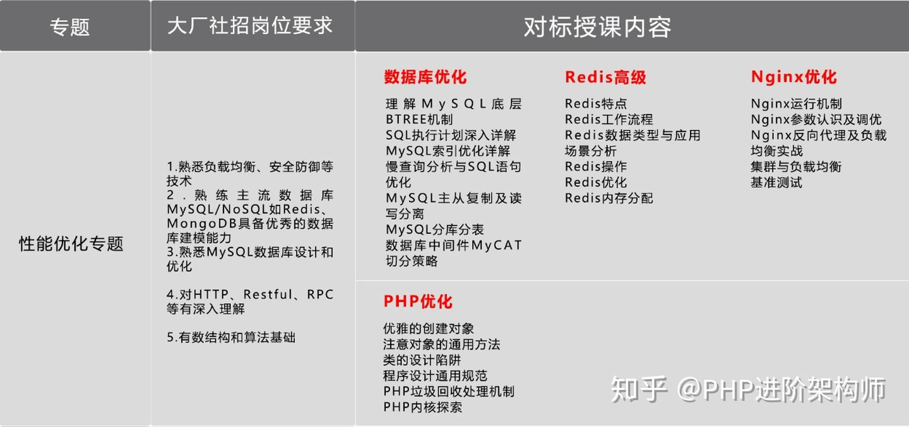

知识体系

常见的设计模式，编码必备

Laravel、ThinkPHP开发必不可少的最新框架

YII、Symfony4.1核心源码剖析

## **微服务架构与性能优化**

业务体系越来越复杂，Swoole协程编程，PHP并发编程、MySQL底层优化是架构升级的必经之路，PHP性能优化和微服务相关的技术有哪些呢？

- Tars分布式RPC框架
- Swoft微服务框架
- 服务器性能优化
- 算法与数据结构

## **工程化与分布式架构**

任何脱离细节的PPT架构师都是耍流氓，向上能运筹帷幄，向下能解决一线开发问题，PHP架构师需深入工程化、高并发，高可用，海量数据，没有分布式的架构知识肯定是玩不转的：

- Linux操作/shell脚本编程
- docker容器/自动化部署
- 分布式缓存/消息中间件
- 分布式架构原理/高并发分流

