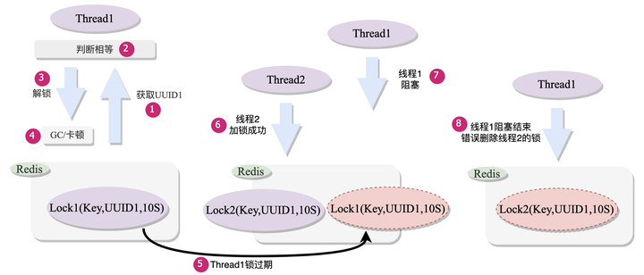
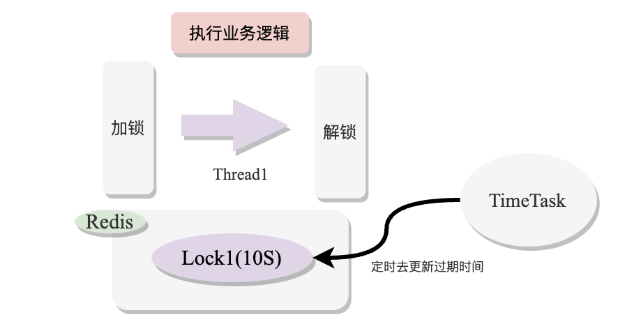

### redis分布式锁

#### 1. 基于Redis实现分布式锁


Redis分布式锁原理如图：当有多个Set命令发送到Redis时，Redis会串行处理，最终只有一个Set命令执行，从而只有一个加锁成功

####  2.SetNx命令加锁

利用Redis的setNx命令在Redis数据库中创建一个<key, value> 记录，这条命令只有当Redis中没有这个key的时候才执行成功，当已经有这个key的时候会返回失败。


利用如上的 ***setNx*** 命令便可以简单的实现加锁功能，当多个线程去执行这个加锁命令时，***只有一个线程执行成功，然后执行业务逻辑，其他线程加锁失败返回或者重试***

#### 3.死锁问题

上面的 ***setNx*** 命令实现了基本的加锁功能，但存在一个致命的问题是，***当程序在执行业务代码崩溃时，无法再执行到下面的解锁指令，从而导致出现死锁问题***


为了解决死锁问题，这里就需要***引入过期时间的概念***，过期时间是给当前这个 ***key 设置一定的存活时间，当存活时间到期后，Redis 就会自动删除这个过期的 Key***，从而使得程序在崩溃时也能***到期自动释放锁***


如上图所示，使用 Redis 的 ***expire 命令***来为锁设置过期时间，从而实现到期自动解锁的功能，但这里仍然还存在一个问题就是***加锁与给锁设置过期时间这两个操作命令并不是原子命令***

**考虑下面这种情况：**

当程序在加锁完成后，在设置过期时间前崩溃，这时仍然会造成锁无法自动释放，从而产生死锁现象


#### 4.使用原子命令

针对上面加锁与设置过期时间不是原子命令的问题，Redis 为我们提供了一个原子命令如下：


通过 ***SetNx(key,value,timeOut)*** 这个***结合加锁与设置过期时间的原子命令***就能完整的实现基于 Redis 的分布式锁的加锁步骤

#### 5.解锁原理

解锁原理就是基于 Redis 的 ***del 删除 key 指令***


#### 6.错误删除锁问题

上面直接删除 key 来解锁方式会存在一个问题，考虑下面这种情况：

**（1）**线程 1 执行业务时间过长导致自己加的锁过期

**（2）**这时线程 2 进来加锁成功

**（3）**然后线程 1 业务逻辑执行完毕开始执行 del key 命令

**（4）\*这时就会出现错误删除线程 2 加的锁\***

**（5）**错误删除线程 2 的锁后，线程 3 又可以加锁成功，导致有两个线程执行业务代码


#### 7.加入锁标识

为了解决这种错误删除其他线程的锁的问题，在这里需要对加锁命令进行改造，***需要在 value 字段里加入当前线程的 id***，在这里可以使用 uuid 来实现。线程在删除锁的时候，用自己的 uuid 与 Redis 中锁的 uuid 进行比较，***如果是自己的锁就进行删除，不是则不删除***


如上图所示，加锁时***在 value 字段中存入当前线程的 id，然后在解锁时通过比较当前的锁是否是自己的来判断是否加锁成功，***这样就解决了错误删除别人的锁的问题，***但这里同样存在原子命令问题，比较并删除***这个操作并不是原子命令，考虑下面这种情况

**（1）**线程 1 获取 uuid 并判断锁是自己的

**（2）\*准备解锁时出现 GC 或者其他原因导致程序卡顿无法立即执行 Del 命令\***，导致线程 1 的锁过期

**（3）**线程 2 就会在这个时候加锁成功

**（4）**线程 1 卡顿结束继续执行解锁指令，就会错误删除线程 2 的锁



这个问题出现的根本原因还是***比较并删除这两个操作并不是原子命令，只要两个命令被打断就有可能出现并发问题**，**如果将两个命令变为原子命令就能解决这个问题***

#### 8.引入lua脚本实现原子删除操作

***lua 脚本***是一个非常轻量级的脚本语言，Redis 底层天生支持 lua 脚本的执行，一个 lua 脚本中可以包含多条 Redis 命令，Redis 会将整个 lua 脚本当作原子操作来执行，从而实现聚合多条 Redis 指令的原子操作，其原理如下图所示：


```lua
//lua脚本如下
luaScript =  " if redis.call('get',key) == value then
                  return redis.call('del',key) 
               else 
                  return 0 
               end;"
```

如上面的 lua 脚本所示，Redis 会将整个 lua 脚本当作一个单独的命令执行，从而实现多个命令的原子操作，避免多线程竞争问题，最终结合 lua 脚本实现了一个完整的分布式的加锁和解锁过程，伪代码如下：

```lua
uuid = getUUID();
//加锁
lockResut = redisClient.setNx(key,uuid,timeOut);
if(!lockResult){
    return;
}
try{
   //执行业务逻辑
}finally{
    //解锁
    redisClient.eval(delLuaScript,keys,values)
}
//解锁的lua脚本
delLuaScript =  " if redis.call('get',key) == value then
                     return redis.call('del',key) 
                  else 
                     return 0 
                  end;"
```

到此，我们最终实现了一个加锁和解锁功能较为完整的 redis 分布式锁了，当然作为一个锁来说，还有一些其他的功能需要进一步完善，例如***考虑锁失效问题，可重入问题等***

#### 9.自动续期问题

在执行业务代码时，由于业务执行时间长，最终可能导致在业务执行过程中，自己的锁超时，然后锁自动释放了，在这种情况下第二个线程就会加锁成功，从而导致数据不一致的情况发生，如下图所示：


对于上述的这种情况，原因是由***于设置的过期时间太短或者业务执行时间太长***导致锁过期，但是为了避免死锁问题又必须设置过期时间，那这就需要引入自动续期的功能，即在加锁成功时，***开启一个定时任务，自动刷新 Redis 加锁 key 的超时时间，***从而避免上诉情况发生，如下图所示：



```
uuid = getUUID();
//加锁
lockResut = redisClient.setNx(key,uuid,timeOut);
if(!lockResult){
    return;
}
//开启一个定时任务
new Scheduler(key,time,uuid,scheduleTime)
try{
   //执行业务逻辑
}finally{
    //删除锁
    redisClient.eval(delLuaScript,keys,values)
    //取消定时任务
    cancelScheduler(uuid);
}
```

如上诉代码所示，***在加锁成功后可以启动一个定时任务来对锁进行自动续期，\*定时任务的执行逻辑是：**

**（1）**判断 Redis 中的锁是否是自己的

**（2）**如果存在的话就使用 expire 命令重新设置过期时间

这里由于需要两个 Redis 的命令，所以也需要使用 lua 脚本来实现原子操作，代码如下所示：

```lua
luaScript = "if redis.call('get',key) == value) then
                return redis.call('expire',key,timeOut);
             else
                return 0;
             end；"
```

#### 10.可重入锁

对于一个功能完整的锁来说，可重入功能是必不可少的特性，所谓的锁可重入就是同一个线程，第一次加锁成功后，在第二次加锁时，无需进行排队等待，只需要判断是否是自己的锁就行了，可以直接再次获取锁来执行业务逻辑，如下图所示：


实现可重入机制的原理就是***在加锁的时候记录加锁次数，在释放锁的时候减少加锁次数，这个加锁的次数记录可以存在 Redis 中，如下图所示：***


***如上图所示，加入可重入功能后，加锁的步骤就变为如下步骤：***

**（1）**判断锁是否存在

**（2）**判断锁是否是自己的

**（3）**增加加锁的次数

由于增加次数以及减少次数是多个操作，这里需要再次使用 lua 脚本来实现，同时由于这里需要在 Redis 中存入加锁的次数，所以需要使用到 Redis 中的 Map 数据结构 ***Map(key,uuid,lockCount)，***加锁 lua 脚本如下：

```lua
//锁不存在
if (redis.call('exists', key) == 0) then
    redis.call('hset', key, uuid, 1); 
    redis.call('expi re', key, time); 
    return 1;
end;
//锁存在，判断是否是自己的锁
if (redis.call('hexists', key, uuid) == 1) then
    redis.call('hincrby', key, uuid, 1); 
    redis.call('expire', key, uuid);
    return 1; 
end; 
//锁不是自己的，返回加锁失败
return 0；
```

***加入可重入功能后的\*解锁逻辑就变为：**

1. 判断锁是否是自己的

2) 如果是自己的则减少加锁次数，否则返回解锁失败

```
//判断锁是否是自己的,不是自己的直接返回错误
if (redis.call('hexists', key，uuid) == 0) then
    return 0;
end;
//锁是自己的，则对加锁次数-1
local counter = redis.call('hincrby', key, uuid, -1);
if (counter > 0) then 
    //剩余加锁次数大于0，则不能释放锁，重新设置过期时间
    redis.call('expire', key, uuid); 
    return 1;
else
//等于0，代表可以释放锁了
    redis.call('del', key); 
    return 1; 
end;
```

到此，我们在实现基本的***加锁与解锁***的逻辑上，又加入了***可重入和自动续期的功能***，自此一个完整的 Redis 分布式锁的雏形就实现了，伪代码如下：

```
uuid = getUUID();
//加锁
lockResut = redisClient.eval(addLockLuaScript,keys,values);
if(!lockResult){
    return;
}
//开启一个定时任务
new Scheduler(key,time,uuid,scheduleTime)
try{
   //执行业务逻辑
}finally{
    //删除锁
    redisClient.eval(delLuaScript,keys,values)
    //取消定时任务
    cancelScheduler(uuid);
}
```

#### 11. Zookeeper实现分布式锁

Zookeeper 是一个分布式协调服务，分布式协调主要是来解决分布式系统中多个应用之间的数据一致性，Zookeeper 内部的数据存储方式类似于文件目录形式的存储结构，它的内存结果如下图所示：


#### 12. Zookeeper 加锁原理

在 Zookeeper 中的指定路径下创建节点，然后客户端根据当前路径下的节点状态来判断是否加锁成功，如下图一种情况为例，线程 1 创建节点成功后，线程 2 再去创建节点就会创建失败


#### 13. Zookeeper 节点类型

**持久节点：**在 Zookeeper 中创建后会进行持久储存，直到客户端主动删除

**临时节点：**以客户端会话 Session 维度创建节点，一旦客户端会话断开，节点就会自动删除

**临时 / 持久顺序节点：**在同一个路径下创建的节点会对每个节点按创建先后顺序编号


```java
zookeeper.exists("/watchpath",new Watcher() {
    @Override
    public void process(WatchedEvent event) {
	System.out.println("进入监听器");
	System.out.println("监听路径Path："+event.getPath());
	System.out.println("监听事件类型EventType："+event.getType());				
    }			
});
```

#### 14. 利用临时顺序节点和监听机制来实现分布式锁

实现分布式锁的方式有多种，我们可以使用临时节点和顺序节点这种方案来实现分布式锁：

1：使用临时节点可以在**客户端程序崩溃时自动释放锁，避免死锁问题**

2：使用顺序节点的好处是，可以利用锁释放的事件监听机制，来实现***阻塞监听式的分布式锁***

下面将基于这两个特性来实现分布式锁

#### 15. 加锁原理

1：首先在 Zookeeper 上创建临时顺序节点 Node01、Node02 等

2：第二步客户端拿到加锁路径下所有创建的节点

3：判断自己的序号是否最小，如果最小的话，代表加锁成功，如果不是最小的话，就对前一个节点创建监听器

4：如果前一个节点删除，监听器就会通知客户端来准备重新获取锁

加锁原理和代码入下图所示：


```java
//加锁路径
String lockPath;
//用来阻塞线程
CountDownLatch cc = new CountDownLatch(1);
//创建锁节点的路径
Sting LOCK_ROOT_PATH = "/locks"

//先创建锁
public void createLock(){
    //lockPath = /locks/lock_01 
    lockPath = zkClient.create(LOCK_ROOT_PATH+"/lock_", CreateMode.EPHEMERAL_SEQUENTIAL);
}

//获取锁
public boolean acquireLock(){
    //获取当前加锁路径下所有的节点
    allLocks = zkClient.getChildren("/locks");
    //按节点顺序大小排序
    Collections.sort(allLocks);
    //判断自己是否是第一个节点
    int index = allLocks.indexOf(lockPath.substring(LOCK_ROOT_PATH.length() + 1));
    //如果是第一个节点，则加锁成功
    if (index == 0) {
        System.out.println(Thread.currentThread().getName() + "获得锁成功, lockPath: " + lockPath);
        return true;
    } else {
        //不是序号最小的节点，则监听前一个节点
        String preLock = allLocks.get(index - 1);
        //创建监听器
        Stat status = zkClient.exists(LOCK_ROOT_PATH + "/" + preLockPath, watcher);
        // 前一个节点不存在了，则重新获取锁
        if (status == null) {
            return acquireLock();
        } else { 
            //阻塞当前进程，直到前一个节点释放锁
            System.out.println(" 等待前一个节点锁释放，prelocakPath："+preLockPath);
            //唤醒当前线程，继续尝试获取锁
            cc.await();
            return acquireLock();
        }
    }
}

private Watcher watcher = new Watcher() {
    @Override
    public void process(WatchedEvent event) {
         //监听到前一个节点释放锁，唤醒当前线程
         cc.countDown();
    }
}
```

#### 16. 可重入锁实现

Zookeeper 实现可重入分布式锁的机制是***在本地维护一个 Map 记录***，因为如果在 Zookeeper 节点维护数据的话，***Zookeeper 的写操作是很慢，集群内部需要进行投票同步数据，***所以在本地维护一个 Map 记录来记录当前加锁的次数和加锁状态，在释放锁的时候减少加锁的次数，原理如下图所示：


```java
//利用Map记录线程持有的锁
ConcurrentMap<Thread, LockData> lockMap = Maps.newConcurrentMap();
public Boolean lock(){
    Thread currentThread = Thread.currentThread();
    LockData lockData = lockMap.get(currentThread);
    //LockData不为空则说明已经有锁
    if (lockData != null)    
    {
       //加锁次数加一
       lockData.lockCount.increment();
       return true;
    }
    //没有锁则尝试获取锁
    Boolean lockResult = acquireLock();
    //获取到锁
    if (lockResult)
    {
        LockData newLockData = new LockData(currentThread,1);
        lockMap.put(currentThread, newLockData);
        return true;
    }
    //获取锁失败
    return false;
}
```

#### 17. 解锁原理

**解锁的步骤如下：**

（1）判断锁是不是自己的

（2）如果是则减少加锁次数

（3）如果加锁次数等于 0，则释放锁，删除掉创建的临时节点，下一个监听这个节点的客户端会感知到节点删除事件，从而重新去获取锁


```java
public Boolean releaseLock(){
    LockData lockData = lockMap.get(currentThread);
    //没有锁
    if(lockData == null){
       return false; 
    }
    //有锁则加锁次数减一
    lockCount = lockData.lockCount.decrement();
    if(lockCount > 0){
        return true;
    } 
    //加锁次数为0
    try{
        //删除节点
        zkClient.delete(lockPath);
        //断开连接
        zkClient.close();
    finally{
        //删除加锁记录
        lockMap.remove(currentThread);
    }
    return true;
}
```

#### 18. Redis 和 Zookeeper 锁对比

|            | Redis                                                        | Zookeeper                                                    |
| ---------- | ------------------------------------------------------------ | ------------------------------------------------------------ |
| 读性能     | 基于内存                                                     | 基于内存                                                     |
| 加锁性能   | 直接写内存加锁                                               | Master 节点创建好后与其他 Follower 节点进行同步，半数成功后才能返回写入成功 |
| 数据一致性 | AP 架构 Redis 集群之间的数据同步是存在一定的延迟的，当主节点宕机后，数据如果还没有同步到从节点上，就会导致分布式锁失效，会造成数据的不一致 | CP 架构当 Leader 节点宕机后，会进行集群重新选举，如果此时只有一部分节点收到了数据的话，会在集群内进行数据同步，保证集群数据的一致性 |


#### 19. 总结

使用 Redis 还是 Zookeeper 来实现分布式锁，最终还是要基于业务来决定，可以参考以下两种情况：

（1）如果业务并发量很大，Redis 分布式锁高效的读写性能更能支持高并发

（2）如果业务要求锁的强一致性，那么使用 Zookeeper 可能是更好的选择