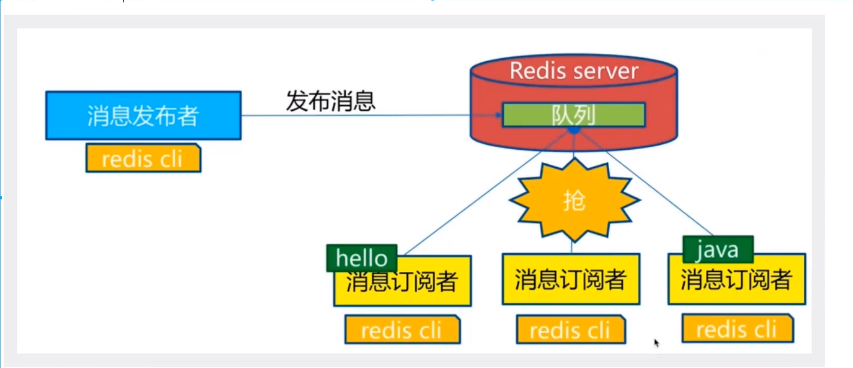
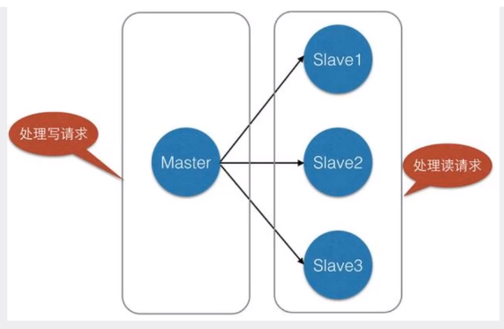
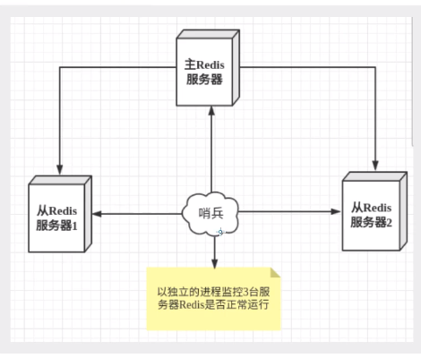
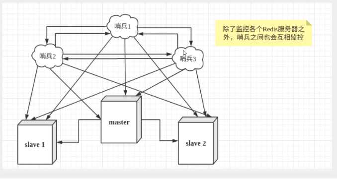

## redis

#### redis 发布订阅



第一个：消息发送者，2：消息发送者；3 消息订阅者

```bash
subscribe 主题名 # 订阅主题
publish 主题 message # 往主题中发送信息
```

#### redis 主从复制

概念：将一台服务器内容，复制到其他redis服务器



##### 主从复制的作用

1. 数据冗余：主从复制实现了数据的热备份，是持久化之外的一种数据冗余方式。

 	2. 故障恢复：当主节点出现问题时，可以由从节点提供服务，实现快速的故障恢复
 	3. 负载均衡：在主从复制的基础上，配合读写分离，可以由主节点提供写服务，从节点提供读服务，分担服务器负载，尤其是在写少读多的情况下，通过多个从节点分担读负载，可以大大提高redis服务器并发量
 	4. 高可用基石：主从复制还是哨兵和集群能够实施的基础，因此说主从复制是redis高可用的基础。

##### 主从配置

```bash
127.0.0.1:6379>slaveof 127.0.0.1 6379 # 暂时配置
```

redis config 中配置 可永久生效

##### 复制原理

slave 启动成功连接到master后会发送一个sync同步命令

master接到命令，启动后台的存盘进程，同时收集所有接收到的用于修改数据集命令，在后台进程执行完毕之后，==master将传送整个文件到salve,并完成一次同步。==

全量复制：salve服务在接收到数据库文件数据后，将其存盘并加载到内存中。

增量复制：master继续将所有收集到的修改命令依次传给salve，完成同步

但是只要是重新连接master，一次完全同步将被自动执行。

### 哨兵模式

哨兵模式是一种特殊的模式，首先Redis提供了哨兵的命令，哨兵是一个独立的进程，作为进程，它会独立运行，其原理是**哨兵通过发送命令，等待Redis服务器响应，从而监控运行的多个Redis实例**。



哨兵有两个作用

- 通过发送命令，让redis服务器返回监控其运行状态，包括主服务器和从服务器。
- 当哨兵监测到master宕机，会自动将slave切换到master，然后通过发布订阅模式，通知其他的从服务器，修改配置文件，让它们切换主机

然而一个哨兵进程对redis服务器进行监控，可能会出现问题，为此，我们可以使用多个哨兵进行监控，各个哨兵之间还会进行监控，这就形成了多哨兵模式



假设主服务器宕机，哨兵1先检测到这个结果，系统并不会马上进行failover过程，仅仅是哨兵1主观的认为主服务器不可用，这个现象称为**主观下线**，当后面的哨兵也检测到主服务器不可用，并且数量达到一定值时，那么哨兵之间就会进行一次投票，投票的结果由一个哨兵发起，进行failover[故障转移]操作，切换成功后，就会通过发布订阅模式，让各个哨兵把自己监控的从服务器实现切换主机，这个过程称为**客观下线**。

#### 测试

##### 1. 配置哨兵配置文件 sentinel.conf

```bash
# sentinel monitor 被监控的名称 host port 1
sentinel monitor myredis 127.0.0.1 6379 1
```

这里面的数字 1 表示，当主机挂了，slave票数最多的成为主机

如果此时主机恢复，会变为从机

优点：

1. 哨兵集群，基于主从复制模式，所有的主从配置优点，它会有
2. 主从可以切换，故障可以转移，系统的可用性会更好
3. 哨兵模式就是主从模式的升级，手动到自动，系统更加健壮

缺点：

1. redis不好在线扩容，集群容量一但到达上限，在线扩容就十分麻烦
2. 实现哨兵模式的配置很麻烦，里面有很多选择

