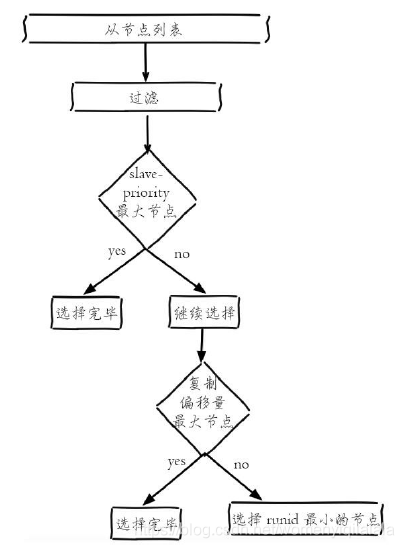

## redis

 Redis 数据库采用 I/O 多路复用技术实现文件事件处理器
 I/O 多路复用：linux有五类io模型 1.阻塞 2.非阻塞 3.io多路复用 4.事件驱动 5.异步
    阻塞：一次网络io时，C端发出请求，S端收到。当C端发出一个请求，进行io时，就不能进行其他操作了，需要同步的等待结果的返回。
    io多路复用：有多个C端同时发送请求，这些IO操作会被selector(epoll，kqueue)给暂时挂起，入内存队列。此时S端可以自己选择什么时候读取、处理这些io，也就是说S端可以同时hold住多个io。

#### redis 为什么那么快？

  1. 纯内存操作
  2. 单线程操作、避免了频繁的上下文切换(多线程需要占用更多的CPU资源)
  3. 采用了非阻塞I/O多路复用机制

#### redis 后台运行？

redis.conf // 将 daemonize no 改为 yes

#### redis 发布订阅


第一个：消息发送者，2：消息发送者；3 消息订阅者

```bash
subscribe 主题名 # 订阅主题
publish 主题 message # 往主题中发送信息
```

#### redis 主从复制

概念：将一台服务器内容，复制到其他redis服务器


##### 主从复制的作用

1. 数据冗余：主从复制实现了数据的热备份，是持久化之外的一种数据冗余方式。

  2. 故障恢复：当主节点出现问题时，可以由从节点提供服务，实现快速的故障恢复

  3. 负载均衡：在主从复制的基础上，配合读写分离，可以由主节点提供写服务，从节点提供读服务，分担服务器负载，尤其是在写少读多的情况下，通过多个从节点分担读负载，可以大大0

     提高redis服务器并发量

 	4. 高可用基石：主从复制还是哨兵和集群能够实施的基础，因此说主从复制是redis高可用的基础。

##### 主从配置

```bash
127.0.0.1:6379>slaveof 127.0.0.1 6379 # 暂时配置
```

redis config 中配置 可永久生效

##### 复制原理

slave 启动成功连接到master后会发送一个sync同步命令

master接到命令，启动后台的存盘进程，同时收集所有接收到的用于修改数据集命令，在后台进程执行完毕之后，==master将传送整个文件到salve,并完成一次同步。==

全量复制：salve服务在接收到数据库文件数据后，将其存盘并加载到内存中。

增量复制：master继续将所有收集到的修改命令依次传给salve，完成同步

但是只要是重新连接master，一次完全同步将被自动执行。

### 哨兵模式

哨兵模式是一种特殊的模式，首先Redis提供了哨兵的命令，哨兵是一个独立的进程，作为进程，它会独立运行，其原理是**哨兵通过发送命令，等待Redis服务器响应，从而监控运行的多个Redis实例**。


哨兵有两个作用

- 通过发送命令，让redis服务器返回监控其运行状态，包括主服务器和从服务器。
- 当哨兵监测到master宕机，会自动将slave切换到master，然后通过发布订阅模式，通知其他的从服务器，修改配置文件，让它们切换主机

然而一个哨兵进程对redis服务器进行监控，可能会出现问题，为此，我们可以使用多个哨兵进行监控，各个哨兵之间还会进行监控，这就形成了多哨兵模式

                
 

假设主服务器宕机，哨兵1先检测到这个结果，系统并不会马上进行failover过程，仅仅是哨兵1主观的认为主服务器不可用，这个现象称为**主观下线**，当后面的哨兵也检测到主服务器不可用，并且数量达到一定值时，那么哨兵之间就会进行一次投票，投票的结果由一个哨兵发起，进行failover[故障转移]操作，切换成功后，就会通过发布订阅模式，让各个哨兵把自己监控的从服务器实现切换主机，这个过程称为**客观下线**。

#### **实现原理**

##### 三个定时监控任务

1. 每隔10秒，每个Sentinel节点会向主节点和从节点发送info命令获取Redis数据节点的信息。

   


**作用**：

- 通过向主节点执行info命令，获取从节点的信息，这也是为什么Sentinel节点不需要显式配置监控从节点。
- 当有新的从节点加入时都可以立刻感知出来。
- 节点不可达或者故障转移后，可以通过info命令实时更新节点拓扑信息。

**分析**
　　Sentinel以每10秒一次的频率向master发送info命令，通过info的回复来分析master信息，master的回复主要包含了两部分信息，一部分是master自身的信息，一部分是master所有的slave（从）的信息，所以sentinel可以自动发现master的从服务。sentinel从master哪儿获取到的master自身信息以及master所有的从信息，将会更新到sentinel的sentinelState中及masters（sentinelRedisInstance结构）中的slaves字典中


2. 每隔2秒，每个Sentinel节点会向Redis数据节点的__sentinel__：hello频道上发送该Sentinel节点对于主节点的判断以及当前Sentinel节点的信息，同时每个Sentinel节点也会订阅该频道，来了解其他Sentinel节点以及它们对主节点的判断.


**消息格式：**

<Sentinel节点IP> <Sentinel节点端口> <Sentinel节点runId> <Sentinel节点配置纪元>
<主节点名字> <主节点Ip> <主节点端口> <主节点配置纪元>
各个参数的解析如下

```conf
s_ip: sentine的IP

s_port: sentinel的端口

s_runid: sentinel运行ID

s_epoch: sentinel当期的配置纪元

m_name: 主服务器名字

m_ip: 主服务器IP

m_port: 主服务器端口

m_epoch: 主服务器纪元
```

作用：

发现新的Sentinel节点：通过订阅主节点的__sentinel__：hello了解其他的Sentinel节点信息，如果是新加入的Sentinel节点，将该Sentinel节点信息保存起来（如下图：sentinelRedisInstance），并与该Sentinel节点创建连接。
Sentinel节点之间交换主节点的状态，作为后面客观下线以及领导者选举的依据。


3. 每隔1秒，每个Sentinel节点会向主节点、从节点、其余Sentinel节点发送一条ping命令做一次心跳检测，来确认这些节点当前是否可达


##### 主观下线和客观下线

**主观下线**：
　　所谓主观下线，就是单个sentinel认为某个服务下线（有可能是接收不到订阅，之间的网络不通等等原因）。
　　sentinel会以每秒一次的频率向所有与其建立了命令连接的实例（master，从服务，其他sentinel）发ping命令，通过判断ping回复是有效回复，还是无效回复来判断实例时候在线（对该sentinel来说是“主观在线”）
　　 sentinel配置文件中的down-after-milliseconds设置了判断主观下线的时间长度，如果实例在down-after-milliseconds毫秒内，返回的都是无效回复，那么sentinel会认为该实例已（主观）下线，修改其flags状态为SRI_S_DOWN。在实际的工作当中，多个sentinel配置的down-after-milliseconds　超时时间推荐一致。

**客观下线**：
　　客观下线 只针对 主节点，从节点和哨兵节点不需要这一步
　　当Sentinel主观下线的节点是主节点时，该Sentinel节点会通过sentinel ismaster-down-by-addr命令向其他Sentinel节点询问对主节点的判断，当超过配置中的< quorum >个数，Sentinel节点认为主节点确实有问题，这时该Sentinel节点会做出客观下线的决定，并后续对其做故障转移操作。
　　如果每个Sentinel　配置的down-after-milliseconds时间不一致，会很难超过< quorum >配置的个数
　　sentinel is-master-down-by-addr < ip > < por t> < current_epoch > < runid >
例如：sentinel is-master-down-by-addr 127.0.0.1 6379 0 *

ip：主节点IP。
port：主节点端口。
current_epoch：当前配置纪元。
runid：此参数有两种类型，当runid等于“*”时，作用是Sentinel节点直接交换对主节点下线的判定。在领导者Sentinel节点选举时，runid等于当前Sentinel节点的runid，作用是当前Sentinel节点希望目标Sentinel节点同意自己成为领导者的请求。
一个sentinel接收另一个sentinel发来的is-master-down-by-addr后，提取参数，根据ip和端口，检测该服务时候在该sentinel主观下线，并且回复is-master-down-by-addr

down_state：目标Sentinel节点对于主节点的下线判断，1是下线，0是在线。
leader_runid：当leader_runid等于“*”时，代表返回结果是用来做主节点是否不可达，当leader_runid等于具体的runid，代表目标节点同意runid成为领导者。
leader_epoch：领导者纪元。

##### 领导者Sentinel节点选举

Redis使用了Raft算法实现领导者选举，大体思路：

1. 每个在线的Sentinel节点都有资格成为领导者，每个Sentinel节点发现当它确认主节点客观下线检查时候，会向其他Sentinel节点发送sentinel is-master-down-by-addr命令，要求将自己设置为领导者。
2. 每个节点在每个选举轮次中只有一次投票权，收到命令的Sentinel节点，如果没有同意过其他Sentinel节点的sentinelis-master-down-by-addr命令，将同意该请求，否则拒绝。
3. 如果该Sentinel节点发现自己的票数已经大于等于max（quorum，num（sentinels）/2+1），那么它将成为领导者。其他的投票就会终止，即使后续还有其他的哨兵节点到达配置，也没有作用
4. 如果此过程没有选举出领导者， 暂定一段时间，再进行下一轮选举，current_epoch加1。

**图例：**

s1(哨兵节点)节点首先完成客观下线的检查，然后向s2和s3发送成为领导者的请求：


##### s2节点完成客观下线的检查，然后向s1和s3发送成为领导者的请求：

#####  

s３节点完成客观下线的检查，然后向s１和s２发送成为领导者的请求：


##### 故障转移

故障转移分为四个主要步骤:

a、 在从节点列表中选出一个作为新的主节点

[1] 　过滤：“不健康”（主观下线、断线）、5秒内没有回复过Sentinel节点ping响应、与主节点失联超过down-after-milliseconds*10秒。（断线时间越长主从数据不一致问题越严重）

[2] 　选择slave-priority（从节点优先级）最高的从节点列表，如果存在则返回，不存在则继续。

[3] 　如果优先级一样，选择复制偏移量最大的从节点（复制的最完整，尽可能的减少数据丢失），如果存在则返回，不存在则继续。

[4] 　如果偏移量一样，选择runid最小的从节点。

挑选从节点的重要原则：在从从节点列表中挑选与主节点数据最一致的节点。


b、 Sentinel领导者节点会对第一步选出来的从节点执行slaveof no one命令让其成为主节点。

c、 Sentinel领导者节点会向剩余的从节点发送命令，让它们成为新主节点的从节点，复制规则和parallel-syncs参数有关。slaveof ip port

d、 Sentinel节点集合会将原来的主节点更新为从节点，并保持着对其关注，当其恢复后命令它去复制新的主节点。


##### 配置哨兵配置文件 sentinel.conf

```bash
# sentinel monitor 被监控的名称 host port 1
sentinel monitor myredis 127.0.0.1 6379 1
```

这里面的数字 1 表示，当主机挂了，slave票数最多的成为主机

如果此时主机恢复，会变为从机

优点：

1. 哨兵集群，基于主从复制模式，所有的主从配置优点，它会有
2. 主从可以切换，故障可以转移，系统的可用性会更好
3. 哨兵模式就是主从模式的升级，手动到自动，系统更加健壮

缺点：

1. redis不好在线扩容，集群容量一但到达上限，在线扩容就十分麻烦
2. 实现哨兵模式的配置很麻烦，里面有很多选择


### redis数据类型

#### 1. string

```bash
# 查看所有key
keys * 

# 设置key
set key value 

# 获取key
get key 

# 移除当前key
move key 

# 清空所有key
flushall

# 判断key是否存在
exists name

#  给key设置过期时间
expire key val

# 查询当前key的剩余时间
ttl key

# 查看当前key的类型
type name

# 往字符串后面追加字符，如果key不存在，就相当于set key
append key value 

#  获取key的值长度
strlen key

# 字符串累计、累减
incr key # key值加1
decr key # key值减1
incrby key value # key值加value， value： 步长
decrby key value # key值加value， value： 步长

# 字符串范围
getrange key 0 3 # 截取字符串[0,3]
setrange key 1 xx # 替换指定位置开始的字符串

setex (set with expire) # 设置过期时间
setex key 30 "val" # 设置key 30s 过期， 值为val

# 不存在设置（分布式锁中会常常使用），存在设置失败
setnx (set if not exist) 
setnx key val # 语法

mset k1 v1 k2 v2 # 同时设置多个键值
msetnx k1 v1 k2 v2 # 是一个原子性的操作，要么一起成功，要么一起失败
mget k1 k2 k3 # 同时获取多个对象

# 对象
set user:1 {name:zhangsan,age:3} # 设置一个user:1 对象，值为接送字符串来保存一个对象

set user:{id}:{field} val # 这里的key是一个巧妙的设计

getset key val # 如果不存在值，设置值，并返回nil，如果存在值，返回值，并设置新值


# string 类型的使用场景:value 除了是我们的数字还可以是字符串
```

#### 2. list

```bash
# 将值插入列表头部，从左边放入队列
lpush key value 

# 取出队列的全部数据
lrange key 0 -1 

# 将值插入到列表尾部，从右边放入队列
rpush key value  

# 从右边取出值
rpop key  

# 从左边取出值
lpop key  

# 按下标(index)获取队列的某一个值
lindex key index 

# 获取队列的长度
llen key  

# 移除指定的值,移除key中count个val
lrem key count val   
# 例如： lrem list 2 abc # 移除list中的2个abc

# 截取队列，从start开始，end结束
ltrim key start end  
# 例如： ltrim list 2 5 # 截取list，从下标2开始，5结束

# 从第一个队列的右边取出值，放入第二个队列中
rpoplpush list1 list2 

# 判断list是否存在
exists list  

# 更新操作，将list中下标为index的值改为newValue,修改的值不存在，就报错
lset list index newValue  

# 更新值，将0个元素更新为item
lset list 0 item 

# 在list中在值value前面插入新值newValue
linsert list before value newValue

# 在list中在值value后面插入新值newValue
linsert list after value newValue  

# 小结
# 如果key不存在，创建新的链表
# 如果key存在，新增内容
# 如果移除了所有值，空链表，也代表不存在
# 在两边插入或改动值，效率最高
```

#### 3. set

```bash
 # 往集合中插入元素
 sadd set value 
 
 # 查看集合中的所有元素
 smembers set  
 
 # 判断某一个值是不是在集合中
 sismember set value  
 
 # 获取set集合中的元素个数
 scard set  
 
 # 移除set集合中的某一个元素
 srem set value 
 
 # 随机抽出一个元素
 srandmember set 
 
 # 随机抽出count个元素
 srandmember set count  
 
 # 随机删除集合中的元素
 spop set 
 
 # 两个集合的差集
 sdiff set1 set2
 
 # 两个集合的交集
 sinter set1 set2 
 
 # 并集
 sunion set1 set2  
```

#### 4. hash

```bash
# 设置值
hset hash field value 

# 获取值
hget hash field 

# 设置多个值
hmset hash f1 v1 f2 v2 

# 获取多个值
hmget hash f1 f2 

# 删除指定的值
hdel hash field  
```

#### 5. zset

```bash
# 增加数据和权重
zadd set source value

# 显示全部的用户，升序排序 inf:无穷
zrangebyscore set -inf +inf [withscores] 

# 获取集合中所有的值
zset set 0 -1 

# 移除zset中的元素
zrem set value 

# 查看集合中元素个数
zcard set 

# 从大到小排序
zrevrange set 0 -1

# 获取指定区间的元素
zcount set start end  
```

### redis 配置文件

```bash
#  绑定IP
bind 127.0.0.1

# 守护进程运行
daemonize yes 

# 如果以后台方式运行，指定pid 文件
pidfile /var/run/redis_6379.pid 

# 数据库数量
databases 16 

# 日志文件的位置
logfile '' 

# 日志级别
loglevel notice  

# 快照，在规定的时间内，执行了多少次操作，则会持久化文件
save 900 1 # 如果900s内有一个修改，就持久化
save 300 10 # 300s内至少修改了10
save 60 10000 # 60s内修改了10000次

stop-writes-on-bgsave-error yes # 持久化出错，是否还需要工作
rdbcompression yes # 是否压缩rdb文件，需要消耗一些CPU资源
rdbchecksum yes # 保持rdb文件时，进行错误检查
dir ./ # rdb文件保存目录

# 如果有密码时，登录
auto pwd # 用密码登录

appendonly no # 默认是不开启aof模式的
appendfilename 'appendoonly.aof' # 持久化的文件名
appendsync everysec # 每秒执行一次，sync,可能会丢失这1s的数据
always # 每次修改都会 sync
no # 不同步
```

### redis 问题

#### 1. redis哨兵模式之脑裂现象？

1.什么是脑裂？

所谓脑裂问题(类似于精神分裂)，就是同一个集群中的不同节点，对于集群的状态有了不一样的理解。

2.哨兵模式造成的redis脑裂现象原因？

举例(1主1从2哨兵的情况),由于网络原因或者一些特殊原因，哨兵失去了对master节点器的感知，将会通过选举进行故障转移，将slave节点提升为master节点，这就导致了当前集群中有2个master，这就是脑裂现象的体现。不同的 client 链接到不同的 redis 进行读写，那么在两台机器上的 redis 数据，就出现了不一致的现象了。当哨兵恢复对老master节点的感知后，会将其降级为slave节点，然后从新maste同步数据(full resynchronization)，导致脑裂期间老master写入的数据丢失，完犊子了。

3.解决方案

redis.conf 修改属性，通过活跃slave节点数和数据同步延迟时间来限制master节点的写入操作。

\# master 至少有 x 个副本连接。

min-slaves-to-write x

\# 数据复制和同步的延迟不能超过 x 秒。

min-slaves-max-lag x

