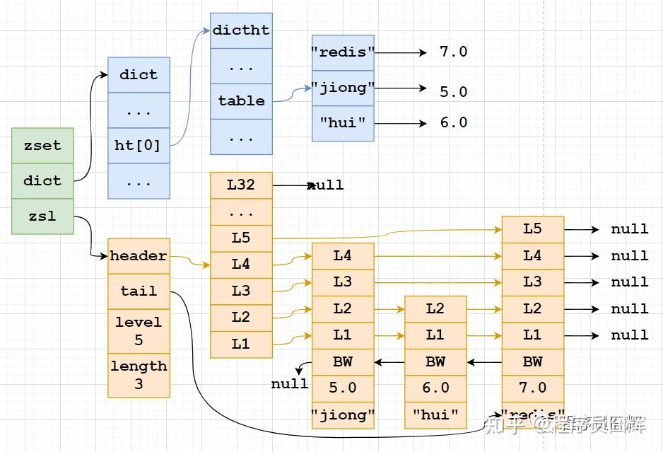
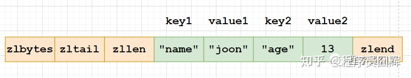

## redis 

Redis 数据库采用 I/O 多路复用技术实现文件事件处理器
 I/O 多路复用：linux有五类io模型 1.阻塞 2.非阻塞 3.io多路复用 4.事件驱动 5.异步
    阻塞：一次网络io时，C端发出请求，S端收到。当C端发出一个请求，进行io时，就不能进行其他操作了，需要同步的等待结果的返回。
    io多路复用：有多个C端同时发送请求，这些IO操作会被selector(epoll，kqueue)给暂时挂起，入内存队列。此时S端可以自己选择什么时候读取、处理这些io，也就是说S端可以同时hold住多个io。

#### redis 为什么那么快？

  1. 纯内存操作
  2. 单线程操作、避免了频繁的上下文切换(多线程需要占用更多的CPU资源)
  3. 采用了非阻塞I/O多路复用机制

#### redis 后台运行？

redis.conf // 将 daemonize no 改为 yes

#### redis 发布订阅


第一个：消息发送者，2：消息发送者；3 消息订阅者

```bash
subscribe 主题名 # 订阅主题
publish 主题 message # 往主题中发送信息
```

#### redis 主从复制

概念：将一台服务器内容，复制到其他redis服务器


##### 主从复制的作用

1. 数据冗余：主从复制实现了数据的热备份，是持久化之外的一种数据冗余方式。
2. 故障恢复：当主节点出现问题时，可以由从节点提供服务，实现快速的故障恢复
3. 负载均衡：在主从复制的基础上，配合读写分离，可以由主节点提供写服务，从节点提供读服务，分担服务器负载，尤其是在写少读多的情况下，通过多个从节点分担读负载，可以大大提高redis服务器并发量
  4. 高可用基石：主从复制还是哨兵和集群能够实施的基础，因此说主从复制是redis高可用的基础。

##### 主从配置

```bash
127.0.0.1:6379>slaveof 127.0.0.1 6379 # 暂时配置
```

redis config 中配置 可永久生效

##### 复制原理

slave 启动成功连接到master后会发送一个sync同步命令

master接到命令，启动后台的存盘进程，同时收集所有接收到的用于修改数据集命令，在后台进程执行完毕之后，==master将传送整个文件到salve,并完成一次同步。==

全量复制：salve服务在接收到数据库文件数据后，将其存盘并加载到内存中。

增量复制：master继续将所有收集到的修改命令依次传给salve，完成同步

但是只要是重新连接master，一次完全同步将被自动执行。

###### **主从复制过程**

**1）开启主从复制**

通常有以下三种方式：

- 在 slave 直接执行命令：slaveof <masterip> <masterport>
- 在 slave 配置文件中加入：slaveof <masterip> <masterport>
- 使用启动命令：--slaveof <masterip> <masterport>

注：在 Redis 5.0 之后，slaveof 相关命令和配置已经被替换成 replicaof，例如 replicaof <masterip> <masterport>。为了兼容旧版本，通过配置的方式仍然支持 slaveof，但是通过命令的方式则不行了。

**2）建立套接字（socket）连接**

slave 将根据指定的 IP 地址和端口，向 master 发起套接字（socket）连接，master 在接受（accept） slave 的套接字连接之后，为该套接字创建相应的客户端状态，此时连接建立完成。

**3）发送PING命令**

slave 向 master 发送一个 PING 命令，以检査套接字的读写状态是否正常、 master 能否正常处理命令请求。

**4）身份验证**

slave 向 master 发送 AUTH password 命令来进行身份验证。

**5）发送端口信息**

在身份验证通过后后， slave 将向 master 发送自己的监听端口号， master 收到后记录在 slave 所对应的客户端状态的 slave_listening_port 属性中。

**6）发送IP地址**

如果配置了 slave_announce_ip，则 slave 向 master 发送 slave_announce_ip 配置的 IP 地址， master 收到后记录在 slave 所对应的客户端状态的 slave_ip 属性。

该配置是用于解决服务器返回内网 IP 时，其他服务器无法访问的情况。可以通过该配置直接指定公网 IP。

**7）发送CAPA**

CAPA 全称是 capabilities，这边表示的是同步复制的能力。slave 会在这一阶段发送 capa 告诉 master 自己具备的（同步）复制能力， master 收到后记录在 slave 所对应的客户端状态的 slave_capa 属性。

**8）数据同步**

slave 将向 master 发送 PSYNC 命令， master 收到该命令后判断是进行部分重同步还是完整重同步，然后根据策略进行数据的同步。

**9）命令传播**

当完成了同步之后，就会进入命令传播阶段，这时 master 只要一直将自己执行的写命令发送给 slave ，而 slave 只要一直接收并执行 master 发来的写命令，就可以保证 master 和 slave 一直保持一致了。

以部分重同步为例，主从复制的核心步骤流程图如下：


### 哨兵模式

哨兵模式是一种特殊的模式，首先Redis提供了哨兵的命令，哨兵是一个独立的进程，作为进程，它会独立运行，其原理是**哨兵通过发送命令，等待Redis服务器响应，从而监控运行的多个Redis实例**。


哨兵有两个作用

- 通过发送命令，让redis服务器返回监控其运行状态，包括主服务器和从服务器。
- 当哨兵监测到master宕机，会自动将slave切换到master，然后通过发布订阅模式，通知其他的从服务器，修改配置文件，让它们切换主机

然而一个哨兵进程对redis服务器进行监控，可能会出现问题，为此，我们可以使用多个哨兵进行监控，各个哨兵之间还会进行监控，这就形成了多哨兵模式

                


假设主服务器宕机，哨兵1先检测到这个结果，系统并不会马上进行failover过程，仅仅是哨兵1主观的认为主服务器不可用，这个现象称为**主观下线**，当后面的哨兵也检测到主服务器不可用，并且数量达到一定值时，那么哨兵之间就会进行一次投票，投票的结果由一个哨兵发起，进行failover[故障转移]操作，切换成功后，就会通过发布订阅模式，让各个哨兵把自己监控的从服务器实现切换主机，这个过程称为**客观下线**。

#### **实现原理**

##### 三个定时监控任务

1. 每隔10秒，每个Sentinel节点会向主节点和从节点发送info命令获取Redis数据节点的信息。

   


**作用**：

- 通过向主节点执行info命令，获取从节点的信息，这也是为什么Sentinel节点不需要显式配置监控从节点。
- 当有新的从节点加入时都可以立刻感知出来。
- 节点不可达或者故障转移后，可以通过info命令实时更新节点拓扑信息。

**分析**
　　Sentinel以每10秒一次的频率向master发送info命令，通过info的回复来分析master信息，master的回复主要包含了两部分信息，一部分是master自身的信息，一部分是master所有的slave（从）的信息，所以sentinel可以自动发现master的从服务。sentinel从master哪儿获取到的master自身信息以及master所有的从信息，将会更新到sentinel的sentinelState中及masters（sentinelRedisInstance结构）中的slaves字典中


2. 每隔2秒，每个Sentinel节点会向Redis数据节点的__sentinel__：hello频道上发送该Sentinel节点对于主节点的判断以及当前Sentinel节点的信息，同时每个Sentinel节点也会订阅该频道，来了解其他Sentinel节点以及它们对主节点的判断.


**消息格式：**

<Sentinel节点IP> <Sentinel节点端口> <Sentinel节点runId> <Sentinel节点配置纪元>
<主节点名字> <主节点Ip> <主节点端口> <主节点配置纪元>
各个参数的解析如下

```conf
s_ip: sentine的IP

s_port: sentinel的端口

s_runid: sentinel运行ID

s_epoch: sentinel当期的配置纪元

m_name: 主服务器名字

m_ip: 主服务器IP

m_port: 主服务器端口

m_epoch: 主服务器纪元
```

作用：

发现新的Sentinel节点：通过订阅主节点的__sentinel__：hello了解其他的Sentinel节点信息，如果是新加入的Sentinel节点，将该Sentinel节点信息保存起来（如下图：sentinelRedisInstance），并与该Sentinel节点创建连接。
Sentinel节点之间交换主节点的状态，作为后面客观下线以及领导者选举的依据。


3. 每隔1秒，每个Sentinel节点会向主节点、从节点、其余Sentinel节点发送一条ping命令做一次心跳检测，来确认这些节点当前是否可达


##### 主观下线和客观下线

**主观下线**：
　　所谓主观下线，就是单个sentinel认为某个服务下线（有可能是接收不到订阅，之间的网络不通等等原因）。
　　sentinel会以每秒一次的频率向所有与其建立了命令连接的实例（master，从服务，其他sentinel）发ping命令，通过判断ping回复是有效回复，还是无效回复来判断实例时候在线（对该sentinel来说是“主观在线”）
　　 sentinel配置文件中的down-after-milliseconds设置了判断主观下线的时间长度，如果实例在down-after-milliseconds毫秒内，返回的都是无效回复，那么sentinel会认为该实例已（主观）下线，修改其flags状态为SRI_S_DOWN。在实际的工作当中，多个sentinel配置的down-after-milliseconds　超时时间推荐一致。

**客观下线**：
　　客观下线 只针对 主节点，从节点和哨兵节点不需要这一步
　　当Sentinel主观下线的节点是主节点时，该Sentinel节点会通过sentinel ismaster-down-by-addr命令向其他Sentinel节点询问对主节点的判断，当超过配置中的< quorum >个数，Sentinel节点认为主节点确实有问题，这时该Sentinel节点会做出客观下线的决定，并后续对其做故障转移操作。
　　如果每个Sentinel　配置的down-after-milliseconds时间不一致，会很难超过< quorum >配置的个数
　　sentinel is-master-down-by-addr < ip > < por t> < current_epoch > < runid >
例如：sentinel is-master-down-by-addr 127.0.0.1 6379 0 *

ip：主节点IP。
port：主节点端口。
current_epoch：当前配置纪元。
runid：此参数有两种类型，当runid等于“*”时，作用是Sentinel节点直接交换对主节点下线的判定。在领导者Sentinel节点选举时，runid等于当前Sentinel节点的runid，作用是当前Sentinel节点希望目标Sentinel节点同意自己成为领导者的请求。
一个sentinel接收另一个sentinel发来的is-master-down-by-addr后，提取参数，根据ip和端口，检测该服务时候在该sentinel主观下线，并且回复is-master-down-by-addr

down_state：目标Sentinel节点对于主节点的下线判断，1是下线，0是在线。
leader_runid：当leader_runid等于“*”时，代表返回结果是用来做主节点是否不可达，当leader_runid等于具体的runid，代表目标节点同意runid成为领导者。
leader_epoch：领导者纪元。

##### 领导者Sentinel节点选举

Redis使用了Raft算法实现领导者选举，大体思路：

1. 每个在线的Sentinel节点都有资格成为领导者，每个Sentinel节点发现当它确认主节点客观下线检查时候，会向其他Sentinel节点发送sentinel is-master-down-by-addr命令，要求将自己设置为领导者。
2. 每个节点在每个选举轮次中只有一次投票权，收到命令的Sentinel节点，如果没有同意过其他Sentinel节点的sentinelis-master-down-by-addr命令，将同意该请求，否则拒绝。
3. 如果该Sentinel节点发现自己的票数已经大于等于max（quorum，num（sentinels）/2+1），那么它将成为领导者。其他的投票就会终止，即使后续还有其他的哨兵节点到达配置，也没有作用
4. 如果此过程没有选举出领导者， 暂定一段时间，再进行下一轮选举，current_epoch加1。

**图例：**

s1(哨兵节点)节点首先完成客观下线的检查，然后向s2和s3发送成为领导者的请求：


##### s2节点完成客观下线的检查，然后向s1和s3发送成为领导者的请求：

#####  

s３节点完成客观下线的检查，然后向s１和s２发送成为领导者的请求：


##### 故障转移

故障转移分为四个主要步骤:

a、 在从节点列表中选出一个作为新的主节点

[1] 　过滤：“不健康”（主观下线、断线）、5秒内没有回复过Sentinel节点ping响应、与主节点失联超过down-after-milliseconds*10秒。（断线时间越长主从数据不一致问题越严重）

[2] 　选择slave-priority（从节点优先级）最高的从节点列表，如果存在则返回，不存在则继续。

[3] 　如果优先级一样，选择复制偏移量最大的从节点（复制的最完整，尽可能的减少数据丢失），如果存在则返回，不存在则继续。

[4] 　如果偏移量一样，选择runid最小的从节点。

挑选从节点的重要原则：在从从节点列表中挑选与主节点数据最一致的节点。


b、 Sentinel领导者节点会对第一步选出来的从节点执行slaveof no one命令让其成为主节点。

c、 Sentinel领导者节点会向剩余的从节点发送命令，让它们成为新主节点的从节点，复制规则和parallel-syncs参数有关。slaveof ip port

d、 Sentinel节点集合会将原来的主节点更新为从节点，并保持着对其关注，当其恢复后命令它去复制新的主节点。


##### 配置哨兵配置文件 sentinel.conf

```bash
# sentinel monitor 被监控的名称 host port 1
sentinel monitor myredis 127.0.0.1 6379 1
```

这里面的数字 1 表示，当主机挂了，slave票数最多的成为主机

如果此时主机恢复，会变为从机

优点：

1. 哨兵集群，基于主从复制模式，所有的主从配置优点，它会有
2. 主从可以切换，故障可以转移，系统的可用性会更好
3. 哨兵模式就是主从模式的升级，手动到自动，系统更加健壮

缺点：

1. redis不好在线扩容，集群容量一但到达上限，在线扩容就十分麻烦
2. 实现哨兵模式的配置很麻烦，里面有很多选择


### redis数据类型

#### 1. string

```bash
# 查看所有key
keys * 

# 设置key
set key value 

# 获取key
get key 

# 移除当前key
move key 

# 清空所有key
flushall

# 判断key是否存在
exists name

#  给key设置过期时间
expire key val

# 查询当前key的剩余时间
ttl key

# 查看当前key的类型
type name

# 往字符串后面追加字符，如果key不存在，就相当于set key
append key value 

#  获取key的值长度
strlen key

# 字符串累计、累减
incr key # key值加1
decr key # key值减1
incrby key value # key值加value， value： 步长
decrby key value # key值加value， value： 步长

# 字符串范围
getrange key 0 3 # 截取字符串[0,3]
setrange key 1 xx # 替换指定位置开始的字符串

setex (set with expire) # 设置过期时间
setex key 30 "val" # 设置key 30s 过期， 值为val

# 不存在设置（分布式锁中会常常使用），存在设置失败
setnx (set if not exist) 
setnx key val # 语法

mset k1 v1 k2 v2 # 同时设置多个键值
msetnx k1 v1 k2 v2 # 是一个原子性的操作，要么一起成功，要么一起失败
mget k1 k2 k3 # 同时获取多个对象

# 对象
set user:1 {name:zhangsan,age:3} # 设置一个user:1 对象，值为接送字符串来保存一个对象

set user:{id}:{field} val # 这里的key是一个巧妙的设计

getset key val # 如果不存在值，设置值，并返回nil，如果存在值，返回值，并设置新值


# string 类型的使用场景:value 除了是我们的数字还可以是字符串
```

#### 2. list

##### 实现原理


##### 基础命令

```bash
# 将值插入列表头部，从左边放入队列
lpush key value 

# 取出队列的全部数据
lrange key 0 -1 

# 将值插入到列表尾部，从右边放入队列
rpush key value  

# 从右边取出值
rpop key  

# 从左边取出值
lpop key  

# 按下标(index)获取队列的某一个值
lindex key index 

# 获取队列的长度
llen key  

# 移除指定的值,移除key中count个val
lrem key count val   
# 例如： lrem list 2 abc # 移除list中的2个abc

# 截取队列，从start开始，end结束
ltrim key start end  
# 例如： ltrim list 2 5 # 截取list，从下标2开始，5结束

# 从第一个队列的右边取出值，放入第二个队列中
rpoplpush list1 list2 

# 判断list是否存在
exists list  

# 更新操作，将list中下标为index的值改为newValue,修改的值不存在，就报错
lset list index newValue  

# 更新值，将0个元素更新为item
lset list 0 item 

# 在list中在值value前面插入新值newValue
linsert list before value newValue

# 在list中在值value后面插入新值newValue
linsert list after value newValue  

# 小结
# 如果key不存在，创建新的链表
# 如果key存在，新增内容
# 如果移除了所有值，空链表，也代表不存在
# 在两边插入或改动值，效率最高
```

#### 3. set

```bash
 # 往集合中插入元素
 sadd set value 
 
 # 查看集合中的所有元素
 smembers set  
 
 # 判断某一个值是不是在集合中
 sismember set value  
 
 # 获取set集合中的元素个数
 scard set  
 
 # 移除set集合中的某一个元素
 srem set value 
 
 # 随机抽出一个元素
 srandmember set 
 
 # 随机抽出count个元素
 srandmember set count  
 
 # 随机删除集合中的元素
 spop set 
 
 # 两个集合的差集
 sdiff set1 set2
 
 # 两个集合的交集
 sinter set1 set2 
 
 # 并集
 sunion set1 set2  
```

#### 4. hash

```bash
# 设置值
hset hash field value 

# 获取值
hget hash field 

# 设置多个值
hmset hash f1 v1 f2 v2 

# 获取多个值
hmget hash f1 f2 

# 删除指定的值
hdel hash field  
```

#### 5. zset

```bash
# 增加数据和权重
zadd set source value

# 显示全部的用户，升序排序 inf:无穷
zrangebyscore set -inf +inf [withscores] 

# 获取集合中所有的值
zset set 0 -1 

# 移除zset中的元素
zrem set value 

# 查看集合中元素个数
zcard set 

# 从大到小排序
zrevrange set 0 -1

# 获取指定区间的元素
zcount set start end  
```

### redis 配置文件

```bash
#  绑定IP
bind 127.0.0.1

# 守护进程运行
daemonize yes 

# 如果以后台方式运行，指定pid 文件
pidfile /var/run/redis_6379.pid 

# 数据库数量
databases 16 

# 日志文件的位置
logfile '' 

# 日志级别
loglevel notice  

# 快照，在规定的时间内，执行了多少次操作，则会持久化文件
save 900 1 # 如果900s内有一个修改，就持久化
save 300 10 # 300s内至少修改了10
save 60 10000 # 60s内修改了10000次

stop-writes-on-bgsave-error yes # 持久化出错，是否还需要工作
rdbcompression yes # 是否压缩rdb文件，需要消耗一些CPU资源
rdbchecksum yes # 保持rdb文件时，进行错误检查
dir ./ # rdb文件保存目录

# 如果有密码时，登录
auto pwd # 用密码登录

appendonly no # 默认是不开启aof模式的
appendfilename 'appendoonly.aof' # 持久化的文件名
appendsync everysec # 每秒执行一次，sync,可能会丢失这1s的数据
always # 每次修改都会 sync
no # 不同步
```


### 跳跃表(SkipList)

跳跃表是一种基于有序链表的拓展，简称跳表。

#### 1. 基本思想

给定一个有序链表：`1->2->3->5->6->7->8` 跳表的思想就是利用了类似索引的思想，提取出链表中的部分关键节点，然后再用二分查找。

上面的有序链表，把奇数作为关键节点提取出来：


现在要插入一个值为4的节点，传统的做法是逐一比较，现在只需要比较关键节点，3，5，7。


确定了它在3和5之间的话就回原链表查找，迅速定位到对应的位置插入。


上面的过程体现了跳表另外一个思想：以空间换时间。在数据量特别大的时候效果非常明显。


#### 2. 进一步优化

上面只是介绍了基本思想，其实还可以继续优化，看到这别担心，难度不会增加，也非常好理解:
既然上面提取了一层节点作为索引，那是不是也可以进一步提取？


有了2级索引后，插入的节点可以先和2级索引比较，确定大体范围;然后再和1级索引比较;最后再回到原链表，找到并插入对应的位置。
节点多的时候还可以进一步提取，保证每一层是上一层节点的一半。提取的极限是同一层只有两个节点的时候，因为一个节点比较没有意义。
到这里，多层链表结构就提取完了，这就是跳跃表。


#### 3. 其他问题

当大量新节点通过逐层比较插入到链表中后，上层节点就会显得不够用，这就需要从新节点中“提拔”一部分节点到上一层，问题就是“提拔”谁呢(如何选择索引)？
跳表设计者采用了“抛硬币”的方法，随机决定新节点是否提拔。因为跳表的添加和删除的节点是不可预测的，很难用算法保证跳表的索引分布始终均匀。虽然抛硬币的方式不能保证绝对均匀，但大体上是趋于均匀的。
比如说，9插入到链表后，开始分析：


跳跃表插入操作的时间复杂度是O（logN），而这种数据结构所占空间是2N，既空间复杂度是 O（N）。


#### 4. 删除的情况

删除的时候只要在索引层找到要删除的节点，然后删除每一层相同的节点即可。如果某一层删到只剩下一个，那么整层都可以删掉。比如删除5:


跳跃表删除操作的时间复杂度是O（logN）。


#### 5. 跳跃表和二叉查找树的对比

跳表维持结构平衡的成本较低，完全靠随机。二叉查找树在多次插入和删除后需要重新保持自平衡。


### Sorted Set底层数据结构(有序集合)

Sorted Set（有序集合）当前有两种编码：ziplist、skiplist

ziplist：使用压缩列表实现，当保存的元素长度都小于64字节，同时数量小于128时，使用该编码方式，否则会使用 skiplist。这两个参数可以通过 zset-max-ziplist-entries、zset-max-ziplist-value 来自定义修改。


skiplist：zset实现，一个zset同时包含一个字典（dict）和一个跳跃表（zskiplist）



##### Sorted Set 为什么同时使用字典和跳跃表？

主要是为了提升性能。

单独使用字典：在执行范围型操作，比如 zrank、zrange，字典需要进行排序，至少需要 O(NlogN) 的时间复杂度及额外 O(N) 的内存空间。

单独使用跳跃表：根据成员查找分值操作的复杂度从 O(1) 上升为 O(logN)。


##### Sorted Set 为什么使用跳跃表，而不是红黑树？

主要有以下几个原因：

1）跳表的性能和红黑树差不多。

2）跳表更容易实现和调试。


### Hash 对象底层结构

Hash 对象当前有两种编码：ziplist、hashtable

ziplist：使用压缩列表实现，每当有新的键值对要加入到哈希对象时，程序会先将保存了键的节点推入到压缩列表的表尾，然后再将保存了值的节点推入到压缩列表表尾。

因此：1）保存了同一键值对的两个节点总是紧挨在一起，保存键的节点在前，保存值的节点在后；2）先添加到哈希对象中的键值对会被放在压缩列表的表头方向，而后来添加的会被放在表尾方向。



hashtable：使用字典作为底层实现，哈希对象中的每个键值对都使用一个字典键值来保存，跟 java 中的 HashMap 类似。


##### Hash 对象的扩容流程

hash 对象在扩容时使用了一种叫“渐进式 rehash”的方式，步骤如下：

1）计算新表 size、掩码，为新表 ht[1] 分配空间，让字典同时持有 ht[0] 和 ht[1] 两个哈希表。

2）将 rehash 索引计数器变量 rehashidx 的值设置为0，表示 rehash 正式开始。

3）在 rehash 进行期间，每次对字典执行添加、删除、査找、更新操作时，程序除了执行指定的操作以外，还会触发额外的 rehash 操作，在源码中的 _dictRehashStep 方法。

_dictRehashStep：从名字也可以看出来，大意是 rehash 一步，也就是 rehash 一个索引位置。

该方法会从 ht[0] 表的 rehashidx 索引位置上开始向后查找，找到第一个不为空的索引位置，将该索引位置的所有节点 rehash 到 ht[1]，当本次 rehash 工作完成之后，将 ht[0] 索引位置为 rehashidx 的节点清空，同时将 rehashidx 属性的值加一。

4）将 rehash 分摊到每个操作上确实是非常妙的方式，但是万一此时服务器比较空闲，一直没有什么操作，难道 redis 要一直持有两个哈希表吗？

答案当然不是的。我们知道，redis 除了文件事件外，还有时间事件，redis 会定期触发时间事件，这些时间事件用于执行一些后台操作，其中就包含 rehash 操作：当 redis 发现有字典正在进行 rehash 操作时，会花费1毫秒的时间，一起帮忙进行 rehash。

5）随着操作的不断执行，最终在某个时间点上，ht[0] 的所有键值对都会被 rehash 至 ht[1]，此时 rehash 流程完成，会执行最后的清理工作：释放 ht[0] 的空间、将 ht[0] 指向 ht[1]、重置 ht[1]、重置 rehashidx 的值为 -1。


##### 渐进式 rehash 的优点

渐进式 rehash 的好处在于它采取分而治之的方式，将 rehash 键值对所需的计算工作均摊到对字典的每个添加、删除、查找和更新操作上，从而避免了集中式 rehash 而带来的庞大计算量。

在进行渐进式 rehash 的过程中，字典会同时使用 ht[0] 和 ht[1] 两个哈希表， 所以在渐进式 rehash 进行期间，字典的删除、査找、更新等操作会在两个哈希表上进行。例如，要在字典里面査找一个键的话，程序会先在 ht[0] 里面进行査找，如果没找到的话，就会继续到 ht[1] 里面进行査找，诸如此类。

另外，在渐进式 rehash 执行期间，新增的键值对会被直接保存到 ht[1], ht[0] 不再进行任何添加操作，这样就保证了 ht[0] 包含的键值对数量会只减不增，并随着 rehash 操作的执行而最终变成空表。

##### rehash 流程在数据量大的时候会有什么问题吗（Hash 对象的扩容流程在数据量大的时候会有什么问题吗）

1）扩容期开始时，会先给 ht[1] 申请空间，所以在整个扩容期间，会同时存在 ht[0] 和 ht[1]，会占用额外的空间。

2）扩容期间同时存在 ht[0] 和 ht[1]，查找、删除、更新等操作有概率需要操作两张表，耗时会增加。

3）redis 在内存使用接近 maxmemory 并且有设置驱逐策略的情况下，出现 rehash 会使得内存占用超过 maxmemory，触发驱逐淘汰操作，导致 master/slave 均有有大量的 key 被驱逐淘汰，从而出现 master/slave 主从不一致。


### redis 问题

#### 1. redis哨兵模式之脑裂现象？

1.什么是脑裂？ 

所谓脑裂问题(类似于精神分裂)，就是同一个集群中的不同节点，对于集群的状态有了不一样的理解。

2.哨兵模式造成的redis脑裂现象原因？

举例(1主1从2哨兵的情况),由于网络原因或者一些特殊原因，哨兵失去了对master节点器的感知，将会通过选举进行故障转移，将slave节点提升为master节点，这就导致了当前集群中有2个master，这就是脑裂现象的体现。不同的 client 链接到不同的 redis 进行读写，那么在两台机器上的 redis 数据，就出现了不一致的现象了。当哨兵恢复对老master节点的感知后，会将其降级为slave节点，然后从新maste同步数据(full resynchronization)，导致脑裂期间老master写入的数据丢失，完犊子了。

3.解决方案

redis.conf 修改属性，通过活跃slave节点数和数据同步延迟时间来限制master节点的写入操作。

\# master 至少有 x 个副本连接。

min-slaves-to-write x

\# 数据复制和同步的延迟不能超过 x 秒。

min-slaves-max-lag x

#### 分布式锁实现

基本条件：

​	1. 互斥性，在任意时刻，只有一个客户端能持有锁

	2. 不会发生死锁，即使有一个客户端在持有锁的期间崩溃而没有主动解锁，也能保证后续其他客户端能加锁
	3. 加锁和解锁必须是同一个客户端，客户端自己不能把别人加的锁给解了，即不能误解锁。

​	

#### Redis 删除过期键的策略（缓存失效策略、数据过期策略）

定时删除：在设置键的过期时间的同时，创建一个定时器，让定时器在键的过期时间来临时，立即执行对键的删除操作。对内存最友好，对 CPU 时间最不友好。

惰性删除：放任键过期不管，但是每次获取键时，都检査键是否过期，如果过期的话，就删除该键；如果没有过期，就返回该键。对 CPU 时间最优化，对内存最不友好。

定期删除：每隔一段时间，默认100ms，程序就对数据库进行一次检査，删除里面的过期键。至 于要删除多少过期键，以及要检査多少个数据库，则由算法决定。前两种策略的折中，对 CPU 时间和内存的友好程度较平衡。

==Redis 使用惰性删除和定期删除。==


#### Redis 的内存淘汰（驱逐）策略

当 redis 的内存空间（maxmemory 参数配置）已经用满时，redis 将根据配置的驱逐策略（maxmemory-policy 参数配置），进行相应的动作。

网上很多资料都是写 6 种，但是其实当前 redis 的淘汰策略已经有 8 种了，多余的两种是 Redis 4.0 新增的，基于 LFU（Least Frequently Used）（ **最不频繁使用（Least Frequently Used，LFU）算法** ）算法实现的。

  LFU 算法是根据**数据访问的频率**来选择被淘汰数据的，所以 LFU 算法会记录每个数据的访问次数。当一个数据被再次访问时，就会增加该数据的访问次数。  访问次数和访问频率还不能完全等同。**访问频率是指在一定时间内的访问次数**，也就是说，在计算访问频率时，我们不仅需要记录访问次数，还要记录这些访问是在**多长时间内**执行的。否则，如果只记录访问次数的话，就缺少了时间维度的信息，进而就无法按照频率来淘汰数据了。 LFU 算法的启用，是通过设置 Redis 配置文件 redis.conf 中的 maxmemory 和 maxmemory-policy。其中，maxmemory 设置为 Redis 会用的最大内存容量，而 maxmemory-policy 可以设置为 allkeys-lfu 或是 volatile-lfu，表示淘汰的键值对会分别从所有键值对或是设置了过期时间的键值对中筛选。


- noeviction：默认策略，不淘汰任何 key，直接返回错误
- allkeys-lru：在所有的 key 中，使用 LRU 算法淘汰部分 key
- allkeys-lfu：在所有的 key 中，使用 LFU 算法淘汰部分 key，该算法于 Redis 4.0 新增
- allkeys-random：在所有的 key 中，随机淘汰部分 key
- volatile-lru：在设置了过期时间的 key 中，使用 LRU 算法淘汰部分 key
- volatile-lfu：在设置了过期时间的 key 中，使用 LFU 算法淘汰部分 key，该算法于 Redis 4.0 新增
- volatile-random：在设置了过期时间的 key 中，随机淘汰部分 key
- volatile-ttl：在设置了过期时间的 key 中，挑选 TTL（time to live，剩余时间）短的 key 淘汰


#### Redis 的 LRU 算法怎么实现的？

Redis 在 redisObject 结构体中定义了一个长度 24 bit 的 unsigned 类型的字段（unsigned lru:LRU_BITS），在 LRU 算法中用来存储对象最后一次被命令程序访问的时间。

具体的 LRU 算法经历了两个版本。

**版本1：随机选取 N 个淘汰法。**

最初 Redis 是这样实现的：随机选 N（默认5） 个 key，把空闲时间（idle time）最大的那个 key 移除。这边的 N 可通过 maxmemory-samples 配置项修改。

就是这么简单，简单得让人不敢相信了，而且十分有效。

但是这个算法有个明显的缺点：每次都是随机从 N 个里选择 1 个，并没有利用前一轮的历史信息。其实在上一轮移除 key 的过程中，其实是知道了 N 个 key 的 idle time 的情况的，那在下一轮移除 key 时，其实可以利用上一轮的这些信息。这也是 Redis 3.0 的优化思想。


**版本2：Redis 3.0 对 LRU 算法进行改进，引入了缓冲池（pool，默认16）的概念。**

当每一轮移除 key 时，拿到了 N（默认5）个 key 的 idle time，遍历处理这 N 个 key，如果 key 的 idle time 比 pool 里面的 key 的 idle time 还要大，就把它添加到 pool 里面去。

当 pool 放满之后，每次如果有新的 key 需要放入，需要将 pool 中 idle time 最小的一个 key 移除。这样相当于 pool 里面始终维护着还未被淘汰的 idle time 最大的 16 个 key。

当我们每轮要淘汰的时候，直接从 pool 里面取出 idle time 最大的 key（只取1个），将之淘汰掉。

整个流程相当于随机取 5 个 key 放入 pool，然后淘汰 pool 中空闲时间最大的 key，然后再随机取 5 个 key放入 pool，继续淘汰 pool 中空闲时间最大的 key，一直持续下去。

在进入淘汰前会计算出需要释放的内存大小，然后就一直循环上述流程，直至释放足够的内存。


#### Redis 的持久化机制有哪几种，各自的实现原理和优缺点？

Redis 的持久化机制有：RDB、AOF、混合持久化（RDB+AOF，Redis 4.0引入）。

**1）RDB**

**描述**：类似于快照。在某个时间点，将 Redis 在内存中的数据库状态（数据库的键值对等信息）保存到磁盘里面。RDB 持久化功能生成的 RDB 文件是经过压缩的二进制文件。

**命令**：有两个 Redis 命令可以用于生成 RDB 文件，一个是 SAVE，另一个是 BGSAVE。

**开启**：使用 save point 配置，满足 save point 条件后会触发 BGSAVE 来存储一次快照，这边的 save point 检查就是在上文提到的 serverCron 中进行。

save point 格式：save <seconds> <changes>，含义是 Redis 如果在 seconds 秒内数据发生了 changes 次改变，就保存快照文件。例如 Redis 默认就配置了以下3个：

```cpp
save 900 1 #900秒内有1个key发生了变化，则触发保存RDB文件 
save 300 10 #300秒内有10个key发生了变化，则触发保存RDB文件 
save 60 10000 #60秒内有10000个key发生了变化，则触发保存RDB文件
```


**关闭**：1）注释掉所有save point 配置可以关闭 RDB 持久化。2）在所有 save point 配置后增加：save ""，该配置可以删除所有之前配置的 save point。

```cpp
save ""
```


**SAVE**：生成 RDB 快照文件，但是会阻塞主进程，服务器将无法处理客户端发来的命令请求，所以通常不会直接使用该命令。

**BGSAVE**：fork 子进程来生成 RDB 快照文件，阻塞只会发生在 fork 子进程的时候，之后主进程可以正常处理请求，详细过程如下图：


**fork**：在 Linux 系统中，调用 fork() 时，会创建出一个新进程，称为子进程，子进程会拷贝父进程的 page table。如果进程占用的内存越大，进程的 page table 也会越大，那么 fork 也会占用更多的时间。如果 Redis 占用的内存很大，那么在 fork 子进程时，则会出现明显的停顿现象。

**RDB 的优点**

1）RDB 文件是是经过压缩的二进制文件，占用空间很小，它保存了 Redis 某个时间点的数据集，很适合用于做备份。 比如说，你可以在最近的 24 小时内，每小时备份一次 RDB 文件，并且在每个月的每一天，也备份一个 RDB 文件。这样的话，即使遇上问题，也可以随时将数据集还原到不同的版本。

2）RDB 非常适用于灾难恢复（disaster recovery）：它只有一个文件，并且内容都非常紧凑，可以（在加密后）将它传送到别的数据中心。

3）RDB 可以最大化 redis 的性能。父进程在保存 RDB 文件时唯一要做的就是 fork 出一个子进程，然后这个子进程就会处理接下来的所有保存工作，父进程无须执行任何磁盘 I/O 操作。

4）RDB 在恢复大数据集时的速度比 AOF 的恢复速度要快。

**RDB 的缺点**

1）RDB 在服务器故障时容易造成数据的丢失。RDB 允许我们通过修改 save point 配置来控制持久化的频率。但是，因为 RDB 文件需要保存整个数据集的状态， 所以它是一个比较重的操作，如果频率太频繁，可能会对 Redis 性能产生影响。所以通常可能设置至少5分钟才保存一次快照，这时如果 Redis 出现宕机等情况，则意味着最多可能丢失5分钟数据。

2）RDB 保存时使用 fork 子进程进行数据的持久化，如果数据比较大的话，fork 可能会非常耗时，造成 Redis 停止处理服务N毫秒。如果数据集很大且 CPU 比较繁忙的时候，停止服务的时间甚至会到一秒。

3）Linux fork 子进程采用的是 copy-on-write 的方式。在 Redis 执行 RDB 持久化期间，如果 client 写入数据很频繁，那么将增加 Redis 占用的内存，最坏情况下，内存的占用将达到原先的2倍。刚 fork 时，主进程和子进程共享内存，但是随着主进程需要处理写操作，主进程需要将修改的页面拷贝一份出来，然后进行修改。极端情况下，如果所有的页面都被修改，则此时的内存占用是原先的2倍。


**2）AOF**

**描述**：保存 Redis 服务器所执行的所有写操作命令来记录数据库状态，并在服务器启动时，通过重新执行这些命令来还原数据集。

**开启**：AOF 持久化默认是关闭的，可以通过配置：appendonly yes 开启。

**关闭**：使用配置 appendonly no 可以关闭 AOF 持久化。

AOF 持久化功能的实现可以分为三个步骤：命令追加、文件写入、文件同步。

命令追加：当 AOF 持久化功能打开时，服务器在执行完一个写命令之后，会将被执行的写命令追加到服务器状态的 aof 缓冲区（aof_buf）的末尾。

文件写入与文件同步：可能有人不明白为什么将 aof_buf 的内容写到磁盘上需要两步操作，这边简单解释一下。

Linux 操作系统中为了提升性能，使用了页缓存（page cache）。当我们将 aof_buf 的内容写到磁盘上时，此时数据并没有真正的落盘，而是在 page cache 中，为了将 page cache 中的数据真正落盘，需要执行 fsync / fdatasync 命令来强制刷盘。这边的文件同步做的就是刷盘操作，或者叫文件刷盘可能更容易理解一些。

在文章开头，我们提过 serverCron 时间事件中会触发 flushAppendOnlyFile 函数，该函数会根据服务器配置的 appendfsync 参数值，来决定是否将 aof_buf 缓冲区的内容写入和保存到 AOF 文件。

**appendfsync 参数有三个选项**：

1. always：每处理一个命令都将 aof_buf 缓冲区中的所有内容写入并同步到AOF 文件，即每个命令都刷盘。
2. everysec：将 aof_buf 缓冲区中的所有内容写入到 AOF 文件，如果上次同步 AOF 文件的时间距离现在超过一秒钟， 那么再次对 AOF 文件进行同步， 并且这个同步操作是异步的，由一个后台线程专门负责执行，即每秒刷盘1次。
3. no：将 aof_buf 缓冲区中的所有内容写入到 AOF 文件， 但并不对 AOF 文件进行同步， 何时同步由操作系统来决定。即不执行刷盘，让操作系统自己执行刷盘。

**AOF 的优点**

1. AOF 比 RDB可靠。你可以设置不同的 fsync 策略：no、everysec 和 always。默认是 everysec，在这种配置下，redis 仍然可以保持良好的性能，并且就算发生故障停机，也最多只会丢失一秒钟的数据。
2. AOF文件是一个纯追加的日志文件。即使日志因为某些原因而包含了未写入完整的命令（比如写入时磁盘已满，写入中途停机等等）， 我们也可以使用 redis-check-aof 工具也可以轻易地修复这种问题。
3. 当 AOF文件太大时，Redis 会自动在后台进行重写：重写后的新 AOF 文件包含了恢复当前数据集所需的最小命令集合。整个重写是绝对安全，因为重写是在一个新的文件上进行，同时 Redis 会继续往旧的文件追加数据。当新文件重写完毕，Redis 会把新旧文件进行切换，然后开始把数据写到新文件上。
4. AOF 文件有序地保存了对数据库执行的所有写入操作以 Redis 协议的格式保存， 因此 AOF 文件的内容非常容易被人读懂， 对文件进行分析（parse）也很轻松。如果你不小心执行了 FLUSHALL 命令把所有数据刷掉了，但只要 AOF 文件没有被重写，那么只要停止服务器， 移除 AOF 文件末尾的 FLUSHALL 命令， 并重启 Redis ， 就可以将数据集恢复到 FLUSHALL 执行之前的状态。

**AOF 的缺点**

1. 对于相同的数据集，AOF 文件的大小一般会比 RDB 文件大。

2. 根据所使用的 fsync 策略，AOF 的速度可能会比 RDB 慢。通常 fsync 设置为每秒一次就能获得比较高的性能，而关闭 fsync 可以让 AOF 的速度和 RDB 一样快。

3. AOF 在过去曾经发生过这样的 bug ：因为个别命令的原因，导致 AOF 文件在重新载入时，无法将数据集恢复成保存时的原样。（举个例子，阻塞命令 BRPOPLPUSH 就曾经引起过这样的 bug ） 。虽然这种 bug 在 AOF 文件中并不常见， 但是相较而言， RDB 几乎是不可能出现这种 bug 的。

   

**3）混合持久化**

**描述**：混合持久化并不是一种全新的持久化方式，而是对已有方式的优化。混合持久化只发生于 AOF 重写过程。使用了混合持久化，重写后的新 AOF 文件前半段是 RDB 格式的全量数据，后半段是 AOF 格式的增量数据。

整体格式为：[RDB file][AOF tail]

**开启**：混合持久化的配置参数为 aof-use-rdb-preamble，配置为 yes 时开启混合持久化，在 redis 4 刚引入时，默认是关闭混合持久化的，但是在 redis 5 中默认已经打开了。

**关闭**：使用 aof-use-rdb-preamble no 配置即可关闭混合持久化。

混合持久化本质是通过 AOF 后台重写（bgrewriteaof 命令）完成的，不同的是当开启混合持久化时，fork 出的子进程先将当前全量数据以 RDB 方式写入新的 AOF 文件，然后再将 AOF 重写缓冲区（aof_rewrite_buf_blocks）的增量命令以 AOF 方式写入到文件，写入完成后通知主进程将新的含有 RDB 格式和 AOF 格式的 AOF 文件替换旧的的 AOF 文件。

**优点**：结合 RDB 和 AOF 的优点, 更快的重写和恢复。

**缺点**：AOF 文件里面的 RDB 部分不再是 AOF 格式，可读性差。


#### 为什么需要 AOF 重写？

AOF 持久化是通过保存被执行的写命令来记录数据库状态的，随着写入命令的不断增加，AOF 文件中的内容会越来越多，文件的体积也会越来越大。

如果不加以控制，体积过大的 AOF 文件可能会对 Redis 服务器、甚至整个宿主机造成影响，并且 AOF 文件的体积越大，使用 AOF 文件来进行数据还原所需的时间就越多。

举个例子， 如果你对一个计数器调用了 100 次 INCR ， 那么仅仅是为了保存这个计数器的当前值， AOF 文件就需要使用 100 条记录。

然而在实际上， 只使用一条 SET 命令已经足以保存计数器的当前值了， 其余 99 条记录实际上都是多余的。

为了处理这种情况， Redis 引入了 AOF 重写：可以在不打断服务端处理请求的情况下， 对 AOF 文件进行重建（rebuild）。


##### 介绍下 AOF 重写的过程、AOF 后台重写存在的问题、如何解决 AOF 后台重写存在的数据不一致问题

描述：Redis 生成新的 AOF 文件来代替旧 AOF 文件，这个新的 AOF 文件包含重建当前数据集所需的最少命令。具体过程是遍历所有数据库的所有键，从数据库读取键现在的值，然后用一条命令去记录键值对，代替之前记录这个键值对的多条命令。

**命令**：有两个 Redis 命令可以用于触发 AOF 重写，一个是 BGREWRITEAOF 、另一个是 REWRITEAOF 命令；

**开启**：AOF 重写由两个参数共同控制，auto-aof-rewrite-percentage 和 auto-aof-rewrite-min-size，同时满足这两个条件，则触发 AOF 后台重写 BGREWRITEAOF。

```
// 当前AOF文件比上次重写后的AOF文件大小的增长比例超过100 
auto-aof-rewrite-percentage 100  
// 当前AOF文件的文件大小大于64MB 
auto-aof-rewrite-min-size 64mb
```

**关闭**：auto-aof-rewrite-percentage 0，指定0的百分比，以禁用自动AOF重写功能。

```
auto-aof-rewrite-percentage 0
```

REWRITEAOF：进行 AOF 重写，但是会阻塞主进程，服务器将无法处理客户端发来的命令请求，通常不会直接使用该命令。

BGREWRITEAOF：fork 子进程来进行 AOF 重写，阻塞只会发生在 fork 子进程的时候，之后主进程可以正常处理请求。

REWRITEAOF 和 BGREWRITEAOF 的关系与 SAVE 和 BGSAVE 的关系类似。


##### **AOF 后台重写存在的问题**

AOF 后台重写使用子进程进行从写，解决了主进程阻塞的问题，但是仍然存在另一个问题：子进程在进行 AOF 重写期间，服务器主进程还需要继续处理命令请求，新的命令可能会对现有的数据库状态进行修改，从而使得当前的数据库状态和重写后的 AOF 文件保存的数据库状态不一致。


##### **如何解决 AOF 后台重写存在的数据不一致问题**

为了解决上述问题，Redis 引入了 AOF 重写缓冲区（aof_rewrite_buf_blocks），这个缓冲区在服务器创建子进程之后开始使用，当 Redis 服务器执行完一个写命令之后，它会同时将这个写命令追加到 AOF 缓冲区和 AOF 重写缓冲区。

这样一来可以保证：

1、现有 AOF 文件的处理工作会如常进行。这样即使在重写的中途发生停机，现有的 AOF 文件也还是安全的。

2、从创建子进程开始，也就是 AOF 重写开始，服务器执行的所有写命令会被记录到 AOF 重写缓冲区里面。

这样，当子进程完成 AOF 重写工作后，父进程会在 serverCron 中检测到子进程已经重写结束，则会执行以下工作：

1、将 AOF 重写缓冲区中的所有内容写入到新 AOF 文件中，这时新 AOF 文件所保存的数据库状态将和服务器当前的数据库状态一致。

2、对新的 AOF 文件进行改名，原子的覆盖现有的 AOF 文件，完成新旧两个 AOF 文件的替换。

之后，父进程就可以继续像往常一样接受命令请求了。


#### 说说什么是Redis?

Redis 全称为：Remote Dictionary Server（远程数据服务），是一个基于内存且支持持久化的高性能 key-value 数据库。具备一下三个基本特征：

- 多数据类型
- 持久化机制
- 主从同步


#### Redis 有什么优点和缺点？

##### Redis 优点

- 读写性能优异， Redis能读的速度是110000次/s，写的速度是81000次/s。
- 支持数据持久化，支持AOF和RDB两种持久化方式。
- 支持事务，Redis的所有操作都是原子性的，同时Redis还支持对几个操作合并后的原子性执行。
- 数据结构丰富，除了支持string类型的value外还支持hash、set、zset、list等数据结构。
- 支持主从复制，主机会自动将数据同步到从机，可以进行读写分离。

##### Redis 缺点

- 数据库容量受到物理内存的限制，不能用作海量数据的高性能读写，因此Redis 适合的场景主要局限在较小数据量的高性能操作和运算上。
- Redis 不具备自动容错和恢复功能，主机从机的宕机都会导致前端部分读写请求失败，需要等待机器重启或者手动切换前端的IP才能恢复。
- 主机宕机，宕机前有部分数据未能及时同步到从机，切换IP后还会引入数据不一致的问题，降低了系统的可用性。
- Redis 较难支持在线扩容，在集群容量达到上限时在线扩容会变得很复杂。为避免这一问题，运维人员在系统上线时必须确保有足够的空间，这对资源造成了很大的浪费。


#### Redis 是单线程的吗？

这里的单线程指的是 Redis 网络请求模块使用了一个线程（所以不需考虑并发安全性），即一个线程处理所有网络请求，其他模块仍用了多个线程。


#### Redis 为什么设计成单线程的？

1. 绝大部分请求是纯粹的内存操作（非常快速）
2. 采用单线程，避免了不必要的上下文切换和竞争条件
3. 非阻塞 IO，内部采用 epoll，epoll 中的读、写、关闭、连接都转化成了事件，然后利用 epoll 的多路复用特性，避免 IO 代价。


#### Redis 和 Memcached 的区别有哪些？

从以下8个方面来讲：

- Redis 和 Memcache 都是将数据存放在内存中，都是内存数据库。不过 Memcache 还可用于缓存其他东西，例如图片、视频等等。
- Memcache 仅支持key-value结构的数据类型，Redis不仅仅支持简单的key-value类型的数据，同时还提供list，set，hash等数据结构的存储。
- 虚拟内存– Redis 当物理内存用完时，可以将一些很久没用到的value 交换到磁盘分布式–设定 Memcache 集群，利用 magent 做一主多从; Redis 可以做一主多从。都可以一主一从
- 存储数据安全– Memcache 挂掉后，数据没了； Redis 可以定期保存到磁盘（持久化）
- Memcache 的单个value最大 1m，Redis 的单个value最大 512m。
- 灾难恢复– Memcache 挂掉后，数据不可恢复; Redis 数据丢失后可以通过 aof 恢复
- Redis 原生就支持集群模式， Redis3.0 版本中，官方便能支持Cluster模式了， Memcached 没有原生的集群模式，需要依赖客户端来实现，然后往集群中分片写入数据。
- Memcached 网络IO模型是多线程，非阻塞IO复用的网络模型，原型上接近于 nignx。而 Redis使用单线程的IO复用模型，自己封装了一个简单的 AeEvent 事件处理框架，主要实现类epoll，kqueue 和 select，更接近于Apache早期的模式。


#### 请说说 Redis 的线程模型？

```
这问题是因为前面回答问题的时候提到了 Redis 是基于非阻塞的IO复用模型。如果这个问题回答不上来，就相当于前面的回答是给自己挖坑，因为你答不上来，面试官对你的印象可能就要打点折扣了。
```

Redis 内部使用文件事件处理器 file event handler，这个文件事件处理器是单线程的，所以Redis 才叫做单线程的模型。它采用 IO 多路复用机制同时监听多个 socket，根据 socket 上的事件来选择对应的事件处理器进行处理。

文件事件处理器的结构包含 4 个部分：

- 多个 socket。
- IO 多路复用程序。
- 文件事件分派器。
- 事件处理器（连接应答处理器、命令请求处理器、命令回复处理器）。

多个 socket 可能会并发产生不同的操作，每个操作对应不同的文件事件，但是 IO 多路复用程序会监听多个 socket，会将 socket 产生的事件放入队列中排队，事件分派器每次从队列中取出一个事件，把该事件交给对应的事件处理器进行处理。

来看客户端与 Redis 的一次通信过程：


下面来大致说一下这个图：

1. 客户端 Socket01 向 Redis 的 Server Socket 请求建立连接，此时 Server Socket 会产生一个AE_READABLE 事件，IO 多路复用程序监听到 server socket 产生的事件后，将该事件压入队列 中。文件事件分派器从队列中获取该事件，交给连接应答处理器。连接应答处理器会创建一个 能与客户端通信的 Socket01，并将该 Socket01 的 AE_READABLE 事件与命令请求处理器关 联。
2. 假设此时客户端发送了一个 set key value 请求，此时 Redis 中的 Socket01 会产生AE_READABLE 事件，IO 多路复用程序将事件压入队列，此时事件分派器从队列中获取到该事 件，由于前面 Socket01 的 AE_READABLE 事件已经与命令请求处理器关联，因此事件分派器 将事件交给命令请求处理器来处理。命令请求处理器读取 Socket01 的 set key value 并在自己 内存中完成 set key value 的设置。操作完成后，它会将 Socket01 的 AE_WRITABLE 事件与令 回复处理器关联。
3. 如果此时客户端准备好接收返回结果了，那么 Redis 中的 Socket01 会产生一个AE_WRITABLE 事件，同样压入队列中，事件分派器找到相关联的命令回复处理器，由命令回复处理器对 Socket01 输入本次操作的一个结果，比如 ok，之后解除 Socket01 的AE_WRITABLE 事件与命令回复处理器的关联。


#### 为什么 Redis 单线程模型也能效率这么高？

可以从下面5个方面来回答：

1. C语言实现，效率高
2. 纯内存操作
3. 基于非阻塞的IO复用模型机制
4. 单线程的话就能避免多线程的频繁上下文切换问题
5. 丰富的数据结构（全称采用hash结构，读取速度非常快，对数据存储进行了一些优化，比如亚索表，跳表等）


#### Redis 是单线程的，如何提高多核 CPU 的利用率？

CPU不太可能是Redis的瓶颈，一般内存和网络才有可能是。例如使用Redis的管道（pipelining）在liunx系统上运行可以达到500K的RPS(requests per second)，因此，如果您的应用程序主要使用O(N) 或者O(log(N)) 的 命令，他们几乎不需要使用什么CPU。

然而，为了最大限度的使用CPU，可以在同一个服务器部署多个Redis的实例，并把他们当作不同的服务器来使用，在某些时候，无论如何一个服务器是不够的，所以，如果你想使用多个CPU，你可以考虑一下分片（shard）。

在Redis的客户端类库里面，比如RB（Ruby的客户端）和Predis（最常用的PHP客户端之一），能够使用一致性哈希（consistent hashing）来处理多个Redis实例。


#### Redis 的同步机制了解是什么？

Redis可以使用主从同步，从从同步。第一次同步时，主节点做一次bgsave，并同时将后续修改操作记录到内存buffer，待完成后将rdb文件全量同步到复制节点，复制节点接受完成后将rdb镜像加载到内存。

加载完成后，再通知主节点将期间修改的操作记录同步到复制节点进行重放就完成了同步过程。


#### 什么是 Redis Pipelining？

Redis有着更为复杂的数据结构并且提供对他们的原子性操作，这是一个不同于其他数据库的进化路径。Redis的数据类型都是基于基本数据结构的同时对程序员透明，无需进行额外的抽象。

Redis运行在内存中但是可以持久化到磁盘，所以在对不同数据集进行高速读写时需要权衡内存，应为数据量不能大于硬件内存。在内存数据库方面的另一个优点是， 相比在磁盘上相同的复杂的数据结构，在内存中操作起来非常简单，这样Redis可以做很多内部复杂性很强的事情。

同时，在磁盘格式方面他们是紧凑的以追加的方式产生的，因为他们并不需要进行随机访问。


#### Redis如果突然机器掉电会怎样？

取决于 AOF 日志 sync 属性的配置，如果不要求性能，在每条写指令时都 sync 一下磁盘，就不会丢失数据。但是在高性能的要求下每次都 sync 是不现实的，一般都使用定时 sync，比如 1 秒 1 次，这个时候最多就会丢失 1 秒的数据。 实际上，极端情况下，是最多丢失 2 秒的数据。因为 AOF 线程，负责每秒执行一次 fsync 操作，操作完成后，记录最后同步时间。主线程，负责对比上次同步时间，如果超过 2 秒，阻塞等待成功。


#### bgsave 的原理是什么？

fork 和 cow。fork 是指 Redis 通过创建子进程来进行 bgsave 操作。cow 指的是 copy on write，子进程创建后，父子进程共享数据段，父进程继续提供读写服务，写脏的页面数据会逐渐和子进程分离开来。 这里 bgsave 操作后，会产生 RDB 快照文件。


#### Redis 有几种数据“过期”策略？

Redis 的过期策略，就是指当 Redis 中缓存的 key 过期了，Redis 如何处理。

Redis 提供了 3 种数据过期策略：

- 被动删除：当读/写一个已经过期的 key 时，会触发惰性删除策略，直接删除掉这个过期 key。
- 主动删除：由于惰性删除策略无法保证冷数据被及时删掉，所以 Redis 会定期主动淘汰一批已过期的 key。
- 主动删除：当前已用内存超过 maxmemory 限定时，触发主动清理策略。

在 Redis 中，同时使用了上述 3 种策略，即它们非互斥的。


#### Redis 有哪几种数据“淘汰”策略？

Redis一共有六种数据淘汰策略：

1.noeviction:返回错误当内存限制达到，并且客户端尝试执行会让更多内存被使用的命令。

2.allkeys-lru: 尝试回收最少使用的键（LRU），使得新添加的数据有空间存放。

3.volatile-lru: 尝试回收最少使用的键（LRU），但仅限于在过期集合的键,使得新添加的数据有空间存放。

4.allkeys-random: 回收随机的键使得新添加的数据有空间存放。

5.volatile-random: 回收随机的键使得新添加的数据有空间存放，但仅限于在过期集合的键。

6.volatile-ttl: 回收在过期集合的键，并且优先回收存活时间（TTL）较短的键,使得新添加的数据有空间存放。


#### 一个字符串类型的值能存储最大容量是多少？

512M


#### 什么是 Redis 事务？

可以一次性执行多条命令，本质上是一组命令的集合。一个事务中的所有命令都会序列化，然后按顺序地串行化执行，而不会被插入其他命令。

Redis的事务相关命令有：

（1）DISCARD：取消事务，放弃执行事务块中的所有命令

（2）EXEC：执行事务块中的命令

（3）MULTI：标记一个事务的开始

（4）UNWATCH：取消WATCH命令对所有 key 的监视

（5）WATCH key [key...]：监视一个（或多个）key，如果在事务之前执行这个（或者这些）key被其他命令所改动，那么事务将会被打断。


#### Redis 事务的注意点有哪些？

1. 不支持回滚，如果事务中有错误的操作，无法回滚到处理前的状态，需要开发者处理。
2. 在执行完当前事务内所有指令前，不会同时执行其他客户端的请求。


#### 为什么Redis 事务不支持回滚？

Redis 事务不支持回滚，如果遇到问题，会继续执行余下的命令。 这一点和关系型数据库不太一致。这样处理的原因有：

1. 只有语法错误，Redis才会执行失败，例如错误类型的赋值， 这就是说从程序层面完全可以捕获以及解决这些问题
2. 支持回滚需要增加很多工作，不支持的情况下，Redis 可以保持简单、速度快的特性


#### Redis有哪些使用场景？

**缓存数据**

Redis提供了键过期功能，也提供了灵活的键淘汰策略，所以，现在Redis用在缓存的场合非常多。

**排行榜**

很多网站都有排行榜应用的，如京东的月度销量榜单、商品按时间的上新排行榜等。Redis提供的有序集合数据类构能实现各种复杂的排行榜应用。

**计数器**

如电商网站商品的浏览量、视频网站视频的播放数等。为了保证数据实时效，每次浏览都得给+1，并发量高时如果每次都请求数据库操作无疑是种挑战和压力。

**分布式会话**

集群模式下，在应用不多的情况下一般使用容器自带的session复制功能就能满足，当应用增多相对复杂的系统中，一般都会搭建以Redis等内存数据库为中心的session服务，session不再由容器管理，而是由session服务及内存数据库管理。

**分布式锁**

分布式锁实现方案，常见有三种：数据库，Redis、zookeepr。Redis就是其中之一。

如全局ID、减库存、秒杀等场景，并发量不大的场景可以使用数据库的悲观锁、乐观锁来实现，但在并发量高的场合中，利用数据库锁来控制资源的并发访问是不太理想的，大大影响了数据库的性能。可以利用Redis的setnx功能来编写分布式的锁，如果设置返回1说明获取锁成功，否则获取锁失败，实际应用中要考虑的细节要更多。

**社交网络**

点赞、踩、关注/被关注、共同好友等是社交网站的基本功能，社交网站的访问量通常来说比较大，而且传统的关系数据库类型不适合存储这种类型的数据，Redis提供的哈希、集合等数据结构能很方便的的实现这些功能。

**最新列表**

Redis列表结构，LPUSH可以在列表头部插入一个内容ID作为关键字，LTRIM可用来限制列表的数量，这样列表永远为N个ID，无需查询最新的列表，直接根据ID去到对应的内容页即可。

**消息系统**

消息队列主要用于业务解耦、流量削峰及异步处理实时性低的业务。Redis提供了发布/订阅及阻塞队列功能，能实现一个简单的消息队列系统。但Redis不是一个专业的消息队列。建议使用其他消息队列：Kafka、RocketMQ、RabbitMQ等。


#### 如何使用 Redis 实现分布式锁？

使用redis实现分布式锁的思路：

1、setnx(String key,String value)

若返回1，说明设置成功，获取到锁；

若返回0，说明设置失败，已经有了这个key，说明其它线程持有锁，重试。

2、expire(String key, int seconds)

获取到锁（返回1）后，还需要用设置生存期，如果在多少秒内没有完成，比如发生机器故障、网络故障等，键值对过期，释放锁，实现高可用。

3、del(String key)

完成业务后需要释放锁。释放锁有2种方式：del删除key，或者expire将有效期设置为0（马上过期）。

在执行业务过程中，如果发生异常，不能继续往下执行，也应该马上释放锁。


#### 分布式锁的实现条件？

1、互斥性，和单体应用一样，要保证任意时刻，只能有一个客户端持有锁

2、可靠性，要保证系统的稳定性，不能产生死锁

3、一致性，要保证锁只能由加锁人解锁，不能产生A的加锁被B用户解锁的情况


#### Redis和Zookeeper实现的分布式锁有什么区别，哪个更好的呢？

实现方式的不同，Redis 实现为去插入一条占位数据，而 ZK 实现为去注册一个临时节点。

遇到宕机情况时，Redis 需要等到过期时间到了后自动释放锁，而 ZK 因为是临时节点，在宕机时候已经是删除了节点去释放锁。

Redis 在没抢占到锁的情况下一般会去自旋获取锁，比较浪费性能，而 ZK 是通过注册监听器的方式获取锁，性能而言优于 Redis。

没有谁是最好的

对于性能要求很高的建议使用Redis来实现，否则，建议使用Zookeeper来实现。


#### 如何使用 Redis 实现分布式限流？

限流的目的是通过对并发访问/请求进行限速或者一个时间窗口内的的请求进行限速来保护系统，一旦达到限制速率则可以拒绝服务。

Redis限流的实现方式有3种，分别是：

1、基于Redis的setnx的操作，给指定的key设置了过期时间；

2、基于Redis的数据结构zset，将请求打造成一个zset数组；

3、基于Redis的令牌桶算法，输出速率大于输入速率，就要限流。


#### 如何使用 Redis 实现消息队列？

Redis 的 list(列表) 数据结构常用来作为异步消息队列使用，使用rpush/lpush操作入队列，使用lpop 和 rpop来出队列。rpush 和 lpop 结合 或者lpush 和rpop 结合。

客户端是通过队列的 pop 操作来获取消息，然后进行处理。处理完了再接着获取消息，再进行处理。如此循环往复，这便是作为队列消费者的客户端的生命周期。


#### Redis 高可用方案有哪些？

**Redis 多副本（主从）**

Redis 多副本，采用主从（replication）部署结构，相较于单副本而言最大的特点就是主从实例间数据实时同步，并且提供数据持久化和备份策略。主从实例部署在不同的物理服务器上，根据公司的基础环境配置，可以实现同时对外提供服务和读写分离策略。

**Redis Sentinel（哨兵）**

Redis Sentinel 是社区版本推出的原生高可用解决方案，其部署架构主要包括两部分：Redis Sentinel 集群和 Redis 数据集群。

其中 Redis Sentinel 集群是由若干 Sentinel 节点组成的分布式集群，可以实现故障发现、故障自动转移、配置中心和客户端通知。Redis Sentinel 的节点数量要满足 2n+1（n>=1）的奇数个。

**Redis Cluster**

Redis Cluster 是社区版推出的 Redis 分布式集群解决方案，主要解决 Redis 分布式方面的需求，比如，当遇到单机内存，并发和流量等瓶颈的时候，Redis Cluster 能起到很好的负载均衡的目的。

Redis Cluster 集群节点最小配置 6 个节点以上（3 主 3 从），其中主节点提供读写操作，从节点作为备用节点，不提供请求，只作为故障转移使用。

Redis Cluster 采用虚拟槽分区，所有的键根据哈希函数映射到 0～16383 个整数槽内，每个节点负责维护一部分槽以及槽所印映射的键值数据。


#### 如何使用 Redis Sentinel 实现高可用？

Redis 的 Sentinel 系统用于管理多个 Redis 服务器（instance）， 该系统执行以下三个任务：

- 监控（Monitoring）： Sentinel 会不断地检查你的主服务器和从服务器是否运作正常。
- 提醒（Notification）： 当被监控的某个 Redis 服务器出现问题时， Sentinel 可以通过 API 向管理员或者其他应用程序发送通知。
- 自动故障迁移（Automatic failover）： 当一个主服务器不能正常工作时， Sentinel 会开始一次自动故障迁移操作， 它会将失效主服务器的其中一个从服务器升级为新的主服务器， 并让失效主服务器的其他从服务器改为复制新的主服务器； 当客户端试图连接失效的主服务器时， 集群也会向客户端返回新主服务器的地址， 使得集群可以使用新主服务器代替失效服务器。

Redis Sentinel 是一个分布式系统， 你可以在一个架构中运行多个 Sentinel 进程（progress）， 这些进程使用流言协议（gossip protocols)来接收关于主服务器是否下线的信息， 并使用投票协议（agreement protocols）来决定是否执行自动故障迁移， 以及选择哪个从服务器作为新的主服务器。

虽然 Redis Sentinel 释出为一个单独的可执行文件 redis-sentinel，但实际上它只是一个运行在特殊模式下的 Redis 服务器， 你可以在启动一个普通 Redis 服务器时通过给定 –sentinel 选项来启动 Redis Sentinel。


#### 使用 Redis Cluster 实现高可用？

Redis Cluster 是社区版推出的 Redis 分布式集群解决方案，主要解决 Redis 分布式方面的需求，比如，当遇到单机内存，并发和流量等瓶颈的时候，Redis Cluster 能起到很好的负载均衡的目的。

Redis Cluster 集群节点最小配置 6 个节点以上（3 主 3 从），其中主节点提供读写操作，从节点作为备用节点，不提供请求，只作为故障转移使用。

Redis Cluster 采用虚拟槽分区，所有的键根据哈希函数映射到 0～16383 个整数槽内，每个节点负责维护一部分槽以及槽所印映射的键值数据。

**优点**

无中心架构；

数据按照 slot 存储分布在多个节点，节点间数据共享，可动态调整数据分布；

可扩展性：可线性扩展到 1000 多个节点，节点可动态添加或删除；

高可用性：部分节点不可用时，集群仍可用。通过增加 Slave 做 standby 数据副本，能够实现故障自动 failover，节点之间通过 gossip 协议交换状态信息，用投票机制完成 Slave 到 Master 的角色提升；

降低运维成本，提高系统的扩展性和可用性。

**缺点**

Client 实现复杂，驱动要求实现 Smart Client，缓存 slots mapping 信息并及时更新，提高了开发难度，客户端的不成熟影响业务的稳定性。目前仅 JedisCluster 相对成熟，异常处理部分还不完善，比如常见的“max redirect exception”。

节点会因为某些原因发生阻塞（阻塞时间大于 clutser-node-timeout），被判断下线，这种 failover 是没有必要的。

数据通过异步复制，不保证数据的强一致性。

多个业务使用同一套集群时，无法根据统计区分冷热数据，资源隔离性较差，容易出现相互影响的情况。

Slave 在集群中充当“冷备”，不能缓解读压力，当然可以通过 SDK 的合理设计来提高 Slave 资源的利用率。


#### 说说 Redis 哈希槽的概念？

Redis Cluster 没有使用一致性 hash，而是引入了哈希槽的概念。

Redis 集群有 16384 个哈希槽，每个 key 通过 CRC16 校验后对 16384 取模来决定放置哪个槽，集群的每个节点负责一部分 hash 槽。因为最大是 16384 个哈希槽，所以考虑 Redis 集群中的每个节点都能分配到一个哈希槽，所以最多支持 16384 个 Redis 节点。

**为什么是16384 呢？**

主要考虑集群内的网络带宽，而 16384 刚好是 2K 字节大小。


#### Redis 哨兵和集群的区别是什么？

Redis 的哨兵作用是管理多个 Redis 服务器，提供了监控、提醒以及自动的故障转移的功能。哨兵可以保证当主服务器挂了后，可以从从服务器选择一台当主服务器，把别的从服务器转移到读新的主机。Redis 哨兵的主要功能有：

- 集群监控：对 Redis 集群的主从进程进行监控，判断是否正常工作。
- 消息通知：如果存在 Redis 实例有故障，那么哨兵可以发送报警消息通知管理员。
- 故障转移：如果主机（master）节点挂了，那么可以自动转移到从（slave）节点上。
- 配置中心：当存在故障时，对故障进行转移后，配置中心会通知客户端新的主机（master）地址。

Redis 的集群的功能是为了解决单机 Redis 容量有限的问题，将数据按一定的规则分配到多台机器，对内存的每秒访问不受限于单台服务器，可受益于分布式集群高扩展性。


#### 缓存命中率表示什么？

通常来说，缓存命中率越高，缓存的收益越高，应用的性能也就越好。

- 缓存命中： 可以同缓存中获取到需要的数据
- 缓存不命中：缓存中无法获取所需数据，需要再次查询数据库或者其他数据存储载体。

```
缓存命中率 = 缓存中获取数据次数/获取数据总次数
```


#### 假如 Redis 里面有 1 亿个 key，其中有 10w 个 key 是以某个固定的已知的前缀开头的，如果将它们全部找出来？

使用 keys 指令可以扫出指定模式的 key 列表。

- 对方接着追问：如果这个 Redis 正在给线上的业务提供服务，那使用 keys 指令会有什么问题？
- 这个时候你要回答 Redis 关键的一个特性：Redis 的单线程的。keys 指令会导致线程阻塞一段时间，线上服务会停顿，直到指令执行完毕，服务才能恢复。这个时候可以使用 scan 指令，scan 指令可以无阻塞的提取出指定模式的 key 列表，但是会有一定的重复概率，在客户端做一次去重就可以了，但是整体所花费的时间会比直接用 keys 指令长。


#### 请说说你们生产环境中的 Redis 是怎么部署的？

请大家自信品尝，只要遇到此问题，98%的人必挂，下面是参考答案：

- Redis Cluster，10 台机器，5 台机器部署了 Redis 主实例，另外 5 台机器部署了 Redis 的从实例，每个主实例挂了一个从实例，5 个节点对外提供读写服务，每个节点的读写高峰 qps 可能可以达到每秒 5 万，5 台机器最多是 25 万读写请求每秒。
- 机器是什么配置？32G 内存 + 8 核 CPU + 1T 磁盘，但是分配给 Redis 进程的是 10G 内存，一般线上生产环境，Redis 的内存尽量不要超过 10G，超过 10G 可能会有问题。那么，5 台机器对外提供读写，一共有 50G 内存。
- 因为每个主实例都挂了一个从实例，所以是高可用的，任何一个主实例宕机，都会自动故障迁移，Redis 从实例会自动变成主实例继续提供读写服务。
- 你往内存里写的是什么数据？每条数据的大小是多少？商品数据，每条数据是 10kb。100 条数据是 1mb，10 万条数据是 1G。常驻内存的是 200 万条商品数据，占用内存是 20G，仅仅不到总内存的 50%。目前高峰期每秒就是 3500 左右的请求量。
- 其实大型的公司，会有基础架构的 Team 负责缓存集群的运维。


#### 你知道有哪些 Redis 分区实现方案？

Redis 分区方案，主要分成两种类型：

- 客户端分区，就是在客户端就已经决定数据会被存储到哪个 Redis 节点或者从哪个 Redis 节点读取。大多数客户端已经实现了客户端分区。案例：Redis Cluster 和客户端分区。
- 代理分区，意味着客户端将请求发送给代理，然后代理决定去哪个节点写数据或者读数据。代理根据分区规则决定请求哪些 Redis 实例，然后根据 Redis 的响应结果返回给客户端。案例：Twemproxy 和 Codis。

查询路由(Query routing)的意思，是客户端随机地请求任意一个 Redis 实例，然后由 Redis 将请求转发给正确的 Redis 节点。Redis Cluster 实现了一种混合形式的查询路由，但并不是直接将请求从一个Redis 节点转发到另一个 Redis 节点，而是在客户端的帮助下直接 Redirect 到正确的 Redis 节点。


#### 如何提高 Redis 命中率？

提供缓存命中率，通常有如下方式：

- 缓存预加载
- 增加缓存存储量
- 调整缓存存储数据类型
- 提升缓存更新频次


#### 怎么优化 Redis 的内存占用？

可以通过以下六种方式来对Redis的内存优化：

- redisObject 对象
- 缩减键值对象
- 共享对象池
- 字符串优化
- 编码优化
- 控制 key 的数量


#### 什么是缓存穿透？怎么解决？

大量的请求瞬时涌入系统，而这个数据在 Redis 中不存在，所有的请求都落到了数据库上把数据库打死。造成这种情况的原因有系统设计不合理、缓存数据更新不及时，或爬虫等恶意攻击。 解决办法有：

1. 使用布隆过滤器

将查询的参数都存储到一个 bitmap 中，在查询缓存前，再找个新的 bitmap，在里面对参数进行验证。如果验证的 bitmap 中存在，则进行底层缓存的数据查询，如果 bitmap 中不存在查询参数，则进行拦截，不再进行缓存的数据查询。

1. 缓存空对象

如果从数据库查询的结果为空，依然把这个结果进行缓存，那么当用 key 获取数据时，即使数据不存在，Redis 也可以直接返回结果，避免多次访问数据库。

但是缓存空值的缺点是：

- 如果存在黑客恶意的随机访问，造成缓存过多的空值，那么可能造成很多内存空间的浪费。但是也可以对这些数据设置很短的过期时间来控制；
- 如果查询的 key 对应的 Redis 缓存空值没有过期，数据库这时有了新数据，那么会出现数据库和缓存数据不一致的问题。但是可以保证当数据库有数据后更新缓存进行解决。


#### 什么是缓存雪崩？ 怎么解决？

缓存雪崩是指当大量缓存失效时，大量的请求访问直接请求数据库，导致数据库服务器无法抗住请求或挂掉的情况。这时网站常常会出现 502 错误，导致网站不可用问题。

在预防缓存雪崩时，建议遵守以下几个原则：

- 合理规划缓存的失效时间，可以给缓存时间加一个随机数，防止统一时间过期；
- 合理评估数据库的负载压力，这有利于在合理范围内部分缓存失，数据库也可以正常访问；
- 对数据库进行过载保护或应用层限流，这种情况下一般是在网站处于大流量、高并发时，服务器整体不能承受时，可以采用的一种限流保护措施；
- 最后还可以考虑多级缓存设计，实现缓存的高可用。


#### 对 Redis 进行性能优化，有些什么建议？

1、Master 最好不要做任何持久化工作，如 RDB 内存快照和 AOF 日志文件。

2、Master 调用 BGREWRITEAOF 重写 AOF 文件，AOF 在重写的时候会占大量的 CPU 和内存资源，导致服务 load 过高，出现短暂服务暂停现象。

3、尽量避免在压力很大的主库上增加过多的从库。

4、主从复制不要用图状结构，用单向链表结构更为稳定，即：Master <- Slave1 <- Slave2 <- Slave3... 。

5、Redis 主从复制的性能问题，为了主从复制的速度和连接的稳定性，Slave 和 Master 最好在同一个局域网内。


#### redis 是如何进行同步的，同步的方式，同步回滚怎么办，数据异常怎么办，同时会问 MYSQL 的同步方式和相关异常情况

redis 集群主从同步的简单原理

Redis 的复制功能是基于内存快照的持久化策略基础上的，也就是说无论你的持久化策略选择的是什么，只要用到了 Redis 的复制功能，就一定会有内存快照发生。

当 Slave 启动并连接到 Master 之后，它将主动发送一个 SYNC 命令 (首先 Master 会启动一个后台进程，将数据快照保存到文件中 [rdb 文件] Master 会给 Slave 发送一个

Ping 命令来判断 Slave 的存活状态 当存活时 Master 会将数据文件发送给 Slave 并将所有写命令发送到 Slave )。

Slave 首先会将数据文件保存到本地 之后再将 数据 加载到内存中。

当第一次链接 或者是 故障后 重新连接 都会先判断 Slave 的存活状态 在做全部数据的同步 ， 之后只会同步 Master 的写操作 (将命令发送给 Slave)

问题：

当 Master 同步数据时 若数据量较大 而 Master 本身只会启用一个后台进程 来对多个 Slave 进行同步 ， 这样 Master 就会压力过大 ， 而且 Slave 恢复的时间也会很慢！

- redis 主从复制的优点：
  (1)在一个Redis集群中，master负责写请求，slave负责读请求，这么做一方面通过将读请求分散到其他机器从而大大减少了master服务器的压力，另一方面slave专注于提供
  读服务从而提高了响应和读取速度。
  (2) 在一个 Redis 集群中，如果 master 宕机，slave 可以介入并取代 master 的位置，因此对于整个 Redis 服务来说不至于提供不了服务，这样使得整个 Redis 服务足够安全。
  (3) 水平增加 Slave 机器可以提高性能

#### Redis 能够实现命令批处理吗？

#### Redis 的哨兵机制了解吗？实现原理是怎么样的？

#### Redis 的主从复制实现原理是怎么样的？如何保证数据一致性？数据延迟又该如何处理？

#### 利用 Redis 如何实现队列功能？

#### 消息发布与订阅有使用过吗？怎么使用的？中间又遇到过什么问题吗？

#### Redis 作为一个内存型数据库，如何更好的解决内存的占用？

#### Redis为什么抗并发及性能好 从底层原理来解释

#### Redis 网络抖动如何处理 以及如何确保4个9

####  一台服务器怎么做抢购

#### 如何避免redis 抖动打穿缓存

#### 如何防止重复下单
