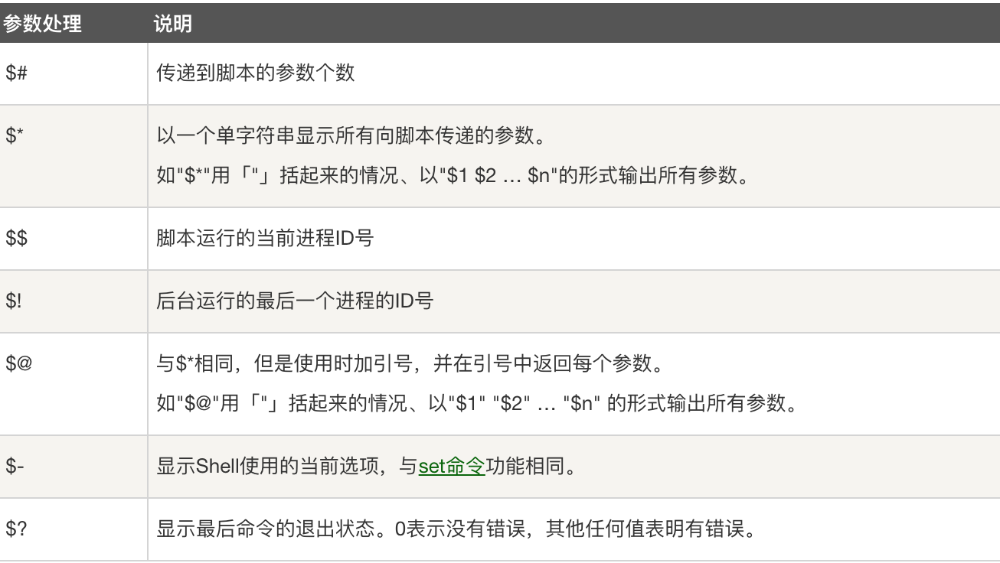
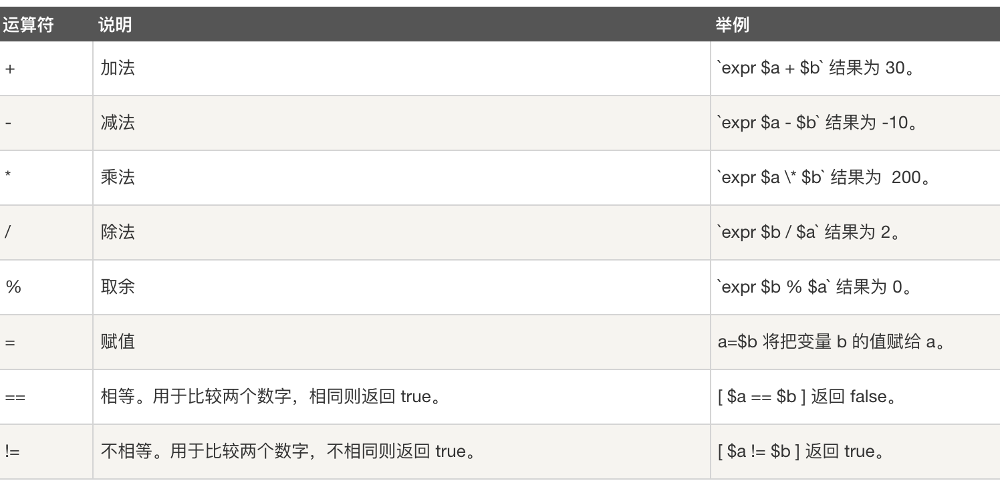

### shell

==#!== 是一个约定的标记，它告诉系统这个脚本需要什么解释器来执行，即使用哪一种 Shell。

#### 运行 Shell 脚本有两种方法：

##### 1. 作为可执行程序

​	将上面的代码保存为 test.sh，并 cd 到相应目录：

```shell
chmod +x ./test.sh  #使脚本具有执行权限
./test.sh  #执行脚本
```

注意，一定要写成 **./test.sh**，而不是 **test.sh**，运行其它二进制的程序也一样，直接写 test.sh，linux 系统会去 PATH 里寻找有没有叫 test.sh 的，而只有 /bin, /sbin, /usr/bin，/usr/sbin 等在 PATH 里，你的当前目录通常不在 PATH 里，所以写成 test.sh 是会找不到命令的，要用 ./test.sh 告诉系统说，就在当前目录找。

#### 2. 作为解释器参数

运行方式是，直接运行解释器，其参数就是 shell 脚本的文件名，如：

```bash
/bin/sh test.sh
/bin/php test.php
```

### shell 变量

注意，==变量名和等号之间不能有空格==，这可能和你熟悉的所有编程语言都不一样。

```shell
# 定义变量时，变量名不加美元符号
your_name="runoob.com"

# 变量名的命名须遵循如下规则：
	# 命名只能使用英文字母，数字和下划线，首个字符不能以数字开头。
	# 中间不能有空格，可以使用下划线 _。
	# 不能使用标点符号。
	# 不能使用bash里的关键字（可用help命令查看保留关键字）。
	
# 使用变量
# 使用一个定义过的变量，只要在变量名前面加美元符号即可
your_name="qinjx"
echo $your_name
echo ${your_name}

# 变量名外面的花括号是可选的，加不加都行，加花括号是为了帮助解释器识别变量的边界，比如下面这种情况：
for skill in Ada Coffe Action php; do
    echo "I am good at ${skill}Script"
done
# 结果
I am good at AdaScript
I am good at CoffeScript
I am good at ActionScript
I am good at JavaScript

# 只读变量
# 用 readonly 命令可以将变量定义为只读变量，只读变量的值不能被改变。
myUrl="https://www.google.com"
readonly myUrl
myUrl="https://www.runoob.com"
# 运行脚本，结果如下：
/bin/sh: NAME: This variable is read only.

# 删除变量
# 使用 unset 命令可以删除变量。语法：
unset variable_name


```

### shell 字符串

字符串是shell编程中最常用最有用的数据类型（除了数字和字符串，也没啥其它类型好用了），字符串可以用单引号，也可以用双引号，也可以不用引号。

单引号

```shell
str='this is a string'
```

单引号字符串的限制：

- 单引号里的任何字符都会原样输出，==单引号字符串中的变量是无效的==；
- 单引号字串中不能出现单独一个的单引号（对单引号使用转义符后也不行），但可成对出现，作为字符串拼接使用。

双引号

```shell
your_name="runoob"
str="Hello, I know you are \"$your_name\"! \n"
echo -e $str
# 输出结果为：
Hello, I know you are "runoob"! 
```

双引号的优点：

- 双引号里可以有变量
- 双引号里可以出现转义字符

```shell
# 拼接字符串
your_name="runoob"
# 使用双引号拼接
greeting="hello, "$your_name" !"
greeting_1="hello, ${your_name} !"
echo $greeting  $greeting_1
# 使用单引号拼接
greeting_2='hello, '$your_name' !'
greeting_3='hello, ${your_name} !'
echo $greeting_2  $greeting_3

# 输出结果为：
hello, runoob ! hello, runoob !
hello, runoob ! hello, ${your_name} 
```

**获取字符串长度**

```shell
string="abcd"
echo ${#string} #输出 4
```

 **提取字符串**

```shell
# 从字符串第 2 个字符开始截取 4 个字符：
string="runoob is a great site"
echo ${string:1:4} # 输出 unoo
```

**注意**：第一个字符的索引值为 **0**。

**查找子字符串**

```shell
# 查找字符 i 或 o 的位置(哪个字母先出现就计算哪个)：
string="runoob is a great site"
echo `expr index "$string" io`  # 输出 4
```

**注意：** 以上脚本中 **`** 是反引号，而不是单引号 **'**，不要看错了哦。

### shell 数组

bash支持一维数组（不支持多维数组），并且没有限定数组的大小。

数组元素的下标由 0 开始编号。获取数组中的元素要利用下标，下标可以是整数或算术表达式，其值应大于或等于 0。

**定义数组**

用括号来表示数组，数组元素用"空格"符号分割开。定义数组的一般形式为：

```shell
数组名=(值1 值2 ... 值n)

# 例如：
array_name=(value0 value1 value2 value3)
# 或者
array_name=(
value0
value1
value2
value3
)

# 还可以单独定义数组的各个分量，可以不使用连续的下标，而且下标的范围没有限制。
array_name[0]=value0
array_name[1]=value1
array_name[n]=valuen
```

**读取数组**

读取数组元素值的一般格式是：

```shell
${数组名[下标]}

# 使用 @ 符号可以获取数组中的所有元素，例如：
echo ${array_name[@]}
```

**获取数组的长度**

获取数组长度的方法与获取字符串长度的方法相同，例如：

```shell
# 取得数组元素的个数
length=${#array_name[@]}
# 或者
length=${#array_name[*]}
# 取得数组单个元素的长度
lengthn=${#array_name[n]}
```

### shell 传递参数

脚本内获取参数的格式为：**$n**。**n** 代表一个数字，1 为执行脚本的第一个参数，2 为执行脚本的第二个参数，以此类推……  其中 **$0** 为执行的文件名（包含文件路径）

另外，还有几个特殊字符用来处理参数：



\$* 与 $@ 区别：

- 相同点：都是引用所有参数。
- 不同点：只有在双引号中体现出来。假设在脚本运行时写了三个参数 1、2、3，，则 " * " 等价于 "1 2 3"（传递了一个参数），而 "@" 等价于 "1" "2" "3"（传递了三个参数）。

### shell 基本运算符

#### 1. 算术运算符

原生bash不支持简单的数学运算，但是可以通过其他命令来实现，例如 awk 和 expr，expr 最常用。

expr 是一款表达式计算工具，使用它能完成表达式的求值操作。

例如，两个数相加(注意使用的是反引号 ==`== 而不是单引号 =='== )：

```shell
val=`expr 2 + 2`
echo "两数之和为 : $val"
# 两数之和为 : 4
```

两点注意：

- 表达式和运算符之间要有空格，例如 2+2 是不对的，必须写成 2 + 2，这与我们熟悉的大多数编程语言不一样。
- 完整的表达式要被\` `包含，注意这个字符不是常用的单引号，在 Esc 键下边。



**注意：**条件表达式要放在方括号之间，并且要有空格，例如: **[\$a==$b]** 是错误的，必须写成 **[\$a == $b ]**。

- 乘号(*)前边必须加反斜杠(\\)才能实现乘法运算；

```shell
val=`expr $a \* $b`
echo "a * b : $val"
```

