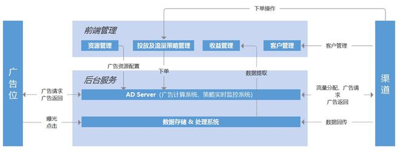
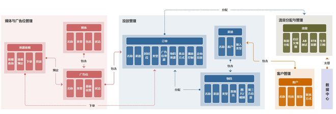
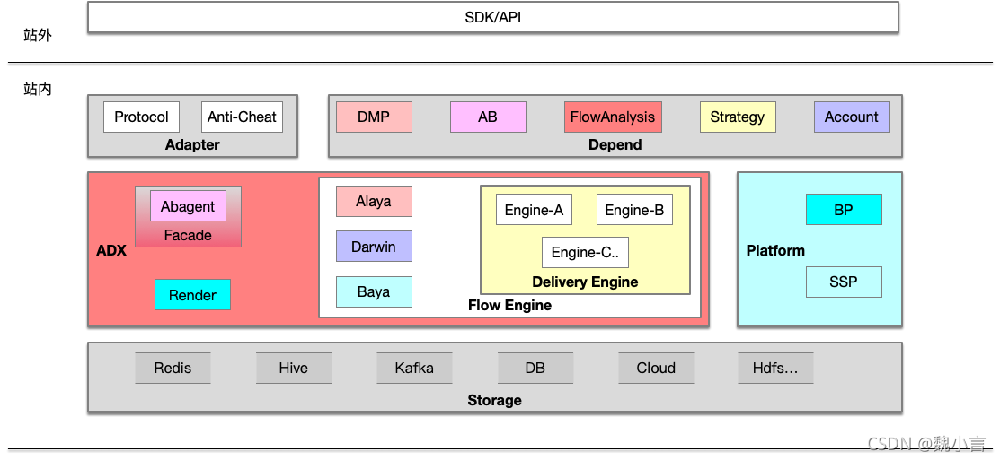
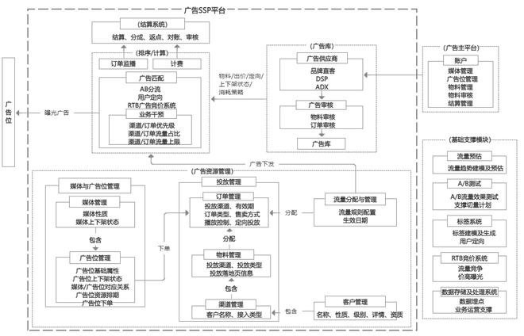
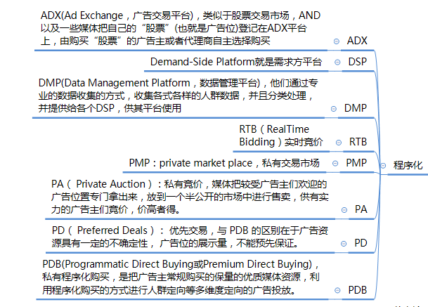

### 概念

 **SSP (全称Supply-Side Platform)，**即供应方平台，是服务于媒体端的广告平台。与DSP、DMP、Ad Exchang等共同构成广告技术生态体系。 

 作为一种新兴的媒体广告服务平台，SSP帮助媒体管理收入渠道，为优质媒体更有效地拓展品牌广告客户资源，提高了媒体收益。另外，SSP还为媒体提供了广告位管理、广告展现控制、资源补余设置等功能，满足了媒体在广告定位、投放、分析、反馈等环节中的自动化与定制需求。 

 在SSP服务平台上，媒体不但可以将自己的库存广告资源进行实时展示，而且可以与Ad Exchange、DSP等进行对接，实现即时售卖，获得最优化的展示收益。可以说，SSP平台的出现，使得大型媒体进行最优化售卖、中小媒体直接介人广告交易。都成为轻而易举的事情。

###  模式创新

 SSP目前支持两种购买模式：实时竞价(RTB)和程序化优质购买（PPB）。其中,实时竞价(RTB)是一种常规模式,被SSP服务商广泛采纳。 

但是，随着品牌广告主开始对程序化购买市场投入更多预算，广告主及代理公司不再仅仅希望自身品牌曝光率增加，更多的是希望利用媒体的优质流量通过程序化购买来进行品牌建设。但在一般情况下，广告主及代理公司通过程序化购买只能买到大量长尾资源，优质流量只能通过另一种售卖方式去实现。

为了解决这一问题，SSP推出了“程序化购买优先级交易模式”，为优质媒体及品牌广告主提供PPB“程序化优质购买"服务。通过动态分配资源和订单，优先满足大型媒体优质资源售卖需求,达到优质资源的价值最大化。

###  **接口开放** 

为了适应这一趋势, SSP面向优质客户开放了整套接口API。API（即应用程序编程接口），通过这个接口，媒体客户可以开发量身定制的系统功能。实现包括自动化管理广告资源、内部系统集成、定制特殊功能、单个平台管理多个账户等一系列功能。

SSP所提供的开放接口服务，不仅简化了广告营销体系中需求端与供应端之间繁杂的操作流程，同时很好地支持了OpenRTB竞价协议，从而为媒体灵活定制专有的服务模块提供了便利。

###  **“私人市场”** 

在私人市场中, SSP提供的优质的媒体和DSP的私有交易服务，允许媒体以特定的售卖策略提供特定流量给特定优质的DSP选择并进行一站式安全购买。

不同于一般RTB市场中，依附于AdExchange面向所有DSP需求方的开放竞拍方式，SSP“私人市场”充分满足了高端媒体的需求。它面向高质量广告主提供优质高价的广告位，为其提供具有价格优势的专属交易区域，优化供应方与需求方双向价值流，使得优质媒体与高端广告主能够在一个可控的市场中进行“端对端”闭环交易。

这种广告交易模式,一方面为高质量网络流量提供了VIP交易服务，可谓具有特色的“私人定制”，另一方面也强化了SSP服务平台与主流媒体的合作关系。

###  **广告形式丰富** 

在纷乱繁杂的网络广告市场中，要想成功抓住目标用户眼球，还需要丰富的表现形式吸引网络用户的注意力。因此，网络广告不仅仅是要新颖、有创造力，同样也要有打破传统的表现形式。

以移动应用为例，SSP在广告的展现形式方面融合了更多的富媒体技术，除支持传统普通Banner外，还支持了启动开屏广告、原生信息流广告、激励视频广告等表现形式。SSP对原生广告的支持，不仅体现了在形式上的可见性、互动体验性、分享性，而且体现于对盈利模式最大程度的转化。

面对碎片化的信息渠道，SSP将碎片化媒体资源集中整合后，在平台上进行投放、运营及评估，既帮助媒体实现了长尾价值，也在一定程度改善了当前媒体流量掌握在少数门户网站中，并且打破媒体之间封闭不合作的状态。

### 供应方平台（SSP）

程序化购买可以帮助媒体将剩余库存流量进行变现，提高媒体收入，作为资源供给方， 对于程序化购买的卷入程度在不断加深，对程序化购买的认知和接受程度相对较高。 供应方平台 SSP 是媒体的广告投放进行全方位的分析和管理的平台，是媒体优化自身收益的工具。 SSP 的主要功能在于帮助媒体对自身不同的广告位进行管理。

其功能包括：一、 管理广告位的分配，针对自身广告位的特点，选择是内部销售还是开放给广告交易平台，对于开放的广告位则需进一步管理是分配给哪个广告交易平台；二、筛选来自不同广告交易平台的广告请求，筛选广告主、监控广告素材；三、管理广告位价格，通过数据的积累对每个不同广告位的广告底价进行分析和调整。

大型媒体更倾向于搭建自有 SSP，部分门户、垂直网站以及中小型网站则选择使用服务商提供或搭建的 SSP。当前国内的市场环境中，出于自身资源管理的需要或内部数据安全的考虑，大型的门户网站往往更倾向于搭建自己内部的 SSP 系统。部分门户或垂直网站选择与服务商合作搭建 SSP，利用服务商提供的底层技术平台搭建自有的 SSP。而对于中型网站以及长尾的网站，出于人力物力投入的考虑，则往往选择直接使用成型的 SSP 产品。

###  SSP的系统架构 

 媒体对自有流量的管理，需要一个可供运营操作的前端管理平台，同时需要一个可进行广告策略计算、实时数据监控、数据存储和处理的广告服务。 

 另外，媒体作为流量的提供和售卖方，提供给广告主的流量承载形式是广告位。同时，SSP平台需要帮助媒体对接各种广告上游渠道，例如：ADX、DSP、品牌直客、自有广告等。 

 以下是系统架构： 

  

####  SSP的业务架构 

 SSP作为供媒体进行资源和流量策略管理的平台，从业务角度，需要让媒体可进行如下相关资源和策略的管理，因此需要给媒体提供一个管理平台，该管理平台主要包括如下功能： 

- **媒体和广告位管理：**主要是管理的媒体的广告位资源，以及相关流量的量级管理
- **投放管理：**主要处理的是将某个媒体的某些物料通过订单的形式下发给特定的广告位的整个流程
- **流量分配与管理：**主要进行的是相关流量策略管理，例如：流量优先级、流量权限、人工策略运营、算法策略运营、AB流量测试等
- **客户管理：**主要进行的渠道客户的管理

除了以上核心功能外，还包括管理平台本身相关的用户管理、角色管理、权限管理等。

以下是业务层面核心功能的业务架构：

  

####  

#### 全局链路架构

  

##### Adapter 适配

那么这个 `Adapter` 包含的 `Protocol\Anti-cheat` 等服务主要是适配处理什么呢？

主要两个部分，

Protocol：协议的转换 & 账号体系的映射 & token 校验 & …

- 在企业内部各服务模块 RPC/HTTP 通信通常是[自定义](https://blog.csdn.net/qq_34417408/article/details/120976238?spm=1001.2014.3001.5502) ，需要对第三方或站外流量进行一个转换；
- 不同产品的用户体系生成规则不同，需要对额外流量进行一个关系映射；
- 由于流量非站内，请求不可控，故需要进行类 token 机制的校验；

Anti-cheat：反作弊，也就是风控 & …

对非站内流量账号做马甲号、黑名单、风险评估…等系列反作弊的操作。

- 有同学可能就会问，为什么不和站内的一起做风控呢？
  **这里要注意，站内规则和站外规则不同，同时站外来源不同，规则也就不同，风控场景更加丰富。**

##### ADX 核心

`ADX` 核心可概要分为 `Facade\Rend\Flow Engine` 三部分，每部分承担的角色都不同。

- `Facade` 前置模块，用来对流量进行规则分流，其包含 AbTest …等功能模块[图中的 Abagent 是 AbTest 本地化的代理服务块，下文细述]；
- `FlowEngine` 流量引擎，主打库存分配、广告投放、广告竞价；
  - `Alaya` 用户画像功能模块。获取流量主体用户的画像去请求投放引擎；
  - `Darwin` 广告竞价模块。针对投放引擎返回的候选做实时统筹竞价；
  - `Baya` 媒体干预广告竞价配置模块。对各类候选进行规则处理；
  - `Delivery Engine` 投放引擎。为流量携带广告位匹配合适的广告候选；
- `Rend` 支持广告的实时渲染效果及样式；

##### Storage 存储

`Storage` 主流包括 `Redis\Hive\Kafka\Cloud`…存储组件。

> 不同的存储组件适应不同的数据。

比如 Redis 存储用户画像信息，读频次高，且实时变化；Hive 存储日志主字段，数据规模庞大，用于数据的离线分析；Kafka 通常作为缓存，削峰填谷，用于不同流的异步映射、消息生产消费等；Cloud 用于数据链路监控的数据存储及 Query 等等……

##### Depend 依赖

`Depend` 依赖核心含有 `DMP\AB\FlowAnalysis\Strategry\Account` …等组件；

- `DMP` 数据管理平台。用于用户实时标签，广告投放人群圈定，基于 ClickHouse 的上下文数据分析等;
- `AB` 数据实验平台。支持精细化运营，科学实验及方案决策等；
  FlowAnalysis 流量分析平台。对流量整体链路进行实时监控分析，便于各模块实时性能分析及数据快照等；
- `Strategy` 策略平台。对流量切分，广告竞价的算法策略调整具有统筹协调作用；
- `Account` 结算平台。支撑广告主结算、广告实际曝光、广告数据归因等；

### Platform 平台

`Platform` 平台主要介绍 `SSP \ BP` 。

- `SSP` 是媒体对广告链路干预配置平台。
- `BP` 是广告主投放广告，制定投放计划平台。

#### 总结 

 根据上述从流程角度、系统角度和业务角度对SSP平台的分析，可以得到如下SSP的架构图： 

  

####  中国程序化购买广告解析：RTB/DSP/Ad Exchange/SSP/DMP 

  