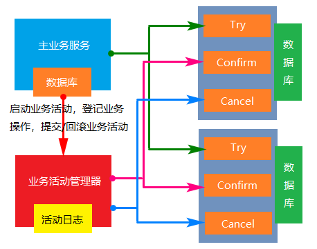
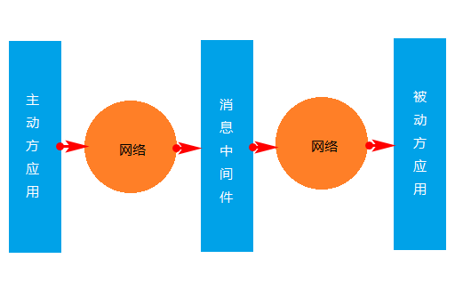
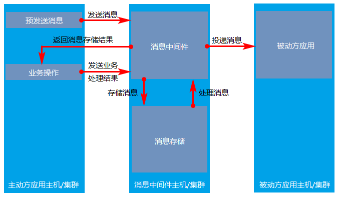
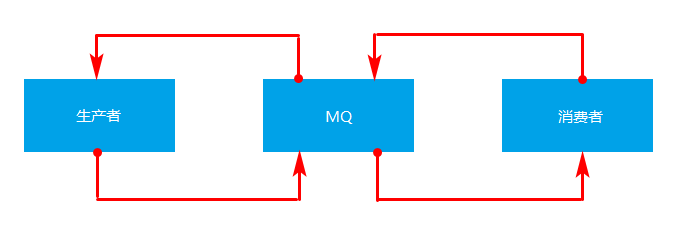
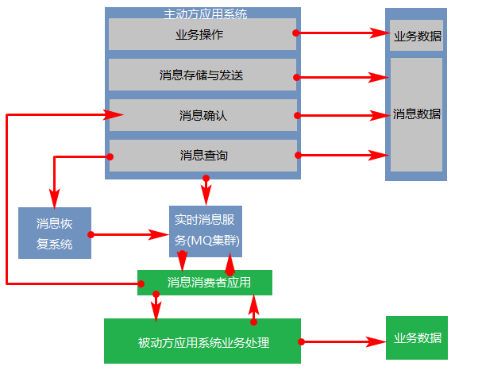
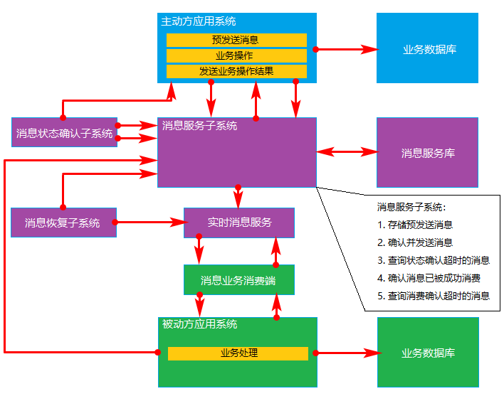

### 分布式事务中常见的三种解决方案

#### 1. 分布式事务前奏

- 事务：事务是由一组操作构成的可靠的独立的工作单元，事务具备ACID的特性，即原子性、一致性、隔离性和持久性。
- 本地事务：当事务由资源管理器本地管理时被称作本地事务。本地事务的优点就是支持严格的ACID特性，高效，可靠，状态可以只在资源管理器中维护，而且应用编程模型简单。但是本地事务不具备分布式事务的处理能力，隔离的最小单位受限于资源管理器。
- 全局事务：当事务由全局事务管理器进行全局管理时成为全局事务，事务管理器负责管理全局的事务状态和参与的资源，协同资源的一致提交回滚。
- TX协议：应用或者应用服务器与事务管理器的接口。
- XA协议：全局事务管理器与资源管理器的接口。XA是由X/Open组织提出的分布式事务规范。该规范主要定义了全局事务管理器和局部资源管理器之间的接口。主流的数据库产品都实现了XA接口。XA接口是一个双向的系统接口，在事务管理器以及多个资源管理器之间作为通信桥梁。之所以需要XA是因为在分布式系统中从理论上讲两台机器是无法达到一致性状态的，因此引入一个单点进行协调。由全局事务管理器管理和协调的事务可以跨越多个资源和进程。全局事务管理器一般使用XA二阶段协议与数据库进行交互。
- AP：应用程序，可以理解为使用DTP（Data Tools Platform）的程序。
- RM：资源管理器，这里可以是一个DBMS或者消息服务器管理系统，应用程序通过资源管理器对资源进行控制，资源必须实现XA定义的接口。资源管理器负责控制和管理实际的资源。
- TM：事务管理器，负责协调和管理事务，提供给AP编程接口以及管理资源管理器。事务管理器控制着全局事务，管理事务的生命周期，并且协调资源。
- 两阶段提交协议：XA用于在全局事务中协调多个资源的机制。TM和RM之间采取两阶段提交的方案来解决一致性问题。两节点提交需要一个协调者（TM）来掌控所有参与者（RM）节点的操作结果并且指引这些节点是否需要最终提交。两阶段提交的局限在于协议成本，准备阶段的持久成本，全局事务状态的持久成本，潜在故障点多带来的脆弱性，准备后，提交前的故障引发一系列隔离与恢复难题。
- BASE理论：BA指的是基本业务可用性，支持分区失败，S表示柔性状态，也就是允许短时间内不同步，E表示最终一致性，数据最终是一致的，但是实时是不一致的。原子性和持久性必须从根本上保障，为了可用性、性能和服务降级的需要，只有降低一致性和隔离性的要求。
- CAP定理：对于共享数据系统，最多只能同时拥有CAP其中的两个，任意两个都有其适应的场景，真是的业务系统中通常是ACID与CAP的混合体。分布式系统中最重要的是满足业务需求，而不是追求高度抽象，绝对的系统特性。C表示一致性，也就是所有用户看到的数据是一样的。A表示可用性，是指总能找到一个可用的数据副本。P表示分区容错性，能够容忍网络中断等故障。

- 柔性事务中的服务模式：
  1. 可查询操作：服务操作具有全局唯一的标识，操作唯一的确定的时间。
  2. 幂等操作：重复调用多次产生的业务结果与调用一次产生的结果相同。一是通过业务操作实现幂等性，二是系统缓存所有请求与处理的结果，最后是检测到重复请求之后，自动返回之前的处理结果。
  3. TCC操作：Try阶段，尝试执行业务，完成所有业务的检查，实现一致性；预留必须的业务资源，实现准隔离性。Confirm阶段：真正的去执行业务，不做任何检查，仅适用Try阶段预留的业务资源，Confirm操作还要满足幂等性。Cancel阶段：取消执行业务，释放Try阶段预留的业务资源，Cancel操作要满足幂等性。TCC与2PC(两阶段提交)协议的区别：TCC位于业务服务层而不是资源层，TCC没有单独准备阶段，Try操作兼备资源操作与准备的能力，TCC中Try操作可以灵活的选择业务资源，锁定粒度。TCC的开发成本比2PC高。实际上TCC也属于两阶段操作，但是TCC不等同于2PC操作。
  4. 可补偿操作：Do阶段：真正的执行业务处理，业务处理结果外部可见。Compensate阶段：抵消或者部分撤销正向业务操作的业务结果，补偿操作满足幂等性。约束：补偿操作在业务上可行，由于业务执行结果未隔离或者补偿不完整带来的风险与成本可控。实际上，TCC的Confirm和Cancel操作可以看做是补偿操作。


#### 2. 柔性事务解决方案架构

在电商领域等互联网场景下，传统的事务在数据库性能和处理能力上都暴露出了瓶颈。柔性事务有两个特性：基本可用和柔性状态。所谓基本可用是指分布式系统出现故障的时候允许损失一部分的可用性。柔性状态是指允许系统存在中间状态，这个中间状态不会影响系统整体的可用性，比如数据库读写分离的主从同步延迟等。柔性事务的一致性指的是最终一致性。

##### 

##### 1. 基于可靠消息的最终一致性方案概述


- 实现：业务处理服务在业务事务提交之前，向实时消息服务请求发送消息，实时消息服务只记录消息数据，而不是真正的发送。业务处理服务在业务事务提交之后，向实时消息服务确认发送。只有在得到确认发送指令后，实时消息服务才会真正发送。
- 消息：业务处理服务在业务事务回滚后，向实时消息服务取消发送。消息发送状态确认系统定期找到未确认发送或者回滚发送的消息，向业务处理服务询问消息状态，业务处理服务根据消息ID或者消息内容确认该消息是否有效。被动方的处理结果不会影响主动方的处理结果，被动方的消息处理操作是幂等操作。
- 成本：可靠的消息系统建设成本，一次消息发送需要两次请求，业务处理服务需要实现消息状态回查接口。
- 优点：消息数据独立存储，独立伸缩，降低业务系统和消息系统之间的耦合。对最终一致性时间敏感度较高，降低业务被动方的实现成本。兼容所有实现JMS标准的MQ中间件，确保业务数据可靠的前提下，实现业务的最终一致性，理想状态下是准实时的一致性。


##### 2. TCC事务补偿型方案



- 实现：一个完整的业务活动由一个主业务服务于若干的从业务服务组成。主业务服务负责发起并完成整个业务活动。从业务服务提供TCC型业务操作。业务活动管理器控制业务活动的一致性，它登记业务活动的操作，并在业务活动提交时确认所有的TCC型操作的Confirm操作，在业务活动取消时调用所有TCC型操作的Cancel操作。
- 成本：实现TCC操作的成本较高，业务活动结束的时候Confirm和Cancel操作的执行成本。业务活动的日志成本。
- 使用范围：强隔离性，严格一致性要求的业务活动。适用于执行时间较短的业务，比如处理账户或者收费等等。
- 特点：不与具体的服务框架耦合，位于业务服务层，而不是资源层，可以灵活的选择业务资源的锁定粒度。TCC里对每个服务资源操作的是本地事务，数据被锁住的时间短，可扩展性好，可以说是为独立部署的SOA服务而设计的。


##### 3. 最大努力通知型


- 实现：业务活动的主动方在完成处理之后向业务活动的被动方发送消息，允许消息丢失。业务活动的被动方根据定时策略，向业务活动的主动方查询，恢复丢失的业务消息。
- 约束：被动方的处理结果不影响主动方的处理结果。
- 成本：业务查询与校对系统的建设成本。
- 使用范围：对业务最终一致性的时间敏感度低。跨企业的业务活动。
- 特点：业务活动的主动方在完成业务处理之后，向业务活动的被动方发送通知消息。主动方可以设置时间阶梯通知规则，在通知失败后按规则重复通知，知道通知N次后不再通知。主动方提供校对查询接口给被动方按需校对查询，用户恢复丢失的业务消息。
- 适用范围：银行通知，商户通知。


#### 3. 基于可靠消息的最终一致性方案详解

##### 1. 消息发送一致性

消息中间件在分布式系统中的核心作用就是异步通讯、应用解耦和并发缓冲（也叫作流量削峰）。在分布式环境下，需要通过网络进行通讯，就引入了数据传输的不确定性，也就是CAP理论中的分区容错性。



消息发送一致性是指产生消息的业务动作与消息发送一致，也就是说如果业务操作成功，那么由这个业务操作所产生的消息一定要发送出去，否则就丢失。

处理方式一

```java
public void completeOrderService() {
	// 处理订单
	order.process();
    
	// 发送会计原始凭证消息
	pipe.sendAccountingVouchetMessage();
}
```

在上面的情况中，如果业务操作成功，执行的消息发送之前应用发生故障，消息发送不出去，导致消息丢失，将会产生订单系统与会计系统的数据不一致。如果消息系统或者网络异常，也会导致消息发送不出去，也会造成数据不一致。

处理方式二

```java
public void completeOrderService() {
	// 发送会计原始凭证消息
	pipe.sendAccountingVouchetMessage();
	
	// 处理订单
	order.process();
}
```

如果将上面的两个操作调换一下顺序，这种情况就会更加不可控了，消息发出去了业务订单可能会失败，会造成订单系统与业务系统的数据不一致。那么JMS标准中的XA协议是否可以保障发送的一致性？

- JMS协议标准的API中，有很多以XA开头的接口，其实就是前面讲到的支持XA协议（基于两阶段提交协议）的全局事务型接口。

```java
XAConnection.class
XAConnectionFactory.class
XAQueueConnection.class
XAQueueConnectionFactory.class
XASession.class
XATopicConnection.class
XATopicConnectionFactory.class
XATopicSession.class
```

- JMS中的XA系列的接口可以提供分布式事务的支持。但是引用XA方式的分布式事务，就会带来很多局限性。
  1. 要求业务操作的资源必须支持XA协议，但是并不是所有的资源都支持XA协议。
  2. 两阶段提交协议的成本。
  3. 持久化成本等DTP模型的局限性，例如：全局锁定、成本高、性能低。
  4. 使用XA协议违背了柔性事务的初衷。


##### 2. 保证消息一致的变通做法



1. 发送消息：主动方现将应用把消息发给消息中间件，消息状态标记为“待确认”状态。
2. 消息中间件收到消息后，把消息持久化到消息存储中，但是并不影响被动方投递消息。
3. 消息中间件返回消息持久化结果，主动方根据返回的结果进行判断如何进行业务操作处理：
   1. 失败：放弃执行业务操作处理，结束，必要时向上层返回处理结果。
   2. 成功：执行业务操作处理。
4. 业务操作完成后，把业务操作结果返回给消息中间件。
5. 消息中间件收到业务操作结构后，根据业务结果进行处理：
   1. 失败：删除消息存储中的消息，结束。
   2. 成功：更新消息存储中的消息状态为“待发送”，然后执行消息投递。
6. 前面的正向流程都成功之后，向被动方应用投递消息。但是在上面的处理流程中，任何一个环节都有可能出现问题。


##### 3. 常规MQ消息处理流程和特点



- 常规的MQ队列处理流程无法实现消息的一致性。
- 投递消息的本质就是消息消费，可以细化。


##### 4. 消息重复发送问题和业务接口幂等性设计


对于未确认的消息，采用按规则重新投递的方式进行处理。对于以上流程，消息重复发送会导致业务处理接口出现重复调用的问题。消息消费过程中消息重复发送的主要原因就是消费者成功接收处理完消息后，消息中间件没有及时更新投递状态导致的。如果允许消息重复发送，那么消费方应该实现业务接口的幂等性设计。


##### 5. 本地消息服务方案



- 实现思路：
  1. 主动方应用系统通过业务操作完成业务数据的操作，在准备发送消息的时候将消息存储在主动方应用系统一份，另一份发送到实时消息服务
  2. 被动方应用系统监听实时消息系统中的消息，当被动方完成消息处理后通过调用主动方接口完成消息确认
  3. 主动方接收到消息确认以后删除消息数据。
  4. 通过消息查询服务查询到消息被接收之后再规定的时间内没有返回ACK确认消息就通过消息恢复系统重新发送消息。
- 优点：
  1. 消息的时效性比较高
  2. 从应用设计的角度实现了消息数据的可靠性，消息数据的可靠性不依赖于MQ中间件，弱化了对MQ中间件特性的依赖。
  3. 方案轻量级，容易实现。
- 缺点：
  1. 与具体的业务场景绑定，耦合性强，不可以共用。
  2. 消息数据与业务数据同步，占用业务系统资源。
  3. 业务系统在使用关系型数据库的情况下消息服务性能会受到关系型数据库的并发性能限制。


##### 6. 独立消息服务方案



- 实现思路：
  1. 预发送消息：主动方应用系统预发送消息，由消息服务子系统存储消息，如果存储失败，那么也就无法进行业务操作。如果返回存储成功，然后执行业务操作。
  2. 执行业务操作：执行业务操作如果成功的时候，将业务操作执行成功的状态发送到消息服务子系统。消息服务子系统修改消息的标识为“可发送”状态。
  3. 发送消息到实时消息服务：当消息的状态发生改变的时候，立刻将消息发送到实时消息服务中。接下来，消息将会被消息业务的消费端监听到，然后被消费。
  4. 消息状态子系统：相当于定时任务系统，在消息服务子系统中定时查找确认超时的消息，在主动方应用系统中也去定时查找没有处理成功的任务，进行相应的处理。
  5. 消息消费：当消息被消费的时候，向实时消息服务发送ACK，然后实时消息服务删除消息。同时调用消息服务子系统修改消息为“被消费”状态。
  6. 消息恢复子系统：当消费方返回消息的时候，由于网络中断等其他原因导致消息没有及时确认，那么需要消息恢复子系统定时查找出在消息服务子系统中没有确认的消息。将没有被确认的消息放到实时消息服务中，进行重做，因为被动方应用系统的接口是幂等的。
- 优点：
  1. 消息服务独立部署，独立维护，独立伸缩。
  2. 消息存储可以按需选择不同的数据库来集成实现。
  3. 消息服务可以被相同的的使用场景使用，降低重复建设服务的成本。
  4. 从分布式服务应用设计开发角度实现了消息数据的可靠性，消息数据的可靠性不依赖于MQ中间件，弱化了对MQ中间件特性的依赖。
  5. 降低了业务系统与消息系统之间的耦合，有利于系统的扩展维护。
- 缺点：
  1. 一次消息发送需要两次请求。
  2. 主动方应用系统需要实现业务操作状态的校验与查询接口。


##### 7. 消息服务子系统的设计实现

示例消息数据表：


### 分布式事务的解决方案

#### 2pc（两个阶段提交）


#### 3pc（三个阶段提交）

#### TCC


#### MQ最终一致性

最终一致性事务需要解决的主要难点

1 消息百分百投递成功

​    结合comfirm机制

2 消息百分百消费成功

   结合ack机制

  并且要解决幂等性问题

##### MQ分布式事务基础

###### confirm机制

概念

pro 发送消息到broker , broker 接收到消息后，产生回送响应Pro中有一个Confirm Listener 异步监听响应应答

步骤：

消息的确认Pro投递消息后，如果Broker接收消息，则会给Pro一个应答

Pro接收应答用来确定这条消息是否正常地发送到Broker,该法也是消息可靠性投递的核心保障！


