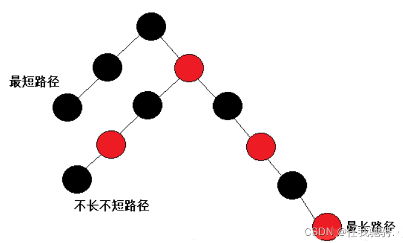

### 数据结构

数据结构是指相互之间存在着一种或多种关系的数据元素的集合和该集合中数据元素之间的关系组成 。常用的数据结构有：数组，栈，链表，队列，树，图，堆，散列表等，如图所示：


#### 数组

数组是可以再内存中连续存储多个元素的结构，在内存中的分配也是连续的，数组中的元素通过数组下标进行访问，数组下标从0开始。例如下面这段代码就是将数组的第一个元素赋值为 1。

````c
int[] data = new int[100]；data[0]  = 1;
````

**数组的特点**

1. 在内存中数组是一块连续的区域

2. 数组需要预留空间

   在使用前需要提前申请所占内存的大小，这样不知道需要多大的空间，就预先申请可能会浪费内存空间，即数组空间利用率低

   PS：数组的空间在编译阶段就需要进行确定，所以需要提前给出数组空间的大小(在运行阶段是不允许改变的)

3. 在数组起始位置处，插入数据和删除数据效率低。

   插入数据时，待插入位置的元素和它后面的所有元素都需要向后搬移

   删除数据时，待删除位置的所有元素都需要先前搬移

4. 随机访问效率高，时间复杂度可以达到O(1)

   因为数组的内存是连续的，想要访问那个元素，直接从数组的首地址处向后偏移就可以访问到了

5. 数组开辟的空间，在不够使用的时候需要扩容，扩容的话，就会涉及到需要把旧数据中的所有元素向新数组中搬移

6. 数组的空间是从栈分配的

数组的优点： 
 1、按照索引查询元素速度快 
 2、按照索引遍历数组方便

缺点：  

 1、数组的大小固定后就无法扩容了 

 2、数组只能存储一种类型的数据 

 3、添加，删除的操作慢，因为要移动其他的元素。时间复杂度为O(N)

 4、空间利用率不高

 5、内存空间要求高，必须有足够的连续的内存空间

适用场景： 
 频繁查询，对存储空间要求不大，很少增加和删除的情况。


#### 栈

栈是一种特殊的线性表，仅能在线性表的一端操作，栈顶允许操作，栈底不允许操作。 栈的特点是：先进后出，或者说是后进先出，从栈顶放入元素的操作叫入栈，取出元素叫出栈。


栈的结构就像一个集装箱，越先放进去的东西越晚才能拿出来，所以，栈常应用于实现递归功能方面的场景，例如[斐波那契数列]


#### 队列

队列与栈一样，也是一种线性表，不同的是，队列可以在一端添加元素，在另一端取出元素，也就是：先进先出。从一端放入元素的操作称为入队，取出元素为出队，示例图如下：


使用场景：因为队列先进先出的特点，在多线程阻塞队列管理中非常适用。


#### 链表

链表是物理存储单元上非连续的、非顺序的存储结构，数据元素的逻辑顺序是通过链表的指针地址实现，每个元素包含两个结点，一个是存储元素的数据域 (内存空间)，另一个是指向下一个结点地址的指针域。根据指针的指向，链表能形成不同的结构，例如[单链表](https://www.zhihu.com/search?q=单链表&search_source=Entity&hybrid_search_source=Entity&hybrid_search_extra={"sourceType"%3A"answer"%2C"sourceId"%3A1361122057})，双向链表，循环链表等。


**链表的特点**

1. 在内存中，元素的空间可以在任意地方，空间是分散的，不需要连续

2. 链表中的元素都会有两个属性，一个是元素的值，另一个是指针，此指针标记了下一个元素的地址

   每一个数据都会保存下一个数据的内存的地址，通过此地址可以找到下一个数据

3. 查找数据时效率低，时间复杂度为O(N)

   因为链表的空间是分散的，所以不具有随机访问性，如果需要访问某个位置的数据，需要从第一个数据开始找起，依次往后遍历，直到找到待查询的位置，故可能在查找某个元素时，时间复杂度达到O(N)

4. 空间不需要提前指定大小，是动态申请的，根据需求动态的申请和删除内存空间，扩展方便，故空间的利用率高

5. 任意位置插入元素和删除元素的效率高，时间复杂度为O(1)

6. 链表的空间是从堆中分配的


链表的优点： 链表是很常用的一种数据结构，不需要初始化容量，可以任意加减元素； 添加或者删除元素时只需要改变前后两个元素结点的指针域指向地址即可，所以添加，删除很快；内存利用率高，不会浪费内存。

缺点： 因为含有大量的指针域，占用空间较大； 查找元素需要[遍历链表](https://www.zhihu.com/search?q=遍历链表&search_source=Entity&hybrid_search_source=Entity&hybrid_search_extra={"sourceType"%3A"answer"%2C"sourceId"%3A1361122057})来查找，非常耗时。

适用场景： 数据量较小，需要频繁增加，删除操作的场景


综上：

对于想要快速访问数据，不经常有插入和删除元素的时候，选择数组

对于需要经常的插入和删除元素，而对访问元素时的效率没有很高要求的话，选择链表

#### 树

树是一种数据结构，它是由n（n>=1）个[有限节点](https://www.zhihu.com/search?q=有限节点&search_source=Entity&hybrid_search_source=Entity&hybrid_search_extra={"sourceType"%3A"answer"%2C"sourceId"%3A1361122057})组成一个具有层次关系的集合。把它叫做 “树” 是因为它看起来像一棵倒挂的树，也就是说它是根朝上，而叶朝下的。它具有以下的特点：


每个节点有零个或多个子节点；

没有父节点的节点称为根节点；

每一个[非根节点](https://www.zhihu.com/search?q=非根节点&search_source=Entity&hybrid_search_source=Entity&hybrid_search_extra={"sourceType"%3A"answer"%2C"sourceId"%3A1361122057})有且只有一个父节点；

除了根节点外，每个子节点可以分为多个不相交的子树；

在日常的应用中，我们讨论和用的更多的是树的其中一种结构，就是二叉树。

#### 散列表

散列表，也叫哈希表，是根据关键码和值 (key和value) 直接进行访问的数据结构，通过key和value来映射到集合中的一个位置，这样就可以很快找到集合中的对应元素。

记录的存储位置=f(key) 

这里的对应关系 f 成为散列函数，又称为哈希 ([hash函数](https://www.zhihu.com/search?q=hash函数&search_source=Entity&hybrid_search_source=Entity&hybrid_search_extra={"sourceType"%3A"answer"%2C"sourceId"%3A1361122057}))，而散列表就是把Key通过一个固定的算法函数既所谓的哈希函数转换成一个[整型数字](https://www.zhihu.com/search?q=整型数字&search_source=Entity&hybrid_search_source=Entity&hybrid_search_extra={"sourceType"%3A"answer"%2C"sourceId"%3A1361122057})，然后就将该数字对数组长度进行取余，取余结果就当作数组的下标，将value存储在以该数字为下标的数组空间里，这种存储空间可以充分利用数组的查找优势来查找元素，所以查找的速度很快。

哈希表在应用中也是比较常见的，就如Java中有些集合类就是借鉴了哈希原理构造的，例如HashMap，HashTable等，利用[hash表](https://www.zhihu.com/search?q=hash表&search_source=Entity&hybrid_search_source=Entity&hybrid_search_extra={"sourceType"%3A"answer"%2C"sourceId"%3A1361122057})的优势，对于集合的查找元素时非常方便的，然而，因为哈希表是基于数组衍生的数据结构，在添加删除元素方面是比较慢的，所以很多时候需要用到一种数组链表来做，也就是拉链法。拉链法是数组结合链表的一种结构，较早前的hashMap底层的存储就是采用这种结构，直到jdk1.8之后才换成了数组加[红黑树](https://www.zhihu.com/search?q=红黑树&search_source=Entity&hybrid_search_source=Entity&hybrid_search_extra={"sourceType"%3A"answer"%2C"sourceId"%3A1361122057})的结构，其示例图如下：


从图中可以看出，左边很明显是个数组，数组的每个成员包括一个指针，指向一个链表的头，当然这个链表可能为空，也可能元素很多。我们根据元素的一些特征把元素分配到不同的链表中去，也是根据这些特征，找到正确的链表，再从链表中找出这个元素。 

哈希表的应用场景很多，当然也有很多问题要考虑，比如哈希冲突的问题，如果处理的不好会浪费大量的时间，导致应用崩溃。


#### 图

图是由结点的有穷集合V和边的集合E组成。其中，为了与树形结构加以区别，在图结构中常常将结点称为顶点，边是顶点的有序偶对，若两个顶点之间存在一条边，就表示这两个顶点具有相邻关系。

按照顶点指向的方向可分为[无向图](https://www.zhihu.com/search?q=无向图&search_source=Entity&hybrid_search_source=Entity&hybrid_search_extra={"sourceType"%3A"answer"%2C"sourceId"%3A1361122057})和有向图：


图是一种比较复杂的数据结构，在存储数据上有着比较复杂和高效的算法，分别有邻接矩阵 、邻接表、十字链表、邻接多重表、边集数组等存储结构，这里不做展开，读者有兴趣可以自己学习深入。


#### 红黑树

##### 红黑树的性质

1. 每个节点不是红色就是黑色
2. 根节点是黑色的
3. 如果一个节点是红色的，则它的两个孩子节点是黑色的
4. 对于每个节点，从该节点到其所有后代叶节点的简单路径上，均包含相同数目的黑色节点
5. 每个叶子节点都是黑色的

为什么满足上面的性质，红黑树就能保证：其最长路径中节点个数不会超过最短路径节点个数的两倍？



我们分析一下：
最短路径为全黑，最长路径就是红黑节点交替（因为红色节点不能连续），每条路径的黑色节点相同，则最长路径、刚好是最短路径的两倍。

在节点的定义中，为什么要将节点的默认颜色给成红色的？

插入红色节点树的性质可能不会改变，而插入黑色节点每次都会违反性质4
通过性质发现： 将节点设置为红色在插入时对红黑树造成的影响是小的，而黑色是最大的
总结：将红黑树的节点默认颜色设置为红色，是为尽可能减少在插入新节点对红黑树造成的影响。