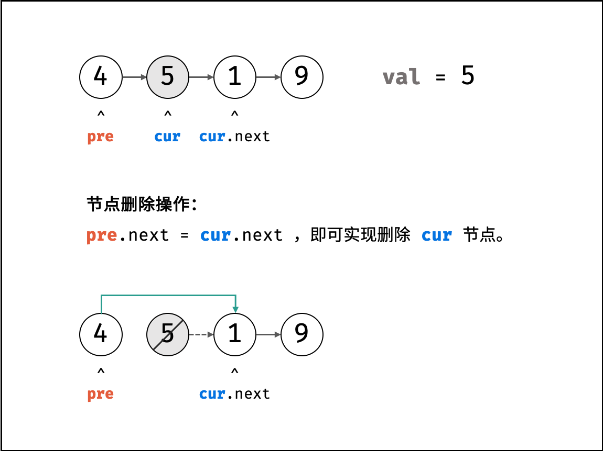
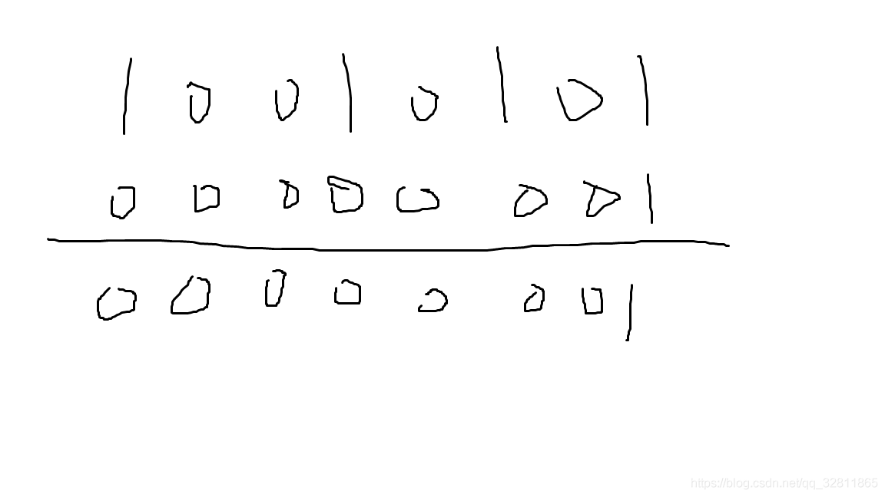

#### 二维数组中的查找https://blog.algomooc.com/003.html#%E4%B8%80%E3%80%81%E9%A2%98%E7%9B%AE%E6%8F%8F%E8%BF%B0

问题描述

```
在一个 n * m 的二维数组中，每一行都按照从左到右递增的顺序排序，每一列都按照从上到下递增的顺序排序。请完成一个高效的函数，输入这样的一个二维数组和一个整数，判断数组中是否含有该整数。
```

示例：

现有矩阵 matrix 如下：

```
[
  [1,   4,  7, 11, 15],
  [2,   5,  8, 12, 19],
  [3,   6,  9, 16, 22],
  [10, 13, 14, 17, 24],
  [18, 21, 23, 26, 30]
]
```

给定 target = `5`，返回 `true`。

给定 target = `20`，返回 `false`。

**限制：**

```
0 <= n <= 1000
0 <= m <= 1000
```

```go
// 二维数组中查找
func findNumberIn2DArray(arr [][]int, target int) bool {
	if len(arr) == 0 {
		return false
	}

	// 每列数组长度
	col := len(arr[0])
	row := 0 // 初始行
	for row < len(arr) && col > 0 {
		// 如果相等，直接返回
		if arr[row][col] == target {
			return true
		} else if arr[row][col] > target { // 大于，向左移动一列，缩小矩阵范围
			col--
		} else { // 小于就向下移动一行
			row++
		}
	}
	return false
}

```

#### 从尾到头打印链表

 输入一个链表的头节点，从尾到头反过来返回每个节点的值（用数组返回）。 

 **示例 1：** 

```
输入：head = [1,3,2]
输出：[2,3,1]
```

```go
// 从尾到头打印链表
type ListNode struct {
	Val  int
	Next *ListNode
}

func reversePrint(head *ListNode) []int {
	res := make([]int, 0)
	if head == nil {
		return res
	}

	for head != nil {
		res = append(res, head.Val)
		head = head.Next
	}

	for i, j := 0, len(res)-1; i < j; {
		res[i], res[j] = res[j], res[i]
		i++
		j--
	}

	return res
}

```

#### 重建二叉树

输入某二叉树的前序遍历和中序遍历的结果，请构建该二叉树并返回其根节点。

假设输入的前序遍历和中序遍历的结果中都不含重复的数字。

 **示例 1:** 

  

```
Input: preorder = [3,9,20,15,7], inorder = [9,3,15,20,7]
Output: [3,9,20,null,null,15,7]
```

 **示例 2:** 

```
Input: preorder = [-1], inorder = [-1]
Output: [-1]
```

```go
// 重建二叉树
type TreeNode struct {
	Val   int
	Left  *TreeNode
	Right *TreeNode
}

func buildTree(preorder []int, inorder []int) *TreeNode {
	if len(preorder) == 0 {
		return nil
	}

	index := 0
	// 遍历中序，并找到根节点的位置
	for ; index < len(inorder); index++ {
		if preorder[0] == inorder[index] {
			break
		}
	}

	root := &TreeNode{}
	root.Val = preorder[0] // 根节点
	// 递归左子树
	root.Left = buildTree(preorder[1:index+1], inorder[0:index])
	// 递归右子树
	root.Right = buildTree(preorder[index+1:], inorder[index+1:])

	return root
}

```


#### 旋转数组最小数字

把一个数组最开始的若干个元素搬到数组的末尾，我们称之为数组的旋转。

给你一个可能存在 重复 元素值的数组 numbers ，它原来是一个升序排列的数组，并按上述情形进行了一次旋转。请返回旋转数组的最小元素。例如，数组 [3,4,5,1,2] 为 [1,2,3,4,5] 的一次旋转，该数组的最小值为 1。  

注意，数组 [a[0], a[1], a[2], ..., a[n-1]] 旋转一次 的结果为数组 [a[n-1], a[0], a[1], a[2], ..., a[n-2]] 。

 ```
示例 1：
输入：numbers = [3,4,5,1,2]
输出：1

示例 2：
输入：numbers = [2,2,2,0,1]
输出：0
 ```

```go
// 旋转数组的最小元素
/*
	思路：二分查找
	我们考虑数组中的最后一个元素，
		在最小值右侧的元素都比它小，
		在最小值左侧的元素都比它大，
	假设数组开始和最后的下标分别为low, high
	中间元素下标为mid
	会有三种情况
	1. arr[mid] < arr[high] : 中间元素在最小值的左侧，所以可舍弃右侧元素；则：hight = mid
	2. arr[mid] > arr[high] : 中间元素在最小值的右侧，所以可舍弃左侧元素；则：low = mid + 1
	3. arr[mid] == arr[high] : 因为有重复元素的存在，我们并不清楚最小值在右侧还是左侧，我们唯一知道的是，他们的
		元素，所以无论arr[high]是不是最小值，都有一个它的替代品arr[mid],因此可以忽略区间的右端点

*/
func minArray(arr []int) int {
	if len(arr) < 2 {
		return arr[0]
	}

	low := 0 // 左端点
	high := len(arr) - 1 // 右端点
	for low < high {
		mid := int((low + high) / 2) // 中间端点
		if arr[mid] < arr[high] { // 情景1
			high = mid
		} else if arr[mid] > arr[high] { // 情景2
			low = mid + 1
		} else { // 情景3
			high--
		}
	}

	return arr[low]
}

```


#### 斐波那契数列

 写一个函数，输入 `n` ，求斐波那契（Fibonacci）数列的第 `n` 项（即 `F(N)`）。斐波那契数列的定义如下： 

````
F(0) = 0,   F(1) = 1
F(N) = F(N - 1) + F(N - 2), 其中 N > 1.
````

````
示例 1：
输入：n = 2
输出：1

示例 2：
输入：n = 5
输出：5
````

```go
// 解法1
func fib1(n int) int {
    if n < 2 {
        return n
    }
    return fib1(n-1) + fib1(n-2)
}

// 解法2，优化解法
/*
根据状态转移方程和边界条件，可以得到时间复杂度和空间复杂度都是 O(n) 的实现。由于 F(n) 只和 F(n-1) 与 F(n-2) 有关，因此可以使用「滚动数组思想」把空间复杂度优化成 O(1)。
*/
func fib2(n int) int {
    mod := 1000000007
    if n < 2 {
        return n
    }
    
    p, q, r := 0, 0, 1
    for i := 2; i < n; i++ {
        p = q
        p = r
        r = (p + q) % mod
    }
    
    return r
}
```

#### 二进制中1的个数

 编写一个函数，输入是一个无符号整数（以二进制串的形式），返回其二进制表达式中数字位数为 '1' 的个数（也被称为 [汉明重量](http://en.wikipedia.org/wiki/Hamming_weight)).）。 

```
示例 1：

输入：n = 11 (控制台输入 00000000000000000000000000001011)
输出：3
解释：输入的二进制串 00000000000000000000000000001011 中，共有三位为 '1'。

示例 2：

输入：n = 128 (控制台输入 00000000000000000000000010000000)
输出：1
解释：输入的二进制串 00000000000000000000000010000000 中，共有一位为 '1'。

示例 3：

输入：n = 4294967293 (控制台输入 11111111111111111111111111111101，部分语言中 n = -3）
输出：31
解释：输入的二进制串 11111111111111111111111111111101 中，共有 31 位为 '1'。

```

```go
/*
观察这个运算：n & (n−1)，其预算结果恰为把 n 的二进制位中的最低位的 1 变为 0 之后的结果。

如：6 & (6-1) = 4, 6 = (110), 4 = (100)，运算结果 4 即为把 6 的二进制位中的最低位的 1 变为 0 之后的结果。

这样我们可以利用这个位运算的性质加速我们的检查过程，在实际代码中，我们不断让当前的 n 与 n - 1 做与运算，直到 n 变为 0 即可。因为每次运算会使得 n 的最低位的 1 被翻转，因此运算次数就等于 n 的二进制位中 1 的个数。
*/
func hammingWeight(num uint32) int {
    count := 0
    for num > 0 {
        count++
        num = (num - 1) & num // 与操作，直接得出1的个数
    }
    return count
}
```

#### 数值的整数次方

实现pow(x, n), 即计算x的n次幂函数(即，x^n).不得使用库函数，同时不需要考虑大数问题。

```go
示例 1：
输入：x = 2.00000, n = 10
输出：1024.00000

示例 2：
输入：x = 2.10000, n = 3
输出：9.26100

示例 3：
输入：x = 2.00000, n = -2
输出：0.25000
解释：2-2 = 1/22 = 1/4 = 0.25
```

```go
func myPow(x float64, n int) float64 {
    result := 1.0
    if n < 0 {
        x = 1 / x
        n = -n
    }
    
    for n > 0 {
        if n & 1 == 1 { // 等价于 n % 2 == 1
            result *= x
        }
        x *= x
        n >> 1 // 指数减半
    }
    return result
}
```

#### 打印 1 到最大的 n 位数

 输入数字 `n`，按顺序打印出从 1 到最大的 n 位十进制数。比如输入 3，则打印出 1、2、3 一直到最大的 3 位数 999。

 ````
示例 1:
输入: n = 1
输出: [1,2,3,4,5,6,7,8,9]
 ````

```go
// 暴力法
func printNumbers(n int) []int {
    res := make([]int, 0)
    count := 1
    for i := 1; i < n; i++ {
        count *= 10
    }
    
    for i := 0; i < count; i++ {
        res = append(res, i)
    }
    return res
}
```


#### 删除链表的节点

给定单向链表的头指针和一个要删除的节点的值，定义一个函数删除该节点。

返回删除后的链表的头节点。

```
示例 1:
输入: head = [4,5,1,9], val = 5
输出: [4,1,9]
解释: 给定你链表中值为 5 的第二个节点，那么在调用了你的函数之后，该链表应变为 4 -> 1 -> 9.

示例 2:
输入: head = [4,5,1,9], val = 1
输出: [4,5,9]
解释: 给定你链表中值为 1 的第三个节点，那么在调用了你的函数之后，该链表应变为 4 -> 5 -> 9.
```

解题思路：
本题删除值为 val 的节点分需为两步：定位节点、修改引用。

定位节点： 遍历链表，直到 head.val == val 时跳出，即可定位目标节点。
修改引用： 设节点 cur 的前驱节点为 pre ，后继节点为 cur.next ；则执行 pre.next = cur.next ，即可实现删除 cur 节点。

 

算法流程：
特例处理： 当应删除头节点 head 时，直接返回 head.next 即可。
初始化： pre = head , cur = head.next 。
定位节点： 当 cur 为空 或 cur 节点值等于 val 时跳出。
保存当前节点索引，即 pre = cur 。
遍历下一节点，即 cur = cur.next 。
删除节点： 若 cur 指向某节点，则执行 pre.next = cur.next ；若 cur 指向 nullnull ，代表链表中不包含值为 val 的节点。
返回值： 返回链表头部节点 head 即可。

```go
// 解法1，不考虑O(1),遍历
type ListNode struct {
    Val int
    Next *ListNode
}
func deleteNode1(head *ListNode) {
    if head == nil {
        return
    }
    
    for head.Next != nil {
        if head.Next == val {
            head.Next = head.Next.Next
        }
        head = head.Next
    }
}

// 解法2, 双指针解法
func deleteNode2(head *ListNode, val int) *ListNode {
    // 头节点可能是待删除的节点
    if head.Val == val {
        return head.Next
    }
    pre，cur = head,head
    for cur != nil && cur.Val != val {
        pre, cur = cur, cur.Next
    }
    
    if cur != nil {
        pre.Next = cur.Next
    }
    return head
}
```


#### 调整数组顺序使奇数位于偶数前面

 输入一个整数数组，实现一个函数来调整该数组中数字的顺序，使得所有奇数在数组的前半部分，所有偶数在数组的后半部分。 

##### 判断一个数的奇偶性(题外话)

1、n%2=1 就是奇数，n%2=0就是偶数

2、n&1=1就是奇数，n&1=0就是偶数，

利用与运算判断奇偶性的原理是：将n转化成2进制后的第一位于1进行与运算。【n转换成2进制，右边第一位为1的就是奇数，第一位为0 的就是偶数】运算的时候补零，零和任何数进行与运算都等于零，可忽略，所以是只计算最后一位即可，
  

```
示例：                               
输入：nums = [1,2,3,4]
输出：[1,3,2,4] 
注：[3,1,2,4] 也是正确的答案之一。
```

```go
/*
1、判断奇偶
(nums[i]&1)==1 奇数判断，原理：奇数的最低位为1
ps：注意位运算的优先级比较低，不要吝啬括号的使用
*/
func exchange(nums []int) []int {
    if len(nums) == 0 {
        return nil
    }
    
    left, right := 0, len(nums)-1
    for left < right {
        // 奇数判断
        for left < right && (nums[left]&1) == 1 {
            left++
        }
        // 偶数判断
        for left <right && (nums[right]&1) == 0 {
            right--
        }
        if left < right {
            nums[left], nums[right] = nums[right], nums[left]
        }
    }
    return nums
}
```

#### 链表中倒数第k个节点

输入一个链表，输出该链表中倒数第k个节点。为了符合大多数人的习惯，本题从1开始计数，即链表的尾节点是倒数第1个节点。

例如，一个链表有 6 个节点，从头节点开始，它们的值依次是 1、2、3、4、5、6。这个链表的倒数第 3 个节点是值为 4 的节点。

```
示例：
给定一个链表: 1->2->3->4->5, 和 k = 2.
返回链表 4->5.
```

 思路：两个指针，一个指向头，一个先走 k 步，简称：快慢指针 

```go
func getKthFromEnd(head *ListNode, k int) *ListNode {
    fast, slow := head, head
    for fast != nil && k > 0 {
        fast = fast.Next
        k--
    }
    for fast != nil {
        fast = fast.Next
        slow = slow.Next
    }
    return slow
}
```

#### 反转链表

 给定单链表的头节点 `head` ，请反转链表，并返回反转后的链表的头节点。 

```
示例 1：
输入：head = [1,2,3,4,5]
输出：[5,4,3,2,1]

示例 2：
输入：head = [1,2]
输出：[2,1]

示例 3：
输入：head = []
输出：[]
```

```go
// 非递归解法
/*
假设链表为 1->2->3->∅，我们想要把它改成∅←1←2←3。

在遍历链表时，将当前节点的 next 指针改为指向前一个节点。由于节点没有引用其前一个节点，因此必须事先存储其前一个节点。在更改引用之前，还需要存储后一个节点。最后返回新的头引用。
*/
func reverseList(head *ListNode) *ListNode {
   prev *ListNode
    cur := head
    for cur != nil {
        next := cur.Next // 保存下一个节点
        cur.Next = prev
        prev = cur
        cur = next
    }
    return prev
    
}

// 解法2，递归
// 假设链表的其余部分已经被反转，现在应该如何反转它前面的部分？
func reverseList(head *ListNode) *ListNode {
    if head == nil || head.Next == nil {
        return head
    }
    newHead := reverseList(head.Next)
    // 希望k+1的下一个节点指向k,则 k.Next.Next = k
    head.Next.Next = head
    // 需要注意的是，n1的下一个节点必须指向nil,如果
    head.Hext = nil
    return newHead
}

```


#### 合并两个排序的链表

```
示例1：
输入：1->2->4, 1->3->4
输出：1->1->2->3->4->4
```

```go
// 非递归
func mergeTwoList(l1 *ListNode, l2 *ListNode) *ListNode {
    dummy := &ListNode{}
    tail := dummy
    for l1 != nil && l2 != nil {
        if l1.Val < l2.Val {
            tail.Next = l1
            l1 = l1.Next
        } else {
            tail.Next = l2
            l2 = l2.Next
        }
        // 链表向下移动
        tail = tail.Next
    }
    
    if l1 != nil {
        tail.Next = l1
    }
    if l2 != nil {
        tail.Next = l2
    }
    return tail
}

// 递归
func mergeTwoList(l1 *ListNode, l2 *ListNode) *ListNode {
    if l1 == nil {
        return l2
    }
    
    if l2 == nil {
        return  l1
    }
    
    // 交换元素
    if l1.Val > l2.Val {
        l1, l2 = l2, l1
    }
    l1.Next = mergeTwoList(l1.Next, l2)
    return l1
}
```

####  树的子结构

输入两棵二叉树A和B，判断B是不是A的子结构。(约定空树不是任意一个树的子结构)

B是A的子结构， 即 A中有出现和B相同的结构和节点值。

####  归并排序

```go
package main

import "fmt"

func main() {
	arr := []int{125, 22, 3, 45, 56, 6, 7, 85, 9, -9, -90}
	arr = mergeSort(arr)
	fmt.Println(arr)
}

func mergeSort(arr []int) []int {
	if len(arr) <= 1 {
		return arr
	}

	central := len(arr) / 2 // 从中间分隔，直到只有一个元素开始合并
	lefts := mergeSort(arr[:central])
	rights := mergeSort(arr[central:])
	return merge(lefts, rights) // 合并数组
}

func merge(l []int, r []int) []int {
	llen := len(l)
	rlen := len(r)
	res := make([]int, 0)
	lIndex, rIndex := 0, 0 // 两个切片初始的下标，插入一个数据，下标加1
	for lIndex < llen && rIndex < rlen {
		if l[lIndex] > r[rIndex] {
			res = append(res, r[rIndex])
			rIndex++
		} else {
			res = append(res, lIndex)
			lIndex++
		}
	}

	// 左边还有剩余元素
	if lIndex < llen {
		res = append(res, l[lIndex:]...)
	}
	// 右边还有剩余
	if rIndex < rlen {
		res = append(res, r[rIndex:]...)
	}

	return res
}
```


